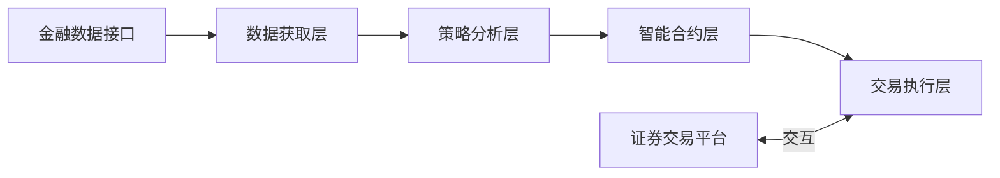

# 如何将特价股票策略融入智能合约自动化投资

> 关键词：特价股票策略、智能合约、自动化投资、区块链、金融科技、量化交易、策略实现

> 摘要：本文深入探讨了将特价股票策略融入智能合约以实现自动化投资的相关内容。首先介绍了背景知识，包括目的范围、预期读者等。接着阐述了特价股票策略和智能合约的核心概念及其联系，详细讲解了核心算法原理和具体操作步骤，给出了相关数学模型和公式并举例说明。通过项目实战，展示了开发环境搭建、源代码实现及解读。分析了实际应用场景，推荐了学习、开发所需的工具和资源。最后总结了未来发展趋势与挑战，解答了常见问题并提供了扩展阅读和参考资料，旨在为投资者和开发者提供全面的指导，帮助他们更好地实现特价股票策略在智能合约自动化投资中的应用。

## 1. 背景介绍 
### 1.1 目的和范围
在当今金融市场中，投资者不断寻求更高效、更智能的投资方式。特价股票策略是一种基于股票价格相对价值的投资策略，旨在寻找被市场低估的股票进行投资。而智能合约作为区块链技术的重要应用，具有自动化执行、不可篡改等特性，为投资领域带来了新的机遇。本文的目的在于探讨如何将特价股票策略与智能合约相结合，实现自动化投资，提高投资效率和准确性。

本文的范围涵盖了特价股票策略的原理、智能合约的基本概念、核心算法的实现、数学模型的构建、项目实战的具体步骤、实际应用场景的分析，以及相关工具和资源的推荐等方面。通过全面的介绍，帮助读者深入理解并掌握将特价股票策略融入智能合约自动化投资的方法。

### 1.2 预期读者
本文预期读者包括金融投资者、金融科技开发者、区块链技术爱好者、量化交易从业者以及对智能投资感兴趣的相关人士。对于投资者而言，本文可以帮助他们了解如何利用智能合约实现特价股票策略的自动化投资，提高投资收益；对于开发者来说，提供了具体的技术实现思路和代码示例，有助于他们开发相关的智能合约应用；对于区块链技术爱好者和量化交易从业者，能够拓宽他们的技术视野和投资思路。

### 1.3 文档结构概述
本文将按照以下结构进行阐述：首先介绍核心概念与联系，包括特价股票策略和智能合约的原理及架构；接着详细讲解核心算法原理和具体操作步骤，并给出 Python 代码示例；然后介绍数学模型和公式，通过具体例子进行说明；再通过项目实战，展示开发环境搭建、源代码实现和代码解读；分析实际应用场景；推荐相关的工具和资源；最后总结未来发展趋势与挑战，解答常见问题并提供扩展阅读和参考资料。

### 1.4 术语表
#### 1.4.1 核心术语定义
- **特价股票策略**：一种投资策略，通过分析股票的基本面、市场价格等因素，寻找被市场低估的股票进行投资，期望在股票价格回归其内在价值时获得收益。
- **智能合约**：一种以计算机代码形式编写的合约，运行在区块链上，能够自动执行合约条款，无需第三方干预。
- **自动化投资**：利用计算机程序和算法，根据预设的投资策略自动进行投资决策和交易操作。
- **区块链**：一种分布式账本技术，具有去中心化、不可篡改、共识机制等特点，为智能合约的运行提供了安全可靠的环境。
- **量化交易**：运用数学和统计学方法，通过计算机程序进行交易决策和执行的交易方式。

#### 1.4.2 相关概念解释
- **股票估值**：评估股票的内在价值，常用的方法包括市盈率法、市净率法、现金流折现法等。特价股票策略通常基于股票估值来寻找被低估的股票。
- **合约执行**：智能合约在满足预设条件时自动执行相应的操作，例如买入或卖出股票。
- **去中心化**：区块链系统中不存在单一的中心化机构，数据和交易记录由多个节点共同维护，提高了系统的安全性和可靠性。
- **共识机制**：区块链网络中节点达成一致的算法，确保数据的一致性和不可篡改性。常见的共识机制有工作量证明（PoW）、权益证明（PoS）等。

#### 1.4.3 缩略词列表
- **PoW**：Proof of Work，工作量证明
- **PoS**：Proof of Stake，权益证明
- **API**：Application Programming Interface，应用程序编程接口
- **ETH**：Ether，以太坊的加密货币
- **ERC-20**：Ethereum Request for Comments 20，以太坊代币标准

## 2. 核心概念与联系 
### 2.1 特价股票策略原理
特价股票策略的核心思想是寻找市场中价格低于其内在价值的股票。投资者通过分析公司的财务报表、行业前景、竞争力等因素，评估股票的内在价值。常用的估值指标包括市盈率（P/E）、市净率（P/B）、股息率等。例如，当一只股票的市盈率低于行业平均水平，且公司的基本面良好时，可能被认为是被低估的特价股票。

### 2.2 智能合约原理
智能合约是一种自动执行的合约，以代码形式存在于区块链上。它基于预设的条件和规则，在满足条件时自动执行相应的操作。智能合约的执行是由区块链网络中的节点共同验证和记录的，具有不可篡改和透明的特点。例如，一个简单的智能合约可以规定，当股票价格达到某个特定值时，自动执行买入或卖出操作。

### 2.3 两者的联系与架构
将特价股票策略融入智能合约自动化投资的架构可以分为以下几个部分：

- **数据获取层**：通过金融数据接口（如雅虎财经 API、Alpha Vantage API 等）获取股票的实时价格、财务报表等数据。
- **策略分析层**：运用特价股票策略对获取的数据进行分析，判断哪些股票是被低估的特价股票。
- **智能合约层**：将特价股票策略转化为智能合约代码，部署到区块链上。智能合约根据策略分析的结果，自动执行买入或卖出操作。
- **交易执行层**：智能合约与证券交易平台进行交互，执行买入或卖出指令。

以下是该架构的 Mermaid 流程图：


## 3. 核心算法原理 & 具体操作步骤 
### 3.1 核心算法原理
核心算法的主要目的是实现特价股票策略的自动化分析和决策。具体步骤如下：

1. **数据预处理**：对获取的股票数据进行清洗和整理，去除异常值和缺失值。
2. **估值计算**：根据选定的估值指标（如市盈率、市净率等）计算股票的估值。
3. **特价股票筛选**：将计算得到的估值与市场价格进行比较，筛选出价格低于估值的特价股票。
4. **交易决策**：根据预设的投资规则，决定是否买入或卖出特价股票。

### 3.2 具体操作步骤
#### 步骤 1：数据获取
使用 Python 的 `requests` 库从金融数据接口获取股票数据。以下是一个示例代码：
```python
import requests

# 以 Alpha Vantage API 为例，获取股票的历史价格数据
api_key = 'YOUR_API_KEY'
symbol = 'AAPL'
url = f'https://www.alphavantage.co/query?function=TIME_SERIES_DAILY&symbol={symbol}&apikey={api_key}'
response = requests.get(url)
data = response.json()
print(data)
```

#### 步骤 2：数据预处理
对获取的数据进行清洗和整理，去除缺失值和异常值。以下是一个简单的示例：
```python
import pandas as pd

# 将数据转换为 DataFrame 格式
df = pd.DataFrame(data['Time Series (Daily)']).T
df = df.astype(float)

# 去除缺失值
df = df.dropna()

print(df)
```

#### 步骤 3：估值计算
以市盈率为例，计算股票的估值。假设已知公司的每股收益（EPS），可以通过以下代码计算市盈率：
```python
# 假设每股收益为 5 美元
eps = 5

# 计算市盈率
df['P/E'] = df['4. close'] / eps

print(df['P/E'])
```

#### 步骤 4：特价股票筛选
筛选出市盈率低于行业平均水平的股票。假设行业平均市盈率为 20：
```python
industry_pe = 20

# 筛选出市盈率低于行业平均水平的股票
bargain_stocks = df[df['P/E'] < industry_pe]

print(bargain_stocks)
```

#### 步骤 5：交易决策
根据预设的投资规则，决定是否买入或卖出特价股票。以下是一个简单的示例：
```python
# 假设当股票价格低于估值的 80% 时买入
buy_threshold = 0.8

# 计算估值的 80%
bargain_stocks['buy_price'] = bargain_stocks['P/E'] * eps * buy_threshold

# 判断是否买入
bargain_stocks['buy_signal'] = bargain_stocks['4. close'] < bargain_stocks['buy_price']

print(bargain_stocks[['4. close', 'buy_price', 'buy_signal']])
```

## 4. 数学模型和公式 & 详细讲解 & 举例说明 
### 4.1 市盈率模型
市盈率（P/E）是最常用的股票估值指标之一，其计算公式为：
$$P/E = \frac{P}{EPS}$$
其中，$P$ 为股票的市场价格，$EPS$ 为每股收益。

市盈率反映了投资者为获得每一元净利润所愿意支付的价格。一般来说，市盈率越低，股票越有可能被低估。

例如，某股票的市场价格为 100 美元，每股收益为 5 美元，则该股票的市盈率为：
$$P/E = \frac{100}{5} = 20$$

### 4.2 市净率模型
市净率（P/B）也是常用的股票估值指标，其计算公式为：
$$P/B = \frac{P}{BVPS}$$
其中，$P$ 为股票的市场价格，$BVPS$ 为每股净资产。

市净率反映了股票价格与每股净资产的关系。一般来说，市净率越低，股票的投资价值越高。

例如，某股票的市场价格为 50 美元，每股净资产为 10 美元，则该股票的市净率为：
$$P/B = \frac{50}{10} = 5$$

### 4.3 股息率模型
股息率（Dividend Yield）是指股息与股票价格的比率，其计算公式为：
$$Dividend\ Yield = \frac{D}{P}$$
其中，$D$ 为每股股息，$P$ 为股票的市场价格。

股息率反映了股票的分红能力。一般来说，股息率越高，股票的投资价值越高。

例如，某股票的每股股息为 2 美元，市场价格为 50 美元，则该股票的股息率为：
$$Dividend\ Yield = \frac{2}{50} = 0.04 = 4\%$$

### 4.4 举例说明
假设我们要评估三只股票 A、B、C 的投资价值，相关数据如下：

| 股票 | 市场价格（美元） | 每股收益（美元） | 每股净资产（美元） | 每股股息（美元） |
| ---- | ---- | ---- | ---- | ---- |
| A | 100 | 5 | 20 | 2 |
| B | 80 | 4 | 15 | 1.5 |
| C | 120 | 6 | 25 | 2.5 |

#### 市盈率计算
- 股票 A 的市盈率：$P/E_A = \frac{100}{5} = 20$
- 股票 B 的市盈率：$P/E_B = \frac{80}{4} = 20$
- 股票 C 的市盈率：$P/E_C = \frac{120}{6} = 20$

#### 市净率计算
- 股票 A 的市净率：$P/B_A = \frac{100}{20} = 5$
- 股票 B 的市净率：$P/B_B = \frac{80}{15} \approx 5.33$
- 股票 C 的市净率：$P/B_C = \frac{120}{25} = 4.8$

#### 股息率计算
- 股票 A 的股息率：$Dividend\ Yield_A = \frac{2}{100} = 0.02 = 2\%$
- 股票 B 的股息率：$Dividend\ Yield_B = \frac{1.5}{80} = 0.01875 = 1.875\%$
- 股票 C 的股息率：$Dividend\ Yield_C = \frac{2.5}{120} \approx 0.02083 = 2.083\%$

从以上计算结果可以看出，股票 C 的市净率最低，股息率相对较高，可能是最具有投资价值的股票。

## 5. 项目实战：代码实际案例和详细解释说明 
### 5.1  开发环境搭建
#### 5.1.1 安装 Python
首先需要安装 Python 环境，建议使用 Python 3.7 及以上版本。可以从 Python 官方网站（https://www.python.org/downloads/）下载并安装。

#### 5.1.2 安装必要的库
使用 `pip` 安装以下必要的库：
```sh
pip install requests pandas web3
```
- `requests`：用于发送 HTTP 请求，获取金融数据。
- `pandas`：用于数据处理和分析。
- `web3`：用于与以太坊区块链进行交互，部署和执行智能合约。

#### 5.1.3 配置以太坊开发环境
如果要在以太坊上部署智能合约，需要安装以太坊客户端（如 Ganache）和 Truffle 框架。

- **安装 Ganache**：从 Ganache 官方网站（https://www.trufflesuite.com/ganache）下载并安装。
- **安装 Truffle**：使用 `npm` 安装 Truffle：
```sh
npm install -g truffle
```

### 5.2  源代码详细实现和代码解读
#### 5.2.1 数据获取和分析代码
```python
import requests
import pandas as pd

# 以 Alpha Vantage API 为例，获取股票的历史价格数据
api_key = 'YOUR_API_KEY'
symbol = 'AAPL'
url = f'https://www.alphavantage.co/query?function=TIME_SERIES_DAILY&symbol={symbol}&apikey={api_key}'
response = requests.get(url)
data = response.json()

# 将数据转换为 DataFrame 格式
df = pd.DataFrame(data['Time Series (Daily)']).T
df = df.astype(float)

# 去除缺失值
df = df.dropna()

# 假设每股收益为 5 美元
eps = 5

# 计算市盈率
df['P/E'] = df['4. close'] / eps

# 假设行业平均市盈率为 20
industry_pe = 20

# 筛选出市盈率低于行业平均水平的股票
bargain_stocks = df[df['P/E'] < industry_pe]

print(bargain_stocks)
```
**代码解读**：
- 首先使用 `requests` 库从 Alpha Vantage API 获取苹果公司（AAPL）的历史价格数据。
- 将数据转换为 `pandas` 的 `DataFrame` 格式，并进行数据清洗，去除缺失值。
- 假设每股收益为 5 美元，计算市盈率。
- 设定行业平均市盈率为 20，筛选出市盈率低于行业平均水平的股票。

#### 5.2.2 智能合约代码（Solidity）
```solidity
pragma solidity ^0.8.0;

contract StockInvestment {
    address public owner;
    mapping(string => bool) public buySignals;

    constructor() {
        owner = msg.sender;
    }

    function setBuySignal(string memory symbol, bool signal) public {
        require(msg.sender == owner, "Only owner can set buy signals");
        buySignals[symbol] = signal;
    }

    function getBuySignal(string memory symbol) public view returns (bool) {
        return buySignals[symbol];
    }
}
```
**代码解读**：
- 定义了一个名为 `StockInvestment` 的智能合约。
- `owner` 变量存储合约的所有者地址。
- `buySignals` 是一个映射，用于存储股票的买入信号。
- `constructor` 函数在合约部署时初始化 `owner` 变量。
- `setBuySignal` 函数用于设置股票的买入信号，只有合约所有者可以调用该函数。
- `getBuySignal` 函数用于获取股票的买入信号。

#### 5.2.3 Python 与智能合约交互代码
```python
from web3 import Web3

# 连接到 Ganache 本地节点
w3 = Web3(Web3.HTTPProvider('http://127.0.0.1:7545'))

# 检查连接是否成功
if not w3.isConnected():
    print("Failed to connect to the Ethereum node")
else:
    print("Connected to the Ethereum node")

# 部署的智能合约地址
contract_address = 'YOUR_CONTRACT_ADDRESS'

# 智能合约的 ABI（应用二进制接口）
abi = [
    {
        "constant": false,
        "inputs": [
            {
                "name": "symbol",
                "type": "string"
            },
            {
                "name": "signal",
                "type": "bool"
            }
        ],
        "name": "setBuySignal",
        "outputs": [],
        "payable": false,
        "stateMutability": "nonpayable",
        "type": "function"
    },
    {
        "constant": true,
        "inputs": [
            {
                "name": "symbol",
                "type": "string"
            }
        ],
        "name": "getBuySignal",
        "outputs": [
            {
                "name": "",
                "type": "bool"
            }
        ],
        "payable": false,
        "stateMutability": "view",
        "type": "function"
    },
    {
        "constant": true,
        "inputs": [],
        "name": "owner",
        "outputs": [
            {
                "name": "",
                "type": "address"
            }
        ],
        "payable": false,
        "stateMutability": "view",
        "type": "function"
    }
]

# 获取智能合约实例
contract = w3.eth.contract(address=contract_address, abi=abi)

# 设置买入信号
symbol = 'AAPL'
buy_signal = True
tx_hash = contract.functions.setBuySignal(symbol, buy_signal).transact({'from': w3.eth.accounts[0]})
w3.eth.waitForTransactionReceipt(tx_hash)

# 获取买入信号
result = contract.functions.getBuySignal(symbol).call()
print(f"Buy signal for {symbol}: {result}")
```
**代码解读**：
- 使用 `web3` 库连接到 Ganache 本地节点。
- 检查连接是否成功。
- 定义智能合约的地址和 ABI。
- 获取智能合约实例。
- 调用 `setBuySignal` 函数设置苹果公司股票的买入信号。
- 调用 `getBuySignal` 函数获取苹果公司股票的买入信号并打印结果。

### 5.3  代码解读与分析
#### 数据获取和分析部分
通过 `requests` 库从金融数据接口获取股票数据，使用 `pandas` 库进行数据处理和分析。这种方式可以方便地获取和处理大量的股票数据，为后续的策略分析提供基础。

#### 智能合约部分
使用 Solidity 语言编写智能合约，实现了股票买入信号的设置和获取功能。智能合约的代码简单易懂，通过映射存储股票的买入信号，确保数据的安全性和不可篡改性。

#### Python 与智能合约交互部分
使用 `web3` 库与以太坊区块链进行交互，部署和执行智能合约。通过调用智能合约的函数，可以实现自动化的投资决策和交易操作。

## 6. 实际应用场景 
### 6.1 个人投资者
个人投资者可以利用特价股票策略和智能合约实现自动化投资。通过设置合理的投资规则，智能合约可以根据股票的估值和市场价格自动判断是否买入或卖出股票，提高投资效率和准确性。例如，个人投资者可以将一部分资金投入到基于特价股票策略的智能合约中，让合约自动进行投资，无需时刻关注市场行情。

### 6.2 投资机构
投资机构可以使用特价股票策略和智能合约进行大规模的资产配置和投资管理。智能合约可以根据机构的投资策略和风险偏好，自动筛选特价股票并进行交易，降低人工操作的成本和风险。同时，智能合约的透明性和不可篡改性可以提高投资的可信度和合规性。

### 6.3 量化交易平台
量化交易平台可以将特价股票策略和智能合约集成到平台中，为用户提供更加智能、便捷的投资服务。用户可以根据自己的需求选择不同的特价股票策略，平台通过智能合约自动执行交易，实现量化交易的自动化和智能化。

## 7. 工具和资源推荐
### 7.1 学习资源推荐
#### 7.1.1 书籍推荐
- 《聪明的投资者》（The Intelligent Investor）：本杰明·格雷厄姆（Benjamin Graham）著，被誉为投资领域的圣经，介绍了价值投资的基本理念和方法，对特价股票策略有重要的指导意义。
- 《区块链技术指南》：邹均、陈初等著，全面介绍了区块链的技术原理、应用场景和发展趋势，对理解智能合约和区块链技术有很大帮助。
- 《Python 金融数据分析实战》：魏佳斌著，详细介绍了使用 Python 进行金融数据分析和量化交易的方法和技巧，适合开发者学习。

#### 7.1.2 在线课程
- Coursera 上的“区块链基础”（Blockchain Basics）课程：由普林斯顿大学教授讲授，介绍了区块链的基本概念、技术原理和应用场景。
- Udemy 上的“Python 量化交易实战”（Python for Algorithmic Trading）课程：通过实际案例介绍了使用 Python 进行量化交易的方法和技巧。
- edX 上的“智能合约开发”（Smart Contract Development）课程：介绍了智能合约的开发流程和技术，适合开发者学习。

#### 7.1.3 技术博客和网站
- Medium 上的区块链和金融科技相关博客：有很多专业人士分享区块链和金融科技的最新技术和应用案例。
- CoinDesk：提供区块链和加密货币的最新新闻和分析。
- Seeking Alpha：提供股票分析和投资建议，对特价股票策略有一定的参考价值。

### 7.2 开发工具框架推荐
#### 7.2.1 IDE和编辑器
- Visual Studio Code：一款轻量级的代码编辑器，支持多种编程语言和插件，适合智能合约开发和 Python 编程。
- Remix：以太坊官方提供的在线智能合约开发环境，支持 Solidity 语言的编写、编译和部署。
- PyCharm：一款专业的 Python 集成开发环境，提供代码调试、自动补全、版本控制等功能，适合 Python 开发者使用。

#### 7.2.2 调试和性能分析工具
- Ganache：以太坊的本地开发和测试环境，提供模拟的区块链网络，方便开发者进行智能合约的调试和测试。
- Truffle：以太坊的开发框架，提供合约编译、部署、测试等功能，简化了智能合约的开发流程。
- Web3.py：Python 与以太坊区块链交互的库，提供了丰富的 API，方便开发者进行智能合约的调用和数据查询。

#### 7.2.3 相关框架和库
- Pandas：Python 的数据处理和分析库，提供了高效的数据结构和数据处理方法，适合金融数据的处理和分析。
- NumPy：Python 的科学计算库，提供了多维数组和矩阵运算的功能，为金融数据分析提供了基础。
- Scikit-learn：Python 的机器学习库，提供了各种机器学习算法和工具，可用于股票价格预测和投资策略优化。

### 7.3 相关论文著作推荐
#### 7.3.1 经典论文
- “Bitcoin: A Peer-to-Peer Electronic Cash System”：中本聪（Satoshi Nakamoto）著，介绍了比特币的技术原理和设计思路，是区块链技术的奠基之作。
- “Ethereum: A Next-Generation Smart Contract and Decentralized Application Platform”：维塔利克·布特林（Vitalik Buterin）著，介绍了以太坊的技术架构和智能合约的应用场景。
- “Value Investing: The Use of Historical Financial Statement Information to Separate Winners from Losers”：约瑟夫·D·皮奥特罗斯基（Joseph D. Piotroski）著，介绍了价值投资的基本方法和策略，对特价股票策略有重要的参考价值。

#### 7.3.2 最新研究成果
- 关注 IEEE、ACM 等学术会议和期刊上关于区块链、金融科技和量化交易的最新研究成果，了解行业的最新发展趋势和技术创新。
- 关注知名研究机构（如 MIT 媒体实验室、斯坦福大学区块链研究中心等）的研究报告和论文，获取前沿的研究成果和观点。

#### 7.3.3 应用案例分析
- 分析国内外知名金融机构和科技公司在区块链和智能合约领域的应用案例，了解实际应用中的技术挑战和解决方案。
- 关注区块链和金融科技领域的创业公司，学习他们的创新模式和商业应用案例。

## 8. 总结：未来发展趋势与挑战
### 8.1 未来发展趋势
- **智能化程度不断提高**：随着人工智能和机器学习技术的发展，特价股票策略和智能合约的智能化程度将不断提高。智能合约可以通过学习历史数据和市场行情，自动优化投资策略，提高投资收益。
- **与其他技术融合**：特价股票策略和智能合约将与物联网、大数据、云计算等技术深度融合，实现更加高效、智能的投资管理。例如，通过物联网设备获取企业的实时生产数据，为特价股票策略提供更准确的信息。
- **应用场景不断拓展**：除了股票投资领域，特价股票策略和智能合约还将在债券、期货、外汇等金融市场得到广泛应用。同时，也将拓展到供应链金融、保险等非金融领域，为各行业的发展提供支持。

### 8.2 挑战
- **法律法规不完善**：区块链和智能合约作为新兴技术，相关的法律法规还不完善。在实际应用中，可能会面临法律风险和监管难题。例如，智能合约的法律效力、投资者权益保护等问题需要进一步明确。
- **技术安全性问题**：区块链和智能合约的安全性是其应用的关键。虽然区块链具有不可篡改和去中心化的特点，但仍然存在黑客攻击、智能合约漏洞等安全风险。例如，曾经发生过的以太坊智能合约漏洞事件，导致大量资金被盗。
- **数据质量和隐私问题**：特价股票策略和智能合约的运行依赖于大量的金融数据。数据的质量和隐私问题是需要解决的重要挑战。例如，数据的准确性、完整性和及时性会影响投资决策的准确性；数据的隐私保护问题也需要得到重视，确保投资者的个人信息和交易数据不被泄露。

## 9. 附录：常见问题与解答
### 9.1 如何选择合适的金融数据接口？
选择金融数据接口时，需要考虑以下因素：
- **数据准确性和完整性**：确保接口提供的数据准确、完整，能够满足投资策略的需求。
- **数据更新频率**：根据投资策略的要求，选择数据更新频率合适的接口。例如，对于实时交易策略，需要选择实时更新数据的接口。
- **接口稳定性和可靠性**：选择接口稳定性和可靠性高的供应商，避免因接口故障导致数据获取失败。
- **费用**：不同的金融数据接口收费标准不同，需要根据自己的预算选择合适的接口。

### 9.2 智能合约部署和执行的成本是多少？
智能合约部署和执行的成本主要包括以太坊的燃气费用（Gas Fee）。燃气费用是指在以太坊上执行智能合约所需支付的费用，其金额取决于合约的复杂度和执行操作的数量。燃气费用的具体金额会随着以太坊网络的拥堵程度而变化。

### 9.3 如何保证智能合约的安全性？
保证智能合约的安全性可以从以下几个方面入手：
- **代码审计**：在智能合约开发完成后，进行严格的代码审计，检查代码中是否存在漏洞和安全隐患。
- **使用安全的开发框架和库**：选择经过验证的开发框架和库，避免使用存在安全漏洞的代码。
- **进行安全测试**：对智能合约进行全面的安全测试，包括功能测试、边界测试、安全漏洞扫描等。
- **遵循最佳实践**：遵循智能合约开发的最佳实践，如避免使用硬编码的地址、限制合约的权限等。

### 9.4 特价股票策略是否适用于所有市场？
特价股票策略并不适用于所有市场。该策略主要基于股票的估值和市场价格的比较，在市场有效性较高的情况下，股票价格能够及时反映其内在价值，特价股票的机会相对较少。而在市场有效性较低的情况下，可能存在更多的特价股票机会。因此，在使用特价股票策略时，需要根据不同的市场情况进行调整和优化。

## 10. 扩展阅读 & 参考资料
### 10.1 扩展阅读
- 《金融科技前沿：区块链与智能合约》
- 《量化投资：策略与技术》
- 《区块链革命：比特币底层技术如何改变货币、商业和世界》

### 10.2 参考资料
- Alpha Vantage API 文档：https://www.alphavantage.co/documentation/
- Web3.py 官方文档：https://web3py.readthedocs.io/
- Solidity 官方文档：https://docs.soliditylang.org/
- Truffle 官方文档：https://www.trufflesuite.com/docs/truffle/overview

作者：AI天才研究院/AI Genius Institute & 禅与计算机程序设计艺术 /Zen And The Art of Computer Programming