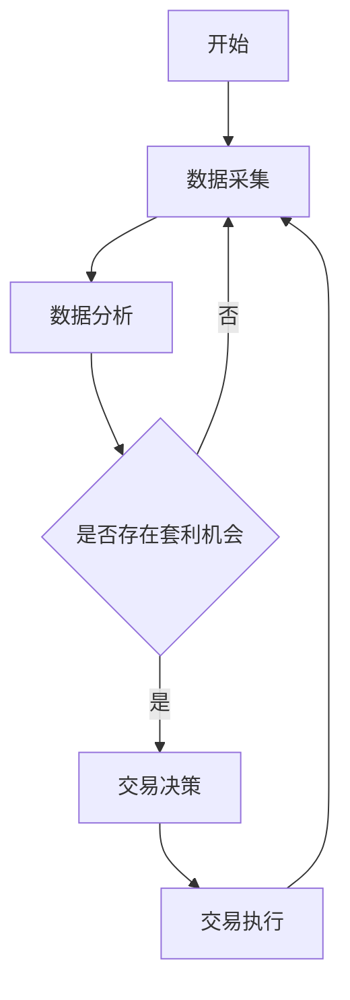

# 如何构建基于特价股票的跨元宇宙套利系统

> 关键词：特价股票、跨元宇宙、套利系统、元宇宙经济、算法交易

> 摘要：本文旨在深入探讨如何构建一个基于特价股票的跨元宇宙套利系统。首先介绍了该系统构建的背景，包括目的、预期读者等内容。接着详细阐述了核心概念，如特价股票、跨元宇宙套利等，通过文本示意图和Mermaid流程图展示其原理和架构。核心算法原理部分使用Python代码进行详细讲解，并给出具体操作步骤。同时，运用数学模型和公式对套利逻辑进行分析，辅以实际举例说明。在项目实战中，介绍了开发环境搭建、源代码实现与解读。还探讨了该系统的实际应用场景，推荐了相关学习资源、开发工具框架和论文著作。最后总结了未来发展趋势与挑战，并提供常见问题解答和扩展阅读参考资料。

## 1. 背景介绍 
### 1.1 目的和范围
随着元宇宙概念的兴起，元宇宙经济体系逐渐形成，其中涉及到各种虚拟资产交易，包括特价股票。构建基于特价股票的跨元宇宙套利系统的目的在于利用不同元宇宙平台之间股票价格的差异，实现套利收益。本系统的范围涵盖了多个主流元宇宙平台，对平台上的特价股票进行实时监测、分析和交易操作。

### 1.2 预期读者
本文的预期读者包括对元宇宙经济、金融套利有兴趣的投资者，从事金融科技、人工智能领域的开发者和研究人员，以及希望了解跨元宇宙经济系统的专业人士。

### 1.3 文档结构概述
本文首先介绍构建跨元宇宙套利系统的背景信息，包括目的、读者群体和文档结构。接着阐述核心概念及其联系，通过示意图和流程图展示系统原理。然后详细讲解核心算法原理和具体操作步骤，并用Python代码实现。之后给出数学模型和公式进行理论分析，辅以实例说明。在项目实战部分，介绍开发环境搭建、源代码实现和解读。再探讨实际应用场景，推荐相关工具和资源。最后总结未来发展趋势与挑战，提供常见问题解答和扩展阅读参考。

### 1.4 术语表
#### 1.4.1 核心术语定义
- **特价股票**：在元宇宙平台中，由于各种原因（如市场波动、平台规则变化等）导致价格低于其内在价值的股票。
- **跨元宇宙套利**：利用不同元宇宙平台上同一或相关股票的价格差异，在价格低的平台买入，在价格高的平台卖出，从而获取利润的交易行为。
- **元宇宙平台**：提供虚拟世界体验，包含虚拟资产交易等功能的数字化平台。

#### 1.4.2 相关概念解释
- **元宇宙经济**：元宇宙内的经济活动和经济体系，包括虚拟资产的生产、交易、分配等环节。
- **算法交易**：利用计算机程序和算法自动执行交易决策的交易方式。

#### 1.4.3 缩略词列表
- API：Application Programming Interface，应用程序编程接口，用于不同系统之间的交互。
- SDK：Software Development Kit，软件开发工具包，提供开发所需的工具和资源。

## 2. 核心概念与联系 
### 核心概念原理
在跨元宇宙环境中，不同的元宇宙平台具有相对独立的市场机制和价格形成体系。由于各个平台的用户群体、市场规则、信息传播速度等因素的差异，同一或相关的特价股票在不同平台上可能会出现价格差异。跨元宇宙套利系统的核心原理就是捕捉这种价格差异，通过自动化的交易策略实现套利。

例如，假设在元宇宙平台A上，某只特价股票的价格为10虚拟货币单位，而在元宇宙平台B上，该股票的价格为12虚拟货币单位。套利系统会在平台A买入该股票，然后在平台B卖出，从而获得2虚拟货币单位的利润（不考虑交易成本）。

### 架构的文本示意图
```plaintext
+----------------------+
| 跨元宇宙套利系统     |
+----------------------+
| 数据采集模块         |
| 数据分析模块         |
| 交易决策模块         |
| 交易执行模块         |
+----------------------+
| 与元宇宙平台A连接    |
| 与元宇宙平台B连接    |
|...                  |
| 与元宇宙平台N连接    |
+----------------------+
```

### Mermaid流程图


该流程图展示了跨元宇宙套利系统的基本工作流程。系统首先进行数据采集，获取各个元宇宙平台上特价股票的价格信息。然后对采集到的数据进行分析，判断是否存在套利机会。如果存在套利机会，则进行交易决策，确定买入和卖出的平台及数量。最后执行交易操作，完成套利。之后系统会继续循环进行数据采集和分析，寻找新的套利机会。

## 3. 核心算法原理 & 具体操作步骤 
### 核心算法原理
跨元宇宙套利系统的核心算法主要包括数据采集算法、数据分析算法和交易决策算法。

#### 数据采集算法
数据采集算法的目的是从各个元宇宙平台获取特价股票的实时价格信息。通常可以使用API接口与元宇宙平台进行交互，定期获取股票价格数据。以下是一个简单的Python代码示例，使用`requests`库模拟从两个元宇宙平台获取股票价格：

```python
import requests

def get_stock_price(platform_url):
    try:
        response = requests.get(platform_url)
        if response.status_code == 200:
            price = response.json().get('price')
            return price
        else:
            print(f"Failed to get price from {platform_url}. Status code: {response.status_code}")
            return None
    except Exception as e:
        print(f"An error occurred while getting price from {platform_url}: {e}")
        return None

# 元宇宙平台A和B的API地址
platform_a_url = "https://platform-a.com/api/stock_price"
platform_b_url = "https://platform-b.com/api/stock_price"

price_a = get_stock_price(platform_a_url)
price_b = get_stock_price(platform_b_url)

print(f"Price on platform A: {price_a}")
print(f"Price on platform B: {price_b}")
```

#### 数据分析算法
数据分析算法用于比较不同元宇宙平台上特价股票的价格，判断是否存在套利机会。通常需要考虑交易成本等因素。以下是一个简单的数据分析代码示例：

```python
def analyze_arbitrage_opportunity(price_a, price_b, transaction_cost):
    if price_a is not None and price_b is not None:
        if price_b - price_a > 2 * transaction_cost:
            return True
    return False

transaction_cost = 0.5
has_opportunity = analyze_arbitrage_opportunity(price_a, price_b, transaction_cost)
print(f"Arbitrage opportunity exists: {has_opportunity}")
```

#### 交易决策算法
如果数据分析算法判断存在套利机会，交易决策算法将确定买入和卖出的数量和平台。一种简单的策略是根据可用资金和价格差异来确定交易数量。以下是一个交易决策代码示例：

```python
def make_trading_decision(price_a, price_b, available_funds, transaction_cost):
    if price_a is not None and price_b is not None:
        if price_b - price_a > 2 * transaction_cost:
            # 计算可买入的数量
            quantity = available_funds // price_a
            return {
                "buy_platform": "A",
                "sell_platform": "B",
                "quantity": quantity
            }
    return None

available_funds = 1000
decision = make_trading_decision(price_a, price_b, available_funds, transaction_cost)
if decision:
    print(f"Buy {decision['quantity']} shares on platform {decision['buy_platform']} and sell on platform {decision['sell_platform']}")
else:
    print("No trading decision.")
```

### 具体操作步骤
1. **数据采集**：使用API接口从各个元宇宙平台获取特价股票的实时价格信息。
2. **数据分析**：比较不同平台上的股票价格，考虑交易成本等因素，判断是否存在套利机会。
3. **交易决策**：如果存在套利机会，根据可用资金和价格差异确定买入和卖出的数量和平台。
4. **交易执行**：通过API接口向相应的元宇宙平台发送交易指令，完成买入和卖出操作。
5. **循环监测**：持续进行数据采集和分析，寻找新的套利机会。

## 4. 数学模型和公式 & 详细讲解 & 举例说明 
### 数学模型和公式
#### 套利利润公式
设 $P_A$ 为元宇宙平台A上特价股票的价格，$P_B$ 为元宇宙平台B上特价股票的价格，$C$ 为每笔交易的成本（包括手续费等），$Q$ 为交易数量。则套利利润 $\pi$ 的计算公式为：

$$\pi = (P_B - P_A - 2C) \times Q$$

其中，$2C$ 表示买入和卖出都需要支付交易成本。

#### 交易数量公式
设 $F$ 为可用资金，则可交易的最大数量 $Q$ 为：

$$Q = \lfloor \frac{F}{P_A} \rfloor$$

其中，$\lfloor x \rfloor$ 表示向下取整函数。

### 详细讲解
- **套利利润公式**：该公式表示套利的利润等于两个平台之间的价格差减去交易成本后，再乘以交易数量。只有当 $P_B - P_A > 2C$ 时，才存在套利机会，即套利利润为正。
- **交易数量公式**：由于可用资金有限，可交易的数量不能超过可用资金除以买入平台的股票价格。向下取整是为了确保交易数量为整数。

### 举例说明
假设在元宇宙平台A上，某只特价股票的价格 $P_A = 10$ 虚拟货币单位，在元宇宙平台B上，该股票的价格 $P_B = 12$ 虚拟货币单位，每笔交易的成本 $C = 0.5$ 虚拟货币单位，可用资金 $F = 1000$ 虚拟货币单位。

首先，判断是否存在套利机会：
$P_B - P_A - 2C = 12 - 10 - 2 \times 0.5 = 1 > 0$，存在套利机会。

然后，计算可交易的数量：
$Q = \lfloor \frac{F}{P_A} \rfloor = \lfloor \frac{1000}{10} \rfloor = 100$

最后，计算套利利润：
$\pi = (P_B - P_A - 2C) \times Q = 1 \times 100 = 100$ 虚拟货币单位。

## 5. 项目实战：代码实际案例和详细解释说明 
### 5.1  开发环境搭建
#### 编程语言和版本
本项目使用Python进行开发，建议使用Python 3.7及以上版本。

#### 依赖库安装
需要安装以下依赖库：
- `requests`：用于与元宇宙平台的API进行交互。
- `pandas`：用于数据处理和分析。

可以使用以下命令进行安装：
```sh
pip install requests pandas
```

#### 元宇宙平台API配置
需要获取各个元宇宙平台的API地址和访问密钥（如果有），并在代码中进行配置。

### 5.2  源代码详细实现和代码解读
以下是一个完整的跨元宇宙套利系统的Python代码示例：

```python
import requests
import pandas as pd
import time

# 元宇宙平台配置
platforms = [
    {
        "name": "A",
        "url": "https://platform-a.com/api/stock_price",
        "api_key": "your_api_key_a"
    },
    {
        "name": "B",
        "url": "https://platform-b.com/api/stock_price",
        "api_key": "your_api_key_b"
    }
]

# 交易成本
transaction_cost = 0.5

# 可用资金
available_funds = 1000

def get_stock_price(platform):
    headers = {
        "Authorization": f"Bearer {platform['api_key']}"
    }
    try:
        response = requests.get(platform["url"], headers=headers)
        if response.status_code == 200:
            price = response.json().get('price')
            return price
        else:
            print(f"Failed to get price from {platform['name']}. Status code: {response.status_code}")
            return None
    except Exception as e:
        print(f"An error occurred while getting price from {platform['name']}: {e}")
        return None

def analyze_arbitrage_opportunity(prices):
    for i in range(len(prices)):
        for j in range(i + 1, len(prices)):
            if prices[i] is not None and prices[j] is not None:
                if prices[j] - prices[i] > 2 * transaction_cost:
                    return {
                        "buy_platform": platforms[i]["name"],
                        "sell_platform": platforms[j]["name"],
                        "buy_price": prices[i],
                        "sell_price": prices[j]
                    }
    return None

def make_trading_decision(opportunity):
    if opportunity:
        quantity = available_funds // opportunity["buy_price"]
        return {
            "buy_platform": opportunity["buy_platform"],
            "sell_platform": opportunity["sell_platform"],
            "quantity": quantity
        }
    return None

def execute_trade(decision):
    if decision:
        print(f"Buy {decision['quantity']} shares on platform {decision['buy_platform']} and sell on platform {decision['sell_platform']}")
        # 这里需要实现具体的交易执行逻辑，如调用平台的交易API
    else:
        print("No trading decision.")

while True:
    prices = []
    for platform in platforms:
        price = get_stock_price(platform)
        prices.append(price)
    
    opportunity = analyze_arbitrage_opportunity(prices)
    decision = make_trading_decision(opportunity)
    execute_trade(decision)
    
    time.sleep(60)  # 每隔60秒进行一次监测
```

### 代码解读与分析
- **平台配置**：`platforms` 列表中存储了各个元宇宙平台的信息，包括名称、API地址和访问密钥。
- **数据采集**：`get_stock_price` 函数用于从指定平台获取股票价格，使用 `requests` 库发送HTTP请求，并处理响应。
- **数据分析**：`analyze_arbitrage_opportunity` 函数比较不同平台的股票价格，判断是否存在套利机会。
- **交易决策**：`make_trading_decision` 函数根据套利机会和可用资金确定交易数量。
- **交易执行**：`execute_trade` 函数根据交易决策执行买入和卖出操作，这里只是简单打印信息，实际应用中需要调用平台的交易API。
- **循环监测**：使用 `while True` 循环每隔60秒进行一次数据采集和分析，持续寻找套利机会。

## 6. 实际应用场景 
### 金融投资
投资者可以利用跨元宇宙套利系统在不同元宇宙平台之间进行特价股票的套利交易，获取额外的收益。通过自动化的交易策略，提高交易效率和准确性。

### 元宇宙平台生态建设
元宇宙平台可以引入跨元宇宙套利机制，促进不同平台之间的资产流通和市场竞争，提高整个元宇宙经济体系的活力和稳定性。

### 学术研究
研究人员可以利用跨元宇宙套利系统进行实证研究，分析元宇宙市场的价格形成机制、市场效率等问题，为元宇宙经济理论的发展提供实践依据。

## 7. 工具和资源推荐
### 7.1 学习资源推荐
#### 7.1.1 书籍推荐
- 《元宇宙通证》：全面介绍了元宇宙经济体系和通证机制，对于理解元宇宙中的资产交易有很大帮助。
- 《算法交易实战》：详细讲解了算法交易的原理、策略和实现方法，对构建跨元宇宙套利系统有重要参考价值。

#### 7.1.2 在线课程
- Coursera上的“Financial Engineering and Risk Management”：该课程涵盖了金融工程和风险管理的基础知识，有助于理解套利交易的原理和风险控制。
- Udemy上的“Python for Finance: Investment Fundamentals & Data Analytics”：通过Python实现金融数据分析和投资策略，适合学习跨元宇宙套利系统的开发。

#### 7.1.3 技术博客和网站
- Medium：上面有很多关于元宇宙、金融科技和算法交易的文章，可以及时了解最新的技术动态和研究成果。
- Towards Data Science：专注于数据科学和机器学习领域的博客，提供了很多实用的技术教程和案例分析。

### 7.2 开发工具框架推荐
#### 7.2.1 IDE和编辑器
- PyCharm：功能强大的Python集成开发环境，提供了代码编辑、调试、版本控制等功能，适合开发跨元宇宙套利系统。
- Visual Studio Code：轻量级的代码编辑器，支持多种编程语言和插件扩展，方便进行快速开发和调试。

#### 7.2.2 调试和性能分析工具
- PDB：Python自带的调试器，可以帮助开发者定位和解决代码中的问题。
- cProfile：Python的性能分析工具，可以分析代码的运行时间和资源消耗，优化代码性能。

#### 7.2.3 相关框架和库
- Flask：轻量级的Python Web框架，可以用于开发与元宇宙平台交互的API服务。
- NumPy和Pandas：用于数据处理和分析的Python库，提供了高效的数组操作和数据结构。

### 7.3 相关论文著作推荐
#### 7.3.1 经典论文
- “Efficient Capital Markets: A Review of Theory and Empirical Work”：该论文提出了有效市场假说，对于理解金融市场的价格形成和套利机会有重要意义。
- “The Limits of Arbitrage”：探讨了套利交易的限制因素，如交易成本、市场摩擦等，对构建跨元宇宙套利系统有启示作用。

#### 7.3.2 最新研究成果
- 关注顶级学术期刊如《Journal of Finance》、《Review of Financial Studies》等，了解元宇宙经济和套利交易的最新研究进展。

#### 7.3.3 应用案例分析
- 可以参考一些金融科技公司的实际应用案例，了解他们在套利交易系统开发和运营方面的经验和做法。

## 8. 总结：未来发展趋势与挑战
### 未来发展趋势
- **元宇宙经济的繁荣**：随着元宇宙技术的不断发展和普及，元宇宙经济将越来越繁荣，跨元宇宙套利的市场空间也将不断扩大。
- **技术创新**：人工智能、区块链等技术将不断应用于跨元宇宙套利系统，提高系统的智能化水平和安全性。
- **监管完善**：政府和监管机构将逐渐加强对元宇宙经济的监管，制定相关的法律法规和政策，保障市场的健康发展。

### 挑战
- **技术难题**：跨元宇宙套利系统需要处理多个元宇宙平台的数据和交易，面临着数据安全、系统稳定性等技术难题。
- **市场风险**：元宇宙市场尚处于发展初期，市场波动较大，存在价格操纵、信息不对称等风险，增加了套利交易的难度和风险。
- **监管不确定性**：目前对于元宇宙经济的监管政策还不完善，存在监管空白和不确定性，可能会对跨元宇宙套利系统的发展产生一定的影响。

## 9. 附录：常见问题与解答
### 问题1：跨元宇宙套利系统是否合法？
解答：目前元宇宙经济的监管政策还在不断完善中，跨元宇宙套利系统本身并不违法，但需要遵守相关的法律法规和平台规则。在进行套利交易时，需要注意防范市场操纵、内幕交易等违法行为。

### 问题2：如何保证跨元宇宙套利系统的安全性？
解答：可以采用多种安全技术来保证系统的安全性，如加密技术、身份认证技术、访问控制技术等。同时，需要选择可靠的元宇宙平台进行合作，确保数据传输和交易的安全。

### 问题3：跨元宇宙套利系统的交易成本如何计算？
解答：交易成本通常包括手续费、交易税等。不同的元宇宙平台可能有不同的收费标准，需要在进行交易前了解清楚。在计算套利利润时，需要将交易成本考虑在内。

## 10. 扩展阅读 & 参考资料
- 《元宇宙：从概念到现实》
- 《区块链技术原理与应用》
- 元宇宙平台官方文档和API文档
- 相关学术论文和研究报告

作者：AI天才研究院/AI Genius Institute & 禅与计算机程序设计艺术 /Zen And The Art of Computer Programming