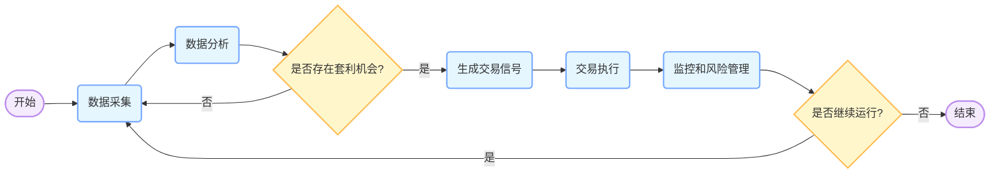

# 如何构建基于特价股票的跨时区套利系统

> 关键词：特价股票、跨时区套利系统、股票交易、算法交易、市场分析

> 摘要：本文旨在深入探讨如何构建基于特价股票的跨时区套利系统。首先介绍了构建该系统的背景信息，包括目的、预期读者等。接着阐述了核心概念及其联系，详细讲解了核心算法原理和具体操作步骤，并给出了相应的Python代码。通过数学模型和公式进一步剖析了套利的原理，并举例说明。在项目实战部分，提供了开发环境搭建、源代码实现及解读。还探讨了该系统的实际应用场景，推荐了相关的学习资源、开发工具框架和论文著作。最后总结了未来发展趋势与挑战，并提供了常见问题解答和扩展阅读参考资料。

## 1. 背景介绍 
### 1.1 目的和范围
构建基于特价股票的跨时区套利系统的主要目的是利用不同时区股票市场之间的时间差和价格差异，寻找特价股票并进行套利交易，从而获取利润。该系统的范围涵盖了多个主要股票市场，包括但不限于纽约证券交易所（NYSE）、伦敦证券交易所（LSE）、东京证券交易所（TSE）等。通过分析这些市场中股票的价格走势和交易数据，系统能够识别出具有套利潜力的特价股票，并自动执行交易策略。

### 1.2 预期读者
本文的预期读者包括金融科技领域的专业人士、量化交易员、股票投资者以及对算法交易和套利策略感兴趣的技术人员。对于金融从业者，本文提供了一种新的交易思路和系统构建方法；对于技术人员，本文详细介绍了系统的技术实现细节，包括算法原理、代码实现和开发环境搭建等。

### 1.3 文档结构概述
本文将按照以下结构进行组织：首先介绍核心概念与联系，明确相关术语和概念的含义，并通过示意图和流程图展示系统的架构；接着详细讲解核心算法原理和具体操作步骤，同时给出Python代码示例；然后通过数学模型和公式进一步解释套利的原理，并举例说明；在项目实战部分，将介绍开发环境搭建、源代码实现及解读；之后探讨该系统的实际应用场景；推荐相关的学习资源、开发工具框架和论文著作；最后总结未来发展趋势与挑战，提供常见问题解答和扩展阅读参考资料。

### 1.4 术语表
#### 1.4.1 核心术语定义
- **特价股票**：指在某个市场中价格相对其他市场或其内在价值被低估的股票。
- **跨时区套利**：利用不同时区股票市场的交易时间差和价格差异，在一个市场买入股票，同时在另一个市场卖出相同或相关的股票，以获取利润的交易策略。
- **套利机会**：当存在价格差异使得通过跨时区交易能够获得无风险或低风险利润时，就存在套利机会。
- **交易信号**：系统根据一定的算法和规则生成的指示买入或卖出股票的信号。

#### 1.4.2 相关概念解释
- **市场效率**：指市场价格反映所有可用信息的程度。在有效市场中，套利机会很难持续存在，因为价格会迅速调整以反映新的信息。
- **流动性**：指市场中资产能够以合理价格快速买卖的程度。高流动性的市场更容易进行套利交易，因为能够快速执行交易而不会对价格产生太大影响。
- **延迟**：指从获取市场数据到执行交易之间的时间间隔。在跨时区套利中，延迟可能会导致套利机会消失或利润减少。

#### 1.4.3 缩略词列表
- **NYSE**：纽约证券交易所（New York Stock Exchange）
- **LSE**：伦敦证券交易所（London Stock Exchange）
- **TSE**：东京证券交易所（Tokyo Stock Exchange）
- **API**：应用程序编程接口（Application Programming Interface）
- **ETF**：交易型开放式指数基金（Exchange - Traded Fund）

## 2. 核心概念与联系 

### 核心概念原理
基于特价股票的跨时区套利系统的核心原理是利用不同时区股票市场之间的时间差和价格差异。由于不同市场的交易时间不同，同一股票在不同市场的价格可能会出现短暂的差异。例如，当纽约证券交易所闭市后，东京证券交易所开市，此时如果东京市场上某只股票的价格与纽约市场上该股票的收盘价存在差异，就可能存在套利机会。

系统通过实时收集多个市场的股票价格数据，运用一定的算法和模型来识别特价股票和套利机会。一旦发现套利机会，系统会自动生成交易信号，并通过交易接口执行买入和卖出操作。

### 架构的文本示意图
该系统主要由以下几个部分组成：
1. **数据采集模块**：负责从各个股票市场的数据源（如交易所API、数据提供商等）收集股票的实时价格、成交量等交易数据。
2. **数据分析模块**：对采集到的数据进行清洗、处理和分析，运用算法和模型识别特价股票和套利机会。
3. **交易信号生成模块**：根据数据分析的结果，生成买入或卖出的交易信号。
4. **交易执行模块**：根据交易信号，通过交易接口（如券商API）向股票市场发送交易指令，执行买入和卖出操作。
5. **监控和风险管理模块**：实时监控系统的运行状态和交易情况，对风险进行评估和管理，确保系统的稳定运行和资金安全。

### Mermaid 流程图


## 3. 核心算法原理 & 具体操作步骤 

### 核心算法原理
本系统的核心算法主要包括以下几个方面：
1. **价格比较算法**：比较同一股票在不同市场的价格，找出价格差异较大的股票。可以使用简单的价格差值或价格比率来衡量价格差异。例如，计算股票在市场A和市场B的价格比率 $R = \frac{P_A}{P_B}$，如果 $R$ 偏离1较大，则可能存在套利机会。
2. **套利机会判断算法**：根据价格比较的结果，结合一定的阈值和规则来判断是否存在套利机会。例如，当价格比率 $R$ 大于某个上限阈值 $T_{upper}$ 或小于某个下限阈值 $T_{lower}$ 时，认为存在套利机会。
3. **交易信号生成算法**：一旦确定存在套利机会，根据套利方向（买入低价市场的股票，卖出高价市场的股票）生成相应的买入或卖出信号。

### 具体操作步骤
1. **数据采集**：使用API从各个股票市场的数据源获取股票的实时价格、成交量等交易数据。可以使用Python的`requests`库来发送HTTP请求获取数据。
```python
import requests

def get_stock_price(market, symbol):
    # 这里假设API的URL格式为 https://api.example.com/{market}/{symbol}/price
    url = f"https://api.example.com/{market}/{symbol}/price"
    response = requests.get(url)
    if response.status_code == 200:
        return float(response.json()["price"])
    else:
        return None
```
2. **数据分析**：对采集到的数据进行处理和分析，计算价格比率并判断是否存在套利机会。
```python
def analyze_data(market_a, market_b, symbol, upper_threshold, lower_threshold):
    price_a = get_stock_price(market_a, symbol)
    price_b = get_stock_price(market_b, symbol)
    if price_a is not None and price_b is not None:
        ratio = price_a / price_b
        if ratio > upper_threshold:
            return "Sell in market A, Buy in market B"
        elif ratio < lower_threshold:
            return "Buy in market A, Sell in market B"
        else:
            return "No arbitrage opportunity"
    else:
        return "Error getting stock prices"
```
3. **交易信号生成**：根据数据分析的结果，生成相应的交易信号。
```python
def generate_trading_signal(analysis_result):
    if analysis_result == "Sell in market A, Buy in market B":
        return {"market_a": "sell", "market_b": "buy"}
    elif analysis_result == "Buy in market A, Sell in market B":
        return {"market_a": "buy", "market_b": "sell"}
    else:
        return None
```
4. **交易执行**：根据交易信号，通过交易接口向股票市场发送交易指令。这里假设使用一个简单的模拟交易接口。
```python
def execute_trades(trading_signal, market_a, market_b, symbol, quantity):
    if trading_signal is not None:
        if trading_signal["market_a"] == "buy":
            print(f"Buy {quantity} shares of {symbol} in {market_a}")
        elif trading_signal["market_a"] == "sell":
            print(f"Sell {quantity} shares of {symbol} in {market_a}")
        if trading_signal["market_b"] == "buy":
            print(f"Buy {quantity} shares of {symbol} in {market_b}")
        elif trading_signal["market_b"] == "sell":
            print(f"Sell {quantity} shares of {symbol} in {market_b}")
    else:
        print("No trading signal to execute")
```

### 完整示例代码
```python
import requests

def get_stock_price(market, symbol):
    # 这里假设API的URL格式为 https://api.example.com/{market}/{symbol}/price
    url = f"https://api.example.com/{market}/{symbol}/price"
    response = requests.get(url)
    if response.status_code == 200:
        return float(response.json()["price"])
    else:
        return None

def analyze_data(market_a, market_b, symbol, upper_threshold, lower_threshold):
    price_a = get_stock_price(market_a, symbol)
    price_b = get_stock_price(market_b, symbol)
    if price_a is not None and price_b is not None:
        ratio = price_a / price_b
        if ratio > upper_threshold:
            return "Sell in market A, Buy in market B"
        elif ratio < lower_threshold:
            return "Buy in market A, Sell in market B"
        else:
            return "No arbitrage opportunity"
    else:
        return "Error getting stock prices"

def generate_trading_signal(analysis_result):
    if analysis_result == "Sell in market A, Buy in market B":
        return {"market_a": "sell", "market_b": "buy"}
    elif analysis_result == "Buy in market A, Sell in market B":
        return {"market_a": "buy", "market_b": "sell"}
    else:
        return None

def execute_trades(trading_signal, market_a, market_b, symbol, quantity):
    if trading_signal is not None:
        if trading_signal["market_a"] == "buy":
            print(f"Buy {quantity} shares of {symbol} in {market_a}")
        elif trading_signal["market_a"] == "sell":
            print(f"Sell {quantity} shares of {symbol} in {market_a}")
        if trading_signal["market_b"] == "buy":
            print(f"Buy {quantity} shares of {symbol} in {market_b}")
        elif trading_signal["market_b"] == "sell":
            print(f"Sell {quantity} shares of {symbol} in {market_b}")
    else:
        print("No trading signal to execute")

# 示例参数
market_a = "NYSE"
market_b = "TSE"
symbol = "ABC"
upper_threshold = 1.05
lower_threshold = 0.95
quantity = 100

# 执行流程
analysis_result = analyze_data(market_a, market_b, symbol, upper_threshold, lower_threshold)
trading_signal = generate_trading_signal(analysis_result)
execute_trades(trading_signal, market_a, market_b, symbol, quantity)
```

## 4. 数学模型和公式 & 详细讲解 & 举例说明 

### 数学模型和公式
#### 价格比率模型
设股票在市场A的价格为 $P_A$，在市场B的价格为 $P_B$，则价格比率 $R$ 定义为：
$$R = \frac{P_A}{P_B}$$

#### 套利机会判断公式
当 $R > T_{upper}$ 或 $R < T_{lower}$ 时，存在套利机会，其中 $T_{upper}$ 是上限阈值，$T_{lower}$ 是下限阈值。

#### 套利利润计算公式
假设在市场A以价格 $P_A$ 买入 $N$ 股股票，在市场B以价格 $P_B$ 卖出 $N$ 股股票，则套利利润 $\pi$ 为：
$$\pi = N(P_B - P_A) - C$$
其中 $C$ 是交易成本，包括佣金、手续费等。

### 详细讲解
价格比率模型是判断套利机会的基础。通过比较同一股票在不同市场的价格比率，可以直观地看出价格差异的大小。当价格比率偏离1较大时，说明两个市场的价格差异较大，可能存在套利机会。

套利机会判断公式中的阈值 $T_{upper}$ 和 $T_{lower}$ 需要根据市场情况和历史数据进行调整。一般来说，$T_{upper}$ 大于1，$T_{lower}$ 小于1。例如，当 $T_{upper} = 1.05$，$T_{lower} = 0.95$ 时，如果 $R > 1.05$，说明市场A的价格相对市场B过高，可以在市场A卖出股票，在市场B买入股票；如果 $R < 0.95$，说明市场A的价格相对市场B过低，可以在市场A买入股票，在市场B卖出股票。

套利利润计算公式考虑了交易成本的影响。在实际交易中，交易成本是不可忽视的因素，它会降低套利的实际利润。因此，在进行套利交易时，需要确保套利利润大于交易成本，否则套利交易将无利可图。

### 举例说明
假设股票XYZ在纽约证券交易所（NYSE）的价格为 $P_{NYSE} = 100$ 美元，在东京证券交易所（TSE）的价格为 $P_{TSE} = 95$ 美元，交易成本 $C = 10$ 美元，交易数量 $N = 100$ 股。

首先计算价格比率：
$$R = \frac{P_{NYSE}}{P_{TSE}} = \frac{100}{95} \approx 1.0526$$

假设上限阈值 $T_{upper} = 1.05$，下限阈值 $T_{lower} = 0.95$，由于 $R > T_{upper}$，存在套利机会。可以在纽约证券交易所卖出100股股票，在东京证券交易所买入100股股票。

计算套利利润：
$$\pi = N(P_{TSE} - P_{NYSE}) - C = 100\times(95 - 100) - 10 = -500 - 10 = -510$$

由于套利利润为负数，说明在考虑交易成本后，这次套利交易是亏损的。因此，在实际操作中，需要更加精确地计算和控制交易成本，以确保套利交易的盈利能力。

## 5. 项目实战：代码实际案例和详细解释说明 

### 5.1  开发环境搭建
#### 安装Python
首先需要安装Python编程语言。可以从Python官方网站（https://www.python.org/downloads/）下载适合自己操作系统的Python版本，并按照安装向导进行安装。建议安装Python 3.7及以上版本。

#### 安装必要的库
本项目需要使用一些Python库，如`requests`用于发送HTTP请求获取数据。可以使用`pip`命令来安装这些库：
```sh
pip install requests
```

#### 配置API密钥
如果使用的数据源需要API密钥，需要在相应的数据源平台上注册账号并获取API密钥。然后将API密钥配置到代码中，以便能够正常访问数据源。

### 5.2  源代码详细实现和代码解读
以下是一个完整的基于特价股票的跨时区套利系统的Python代码示例：
```python
import requests
import time

# 定义获取股票价格的函数
def get_stock_price(market, symbol, api_key):
    """
    从指定市场获取指定股票的价格
    :param market: 股票市场名称，如 "NYSE", "TSE"
    :param symbol: 股票代码，如 "ABC"
    :param api_key: API密钥
    :return: 股票价格，如果获取失败则返回None
    """
    # 这里假设API的URL格式为 https://api.example.com/{market}/{symbol}/price?api_key={api_key}
    url = f"https://api.example.com/{market}/{symbol}/price?api_key={api_key}"
    try:
        response = requests.get(url)
        if response.status_code == 200:
            return float(response.json()["price"])
        else:
            print(f"Error getting stock price: {response.status_code}")
            return None
    except Exception as e:
        print(f"Error getting stock price: {e}")
        return None

# 定义分析数据的函数
def analyze_data(market_a, market_b, symbol, upper_threshold, lower_threshold, api_key):
    """
    分析两个市场中指定股票的价格，判断是否存在套利机会
    :param market_a: 市场A名称
    :param market_b: 市场B名称
    :param symbol: 股票代码
    :param upper_threshold: 上限阈值
    :param lower_threshold: 下限阈值
    :param api_key: API密钥
    :return: 套利分析结果
    """
    price_a = get_stock_price(market_a, symbol, api_key)
    price_b = get_stock_price(market_b, symbol, api_key)
    if price_a is not None and price_b is not None:
        ratio = price_a / price_b
        if ratio > upper_threshold:
            return "Sell in market A, Buy in market B"
        elif ratio < lower_threshold:
            return "Buy in market A, Sell in market B"
        else:
            return "No arbitrage opportunity"
    else:
        return "Error getting stock prices"

# 定义生成交易信号的函数
def generate_trading_signal(analysis_result):
    """
    根据套利分析结果生成交易信号
    :param analysis_result: 套利分析结果
    :return: 交易信号字典，如果没有信号则返回None
    """
    if analysis_result == "Sell in market A, Buy in market B":
        return {"market_a": "sell", "market_b": "buy"}
    elif analysis_result == "Buy in market A, Sell in market B":
        return {"market_a": "buy", "market_b": "sell"}
    else:
        return None

# 定义执行交易的函数
def execute_trades(trading_signal, market_a, market_b, symbol, quantity, trading_api):
    """
    根据交易信号执行交易
    :param trading_signal: 交易信号字典
    :param market_a: 市场A名称
    :param market_b: 市场B名称
    :param symbol: 股票代码
    :param quantity: 交易数量
    :param trading_api: 交易API对象
    """
    if trading_signal is not None:
        if trading_signal["market_a"] == "buy":
            trading_api.buy(market_a, symbol, quantity)
        elif trading_signal["market_a"] == "sell":
            trading_api.sell(market_a, symbol, quantity)
        if trading_signal["market_b"] == "buy":
            trading_api.buy(market_b, symbol, quantity)
        elif trading_signal["market_b"] == "sell":
            trading_api.sell(market_b, symbol, quantity)
    else:
        print("No trading signal to execute")

# 定义模拟交易API类
class TradingAPI:
    def buy(self, market, symbol, quantity):
        print(f"Buy {quantity} shares of {symbol} in {market}")

    def sell(self, market, symbol, quantity):
        print(f"Sell {quantity} shares of {symbol} in {market}")

# 主程序
if __name__ == "__main__":
    # 示例参数
    market_a = "NYSE"
    market_b = "TSE"
    symbol = "ABC"
    upper_threshold = 1.05
    lower_threshold = 0.95
    quantity = 100
    api_key = "your_api_key"

    trading_api = TradingAPI()

    while True:
        analysis_result = analyze_data(market_a, market_b, symbol, upper_threshold, lower_threshold, api_key)
        trading_signal = generate_trading_signal(analysis_result)
        execute_trades(trading_signal, market_a, market_b, symbol, quantity, trading_api)
        time.sleep(60)  # 每隔60秒检查一次
```

### 代码解读与分析
#### 整体结构
代码主要分为几个部分：获取股票价格、分析数据、生成交易信号、执行交易和主程序。主程序中使用一个无限循环，每隔60秒检查一次是否存在套利机会，并根据情况执行交易。

#### 函数详解
1. **get_stock_price**：该函数用于从指定市场获取指定股票的价格。它使用`requests`库发送HTTP请求到API接口，并解析返回的JSON数据获取股票价格。如果请求失败，会打印错误信息并返回`None`。
2. **analyze_data**：该函数分析两个市场中指定股票的价格，计算价格比率并与阈值进行比较，判断是否存在套利机会。如果存在套利机会，返回相应的套利策略；如果不存在，返回“无套利机会”；如果获取价格失败，返回“获取股票价格错误”。
3. **generate_trading_signal**：该函数根据套利分析结果生成交易信号，返回一个包含买入或卖出指令的字典。
4. **execute_trades**：该函数根据交易信号执行交易。这里使用了一个模拟的交易API类`TradingAPI`，实际应用中需要替换为真实的交易API。
5. **TradingAPI**：这是一个模拟的交易API类，包含`buy`和`sell`方法，用于模拟买入和卖出操作。

#### 注意事项
- 代码中的API URL和API密钥需要根据实际情况进行替换。
- 实际应用中，需要考虑交易成本、市场流动性等因素，以确保套利交易的盈利能力。
- 为了避免频繁请求API导致被封禁，需要合理设置请求间隔时间。

## 6. 实际应用场景 
### 机构投资者
对于大型机构投资者，如对冲基金、投资银行等，基于特价股票的跨时区套利系统可以作为一种重要的投资策略。通过利用不同市场的价格差异进行套利交易，机构投资者可以在不承担过多市场风险的情况下获取额外的收益。例如，一家美国的对冲基金可以同时关注纽约证券交易所和东京证券交易所的股票价格，当发现某只股票在两个市场存在价格差异时，通过该系统进行套利交易。

### 量化交易公司
量化交易公司通常依赖算法和模型进行交易决策。基于特价股票的跨时区套利系统可以作为量化交易策略的一部分，通过自动化的交易流程提高交易效率和盈利能力。量化交易公司可以利用系统的数据分析和交易信号生成功能，快速捕捉套利机会并执行交易。

### 个人投资者
虽然个人投资者在资金和技术方面可能不如机构投资者和量化交易公司，但也可以利用基于特价股票的跨时区套利系统进行投资。个人投资者可以通过学习和使用该系统，在业余时间进行套利交易，增加投资收益。例如，一位有一定编程基础的个人投资者可以自己搭建一个简单的套利系统，关注一些热门股票在不同市场的价格差异。

## 7. 工具和资源推荐
### 7.1 学习资源推荐
#### 7.1.1 书籍推荐
- 《金融市场与金融机构》：这本书系统介绍了金融市场的各种知识，包括股票市场、债券市场等，对于理解跨时区套利的市场环境非常有帮助。
- 《量化投资：策略与技术》：详细讲解了量化投资的各种策略和技术，包括套利策略的原理和实现方法。
- 《Python金融大数据分析》：介绍了如何使用Python进行金融数据的分析和处理，对于开发基于特价股票的跨时区套利系统非常实用。

#### 7.1.2 在线课程
- Coursera上的“Financial Markets”课程：由耶鲁大学教授开设，深入讲解了金融市场的理论和实践知识。
- Udemy上的“Python for Finance: Investment Fundamentals & Data Analytics”课程：专注于使用Python进行金融数据分析和投资决策。
- edX上的“Algorithmic Trading and Quantitative Strategies”课程：介绍了算法交易和量化策略的相关知识。

#### 7.1.3 技术博客和网站
- Seeking Alpha：提供股票市场的分析和评论，以及各种投资策略的讨论。
- QuantNet：量化交易领域的专业社区，有很多关于套利策略和算法交易的技术文章和讨论。
- Towards Data Science：专注于数据科学和机器学习的博客平台，有很多关于金融数据分析和量化交易的文章。

### 7.2 开发工具框架推荐
#### 7.2.1 IDE和编辑器
- PyCharm：一款功能强大的Python集成开发环境，提供代码编辑、调试、版本控制等功能，适合开发复杂的Python项目。
- Jupyter Notebook：交互式的开发环境，适合进行数据探索和分析，以及快速验证算法和模型。
- Visual Studio Code：轻量级的代码编辑器，支持多种编程语言和插件，具有良好的扩展性。

#### 7.2.2 调试和性能分析工具
- PDB：Python自带的调试工具，可以帮助开发者定位和解决代码中的问题。
- cProfile：Python的性能分析工具，可以分析代码的运行时间和函数调用情况，帮助优化代码性能。
- Py-Spy：一个简单易用的Python性能分析工具，可以实时监测Python程序的性能。

#### 7.2.3 相关框架和库
- Pandas：用于数据处理和分析的Python库，提供了高效的数据结构和数据操作方法，非常适合处理金融数据。
- NumPy：Python的数值计算库，提供了高效的数组操作和数学函数，用于实现套利算法中的数值计算。
- TA-Lib：技术分析库，提供了各种技术指标的计算方法，可用于分析股票价格走势。

### 7.3 相关论文著作推荐
#### 7.3.1 经典论文
- “The Law of One Price in International Financial Markets”：研究了国际金融市场中一价定律的有效性，对于理解跨时区套利的理论基础非常重要。
- “Arbitrage Pricing Theory”：提出了套利定价理论，为套利交易提供了理论支持。
- “Market Microstructure and Asset Pricing: On the Compensation for Illiquidity in Stock Returns”：探讨了市场微观结构和资产定价的关系，特别是流动性对股票回报的影响，对于考虑套利交易中的流动性问题有参考价值。

#### 7.3.2 最新研究成果
可以通过学术数据库（如IEEE Xplore、ACM Digital Library、SSRN等）搜索关于跨时区套利、算法交易和金融科技的最新研究成果。这些研究可能会提出新的套利策略和算法，以及对市场动态的新理解。

#### 7.3.3 应用案例分析
一些金融研究机构和咨询公司会发布关于套利交易的应用案例分析报告。这些报告可以帮助我们了解实际应用中套利系统的设计、实施和效果评估等方面的经验和教训。

## 8. 总结：未来发展趋势与挑战
### 未来发展趋势
#### 技术创新推动
随着人工智能、机器学习和大数据技术的不断发展，基于特价股票的跨时区套利系统将更加智能化和自动化。例如，使用深度学习算法可以更准确地预测股票价格走势和套利机会，提高系统的盈利能力。同时，区块链技术的应用可以提高交易的透明度和安全性，降低交易成本。

#### 市场全球化
全球金融市场的一体化程度不断提高，不同市场之间的联系更加紧密。这将为跨时区套利提供更多的机会，因为更多的股票将在多个市场上市交易，价格差异也可能更加频繁地出现。此外，新兴市场的发展也将为套利交易带来新的机遇。

#### 监管政策变化
监管机构对金融市场的监管政策将不断调整和完善。一方面，监管政策可能会加强对套利交易的规范和管理，以维护市场的公平和稳定；另一方面，也可能会出台一些鼓励创新和发展的政策，促进套利交易技术的进步和应用。

### 挑战
#### 市场效率提高
随着市场参与者的增加和信息传播的加速，市场效率将不断提高，套利机会可能会变得更加短暂和难以捕捉。这就要求套利系统具备更高的实时性和准确性，能够快速响应市场变化。

#### 技术复杂性
构建基于特价股票的跨时区套利系统需要涉及多个领域的知识和技术，包括金融、计算机科学、数学等。系统的开发和维护需要专业的技术团队，并且需要不断投入资源进行技术创新和升级。

#### 风险控制
套利交易虽然可以在一定程度上降低市场风险，但仍然存在各种风险，如市场波动风险、流动性风险、交易对手风险等。如何有效地控制这些风险，确保系统的稳定运行和资金安全，是套利系统面临的重要挑战。

## 9. 附录：常见问题与解答
### 问题1：如何确定套利机会的阈值？
解答：套利机会的阈值可以根据历史数据和市场情况进行调整。一般来说，可以通过回测不同的阈值，观察在历史数据上的套利效果，选择能够获得最大利润或最小风险的阈值。同时，也需要考虑市场的流动性和交易成本等因素。

### 问题2：跨时区套利是否存在风险？
解答：跨时区套利存在一定的风险。例如，市场波动可能导致价格差异迅速消失，使得套利交易无法完成或亏损；流动性不足可能导致无法及时买入或卖出股票，影响套利效果；此外，还存在交易对手风险、政策风险等。因此，在进行跨时区套利时，需要充分考虑这些风险，并采取相应的风险控制措施。

### 问题3：如何选择合适的股票进行套利交易？
解答：选择合适的股票进行套利交易需要考虑多个因素。首先，股票应该在多个市场上市交易，这样才能存在跨时区的价格差异。其次，股票的流动性要好，以便能够快速买卖。此外，还可以考虑股票的基本面、行业前景等因素，选择具有一定投资价值的股票。

### 问题4：如何保证套利系统的稳定性和可靠性？
解答：为了保证套利系统的稳定性和可靠性，可以采取以下措施：一是进行充分的测试和验证，包括功能测试、性能测试、压力测试等，确保系统在各种情况下都能正常运行；二是建立完善的监控和预警机制，实时监测系统的运行状态和交易情况，及时发现和处理异常情况；三是采用备份和恢复策略，定期备份系统数据，以防止数据丢失和系统故障。

## 10. 扩展阅读 & 参考资料
### 扩展阅读
- 《高频交易》：介绍了高频交易的原理、策略和技术，对于理解跨时区套利中的实时交易和快速决策有帮助。
- 《金融科技前沿：区块链、人工智能和大数据》：探讨了金融科技领域的最新发展趋势，包括区块链、人工智能和大数据在金融市场中的应用。
- 《投资组合管理》：讲解了如何构建和管理投资组合，对于在套利交易中进行资金分配和风险控制有指导意义。

### 参考资料
- 各股票交易所的官方网站，如纽约证券交易所（https://www.nyse.com/）、伦敦证券交易所（https://www.londonstockexchange.com/）、东京证券交易所（https://www.jpx.co.jp/）等，提供了股票市场的基本信息和交易规则。
- 金融数据提供商的网站，如Bloomberg、Reuters等，提供了实时的股票价格、成交量等交易数据。
- 相关的学术期刊和会议论文，如《Journal of Financial Economics》、《Review of Financial Studies》等，发表了许多关于金融市场和套利交易的研究成果。

作者：AI天才研究院/AI Genius Institute & 禅与计算机程序设计艺术 /Zen And The Art of Computer Programming