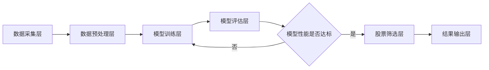

# 如何构建高效的特价股票筛选模型

> 关键词：特价股票筛选模型、股票分析、机器学习算法、金融数据、投资决策

> 摘要：本文旨在深入探讨如何构建高效的特价股票筛选模型。通过对特价股票筛选相关的核心概念、算法原理、数学模型进行详细剖析，结合项目实战展示具体的代码实现与解读，分析实际应用场景，推荐相关工具和资源，帮助读者全面了解构建该模型的方法和流程。同时，对模型未来的发展趋势与挑战进行总结，为投资者和技术人员在股票筛选领域提供有价值的参考。

## 1. 背景介绍 
### 1.1 目的和范围
在股票投资领域，寻找被低估的特价股票是众多投资者追求的目标。构建高效的特价股票筛选模型的目的在于帮助投资者从海量的股票数据中快速、准确地筛选出具有潜在投资价值的特价股票，提高投资决策的效率和准确性。本文章的范围涵盖了从特价股票筛选的基本概念、核心算法原理、数学模型到实际项目开发的整个流程，同时探讨了该模型在实际投资中的应用场景、相关工具资源以及未来发展趋势。

### 1.2 预期读者
本文预期读者包括对股票投资感兴趣的个人投资者、金融行业的分析师、从事金融科技领域的程序员和数据科学家，以及希望深入了解股票筛选技术的相关专业人士。

### 1.3 文档结构概述
本文将按照以下结构进行阐述：首先介绍特价股票筛选的核心概念与联系，包括相关原理和架构的示意图；接着详细讲解核心算法原理，并给出具体的Python操作步骤；然后介绍数学模型和公式，并举例说明；通过项目实战展示代码实际案例和详细解释；分析该模型的实际应用场景；推荐相关的工具和资源；最后总结未来发展趋势与挑战，并提供常见问题解答和扩展阅读参考资料。

### 1.4 术语表
#### 1.4.1 核心术语定义
- **特价股票**：指市场价格低于其内在价值的股票，通常具有较高的投资性价比。
- **股票筛选模型**：一种基于特定规则和算法，对股票数据进行分析和筛选的系统，用于找出符合特定条件的股票。
- **内在价值**：股票所代表的公司的真实价值，通常通过对公司的财务状况、盈利能力、行业前景等因素进行综合评估得出。
- **特征工程**：将原始数据转换为更适合模型训练的特征的过程，包括数据清洗、特征选择、特征提取等步骤。

#### 1.4.2 相关概念解释
- **基本面分析**：通过研究公司的财务报表、经营状况、行业竞争等基本面因素，评估股票的内在价值。
- **技术分析**：通过分析股票的价格走势、成交量等技术指标，预测股票的未来价格走势。
- **机器学习算法**：一类通过数据学习模式和规律，并进行预测和决策的算法，如线性回归、决策树、神经网络等。

#### 1.4.3 缩略词列表
- **PE**：市盈率（Price-to-Earnings Ratio），反映股票价格与每股盈利之间的比率。
- **PB**：市净率（Price-to-Book Ratio），反映股票价格与每股净资产之间的比率。
- **ROE**：净资产收益率（Return on Equity），衡量公司运用自有资本的效率。
- **AI**：人工智能（Artificial Intelligence）
- **ML**：机器学习（Machine Learning）

## 2. 核心概念与联系 

### 核心概念原理
特价股票筛选模型的核心原理是基于对股票各种特征的分析和评估，找出那些被市场低估的股票。这些特征可以分为基本面特征和技术面特征。基本面特征包括公司的财务指标（如PE、PB、ROE等）、经营业绩、行业地位等，反映了公司的内在价值；技术面特征包括股票的价格走势、成交量、均线等，反映了市场对股票的供求关系和投资者的情绪。

通过对这些特征的综合分析，模型可以计算出每只股票的投资价值得分，然后根据得分筛选出得分较高的特价股票。为了提高筛选的准确性和可靠性，通常会使用机器学习算法对大量的历史数据进行训练，让模型学习到股票特征与投资价值之间的关系。

### 架构的文本示意图
特价股票筛选模型的架构可以分为以下几个主要部分：
1. **数据采集层**：负责从各种数据源（如金融数据库、财经网站等）采集股票的相关数据，包括基本面数据和技术面数据。
2. **数据预处理层**：对采集到的数据进行清洗、转换和特征工程处理，去除噪声数据，提取有价值的特征。
3. **模型训练层**：使用机器学习算法对预处理后的数据进行训练，构建特价股票筛选模型。
4. **模型评估层**：使用测试数据对训练好的模型进行评估，计算模型的准确率、召回率等指标，评估模型的性能。
5. **股票筛选层**：使用训练好的模型对实时股票数据进行筛选，找出符合条件的特价股票。
6. **结果输出层**：将筛选出的特价股票信息输出给用户，如生成报告、发送通知等。

### Mermaid 流程图


## 3. 核心算法原理 & 具体操作步骤 

### 核心算法原理
在构建特价股票筛选模型时，常用的机器学习算法包括线性回归、决策树、随机森林和神经网络等。这里以线性回归算法为例进行详细讲解。

线性回归是一种用于建立自变量和因变量之间线性关系的统计模型。在特价股票筛选中，我们可以将股票的各种特征作为自变量，将股票的投资价值得分作为因变量，通过线性回归模型学习到特征与得分之间的线性关系。

线性回归模型的一般形式为：
$$y = \beta_0 + \beta_1x_1 + \beta_2x_2 + \cdots + \beta_nx_n + \epsilon$$
其中，$y$ 是因变量（股票的投资价值得分），$x_1, x_2, \cdots, x_n$ 是自变量（股票的各种特征），$\beta_0, \beta_1, \beta_2, \cdots, \beta_n$ 是模型的系数，$\epsilon$ 是误差项。

### 具体操作步骤

#### 步骤 1：数据采集
使用Python的第三方库（如 `pandas-datareader`）从金融数据库或财经网站采集股票的基本面数据和技术面数据。以下是一个简单的示例代码：
```python
import pandas as pd
import pandas_datareader.data as web
import datetime

# 设置数据采集的时间范围
start = datetime.datetime(2020, 1, 1)
end = datetime.datetime(2023, 12, 31)

# 采集某只股票的历史价格数据
stock_symbol = 'AAPL'
df = web.DataReader(stock_symbol, 'yahoo', start, end)

print(df.head())
```

#### 步骤 2：数据预处理
对采集到的数据进行清洗、转换和特征工程处理。以下是一个简单的数据预处理示例代码：
```python
# 处理缺失值
df = df.dropna()

# 提取特征
features = df[['Open', 'High', 'Low', 'Close', 'Volume']]

# 提取目标变量（这里假设使用收盘价作为投资价值得分的简单替代）
target = df['Close']

# 划分训练集和测试集
from sklearn.model_selection import train_test_split
X_train, X_test, y_train, y_test = train_test_split(features, target, test_size=0.2, random_state=42)
```

#### 步骤 3：模型训练
使用线性回归算法对训练数据进行训练。以下是训练线性回归模型的示例代码：
```python
from sklearn.linear_model import LinearRegression

# 创建线性回归模型
model = LinearRegression()

# 训练模型
model.fit(X_train, y_train)
```

#### 步骤 4：模型评估
使用测试数据对训练好的模型进行评估，计算模型的准确率、召回率等指标。以下是评估线性回归模型的示例代码：
```python
from sklearn.metrics import mean_squared_error, r2_score

# 预测测试集数据
y_pred = model.predict(X_test)

# 计算均方误差
mse = mean_squared_error(y_test, y_pred)

# 计算决定系数
r2 = r2_score(y_test, y_pred)

print(f"均方误差: {mse}")
print(f"决定系数: {r2}")
```

#### 步骤 5：股票筛选
使用训练好的模型对实时股票数据进行筛选，找出符合条件的特价股票。以下是一个简单的股票筛选示例代码：
```python
# 假设我们有新的股票数据
new_stock_data = pd.DataFrame({
    'Open': [100],
    'High': [105],
    'Low': [95],
    'Close': [102],
    'Volume': [1000000]
})

# 使用模型进行预测
predicted_score = model.predict(new_stock_data)

print(f"预测的投资价值得分: {predicted_score[0]}")
```

## 4. 数学模型和公式 & 详细讲解 & 举例说明 

### 线性回归模型的数学原理
线性回归模型的目标是找到一组最优的系数 $\beta_0, \beta_1, \beta_2, \cdots, \beta_n$，使得模型的预测值与实际值之间的误差最小。常用的误差度量方法是均方误差（Mean Squared Error，MSE），其计算公式为：
$$MSE = \frac{1}{m} \sum_{i=1}^{m} (y_i - \hat{y}_i)^2$$
其中，$m$ 是样本数量，$y_i$ 是第 $i$ 个样本的实际值，$\hat{y}_i$ 是第 $i$ 个样本的预测值。

为了找到最优的系数，我们可以使用最小二乘法（Least Squares Method）。最小二乘法的基本思想是通过最小化均方误差来求解系数。具体来说，我们可以对均方误差关于系数 $\beta_0, \beta_1, \beta_2, \cdots, \beta_n$ 求偏导数，并令偏导数等于零，得到一组线性方程组，然后求解该方程组即可得到最优的系数。

### 举例说明
假设我们有以下一组股票数据：

| 开盘价 ($x_1$) | 最高价 ($x_2$) | 最低价 ($x_3$) | 收盘价 ($y$) |
| -------------- | -------------- | -------------- | ------------ |
| 100            | 105            | 95             | 102          |
| 102            | 108            | 100            | 106          |
| 105            | 110            | 103            | 109          |

我们可以使用线性回归模型来建立开盘价、最高价、最低价与收盘价之间的线性关系。假设线性回归模型的形式为：
$$y = \beta_0 + \beta_1x_1 + \beta_2x_2 + \beta_3x_3$$

根据最小二乘法，我们可以列出以下线性方程组：
$$
\begin{cases}
\sum_{i=1}^{3} y_i = 3\beta_0 + \beta_1\sum_{i=1}^{3} x_{1i} + \beta_2\sum_{i=1}^{3} x_{2i} + \beta_3\sum_{i=1}^{3} x_{3i} \\
\sum_{i=1}^{3} x_{1i}y_i = \beta_0\sum_{i=1}^{3} x_{1i} + \beta_1\sum_{i=1}^{3} x_{1i}^2 + \beta_2\sum_{i=1}^{3} x_{1i}x_{2i} + \beta_3\sum_{i=1}^{3} x_{1i}x_{3i} \\
\sum_{i=1}^{3} x_{2i}y_i = \beta_0\sum_{i=1}^{3} x_{2i} + \beta_1\sum_{i=1}^{3} x_{1i}x_{2i} + \beta_2\sum_{i=1}^{3} x_{2i}^2 + \beta_3\sum_{i=1}^{3} x_{2i}x_{3i} \\
\sum_{i=1}^{3} x_{3i}y_i = \beta_0\sum_{i=1}^{3} x_{3i} + \beta_1\sum_{i=1}^{3} x_{1i}x_{3i} + \beta_2\sum_{i=1}^{3} x_{2i}x_{3i} + \beta_3\sum_{i=1}^{3} x_{3i}^2
\end{cases}
$$

将数据代入上述方程组，求解得到最优的系数 $\beta_0, \beta_1, \beta_2, \beta_3$，即可得到线性回归模型。

在实际应用中，我们可以使用Python的 `sklearn` 库来自动求解线性回归模型的系数，无需手动求解线性方程组。

## 5. 项目实战：代码实际案例和详细解释说明 

### 5.1  开发环境搭建
#### 安装Python
首先，需要安装Python编程语言。建议使用Python 3.7及以上版本。可以从Python官方网站（https://www.python.org/downloads/）下载并安装适合自己操作系统的Python版本。

#### 安装必要的库
在命令行中使用 `pip` 命令安装以下必要的库：
```sh
pip install pandas pandas-datareader numpy scikit-learn matplotlib
```
- `pandas`：用于数据处理和分析。
- `pandas-datareader`：用于从金融数据库和财经网站采集股票数据。
- `numpy`：用于数值计算。
- `scikit-learn`：用于机器学习算法的实现。
- `matplotlib`：用于数据可视化。

### 5.2  源代码详细实现和代码解读
以下是一个完整的特价股票筛选模型的实现代码：
```python
import pandas as pd
import pandas_datareader.data as web
import numpy as np
from sklearn.model_selection import train_test_split
from sklearn.linear_model import LinearRegression
from sklearn.metrics import mean_squared_error, r2_score
import matplotlib.pyplot as plt

# 步骤 1：数据采集
start = pd.to_datetime('2020-01-01')
end = pd.to_datetime('2023-12-31')
stock_symbol = 'AAPL'
df = web.DataReader(stock_symbol, 'yahoo', start, end)

# 步骤 2：数据预处理
df = df.dropna()
features = df[['Open', 'High', 'Low', 'Volume']]
target = df['Close']
X_train, X_test, y_train, y_test = train_test_split(features, target, test_size=0.2, random_state=42)

# 步骤 3：模型训练
model = LinearRegression()
model.fit(X_train, y_train)

# 步骤 4：模型评估
y_pred = model.predict(X_test)
mse = mean_squared_error(y_test, y_pred)
r2 = r2_score(y_test, y_pred)
print(f"均方误差: {mse}")
print(f"决定系数: {r2}")

# 步骤 5：可视化预测结果
plt.figure(figsize=(10, 6))
plt.plot(y_test.values, label='实际值')
plt.plot(y_pred, label='预测值')
plt.xlabel('样本序号')
plt.ylabel('收盘价')
plt.title('实际值 vs 预测值')
plt.legend()
plt.show()

# 步骤 6：股票筛选
new_stock_data = pd.DataFrame({
    'Open': [150],
    'High': [155],
    'Low': [145],
    'Volume': [2000000]
})
predicted_score = model.predict(new_stock_data)
print(f"预测的投资价值得分: {predicted_score[0]}")
```

### 5.3  代码解读与分析
- **数据采集**：使用 `pandas-datareader` 库从雅虎财经网站采集苹果公司（AAPL）的历史股票数据，时间范围为2020年1月1日至2023年12月31日。
- **数据预处理**：使用 `dropna()` 方法去除数据中的缺失值，然后提取开盘价、最高价、最低价和成交量作为特征，收盘价作为目标变量。使用 `train_test_split()` 方法将数据划分为训练集和测试集，测试集占比为20%。
- **模型训练**：创建线性回归模型，并使用训练集数据对模型进行训练。
- **模型评估**：使用测试集数据对训练好的模型进行评估，计算均方误差和决定系数。均方误差越小，说明模型的预测误差越小；决定系数越接近1，说明模型的拟合效果越好。
- **可视化预测结果**：使用 `matplotlib` 库绘制实际值和预测值的折线图，直观地展示模型的预测效果。
- **股票筛选**：创建一个新的股票数据样本，使用训练好的模型对其进行预测，得到预测的投资价值得分。

## 6. 实际应用场景 
### 个人投资者
个人投资者可以使用特价股票筛选模型来辅助自己的投资决策。通过筛选出被低估的特价股票，投资者可以在合适的时机买入这些股票，等待股票价格回归其内在价值，从而获得投资收益。例如，投资者可以根据模型筛选出的结果，构建自己的投资组合，分散投资风险。

### 金融机构
金融机构（如基金公司、证券公司等）可以使用特价股票筛选模型来优化自己的投资策略。基金经理可以根据模型筛选出的特价股票，调整基金的持仓结构，提高基金的收益率。证券公司可以将模型筛选出的股票推荐给客户，为客户提供投资建议。

### 量化投资团队
量化投资团队可以将特价股票筛选模型与其他量化策略相结合，构建更加复杂的量化投资模型。例如，团队可以使用模型筛选出特价股票，然后结合技术分析指标和市场情绪指标，制定更加精准的交易策略。

## 7. 工具和资源推荐
### 7.1 学习资源推荐
#### 7.1.1 书籍推荐
- 《Python金融数据分析实战》：本书详细介绍了如何使用Python进行金融数据的采集、处理、分析和可视化，适合初学者入门。
- 《机器学习实战》：通过大量的实际案例，介绍了机器学习算法的原理和应用，帮助读者掌握机器学习的基本技能。
- 《聪明的投资者》：被誉为投资领域的经典之作，介绍了价值投资的理念和方法，对构建特价股票筛选模型有很大的启发。

#### 7.1.2 在线课程
- Coursera上的《机器学习》课程：由斯坦福大学教授Andrew Ng主讲，是机器学习领域的经典课程，系统地介绍了机器学习的基本概念、算法和应用。
- 网易云课堂上的《Python金融数据分析与挖掘实战》课程：结合金融领域的实际案例，介绍了如何使用Python进行金融数据分析和挖掘。

#### 7.1.3 技术博客和网站
- 知乎：有很多关于股票投资和机器学习的优质文章和讨论，可以从中获取最新的技术和市场动态。
- 雪球网：专注于股票投资领域，提供丰富的股票数据和分析工具，同时也有很多投资者分享自己的投资经验和策略。
- Medium：一个技术博客平台，有很多关于金融科技和机器学习的文章，可以拓宽自己的技术视野。

### 7.2 开发工具框架推荐
#### 7.2.1 IDE和编辑器
- PyCharm：一款专业的Python集成开发环境，具有代码自动补全、调试、版本控制等功能，适合开发大型Python项目。
- Jupyter Notebook：一种交互式的开发环境，可以实时运行代码、展示图表和文档，适合数据探索和模型实验。

#### 7.2.2 调试和性能分析工具
- pdb：Python自带的调试工具，可以帮助开发者逐行调试代码，找出代码中的错误。
- cProfile：Python的性能分析工具，可以分析代码的运行时间和内存使用情况，帮助开发者优化代码性能。

#### 7.2.3 相关框架和库
- pandas：用于数据处理和分析的Python库，提供了丰富的数据结构和数据操作方法。
- numpy：用于数值计算的Python库，提供了高效的数组和矩阵运算功能。
- scikit-learn：用于机器学习的Python库，提供了各种机器学习算法的实现和工具。
- TensorFlow和PyTorch：深度学习框架，可用于构建更复杂的股票筛选模型。

### 7.3 相关论文著作推荐
#### 7.3.1 经典论文
- Fama, E. F., & French, K. R. (1992). The cross-section of expected stock returns. The Journal of Finance, 47(2), 427-465. 该论文提出了著名的Fama-French三因子模型，对股票收益的横截面进行了深入研究。
- Sharpe, W. F. (1964). Capital asset prices: A theory of market equilibrium under conditions of risk. The Journal of Finance, 19(3), 425-442. 该论文提出了资本资产定价模型（CAPM），为现代金融理论奠定了基础。

#### 7.3.2 最新研究成果
- 在IEEE Xplore、ACM Digital Library等学术数据库中搜索关于“Stock Screening”和“Machine Learning in Finance”等关键词，可以找到最新的研究成果。

#### 7.3.3 应用案例分析
- 一些金融科技公司的官方博客和研究报告中会分享他们在股票筛选和投资领域的应用案例，可以从中学习到实际的应用经验和技术方法。

## 8. 总结：未来发展趋势与挑战
### 未来发展趋势
- **多模态数据融合**：未来的特价股票筛选模型将不仅仅依赖于传统的基本面数据和技术面数据，还会融合新闻舆情、社交媒体数据、宏观经济数据等多模态数据，以更全面地评估股票的投资价值。
- **深度学习的应用**：深度学习算法（如卷积神经网络、循环神经网络等）具有强大的特征提取和模式识别能力，将在特价股票筛选模型中得到更广泛的应用，提高模型的预测准确性和泛化能力。
- **个性化投资服务**：随着人工智能技术的发展，特价股票筛选模型将能够根据投资者的风险偏好、投资目标和投资经验等因素，为投资者提供个性化的投资建议和股票筛选方案。

### 挑战
- **数据质量和可靠性**：股票数据的质量和可靠性直接影响模型的性能。数据中可能存在缺失值、异常值和错误数据，需要进行有效的数据清洗和预处理。同时，金融市场的复杂性和不确定性也使得数据的获取和处理变得更加困难。
- **模型的可解释性**：机器学习模型（尤其是深度学习模型）通常是黑盒模型，难以解释模型的决策过程和结果。在股票投资领域，投资者需要了解模型的决策依据，以便做出合理的投资决策。因此，提高模型的可解释性是一个重要的挑战。
- **市场变化的适应性**：金融市场是动态变化的，股票的投资价值也会随着市场环境的变化而变化。特价股票筛选模型需要具备良好的适应性，能够及时调整模型的参数和策略，以适应市场的变化。

## 9. 附录：常见问题与解答
### 问题1：特价股票筛选模型的准确率能达到多少？
答：模型的准确率受到多种因素的影响，如数据质量、特征选择、算法选择等。一般来说，没有一个固定的准确率标准。在实际应用中，需要通过不断地优化模型和调整参数，来提高模型的准确率。同时，也需要结合其他投资分析方法和经验，进行综合判断。

### 问题2：如何选择合适的特征用于模型训练？
答：选择合适的特征需要考虑以下几个方面：首先，特征要与股票的投资价值相关，如基本面特征（PE、PB、ROE等）和技术面特征（价格走势、成交量等）。其次，特征之间要尽量避免高度相关性，以免造成多重共线性问题。可以使用相关性分析、特征选择算法（如递归特征消除、随机森林特征重要性等）来选择合适的特征。

### 问题3：模型训练需要多少数据？
答：模型训练所需的数据量取决于模型的复杂度和数据的特征。一般来说，数据量越大，模型的泛化能力越强。但数据量过大也会增加训练时间和计算成本。在实际应用中，可以根据经验和实验来确定合适的数据量。同时，也可以使用数据增强技术（如随机采样、特征变换等）来扩充数据量。

### 问题4：如何评估模型的性能？
答：可以使用多种指标来评估模型的性能，如均方误差（MSE）、决定系数（R²）、准确率、召回率、F1值等。对于回归模型，常用均方误差和决定系数来评估；对于分类模型，常用准确率、召回率和F1值来评估。同时，还可以使用交叉验证、ROC曲线、混淆矩阵等方法来更全面地评估模型的性能。

## 10. 扩展阅读 & 参考资料
- 《Python for Finance: Analyze Big Financial Data》 by Yves Hilpisch
- 《Advances in Financial Machine Learning》 by Marcos López de Prado
- 雅虎财经网站（https://finance.yahoo.com/）
- 雪球网（https://xueqiu.com/）
- 知乎（https://www.zhihu.com/）
- IEEE Xplore（https://ieeexplore.ieee.org/）
- ACM Digital Library（https://dl.acm.org/）

作者：AI天才研究院/AI Genius Institute & 禅与计算机程序设计艺术 /Zen And The Art of Computer Programming