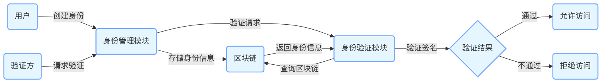

# 如何评估企业的区块链去中心化身份验证平台

> 关键词：区块链、去中心化身份验证平台、评估指标、安全机制、性能效率

> 摘要：本文围绕如何评估企业的区块链去中心化身份验证平台展开。首先介绍了相关背景信息，包括目的、预期读者、文档结构和术语表。接着阐述了核心概念及联系，详细分析了核心算法原理与操作步骤，并结合数学模型和公式进行讲解。通过项目实战案例，展示了开发环境搭建、代码实现与解读。还探讨了该平台的实际应用场景，推荐了学习资源、开发工具和相关论文著作。最后总结了未来发展趋势与挑战，提供了常见问题解答和扩展阅读参考资料，旨在为企业评估区块链去中心化身份验证平台提供全面、系统的指导。

## 1. 背景介绍 
### 1.1 目的和范围
随着数字化时代的发展，企业对于用户身份验证的安全性和隐私性要求越来越高。区块链去中心化身份验证平台作为一种新兴的解决方案，能够有效解决传统身份验证方式存在的诸多问题。本文章的目的在于为企业提供一套全面、科学的评估方法，帮助企业准确判断区块链去中心化身份验证平台是否符合自身需求。范围涵盖了平台的技术原理、功能特性、性能指标、安全机制等多个方面，旨在从多个维度对平台进行综合评估。

### 1.2 预期读者
本文的预期读者主要包括企业的技术决策者、信息安全专家、区块链技术开发者以及对区块链去中心化身份验证感兴趣的研究人员。对于技术决策者而言，他们可以通过本文了解评估平台的关键要点，为企业选择合适的平台提供决策依据；信息安全专家能够深入了解平台的安全机制，评估其在保障用户身份信息安全方面的能力；区块链技术开发者可以从本文中获取平台的核心算法原理和代码实现细节，为开发和优化平台提供参考；研究人员则可以通过本文对区块链去中心化身份验证平台有更全面的认识，为进一步的研究提供基础。

### 1.3 文档结构概述
本文将按照以下结构进行阐述：首先介绍核心概念与联系，帮助读者理解区块链去中心化身份验证平台的基本原理和架构；接着详细讲解核心算法原理和具体操作步骤，并结合Python代码进行说明；然后引入数学模型和公式，对平台的关键指标进行量化分析；通过项目实战案例，展示平台的实际开发和应用过程；探讨平台的实际应用场景，说明其在不同领域的价值；推荐相关的学习资源、开发工具和论文著作，为读者提供进一步学习和研究的途径；最后总结未来发展趋势与挑战，解答常见问题，并提供扩展阅读和参考资料。

### 1.4 术语表
#### 1.4.1 核心术语定义
- **区块链（Blockchain）**：一种分布式账本技术，由多个区块组成，每个区块包含一定数量的交易记录，通过密码学算法保证数据的不可篡改和可追溯性。
- **去中心化身份验证（Decentralized Identity Verification）**：一种不依赖于单一中心化机构的身份验证方式，用户的身份信息由用户自己掌控，通过区块链等技术实现身份信息的安全存储和验证。
- **智能合约（Smart Contract）**：一种基于区块链的自动化合约，它以代码的形式存在，当满足预设的条件时，合约会自动执行相应的操作。
- **公钥加密（Public - Key Cryptography）**：一种加密算法，使用一对密钥（公钥和私钥）进行加密和解密操作，公钥可以公开，私钥由用户秘密保存。

#### 1.4.2 相关概念解释
- **分布式账本（Distributed Ledger）**：是一种在多个节点之间共享、复制和同步的数据库，它允许参与者在没有中央协调者的情况下共同维护一个一致的账本。
- **零知识证明（Zero - Knowledge Proof）**：是一种密码学技术，证明者能够在不向验证者提供任何有用信息的情况下，使验证者相信某个论断是正确的。在身份验证中，零知识证明可以用于验证用户身份而不泄露用户的敏感信息。

#### 1.4.3 缩略词列表
- **P2P（Peer - to - Peer）**：点对点网络，一种网络拓扑结构，节点之间直接进行通信和数据交换，无需通过中央服务器。
- **PKI（Public Key Infrastructure）**：公钥基础设施，是一种用于管理公钥的技术体系，包括数字证书、证书颁发机构（CA）等。

## 2. 核心概念与联系 
### 核心概念原理
区块链去中心化身份验证平台的核心原理是基于区块链的分布式账本技术和密码学算法，实现用户身份信息的安全存储和验证。在传统的身份验证方式中，用户的身份信息通常存储在中心化的服务器中，一旦服务器被攻击，用户的身份信息就可能泄露。而在区块链去中心化身份验证平台中，用户的身份信息以加密的形式存储在区块链上，每个用户拥有自己的私钥，用于对身份信息进行签名和验证。

当用户需要进行身份验证时，验证方可以通过区块链上的公钥验证用户的签名，从而确认用户的身份。同时，区块链的不可篡改特性保证了身份信息的完整性和真实性。此外，平台还可以结合零知识证明等技术，在不泄露用户敏感信息的情况下完成身份验证。

### 架构示意图


该架构图展示了区块链去中心化身份验证平台的主要组成部分和工作流程。用户通过身份管理模块创建自己的身份信息，并将其存储在区块链上。当验证方需要验证用户身份时，向身份管理模块发送请求，身份验证模块从区块链上获取用户的身份信息，并进行签名验证，最终返回验证结果。

## 3. 核心算法原理 & 具体操作步骤 
### 核心算法原理
区块链去中心化身份验证平台主要涉及到公钥加密算法和数字签名算法。下面以Python代码为例，详细介绍这些算法的实现原理。

#### 公钥加密算法（RSA）
RSA是一种广泛使用的公钥加密算法，它基于大整数分解的困难性。以下是使用Python的`cryptography`库实现RSA加密和解密的示例代码：

```python
from cryptography.hazmat.backends import default_backend
from cryptography.hazmat.primitives.asymmetric import rsa, padding
from cryptography.hazmat.primitives import serialization, hashes

# 生成RSA密钥对
private_key = rsa.generate_private_key(
    public_exponent=65537,
    key_size=2048,
    backend=default_backend()
)
public_key = private_key.public_key()

# 序列化密钥
private_pem = private_key.private_bytes(
    encoding=serialization.Encoding.PEM,
    format=serialization.PrivateFormat.PKCS8,
    encryption_algorithm=serialization.NoEncryption()
)
public_pem = public_key.public_bytes(
    encoding=serialization.Encoding.PEM,
    format=serialization.PublicFormat.SubjectPublicKeyInfo
)

# 加密数据
message = b"Hello, World!"
encrypted = public_key.encrypt(
    message,
    padding.OAEP(
        mgf=padding.MGF1(algorithm=hashes.SHA256()),
        algorithm=hashes.SHA256(),
        label=None
    )
)

# 解密数据
decrypted = private_key.decrypt(
    encrypted,
    padding.OAEP(
        mgf=padding.MGF1(algorithm=hashes.SHA256()),
        algorithm=hashes.SHA256(),
        label=None
    )
)

print(f"Original message: {message}")
print(f"Decrypted message: {decrypted}")
```

#### 数字签名算法（ECDSA）
ECDSA是一种基于椭圆曲线密码学的数字签名算法，它具有更高的安全性和效率。以下是使用Python的`ecdsa`库实现ECDSA签名和验证的示例代码：

```python
import ecdsa
import hashlib

# 生成ECDSA密钥对
sk = ecdsa.SigningKey.generate(curve=ecdsa.SECP256k1)
vk = sk.get_verifying_key()

# 待签名的数据
message = b"Hello, World!"
hash_message = hashlib.sha256(message).digest()

# 签名
signature = sk.sign(hash_message)

# 验证签名
verified = vk.verify(signature, hash_message)

print(f"Signature verified: {verified}")
```

### 具体操作步骤
1. **用户注册**：用户使用自己的私钥对身份信息进行签名，并将签名后的信息和公钥发送到区块链上进行存储。
2. **验证请求**：验证方需要验证用户身份时，向平台发送验证请求，包含用户的公钥和需要验证的信息。
3. **信息查询**：平台从区块链上获取用户的身份信息和签名。
4. **签名验证**：使用用户的公钥对签名进行验证，判断签名是否有效。
5. **返回结果**：根据验证结果，返回验证通过或不通过的信息给验证方。

## 4. 数学模型和公式 & 详细讲解 & 举例说明 
### 公钥加密数学模型
RSA公钥加密算法基于数论中的大整数分解问题。其数学模型如下：

#### 密钥生成
1. 选择两个大素数 $p$ 和 $q$。
2. 计算 $n = p \times q$ 和 $\varphi(n)=(p - 1)\times(q - 1)$，其中 $\varphi(n)$ 是欧拉函数。
3. 选择一个整数 $e$，使得 $1 < e < \varphi(n)$ 且 $\gcd(e,\varphi(n)) = 1$，$e$ 为公钥指数。
4. 计算 $d$，使得 $d\times e\equiv1\pmod{\varphi(n)}$，$d$ 为私钥指数。

公钥为 $(n, e)$，私钥为 $(n, d)$。

#### 加密过程
设明文为 $m$，满足 $0 < m < n$，则密文 $c$ 为：
$$c = m^e\bmod n$$

#### 解密过程
根据密文 $c$ 恢复明文 $m$：
$$m = c^d\bmod n$$

**举例说明**：
假设 $p = 3$，$q = 11$，则 $n = p\times q=33$，$\varphi(n)=(p - 1)\times(q - 1)=20$。选择 $e = 3$，因为 $\gcd(3,20)=1$。计算 $d$，使得 $3d\equiv1\pmod{20}$，通过扩展欧几里得算法可得 $d = 7$。

若明文 $m = 5$，则密文 $c = m^e\bmod n=5^3\bmod 33 = 125\bmod 33 = 26$。

解密时，$m = c^d\bmod n=26^7\bmod 33$，通过快速幂算法计算可得 $m = 5$，与原文一致。

### 数字签名数学模型
ECDSA数字签名算法基于椭圆曲线离散对数问题。设椭圆曲线 $E$ 定义在有限域 $\mathbb{F}_p$ 上，基点为 $G$，私钥为 $k$，公钥为 $Q = kG$。

#### 签名过程
1. 选择一个随机数 $r$，计算 $R = rG=(x_R,y_R)$。
2. 计算 $s=\frac{1}{r}(h(m)+k\times x_R)\bmod n$，其中 $h(m)$ 是消息 $m$ 的哈希值，$n$ 是椭圆曲线的阶。

签名为 $(r, s)$。

#### 验证过程
1. 计算 $u_1=\frac{h(m)}{s}\bmod n$ 和 $u_2=\frac{r}{s}\bmod n$。
2. 计算 $R' = u_1G + u_2Q=(x_{R'},y_{R'})$。
3. 验证 $x_{R'}\equiv r\pmod{n}$。

**举例说明**：
假设椭圆曲线为 $y^2=x^3 + ax + b\pmod{p}$，基点 $G=(x_G,y_G)$，私钥 $k = 5$，公钥 $Q = kG$。消息 $m$ 的哈希值 $h(m)=10$，随机数 $r = 3$。

计算 $R = rG=(x_R,y_R)$，然后计算 $s=\frac{1}{r}(h(m)+k\times x_R)\bmod n$。

验证时，计算 $u_1=\frac{h(m)}{s}\bmod n$ 和 $u_2=\frac{r}{s}\bmod n$，再计算 $R' = u_1G + u_2Q$，最后验证 $x_{R'}\equiv r\pmod{n}$。

## 5. 项目实战：代码实际案例和详细解释说明 
### 5.1  开发环境搭建
#### 安装Python
首先，确保你已经安装了Python 3.x 版本。可以从Python官方网站（https://www.python.org/downloads/）下载并安装。

#### 安装必要的库
使用`pip`命令安装以下必要的库：
```sh
pip install cryptography ecdsa web3
```
- `cryptography`：用于实现公钥加密和数字签名算法。
- `ecdsa`：用于实现ECDSA数字签名算法。
- `web3`：用于与以太坊区块链进行交互。

#### 搭建以太坊测试网络
可以使用Ganache（https://trufflesuite.com/ganache/）搭建一个本地的以太坊测试网络。安装并启动Ganache后，会生成一些测试账户和私钥，用于开发和测试。

### 5.2  源代码详细实现和代码解读
以下是一个简单的区块链去中心化身份验证平台的Python代码示例：

```python
from web3 import Web3
from cryptography.hazmat.backends import default_backend
from cryptography.hazmat.primitives.asymmetric import rsa, padding
from cryptography.hazmat.primitives import serialization, hashes
import ecdsa
import hashlib

# 连接到以太坊测试网络
w3 = Web3(Web3.HTTPProvider('http://127.0.0.1:7545'))

# 生成RSA密钥对
def generate_rsa_key_pair():
    private_key = rsa.generate_private_key(
        public_exponent=65537,
        key_size=2048,
        backend=default_backend()
    )
    public_key = private_key.public_key()
    private_pem = private_key.private_bytes(
        encoding=serialization.Encoding.PEM,
        format=serialization.PrivateFormat.PKCS8,
        encryption_algorithm=serialization.NoEncryption()
    )
    public_pem = public_key.public_bytes(
        encoding=serialization.Encoding.PEM,
        format=serialization.PublicFormat.SubjectPublicKeyInfo
    )
    return private_pem, public_pem

# 生成ECDSA密钥对
def generate_ecdsa_key_pair():
    sk = ecdsa.SigningKey.generate(curve=ecdsa.SECP256k1)
    vk = sk.get_verifying_key()
    private_key = sk.to_string()
    public_key = vk.to_string()
    return private_key, public_key

# 签名消息
def sign_message(private_key, message):
    sk = ecdsa.SigningKey.from_string(private_key, curve=ecdsa.SECP256k1)
    hash_message = hashlib.sha256(message).digest()
    signature = sk.sign(hash_message)
    return signature

# 验证签名
def verify_signature(public_key, message, signature):
    vk = ecdsa.VerifyingKey.from_string(public_key, curve=ecdsa.SECP256k1)
    hash_message = hashlib.sha256(message).digest()
    try:
        verified = vk.verify(signature, hash_message)
        return verified
    except ecdsa.BadSignatureError:
        return False

# 存储身份信息到区块链
def store_identity_on_blockchain(public_key, signature):
    # 这里简单模拟存储到区块链，实际需要使用智能合约
    tx_hash = w3.eth.sendTransaction({
        'from': w3.eth.accounts[0],
        'to': w3.eth.accounts[1],
        'value': w3.toWei(1, 'ether'),
        'data': public_key + signature
    })
    return tx_hash

# 从区块链获取身份信息
def get_identity_from_blockchain(tx_hash):
    receipt = w3.eth.getTransactionReceipt(tx_hash)
    data = receipt['input']
    public_key = data[:len(data) // 2]
    signature = data[len(data) // 2:]
    return public_key, signature

# 主函数
def main():
    # 生成RSA和ECDSA密钥对
    rsa_private_pem, rsa_public_pem = generate_rsa_key_pair()
    ecdsa_private_key, ecdsa_public_key = generate_ecdsa_key_pair()

    # 待签名的消息
    message = b"User Identity Information"

    # 签名消息
    signature = sign_message(ecdsa_private_key, message)

    # 验证签名
    verified = verify_signature(ecdsa_public_key, message, signature)
    print(f"Signature verified: {verified}")

    # 存储身份信息到区块链
    tx_hash = store_identity_on_blockchain(ecdsa_public_key, signature)
    print(f"Transaction hash: {tx_hash.hex()}")

    # 从区块链获取身份信息
    public_key, signature = get_identity_from_blockchain(tx_hash)
    print(f"Retrieved public key: {public_key}")
    print(f"Retrieved signature: {signature}")

if __name__ == "__main__":
    main()
```

### 5.3  代码解读与分析
1. **密钥生成**：`generate_rsa_key_pair` 函数用于生成RSA密钥对，`generate_ecdsa_key_pair` 函数用于生成ECDSA密钥对。
2. **签名和验证**：`sign_message` 函数使用ECDSA私钥对消息进行签名，`verify_signature` 函数使用ECDSA公钥验证签名的有效性。
3. **区块链交互**：`store_identity_on_blockchain` 函数模拟将用户的公钥和签名存储到区块链上，`get_identity_from_blockchain` 函数从区块链上获取用户的身份信息。
4. **主函数**：在 `main` 函数中，依次完成密钥生成、消息签名、签名验证、身份信息存储和获取等操作。

## 6. 实际应用场景 
### 金融行业
在金融行业，区块链去中心化身份验证平台可以用于客户身份验证、账户登录等场景。通过使用该平台，金融机构可以提高客户身份验证的安全性和效率，减少身份欺诈的风险。例如，银行在开户时可以使用该平台验证客户的身份信息，确保客户信息的真实性和完整性。

### 医疗行业
在医疗行业，患者的个人健康信息非常敏感。区块链去中心化身份验证平台可以用于保护患者的隐私，确保只有授权的人员才能访问患者的健康信息。例如，医生在查询患者的病历信息时，需要通过该平台进行身份验证，验证通过后才能获取相关信息。

### 物联网行业
在物联网行业，大量的设备需要进行身份验证。区块链去中心化身份验证平台可以为物联网设备提供安全、可靠的身份验证机制。例如，智能家居设备在连接到网络时，需要通过该平台验证其身份，确保设备的合法性和安全性。

### 政务服务
在政务服务领域，区块链去中心化身份验证平台可以用于电子政务、社保查询等场景。通过该平台，政府部门可以提高服务效率，减少群众办事的繁琐流程。例如，市民在办理社保业务时，可以使用该平台进行身份验证，无需提供大量的纸质材料。

## 7. 工具和资源推荐
### 7.1 学习资源推荐
#### 7.1.1 书籍推荐
- 《区块链技术指南》：全面介绍了区块链的技术原理、应用场景和发展趋势，适合初学者入门。
- 《区块链：从数字货币到信用社会》：深入探讨了区块链的底层技术和经济逻辑，对于理解区块链的本质有很大帮助。
- 《Python密码学编程》：详细介绍了Python中密码学算法的实现，对于学习公钥加密和数字签名算法非常有用。

#### 7.1.2 在线课程
- Coursera上的“区块链基础”课程：由知名高校教授授课，系统讲解了区块链的基本概念和技术原理。
- edX上的“区块链技术与应用”课程：提供了丰富的案例分析和实践项目，帮助学员掌握区块链的实际应用。
- 网易云课堂上的“Python密码学实战”课程：通过实际案例，介绍了Python中密码学算法的应用。

#### 7.1.3 技术博客和网站
- Medium上的区块链相关博客：有很多区块链技术专家分享的文章，涵盖了区块链的各个领域。
- 巴比特（https://www.8btc.com/）：国内知名的区块链资讯平台，提供了大量的区块链技术文章和行业动态。
- 以太坊官方文档（https://ethereum.org/en/developers/docs/）：对于学习以太坊区块链技术非常有帮助。

### 7.2 开发工具框架推荐
#### 7.2.1 IDE和编辑器
- PyCharm：一款专业的Python集成开发环境，提供了丰富的代码编辑、调试和分析功能。
- Visual Studio Code：一款轻量级的代码编辑器，支持多种编程语言，通过安装插件可以实现强大的开发功能。

#### 7.2.2 调试和性能分析工具
- Ganache：用于搭建以太坊测试网络，方便开发者进行智能合约的开发和调试。
- Remix：一款基于Web的以太坊智能合约开发和调试工具，支持实时编译和调试。
- Py-Spy：用于Python代码的性能分析，可以帮助开发者找出代码中的性能瓶颈。

#### 7.2.3 相关框架和库
- Web3.py：用于与以太坊区块链进行交互的Python库，提供了丰富的API接口。
- CryptoJS：一个JavaScript库，用于实现各种密码学算法，方便在前端进行身份验证和加密操作。
- Hyperledger Fabric：一个开源的企业级区块链平台，提供了丰富的组件和工具，适用于开发大规模的区块链应用。

### 7.3 相关论文著作推荐
#### 7.3.1 经典论文
- “Bitcoin: A Peer - to - Peer Electronic Cash System”：比特币的白皮书，介绍了比特币的基本原理和实现机制。
- “Ethereum: A Next - Generation Smart Contract and Decentralized Application Platform”：以太坊的白皮书，阐述了以太坊的智能合约和去中心化应用平台的概念。

#### 7.3.2 最新研究成果
- 可以通过IEEE Xplore、ACM Digital Library等学术数据库搜索关于区块链去中心化身份验证的最新研究论文，了解该领域的最新技术和发展趋势。

#### 7.3.3 应用案例分析
- 可以参考一些知名企业的区块链应用案例分析报告，了解区块链去中心化身份验证平台在实际应用中的效果和挑战。例如，IBM、微软等公司都有相关的区块链应用案例分享。

## 8. 总结：未来发展趋势与挑战
### 未来发展趋势
- **标准化和互操作性**：随着区块链技术的发展，不同的区块链去中心化身份验证平台之间的标准化和互操作性将变得越来越重要。未来，可能会出现统一的身份验证标准和协议，使得不同平台之间可以实现身份信息的共享和互认。
- **与其他技术的融合**：区块链去中心化身份验证平台将与人工智能、物联网等技术进行深度融合。例如，结合人工智能技术可以实现更加智能的身份验证，结合物联网技术可以为物联网设备提供更加安全的身份管理。
- **广泛应用**：该平台将在更多的领域得到广泛应用，如供应链管理、教育、社交等。随着应用场景的不断拓展，区块链去中心化身份验证平台的市场需求将不断增加。

### 挑战
- **技术复杂性**：区块链技术本身具有较高的技术复杂性，包括密码学算法、分布式共识算法等。对于企业来说，开发和维护区块链去中心化身份验证平台需要具备较高的技术水平和专业知识。
- **法律和监管问题**：区块链去中心化身份验证平台涉及到用户的个人身份信息，需要遵守相关的法律法规。目前，各国对于区块链技术的法律和监管政策还不完善，这给平台的发展带来了一定的不确定性。
- **性能和扩展性**：随着用户数量的增加和应用场景的复杂化，区块链去中心化身份验证平台的性能和扩展性面临着挑战。如何提高平台的处理速度和存储容量，是未来需要解决的重要问题。

## 9. 附录：常见问题与解答
### 问题1：区块链去中心化身份验证平台与传统身份验证方式有什么区别？
传统身份验证方式通常依赖于单一的中心化机构，用户的身份信息存储在该机构的服务器中。一旦服务器被攻击，用户的身份信息就可能泄露。而区块链去中心化身份验证平台不依赖于单一中心化机构，用户的身份信息以加密的形式存储在区块链上，由用户自己掌控，具有更高的安全性和隐私性。

### 问题2：如何保证区块链上身份信息的安全性？
区块链上的身份信息通过公钥加密和数字签名等密码学算法进行保护。用户的私钥只有用户自己知道，用于对身份信息进行签名和验证。同时，区块链的不可篡改特性保证了身份信息的完整性和真实性。此外，还可以结合零知识证明等技术，在不泄露用户敏感信息的情况下完成身份验证。

### 问题3：区块链去中心化身份验证平台的性能如何？
目前，区块链技术的性能还存在一定的局限性，尤其是在处理大量交易时。不过，随着技术的不断发展，一些解决方案如分片技术、侧链技术等正在被研究和应用，以提高区块链的性能。在实际应用中，可以根据具体的需求和场景选择合适的区块链平台和技术方案。

### 问题4：企业如何选择适合自己的区块链去中心化身份验证平台？
企业在选择适合自己的区块链去中心化身份验证平台时，需要考虑以下几个方面：
- **功能需求**：根据企业的业务需求，选择具备相应功能的平台，如身份创建、验证、管理等功能。
- **安全性能**：评估平台的安全机制，包括密码学算法、数据存储方式等，确保平台能够保障用户身份信息的安全。
- **性能指标**：考虑平台的处理速度、吞吐量等性能指标，确保平台能够满足企业的业务需求。
- **技术支持**：选择具有良好技术支持的平台，以便在使用过程中遇到问题能够及时得到解决。
- **成本因素**：考虑平台的开发、部署和维护成本，确保在企业的预算范围内。

## 10. 扩展阅读 & 参考资料
### 扩展阅读
- 《区块链革命：比特币底层技术如何改变货币、商业和世界》：深入探讨了区块链技术对各个行业的影响和变革。
- 《密码学原理与实践》：全面介绍了密码学的基本原理和应用，对于理解区块链中的密码学算法有很大帮助。

### 参考资料
- Nakamoto, S. (2008). Bitcoin: A Peer - to - Peer Electronic Cash System.
- Wood, G. (2014). Ethereum: A Next - Generation Smart Contract and Decentralized Application Platform.

作者：AI天才研究院/AI Genius Institute & 禅与计算机程序设计艺术 /Zen And The Art of Computer Programming