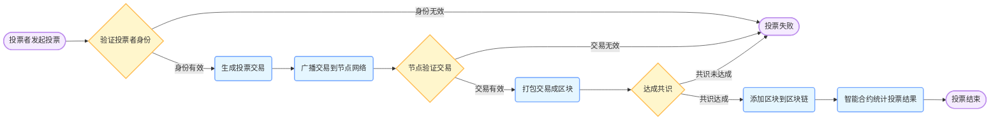

# 如何评估企业的区块链投票系统应用

> 关键词：企业、区块链投票系统、评估、分布式账本、智能合约、投票安全、投票效率

> 摘要：本文旨在深入探讨如何对企业的区块链投票系统应用进行全面评估。首先介绍了相关背景知识，包括目的范围、预期读者等内容。接着阐述了区块链投票系统的核心概念与联系，详细讲解其原理和架构。通过Python源代码展示核心算法原理和具体操作步骤，并辅以数学模型和公式进行深入分析。在项目实战部分，给出代码实际案例并详细解释说明。随后探讨了该系统的实际应用场景，推荐了相关的工具和资源。最后总结了未来发展趋势与挑战，还包含常见问题解答及扩展阅读参考资料，帮助读者全面、系统地了解如何评估企业的区块链投票系统应用。

## 1. 背景介绍 
### 1.1 目的和范围
企业采用区块链投票系统的目的在于提高投票的公正性、透明度和安全性，减少人为干预和欺诈行为。同时，提升投票效率，降低成本。本评估的范围涵盖区块链投票系统的各个方面，包括技术架构、功能特性、性能指标、安全保障、用户体验等，旨在为企业提供一个全面、客观的评估标准，以确定该系统是否适合企业的业务需求和发展战略。

### 1.2 预期读者
本文预期读者包括企业的决策者、技术管理人员、区块链技术爱好者以及对投票系统安全和效率有关注的相关人士。决策者可以根据评估结果决定是否引入区块链投票系统；技术管理人员可从中了解系统的技术细节，以便更好地进行系统选型和管理；区块链技术爱好者能深入学习区块链在投票系统中的应用；而关注投票系统安全和效率的人士则可获取全面的评估知识。

### 1.3 文档结构概述
本文首先介绍背景信息，让读者了解评估的目的和范围等内容。接着阐述区块链投票系统的核心概念与联系，包括原理和架构。然后详细讲解核心算法原理和具体操作步骤，并用数学模型和公式进行分析。通过项目实战展示代码案例及详细解释。探讨实际应用场景后，推荐相关的工具和资源。最后总结未来发展趋势与挑战，提供常见问题解答和扩展阅读参考资料。

### 1.4 术语表
#### 1.4.1 核心术语定义
- **区块链**：一种分布式账本技术，由多个节点共同维护，数据以区块的形式按时间顺序相连，具有不可篡改、去中心化等特点。
- **智能合约**：一种基于区块链的自动化合约，它可以根据预设的条件自动执行相应的操作，无需第三方干预。
- **共识机制**：区块链网络中节点达成一致的算法，用于确保数据的一致性和安全性。
- **哈希函数**：一种将任意长度的输入转换为固定长度输出的函数，具有不可逆性和唯一性，常用于数据验证和完整性检查。

#### 1.4.2 相关概念解释
- **分布式账本**：多个节点共同维护的账本，每个节点都有完整或部分的账本副本，数据在节点之间同步，保证数据的一致性和可靠性。
- **加密技术**：用于保护数据安全的技术，包括对称加密和非对称加密。在区块链投票系统中，加密技术用于保护投票信息的隐私和完整性。
- **去中心化**：指系统不依赖于单一的中心节点，而是由多个节点共同组成网络，每个节点都具有相同的权利和义务，提高系统的可靠性和抗攻击性。

#### 1.4.3 缩略词列表
- **P2P**：Peer - to - Peer，点对点网络。
- **PoW**：Proof of Work，工作量证明。
- **PoS**：Proof of Stake，权益证明。
- **PBFT**：Practical Byzantine Fault Tolerance，实用拜占庭容错算法。

## 2. 核心概念与联系 

### 核心概念原理
区块链投票系统基于区块链的分布式账本技术，将投票信息记录在区块链上。每个投票作为一个交易，被打包成区块，添加到区块链中。由于区块链的不可篡改特性，一旦投票信息被记录，就无法被修改，保证了投票的公正性和透明度。智能合约在投票系统中起到重要作用，它可以自动验证投票者的身份、检查投票规则是否符合要求，并在满足条件时自动统计投票结果。

### 架构的文本示意图
区块链投票系统主要由客户端、节点网络和区块链账本三部分组成。客户端是投票者使用的界面，用于发起投票请求。节点网络由多个节点组成，负责验证投票交易、达成共识和传播数据。区块链账本存储所有的投票信息，每个节点都有一份副本。

### Mermaid 流程图


## 3. 核心算法原理 & 具体操作步骤 

### 核心算法原理
区块链投票系统中常用的共识机制有工作量证明（PoW）、权益证明（PoS）和实用拜占庭容错算法（PBFT）等。这里以工作量证明为例进行讲解。工作量证明的核心思想是让节点通过计算一个复杂的数学难题来竞争记账权，第一个计算出正确答案的节点可以将新的区块添加到区块链中。

### 具体操作步骤
1. **节点接收交易**：节点从网络中接收投票交易。
2. **验证交易**：节点验证交易的合法性，包括投票者身份、投票规则等。
3. **打包交易**：将验证通过的交易打包成一个候选区块。
4. **计算难题**：节点开始计算工作量证明难题，即寻找一个符合要求的随机数。
5. **广播结果**：当节点找到正确的随机数后，将结果广播到网络中。
6. **其他节点验证**：其他节点验证该结果的正确性。
7. **达成共识**：如果大多数节点验证通过，则达成共识，该区块被添加到区块链中。

### Python源代码实现
```python
import hashlib
import time

class Block:
    def __init__(self, index, transactions, previous_hash):
        self.index = index
        self.transactions = transactions
        self.previous_hash = previous_hash
        self.timestamp = time.time()
        self.nonce = 0
        self.hash = self.calculate_hash()

    def calculate_hash(self):
        block_string = f"{self.index}{self.transactions}{self.previous_hash}{self.timestamp}{self.nonce}"
        return hashlib.sha256(block_string.encode()).hexdigest()

    def mine_block(self, difficulty):
        target = "0" * difficulty
        while self.hash[:difficulty] != target:
            self.nonce += 1
            self.hash = self.calculate_hash()
        print(f"Block mined: {self.hash}")


class Blockchain:
    def __init__(self):
        self.chain = [self.create_genesis_block()]
        self.difficulty = 2

    def create_genesis_block(self):
        return Block(0, ["Genesis Block"], "0")

    def get_latest_block(self):
        return self.chain[-1]

    def add_block(self, new_block):
        new_block.previous_hash = self.get_latest_block().hash
        new_block.mine_block(self.difficulty)
        self.chain.append(new_block)


# 模拟投票交易
voting_transactions = ["Vote for Candidate A", "Vote for Candidate B"]

# 创建区块链
blockchain = Blockchain()

# 添加区块
for i in range(len(voting_transactions)):
    new_block = Block(i + 1, [voting_transactions[i]], blockchain.get_latest_block().hash)
    blockchain.add_block(new_block)


```
### 代码解释
上述代码实现了一个简单的区块链投票系统的工作量证明算法。`Block`类表示一个区块，包含索引、交易信息、前一个区块的哈希值、时间戳、随机数和当前区块的哈希值。`mine_block`方法用于计算工作量证明难题，找到符合难度要求的随机数。`Blockchain`类表示区块链，包含一个区块列表和难度值。`add_block`方法用于将新的区块添加到区块链中。

## 4. 数学模型和公式 & 详细讲解 & 举例说明 

### 哈希函数
哈希函数是区块链中重要的数学工具，用于保证数据的完整性和不可篡改。常用的哈希函数有SHA - 256等。哈希函数的数学表达式可以表示为：
$$H(x) = y$$
其中，$x$ 是输入数据，$y$ 是固定长度的哈希值。哈希函数具有以下特性：
1. **确定性**：对于相同的输入 $x$，哈希函数总是返回相同的输出 $y$。
2. **高效性**：计算哈希值的过程应该是高效的。
3. **不可逆性**：从哈希值 $y$ 很难推导出原始输入 $x$。
4. **抗碰撞性**：很难找到两个不同的输入 $x_1$ 和 $x_2$，使得 $H(x_1) = H(x_2)$。

### 举例说明
假设我们有一个投票信息 $x =$ "Vote for Candidate A"，使用SHA - 256哈希函数计算其哈希值：
```python
import hashlib

vote_info = "Vote for Candidate A"
hash_value = hashlib.sha256(vote_info.encode()).hexdigest()
print(f"Vote Info: {vote_info}")
print(f"Hash Value: {hash_value}")
```
运行上述代码，会得到一个固定长度的哈希值，这个哈希值可以用于验证投票信息的完整性。如果投票信息被篡改，其哈希值将发生变化。

### 工作量证明难度调整公式
在工作量证明机制中，难度值是动态调整的，以保证区块生成的时间相对稳定。难度调整公式可以表示为：
$$D_{new} = D_{old} \times \frac{T_{target}}{T_{actual}}$$
其中，$D_{new}$ 是新的难度值，$D_{old}$ 是旧的难度值，$T_{target}$ 是目标区块生成时间，$T_{actual}$ 是实际区块生成时间。

### 举例说明
假设初始难度值 $D_{old} = 2$，目标区块生成时间 $T_{target} = 10$ 分钟，实际区块生成时间 $T_{actual} = 20$ 分钟。则新的难度值为：
$$D_{new} = 2 \times \frac{10}{20} = 1$$
难度值降低，意味着节点更容易找到符合要求的随机数，从而加快区块生成速度。

## 5. 项目实战：代码实际案例和详细解释说明 

### 5.1  开发环境搭建
1. **安装Python**：从Python官方网站（https://www.python.org/downloads/）下载并安装Python 3.x版本。
2. **安装开发工具**：可以选择PyCharm、VS Code等开发工具，方便编写和调试代码。
3. **创建虚拟环境**：使用`venv`或`conda`创建虚拟环境，隔离项目依赖。例如，使用`venv`创建虚拟环境：
```bash
python -m venv myenv
source myenv/bin/activate  # 激活虚拟环境（Windows使用 myenv\Scripts\activate）
```

### 5.2  源代码详细实现和代码解读
以下是一个更完整的区块链投票系统的Python代码示例：
```python
import hashlib
import time
import json


class Block:
    def __init__(self, index, transactions, previous_hash):
        self.index = index
        self.transactions = transactions
        self.previous_hash = previous_hash
        self.timestamp = time.time()
        self.nonce = 0
        self.hash = self.calculate_hash()

    def calculate_hash(self):
        block_string = json.dumps({
            "index": self.index,
            "transactions": self.transactions,
            "previous_hash": self.previous_hash,
            "timestamp": self.timestamp,
            "nonce": self.nonce
        }, sort_keys=True).encode()
        return hashlib.sha256(block_string).hexdigest()

    def mine_block(self, difficulty):
        target = "0" * difficulty
        while self.hash[:difficulty] != target:
            self.nonce += 1
            self.hash = self.calculate_hash()
        print(f"Block mined: {self.hash}")


class Blockchain:
    def __init__(self):
        self.chain = [self.create_genesis_block()]
        self.difficulty = 2
        self.pending_transactions = []

    def create_genesis_block(self):
        return Block(0, ["Genesis Block"], "0")

    def get_latest_block(self):
        return self.chain[-1]

    def add_transaction(self, transaction):
        self.pending_transactions.append(transaction)

    def mine_pending_transactions(self):
        new_block = Block(len(self.chain), self.pending_transactions, self.get_latest_block().hash)
        new_block.mine_block(self.difficulty)
        self.chain.append(new_block)
        self.pending_transactions = []


# 模拟投票系统
blockchain = Blockchain()

# 添加投票交易
blockchain.add_transaction("Vote for Candidate A")
blockchain.add_transaction("Vote for Candidate B")

# 挖矿，将投票交易打包到区块中
blockchain.mine_pending_transactions()

# 打印区块链
for block in blockchain.chain:
    print(f"Index: {block.index}")
    print(f"Transactions: {block.transactions}")
    print(f"Hash: {block.hash}")
    print("-" * 50)


```
### 代码解读
1. **Block类**：表示一个区块，包含索引、交易信息、前一个区块的哈希值、时间戳、随机数和当前区块的哈希值。`calculate_hash`方法用于计算区块的哈希值，`mine_block`方法用于实现工作量证明算法。
2. **Blockchain类**：表示区块链，包含一个区块列表、难度值和待处理的交易列表。`create_genesis_block`方法创建创世区块，`add_transaction`方法将新的交易添加到待处理列表中，`mine_pending_transactions`方法将待处理的交易打包成一个新的区块并添加到区块链中。
3. **模拟投票系统**：创建一个区块链实例，添加投票交易，然后挖矿将交易打包到区块中，最后打印区块链信息。

### 5.3  代码解读与分析
通过上述代码，我们可以看到区块链投票系统的基本工作流程。投票交易被添加到待处理列表中，然后通过挖矿将这些交易打包成区块添加到区块链中。由于区块链的不可篡改特性，投票信息一旦被记录就无法被修改，保证了投票的公正性和透明度。同时，工作量证明算法保证了只有通过计算难题的节点才能将新的区块添加到区块链中，提高了系统的安全性。

## 6. 实际应用场景 
### 企业内部决策投票
企业在进行重大决策时，如战略规划、项目投资等，可以使用区块链投票系统让员工进行投票。这样可以保证投票的公正性和透明度，避免人为干预和欺诈行为，提高决策的科学性和民主性。

### 股东投票
在企业的股东大会上，股东可以使用区块链投票系统进行投票，表达自己的意见。区块链技术可以保证股东身份的真实性和投票的不可篡改，提高股东投票的效率和安全性。

### 行业协会投票
行业协会在进行选举、制定行业标准等活动时，可以采用区块链投票系统。这有助于提高协会决策的公正性和透明度，增强会员的参与度和信任度。

### 供应链投票
在供应链中，供应商、制造商、物流商等各方可以使用区块链投票系统进行决策，如选择合作伙伴、确定价格等。区块链技术可以保证各方信息的共享和透明，提高供应链的协同效率和稳定性。

## 7. 工具和资源推荐
### 7.1 学习资源推荐
#### 7.1.1 书籍推荐
- 《区块链：技术驱动金融》：全面介绍了区块链的技术原理、应用场景和发展趋势，是学习区块链的经典书籍。
- 《Python区块链实战》：结合Python语言，详细讲解了区块链的实现原理和开发方法，适合有一定编程基础的读者。
- 《智能合约：原理、工具与应用》：深入探讨了智能合约的原理和应用，对理解区块链投票系统中的智能合约有很大帮助。

#### 7.1.2 在线课程
- Coursera上的“区块链基础”课程：由知名大学教授授课，系统地介绍了区块链的基础知识和应用。
- edX上的“区块链技术与应用”课程：提供了丰富的案例和实践项目，帮助学习者深入理解区块链技术。
- Udemy上的“Python区块链开发实战”课程：通过实际项目，手把手教你使用Python开发区块链应用。

#### 7.1.3 技术博客和网站
- 巴比特（https://www.8btc.com/）：国内知名的区块链资讯平台，提供最新的区块链技术、行业动态和分析文章。
- 链闻（https://www.chainnews.com/）：专注于区块链行业的信息服务，提供深度的行业报道和研究分析。
- Medium上的区块链相关博客：有很多区块链专家和开发者分享的技术文章和经验。

### 7.2 开发工具框架推荐
#### 7.2.1 IDE和编辑器
- PyCharm：功能强大的Python集成开发环境，提供代码编辑、调试、版本控制等功能，适合开发区块链Python应用。
- VS Code：轻量级的代码编辑器，支持多种编程语言和插件，可通过安装相关插件方便地进行区块链开发。
- IntelliJ IDEA：支持多种编程语言的集成开发环境，对智能合约开发有很好的支持。

#### 7.2.2 调试和性能分析工具
- Ganache：用于以太坊区块链的本地开发和测试工具，提供区块链节点模拟和调试功能。
- Truffle：以太坊开发框架，提供合约编译、部署、测试等功能，方便进行智能合约的开发和调试。
- Web3.py：Python库，用于与以太坊区块链进行交互，可用于调试和测试基于以太坊的区块链应用。

#### 7.2.3 相关框架和库
- Hyperledger Fabric：开源的企业级区块链框架，提供高度可定制的区块链解决方案，适合开发企业级的区块链投票系统。
- Ethereum：全球知名的区块链平台，支持智能合约开发，有丰富的开发工具和社区资源。
- Solidity：以太坊智能合约开发语言，用于编写智能合约代码。

### 7.3 相关论文著作推荐
#### 7.3.1 经典论文
- “Bitcoin: A Peer - to - Peer Electronic Cash System”：比特币的白皮书，首次提出了区块链的概念和实现方法。
- “Ethereum: A Next - Generation Smart Contract and Decentralized Application Platform”：以太坊的白皮书，介绍了以太坊的智能合约和去中心化应用平台。
- “Practical Byzantine Fault Tolerance”：提出了实用拜占庭容错算法，是区块链共识机制的重要理论基础。

#### 7.3.2 最新研究成果
- 可以通过IEEE Xplore、ACM Digital Library等学术数据库搜索关于区块链投票系统的最新研究论文，了解该领域的最新技术和发展趋势。

#### 7.3.3 应用案例分析
- 可以参考一些知名企业和机构的区块链投票系统应用案例，如纳斯达克的区块链投票系统、瑞士楚格州的区块链投票试点项目等，学习他们的经验和做法。

## 8. 总结：未来发展趋势与挑战
### 未来发展趋势
1. **与其他技术融合**：区块链投票系统将与人工智能、物联网等技术融合，实现更加智能化、自动化的投票过程。例如，通过人工智能技术对投票者身份进行更准确的验证，通过物联网设备实现远程投票。
2. **跨链投票**：随着区块链技术的发展，不同区块链之间的互操作性将得到提高，实现跨链投票将成为可能。这将扩大投票的范围和参与度，提高投票的效率和影响力。
3. **隐私保护增强**：未来的区块链投票系统将更加注重隐私保护，采用零知识证明、同态加密等技术，在保证投票公正性和透明度的同时，保护投票者的隐私。

### 挑战
1. **技术复杂性**：区块链技术本身具有较高的复杂性，开发和维护区块链投票系统需要具备专业的技术知识和技能。同时，不同的共识机制、智能合约语言等也增加了系统的复杂性。
2. **法律法规不完善**：目前，关于区块链投票系统的法律法规还不完善，缺乏明确的监管标准和规范。这可能导致在实际应用中出现法律风险和纠纷。
3. **用户接受度**：由于区块链技术相对较新，部分用户对其安全性和可靠性存在疑虑，可能影响区块链投票系统的推广和应用。

## 9. 附录：常见问题与解答
### 1. 区块链投票系统的安全性如何保证？
区块链投票系统通过加密技术、共识机制和不可篡改的特性来保证安全性。加密技术用于保护投票信息的隐私和完整性，共识机制确保节点之间的数据一致性，不可篡改特性防止投票信息被修改。

### 2. 区块链投票系统的效率如何？
区块链投票系统的效率取决于多个因素，如共识机制、网络带宽等。一些新型的共识机制，如PBFT等，可以提高系统的效率。同时，优化网络结构和算法也可以提升投票系统的效率。

### 3. 如何确保投票者身份的真实性？
可以采用多种方式确保投票者身份的真实性，如使用数字证书、生物识别技术等。在区块链投票系统中，投票者的身份信息可以被加密存储在区块链上，只有授权的节点才能访问和验证。

### 4. 区块链投票系统可以实现匿名投票吗？
可以。通过采用零知识证明、环签名等技术，区块链投票系统可以实现匿名投票，在保证投票结果公正透明的同时，保护投票者的隐私。

## 10. 扩展阅读 & 参考资料
1. Nakamoto, S. (2008). Bitcoin: A Peer - to - Peer Electronic Cash System.
2. Buterin, V. (2013). Ethereum: A Next - Generation Smart Contract and Decentralized Application Platform.
3. Castro, M., & Liskov, B. (1999). Practical Byzantine Fault Tolerance.
4. 《区块链技术原理与应用》，机械工业出版社。
5. 巴比特官网（https://www.8btc.com/）
6. 链闻官网（https://www.chainnews.com/）

作者：AI天才研究院/AI Genius Institute & 禅与计算机程序设计艺术 /Zen And The Art of Computer Programming