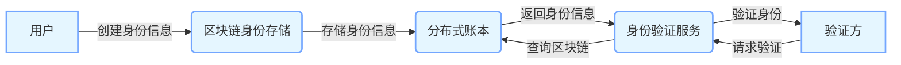

# 如何评估企业的区块链身份验证应用

> 关键词：企业区块链、身份验证应用、评估方法、区块链技术、身份管理

> 摘要：本文聚焦于企业区块链身份验证应用的评估。首先介绍了相关背景，包括评估的目的、范围、预期读者等内容。接着阐述了核心概念与联系，分析了核心算法原理及具体操作步骤，给出了数学模型和公式并举例说明。通过项目实战，展示了代码实现及详细解读。探讨了该应用的实际场景，推荐了学习、开发工具及相关论文著作。最后总结了未来发展趋势与挑战，解答常见问题，并提供扩展阅读和参考资料，旨在为企业评估区块链身份验证应用提供全面且深入的指导。

## 1. 背景介绍 
### 1.1 目的和范围
随着区块链技术的不断发展，其在身份验证领域的应用越来越受到企业的关注。企业在考虑采用区块链身份验证应用时，需要对其进行全面的评估，以确保该应用能够满足企业的需求，提高安全性和效率，降低成本。本评估的范围涵盖了区块链身份验证应用的各个方面，包括技术架构、功能特性、安全性、性能、合规性等。

### 1.2 预期读者
本文的预期读者包括企业的管理人员、技术人员、安全专家、合规人员等。这些人员在企业的决策过程中扮演着重要的角色，他们需要了解如何评估区块链身份验证应用，以便做出明智的决策。

### 1.3 文档结构概述
本文将按照以下结构进行组织：首先介绍核心概念与联系，帮助读者了解区块链身份验证应用的基本原理和架构；接着详细阐述核心算法原理及具体操作步骤，并给出Python源代码示例；然后介绍数学模型和公式，并通过具体例子进行说明；通过项目实战展示代码的实际实现和详细解释；探讨该应用的实际应用场景；推荐相关的工具和资源；总结未来发展趋势与挑战；解答常见问题；最后提供扩展阅读和参考资料。

### 1.4 术语表
#### 1.4.1 核心术语定义
- **区块链**：一种分布式账本技术，通过密码学方法保证数据的不可篡改和可追溯性。
- **身份验证**：确认用户身份的过程，确保只有合法用户能够访问系统或资源。
- **公钥加密**：一种加密算法，使用一对密钥（公钥和私钥）进行加密和解密。
- **智能合约**：一种自动执行的合约，其条款和条件以代码的形式存储在区块链上。

#### 1.4.2 相关概念解释
- **分布式账本**：多个节点共同维护的账本，每个节点都有完整的账本副本，数据的更新需要经过共识机制的验证。
- **共识机制**：用于在分布式系统中达成一致的算法，确保所有节点对账本的状态达成共识。
- **哈希函数**：一种将任意长度的输入转换为固定长度输出的函数，具有单向性和唯一性。

#### 1.4.3 缩略词列表
- **PKI**：公钥基础设施（Public Key Infrastructure）
- **SHA-256**：安全哈希算法256位（Secure Hash Algorithm 256-bit）
- **EVM**：以太坊虚拟机（Ethereum Virtual Machine）

## 2. 核心概念与联系 
### 核心概念原理
区块链身份验证应用的核心原理是利用区块链的分布式账本和密码学技术，实现用户身份的安全存储和验证。用户的身份信息以加密的形式存储在区块链上，只有用户本人拥有私钥才能解密和访问这些信息。在进行身份验证时，验证方通过与区块链交互，获取用户的身份信息并进行验证。

### 架构示意图


### 原理详细解释
1. **用户注册**：用户在区块链上创建自己的身份信息，包括公钥、个人资料等。这些信息经过加密处理后存储在区块链上。
2. **身份验证**：当用户需要进行身份验证时，验证方通过区块链查询用户的身份信息。验证方使用用户的公钥对身份信息进行解密，并与用户提供的信息进行比对。
3. **共识机制**：在区块链网络中，所有节点通过共识机制对身份信息的更新和验证进行确认，确保数据的一致性和安全性。

## 3. 核心算法原理 & 具体操作步骤 
### 核心算法原理
区块链身份验证应用中常用的核心算法包括公钥加密算法和哈希算法。公钥加密算法用于保证用户身份信息的安全性，哈希算法用于保证数据的完整性和不可篡改。

#### 公钥加密算法（RSA）
RSA算法是一种非对称加密算法，使用一对密钥（公钥和私钥）进行加密和解密。公钥可以公开，用于加密数据；私钥必须保密，用于解密数据。

#### 哈希算法（SHA-256）
SHA-256是一种安全哈希算法，将任意长度的输入转换为256位的哈希值。哈希值具有唯一性和单向性，即无法从哈希值反推出原始输入。

### 具体操作步骤
#### 步骤1：生成密钥对
```python
from Crypto.PublicKey import RSA

# 生成RSA密钥对
key = RSA.generate(2048)
private_key = key.export_key()
public_key = key.publickey().export_key()

print("私钥:", private_key)
print("公钥:", public_key)
```
#### 步骤2：加密身份信息
```python
from Crypto.Cipher import PKCS1_OAEP

# 使用公钥加密身份信息
message = b"用户身份信息"
cipher = PKCS1_OAEP.new(RSA.import_key(public_key))
encrypted_message = cipher.encrypt(message)

print("加密后的身份信息:", encrypted_message)
```
#### 步骤3：存储加密信息到区块链
在实际应用中，需要使用区块链的API将加密后的身份信息存储到区块链上。这里假设已经有一个区块链节点提供了存储接口。

#### 步骤4：验证身份信息
```python
# 使用私钥解密身份信息
cipher = PKCS1_OAEP.new(RSA.import_key(private_key))
decrypted_message = cipher.decrypt(encrypted_message)

print("解密后的身份信息:", decrypted_message)
```

## 4. 数学模型和公式 & 详细讲解 & 举例说明 
### 公钥加密数学模型
RSA算法的数学模型基于大整数分解的困难性。假设 $p$ 和 $q$ 是两个大素数，$n = p \times q$ 是模数，$\varphi(n) = (p - 1) \times (q - 1)$ 是欧拉函数。选择一个整数 $e$，满足 $1 < e < \varphi(n)$ 且 $\gcd(e, \varphi(n)) = 1$，$e$ 为公钥指数。然后计算 $d$，使得 $e \times d \equiv 1 \pmod{\varphi(n)}$，$d$ 为私钥指数。

#### 加密公式
设明文为 $m$，密文为 $c$，则加密公式为：
$$c = m^e \bmod n$$

#### 解密公式
解密公式为：
$$m = c^d \bmod n$$

### 举例说明
假设 $p = 3$，$q = 11$，则 $n = p \times q = 33$，$\varphi(n) = (p - 1) \times (q - 1) = 20$。选择 $e = 3$，满足 $\gcd(e, \varphi(n)) = 1$。计算 $d$，使得 $3 \times d \equiv 1 \pmod{20}$，可得 $d = 7$。

设明文 $m = 5$，则加密后的密文为：
$$c = m^e \bmod n = 5^3 \bmod 33 = 125 \bmod 33 = 26$$

解密时，使用私钥 $d$ 进行解密：
$$m = c^d \bmod n = 26^7 \bmod 33 = 8031810176 \bmod 33 = 5$$

### 哈希算法数学模型
SHA-256算法的数学模型基于一系列的逻辑运算和循环移位操作。输入消息被分割成固定长度的块，每个块经过一系列的处理后生成一个256位的哈希值。

## 5. 项目实战：代码实际案例和详细解释说明 
### 5.1  开发环境搭建
#### 安装Python
首先需要安装Python环境，建议使用Python 3.7及以上版本。可以从Python官方网站（https://www.python.org/downloads/）下载安装包进行安装。

#### 安装相关库
使用以下命令安装所需的Python库：
```bash
pip install pycryptodome
```

### 5.2  源代码详细实现和代码解读
```python
from Crypto.PublicKey import RSA
from Crypto.Cipher import PKCS1_OAEP
import hashlib

# 生成RSA密钥对
def generate_key_pair():
    key = RSA.generate(2048)
    private_key = key.export_key()
    public_key = key.publickey().export_key()
    return private_key, public_key

# 加密身份信息
def encrypt_identity(public_key, identity):
    cipher = PKCS1_OAEP.new(RSA.import_key(public_key))
    encrypted_identity = cipher.encrypt(identity.encode())
    return encrypted_identity

# 解密身份信息
def decrypt_identity(private_key, encrypted_identity):
    cipher = PKCS1_OAEP.new(RSA.import_key(private_key))
    decrypted_identity = cipher.decrypt(encrypted_identity)
    return decrypted_identity.decode()

# 计算身份信息的哈希值
def calculate_hash(identity):
    hash_object = hashlib.sha256(identity.encode())
    return hash_object.hexdigest()

# 主函数
def main():
    # 生成密钥对
    private_key, public_key = generate_key_pair()
    print("私钥:", private_key)
    print("公钥:", public_key)

    # 身份信息
    identity = "用户姓名: 张三, 身份证号: 123456789012345678"

    # 加密身份信息
    encrypted_identity = encrypt_identity(public_key, identity)
    print("加密后的身份信息:", encrypted_identity)

    # 解密身份信息
    decrypted_identity = decrypt_identity(private_key, encrypted_identity)
    print("解密后的身份信息:", decrypted_identity)

    # 计算身份信息的哈希值
    identity_hash = calculate_hash(identity)
    print("身份信息的哈希值:", identity_hash)

if __name__ == "__main__":
    main()
```

### 5.3  代码解读与分析
1. **生成密钥对**：`generate_key_pair` 函数使用 `RSA.generate(2048)` 生成一个2048位的RSA密钥对，并返回私钥和公钥。
2. **加密身份信息**：`encrypt_identity` 函数使用公钥对身份信息进行加密，使用 `PKCS1_OAEP` 填充方案。
3. **解密身份信息**：`decrypt_identity` 函数使用私钥对加密后的身份信息进行解密。
4. **计算哈希值**：`calculate_hash` 函数使用 `hashlib.sha256` 计算身份信息的哈希值。
5. **主函数**：`main` 函数调用上述函数，完成密钥对生成、身份信息加密解密和哈希值计算的过程。

## 6. 实际应用场景 
### 金融行业
在金融行业，区块链身份验证应用可以用于客户身份验证、账户安全管理等方面。通过区块链技术，可以确保客户身份信息的安全性和不可篡改，降低金融诈骗的风险。

### 医疗行业
在医疗行业，区块链身份验证应用可以用于患者身份验证、医疗数据共享等方面。患者的身份信息和医疗记录可以存储在区块链上，只有授权的医疗机构和人员才能访问，提高医疗数据的安全性和隐私性。

### 供应链行业
在供应链行业，区块链身份验证应用可以用于供应商身份验证、产品溯源等方面。通过区块链技术，可以确保供应链上各个环节的身份信息真实可靠，提高供应链的透明度和效率。

### 政府部门
在政府部门，区块链身份验证应用可以用于公民身份验证、电子政务等方面。公民的身份信息可以存储在区块链上，政府部门可以通过区块链进行身份验证，提高政务服务的效率和安全性。

## 7. 工具和资源推荐
### 7.1 学习资源推荐
#### 7.1.1 书籍推荐
- 《区块链：技术驱动金融》：本书介绍了区块链技术的基本原理和应用场景，适合初学者阅读。
- 《Python密码学编程》：本书介绍了Python中密码学相关的库和算法，对于理解区块链身份验证应用中的加密算法有很大帮助。

#### 7.1.2 在线课程
- Coursera上的“区块链基础”课程：该课程由知名大学教授授课，系统地介绍了区块链技术的基本概念和原理。
- Udemy上的“Python密码学教程”：该课程通过实际案例讲解Python中密码学的应用。

#### 7.1.3 技术博客和网站
- 区块链技术博客：如Medium上的区块链相关博客，提供了最新的区块链技术文章和研究成果。
- 以太坊官方文档：以太坊是一个流行的区块链平台，其官方文档提供了详细的技术资料和开发指南。

### 7.2 开发工具框架推荐
#### 7.2.1 IDE和编辑器
- PyCharm：一款功能强大的Python集成开发环境，提供了代码编辑、调试、版本控制等功能。
- Visual Studio Code：一款轻量级的代码编辑器，支持多种编程语言，有丰富的插件扩展。

#### 7.2.2 调试和性能分析工具
- pdb：Python自带的调试器，可以帮助开发者定位代码中的问题。
- cProfile：Python的性能分析工具，可以分析代码的运行时间和内存使用情况。

#### 7.2.3 相关框架和库
- Web3.py：一个Python库，用于与以太坊区块链进行交互，提供了丰富的API。
- Hyperledger Fabric SDK for Python：用于开发基于Hyperledger Fabric区块链平台的应用程序。

### 7.3 相关论文著作推荐
#### 7.3.1 经典论文
- “Bitcoin: A Peer-to-Peer Electronic Cash System”：比特币的白皮书，介绍了比特币的基本原理和实现方式。
- “Ethereum: A Next-Generation Smart Contract and Decentralized Application Platform”：以太坊的白皮书，介绍了以太坊的智能合约和去中心化应用平台。

#### 7.3.2 最新研究成果
- IEEE Xplore和ACM Digital Library上的区块链相关研究论文，涵盖了区块链技术的各个方面。

#### 7.3.3 应用案例分析
- 各大企业和研究机构发布的区块链身份验证应用案例分析报告，了解实际应用中的经验和挑战。

## 8. 总结：未来发展趋势与挑战
### 未来发展趋势
- **与其他技术的融合**：区块链身份验证应用将与人工智能、物联网等技术深度融合，创造出更加智能、高效的身份验证解决方案。
- **标准化和互操作性**：随着区块链技术的发展，行业将逐渐形成统一的标准和规范，提高不同区块链身份验证应用之间的互操作性。
- **广泛应用**：区块链身份验证应用将在更多领域得到广泛应用，如教育、社交网络等，为人们的生活和工作带来更多便利。

### 挑战
- **性能问题**：区块链技术的性能问题仍然是一个挑战，尤其是在大规模身份验证场景下，需要进一步提高区块链的处理能力。
- **安全风险**：虽然区块链技术本身具有较高的安全性，但仍然存在一些安全风险，如私钥丢失、智能合约漏洞等，需要加强安全防护措施。
- **法律法规**：区块链身份验证应用涉及到用户的个人信息和隐私，需要遵守相关的法律法规，如数据保护法等。

## 9. 附录：常见问题与解答
### 问题1：区块链身份验证应用的安全性如何保证？
答：区块链身份验证应用通过公钥加密、哈希算法等密码学技术保证用户身份信息的安全性。用户的身份信息以加密的形式存储在区块链上，只有用户本人拥有私钥才能解密和访问这些信息。同时，区块链的分布式账本和共识机制保证了数据的不可篡改和可追溯性。

### 问题2：区块链身份验证应用的性能如何？
答：区块链身份验证应用的性能受到多种因素的影响，如区块链的类型、共识机制、网络带宽等。目前，一些区块链平台已经在不断优化性能，如采用分片技术、侧链技术等。在实际应用中，需要根据具体需求选择合适的区块链平台和优化方案。

### 问题3：区块链身份验证应用如何与现有系统集成？
答：可以通过API接口实现区块链身份验证应用与现有系统的集成。现有系统可以调用区块链身份验证应用的API进行身份验证，获取用户的身份信息。同时，需要注意数据的格式和交互协议的兼容性。

## 10. 扩展阅读 & 参考资料
### 扩展阅读
- 《区块链技术实战》
- 《智能合约：原理、设计与应用》

### 参考资料
- 比特币官方网站：https://bitcoin.org/
- 以太坊官方网站：https://ethereum.org/
- 国际标准化组织（ISO）关于区块链的标准文档

作者：AI天才研究院/AI Genius Institute & 禅与计算机程序设计艺术 /Zen And The Art of Computer Programming