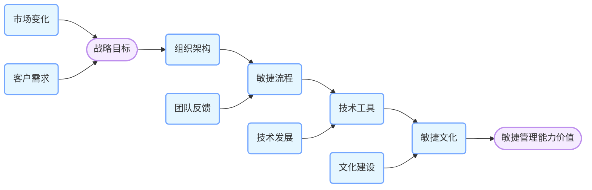

# 如何评估企业的敏捷管理能力价值

> 关键词：企业敏捷管理能力、价值评估、敏捷管理模型、评估指标体系、敏捷转型

> 摘要：本文聚焦于如何评估企业的敏捷管理能力价值。首先介绍了评估企业敏捷管理能力价值的背景信息，包括目的、预期读者、文档结构等。接着阐述了敏捷管理的核心概念与联系，分析了核心算法原理和具体操作步骤。通过数学模型和公式对评估进行了深入讲解，并给出举例说明。在项目实战部分，提供了开发环境搭建、源代码实现及代码解读。同时探讨了企业敏捷管理能力价值评估在实际中的应用场景，推荐了相关的学习资源、开发工具框架以及论文著作。最后总结了未来发展趋势与挑战，给出常见问题解答和扩展阅读参考资料，旨在为企业全面、科学地评估自身敏捷管理能力价值提供系统的指导和方法。

## 1. 背景介绍 
### 1.1 目的和范围
在当今快速变化的市场环境中，企业需要具备高度的灵活性和响应能力，敏捷管理应运而生。评估企业的敏捷管理能力价值具有多方面的重要目的。一方面，有助于企业清晰了解自身在敏捷管理方面的优势与不足，为企业制定针对性的改进策略提供依据，从而提升企业的竞争力和运营效率。另一方面，对于投资者、合作伙伴等外部利益相关者来说，能够准确评估企业的敏捷管理能力价值，可以更好地判断企业的发展潜力和投资价值。

本评估的范围涵盖了企业敏捷管理的各个方面，包括但不限于敏捷团队的组建与协作、敏捷流程的执行、敏捷文化的建设、技术创新能力以及对市场变化的响应速度等。通过对这些方面的综合评估，全面衡量企业的敏捷管理能力价值。

### 1.2 预期读者
本文的预期读者主要包括企业的高层管理人员、项目经理、敏捷教练以及对企业敏捷管理感兴趣的研究人员和学者。企业高层管理人员可以借助本文提供的评估方法，了解企业的整体敏捷管理状况，为企业的战略决策提供支持；项目经理可以从中学习如何在项目层面评估和提升敏捷管理能力；敏捷教练可以将其作为指导企业进行敏捷转型的参考工具；研究人员和学者则可以基于本文的内容开展更深入的研究。

### 1.3 文档结构概述
本文将按照以下结构展开：首先介绍核心概念与联系，明确敏捷管理的基本原理和架构；接着阐述核心算法原理和具体操作步骤，详细说明如何进行评估；然后通过数学模型和公式对评估过程进行量化分析，并举例说明；在项目实战部分，给出实际案例和代码实现，帮助读者更好地理解和应用评估方法；之后探讨实际应用场景，说明评估结果在企业决策中的具体应用；再推荐相关的工具和资源，为读者提供学习和实践的参考；最后总结未来发展趋势与挑战，解答常见问题，并提供扩展阅读和参考资料。

### 1.4 术语表
#### 1.4.1 核心术语定义
- **敏捷管理**：一种以快速响应变化为核心的管理方法，强调团队协作、迭代开发、客户反馈和持续改进，旨在通过灵活的流程和高效的沟通，快速交付有价值的产品或服务。
- **敏捷管理能力价值**：企业在实施敏捷管理过程中所具备的各种能力所带来的综合价值，包括提高产品质量、缩短交付周期、增强客户满意度、提升团队创新能力等方面。
- **评估指标体系**：用于衡量企业敏捷管理能力价值的一系列指标的集合，这些指标从不同维度反映企业的敏捷管理状况。

#### 1.4.2 相关概念解释
- **敏捷团队**：由具备不同技能的成员组成的跨职能团队，他们紧密协作，以快速、灵活的方式完成项目任务。
- **敏捷流程**：如Scrum、Kanban等，是敏捷管理中常用的项目管理流程，强调迭代、增量开发和持续反馈。
- **敏捷文化**：企业内部倡导的一种鼓励创新、勇于尝试、快速响应变化的文化氛围，是敏捷管理成功实施的重要保障。

#### 1.4.3 缩略词列表
- **Scrum**：一种敏捷项目管理框架，包含角色（如产品负责人、Scrum Master、开发团队）、事件（如冲刺计划会议、每日站会、冲刺评审会议、冲刺回顾会议）和工件（如产品待办事项列表、冲刺待办事项列表、增量）。
- **Kanban**：一种可视化的工作流管理方法，通过看板来展示工作流程和任务状态，实现对工作的有效管理和控制。

## 2. 核心概念与联系 
### 核心概念原理
敏捷管理的核心原理基于以下几个关键理念：
- **快速响应变化**：在当今不确定的市场环境中，企业需要能够迅速调整战略和产品方向，以适应市场的变化。敏捷管理通过迭代开发和持续反馈，使企业能够及时捕捉市场需求的变化，并快速做出响应。
- **团队协作**：敏捷团队强调跨职能协作，成员之间密切沟通、相互支持，共同完成项目目标。这种协作模式可以提高工作效率，减少沟通成本，同时激发团队成员的创新能力。
- **客户参与**：敏捷管理注重与客户的紧密合作，在项目的各个阶段都充分听取客户的意见和反馈，确保产品或服务能够满足客户的需求。
- **持续改进**：通过定期的回顾和反思，敏捷团队不断总结经验教训，优化工作流程和方法，以提高团队的绩效和产品的质量。

### 架构的文本示意图
企业敏捷管理能力价值评估架构可以分为以下几个层次：
- **战略层**：企业的战略目标和愿景决定了敏捷管理的方向和重点。敏捷管理应该与企业的战略相匹配，为实现企业的战略目标提供支持。
- **组织层**：包括企业的组织结构、团队组建和人员配置等方面。敏捷管理需要一个灵活、高效的组织架构，以支持团队的协作和创新。
- **流程层**：涵盖了各种敏捷流程和方法，如Scrum、Kanban等。这些流程规定了项目的执行步骤和规则，确保项目能够按照计划顺利进行。
- **技术层**：涉及到企业所采用的技术工具和平台，如项目管理软件、版本控制系统等。合适的技术工具可以提高团队的工作效率和协作效果。
- **文化层**：企业的文化氛围对敏捷管理的实施起着至关重要的作用。敏捷文化鼓励创新、勇于尝试、快速失败和持续学习，为敏捷管理的成功提供了良好的土壤。

### Mermaid 流程图


该流程图展示了企业敏捷管理能力价值的形成过程。战略目标受到市场变化和客户需求的影响，决定了组织架构、敏捷流程、技术工具和敏捷文化的建设方向。而团队反馈、技术发展和文化建设又不断影响着敏捷流程、技术工具和敏捷文化的优化，最终共同形成企业的敏捷管理能力价值。

## 3. 核心算法原理 & 具体操作步骤 
### 核心算法原理
我们可以采用层次分析法（AHP）结合模糊综合评价法来评估企业的敏捷管理能力价值。层次分析法用于确定各评估指标的权重，模糊综合评价法用于对企业在各指标上的表现进行评价。

#### 层次分析法（AHP）原理
层次分析法是一种将复杂问题分解为多个层次，通过两两比较确定各层次元素相对重要性的方法。其基本步骤如下：
1. **建立层次结构模型**：将评估问题分解为目标层、准则层和方案层。在企业敏捷管理能力价值评估中，目标层为评估企业的敏捷管理能力价值，准则层包括战略适应性、团队协作能力、流程执行效率、技术创新能力等方面，方案层为具体的评估指标。
2. **构造判断矩阵**：对同一层次的元素进行两两比较，确定它们之间的相对重要性，并用数值表示，形成判断矩阵。判断矩阵的元素 $a_{ij}$ 表示元素 $i$ 相对于元素 $j$ 的重要性，通常采用 1 - 9 标度法，其中 1 表示两个元素同等重要，9 表示元素 $i$ 比元素 $j$ 极端重要。
3. **计算权重向量**：通过求解判断矩阵的最大特征根及其对应的特征向量，得到各元素的权重向量。
4. **一致性检验**：为了确保判断矩阵的一致性，需要进行一致性检验。计算一致性指标 $CI$ 和随机一致性指标 $RI$，并计算一致性比率 $CR$，当 $CR < 0.1$ 时，认为判断矩阵具有满意的一致性。

#### 模糊综合评价法原理
模糊综合评价法是一种基于模糊数学的综合评价方法，它通过确定评价因素集、评语集，建立模糊关系矩阵，结合各因素的权重，对评价对象进行综合评价。其基本步骤如下：
1. **确定评价因素集**：评价因素集是影响评价对象的各种因素的集合，在企业敏捷管理能力价值评估中，评价因素集即为各评估指标。
2. **确定评语集**：评语集是对评价对象的评价等级的集合，如优秀、良好、中等、较差、差。
3. **建立模糊关系矩阵**：通过专家打分或问卷调查等方式，确定企业在各评估指标上的表现，形成模糊关系矩阵。模糊关系矩阵的元素 $r_{ij}$ 表示企业在第 $i$ 个评估指标上属于第 $j$ 个评语等级的隶属度。
4. **计算综合评价结果**：将各评估指标的权重向量与模糊关系矩阵相乘，得到综合评价向量，根据最大隶属度原则确定企业的敏捷管理能力价值等级。

### 具体操作步骤
#### 步骤 1：建立评估指标体系
根据企业敏捷管理的特点和需求，建立评估指标体系。以下是一个示例评估指标体系：
|准则层|指标层|
|---|---|
|战略适应性|战略与市场变化的匹配度、战略目标的明确性|
|团队协作能力|团队成员之间的沟通效率、团队成员的技能互补性|
|流程执行效率|敏捷流程的遵循程度、项目交付周期的缩短程度|
|技术创新能力|新技术的应用能力、产品的创新程度|
|客户满意度|客户反馈的及时性、客户对产品或服务的满意度|

#### 步骤 2：确定各指标的权重
使用层次分析法确定各指标的权重。以下是使用 Python 实现层次分析法计算权重的代码示例：
```python
import numpy as np

def ahp(matrix):
    """
    层次分析法计算权重
    :param matrix: 判断矩阵
    :return: 权重向量
    """
    n = matrix.shape[0]
    # 计算特征值和特征向量
    eigenvalues, eigenvectors = np.linalg.eig(matrix)
    # 获取最大特征值及其对应的特征向量
    max_eigenvalue = np.max(eigenvalues)
    max_index = np.argmax(eigenvalues)
    eigenvector = eigenvectors[:, max_index]
    # 归一化特征向量得到权重向量
    weight_vector = eigenvector / np.sum(eigenvector)
    # 一致性检验
    CI = (max_eigenvalue - n) / (n - 1)
    RI = [0, 0, 0.58, 0.90, 1.12, 1.24, 1.32, 1.41, 1.45]
    CR = CI / RI[n - 1]
    if CR < 0.1:
        print("判断矩阵具有满意的一致性")
    else:
        print("判断矩阵一致性不满足要求，请重新调整判断矩阵")
    return weight_vector.real

# 示例判断矩阵
matrix = np.array([[1, 3, 5],
                   [1/3, 1, 3],
                   [1/5, 1/3, 1]])

weights = ahp(matrix)
print("权重向量:", weights)
```

#### 步骤 3：进行模糊综合评价
通过专家打分或问卷调查等方式，确定企业在各评估指标上的表现，建立模糊关系矩阵。以下是使用 Python 实现模糊综合评价的代码示例：
```python
import numpy as np

def fuzzy_evaluation(weight_vector, relation_matrix):
    """
    模糊综合评价
    :param weight_vector: 权重向量
    :param relation_matrix: 模糊关系矩阵
    :return: 综合评价向量
    """
    # 计算综合评价向量
    evaluation_vector = np.dot(weight_vector, relation_matrix)
    return evaluation_vector

# 示例权重向量
weight_vector = np.array([0.6, 0.3, 0.1])
# 示例模糊关系矩阵
relation_matrix = np.array([[0.2, 0.3, 0.4, 0.1, 0],
                            [0.1, 0.2, 0.5, 0.2, 0],
                            [0, 0.1, 0.3, 0.4, 0.2]])

evaluation_vector = fuzzy_evaluation(weight_vector, relation_matrix)
print("综合评价向量:", evaluation_vector)
```

#### 步骤 4：确定企业的敏捷管理能力价值等级
根据最大隶属度原则，确定企业的敏捷管理能力价值等级。例如，评语集为 ['优秀', '良好', '中等', '较差', '差']，综合评价向量为 [0.1, 0.3, 0.4, 0.2, 0]，则企业的敏捷管理能力价值等级为中等。

## 4. 数学模型和公式 & 详细讲解 & 举例说明 
### 层次分析法数学模型和公式
#### 建立判断矩阵
判断矩阵 $A = (a_{ij})_{n\times n}$，其中 $a_{ij}$ 表示元素 $i$ 相对于元素 $j$ 的重要性，满足 $a_{ij} > 0$，$a_{ji} = \frac{1}{a_{ij}}$，$a_{ii} = 1$。

#### 计算最大特征根和特征向量
通过求解判断矩阵的特征方程 $|A - \lambda I| = 0$，得到最大特征根 $\lambda_{max}$ 及其对应的特征向量 $W$。

#### 一致性检验
一致性指标 $CI$ 的计算公式为：
$$CI = \frac{\lambda_{max} - n}{n - 1}$$
其中 $n$ 为判断矩阵的阶数。

随机一致性指标 $RI$ 是通过大量实验得到的经验值，不同阶数的 $RI$ 值如下表所示：
|阶数 $n$|1|2|3|4|5|6|7|8|9|
|---|---|---|---|---|---|---|---|---|---|
|$RI$|0|0|0.58|0.90|1.12|1.24|1.32|1.41|1.45|

一致性比率 $CR$ 的计算公式为：
$$CR = \frac{CI}{RI}$$
当 $CR < 0.1$ 时，认为判断矩阵具有满意的一致性。

#### 举例说明
假设有三个评估指标 $A$、$B$、$C$，构造的判断矩阵如下：
$$A = \begin{bmatrix}
1 & 3 & 5 \\
\frac{1}{3} & 1 & 3 \\
\frac{1}{5} & \frac{1}{3} & 1
\end{bmatrix}$$
首先计算最大特征根和特征向量：
```python
import numpy as np

matrix = np.array([[1, 3, 5],
                   [1/3, 1, 3],
                   [1/5, 1/3, 1]])

eigenvalues, eigenvectors = np.linalg.eig(matrix)
max_eigenvalue = np.max(eigenvalues)
max_index = np.argmax(eigenvalues)
eigenvector = eigenvectors[:, max_index]
weight_vector = eigenvector / np.sum(eigenvector)

print("最大特征根:", max_eigenvalue)
print("权重向量:", weight_vector.real)
```
然后进行一致性检验：
```python
n = matrix.shape[0]
CI = (max_eigenvalue - n) / (n - 1)
RI = [0, 0, 0.58, 0.90, 1.12, 1.24, 1.32, 1.41, 1.45]
CR = CI / RI[n - 1]

if CR < 0.1:
    print("判断矩阵具有满意的一致性")
else:
    print("判断矩阵一致性不满足要求，请重新调整判断矩阵")
```

### 模糊综合评价法数学模型和公式
#### 确定评价因素集和评语集
评价因素集 $U = \{u_1, u_2, \cdots, u_m\}$，评语集 $V = \{v_1, v_2, \cdots, v_n\}$。

#### 建立模糊关系矩阵
模糊关系矩阵 $R = (r_{ij})_{m\times n}$，其中 $r_{ij}$ 表示企业在第 $i$ 个评估指标上属于第 $j$ 个评语等级的隶属度。

#### 计算综合评价向量
综合评价向量 $B = (b_1, b_2, \cdots, b_n)$，计算公式为：
$$B = W \cdot R$$
其中 $W = (w_1, w_2, \cdots, w_m)$ 为各评估指标的权重向量。

#### 举例说明
假设有三个评估指标，评语集为 ['优秀', '良好', '中等', '较差', '差']，权重向量 $W = [0.6, 0.3, 0.1]$，模糊关系矩阵如下：
$$R = \begin{bmatrix}
0.2 & 0.3 & 0.4 & 0.1 & 0 \\
0.1 & 0.2 & 0.5 & 0.2 & 0 \\
0 & 0.1 & 0.3 & 0.4 & 0.2
\end{bmatrix}$$
计算综合评价向量：
```python
import numpy as np

weight_vector = np.array([0.6, 0.3, 0.1])
relation_matrix = np.array([[0.2, 0.3, 0.4, 0.1, 0],
                            [0.1, 0.2, 0.5, 0.2, 0],
                            [0, 0.1, 0.3, 0.4, 0.2]])

evaluation_vector = np.dot(weight_vector, relation_matrix)
print("综合评价向量:", evaluation_vector)
```
根据最大隶属度原则，确定企业的敏捷管理能力价值等级。

## 5. 项目实战：代码实际案例和详细解释说明 
### 5.1  开发环境搭建
为了实现企业敏捷管理能力价值评估的代码，我们需要搭建以下开发环境：
- **Python 环境**：建议使用 Python 3.7 及以上版本。可以从 Python 官方网站（https://www.python.org/downloads/）下载并安装。
- **开发工具**：可以使用 PyCharm、Jupyter Notebook 等开发工具。PyCharm 是一款功能强大的 Python 集成开发环境，Jupyter Notebook 则适合进行交互式编程和数据分析。
- **必要的库**：需要安装 `numpy` 库用于数值计算。可以使用以下命令进行安装：
```sh
pip install numpy
```

### 5.2  源代码详细实现和代码解读
以下是一个完整的企业敏捷管理能力价值评估的代码示例：
```python
import numpy as np

def ahp(matrix):
    """
    层次分析法计算权重
    :param matrix: 判断矩阵
    :return: 权重向量
    """
    n = matrix.shape[0]
    # 计算特征值和特征向量
    eigenvalues, eigenvectors = np.linalg.eig(matrix)
    # 获取最大特征值及其对应的特征向量
    max_eigenvalue = np.max(eigenvalues)
    max_index = np.argmax(eigenvalues)
    eigenvector = eigenvectors[:, max_index]
    # 归一化特征向量得到权重向量
    weight_vector = eigenvector / np.sum(eigenvector)
    # 一致性检验
    CI = (max_eigenvalue - n) / (n - 1)
    RI = [0, 0, 0.58, 0.90, 1.12, 1.24, 1.32, 1.41, 1.45]
    CR = CI / RI[n - 1]
    if CR < 0.1:
        print("判断矩阵具有满意的一致性")
    else:
        print("判断矩阵一致性不满足要求，请重新调整判断矩阵")
    return weight_vector.real

def fuzzy_evaluation(weight_vector, relation_matrix):
    """
    模糊综合评价
    :param weight_vector: 权重向量
    :param relation_matrix: 模糊关系矩阵
    :return: 综合评价向量
    """
    # 计算综合评价向量
    evaluation_vector = np.dot(weight_vector, relation_matrix)
    return evaluation_vector

# 示例判断矩阵
matrix = np.array([[1, 3, 5],
                   [1/3, 1, 3],
                   [1/5, 1/3, 1]])

# 计算权重向量
weights = ahp(matrix)
print("权重向量:", weights)

# 示例模糊关系矩阵
relation_matrix = np.array([[0.2, 0.3, 0.4, 0.1, 0],
                            [0.1, 0.2, 0.5, 0.2, 0],
                            [0, 0.1, 0.3, 0.4, 0.2]])

# 进行模糊综合评价
evaluation_vector = fuzzy_evaluation(weights, relation_matrix)
print("综合评价向量:", evaluation_vector)

# 确定企业的敏捷管理能力价值等级
labels = ['优秀', '良好', '中等', '较差', '差']
max_index = np.argmax(evaluation_vector)
grade = labels[max_index]
print("企业的敏捷管理能力价值等级:", grade)
```
### 代码解读与分析
- **`ahp` 函数**：该函数实现了层次分析法计算权重的功能。首先，通过 `np.linalg.eig` 函数计算判断矩阵的特征值和特征向量，然后获取最大特征值及其对应的特征向量，并进行归一化处理得到权重向量。最后，进行一致性检验，判断判断矩阵是否具有满意的一致性。
- **`fuzzy_evaluation` 函数**：该函数实现了模糊综合评价的功能。通过将权重向量与模糊关系矩阵相乘，得到综合评价向量。
- **主程序**：首先定义了示例判断矩阵和模糊关系矩阵，然后调用 `ahp` 函数计算权重向量，再调用 `fuzzy_evaluation` 函数进行模糊综合评价，最后根据最大隶属度原则确定企业的敏捷管理能力价值等级。

## 6. 实际应用场景 
企业敏捷管理能力价值评估在以下几个实际应用场景中具有重要意义：
### 企业战略决策
企业高层管理人员可以根据评估结果，了解企业在敏捷管理方面的优势和劣势，从而制定针对性的战略决策。如果评估结果显示企业在团队协作能力方面较弱，可以采取措施加强团队建设和培训；如果在技术创新能力方面表现突出，可以加大对技术研发的投入，进一步提升企业的竞争力。

### 项目管理
项目经理可以在项目启动前对项目团队的敏捷管理能力进行评估，根据评估结果合理分配资源、制定项目计划。在项目执行过程中，定期进行评估，及时发现问题并采取措施进行调整，确保项目能够按时、高质量地交付。

### 供应商选择
企业在选择供应商时，可以将供应商的敏捷管理能力价值作为重要的评估指标之一。选择具有较高敏捷管理能力的供应商，可以更好地应对市场变化，提高供应链的灵活性和响应速度。

### 投资决策
投资者可以通过评估企业的敏捷管理能力价值，判断企业的发展潜力和投资价值。具有较高敏捷管理能力的企业通常能够更快地适应市场变化，推出更具竞争力的产品或服务，从而为投资者带来更高的回报。

## 7. 工具和资源推荐
### 7.1 学习资源推荐
#### 7.1.1 书籍推荐
- 《敏捷革命：提升个人创造力与企业效率的全新协作模式》：本书介绍了敏捷管理的基本概念、方法和实践经验，通过大量的案例分析，帮助读者理解如何在企业中实施敏捷管理。
- 《Scrum 精髓：敏捷转型的实用指南》：详细介绍了 Scrum 框架的原理、流程和实践方法，是学习 Scrum 敏捷管理的经典著作。
- 《看板方法：科技企业渐进变革成功之道》：深入讲解了看板方法的核心思想和实践技巧，为企业提供了一种可视化、高效的工作流管理方法。

#### 7.1.2 在线课程
- Coursera 上的“敏捷项目管理”课程：由知名高校的教授授课，系统地介绍了敏捷项目管理的理论和实践，通过案例分析和作业练习，帮助学员掌握敏捷管理的方法和技能。
- edX 上的“Scrum 基础认证课程”：该课程提供了 Scrum 框架的基础知识和实践经验，通过在线视频、讨论和测试，帮助学员获得 Scrum 基础认证。

#### 7.1.3 技术博客和网站
- Agile Alliance（https://www.agilealliance.org/）：全球领先的敏捷社区，提供了丰富的敏捷管理资源，包括文章、博客、案例研究等。
- InfoQ（https://www.infoq.com/）：专注于软件开发和技术创新的媒体平台，经常发布关于敏捷管理的最新文章和趋势分析。

### 7.2 开发工具框架推荐
#### 7.2.1 IDE和编辑器
- PyCharm：功能强大的 Python 集成开发环境，提供了代码编辑、调试、版本控制等功能，适合开发企业敏捷管理能力价值评估的代码。
- Jupyter Notebook：交互式编程环境，支持 Python、R 等多种编程语言，适合进行数据分析和模型验证。

#### 7.2.2 调试和性能分析工具
- `pdb`：Python 内置的调试工具，可以帮助开发者在代码中设置断点、查看变量值等，方便调试代码。
- `cProfile`：Python 标准库中的性能分析工具，可以分析代码的执行时间和函数调用次数，帮助开发者优化代码性能。

#### 7.2.3 相关框架和库
- `numpy`：Python 中用于科学计算的基础库，提供了高效的数组操作和数学函数，在层次分析法和模糊综合评价中用于矩阵运算。
- `pandas`：用于数据处理和分析的 Python 库，可用于处理评估数据和生成报表。

### 7.3 相关论文著作推荐
#### 7.3.1 经典论文
- 《Agile Software Development: The State of the Art》：全面介绍了敏捷软件开发的发展历程、现状和未来趋势，是敏捷软件开发领域的经典论文。
- 《The New New Product Development Game》：提出了敏捷产品开发的概念和方法，对敏捷管理的发展产生了深远的影响。

#### 7.3.2 最新研究成果
- 关注 ACM SIGSOFT、IEEE Software 等学术会议和期刊，及时了解企业敏捷管理能力价值评估的最新研究成果和技术发展趋势。

#### 7.3.3 应用案例分析
- 《Agile in Practice: Case Studies and Lessons Learned》：收集了多个企业实施敏捷管理的案例，通过案例分析，总结了敏捷管理的成功经验和失败教训。

## 8. 总结：未来发展趋势与挑战
### 未来发展趋势
- **与数字化转型深度融合**：随着企业数字化转型的加速，敏捷管理将与数字化技术更加紧密地结合，如人工智能、大数据、云计算等。通过数字化工具和平台，实现敏捷管理的自动化和智能化，提高企业的敏捷性和竞争力。
- **跨组织敏捷协作**：未来企业将越来越多地与供应商、合作伙伴等外部组织进行敏捷协作，形成跨组织的敏捷生态系统。通过共享资源、信息和知识，实现快速响应市场变化，共同创造价值。
- **以人为本的敏捷管理**：更加注重员工的体验和发展，将员工的创造力和积极性作为企业敏捷管理的核心驱动力。通过建立良好的企业文化和激励机制，激发员工的创新精神和团队协作能力。

### 挑战
- **文化变革的难度**：敏捷管理需要企业建立一种鼓励创新、勇于尝试、快速响应变化的文化氛围，这对传统企业的文化观念和管理模式提出了挑战。文化变革需要长期的努力和投入，如何有效地推动文化变革是企业面临的一大难题。
- **技术能力的提升**：随着敏捷管理与数字化技术的深度融合，企业需要具备相应的技术能力，如数据分析、人工智能等。如何培养和吸引具备这些技术能力的人才，是企业需要解决的问题。
- **评估标准的统一**：目前，企业敏捷管理能力价值评估还缺乏统一的标准和方法，不同的评估机构和企业可能采用不同的指标体系和评估方法，导致评估结果缺乏可比性。如何建立统一的评估标准和方法，是未来需要研究的方向。

## 9. 附录：常见问题与解答
### 问题 1：如何确保判断矩阵的一致性？
答：在构造判断矩阵时，需要确保元素之间的相对重要性判断合理。可以通过邀请多位专家进行打分，然后取平均值的方式来减少主观因素的影响。同时，在计算权重向量后，进行一致性检验，当一致性比率 $CR < 0.1$ 时，认为判断矩阵具有满意的一致性。如果一致性不满足要求，需要重新调整判断矩阵。

### 问题 2：模糊关系矩阵的隶属度如何确定？
答：模糊关系矩阵的隶属度可以通过专家打分或问卷调查等方式确定。邀请相关领域的专家或企业员工对企业在各评估指标上的表现进行评价，根据评价结果确定隶属度。例如，对于某个评估指标，有 20% 的专家认为企业表现优秀，则该指标在“优秀”评语等级上的隶属度为 0.2。

### 问题 3：评估结果的准确性如何保证？
答：为了保证评估结果的准确性，需要从以下几个方面入手：一是建立科学合理的评估指标体系，确保指标能够全面、客观地反映企业的敏捷管理能力价值；二是采用合适的评估方法，如层次分析法和模糊综合评价法，保证评估过程的科学性和合理性；三是确保数据的真实性和可靠性，通过多种渠道收集数据，并进行验证和审核。

## 10. 扩展阅读 & 参考资料
### 扩展阅读
- 《精益创业：新创企业的成长思维》：介绍了精益创业的理念和方法，与敏捷管理有很多相似之处，可以帮助读者进一步理解如何快速响应市场变化，推出有价值的产品或服务。
- 《创新者的窘境》：探讨了企业在创新过程中面临的挑战和困境，以及如何通过创新实现持续发展，对企业的战略决策和敏捷管理具有重要的启示作用。

### 参考资料
- 《敏捷项目管理：原理与实践》
- 《软件工程：实践者的研究方法》
- 相关学术期刊和会议论文

作者：AI天才研究院/AI Genius Institute & 禅与计算机程序设计艺术 /Zen And The Art of Computer Programming