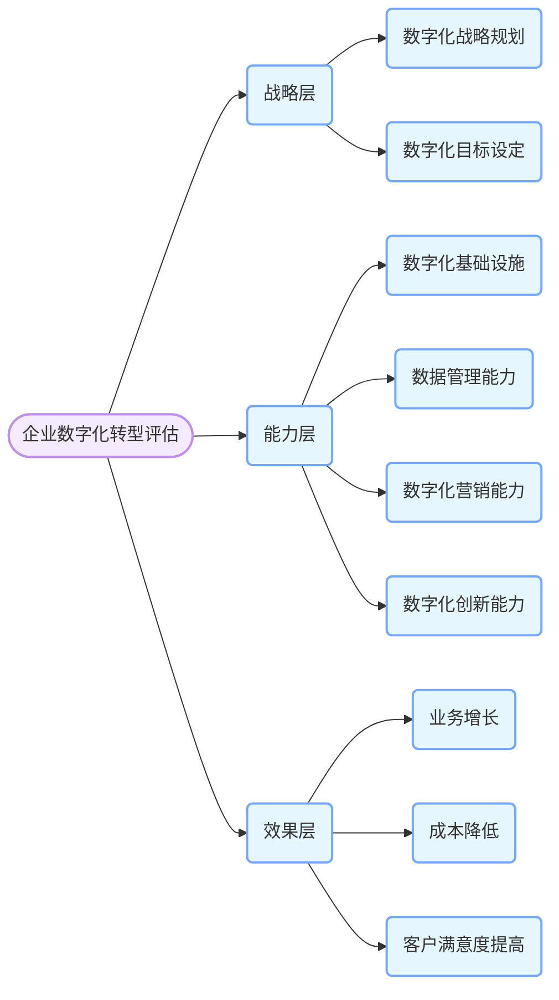

# 如何评估企业的数字化转型

> 关键词：企业数字化转型、评估指标、数字化能力、转型效果、评估方法

> 摘要：本文围绕如何评估企业的数字化转型展开深入探讨。详细介绍了企业数字化转型评估的背景知识，包括目的、预期读者、文档结构和相关术语。阐述了核心概念与联系，给出了清晰的文本示意图和 Mermaid 流程图。深入讲解了核心算法原理，并结合 Python 源代码进行说明。通过数学模型和公式进一步剖析评估要点，并举例说明。在项目实战部分，提供了开发环境搭建、源代码实现与解读。分析了实际应用场景，推荐了学习资源、开发工具框架和相关论文著作。最后总结了未来发展趋势与挑战，解答常见问题并提供扩展阅读和参考资料，旨在为企业准确评估数字化转型提供全面且专业的指导。

## 1. 背景介绍 
### 1.1 目的和范围
在当今数字化时代，企业数字化转型已成为提升竞争力、适应市场变化的关键举措。然而，如何准确评估企业数字化转型的成效，是众多企业面临的重要问题。本文的目的在于为企业提供一套全面、科学的数字化转型评估方法和框架，帮助企业了解自身在数字化转型过程中的优势与不足，为后续的转型策略调整提供依据。

本文的范围涵盖了企业数字化转型评估的各个方面，包括核心概念、评估算法、数学模型、实际案例以及相关的工具和资源等。

### 1.2 预期读者
本文的预期读者主要包括企业的高层管理人员、数字化转型项目负责人、信息技术部门员工以及对企业数字化转型评估感兴趣的研究人员和学者。对于企业高层管理人员，本文可以帮助他们从战略层面了解数字化转型评估的重要性和方法；对于数字化转型项目负责人，本文提供了具体的评估操作指南；对于信息技术部门员工，本文有助于他们理解数字化转型评估与技术实现之间的关系；对于研究人员和学者，本文可以作为相关研究的参考资料。

### 1.3 文档结构概述
本文共分为十个部分。第一部分为背景介绍，阐述了评估企业数字化转型的目的、预期读者、文档结构和相关术语。第二部分介绍核心概念与联系，包括数字化转型的核心概念、原理和架构，并通过文本示意图和 Mermaid 流程图进行直观展示。第三部分讲解核心算法原理和具体操作步骤，结合 Python 源代码详细说明。第四部分介绍数学模型和公式，并进行详细讲解和举例说明。第五部分是项目实战，包括开发环境搭建、源代码实现和代码解读。第六部分分析实际应用场景。第七部分推荐学习资源、开发工具框架和相关论文著作。第八部分总结未来发展趋势与挑战。第九部分为附录，解答常见问题。第十部分提供扩展阅读和参考资料。

### 1.4 术语表
#### 1.4.1 核心术语定义
- **企业数字化转型**：指企业利用数字技术，对业务流程、组织架构、商业模式等进行全面改造和升级，以提高企业的运营效率、创新能力和市场竞争力。
- **数字化能力**：企业在数字化领域所具备的技术、人才、管理等方面的综合能力，包括数字化基础设施建设、数据分析能力、数字化营销能力等。
- **转型效果**：企业在数字化转型过程中所取得的实际成果，如业务增长、成本降低、客户满意度提高等。
- **评估指标**：用于衡量企业数字化转型成效的具体指标，如数字化投入产出比、数字化业务占比等。

#### 1.4.2 相关概念解释
- **数字技术**：包括互联网、大数据、人工智能、云计算、物联网等新兴技术，这些技术是企业数字化转型的基础。
- **数字化战略**：企业为实现数字化转型而制定的长期发展规划和策略，包括数字化目标、转型路径、资源配置等。
- **数字化生态系统**：由企业、合作伙伴、客户等组成的一个相互关联、相互影响的数字化网络，企业可以通过构建数字化生态系统实现资源共享、协同创新。

#### 1.4.3 缩略词列表
- **AI**：Artificial Intelligence，人工智能
- **IoT**：Internet of Things，物联网
- **CRM**：Customer Relationship Management，客户关系管理
- **ERP**：Enterprise Resource Planning，企业资源计划

## 2. 核心概念与联系 

### 核心概念原理
企业数字化转型的核心在于利用数字技术对企业的各个方面进行重塑和优化。其原理基于数字技术的特点和优势，如高效的数据处理能力、强大的分析能力、便捷的沟通和协作能力等。通过数字化转型，企业可以实现业务流程的自动化、智能化，提高决策的科学性和准确性，增强客户体验和满意度。

### 架构的文本示意图
企业数字化转型评估架构可以分为三个层次：战略层、能力层和效果层。

- **战略层**：主要关注企业的数字化战略规划和目标设定，包括数字化愿景、使命、战略方向等。
- **能力层**：评估企业在数字化领域的各项能力，如数字化基础设施、数据管理能力、数字化营销能力、数字化创新能力等。
- **效果层**：衡量企业数字化转型所取得的实际效果，如业务增长、成本降低、客户满意度提高等。

以下是该架构的 Mermaid 流程图：


## 3. 核心算法原理 & 具体操作步骤 

### 核心算法原理
企业数字化转型评估可以采用综合评价法，即将多个评估指标进行量化，并通过一定的权重分配，计算出企业数字化转型的综合得分。常用的综合评价方法有层次分析法（AHP）、模糊综合评价法等。

以下以层次分析法为例，介绍其核心算法原理。层次分析法是一种将定性与定量分析相结合的多目标决策分析方法，其基本步骤如下：
1. **建立层次结构模型**：将评估问题分解为不同的层次，如目标层、准则层和方案层。在企业数字化转型评估中，目标层为企业数字化转型综合评估得分，准则层为战略层、能力层和效果层的各项评估指标，方案层为被评估的企业。
2. **构造判断矩阵**：通过专家打分的方式，比较同一层次中各因素之间的相对重要性，构造判断矩阵。判断矩阵的元素表示两个因素之间的相对重要性程度，通常采用 1 - 9 标度法。
3. **计算权重向量**：对判断矩阵进行一致性检验，若通过检验，则计算判断矩阵的最大特征值和对应的特征向量，将特征向量归一化后得到各因素的权重向量。
4. **计算综合得分**：根据各因素的权重向量和评估指标的得分，计算企业数字化转型的综合得分。

### 具体操作步骤
以下是使用 Python 实现层次分析法进行企业数字化转型评估的具体代码：
```python
import numpy as np

# 定义判断矩阵
A = np.array([[1, 3, 5],
              [1/3, 1, 3],
              [1/5, 1/3, 1]])

# 计算判断矩阵的特征值和特征向量
eigenvalues, eigenvectors = np.linalg.eig(A)

# 获取最大特征值及其对应的特征向量
max_eigenvalue = np.max(eigenvalues)
max_index = np.argmax(eigenvalues)
weight_vector = eigenvectors[:, max_index].real

# 归一化权重向量
weight_vector = weight_vector / np.sum(weight_vector)

# 定义各指标的得分
scores = np.array([80, 70, 90])

# 计算综合得分
composite_score = np.dot(weight_vector, scores)

print("权重向量:", weight_vector)
print("综合得分:", composite_score)
```
### 代码解释
1. **定义判断矩阵**：使用 `np.array` 函数定义判断矩阵 `A`，表示准则层各因素之间的相对重要性。
2. **计算特征值和特征向量**：使用 `np.linalg.eig` 函数计算判断矩阵的特征值和特征向量。
3. **获取最大特征值和对应的特征向量**：使用 `np.max` 函数获取最大特征值，使用 `np.argmax` 函数获取最大特征值的索引，从而得到对应的特征向量。
4. **归一化权重向量**：将特征向量除以其元素之和，得到归一化的权重向量。
5. **定义各指标的得分**：使用 `np.array` 函数定义各指标的得分。
6. **计算综合得分**：使用 `np.dot` 函数计算权重向量和各指标得分的点积，得到企业数字化转型的综合得分。

## 4. 数学模型和公式 & 详细讲解 & 举例说明 

### 数学模型和公式
在层次分析法中，判断矩阵的一致性检验是一个重要的环节。一致性检验的目的是判断判断矩阵是否具有满意的一致性，即判断矩阵的元素是否合理地反映了各因素之间的相对重要性。

一致性检验的步骤如下：
1. 计算一致性指标 $CI$：
   $$CI = \frac{\lambda_{max} - n}{n - 1}$$
   其中，$\lambda_{max}$ 是判断矩阵的最大特征值，$n$ 是判断矩阵的阶数。
2. 查找平均随机一致性指标 $RI$：$RI$ 的值与判断矩阵的阶数有关，可通过查阅相关资料得到。常见的 $RI$ 值如下表所示：

| 阶数 $n$ | 1 | 2 | 3 | 4 | 5 | 6 | 7 | 8 | 9 |
| ---- | ---- | ---- | ---- | ---- | ---- | ---- | ---- | ---- | ---- |
| $RI$ | 0 | 0 | 0.58 | 0.90 | 1.12 | 1.24 | 1.32 | 1.41 | 1.45 |

3. 计算一致性比率 $CR$：
   $$CR = \frac{CI}{RI}$$
   当 $CR < 0.1$ 时，认为判断矩阵具有满意的一致性；否则，需要重新调整判断矩阵的元素。

### 详细讲解
一致性指标 $CI$ 反映了判断矩阵的不一致程度，$CI$ 值越小，说明判断矩阵的一致性越好。平均随机一致性指标 $RI$ 是通过大量随机判断矩阵计算得到的平均值，用于衡量判断矩阵的一致性是否达到了随机情况下的可接受水平。一致性比率 $CR$ 是 $CI$ 与 $RI$ 的比值，用于判断判断矩阵是否具有满意的一致性。

### 举例说明
假设判断矩阵为：
$$A = \begin{bmatrix}
1 & 3 & 5 \\
1/3 & 1 & 3 \\
1/5 & 1/3 & 1
\end{bmatrix}$$
1. 计算最大特征值 $\lambda_{max}$：通过 Python 代码计算得到 $\lambda_{max} \approx 3.0385$。
2. 计算一致性指标 $CI$：
   已知 $n = 3$，则
   $$CI = \frac{\lambda_{max} - n}{n - 1} = \frac{3.0385 - 3}{3 - 1} = 0.01925$$
3. 查找平均随机一致性指标 $RI$：当 $n = 3$ 时，$RI = 0.58$。
4. 计算一致性比率 $CR$：
   $$CR = \frac{CI}{RI} = \frac{0.01925}{0.58} \approx 0.0332 < 0.1$$
   由于 $CR < 0.1$，所以判断矩阵具有满意的一致性。

## 5. 项目实战：代码实际案例和详细解释说明 

### 5.1  开发环境搭建
为了实现企业数字化转型评估的代码，我们需要搭建以下开发环境：
1. **Python 环境**：建议使用 Python 3.7 及以上版本。可以从 Python 官方网站（https://www.python.org/downloads/）下载并安装。
2. **NumPy 库**：NumPy 是 Python 中用于科学计算的基础库，提供了高效的数组操作和数学函数。可以使用以下命令安装 NumPy：
   ```sh
   pip install numpy
   ```

### 5.2  源代码详细实现和代码解读
以下是一个完整的 Python 代码示例，用于实现企业数字化转型评估的层次分析法，并进行一致性检验：
```python
import numpy as np

# 定义判断矩阵
A = np.array([[1, 3, 5],
              [1/3, 1, 3],
              [1/5, 1/3, 1]])

# 计算判断矩阵的特征值和特征向量
eigenvalues, eigenvectors = np.linalg.eig(A)

# 获取最大特征值及其对应的特征向量
max_eigenvalue = np.max(eigenvalues)
max_index = np.argmax(eigenvalues)
weight_vector = eigenvectors[:, max_index].real

# 归一化权重向量
weight_vector = weight_vector / np.sum(weight_vector)

# 一致性检验
n = A.shape[0]
CI = (max_eigenvalue - n) / (n - 1)
RI = {1: 0, 2: 0, 3: 0.58, 4: 0.90, 5: 1.12, 6: 1.24, 7: 1.32, 8: 1.41, 9: 1.45}[n]
CR = CI / RI

if CR < 0.1:
    print("判断矩阵具有满意的一致性。")
else:
    print("判断矩阵不具有满意的一致性，请重新调整。")

# 定义各指标的得分
scores = np.array([80, 70, 90])

# 计算综合得分
composite_score = np.dot(weight_vector, scores)

print("权重向量:", weight_vector)
print("综合得分:", composite_score)
```
### 代码解读
1. **导入 NumPy 库**：使用 `import numpy as np` 导入 NumPy 库，方便进行数组操作和数学计算。
2. **定义判断矩阵**：使用 `np.array` 函数定义判断矩阵 `A`，表示准则层各因素之间的相对重要性。
3. **计算特征值和特征向量**：使用 `np.linalg.eig` 函数计算判断矩阵的特征值和特征向量。
4. **获取最大特征值和对应的特征向量**：使用 `np.max` 函数获取最大特征值，使用 `np.argmax` 函数获取最大特征值的索引，从而得到对应的特征向量。
5. **归一化权重向量**：将特征向量除以其元素之和，得到归一化的权重向量。
6. **一致性检验**：根据判断矩阵的阶数 $n$ 计算一致性指标 $CI$ 和平均随机一致性指标 $RI$，进而计算一致性比率 $CR$。如果 $CR < 0.1$，则认为判断矩阵具有满意的一致性；否则，需要重新调整判断矩阵。
7. **定义各指标的得分**：使用 `np.array` 函数定义各指标的得分。
8. **计算综合得分**：使用 `np.dot` 函数计算权重向量和各指标得分的点积，得到企业数字化转型的综合得分。

## 6. 实际应用场景 
企业数字化转型评估在以下实际应用场景中具有重要意义：
1. **战略决策**：企业高层管理人员可以通过数字化转型评估，了解企业在数字化领域的优势和不足，从而制定更加科学合理的数字化战略。例如，如果评估结果显示企业在数字化营销能力方面较弱，企业可以加大在数字化营销方面的投入，提升市场竞争力。
2. **项目评估**：在数字化转型项目实施过程中，通过定期进行评估，可以及时发现项目存在的问题和风险，调整项目计划和资源配置，确保项目顺利进行。例如，如果评估发现某个数字化项目的投入产出比不理想，企业可以考虑优化项目方案或暂停项目。
3. **绩效评估**：将数字化转型评估结果纳入企业员工的绩效评估体系，可以激励员工积极参与数字化转型工作，提高员工的数字化技能和创新能力。例如，对于在数字化转型工作中表现突出的员工，可以给予相应的奖励和晋升机会。
4. **合作伙伴选择**：企业在选择合作伙伴时，可以通过评估合作伙伴的数字化转型水平，选择与自身数字化战略相匹配的合作伙伴，实现资源共享、协同发展。例如，企业在选择供应商时，可以优先选择数字化程度较高的供应商，提高供应链的效率和灵活性。

## 7. 工具和资源推荐
### 7.1 学习资源推荐
#### 7.1.1 书籍推荐
- 《数字化转型：企业破局增长的关键》：本书深入探讨了企业数字化转型的理论和实践，提供了丰富的案例和实用的方法。
- 《工业 4.0：即将来袭的第四次工业革命》：介绍了工业 4.0 的概念、技术和应用，对企业数字化转型具有重要的指导意义。
- 《大数据时代：生活、工作与思维的大变革》：阐述了大数据的基本概念、技术和应用，帮助读者了解大数据在企业数字化转型中的作用。

#### 7.1.2 在线课程
- Coursera 上的“Digital Transformation Strategy”课程：由知名教授授课，系统介绍了企业数字化转型的战略规划和实施方法。
- edX 上的“Artificial Intelligence for Business”课程：讲解了人工智能在企业中的应用，为企业数字化转型提供了技术支持。
- 中国大学 MOOC 上的“企业数字化转型与创新管理”课程：结合国内企业的实际案例，深入分析了企业数字化转型的难点和解决方案。

#### 7.1.3 技术博客和网站
- 麻省理工斯隆管理评论（https://sloanreview.mit.edu/）：提供了大量关于企业数字化转型的研究报告和案例分析。
- 麦肯锡全球研究院（https://www.mckinsey.com/global-themes/digital-disruption）：发布了许多关于数字化转型的前沿研究成果和行业洞察。
- 阿里云开发者社区（https://developer.aliyun.com/）：提供了丰富的数字化技术资料和实践经验分享。

### 7.2 开发工具框架推荐
#### 7.2.1 IDE和编辑器
- PyCharm：一款专业的 Python 集成开发环境，提供了丰富的代码编辑、调试和分析功能。
- Visual Studio Code：一款轻量级的代码编辑器，支持多种编程语言，具有强大的插件扩展功能。

#### 7.2.2 调试和性能分析工具
- Py-Spy：一款用于 Python 代码性能分析的工具，可以帮助开发者找出代码中的性能瓶颈。
- PDB：Python 自带的调试工具，方便开发者进行代码调试和问题排查。

#### 7.2.3 相关框架和库
- NumPy：用于科学计算的基础库，提供了高效的数组操作和数学函数。
- Pandas：用于数据处理和分析的库，提供了丰富的数据结构和数据操作方法。
- Scikit-learn：用于机器学习的库，提供了多种机器学习算法和工具。

### 7.3 相关论文著作推荐
#### 7.3.1 经典论文
- “The Digital Transformation of Industries”：探讨了数字化转型对各个行业的影响和挑战。
- “Digital Strategy: Toward a Next Generation of Insights”：提出了数字化战略的理论框架和研究方向。
- “Big Data in Organizations: A Review of the Literature and a Research Agenda”：对大数据在企业中的应用进行了系统的综述和研究。

#### 7.3.2 最新研究成果
- 《中国企业数字化转型研究报告》：分析了中国企业数字化转型的现状、问题和趋势。
- 《全球数字化转型指数报告》：评估了全球企业数字化转型的水平和进展。

#### 7.3.3 应用案例分析
- 《华为数字化转型实践》：介绍了华为在数字化转型过程中的成功经验和实践案例。
- 《阿里巴巴数字化商业操作系统》：阐述了阿里巴巴通过数字化技术构建商业操作系统的实践和应用。

## 8. 总结：未来发展趋势与挑战
### 未来发展趋势
1. **智能化转型加速**：随着人工智能、机器学习等技术的不断发展，企业将更加注重智能化转型，实现业务流程的自动化和智能化，提高决策的科学性和准确性。
2. **数字化生态系统构建**：企业将不再孤立地进行数字化转型，而是通过构建数字化生态系统，与合作伙伴、客户等实现资源共享、协同创新，共同推动行业的发展。
3. **数据驱动决策**：数据将成为企业最重要的资产之一，企业将更加注重数据的收集、分析和应用，通过数据驱动决策，提高企业的运营效率和市场竞争力。
4. **跨界融合发展**：数字化转型将打破行业界限，促进不同行业之间的跨界融合发展，创造出更多的新业态、新模式。

### 挑战
1. **技术更新换代快**：数字技术发展迅速，企业需要不断学习和掌握新的技术，才能跟上时代的步伐。然而，技术更新换代快也给企业带来了技术选型和技术应用的挑战。
2. **数据安全和隐私保护**：随着企业数字化程度的提高，数据的安全性和隐私保护问题日益突出。企业需要加强数据安全管理，采取有效的技术和管理措施，保护企业和客户的数据安全和隐私。
3. **组织文化变革**：数字化转型不仅是技术的变革，更是组织文化的变革。企业需要打破传统的组织架构和管理模式，建立适应数字化转型的组织文化，激发员工的创新活力和积极性。
4. **人才短缺**：数字化转型需要大量的数字化人才，包括技术人才、数据分析人才、数字化营销人才等。然而，目前市场上数字化人才短缺，企业面临着人才招聘和培养的挑战。

## 9. 附录：常见问题与解答
### 问题 1：如何确定判断矩阵的元素？
答：判断矩阵的元素表示两个因素之间的相对重要性程度，通常采用 1 - 9 标度法。可以通过专家打分的方式，邀请企业内部的管理人员、技术专家等对各因素之间的相对重要性进行评价，从而确定判断矩阵的元素。

### 问题 2：如果判断矩阵不具有满意的一致性，应该怎么办？
答：如果判断矩阵不具有满意的一致性，需要重新调整判断矩阵的元素。可以再次邀请专家对各因素之间的相对重要性进行评价，或者对原有的判断矩阵进行适当的调整，直到判断矩阵具有满意的一致性为止。

### 问题 3：评估指标的权重可以随意调整吗？
答：评估指标的权重不能随意调整，需要根据企业的实际情况和数字化转型的战略目标进行合理确定。在确定权重时，可以采用层次分析法等科学的方法，确保权重的合理性和客观性。

### 问题 4：企业数字化转型评估的周期应该如何确定？
答：企业数字化转型评估的周期可以根据企业的实际情况和数字化转型的阶段来确定。一般来说，在数字化转型的初期，可以适当缩短评估周期，及时发现问题和调整策略；在数字化转型的中后期，可以适当延长评估周期，关注转型的长期效果。

## 10. 扩展阅读 & 参考资料
### 扩展阅读
- 《数字化生存》：介绍了数字化时代的生活方式和社会变革，对企业数字化转型具有一定的启示作用。
- 《区块链：技术驱动金融》：探讨了区块链技术在金融领域的应用，为企业数字化转型提供了新的思路和方向。

### 参考资料
- 相关行业报告和研究机构的研究成果。
- 企业数字化转型的相关标准和规范。
- 国内外企业数字化转型的成功案例和实践经验。

作者：AI天才研究院/AI Genius Institute & 禅与计算机程序设计艺术 /Zen And The Art of Computer Programming