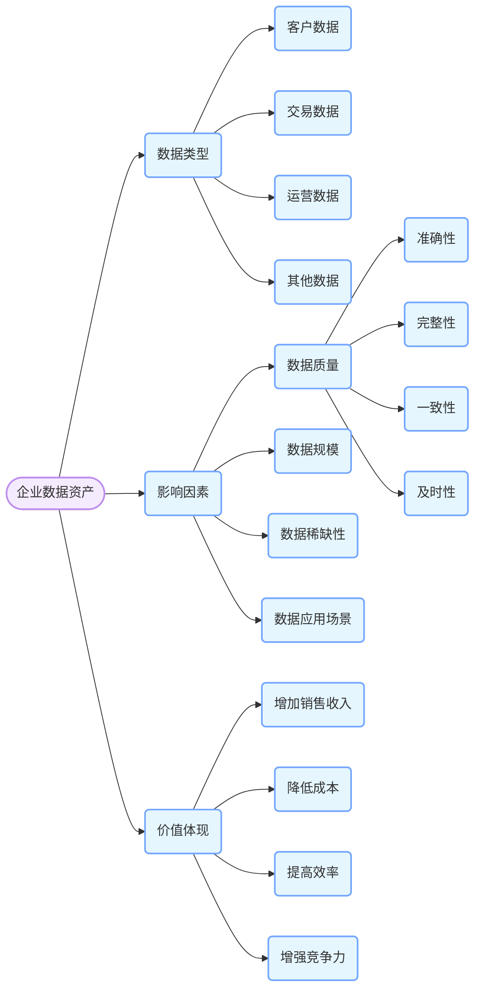

# 如何评估企业的数据资产价值

> 关键词：企业数据资产、数据资产价值评估、评估方法、数据质量、应用场景

> 摘要：本文聚焦于企业数据资产价值评估这一重要议题。随着数字化时代的发展，数据资产已成为企业的核心竞争力之一，但如何准确评估其价值仍是一个具有挑战性的问题。文章首先介绍了评估的背景信息，包括目的、范围、预期读者等；接着阐述了数据资产的核心概念及联系，分析了核心算法原理与具体操作步骤；通过数学模型和公式进一步深入探讨评估方法，并结合实际案例进行详细说明；介绍了实际应用场景以及相关的工具和资源；最后总结了未来发展趋势与挑战，还提供了常见问题解答和扩展阅读资料，旨在为企业提供全面、深入的关于数据资产价值评估的指导。

## 1. 背景介绍 
### 1.1 目的和范围
在当今数字化的商业环境中，数据已经成为企业最有价值的资产之一。准确评估企业的数据资产价值具有多方面的重要意义。从战略决策角度来看，有助于企业明确自身的数据优势和劣势，合理规划数据资源的投入和使用，从而在市场竞争中占据有利地位。从财务角度出发，数据资产价值的评估可以为企业的财务报表提供更准确的信息，支持企业的融资、并购等活动。

本文章的范围涵盖了各种类型企业的数据资产价值评估，包括传统行业企业和新兴的互联网企业等。涉及的数据资产类型包括客户数据、交易数据、运营数据等。同时，将探讨不同评估方法的适用场景和优缺点，以帮助企业选择最适合自身情况的评估方式。

### 1.2 预期读者
本文的预期读者主要包括企业的高层管理人员，如CEO、CTO等，他们需要从战略层面了解数据资产的价值，以便做出合理的决策。财务人员也可以从本文中获取关于数据资产价值评估的方法和流程，从而准确地在财务报表中反映数据资产的价值。此外，数据分析师、数据科学家等专业技术人员可以了解如何从技术角度评估数据资产的质量和潜在价值。对于对数据资产领域感兴趣的研究人员和学者，本文也可以提供有价值的参考。

### 1.3 文档结构概述
本文将按照以下结构进行组织。首先介绍数据资产价值评估的背景信息，包括目的、范围、预期读者等。接着阐述数据资产的核心概念以及它们之间的联系，通过文本示意图和Mermaid流程图进行直观展示。然后详细分析核心算法原理和具体操作步骤，结合Python源代码进行说明。之后通过数学模型和公式进一步深入探讨评估方法，并举例说明。再通过项目实战，给出代码实际案例并进行详细解释。介绍数据资产价值评估的实际应用场景。推荐相关的工具和资源，包括学习资源、开发工具框架和相关论文著作。最后总结未来发展趋势与挑战，提供常见问题解答和扩展阅读资料。

### 1.4 术语表
#### 1.4.1 核心术语定义
- **数据资产**：指企业拥有或控制的，能够为企业带来经济利益的数据资源。这些数据可以是结构化的，如数据库中的数据，也可以是非结构化的，如文本、图像、视频等。
- **数据资产价值评估**：是指通过一定的方法和技术，对企业的数据资产在特定时间和条件下的价值进行量化的过程。
- **数据质量**：指数据的准确性、完整性、一致性、及时性等方面的特征，数据质量直接影响数据资产的价值。
- **数据应用场景**：指数据在企业业务中的具体使用方式和场景，不同的应用场景会导致数据资产的价值不同。

#### 1.4.2 相关概念解释
- **数据所有权**：企业对数据资产拥有合法的控制权和处置权，这是数据资产价值评估的前提。
- **数据流通性**：指数据在不同主体之间的可交换性和可转移性，数据流通性越高，其潜在价值可能越大。
- **数据安全性**：保障数据不被非法获取、篡改和泄露，数据安全性是数据资产价值的重要保障。

#### 1.4.3 缩略词列表
- **ETL**：Extract, Transform, Load，即数据抽取、转换和加载，是数据处理的常见步骤。
- **KPI**：Key Performance Indicator，关键绩效指标，用于衡量数据资产的价值和效果。

## 2. 核心概念与联系 

### 核心概念原理
数据资产价值评估的核心原理是基于数据资产能够为企业带来经济利益的特性。数据资产的价值主要来源于其对企业业务的支持和推动作用。例如，客户数据可以帮助企业进行精准营销，提高客户满意度和忠诚度，从而增加销售收入；运营数据可以帮助企业优化生产流程，降低成本，提高效率。

数据资产的价值受到多个因素的影响，包括数据质量、数据规模、数据的稀缺性、数据的应用场景等。数据质量越高，数据的可用性和可靠性就越强，其价值也就越高。数据规模越大，可能蕴含的信息就越丰富，价值也可能越大。数据的稀缺性意味着数据在市场上的独特性，稀缺的数据往往具有更高的价值。不同的数据应用场景会导致数据资产的价值不同，例如，同样的客户数据在精准营销和客户服务中的价值可能不同。

### 架构的文本示意图
```plaintext
企业数据资产
|--数据类型
|   |--客户数据
|   |--交易数据
|   |--运营数据
|   |--其他数据
|--影响因素
|   |--数据质量
|   |   |--准确性
|   |   |--完整性
|   |   |--一致性
|   |   |--及时性
|   |--数据规模
|   |--数据稀缺性
|   |--数据应用场景
|--价值体现
|   |--增加销售收入
|   |--降低成本
|   |--提高效率
|   |--增强竞争力
```

### Mermaid流程图


## 3. 核心算法原理 & 具体操作步骤 

### 核心算法原理
常见的数据资产价值评估算法有成本法、市场法和收益法。

#### 成本法
成本法是基于企业为获取和维护数据资产所花费的成本来评估其价值。其核心思想是，数据资产的价值等于其历史成本加上一定的增值部分。历史成本包括数据的采集成本、存储成本、处理成本等。增值部分可以考虑数据的质量提升、数据的应用开发等带来的价值增加。

#### 市场法
市场法是通过比较类似数据资产在市场上的交易价格来评估目标数据资产的价值。其原理是，如果市场上存在与目标数据资产类似的交易案例，那么可以根据这些案例的交易价格来推断目标数据资产的价值。在使用市场法时，需要找到合适的可比数据资产，并对其交易价格进行调整，以考虑目标数据资产与可比数据资产之间的差异。

#### 收益法
收益法是基于数据资产未来能够为企业带来的收益来评估其价值。其核心思想是，将数据资产未来的预期收益折现到当前时刻，得到数据资产的现值。预期收益可以通过分析数据资产在不同应用场景下的经济效益来确定，折现率则需要考虑市场利率、风险等因素。

### 具体操作步骤
#### 成本法操作步骤
1. **确定数据资产的历史成本**：
    - 采集成本：记录数据采集过程中所花费的人力、物力和财力，如购买数据采集设备、支付数据采集人员的工资等。
    - 存储成本：计算数据存储所需的硬件设备成本、软件许可费用、存储服务费用等。
    - 处理成本：统计数据处理过程中使用的计算资源成本、算法开发成本等。
2. **评估增值部分**：
    - 数据质量提升：分析数据质量提升所带来的价值增加，如通过数据清洗、数据挖掘等提高了数据的准确性和可用性。
    - 数据应用开发：评估数据应用开发所带来的价值，如开发了新的数据分析模型、数据可视化工具等。
3. **计算数据资产价值**：
    数据资产价值 = 历史成本 + 增值部分

#### 市场法操作步骤
1. **寻找可比数据资产**：
    - 确定可比数据资产的特征，如数据类型、数据规模、数据质量、应用场景等。
    - 在市场上寻找与目标数据资产特征相似的交易案例。
2. **调整可比数据资产的交易价格**：
    - 分析目标数据资产与可比数据资产之间的差异，如数据质量差异、应用场景差异等。
    - 根据差异对可比数据资产的交易价格进行调整，得到目标数据资产的参考价值。

#### 收益法操作步骤
1. **预测数据资产未来的预期收益**：
    - 分析数据资产在不同应用场景下的经济效益，如增加销售收入、降低成本等。
    - 根据历史数据和市场趋势，预测数据资产未来各期的预期收益。
2. **确定折现率**：
    - 考虑市场利率、行业风险、企业风险等因素，确定合适的折现率。
3. **计算数据资产的现值**：
    使用折现公式将未来各期的预期收益折现到当前时刻，得到数据资产的现值。

### Python源代码实现
```python
import numpy as np

# 成本法实现
def cost_method(acquisition_cost, storage_cost, processing_cost, value_addition):
    """
    成本法计算数据资产价值
    :param acquisition_cost: 采集成本
    :param storage_cost: 存储成本
    :param processing_cost: 处理成本
    :param value_addition: 增值部分
    :return: 数据资产价值
    """
    historical_cost = acquisition_cost + storage_cost + processing_cost
    return historical_cost + value_addition

# 收益法实现
def income_method(expected_income, discount_rate, years):
    """
    收益法计算数据资产价值
    :param expected_income: 每年预期收益列表
    :param discount_rate: 折现率
    :param years: 预测年限
    :return: 数据资产价值
    """
    present_values = []
    for i in range(years):
        present_value = expected_income[i] / ((1 + discount_rate) ** (i + 1))
        present_values.append(present_value)
    return np.sum(present_values)

# 示例数据
acquisition_cost = 10000
storage_cost = 5000
processing_cost = 3000
value_addition = 2000
expected_income = [5000, 6000, 7000]
discount_rate = 0.1
years = 3

# 成本法计算
cost_value = cost_method(acquisition_cost, storage_cost, processing_cost, value_addition)
print(f"成本法评估数据资产价值: {cost_value}")

# 收益法计算
income_value = income_method(expected_income, discount_rate, years)
print(f"收益法评估数据资产价值: {income_value}")
```

## 4. 数学模型和公式 & 详细讲解 & 举例说明 

### 成本法数学模型和公式
成本法的数学模型可以表示为：
$$V_{cost} = C_{acq} + C_{sto} + C_{pro} + V_{add}$$
其中，$V_{cost}$ 表示数据资产的价值，$C_{acq}$ 表示数据的采集成本，$C_{sto}$ 表示数据的存储成本，$C_{pro}$ 表示数据的处理成本，$V_{add}$ 表示数据资产的增值部分。

**详细讲解**：采集成本是指企业为获取数据所花费的成本，包括购买数据、收集数据等过程中的费用。存储成本是指数据存储所需的硬件、软件和服务费用。处理成本是指对数据进行清洗、转换、分析等操作所花费的成本。增值部分是指由于数据质量提升、数据应用开发等带来的价值增加。

**举例说明**：假设一家企业为了获取客户数据，花费了 10 万元用于购买数据采集设备和支付数据采集人员的工资（采集成本），每年花费 5 万元用于数据存储（存储成本），每年花费 3 万元用于数据处理（处理成本）。经过一段时间的运营，通过数据清洗和挖掘，提高了数据的质量，预计带来 2 万元的增值。则该企业客户数据资产的价值为：
$$V_{cost} = 10 + 5 + 3 + 2 = 20 \text{（万元）}$$

### 市场法数学模型和公式
市场法的数学模型可以表示为：
$$V_{market} = V_{comparable} \times \frac{Q_{target}}{Q_{comparable}} \times \frac{S_{target}}{S_{comparable}} \times \frac{A_{target}}{A_{comparable}}$$
其中，$V_{market}$ 表示目标数据资产的价值，$V_{comparable}$ 表示可比数据资产的交易价格，$Q_{target}$ 和 $Q_{comparable}$ 分别表示目标数据资产和可比数据资产的质量得分，$S_{target}$ 和 $S_{comparable}$ 分别表示目标数据资产和可比数据资产的规模，$A_{target}$ 和 $A_{comparable}$ 分别表示目标数据资产和可比数据资产的应用场景得分。

**详细讲解**：该公式通过对可比数据资产的交易价格进行调整，来得到目标数据资产的价值。质量得分、规模和应用场景得分是用于衡量目标数据资产与可比数据资产之间差异的指标。如果目标数据资产的质量、规模或应用场景优于可比数据资产，则相应的比例因子大于 1，反之则小于 1。

**举例说明**：假设市场上有一个可比数据资产，其交易价格为 50 万元。目标数据资产的质量得分是可比数据资产的 1.2 倍，规模是可比数据资产的 1.5 倍，应用场景得分是可比数据资产的 0.8 倍。则目标数据资产的价值为：
$$V_{market} = 50 \times 1.2 \times 1.5 \times 0.8 = 72 \text{（万元）}$$

### 收益法数学模型和公式
收益法的数学模型基于现值的概念，其公式为：
$$V_{income} = \sum_{t=1}^{n} \frac{R_t}{(1 + r)^t}$$
其中，$V_{income}$ 表示数据资产的价值，$R_t$ 表示第 $t$ 期的数据资产预期收益，$r$ 表示折现率，$n$ 表示预测年限。

**详细讲解**：该公式将数据资产未来各期的预期收益折现到当前时刻，得到数据资产的现值。折现率反映了资金的时间价值和风险因素，预期收益是根据数据资产在不同应用场景下的经济效益预测得到的。

**举例说明**：假设某企业的数据资产预计未来 3 年的预期收益分别为 10 万元、12 万元和 15 万元，折现率为 10%。则该数据资产的价值为：
$$V_{income} = \frac{10}{(1 + 0.1)^1} + \frac{12}{(1 + 0.1)^2} + \frac{15}{(1 + 0.1)^3}$$
$$V_{income} \approx 9.09 + 9.92 + 11.27 = 30.28 \text{（万元）}$$

## 5. 项目实战：代码实际案例和详细解释说明 

### 5.1  开发环境搭建
为了实现数据资产价值评估的代码，我们需要搭建以下开发环境：

#### Python环境
首先，确保你已经安装了 Python 环境，建议使用 Python 3.7 及以上版本。可以从 Python 官方网站（https://www.python.org/downloads/）下载并安装适合你操作系统的 Python 版本。

#### 依赖库安装
我们需要安装 `numpy` 库来进行数值计算。可以使用以下命令进行安装：
```sh
pip install numpy
```

### 5.2  源代码详细实现和代码解读
以下是一个完整的 Python 代码示例，用于实现成本法和收益法的数据资产价值评估：
```python
import numpy as np

# 成本法实现
def cost_method(acquisition_cost, storage_cost, processing_cost, value_addition):
    """
    成本法计算数据资产价值
    :param acquisition_cost: 采集成本
    :param storage_cost: 存储成本
    :param processing_cost: 处理成本
    :param value_addition: 增值部分
    :return: 数据资产价值
    """
    historical_cost = acquisition_cost + storage_cost + processing_cost
    return historical_cost + value_addition

# 收益法实现
def income_method(expected_income, discount_rate, years):
    """
    收益法计算数据资产价值
    :param expected_income: 每年预期收益列表
    :param discount_rate: 折现率
    :param years: 预测年限
    :return: 数据资产价值
    """
    present_values = []
    for i in range(years):
        present_value = expected_income[i] / ((1 + discount_rate) ** (i + 1))
        present_values.append(present_value)
    return np.sum(present_values)

# 示例数据
acquisition_cost = 10000
storage_cost = 5000
processing_cost = 3000
value_addition = 2000
expected_income = [5000, 6000, 7000]
discount_rate = 0.1
years = 3

# 成本法计算
cost_value = cost_method(acquisition_cost, storage_cost, processing_cost, value_addition)
print(f"成本法评估数据资产价值: {cost_value}")

# 收益法计算
income_value = income_method(expected_income, discount_rate, years)
print(f"收益法评估数据资产价值: {income_value}")
```

#### 代码解读
1. **成本法函数 `cost_method`**：
    - 该函数接受四个参数：采集成本 `acquisition_cost`、存储成本 `storage_cost`、处理成本 `processing_cost` 和增值部分 `value_addition`。
    - 首先计算历史成本，即采集成本、存储成本和处理成本之和。
    - 然后将历史成本和增值部分相加，得到数据资产的价值。

2. **收益法函数 `income_method`**：
    - 该函数接受三个参数：每年预期收益列表 `expected_income`、折现率 `discount_rate` 和预测年限 `years`。
    - 使用一个循环遍历每年的预期收益，将其折现到当前时刻，并将折现后的现值存储在 `present_values` 列表中。
    - 最后使用 `np.sum` 函数计算所有现值的总和，得到数据资产的价值。

3. **示例数据和计算**：
    - 定义了示例数据，包括采集成本、存储成本、处理成本、增值部分、每年预期收益、折现率和预测年限。
    - 分别调用 `cost_method` 和 `income_method` 函数进行成本法和收益法的计算，并打印出评估结果。

### 5.3  代码解读与分析
#### 代码优点
- **简单易懂**：代码结构清晰，函数定义明确，每个函数的功能和参数都有详细的注释，易于理解和维护。
- **可扩展性**：可以很容易地扩展代码，例如添加市场法的实现，或者修改成本法和收益法的计算逻辑。

#### 代码局限性
- **数据输入依赖**：代码的计算结果依赖于输入的参数，如采集成本、预期收益等，这些参数的准确性会影响评估结果的可靠性。
- **未考虑复杂因素**：代码没有考虑一些复杂的因素，如数据的时效性、市场波动等，在实际应用中可能需要进行更复杂的计算。

## 6. 实际应用场景 
### 企业战略决策
企业在进行战略决策时，需要了解自身的数据资产价值。例如，在决定是否进入一个新的市场时，企业可以评估自身的客户数据、市场数据等资产的价值，判断是否有足够的资源和能力在新市场中取得竞争优势。如果数据资产价值较高，企业可以利用这些数据进行精准营销、产品创新等，提高进入新市场的成功率。

### 财务报表编制
准确评估数据资产价值有助于企业在财务报表中更准确地反映资产状况。数据资产可以作为企业的无形资产进行核算，提高企业的资产规模和净资产。这对于企业的融资、并购等活动具有重要意义。例如，在企业进行融资时，银行或投资者会更关注企业的数据资产价值，以评估企业的发展潜力和偿债能力。

### 数据交易
随着数据市场的发展，数据交易越来越频繁。在数据交易过程中，需要对数据资产进行准确的价值评估，以确定合理的交易价格。卖方可以根据数据资产的价值制定合理的售价，买方可以根据评估结果判断是否值得购买。例如，一家电商企业拥有大量的客户购买行为数据，另一家企业想要购买这些数据用于市场分析，双方可以通过数据资产价值评估来确定交易价格。

### 数据合作
企业之间的数据合作也需要评估数据资产价值。在合作过程中，双方可以根据各自的数据资产价值来确定合作的方式和权益分配。例如，两家企业进行数据共享合作，它们可以根据各自提供的数据资产价值来确定合作收益的分配比例。

## 7. 工具和资源推荐
### 7.1 学习资源推荐
#### 7.1.1 书籍推荐
- 《数据资产：数字化转型的核心驱动力》：本书深入探讨了数据资产的概念、价值评估方法和管理策略，为企业的数据资产化提供了全面的指导。
- 《大数据时代：生活、工作与思维的大变革》：介绍了大数据的发展趋势和应用场景，帮助读者了解数据资产在当今社会的重要性。
- 《数据科学实战》：涵盖了数据科学的各个方面，包括数据采集、处理、分析和可视化等，对于学习数据资产价值评估的技术方法有很大帮助。

#### 7.1.2 在线课程
- Coursera 上的 “Data Science Specialization”：该课程由多所知名大学的教授授课，提供了系统的数据科学知识和技能培训，包括数据资产价值评估的相关内容。
- edX 上的 “Big Data Analytics”：课程介绍了大数据分析的方法和工具，对于理解数据资产的分析和应用有很大帮助。
- 网易云课堂上的 “数据资产价值评估实战”：专门针对数据资产价值评估进行讲解，通过实际案例分析帮助学员掌握评估方法和技巧。

#### 7.1.3 技术博客和网站
- KDnuggets：是一个专注于数据科学和机器学习的技术博客，提供了大量的数据资产价值评估的案例和技术文章。
- Towards Data Science：汇聚了众多数据科学家和分析师的文章，分享了最新的数据资产评估方法和研究成果。
- 中国信息通信研究院官网：发布了很多关于数据资产的研究报告和政策解读，对于了解行业动态和政策导向有很大帮助。

### 7.2 开发工具框架推荐
#### 7.2.1 IDE和编辑器
- PyCharm：是一款专业的 Python 集成开发环境，提供了丰富的代码编辑、调试和分析功能，适合进行数据资产价值评估的代码开发。
- Jupyter Notebook：是一个交互式的开发环境，支持 Python、R 等多种编程语言，方便进行数据探索和模型验证。
- Visual Studio Code：是一款轻量级的代码编辑器，支持多种编程语言和插件扩展，具有良好的代码编辑和调试体验。

#### 7.2.2 调试和性能分析工具
- pdb：是 Python 自带的调试工具，可以帮助开发者在代码中设置断点、查看变量值等，方便调试代码。
- cProfile：是 Python 的性能分析工具，可以分析代码的运行时间和函数调用情况，帮助开发者优化代码性能。
- TensorBoard：是 TensorFlow 提供的可视化工具，可以用于可视化模型训练过程和评估结果，对于优化数据资产价值评估模型有很大帮助。

#### 7.2.3 相关框架和库
- NumPy：是 Python 的一个基础数值计算库，提供了高效的数组操作和数学函数，在数据资产价值评估的数值计算中经常使用。
- Pandas：是一个用于数据处理和分析的库，提供了数据结构和数据操作方法，方便进行数据清洗、转换和分析。
- Scikit-learn：是一个机器学习库，提供了多种机器学习算法和工具，可用于构建数据资产价值评估模型。

### 7.3 相关论文著作推荐
#### 7.3.1 经典论文
- “The Value of Information in the Digital Economy”：该论文探讨了数字经济中信息的价值评估方法，为数据资产价值评估提供了理论基础。
- “Data Asset Valuation: A Review of Methods and Approaches”：对数据资产价值评估的方法和途径进行了全面的综述，分析了各种方法的优缺点和适用场景。
- “Measuring the Value of Big Data”：研究了大数据的价值度量方法，提出了一些新的评估指标和模型。

#### 7.3.2 最新研究成果
- 近年来，关于数据资产价值评估的研究不断涌现，一些研究机构和学者提出了基于区块链、人工智能等技术的新型评估方法。可以通过学术数据库，如 IEEE Xplore、ACM Digital Library 等，查找最新的研究论文。

#### 7.3.3 应用案例分析
- 一些知名企业的数据资产价值评估案例可以为我们提供实践参考。例如，谷歌、亚马逊等公司在数据资产的管理和评估方面有很多成功的经验，可以通过查阅相关的商业报道和研究报告来了解这些案例。

## 8. 总结：未来发展趋势与挑战
### 未来发展趋势
#### 多元化评估方法的融合
未来，数据资产价值评估将不再局限于单一的评估方法，而是会融合成本法、市场法、收益法等多种方法，结合人工智能、区块链等新技术，开发出更加准确、全面的评估模型。例如，利用人工智能算法对大量的市场交易数据进行分析，为市场法提供更准确的可比案例；利用区块链技术保证数据的真实性和不可篡改，提高评估结果的可靠性。

#### 数据资产价值评估的标准化
随着数据资产市场的不断发展，数据资产价值评估的标准化将成为必然趋势。相关的行业组织和政府部门将制定统一的评估标准和规范，明确评估方法、评估流程和评估报告的格式等，提高评估结果的可比性和可信度。

#### 数据资产价值评估与企业战略的深度融合
数据资产价值评估将不再仅仅是一项财务活动，而是会与企业的战略决策紧密结合。企业将根据数据资产的价值评估结果，制定更加合理的数据战略，优化数据资源的配置，提高企业的核心竞争力。

### 挑战
#### 数据质量问题
数据质量是影响数据资产价值评估的关键因素之一。目前，企业的数据质量普遍存在问题，如数据不准确、不完整、不一致等。这些问题会导致评估结果的偏差，影响企业的决策。因此，如何提高数据质量，是数据资产价值评估面临的一大挑战。

#### 数据安全和隐私问题
在数据资产价值评估过程中，需要对大量的数据进行收集、存储和分析，这涉及到数据的安全和隐私问题。如果数据泄露或被滥用，不仅会给企业带来损失，还会损害用户的利益。因此，如何保障数据的安全和隐私，是数据资产价值评估需要解决的重要问题。

#### 市场交易不活跃
目前，数据资产市场的交易还不够活跃，缺乏足够的可比交易案例。这使得市场法在数据资产价值评估中的应用受到限制。如何促进数据资产市场的发展，提高市场交易的活跃度，是数据资产价值评估面临的又一挑战。

## 9. 附录：常见问题与解答
### 问题 1：数据资产价值评估的结果准确吗？
数据资产价值评估的结果受到多种因素的影响，如数据质量、评估方法的选择、参数的确定等。因此，评估结果不可能做到绝对准确，但可以通过合理选择评估方法、提高数据质量、准确确定参数等方式，提高评估结果的可靠性和可信度。

### 问题 2：不同的评估方法有什么优缺点？
- **成本法**：优点是计算简单，易于理解，适用于数据资产的历史成本清晰、增值部分易于确定的情况。缺点是没有考虑数据资产的未来收益和市场价值，可能会低估数据资产的价值。
- **市场法**：优点是能够反映市场的实际情况，评估结果具有一定的可比性。缺点是需要找到合适的可比交易案例，且市场交易不活跃时应用受到限制。
- **收益法**：优点是考虑了数据资产的未来收益，能够反映数据资产的潜在价值。缺点是预测未来收益具有一定的不确定性，折现率的确定也比较困难。

### 问题 3：数据资产价值评估需要哪些专业知识？
数据资产价值评估需要综合运用财务、统计、计算机科学等多方面的专业知识。评估人员需要了解财务报表分析、资产评估方法、数据挖掘技术、机器学习算法等知识，同时还需要具备一定的行业经验和商业洞察力。

### 问题 4：数据资产价值评估的周期是多久？
数据资产价值评估的周期取决于评估的目的、方法和数据的复杂程度等因素。一般来说，简单的数据资产价值评估可能需要几天到几周的时间，而复杂的数据资产价值评估可能需要几个月甚至更长的时间。

## 10. 扩展阅读 & 参考资料
### 扩展阅读
- 《数据治理：企业数字化转型的核心基石》：进一步深入探讨了数据治理的相关内容，对于理解数据资产的管理和价值提升有很大帮助。
- 《人工智能时代的企业战略》：介绍了人工智能在企业战略中的应用，以及如何利用数据资产实现企业的战略转型。

### 参考资料
- 《资产评估准则——无形资产》：为数据资产价值评估提供了一定的准则和规范。
- 相关行业研究报告：如艾瑞咨询、Gartner 等发布的关于数据资产市场的研究报告，提供了行业的最新动态和发展趋势。

作者：AI天才研究院/AI Genius Institute & 禅与计算机程序设计艺术 /Zen And The Art of Computer Programming