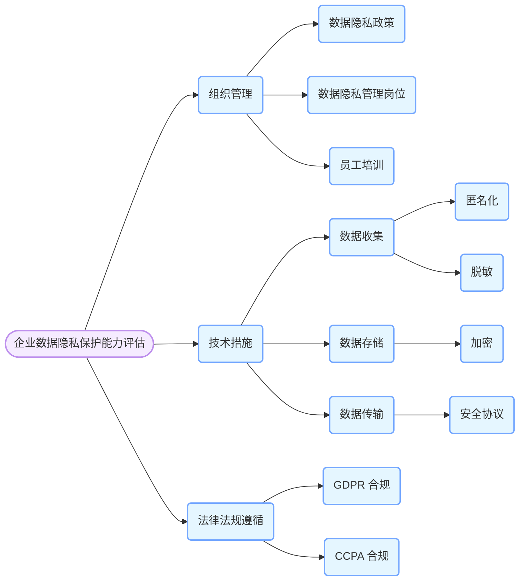

# 如何评估企业的数据隐私保护能力

> 关键词：企业数据隐私保护、评估体系、数据安全、隐私法规、技术措施

> 摘要：本文聚焦于企业数据隐私保护能力的评估，旨在为企业和相关从业者提供全面、系统的评估方法和思路。首先介绍了评估的背景，包括目的、预期读者、文档结构和相关术语。接着阐述了核心概念与联系，通过示意图和流程图展示数据隐私保护的架构。详细讲解了核心算法原理和具体操作步骤，并运用 Python 代码进行说明。给出了相关的数学模型和公式，并举例说明。通过项目实战，包括开发环境搭建、源代码实现和解读，让读者更深入理解评估过程。探讨了实际应用场景，推荐了学习、开发工具和相关论文著作。最后总结了未来发展趋势与挑战，提供常见问题解答和扩展阅读参考资料，帮助企业更好地评估和提升自身的数据隐私保护能力。

## 1. 背景介绍 
### 1.1 目的和范围
在当今数字化时代，数据已成为企业的核心资产之一。然而，数据隐私泄露事件频发，给企业带来了巨大的损失，包括经济损失、声誉损害等。评估企业的数据隐私保护能力，目的在于帮助企业识别自身在数据隐私保护方面的优势与不足，为企业制定合理的数据隐私保护策略提供依据，确保企业的数据处理活动符合相关法律法规要求，保护用户的隐私权益。

本评估的范围涵盖企业的数据收集、存储、处理、传输和共享等全生命周期过程，涉及企业的组织架构、管理制度、技术措施等多个方面。

### 1.2 预期读者
本文的预期读者包括企业的管理层、数据安全和隐私管理人员、信息技术人员以及对数据隐私保护感兴趣的研究人员。企业管理层可以通过本文了解如何评估企业的数据隐私保护能力，以便做出合理的决策；数据安全和隐私管理人员可以从中获取具体的评估方法和技术，提升企业的数据隐私保护水平；信息技术人员可以学习到相关的技术实现细节；研究人员可以将本文作为研究数据隐私保护评估的参考资料。

### 1.3 文档结构概述
本文将按照以下结构进行阐述：首先介绍核心概念与联系，明确数据隐私保护的基本原理和架构；接着讲解核心算法原理和具体操作步骤，通过 Python 代码详细说明；然后给出相关的数学模型和公式，并举例说明；进行项目实战，包括开发环境搭建、源代码实现和解读；探讨实际应用场景；推荐学习、开发工具和相关论文著作；最后总结未来发展趋势与挑战，提供常见问题解答和扩展阅读参考资料。

### 1.4 术语表
#### 1.4.1 核心术语定义
- **数据隐私**：指个人或组织对其数据的控制和保密权利，包括数据的收集、使用、存储和披露等方面的隐私。
- **数据隐私保护能力**：企业在数据处理过程中，采取技术和管理措施，保护数据隐私不被泄露、滥用的能力。
- **数据主体**：指数据所涉及的个人，即数据的所有者。
- **数据控制者**：决定数据处理目的和方式的个人、组织或公共机构。
- **数据处理者**：代表数据控制者处理数据的个人、组织或公共机构。

#### 1.4.2 相关概念解释
- **匿名化**：对数据进行处理，使得数据主体无法被识别的过程。
- **脱敏处理**：对敏感数据进行变形或替换，以保护数据主体隐私的技术。
- **隐私影响评估（PIA）**：对数据处理活动可能对数据主体隐私造成的影响进行评估的过程。

#### 1.4.3 缩略词列表
- **GDPR**：General Data Protection Regulation，通用数据保护条例。
- **CCPA**：California Consumer Privacy Act，加利福尼亚州消费者隐私法案。
- **API**：Application Programming Interface，应用程序编程接口。

## 2. 核心概念与联系 
### 核心概念原理
企业的数据隐私保护能力涉及多个方面，主要包括组织管理、技术措施和法律法规遵循三个核心要素。

组织管理方面，企业需要建立完善的数据隐私管理体系，明确数据隐私保护的责任和流程。这包括制定数据隐私政策、设立数据隐私管理岗位、进行员工培训等。通过有效的组织管理，可以确保企业内部对数据隐私保护的重视和有效执行。

技术措施方面，企业需要采用多种技术手段来保护数据隐私。例如，在数据收集阶段，采用匿名化和脱敏技术，减少数据主体的可识别性；在数据存储阶段，采用加密技术，确保数据在存储过程中的安全性；在数据传输阶段，采用安全的传输协议，防止数据在传输过程中被窃取。

法律法规遵循方面，企业需要遵守国内外相关的数据隐私法律法规，如欧盟的 GDPR、美国的 CCPA 等。这些法律法规对企业的数据处理活动提出了严格的要求，企业需要确保自身的数据处理行为符合法律法规的规定。

### 架构的文本示意图
```plaintext
企业数据隐私保护能力
|-- 组织管理
|   |-- 数据隐私政策
|   |-- 数据隐私管理岗位
|   |-- 员工培训
|-- 技术措施
|   |-- 数据收集（匿名化、脱敏）
|   |-- 数据存储（加密）
|   |-- 数据传输（安全协议）
|-- 法律法规遵循
|   |-- GDPR 合规
|   |-- CCPA 合规
```

### Mermaid 流程图


## 3. 核心算法原理 & 具体操作步骤 
### 核心算法原理
我们可以采用层次分析法（AHP）来评估企业的数据隐私保护能力。层次分析法是一种将定性和定量分析相结合的决策方法，通过将复杂问题分解为多个层次，构建判断矩阵，计算各因素的权重，从而得出综合评估结果。

具体步骤如下：
1. **建立层次结构模型**：将企业的数据隐私保护能力评估问题分解为目标层、准则层和指标层。目标层为企业的数据隐私保护能力评估；准则层包括组织管理、技术措施和法律法规遵循；指标层为每个准则层下的具体指标，如数据隐私政策、匿名化技术等。
2. **构造判断矩阵**：对同一层次的各因素进行两两比较，确定它们相对于上一层次某因素的重要性，构造判断矩阵。判断矩阵的元素采用 1 - 9 标度法进行赋值，其中 1 表示两个因素同等重要，3 表示一个因素比另一个因素稍微重要，5 表示一个因素比另一个因素明显重要，7 表示一个因素比另一个因素强烈重要，9 表示一个因素比另一个因素极端重要，2、4、6、8 为上述相邻判断的中间值。
3. **计算权重向量**：通过求解判断矩阵的特征值和特征向量，得到各因素的权重向量。
4. **一致性检验**：对判断矩阵进行一致性检验，确保判断矩阵的一致性在可接受范围内。
5. **综合评估**：根据各指标的得分和权重，计算企业的数据隐私保护能力综合得分。

### 具体操作步骤及 Python 代码实现
```python
import numpy as np

# 定义判断矩阵
A = np.array([[1, 3, 5],
              [1/3, 1, 3],
              [1/5, 1/3, 1]])

# 计算特征值和特征向量
eigenvalues, eigenvectors = np.linalg.eig(A)

# 找到最大特征值及其对应的特征向量
max_eigenvalue = np.max(eigenvalues)
max_index = np.argmax(eigenvalues)
weight_vector = eigenvectors[:, max_index]

# 归一化权重向量
weight_vector = weight_vector / np.sum(weight_vector)

# 一致性检验
n = A.shape[0]
RI = [0, 0, 0.58, 0.90, 1.12, 1.24, 1.32, 1.41, 1.45]
CI = (max_eigenvalue - n) / (n - 1)
CR = CI / RI[n - 1]

if CR < 0.1:
    print("判断矩阵具有满意的一致性。")
else:
    print("判断矩阵一致性不满足要求，请重新调整判断矩阵。")

print("各因素的权重向量为：", weight_vector)
```
### 代码解释
1. **定义判断矩阵**：使用 `numpy` 数组定义判断矩阵 `A`，表示准则层各因素之间的相对重要性。
2. **计算特征值和特征向量**：使用 `np.linalg.eig` 函数计算判断矩阵的特征值和特征向量。
3. **找到最大特征值及其对应的特征向量**：使用 `np.max` 和 `np.argmax` 函数找到最大特征值及其对应的索引，然后提取对应的特征向量。
4. **归一化权重向量**：将特征向量归一化，使其元素之和为 1。
5. **一致性检验**：计算一致性指标 `CI` 和随机一致性比率 `CR`，并根据 `CR` 的值判断判断矩阵的一致性是否满足要求。
6. **输出结果**：如果判断矩阵具有满意的一致性，输出各因素的权重向量。

## 4. 数学模型和公式 & 详细讲解 & 举例说明 
### 数学模型和公式
#### 层次分析法相关公式
1. **判断矩阵**：设判断矩阵为 $A=(a_{ij})_{n\times n}$，其中 $a_{ij}$ 表示因素 $i$ 相对于因素 $j$ 的重要性程度，且满足 $a_{ij}=\frac{1}{a_{ji}}$，$a_{ii}=1$。
2. **最大特征值**：判断矩阵 $A$ 的最大特征值 $\lambda_{max}$ 满足 $A\omega=\lambda_{max}\omega$，其中 $\omega$ 为对应的特征向量。
3. **一致性指标**：$CI=\frac{\lambda_{max}-n}{n - 1}$，其中 $n$ 为判断矩阵的阶数。
4. **随机一致性比率**：$CR=\frac{CI}{RI}$，其中 $RI$ 为平均随机一致性指标，其值与判断矩阵的阶数有关，常见的 $RI$ 值如下：
| 阶数 $n$ | 1 | 2 | 3 | 4 | 5 | 6 | 7 | 8 | 9 |
| ---- | ---- | ---- | ---- | ---- | ---- | ---- | ---- | ---- | ---- |
| $RI$ | 0 | 0 | 0.58 | 0.90 | 1.12 | 1.24 | 1.32 | 1.41 | 1.45 |

当 $CR < 0.1$ 时，认为判断矩阵具有满意的一致性。

#### 综合评估得分公式
设准则层各因素的权重向量为 $W=(w_1, w_2, \cdots, w_m)$，指标层各指标相对于准则层某因素的权重向量为 $W_{i}=(w_{i1}, w_{i2}, \cdots, w_{in_i})$，指标层各指标的得分向量为 $S=(s_1, s_2, \cdots, s_n)$，则企业的数据隐私保护能力综合得分 $Score$ 为：
$$Score=\sum_{i = 1}^{m}w_i\sum_{j = 1}^{n_i}w_{ij}s_{ij}$$

### 详细讲解
层次分析法的核心思想是将复杂问题分解为多个层次，通过两两比较确定各因素的相对重要性，从而得到各因素的权重。一致性检验是为了确保判断矩阵的合理性，如果判断矩阵的一致性不满足要求，需要重新调整判断矩阵。

综合评估得分公式将准则层和指标层的权重与指标得分相结合，得到企业的数据隐私保护能力综合得分，从而可以对企业的数据隐私保护能力进行量化评估。

### 举例说明
假设我们已经得到准则层（组织管理、技术措施、法律法规遵循）的权重向量 $W=(0.6, 0.3, 0.1)$，组织管理下的指标（数据隐私政策、数据隐私管理岗位、员工培训）的权重向量 $W_1=(0.4, 0.3, 0.3)$，技术措施下的指标（匿名化、脱敏、加密、安全协议）的权重向量 $W_2=(0.2, 0.2, 0.3, 0.3)$，法律法规遵循下的指标（GDPR 合规、CCPA 合规）的权重向量 $W_3=(0.5, 0.5)$。各指标的得分分别为：数据隐私政策 80 分，数据隐私管理岗位 70 分，员工培训 75 分，匿名化 85 分，脱敏 80 分，加密 90 分，安全协议 85 分，GDPR 合规 80 分，CCPA 合规 75 分。

则组织管理方面的得分 $Score_1$ 为：
$$Score_1 = 0.4\times80 + 0.3\times70 + 0.3\times75 = 76.5$$

技术措施方面的得分 $Score_2$ 为：
$$Score_2 = 0.2\times85 + 0.2\times80 + 0.3\times90 + 0.3\times85 = 84.5$$

法律法规遵循方面的得分 $Score_3$ 为：
$$Score_3 = 0.5\times80 + 0.5\times75 = 77.5$$

企业的数据隐私保护能力综合得分 $Score$ 为：
$$Score = 0.6\times76.5 + 0.3\times84.5 + 0.1\times77.5 = 78.7$$

## 5. 项目实战：代码实际案例和详细解释说明 
### 5.1  开发环境搭建
为了实现企业数据隐私保护能力评估的项目，我们需要搭建以下开发环境：
1. **Python 环境**：建议使用 Python 3.7 及以上版本。可以从 Python 官方网站（https://www.python.org/downloads/）下载并安装。
2. **依赖库**：需要安装 `numpy` 库，用于矩阵运算。可以使用以下命令进行安装：
```sh
pip install numpy
```

### 5.2  源代码详细实现和代码解读
```python
import numpy as np

# 定义准则层判断矩阵
criterion_matrix = np.array([[1, 3, 5],
                             [1/3, 1, 3],
                             [1/5, 1/3, 1]])

# 定义指标层判断矩阵
index_matrices = [
    np.array([[1, 2, 3],
              [1/2, 1, 2],
              [1/3, 1/2, 1]]),  # 组织管理指标判断矩阵
    np.array([[1, 1, 2, 2],
              [1, 1, 2, 2],
              [1/2, 1/2, 1, 1],
              [1/2, 1/2, 1, 1]]),  # 技术措施指标判断矩阵
    np.array([[1, 2],
              [1/2, 1]])  # 法律法规遵循指标判断矩阵
]

# 定义指标得分
index_scores = [
    [80, 70, 75],  # 组织管理指标得分
    [85, 80, 90, 85],  # 技术措施指标得分
    [80, 75]  # 法律法规遵循指标得分
]

def calculate_weights(matrix):
    """
    计算判断矩阵的权重向量
    :param matrix: 判断矩阵
    :return: 权重向量
    """
    eigenvalues, eigenvectors = np.linalg.eig(matrix)
    max_eigenvalue = np.max(eigenvalues)
    max_index = np.argmax(eigenvalues)
    weight_vector = eigenvectors[:, max_index]
    weight_vector = weight_vector / np.sum(weight_vector)
    return weight_vector

def consistency_check(matrix):
    """
    进行一致性检验
    :param matrix: 判断矩阵
    :return: 是否通过一致性检验
    """
    n = matrix.shape[0]
    RI = [0, 0, 0.58, 0.90, 1.12, 1.24, 1.32, 1.41, 1.45]
    eigenvalues, _ = np.linalg.eig(matrix)
    max_eigenvalue = np.max(eigenvalues)
    CI = (max_eigenvalue - n) / (n - 1)
    CR = CI / RI[n - 1]
    return CR < 0.1

# 计算准则层权重
criterion_weights = calculate_weights(criterion_matrix)
if not consistency_check(criterion_matrix):
    print("准则层判断矩阵一致性不满足要求，请重新调整。")
else:
    print("准则层权重向量：", criterion_weights)

# 计算指标层权重
index_weights = []
for matrix in index_matrices:
    weights = calculate_weights(matrix)
    if not consistency_check(matrix):
        print("指标层判断矩阵一致性不满足要求，请重新调整。")
    else:
        index_weights.append(weights)

# 计算各准则层得分
criterion_scores = []
for i in range(len(index_weights)):
    scores = np.dot(index_weights[i], index_scores[i])
    criterion_scores.append(scores)

# 计算综合得分
overall_score = np.dot(criterion_weights, criterion_scores)
print("企业数据隐私保护能力综合得分：", overall_score)
```

### 5.3  代码解读与分析
1. **数据定义**：定义了准则层判断矩阵 `criterion_matrix`、指标层判断矩阵列表 `index_matrices` 和指标得分列表 `index_scores`。
2. **权重计算函数**：`calculate_weights` 函数用于计算判断矩阵的权重向量，通过求解特征值和特征向量，并进行归一化处理得到权重向量。
3. **一致性检验函数**：`consistency_check` 函数用于进行一致性检验，计算一致性指标 `CI` 和随机一致性比率 `CR`，并判断是否通过一致性检验。
4. **准则层权重计算**：调用 `calculate_weights` 函数计算准则层权重，并进行一致性检验。
5. **指标层权重计算**：遍历指标层判断矩阵列表，调用 `calculate_weights` 函数计算各指标层权重，并进行一致性检验。
6. **各准则层得分计算**：使用 `np.dot` 函数计算各准则层的得分。
7. **综合得分计算**：使用 `np.dot` 函数计算企业的数据隐私保护能力综合得分。

通过以上代码，我们可以实现企业数据隐私保护能力的量化评估。

## 6. 实际应用场景 
### 企业内部评估
企业可以定期对自身的数据隐私保护能力进行评估，识别潜在的风险和不足。例如，通过评估发现数据存储环节的加密措施不够完善，企业可以及时采取措施加强加密技术的应用，提高数据的安全性。同时，评估结果也可以为企业的数据隐私保护策略制定提供依据，合理分配资源，提升整体的数据隐私保护水平。

### 合规性审查
在面对法律法规要求或行业监管时，企业需要证明自身的数据隐私保护能力符合相关标准。通过进行数据隐私保护能力评估，企业可以提供详细的评估报告，证明其在数据处理活动中采取了必要的措施，保护了数据主体的隐私权益，从而避免因违规而面临的处罚。

### 合作伙伴选择
在与其他企业进行合作时，企业通常需要考虑合作伙伴的数据隐私保护能力。通过对合作伙伴的数据隐私保护能力进行评估，企业可以选择数据隐私保护措施完善的合作伙伴，降低合作过程中的数据泄露风险。例如，一家金融企业在选择技术服务提供商时，会对其数据隐私保护能力进行评估，确保合作伙伴能够妥善处理和保护客户的敏感数据。

### 市场竞争优势
在市场竞争中，良好的数据隐私保护能力可以成为企业的竞争优势。消费者越来越关注个人数据的隐私安全，更愿意选择那些能够保障其数据隐私的企业。通过展示自身的数据隐私保护能力评估结果，企业可以增强消费者的信任，吸引更多的客户，从而在市场竞争中脱颖而出。

## 7. 工具和资源推荐
### 7.1 学习资源推荐
#### 7.1.1 书籍推荐
- 《数据安全与隐私保护》：本书系统地介绍了数据安全和隐私保护的基本概念、技术和方法，包括数据加密、访问控制、匿名化等内容，适合初学者和有一定基础的读者阅读。
- 《通用数据保护条例（GDPR）实用指南》：详细解读了欧盟的 GDPR 法规，包括法规的背景、主要内容、合规要求等，并提供了实际案例和操作指南，帮助企业理解和遵守 GDPR 法规。
- 《信息安全技术 个人信息安全规范》：该书籍围绕我国的个人信息安全规范进行讲解，对个人信息的收集、存储、使用、共享等环节提出了详细的要求和指导，是企业进行数据隐私保护的重要参考。

#### 7.1.2 在线课程
- Coursera 上的“Data Privacy and Security”课程：由知名高校的教授授课，涵盖了数据隐私和安全的多个方面，包括法律法规、技术措施、风险管理等内容，通过视频讲解、案例分析和作业练习等方式，帮助学习者深入理解数据隐私保护的知识和技能。
- edX 上的“Introduction to Data Privacy”课程：介绍了数据隐私的基本概念、法律框架和技术解决方案，适合对数据隐私保护感兴趣的初学者。课程内容丰富，包括讲座、讨论和实验等环节，让学习者在实践中掌握数据隐私保护的方法。
- 中国大学 MOOC 上的“信息安全概论”课程：该课程涵盖了信息安全的多个领域，其中包括数据隐私保护的相关内容。通过学习该课程，学习者可以了解信息安全的基本原理和技术，为进一步学习数据隐私保护打下基础。

#### 7.1.3 技术博客和网站
- Privacy International：该网站专注于数据隐私和监控问题的研究和倡导，提供了最新的数据隐私法规动态、研究报告和案例分析等内容，是了解全球数据隐私保护趋势的重要渠道。
- TechCrunch：经常报道科技行业的数据隐私和安全事件，分析相关的技术和政策动态，同时也提供了一些数据隐私保护的技术解决方案和实践经验，对于关注科技领域数据隐私保护的读者具有很高的参考价值。
- 安全牛：国内知名的信息安全媒体平台，提供了丰富的数据安全和隐私保护的资讯、技术文章和行业报告，帮助读者了解国内数据隐私保护的现状和发展趋势。

### 7.2 开发工具框架推荐
#### 7.2.1 IDE和编辑器
- PyCharm：一款专业的 Python 集成开发环境，提供了代码编辑、调试、版本控制等功能，支持多种 Python 框架和库，能够提高开发效率。在进行企业数据隐私保护能力评估的项目开发时，PyCharm 可以帮助开发者快速编写和调试 Python 代码。
- Visual Studio Code：一款轻量级的代码编辑器，具有丰富的插件生态系统，可以支持多种编程语言和开发场景。通过安装相关的插件，如 Python 扩展、Markdown 扩展等，开发者可以方便地进行代码编写、文档撰写和调试工作。

#### 7.2.2 调试和性能分析工具
- PDB：Python 自带的调试工具，通过在代码中设置断点、单步执行等方式，帮助开发者定位和解决代码中的问题。在开发企业数据隐私保护能力评估的项目时，PDB 可以帮助开发者调试算法和代码逻辑。
- cProfile：Python 的性能分析工具，用于分析代码的运行时间和函数调用情况，帮助开发者找出代码中的性能瓶颈，优化代码性能。在处理大规模数据或复杂算法时，cProfile 可以帮助开发者提高代码的运行效率。

#### 7.2.3 相关框架和库
- NumPy：Python 的数值计算库，提供了高效的多维数组对象和各种数学函数，用于矩阵运算、数值分析等。在使用层次分析法进行企业数据隐私保护能力评估时，NumPy 可以帮助开发者方便地处理判断矩阵和计算权重向量。
- Pandas：Python 的数据处理和分析库，提供了数据结构和数据操作工具，用于数据清洗、数据分析等。在收集和整理企业数据隐私保护相关的数据时，Pandas 可以帮助开发者进行数据处理和分析。

### 7.3 相关论文著作推荐
#### 7.3.1 经典论文
- “A Mathematical Theory of Communication” by Claude E. Shannon：该论文奠定了信息论的基础，提出了信息熵的概念，对于理解数据的安全性和隐私保护具有重要意义。在数据隐私保护中，信息熵可以用于衡量数据的不确定性和隐私泄露的风险。
- “Privacy in the Information Age: Technologies and Policies for Enhancing Privacy and Protecting Personal Information” by Peter Swire and Kenneth Ludvigson：论文探讨了信息时代的数据隐私保护问题，分析了技术和政策在保护个人信息隐私方面的作用，提出了一些增强隐私保护的建议和措施。
- “The Economics of Privacy” by Alessandro Acquisti, Curtis Taylor, and Liad Wagman：从经济学的角度研究了数据隐私问题，分析了隐私的价值、隐私泄露的成本和隐私保护的激励机制等，为企业和政策制定者提供了经济层面的思考和决策依据。

#### 7.3.2 最新研究成果
- 关注 ACM SIGSAC Conference on Computer and Communications Security、IEEE Symposium on Security and Privacy 等顶级学术会议的论文，这些会议涵盖了数据隐私保护领域的最新研究成果和技术进展，包括新的隐私保护算法、法律法规的影响研究等。
- 查阅《ACM Transactions on Privacy and Security》《IEEE Transactions on Dependable and Secure Computing》等学术期刊，这些期刊发表了大量关于数据隐私保护的高质量研究论文，反映了该领域的前沿研究动态。

#### 7.3.3 应用案例分析
- 《Data Privacy and Security: Case Studies and Best Practices》：通过实际案例分析，介绍了不同行业和企业在数据隐私保护方面的成功经验和最佳实践，包括金融、医疗、电商等行业，为企业提供了借鉴和参考。
- 一些知名企业的公开报告和案例研究，如谷歌、苹果等公司在数据隐私保护方面的措施和实践，这些案例可以帮助企业了解行业领先者的数据隐私保护策略和技术应用。

## 8. 总结：未来发展趋势与挑战
### 未来发展趋势
#### 技术创新驱动
随着人工智能、区块链、同态加密等技术的不断发展，将为数据隐私保护带来新的解决方案。例如，人工智能可以用于实时监测和预警数据隐私泄露风险；区块链技术可以实现数据的分布式存储和可信共享，增强数据的安全性和隐私性；同态加密技术允许在加密数据上进行计算，无需解密数据，从而保护数据隐私。

#### 法律法规不断完善
全球范围内的数据隐私法律法规将不断完善和加强。除了欧盟的 GDPR 和美国的 CCPA 外，越来越多的国家和地区将出台自己的数据隐私保护法规，对企业的数据处理活动提出更严格的要求。企业需要更加重视数据隐私保护，确保自身的合规性。

#### 行业标准和规范逐步形成
各行业将逐步形成自己的数据隐私保护标准和规范。例如，金融行业、医疗行业等对数据隐私保护有较高要求的行业，将制定更加详细和严格的行业标准，指导企业进行数据隐私保护工作。这将有助于提高整个行业的数据隐私保护水平。

#### 消费者意识不断提高
消费者对个人数据隐私的关注度将不断提高，他们将更加注重企业的数据隐私保护措施，对企业的数据处理行为提出更高的要求。企业需要积极响应消费者的需求，加强数据隐私保护，以赢得消费者的信任。

### 挑战
#### 技术复杂性
随着数据隐私保护技术的不断发展，技术的复杂性也在增加。企业需要投入更多的资源和精力来学习和应用这些新技术，同时还需要解决技术兼容性和互操作性等问题。

#### 合规成本增加
随着法律法规的不断完善，企业需要投入更多的成本来确保自身的合规性。这包括建立和完善数据隐私管理体系、进行员工培训、开展隐私影响评估等方面的成本。对于一些中小企业来说，合规成本可能成为他们面临的一大挑战。

#### 数据共享与隐私保护的平衡
在数字化时代，数据共享对于企业的发展和创新至关重要。然而，数据共享也可能带来数据隐私泄露的风险。企业需要在数据共享和隐私保护之间找到平衡，既要实现数据的有效利用，又要保护数据主体的隐私权益。

#### 全球法规差异
不同国家和地区的数据隐私法律法规存在差异，这给跨国企业带来了挑战。企业需要了解和遵守不同国家和地区的法规要求，制定相应的合规策略，以避免因法规差异而面临的风险。

## 9. 附录：常见问题与解答
### 1. 如何确定判断矩阵的元素值？
判断矩阵的元素值可以通过专家评估、问卷调查等方式确定。邀请相关领域的专家根据各因素之间的相对重要性进行两两比较，给出 1 - 9 标度的赋值。也可以通过对企业内部相关人员进行问卷调查，收集他们的意见和判断，然后进行统计分析，确定判断矩阵的元素值。

### 2. 如果判断矩阵的一致性不满足要求怎么办？
如果判断矩阵的一致性不满足要求，需要重新调整判断矩阵的元素值。可以再次邀请专家进行评估，或者对原有的判断进行重新审视和调整。在调整过程中，要注意判断矩阵的合理性和逻辑性，确保调整后的判断矩阵具有满意的一致性。

### 3. 如何获取指标层的得分？
指标层的得分可以通过多种方式获取。对于一些可以量化的指标，如数据加密的强度、员工培训的时长等，可以通过实际测量或统计得到具体的得分。对于一些难以量化的指标，如数据隐私政策的完善程度、员工的隐私意识等，可以通过专家评估、问卷调查等方式进行打分。

### 4. 企业数据隐私保护能力评估的周期应该如何确定？
企业数据隐私保护能力评估的周期可以根据企业的实际情况确定。一般来说，建议每年至少进行一次全面的评估，以确保企业的数据隐私保护措施始终符合法律法规要求和企业的发展需求。对于数据处理活动频繁、数据敏感性高的企业，可以适当缩短评估周期，如每半年进行一次评估。

### 5. 评估结果如何应用？
评估结果可以用于多个方面。企业可以根据评估结果识别自身在数据隐私保护方面的优势和不足，制定针对性的改进措施，提升数据隐私保护能力。评估结果还可以用于向监管部门、合作伙伴和消费者证明企业的数据隐私保护能力，增强他们的信任。同时，评估结果也可以作为企业数据隐私保护策略制定和资源分配的依据。

## 10. 扩展阅读 & 参考资料
### 扩展阅读
- 《区块链与隐私保护》：深入探讨了区块链技术在数据隐私保护方面的应用和挑战，介绍了区块链的基本原理、隐私保护机制和相关的技术方案。
- 《人工智能时代的数据隐私》：分析了人工智能技术对数据隐私保护带来的影响，探讨了如何在人工智能应用中保护数据主体的隐私权益，提出了一些应对策略和建议。
- 《云计算环境下的数据隐私保护》：研究了云计算环境下的数据隐私保护问题，包括云计算的安全架构、数据存储和处理的隐私保护技术等内容，为企业在云计算环境中进行数据隐私保护提供了参考。

### 参考资料
- General Data Protection Regulation (GDPR). https://eur-lex.europa.eu/eli/reg/2016/679/oj
- California Consumer Privacy Act (CCPA). https://leginfo.legislature.ca.gov/faces/codes_displayText.xhtml?lawCode=CIV&division=3.&title=1.81.5&part=&chapter=&article=
- Information Security Technology - Personal Information Security Specification. http://openstd.samr.gov.cn/bzgk/gb/newGbInfo?hcno=270F0EA51653C56C1490E4618C81751E

作者：AI天才研究院/AI Genius Institute & 禅与计算机程序设计艺术 /Zen And The Art of Computer Programming