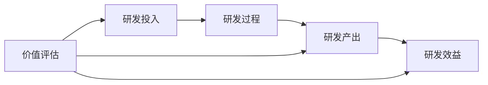

# 如何评估企业的研发投入价值

> 关键词：企业研发投入、价值评估、财务指标、非财务指标、研发效益

> 摘要：本文围绕如何评估企业的研发投入价值展开，详细阐述了研发投入价值评估的重要性及背景知识。通过对核心概念的剖析、评估算法原理的讲解、数学模型的介绍、项目实战案例的分析，全面展示了研发投入价值评估的方法和流程。同时，探讨了实际应用场景，推荐了相关的工具和资源，总结了未来发展趋势与挑战，并提供了常见问题解答及参考资料，旨在帮助企业更科学、准确地评估研发投入价值，提升研发决策的合理性和有效性。

## 1. 背景介绍 
### 1.1 目的和范围
在当今竞争激烈的商业环境中，企业的研发投入对于其生存和发展至关重要。研发投入不仅能够推动产品创新、提升企业竞争力，还可能为企业带来长期的经济效益。然而，研发投入往往伴随着较高的风险和不确定性，企业需要准确评估研发投入的价值，以合理配置资源、优化研发决策。本文的目的在于系统地介绍评估企业研发投入价值的方法和策略，涵盖了从理论概念到实际操作的各个方面，适用于各类企业在不同研发阶段的价值评估需求。

### 1.2 预期读者
本文预期读者包括企业管理人员、研发部门负责人、财务分析师、投资决策人员以及对企业研发管理和价值评估感兴趣的学者和研究人员。通过阅读本文，读者能够深入了解研发投入价值评估的方法和工具，从而更好地指导企业的研发实践和决策。

### 1.3 文档结构概述
本文首先介绍研发投入价值评估的背景知识，包括目的、预期读者和文档结构概述。接着阐述核心概念与联系，通过文本示意图和 Mermaid 流程图展示相关概念的原理和架构。然后详细讲解核心算法原理和具体操作步骤，并给出 Python 源代码示例。随后介绍数学模型和公式，并结合具体例子进行说明。再通过项目实战案例，展示代码实现和详细解释。之后探讨实际应用场景，推荐相关的工具和资源。最后总结未来发展趋势与挑战，提供常见问题解答和参考资料。

### 1.4 术语表
#### 1.4.1 核心术语定义
- **研发投入**：企业在研究与开发活动中所投入的资源，包括人力、物力、财力等方面的支出。
- **研发产出**：研发活动所产生的成果，如新产品、新技术、新工艺等。
- **研发效益**：研发投入所带来的经济效益和社会效益，包括销售收入增加、成本降低、市场份额扩大等。
- **价值评估**：对研发投入所产生的价值进行量化和分析的过程。

#### 1.4.2 相关概念解释
- **净现值（NPV）**：将未来现金流量按照一定的折现率折现到当前时刻的价值，用于评估项目的投资价值。
- **内部收益率（IRR）**：使项目净现值为零的折现率，反映项目的实际收益率。
- **投资回收期**：项目投资收回所需的时间，反映项目的资金回收速度。

#### 1.4.3 缩略词列表
- **NPV**：Net Present Value（净现值）
- **IRR**：Internal Rate of Return（内部收益率）
- **ROI**：Return on Investment（投资回报率）

## 2. 核心概念与联系 
### 核心概念原理
企业的研发投入价值评估涉及多个核心概念，包括研发投入、研发产出、研发效益和价值评估等。研发投入是企业为开展研发活动所付出的成本，它是研发活动的起点。研发产出是研发活动的成果，这些成果可能以多种形式存在，如新产品、新技术、新工艺等。研发效益则是研发产出所带来的经济效益和社会效益，是研发投入价值的具体体现。价值评估是将研发投入、研发产出和研发效益进行量化和分析的过程，通过一系列的指标和方法，评估研发投入是否值得以及其对企业的贡献程度。

### 架构的文本示意图
研发投入通过研发过程转化为研发产出，研发产出进一步带来研发效益，而价值评估则贯穿整个过程，对研发投入、产出和效益进行综合分析和评价。具体关系如下：
研发投入（人力、物力、财力） -> 研发过程（研究、开发、测试等） -> 研发产出（新产品、新技术、新工艺等） -> 研发效益（销售收入增加、成本降低、市场份额扩大等） -> 价值评估（净现值、内部收益率、投资回收期等）

### Mermaid 流程图


## 3. 核心算法原理 & 具体操作步骤 
### 核心算法原理
在评估企业研发投入价值时，常用的算法包括净现值（NPV）、内部收益率（IRR）和投资回收期等。

#### 净现值（NPV）
净现值是将项目未来各期的现金流量按照一定的折现率折现到当前时刻的价值之和。其基本原理是考虑资金的时间价值，将未来的现金流量折算到现在，以便进行比较和决策。计算公式为：
$$NPV=\sum_{t=0}^{n}\frac{CF_t}{(1 + r)^t}$$
其中，$CF_t$ 表示第 $t$ 期的现金流量，$r$ 表示折现率，$n$ 表示项目的寿命期。

#### 内部收益率（IRR）
内部收益率是使项目净现值为零的折现率，它反映了项目的实际收益率。通过求解以下方程得到内部收益率：
$$\sum_{t=0}^{n}\frac{CF_t}{(1 + IRR)^t}=0$$

#### 投资回收期
投资回收期是指项目投资收回所需的时间。静态投资回收期不考虑资金的时间价值，直接计算累计现金流量等于初始投资所需的时间；动态投资回收期则考虑资金的时间价值，计算累计折现现金流量等于初始投资所需的时间。

### 具体操作步骤
#### 步骤 1：确定研发项目的现金流量
收集研发项目在各个阶段的现金流入和流出数据，包括研发成本、销售收入、成本节约等。

#### 步骤 2：选择合适的折现率
折现率反映了资金的机会成本和风险水平，通常可以根据企业的加权平均资本成本（WACC）或行业平均收益率来确定。

#### 步骤 3：计算净现值（NPV）
根据确定的现金流量和折现率，使用上述净现值公式计算研发项目的净现值。

#### 步骤 4：计算内部收益率（IRR）
通过迭代计算或使用财务软件求解使净现值为零的折现率，即内部收益率。

#### 步骤 5：计算投资回收期
根据现金流量数据计算静态投资回收期和动态投资回收期。

### Python 源代码示例
```python
import numpy as np
from scipy.optimize import newton

# 定义现金流量
cash_flows = [-100000, 20000, 30000, 40000, 50000]  # 初始投资为负，后续为现金流入
discount_rate = 0.1  # 折现率

# 计算净现值
def npv(cash_flows, discount_rate):
    npv_value = 0
    for t in range(len(cash_flows)):
        npv_value += cash_flows[t] / (1 + discount_rate) ** t
    return npv_value

npv_value = npv(cash_flows, discount_rate)
print(f"净现值（NPV）: {npv_value}")

# 计算内部收益率
def irr_equation(irr, cash_flows):
    npv_value = 0
    for t in range(len(cash_flows)):
        npv_value += cash_flows[t] / (1 + irr) ** t
    return npv_value

irr_value = newton(irr_equation, 0.1, args=(cash_flows,))
print(f"内部收益率（IRR）: {irr_value}")

# 计算静态投资回收期
cumulative_cash_flows = np.cumsum(cash_flows)
for i in range(len(cumulative_cash_flows)):
    if cumulative_cash_flows[i] >= 0:
        static_payback_period = i
        break
print(f"静态投资回收期: {static_payback_period}")
```

## 4. 数学模型和公式 & 详细讲解 & 举例说明 
### 净现值（NPV）
#### 数学公式
$$NPV=\sum_{t=0}^{n}\frac{CF_t}{(1 + r)^t}$$
其中，$CF_t$ 表示第 $t$ 期的现金流量，$r$ 表示折现率，$n$ 表示项目的寿命期。

#### 详细讲解
净现值的核心思想是将未来的现金流量按照一定的折现率折现到当前时刻，考虑了资金的时间价值。如果净现值大于零，说明项目的投资回报率高于折现率，项目具有投资价值；如果净现值小于零，说明项目的投资回报率低于折现率，项目不具有投资价值；如果净现值等于零，说明项目的投资回报率等于折现率，项目的收益刚好能够覆盖成本。

#### 举例说明
假设某企业的一个研发项目初始投资为 100 万元，预计未来 5 年的现金流入分别为 20 万元、30 万元、40 万元、50 万元和 60 万元，折现率为 10%。则该项目的净现值计算如下：
$$NPV=-100+\frac{20}{(1 + 0.1)^1}+\frac{30}{(1 + 0.1)^2}+\frac{40}{(1 + 0.1)^3}+\frac{50}{(1 + 0.1)^4}+\frac{60}{(1 + 0.1)^5}$$
```python
import numpy as np

cash_flows = [-100, 20, 30, 40, 50, 60]
discount_rate = 0.1

npv_value = 0
for t in range(len(cash_flows)):
    npv_value += cash_flows[t] / (1 + discount_rate) ** t

print(f"净现值（NPV）: {npv_value}")
```
计算结果显示该项目的净现值大于零，说明该项目具有投资价值。

### 内部收益率（IRR）
#### 数学公式
$$\sum_{t=0}^{n}\frac{CF_t}{(1 + IRR)^t}=0$$

#### 详细讲解
内部收益率是使项目净现值为零的折现率，它反映了项目的实际收益率。内部收益率越高，说明项目的盈利能力越强。在进行项目决策时，通常将内部收益率与企业的加权平均资本成本（WACC）进行比较，如果内部收益率大于 WACC，则项目可行；如果内部收益率小于 WACC，则项目不可行。

#### 举例说明
仍以上述研发项目为例，使用 Python 代码求解内部收益率：
```python
from scipy.optimize import newton

def irr_equation(irr, cash_flows):
    npv_value = 0
    for t in range(len(cash_flows)):
        npv_value += cash_flows[t] / (1 + irr) ** t
    return npv_value

cash_flows = [-100, 20, 30, 40, 50, 60]
irr_value = newton(irr_equation, 0.1, args=(cash_flows,))
print(f"内部收益率（IRR）: {irr_value}")
```
计算得到的内部收益率与折现率 10% 进行比较，判断项目的可行性。

### 投资回收期
#### 数学公式
- **静态投资回收期**：不考虑资金的时间价值，直接计算累计现金流量等于初始投资所需的时间。
- **动态投资回收期**：考虑资金的时间价值，计算累计折现现金流量等于初始投资所需的时间。

#### 详细讲解
静态投资回收期简单直观，能够快速反映项目的资金回收速度，但没有考虑资金的时间价值。动态投资回收期则更准确地反映了项目的实际投资回收情况，但计算相对复杂。

#### 举例说明
对于上述研发项目，计算静态投资回收期：
```python
import numpy as np

cash_flows = [-100, 20, 30, 40, 50, 60]
cumulative_cash_flows = np.cumsum(cash_flows)
for i in range(len(cumulative_cash_flows)):
    if cumulative_cash_flows[i] >= 0:
        static_payback_period = i
        break
print(f"静态投资回收期: {static_payback_period}")
```
通过计算得到静态投资回收期，评估项目的资金回收速度。

## 5. 项目实战：代码实际案例和详细解释说明 
### 5.1  开发环境搭建
#### 安装 Python
首先需要安装 Python 开发环境，建议使用 Python 3.x 版本。可以从 Python 官方网站（https://www.python.org/downloads/） 下载并安装适合自己操作系统的版本。

#### 安装必要的库
在评估企业研发投入价值的代码中，需要使用到 `numpy` 和 `scipy` 库。可以使用以下命令进行安装：
```sh
pip install numpy scipy
```

### 5.2  源代码详细实现和代码解读
```python
import numpy as np
from scipy.optimize import newton

# 定义研发项目的现金流量
cash_flows = [-200000, 30000, 40000, 50000, 60000, 70000]  # 初始投资为负，后续为现金流入
discount_rate = 0.12  # 折现率

# 计算净现值
def npv(cash_flows, discount_rate):
    npv_value = 0
    for t in range(len(cash_flows)):
        npv_value += cash_flows[t] / (1 + discount_rate) ** t
    return npv_value

npv_value = npv(cash_flows, discount_rate)
print(f"净现值（NPV）: {npv_value}")

# 计算内部收益率
def irr_equation(irr, cash_flows):
    npv_value = 0
    for t in range(len(cash_flows)):
        npv_value += cash_flows[t] / (1 + irr) ** t
    return npv_value

irr_value = newton(irr_equation, 0.1, args=(cash_flows,))
print(f"内部收益率（IRR）: {irr_value}")

# 计算静态投资回收期
cumulative_cash_flows = np.cumsum(cash_flows)
for i in range(len(cumulative_cash_flows)):
    if cumulative_cash_flows[i] >= 0:
        static_payback_period = i
        break
print(f"静态投资回收期: {static_payback_period}")
```

#### 代码解读
1. **导入必要的库**：`numpy` 用于数组操作，`scipy.optimize.newton` 用于求解内部收益率。
2. **定义现金流量和折现率**：`cash_flows` 表示研发项目的现金流量，初始投资为负，后续为现金流入；`discount_rate` 表示折现率。
3. **计算净现值**：`npv` 函数通过循环计算每个时期的现金流量折现后的值，并求和得到净现值。
4. **计算内部收益率**：`irr_equation` 函数定义了内部收益率的方程，`newton` 函数通过迭代求解使净现值为零的折现率。
5. **计算静态投资回收期**：使用 `np.cumsum` 函数计算累计现金流量，通过循环找到累计现金流量大于等于零的时期，即为静态投资回收期。

### 5.3  代码解读与分析
通过上述代码，我们可以得到研发项目的净现值、内部收益率和静态投资回收期等指标。净现值大于零表示项目具有投资价值，内部收益率高于折现率也说明项目的盈利能力较强，静态投资回收期越短说明项目的资金回收速度越快。这些指标可以帮助企业决策者评估研发项目的价值，做出合理的投资决策。

## 6. 实际应用场景 
### 新产品研发
企业在进行新产品研发时，需要投入大量的资源。通过评估研发投入价值，可以帮助企业判断新产品是否具有市场潜力和盈利空间。例如，一家电子产品企业计划研发一款新型智能手机，通过计算研发项目的净现值、内部收益率和投资回收期等指标，评估该项目的可行性。如果净现值大于零、内部收益率高于企业的加权平均资本成本且投资回收期较短，则说明该项目值得投资；反之，则需要重新考虑研发策略。

### 新技术研发
在新技术研发领域，研发投入的价值评估尤为重要。新技术的研发往往具有较高的风险和不确定性，但一旦成功，可能会为企业带来巨大的竞争优势。例如，一家生物制药企业研发一种新型抗癌药物，研发过程可能需要数年时间和大量资金投入。通过评估研发投入价值，企业可以在研发过程中及时调整策略，确保研发资源的合理配置。

### 工艺改进
企业为了提高生产效率、降低成本，可能会进行工艺改进。在工艺改进项目中，评估研发投入价值可以帮助企业确定改进措施是否值得实施。例如，一家制造业企业计划引入新的生产工艺，通过计算工艺改进项目的成本节约和效益增加，评估该项目的投资回报率。如果投资回报率较高，则说明工艺改进项目具有价值。

## 7. 工具和资源推荐
### 7.1 学习