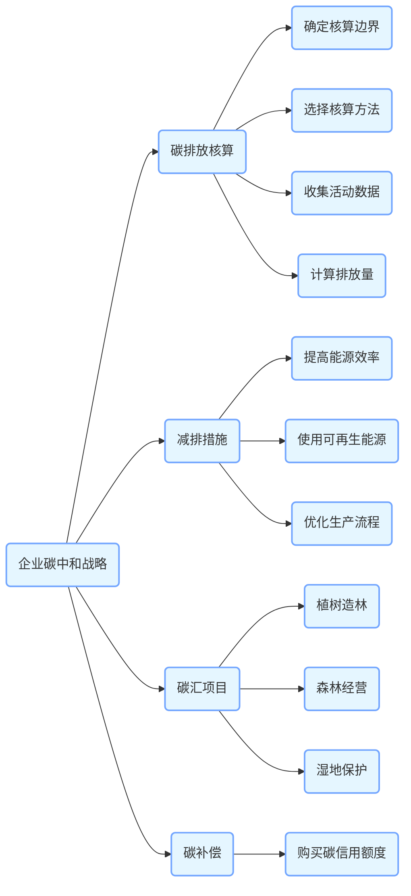

# 如何评估企业的碳中和战略

> 关键词：企业碳中和战略、评估指标、评估方法、数学模型、实际应用场景

> 摘要：本文围绕如何评估企业的碳中和战略展开，深入探讨了相关核心概念、评估方法、数学模型等内容。首先介绍了评估企业碳中和战略的背景，包括目的、预期读者等信息。接着阐述了核心概念及联系，展示了其原理和架构。通过Python代码详细讲解了核心算法原理与具体操作步骤，并给出了相关数学模型和公式。结合项目实战，说明了开发环境搭建、源代码实现与解读。还分析了实际应用场景，推荐了学习、开发工具及相关论文著作。最后总结了未来发展趋势与挑战，解答常见问题并提供扩展阅读与参考资料，旨在为企业和相关人员提供全面、系统的评估企业碳中和战略的指导。

## 1. 背景介绍 
### 1.1 目的和范围
随着全球气候变化问题日益严峻，各国纷纷提出碳中和目标。企业作为经济活动的主体，其碳中和战略的实施对于实现全球碳中和目标至关重要。评估企业的碳中和战略旨在帮助企业了解自身在碳中和方面的进展、成效和存在的问题，为企业制定和调整碳中和战略提供科学依据，同时也为投资者、监管机构等利益相关者提供决策参考。

本文的范围涵盖了企业碳中和战略评估的各个方面，包括核心概念、评估方法、数学模型、实际应用案例等，旨在为读者提供一个全面、系统的评估框架。

### 1.2 预期读者
本文的预期读者包括企业管理人员、可持续发展专家、投资者、监管机构人员以及对企业碳中和战略评估感兴趣的研究人员和学生。对于企业管理人员来说，本文可以帮助他们评估企业的碳中和战略，制定更有效的减排措施；对于投资者和监管机构人员，本文可以为他们评估企业的可持续发展能力提供参考；对于研究人员和学生，本文可以为他们深入研究企业碳中和战略评估提供理论和实践基础。

### 1.3 文档结构概述
本文将按照以下结构进行组织：首先介绍评估企业碳中和战略的背景信息，包括目的、预期读者和文档结构概述等；接着阐述核心概念与联系，展示其原理和架构；然后详细讲解核心算法原理与具体操作步骤，并给出相关数学模型和公式；结合项目实战，说明开发环境搭建、源代码实现与解读；分析实际应用场景，推荐学习、开发工具及相关论文著作；最后总结未来发展趋势与挑战，解答常见问题并提供扩展阅读与参考资料。

### 1.4 术语表
#### 1.4.1 核心术语定义
- **碳中和**：企业通过各种方式减少温室气体排放，并通过碳汇、碳补偿等手段抵消剩余的温室气体排放，实现净零排放的目标。
- **碳中和战略**：企业为实现碳中和目标而制定的一系列长期规划和行动计划，包括减排目标、减排措施、碳汇项目等。
- **碳足迹**：企业在生产、经营等活动中产生的温室气体排放量，通常以二氧化碳当量（CO₂e）表示。
- **碳汇**：通过植树造林、森林经营、湿地保护等方式吸收和固定大气中的二氧化碳，从而减少温室气体浓度的过程、活动或机制。
- **碳补偿**：企业通过购买碳信用额度等方式，抵消自身无法避免的温室气体排放。

#### 1.4.2 相关概念解释
- **碳排放核算**：对企业的碳排放进行量化计算的过程，通常包括确定核算边界、选择核算方法、收集活动数据、计算排放量等步骤。
- **减排措施**：企业为减少碳排放而采取的各种行动，如提高能源效率、使用可再生能源、优化生产流程等。
- **碳交易**：企业之间通过买卖碳排放配额或碳信用额度来实现碳排放权的转移，从而达到减排的目的。

#### 1.4.3 缩略词列表
- **CO₂e**：二氧化碳当量（Carbon Dioxide Equivalent）
- **GHG**：温室气体（Greenhouse Gas）
- **ESG**：环境、社会和治理（Environmental, Social and Governance）

## 2. 核心概念与联系 

### 核心概念原理
企业的碳中和战略涉及多个核心概念，这些概念相互关联，共同构成了企业实现碳中和目标的框架。

碳排放是企业活动对环境影响的主要体现，企业需要对其进行准确核算，以了解自身的碳排放水平。碳足迹则是对企业碳排放的综合度量，它考虑了企业生产、经营过程中的各个环节所产生的温室气体排放。

减排措施是企业降低碳排放的关键手段，通过提高能源效率、使用可再生能源等方式，可以直接减少企业的碳排放。碳汇和碳补偿则是企业在无法完全避免碳排放的情况下，通过吸收或抵消剩余碳排放来实现碳中和的重要途径。

### 架构的文本示意图
```plaintext
企业碳中和战略
|-- 碳排放核算
|   |-- 确定核算边界
|   |-- 选择核算方法
|   |-- 收集活动数据
|   |-- 计算排放量
|-- 减排措施
|   |-- 提高能源效率
|   |-- 使用可再生能源
|   |-- 优化生产流程
|-- 碳汇项目
|   |-- 植树造林
|   |-- 森林经营
|   |-- 湿地保护
|-- 碳补偿
|   |-- 购买碳信用额度
```

### Mermaid 流程图


## 3. 核心算法原理 & 具体操作步骤 

### 核心算法原理
评估企业的碳中和战略可以从多个维度进行，其中一个重要的方面是评估企业的碳排放减少情况。我们可以通过计算企业在不同时间段内的碳排放量，并比较其变化来评估企业的减排成效。

以下是一个简单的Python代码示例，用于计算企业的碳排放减少率：

```python
def calculate_emission_reduction_rate(initial_emission, final_emission):
    """
    计算碳排放减少率
    :param initial_emission: 初始碳排放量
    :param final_emission: 最终碳排放量
    :return: 碳排放减少率
    """
    if initial_emission == 0:
        return 0
    reduction_rate = (initial_emission - final_emission) / initial_emission
    return reduction_rate

# 示例数据
initial_emission = 1000  # 初始碳排放量（吨 CO₂e）
final_emission = 800  # 最终碳排放量（吨 CO₂e）

reduction_rate = calculate_emission_reduction_rate(initial_emission, final_emission)
print(f"碳排放减少率: {reduction_rate * 100:.2f}%")
```

### 具体操作步骤
1. **数据收集**：收集企业在不同时间段内的碳排放量数据，这些数据可以通过碳排放核算得到。
2. **数据处理**：将收集到的数据进行整理和清洗，确保数据的准确性和一致性。
3. **计算碳排放减少率**：使用上述代码中的函数计算企业的碳排放减少率。
4. **评估结果分析**：根据计算得到的碳排放减少率，评估企业的减排成效。如果碳排放减少率较高，说明企业的碳中和战略取得了较好的效果；反之，则需要进一步分析原因，调整战略。

## 4. 数学模型和公式 & 详细讲解 & 举例说明 

### 碳排放减少率公式
碳排放减少率 $R$ 的计算公式为：

$$R = \frac{E_{i} - E_{f}}{E_{i}}$$

其中，$E_{i}$ 表示初始碳排放量，$E_{f}$ 表示最终碳排放量。

### 详细讲解
碳排放减少率是衡量企业减排成效的重要指标，它反映了企业在一定时间段内碳排放量的减少程度。公式中的分子 $E_{i} - E_{f}$ 表示碳排放量的减少量，分母 $E_{i}$ 表示初始碳排放量。通过将减少量除以初始排放量，得到的结果即为碳排放减少率。

### 举例说明
假设某企业在2020年的碳排放量为1000吨 CO₂e，在2021年的碳排放量为800吨 CO₂e。则该企业的碳排放减少率为：

$$R = \frac{1000 - 800}{1000} = 0.2 = 20\%$$

这意味着该企业在2020年至2021年期间，碳排放量减少了20%，说明企业的碳中和战略取得了一定的成效。

## 5. 项目实战：代码实际案例和详细解释说明 

### 5.1  开发环境搭建
为了运行上述代码，我们需要搭建一个Python开发环境。以下是具体步骤：

1. **安装Python**：从Python官方网站（https://www.python.org/downloads/）下载并安装Python 3.x版本。
2. **安装集成开发环境（IDE）**：推荐使用PyCharm，它是一款功能强大的Python IDE。可以从JetBrains官方网站（https://www.jetbrains.com/pycharm/download/）下载并安装。
3. **创建项目**：打开PyCharm，创建一个新的Python项目。

### 5.2  源代码详细实现和代码解读
以下是一个更完整的Python代码示例，用于评估企业的碳中和战略：

```python
class CarbonNeutralityAssessment:
    def __init__(self, initial_emission, final_emission):
        """
        初始化类
        :param initial_emission: 初始碳排放量
        :param final_emission: 最终碳排放量
        """
        self.initial_emission = initial_emission
        self.final_emission = final_emission

    def calculate_emission_reduction_rate(self):
        """
        计算碳排放减少率
        :return: 碳排放减少率
        """
        if self.initial_emission == 0:
            return 0
        reduction_rate = (self.initial_emission - self.final_emission) / self.initial_emission
        return reduction_rate

    def assess_strategy(self):
        """
        评估碳中和战略
        :return: 评估结果
        """
        reduction_rate = self.calculate_emission_reduction_rate()
        if reduction_rate >= 0.2:
            return "碳中和战略成效显著"
        elif reduction_rate >= 0.1:
            return "碳中和战略取得一定成效"
        else:
            return "碳中和战略成效一般，需调整策略"

# 示例数据
initial_emission = 1000  # 初始碳排放量（吨 CO₂e）
final_emission = 800  # 最终碳排放量（吨 CO₂e）

# 创建评估对象
assessment = CarbonNeutralityAssessment(initial_emission, final_emission)

# 计算碳排放减少率
reduction_rate = assessment.calculate_emission_reduction_rate()
print(f"碳排放减少率: {reduction_rate * 100:.2f}%")

# 评估碳中和战略
result = assessment.assess_strategy()
print(f"评估结果: {result}")
```

### 代码解读与分析
1. **类的定义**：`CarbonNeutralityAssessment` 类用于封装企业碳中和战略评估的相关功能。
2. **初始化方法**：`__init__` 方法用于初始化类的属性，包括初始碳排放量和最终碳排放量。
3. **计算碳排放减少率方法**：`calculate_emission_reduction_rate` 方法用于计算企业的碳排放减少率，其实现原理与前面介绍的函数相同。
4. **评估战略方法**：`assess_strategy` 方法根据计算得到的碳排放减少率，对企业的碳中和战略进行评估，并返回评估结果。
5. **示例数据和调用**：代码中给出了示例数据，并创建了评估对象，调用了相关方法进行计算和评估。

## 6. 实际应用场景 
### 企业内部管理
企业可以使用上述评估方法对自身的碳中和战略进行定期评估，了解战略的实施效果，及时发现问题并调整策略。例如，企业可以根据评估结果优化减排措施，加大对可再生能源的投资，提高能源效率等。

### 投资者决策
投资者在选择投资对象时，越来越关注企业的可持续发展能力。通过评估企业的碳中和战略，投资者可以了解企业在应对气候变化方面的表现，判断企业的长期发展潜力，从而做出更明智的投资决策。

### 监管机构监管
监管机构可以使用评估方法对企业的碳中和战略进行监督和管理，确保企业按照相关政策和法规要求实施减排措施。例如，监管机构可以根据企业的评估结果，对减排成效显著的企业给予奖励，对未达到减排目标的企业进行处罚。

## 7. 工具和资源推荐
### 7.1 学习资源推荐
#### 7.1.1 书籍推荐
- 《碳中和与绿色金融》：本书系统介绍了碳中和的概念、背景、实现路径以及绿色金融在其中的作用，对于了解企业碳中和战略具有重要的参考价值。
- 《气候变化经济学》：从经济学的角度分析了气候变化的影响和应对策略，为企业制定碳中和战略提供了理论基础。

#### 7.1.2 在线课程
- Coursera上的“Climate Change: Science and Solutions”：该课程由知名大学的教授授课，内容涵盖气候变化的科学原理、影响和应对措施等方面，有助于深入了解企业碳中和战略的背景和意义。
- edX上的“Carbon Management and Climate Strategies”：课程介绍了企业碳管理和气候战略的相关知识和实践经验，适合企业管理人员和可持续发展专家学习。

#### 7.1.3 技术博客和网站
- Carbon Brief：提供有关气候变化和碳中和的最新资讯和分析，是了解行业动态的重要渠道。
- GreenBiz：专注于企业可持续发展和绿色商业的报道，分享了许多企业碳中和战略的实践案例和经验。

### 7.2 开发工具框架推荐
#### 7.2.1 IDE和编辑器
- PyCharm：功能强大的Python IDE，提供了代码编辑、调试、版本控制等一系列功能，适合开发Python程序。
- Visual Studio Code：轻量级的代码编辑器，支持多种编程语言，具有丰富的插件生态系统，可以满足不同的开发需求。

#### 7.2.2 调试和性能分析工具
- Py-Spy：用于分析Python程序的性能瓶颈，找出程序中运行缓慢的部分，帮助优化代码。
- PDB：Python自带的调试工具，可以在程序运行过程中设置断点，查看变量的值，方便调试代码。

#### 7.2.3 相关框架和库
- Pandas：用于数据处理和分析的Python库，提供了丰富的数据结构和函数，方便对企业碳排放数据进行处理和分析。
- NumPy：Python的数值计算库，提供了高效的数组操作和数学函数，可用于碳排放计算和模型构建。

### 7.3 相关论文著作推荐
#### 7.3.1 经典论文
- “The Economics of Climate Change: The Stern Review”：该论文由英国经济学家尼古拉斯·斯特恩（Nicholas Stern）撰写，对气候变化的经济影响进行了全面分析，提出了应对气候变化的政策建议，是气候变化经济学领域的经典之作。
- “Towards a Theory of Corporate Carbon Management”：探讨了企业碳管理的理论框架和实践方法，为企业制定碳中和战略提供了理论支持。

#### 7.3.2 最新研究成果
- 在《Nature》、《Science》等顶级学术期刊上发表的关于气候变化和碳中和的研究论文，这些论文反映了该领域的最新研究进展和前沿动态。
- 国际能源署（IEA）、世界资源研究所（WRI）等国际组织发布的相关报告，提供了全球和各国的能源和碳排放数据，以及碳中和的政策建议和技术路线图。

#### 7.3.3 应用案例分析
- 一些知名企业如苹果、谷歌等发布的碳中和报告，详细介绍了企业的碳中和战略和实施情况，为其他企业提供了实践参考。
- 行业研究机构发布的企业碳中和案例分析报告，对不同行业的企业碳中和实践进行了深入分析和总结。

## 8. 总结：未来发展趋势与挑战
### 未来发展趋势
- **政策法规不断完善**：随着全球对气候变化问题的关注度不断提高，各国政府将出台更加严格的碳排放政策和法规，企业面临的减排压力将不断增大。同时，政府也将加大对企业碳中和的支持力度，出台相关的补贴政策和激励措施。
- **技术创新加速**：为了实现碳中和目标，企业将加大对节能减排技术、可再生能源技术、碳捕获和封存技术等的研发投入，推动技术创新和应用。例如，新能源汽车、智能电网、分布式能源等技术将得到更广泛的应用。
- **供应链碳中和成为趋势**：企业不仅要关注自身的碳排放，还要关注供应链的碳排放。越来越多的企业将要求供应商采取减排措施，实现供应链的碳中和。这将推动整个产业链的绿色转型。
- **碳市场不断发展**：碳交易市场将不断完善和扩大，企业可以通过参与碳交易来降低减排成本。同时，碳金融产品也将不断创新，为企业提供更多的融资渠道和风险管理工具。

### 挑战
- **数据质量和准确性**：准确的碳排放数据是评估企业碳中和战略的基础。然而，目前企业在碳排放数据收集、核算和报告方面还存在一些问题，数据质量和准确性有待提高。
- **技术成本较高**：一些节能减排技术和碳捕获技术的成本较高，企业在实施这些技术时面临较大的经济压力。如何降低技术成本，提高技术的经济性，是企业面临的一个重要挑战。
- **人才短缺**：企业在实施碳中和战略过程中，需要大量的专业人才，如碳排放核算师、能源管理师、可持续发展专家等。然而，目前相关专业人才短缺，制约了企业碳中和战略的实施。
- **国际合作与协调**：气候变化是一个全球性问题，需要各国政府和企业加强合作与协调。然而，在国际层面，各国在碳排放责任分担、技术转让、资金支持等方面还存在一些分歧，需要进一步加强沟通和协商。

## 9. 附录：常见问题与解答
### 问题1：如何确定企业的碳排放核算边界？
解答：企业的碳排放核算边界可以根据企业的组织架构、生产经营活动和能源消耗情况来确定。一般来说，核算边界可以包括企业的直接排放（如生产过程中的燃烧排放）、间接排放（如外购电力的排放）和其他间接排放（如供应链的排放）。企业可以参考相关的核算标准和指南，如《温室气体排放核算与报告要求 第1部分：发电企业》、《企业温室气体排放核算方法与报告指南 通用要求》等，来确定核算边界。

### 问题2：企业的碳汇项目如何评估其效果？
解答：企业的碳汇项目效果可以从多个方面进行评估，如碳汇量、生态效益、社会效益等。碳汇量可以通过测量树木的生长量、土壤碳储量等指标来计算；生态效益可以从改善生态环境、保护生物多样性等方面进行评估；社会效益可以从促进当地经济发展、增加就业机会等方面进行评估。企业可以委托专业的第三方机构对碳汇项目进行评估，以确保评估结果的准确性和公正性。

### 问题3：企业购买碳信用额度是否可以完全替代自身的减排措施？
解答：企业购买碳信用额度可以在一定程度上抵消自身的碳排放，但不能完全替代自身的减排措施。购买碳信用额度只是一种临时的碳补偿手段，企业仍然需要采取实际的减排措施，如提高能源效率、使用可再生能源等，来降低自身的碳排放。同时，企业也应该积极参与碳汇项目的开发和建设，增加自身的碳汇量，实现真正意义上的碳中和。

## 10. 扩展阅读 & 参考资料
### 扩展阅读
- 《零碳社会：人类可持续生存的蓝图》：本书探讨了实现零碳社会的可能性和路径，为企业和社会提供了一个可持续发展的愿景。
- 《绿色经济的未来》：介绍了绿色经济的概念、发展趋势和实践经验，对企业在碳中和背景下的转型发展具有重要的启示作用。

### 参考资料
- 《温室气体排放核算与报告要求》系列标准
- 《企业温室气体排放核算方法与报告指南》系列指南
- 国际标准化组织（ISO）发布的相关标准，如ISO 14064、ISO 14067等
- 世界资源研究所（WRI）和世界可持续发展工商理事会（WBCSD）发布的《温室气体核算体系 企业核算与报告标准》

作者：AI天才研究院/AI Genius Institute & 禅与计算机程序设计艺术 /Zen And The Art of Computer Programming