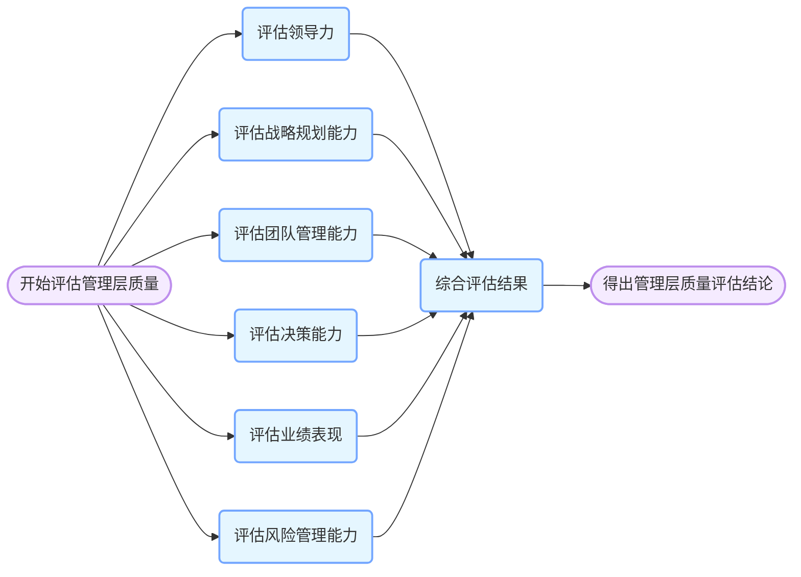

# 如何评估企业的管理层质量

> 关键词：企业管理层质量评估、领导力、战略规划、团队管理、决策能力、业绩表现、风险管理

> 摘要：本文旨在深入探讨如何评估企业的管理层质量。通过分析管理层在企业运营中的关键作用，介绍一系列评估管理层质量的核心概念、算法原理、数学模型等理论知识，并结合实际项目案例，阐述评估的具体操作步骤和方法。同时，探讨管理层质量评估在不同实际场景中的应用，推荐相关的学习资源、开发工具和论文著作。最后，总结未来企业管理层质量评估的发展趋势与挑战，为读者提供全面且深入的企业管理层质量评估指南。

## 1. 背景介绍 
### 1.1 目的和范围
企业的管理层是企业发展的核心驱动力，其质量直接影响企业的战略方向、运营效率和长期发展潜力。准确评估企业的管理层质量，有助于投资者做出明智的投资决策，帮助企业所有者识别管理层的优势与不足，以便进行有效的管理和监督，同时也为潜在的合作伙伴提供参考，判断企业的合作价值和稳定性。

本文章的范围涵盖了评估企业管理层质量的各个方面，包括管理层的领导力、战略规划能力、团队管理能力、决策能力、业绩表现以及风险管理能力等。通过综合考虑这些因素，构建一个全面、科学的评估体系。

### 1.2 预期读者
本文预期读者包括投资者、企业所有者、企业管理人员、管理咨询顾问、金融分析师以及对企业管理和评估感兴趣的研究人员。对于投资者来说，了解如何评估管理层质量可以帮助他们筛选出具有潜力的投资标的；企业所有者可以借助评估结果优化管理层结构，提升企业的管理水平；企业管理人员可以通过学习评估方法，发现自身的不足并加以改进；管理咨询顾问可以将评估体系应用于实际项目中，为客户提供专业的建议；金融分析师可以将管理层质量评估纳入企业基本面分析的范畴；研究人员则可以进一步深入探讨相关理论和方法。

### 1.3 文档结构概述
本文将按照以下结构进行阐述：首先介绍评估企业管理层质量的核心概念，包括各关键因素的定义和相互关系，并通过文本示意图和 Mermaid 流程图进行直观展示；接着详细讲解评估的核心算法原理，并给出具体的操作步骤，同时使用 Python 源代码进行说明；然后介绍评估过程中涉及的数学模型和公式，并结合实际例子进行详细讲解；通过一个项目实战案例，展示评估的具体实施过程，包括开发环境搭建、源代码实现和代码解读；探讨管理层质量评估在不同实际场景中的应用；推荐相关的学习资源、开发工具和论文著作；最后总结未来企业管理层质量评估的发展趋势与挑战，并提供常见问题的解答和扩展阅读参考资料。

### 1.4 术语表
#### 1.4.1 核心术语定义
- **管理层质量**：指企业管理层在领导、决策、战略规划、团队管理等方面所具备的能力和素质，以及这些能力和素质对企业业绩和发展产生的综合影响。
- **领导力**：管理层引导和激励团队实现企业目标的能力，包括愿景规划、激励员工、变革管理等方面。
- **战略规划能力**：管理层制定企业长期发展战略和短期经营计划的能力，能够准确把握市场趋势和企业自身优势，合理配置资源。
- **团队管理能力**：管理层有效组织、协调和激励团队成员，提高团队绩效的能力，包括人员招聘、培训、绩效管理等方面。
- **决策能力**：管理层在面对各种复杂情况时，能够快速、准确地做出合理决策的能力，决策应基于充分的信息分析和风险评估。
- **业绩表现**：企业在一定时期内的经营成果，通常通过财务指标（如营业收入、净利润、资产回报率等）和非财务指标（如市场份额、客户满意度等）来衡量。
- **风险管理能力**：管理层识别、评估和应对企业面临的各种风险的能力，包括市场风险、信用风险、运营风险等。

#### 1.4.2 相关概念解释
- **企业治理**：指企业的所有者、董事会和管理层之间的权力分配和制衡机制，良好的企业治理有助于提高管理层的责任感和决策的科学性。
- **企业文化**：企业在长期发展过程中形成的价值观、信仰和行为准则，管理层对企业文化的塑造和传承起着关键作用。
- **利益相关者**：包括股东、员工、客户、供应商、社区等与企业有利益关系的个人或群体，管理层的决策和行为会对利益相关者产生影响。

#### 1.4.3 缩略词列表
- **ROE**：Return on Equity，净资产收益率，衡量企业盈利能力的重要指标。
- **ROA**：Return on Assets，资产收益率，反映企业资产利用效率的指标。
- **EPS**：Earnings Per Share，每股收益，衡量股东收益的指标。

## 2. 核心概念与联系 

### 核心概念原理
评估企业的管理层质量需要综合考虑多个核心因素，这些因素相互关联、相互影响，共同构成了管理层质量的整体。

#### 领导力
领导力是管理层的核心能力之一，它为企业设定了发展方向和愿景。优秀的领导者能够激发员工的积极性和创造力，带领团队克服困难，实现企业的目标。领导力体现在多个方面，如清晰的沟通能力、果断的决策能力、对变革的敏锐洞察力和推动能力等。

#### 战略规划能力
战略规划能力是企业长期发展的保障。管理层需要对市场环境、行业趋势和企业自身实力进行深入分析，制定出符合企业实际情况的战略规划。战略规划应具有前瞻性、可行性和灵活性，能够根据市场变化及时调整。

#### 团队管理能力
团队管理能力直接影响企业的运营效率和员工的工作满意度。管理层需要合理配置人力资源，建立有效的团队激励机制，加强团队成员之间的沟通与协作，提高团队的凝聚力和战斗力。

#### 决策能力
决策能力是管理层在日常运营和重大战略问题上做出正确判断的关键。决策应基于充分的信息收集和分析，考虑各种风险和不确定性，权衡利弊，选择最优方案。

#### 业绩表现
业绩表现是管理层工作成果的直接体现。通过分析企业的财务指标和非财务指标，可以评估管理层的经营管理能力。良好的业绩表现不仅包括短期的盈利增长，还包括长期的可持续发展。

#### 风险管理能力
在复杂多变的市场环境中，企业面临着各种风险。管理层需要具备识别、评估和应对风险的能力，建立健全的风险管理体系，降低风险对企业的影响。

### 架构的文本示意图
```plaintext
管理层质量评估
|-- 领导力
|   |-- 愿景规划
|   |-- 激励员工
|   |-- 变革管理
|-- 战略规划能力
|   |-- 市场分析
|   |-- 战略制定
|   |-- 战略调整
|-- 团队管理能力
|   |-- 人员招聘
|   |-- 培训发展
|   |-- 绩效管理
|-- 决策能力
|   |-- 信息收集
|   |-- 风险评估
|   |-- 方案选择
|-- 业绩表现
|   |-- 财务指标
|   |   |-- 营业收入
|   |   |-- 净利润
|   |   |-- 资产回报率
|   |-- 非财务指标
|   |   |-- 市场份额
|   |   |-- 客户满意度
|-- 风险管理能力
|   |-- 风险识别
|   |-- 风险评估
|   |-- 风险应对
```

### Mermaid 流程图


## 3. 核心算法原理 & 具体操作步骤 

### 核心算法原理
评估企业管理层质量可以采用综合评分法，即将各个评估指标进行量化，赋予不同的权重，然后计算加权平均分作为管理层质量的综合得分。具体步骤如下：

1. **确定评估指标**：根据前面介绍的核心概念，确定领导力、战略规划能力、团队管理能力、决策能力、业绩表现和风险管理能力等为一级评估指标，每个一级指标下再细分若干二级指标。
2. **设定指标权重**：根据各指标对管理层质量的重要程度，为每个指标设定相应的权重，权重之和为 1。
3. **指标量化评分**：对每个二级指标进行评分，评分范围可以设定为 1 - 10 分，1 分表示最差，10 分表示最优。
4. **计算加权得分**：将每个二级指标的评分乘以其对应的权重，然后将所有二级指标的加权得分相加，得到一级指标的得分。
5. **计算综合得分**：将各个一级指标的得分乘以其对应的权重，然后相加得到管理层质量的综合得分。

### 具体操作步骤

#### 步骤 1：确定评估指标和权重
假设我们确定的评估指标和权重如下表所示：

| 一级指标 | 权重 | 二级指标 | 权重 |
| --- | --- | --- | --- |
| 领导力 | 0.2 | 愿景规划 | 0.3 |
|  |  | 激励员工 | 0.3 |
|  |  | 变革管理 | 0.4 |
| 战略规划能力 | 0.2 | 市场分析 | 0.3 |
|  |  | 战略制定 | 0.4 |
|  |  | 战略调整 | 0.3 |
| 团队管理能力 | 0.15 | 人员招聘 | 0.2 |
|  |  | 培训发展 | 0.3 |
|  |  | 绩效管理 | 0.5 |
| 决策能力 | 0.15 | 信息收集 | 0.3 |
|  |  | 风险评估 | 0.3 |
|  |  | 方案选择 | 0.4 |
| 业绩表现 | 0.15 | 财务指标（ROE） | 0.5 |
|  |  | 非财务指标（市场份额） | 0.5 |
| 风险管理能力 | 0.1 | 风险识别 | 0.3 |
|  |  | 风险评估 | 0.3 |
|  |  | 风险应对 | 0.4 |

#### 步骤 2：指标量化评分
通过查阅企业资料、访谈管理层和员工、分析市场数据等方式，对每个二级指标进行评分。例如，经过评估，某企业的愿景规划得分为 7 分，激励员工得分为 8 分，变革管理得分为 6 分。

#### 步骤 3：计算加权得分
以领导力为例，计算其一级指标得分：
愿景规划加权得分 = 7 * 0.3 = 2.1
激励员工加权得分 = 8 * 0.3 = 2.4
变革管理加权得分 = 6 * 0.4 = 2.4
领导力一级指标得分 = 2.1 + 2.4 + 2.4 = 6.9

按照同样的方法，计算其他一级指标的得分。

#### 步骤 4：计算综合得分
假设战略规划能力得分为 7.2，团队管理能力得分为 6.5，决策能力得分为 7.0，业绩表现得分为 6.8，风险管理能力得分为 6.2。
综合得分 = 6.9 * 0.2 + 7.2 * 0.2 + 6.5 * 0.15 + 7.0 * 0.15 + 6.8 * 0.15 + 6.2 * 0.1
= 1.38 + 1.44 + 0.975 + 1.05 + 1.02 + 0.62
= 6.485

### Python 源代码实现
```python
# 定义评估指标和权重
weights = {
    '领导力': {
        '愿景规划': 0.3,
        '激励员工': 0.3,
        '变革管理': 0.4
    },
    '战略规划能力': {
        '市场分析': 0.3,
        '战略制定': 0.4,
        '战略调整': 0.3
    },
    '团队管理能力': {
        '人员招聘': 0.2,
        '培训发展': 0.3,
        '绩效管理': 0.5
    },
    '决策能力': {
        '信息收集': 0.3,
        '风险评估': 0.3,
        '方案选择': 0.4
    },
    '业绩表现': {
        '财务指标（ROE）': 0.5,
        '非财务指标（市场份额）': 0.5
    },
    '风险管理能力': {
        '风险识别': 0.3,
        '风险评估': 0.3,
        '风险应对': 0.4
    }
}

# 一级指标权重
first_level_weights = {
    '领导力': 0.2,
    '战略规划能力': 0.2,
    '团队管理能力': 0.15,
    '决策能力': 0.15,
    '业绩表现': 0.15,
    '风险管理能力': 0.1
}

# 示例评分
scores = {
    '领导力': {
        '愿景规划': 7,
        '激励员工': 8,
        '变革管理': 6
    },
    '战略规划能力': {
        '市场分析': 7,
        '战略制定': 8,
        '战略调整': 6
    },
    '团队管理能力': {
        '人员招聘': 6,
        '培训发展': 7,
        '绩效管理': 6
    },
    '决策能力': {
        '信息收集': 7,
        '风险评估': 7,
        '方案选择': 7
    },
    '业绩表现': {
        '财务指标（ROE）': 7,
        '非财务指标（市场份额）': 6
    },
    '风险管理能力': {
        '风险识别': 6,
        '风险评估': 6,
        '风险应对': 6
    }
}

# 计算一级指标得分
first_level_scores = {}
for first_level in weights:
    score = 0
    for second_level in weights[first_level]:
        score += scores[first_level][second_level] * weights[first_level][second_level]
    first_level_scores[first_level] = score

# 计算综合得分
total_score = 0
for first_level in first_level_scores:
    total_score += first_level_scores[first_level] * first_level_weights[first_level]

print(f"管理层质量综合得分: {total_score}")
```

## 4. 数学模型和公式 & 详细讲解 & 举例说明 

### 数学模型和公式
设一级指标有 $n$ 个，分别为 $I_1, I_2, \cdots, I_n$，其对应的权重为 $w_1, w_2, \cdots, w_n$，且 $\sum_{i=1}^{n} w_i = 1$。每个一级指标 $I_i$ 下有 $m_i$ 个二级指标，分别为 $I_{i1}, I_{i2}, \cdots, I_{im_i}$，其对应的权重为 $w_{i1}, w_{i2}, \cdots, w_{im_i}$，且 $\sum_{j=1}^{m_i} w_{ij} = 1$。二级指标 $I_{ij}$ 的评分为 $s_{ij}$。

则一级指标 $I_i$ 的得分 $S_i$ 计算公式为：
$$S_i = \sum_{j=1}^{m_i} s_{ij} w_{ij}$$

管理层质量的综合得分 $S$ 计算公式为：
$$S = \sum_{i=1}^{n} S_i w_i$$

### 详细讲解
- **一级指标得分计算**：对于每个一级指标，将其下的所有二级指标的评分乘以对应的权重，然后相加得到该一级指标的得分。这一步反映了二级指标对一级指标的贡献程度。
- **综合得分计算**：将各个一级指标的得分乘以对应的权重，然后相加得到管理层质量的综合得分。这一步综合考虑了所有一级指标对管理层质量的影响。

### 举例说明
以我们前面的例子为例，对于领导力一级指标：
$n = 3$（愿景规划、激励员工、变革管理三个二级指标）
$w_{11} = 0.3$（愿景规划权重），$w_{12} = 0.3$（激励员工权重），$w_{13} = 0.4$（变革管理权重）
$s_{11} = 7$（愿景规划评分），$s_{12} = 8$（激励员工评分），$s_{13} = 6$（变革管理评分）

则领导力一级指标得分 $S_1$ 为：
$$S_1 = s_{11} w_{11} + s_{12} w_{12} + s_{13} w_{13} = 7 \times 0.3 + 8 \times 0.3 + 6 \times 0.4 = 6.9$$

假设其他一级指标得分分别为 $S_2 = 7.2$（战略规划能力），$S_3 = 6.5$（团队管理能力），$S_4 = 7.0$（决策能力），$S_5 = 6.8$（业绩表现），$S_6 = 6.2$（风险管理能力）。
$w_1 = 0.2$（领导力权重），$w_2 = 0.2$（战略规划能力权重），$w_3 = 0.15$（团队管理能力权重），$w_4 = 0.15$（决策能力权重），$w_5 = 0.15$（业绩表现权重），$w_6 = 0.1$（风险管理能力权重）

则管理层质量综合得分 $S$ 为：
$$S = S_1 w_1 + S_2 w_2 + S_3 w_3 + S_4 w_4 + S_5 w_5 + S_6 w_6 = 6.9 \times 0.2 + 7.2 \times 0.2 + 6.5 \times 0.15 + 7.0 \times 0.15 + 6.8 \times 0.15 + 6.2 \times 0.1 = 6.485$$

## 5. 项目实战：代码实际案例和详细解释说明 

### 5.1  开发环境搭建
为了运行我们的评估代码，需要搭建以下开发环境：

#### 安装 Python
Python 是一种广泛使用的编程语言，我们可以从 Python 官方网站（https://www.python.org/downloads/）下载并安装适合自己操作系统的 Python 版本。建议安装 Python 3.6 及以上版本。

#### 安装开发工具
可以选择使用 PyCharm、Visual Studio Code 等集成开发环境（IDE）来编写和运行 Python 代码。这里以 Visual Studio Code 为例，下载并安装 Visual Studio Code（https://code.visualstudio.com/），然后在扩展市场中安装 Python 扩展，以支持 Python 代码的编写和调试。

### 5.2  源代码详细实现和代码解读
以下是完整的源代码，我们将对其进行详细解读：

```python
# 定义评估指标和权重
weights = {
    '领导力': {
        '愿景规划': 0.3,
        '激励员工': 0.3,
        '变革管理': 0.4
    },
    '战略规划能力': {
        '市场分析': 0.3,
        '战略制定': 0.4,
        '战略调整': 0.3
    },
    '团队管理能力': {
        '人员招聘': 0.2,
        '培训发展': 0.3,
        '绩效管理': 0.5
    },
    '决策能力': {
        '信息收集': 0.3,
        '风险评估': 0.3,
        '方案选择': 0.4
    },
    '业绩表现': {
        '财务指标（ROE）': 0.5,
        '非财务指标（市场份额）': 0.5
    },
    '风险管理能力': {
        '风险识别': 0.3,
        '风险评估': 0.3,
        '风险应对': 0.4
    }
}

# 一级指标权重
first_level_weights = {
    '领导力': 0.2,
    '战略规划能力': 0.2,
    '团队管理能力': 0.15,
    '决策能力': 0.15,
    '业绩表现': 0.15,
    '风险管理能力': 0.1
}

# 示例评分
scores = {
    '领导力': {
        '愿景规划': 7,
        '激励员工': 8,
        '变革管理': 6
    },
    '战略规划能力': {
        '市场分析': 7,
        '战略制定': 8,
        '战略调整': 6
    },
    '团队管理能力': {
        '人员招聘': 6,
        '培训发展': 7,
        '绩效管理': 6
    },
    '决策能力': {
        '信息收集': 7,
        '风险评估': 7,
        '方案选择': 7
    },
    '业绩表现': {
        '财务指标（ROE）': 7,
        '非财务指标（市场份额）': 6
    },
    '风险管理能力': {
        '风险识别': 6,
        '风险评估': 6,
        '风险应对': 6
    }
}

# 计算一级指标得分
first_level_scores = {}
for first_level in weights:
    score = 0
    for second_level in weights[first_level]:
        score += scores[first_level][second_level] * weights[first_level][second_level]
    first_level_scores[first_level] = score

# 计算综合得分
total_score = 0
for first_level in first_level_scores:
    total_score += first_level_scores[first_level] * first_level_weights[first_level]

print(f"管理层质量综合得分: {total_score}")
```

#### 代码解读
1. **定义评估指标和权重**：
    - `weights` 字典存储了每个一级指标下的二级指标及其对应的权重。
    - `first_level_weights` 字典存储了各个一级指标的权重。

2. **示例评分**：
    - `scores` 字典存储了每个二级指标的评分，这里使用的是示例数据，实际应用中需要根据具体情况进行评估。

3. **计算一级指标得分**：
    - 通过两层循环遍历每个一级指标和其下的二级指标，将二级指标的评分乘以对应的权重并累加，得到一级指标的得分，存储在 `first_level_scores` 字典中。

4. **计算综合得分**：
    - 遍历 `first_level_scores` 字典，将每个一级指标的得分乘以对应的权重并累加，得到管理层质量的综合得分。

5. **输出结果**：
    - 使用 `print` 函数输出管理层质量的综合得分。

### 5.3  代码解读与分析
通过上述代码，我们实现了一个简单的企业管理层质量评估系统。代码的核心是使用综合评分法，将各个评估指标进行量化和加权计算，最终得到管理层质量的综合得分。

代码的优点在于结构清晰，易于理解和修改。通过修改 `weights`、`first_level_weights` 和 `scores` 字典中的数据，可以方便地调整评估指标、权重和评分。

然而，代码也存在一些局限性。例如，评分过程依赖于人工评估，主观性较强；评估指标和权重的设定可能不够科学，需要进一步优化；代码没有考虑数据的动态更新和实时评估。在实际应用中，可以结合更多的数据来源和分析方法，提高评估的准确性和客观性。

## 6. 实际应用场景 
### 投资者决策
投资者在选择投资标的时，除了关注企业的财务状况和市场前景外，管理层质量也是一个重要的考虑因素。通过评估企业的管理层质量，投资者可以了解管理层的能力和素质，判断企业的长期发展潜力，从而做出更明智的投资决策。例如，一家具有优秀管理层的企业，通常能够制定出合理的战略规划，有效地应对市场变化，实现业绩的稳定增长，这样的企业更值得投资者关注和投资。

### 企业并购与重组
在企业并购与重组过程中，评估目标企业的管理层质量至关重要。收购方需要了解目标企业管理层的能力和经验，判断他们是否能够适应新的企业环境和战略要求。如果目标企业的管理层质量较高，收购方可以考虑保留原管理层，以确保企业的稳定运营和发展；如果管理层质量较低，收购方可能需要进行管理层的调整和更换，以提高企业的管理效率和竞争力。

### 企业内部管理评估
企业所有者和董事会可以定期对管理层的工作进行评估，以了解管理层的工作表现和能力水平。通过评估，发现管理层存在的问题和不足，及时进行改进和培训，提高管理层的整体素质和管理水平。同时，评估结果也可以作为管理层绩效考核和薪酬调整的重要依据，激励管理层更好地履行职责，为企业创造更大的价值。

### 合作伙伴选择
企业在选择合作伙伴时，也会关注对方企业的管理层质量。一个具有优秀管理层的合作伙伴，通常具有良好的信誉和合作精神，能够与企业进行有效的沟通和协作，共同实现合作目标。相反，如果合作伙伴的管理层质量较低，可能会导致合作过程中出现各种问题，影响合作的顺利进行。因此，评估合作伙伴的管理层质量可以帮助企业选择合适的合作伙伴，降低合作风险。

## 7. 工具和资源推荐
### 7.1 学习资源推荐
#### 7.1.1 书籍推荐
- 《卓有成效的管理者》（The Effective Executive），作者：彼得·德鲁克（Peter F. Drucker）。本书介绍了管理者如何有效地管理时间、决策、用人等方面的方法和技巧，是管理学领域的经典著作。
- 《领导力21法则》（The 21 Irrefutable Laws of Leadership），作者：约翰·麦克斯韦尔（John C. Maxwell）。书中阐述了领导力的 21 条法则，帮助读者理解领导力的本质和提升领导力的方法。
- 《战略管理：概念与案例》（Strategic Management: Concepts and Cases），作者：弗雷德·R·戴维（Fred R. David）。本书系统地介绍了战略管理的基本概念、方法和工具，通过大量的案例分析，帮助读者掌握战略管理的实际应用。

#### 7.1.2 在线课程
- Coursera 平台上的“领导力与影响力”（Leadership and Influence）课程，由宾夕法尼亚大学沃顿商学院教授授课，介绍了领导力的理论和实践，帮助学员提升领导力和影响力。
- edX 平台上的“战略管理基础”（Foundations of Strategy）课程，由哈佛大学商学院教授授课，讲解了战略管理的基本原理和分析方法。
- Udemy 平台上的“团队管理与激励”（Team Management and Motivation）课程，提供了团队管理和激励的实用技巧和方法。

#### 7.1.3 技术博客和网站
- Harvard Business Review（https://hbr.org/）：哈佛商业评论是全球知名的商业管理杂志，提供了大量关于领导力、战略管理、团队管理等方面的文章和研究报告。
- McKinsey & Company（https://www.mckinsey.com/）：麦肯锡公司是全球著名的管理咨询公司，其网站上发布了许多关于企业管理和战略的研究成果和案例分析。
- Forbes（https://www.forbes.com/）：福布斯杂志的网站提供了丰富的商业新闻和管理观点，包括对企业管理层的分析和评价。

### 7.2 开发工具框架推荐
#### 7.2.1 IDE和编辑器
- PyCharm：是一款专门为 Python 开发设计的集成开发环境，具有代码自动补全、调试、版本控制等功能，适合开发复杂的 Python 项目。
- Visual Studio Code：是一款轻量级的代码编辑器，支持多种编程语言，通过安装 Python 扩展可以方便地进行 Python 开发。
- Jupyter Notebook：是一个交互式的编程环境，适合进行数据分析和模型开发，支持 Python、R 等多种编程语言。

#### 7.2.2 调试和性能分析工具
- PDB：是 Python 自带的调试工具，可以在代码中设置断点，逐行调试代码，帮助开发者查找和解决问题。
- cProfile：是 Python 的性能分析工具，可以分析代码的运行时间和函数调用次数，找出代码中的性能瓶颈。
- Py-Spy：是一个轻量级的 Python 性能分析工具，可以实时监控 Python 程序的运行状态，分析函数调用栈和 CPU 使用率。

#### 7.2.3 相关框架和库
- Pandas：是一个强大的数据分析库，提供了数据结构和数据分析工具，方便处理和分析企业的财务数据和运营数据。
- Numpy：是 Python 的科学计算库，提供了高效的数组操作和数学函数，可用于实现评估算法中的数值计算。
- Scikit-learn：是一个机器学习库，提供了各种机器学习算法和工具，可用于对评估结果进行预测和分析。

### 7.3 相关论文著作推荐
#### 7.3.1 经典论文
- Fama, E. F., & Jensen, M. C. (1983). Separation of ownership and control. The Journal of Law and Economics, 26(2), 301-325. 该论文探讨了企业所有权和控制权分离的问题，对理解企业管理层的行为和激励机制具有重要意义。
- Hambrick, D. C., & Mason, P. A. (1984). Upper echelons: The organization as a reflection of its top managers. Academy of Management Review, 9(2), 193-206. 提出了“高层梯队理论”，认为企业的战略决策和绩效受到高层管理者的个人特征和价值观的影响。

#### 7.3.2 最新研究成果
- Bertrand, M., & Schoar, A. (2003). Managing with style: The effect of managers on firm policies. The Quarterly Journal of Economics, 118(4), 1169-1208. 研究了管理者个人风格对企业政策和绩效的影响。
- Kaplan, S. N., Klebanov, M. M., & Sorensen, P. (2012). Which CEO characteristics and abilities matter? The Journal of Finance, 67(3), 973-1007. 分析了 CEO 的特征和能力与企业业绩之间的关系。

#### 7.3.3 应用案例分析
- Ghemawat, P. (2002). Strategy and the business landscape. Harvard Business School Press. 书中包含了许多企业战略管理的实际案例，通过对这些案例的分析，读者可以学习到不同企业在不同市场环境下的战略决策和管理经验。
- Collins, J. C., & Porras, J. I. (1994). Built to last: Successful habits of visionary companies. HarperBusiness. 研究了 18 家具有长期竞争优势的“愿景型公司”，分析了这些公司的管理层在企业发展过程中的作用和成功经验。

## 8. 总结：未来发展趋势与挑战
### 未来发展趋势
#### 数字化评估
随着信息技术的不断发展，企业管理层质量评估将越来越多地采用数字化手段。利用大数据、人工智能等技术，可以收集和分析更多的企业数据，包括财务数据、运营数据、员工反馈数据等，提高评估的准确性和客观性。同时，数字化评估工具可以实现实时评估和动态监测，及时发现管理层存在的问题并提供解决方案。

#### 多元化评估指标
未来的评估指标将更加多元化，除了传统的财务指标和管理能力指标外，还将纳入更多的非财务指标，如企业社会责任、创新能力、可持续发展能力等。这些指标能够更全面地反映企业的长期发展潜力和社会价值，有助于评估管理层的综合能力和决策的长远影响。

#### 全球化视角
在全球化的背景下，企业面临着更加复杂的市场环境和竞争压力。管理层质量评估也需要从全球化的视角出发，考虑不同国家和地区的文化差异、法律法规、市场规则等因素。评估体系需要具有更强的适应性和灵活性，以满足不同企业在全球市场中的发展需求。

### 挑战
#### 数据质量和安全
数字化评估依赖于大量的数据，但数据的质量和安全是一个重要的挑战。企业需要确保收集到的数据准确、完整、可靠，同时要加强数据安全保护，防止数据泄露和滥用。此外，如何整合不同来源的数据，消除数据之间的冲突和不一致性，也是一个需要解决的问题。

#### 评估指标的主观性
虽然多元化评估指标可以更全面地反映管理层的质量，但一些非财务指标的评估往往具有较强的主观性。例如，企业社会责任的评估涉及到道德、伦理等多个方面，不同的评估者可能会有不同的看法。如何减少评估指标的主观性，提高评估的公正性和可信度，是未来需要研究的重点。

#### 技术应用的复杂性
大数据、人工智能等技术的应用虽然为管理层质量评估带来了新的机遇，但也增加了技术应用的复杂性。企业需要具备专业的技术人才和技术基础设施，才能有效地应用这些技术进行评估。同时，如何解释和理解技术分析的结果，将技术分析与企业的实际管理决策相结合，也是一个挑战。

## 9. 附录：常见问题与解答
### 问题 1：评估指标和权重的设定有什么依据？
评估指标和权重的设定需要综合考虑多个因素，包括企业的行业特点、发展阶段、战略目标等。一般来说，可以参考行业标准、专家意见和企业的历史数据。例如，对于处于快速发展阶段的科技企业，创新能力和市场拓展能力可能更为重要，因此可以适当提高这些指标的权重；对于成熟的制造业企业，成本控制和质量管理可能是关键因素，相应指标的权重可以加大。

### 问题 2：如何确保评分的客观性？
为了确保评分的客观性，可以采取以下措施：
- 制定明确的评分标准：对于每个评估指标，制定详细的评分标准，明确不同评分等级对应的具体表现。
- 多维度评估：从多个角度收集信息，包括管理层自评、员工评价、客户反馈、市场数据等，综合考虑各方面的意见。
- 专家参与：邀请行业专家或管理咨询顾问参与评估，他们具有丰富的经验和专业知识，能够提供更客观的评价。

### 问题 3：评估结果如何应用？
评估结果可以应用于多个方面：
- 投资者决策：投资者可以根据评估结果选择投资标的，评估企业的投资价值和风险。
- 企业管理改进：企业所有者和董事会可以根据评估结果发现管理层存在的问题，制定改进措施，提高管理层的素质和管理水平。
- 管理层绩效考核和薪酬调整：评估结果可以作为管理层绩效考核的重要依据，与薪酬、晋升等挂钩，激励管理层更好地履行职责。

### 问题 4：评估体系需要多久更新一次？
评估体系的更新频率取决于企业的发展情况和市场环境的变化。一般来说，建议每年对评估指标和权重进行一次审查和调整，以确保评估体系的科学性和适应性。如果企业发生重大战略调整、行业环境发生剧烈变化或出现新的管理理念和方法，应及时对评估体系进行更新。

## 10. 扩展阅读 & 参考资料
- Drucker, P. F. (1973). Management: Tasks, responsibilities, practices. Harper & Row.
- Kotter, J. P. (1990). A force for change: How leadership differs from management. Free Press.
- Mintzberg, H. (1973). The nature of managerial work. Harper & Row.
- Barney, J. B. (1991). Firm resources and sustained competitive advantage. Journal of Management, 17(1), 99-120.
- Porter, M. E. (1980). Competitive strategy: Techniques for analyzing industries and competitors. Free Press.

作者：AI天才研究院/AI Genius Institute & 禅与计算机程序设计艺术 /Zen And The Art of Computer Programming