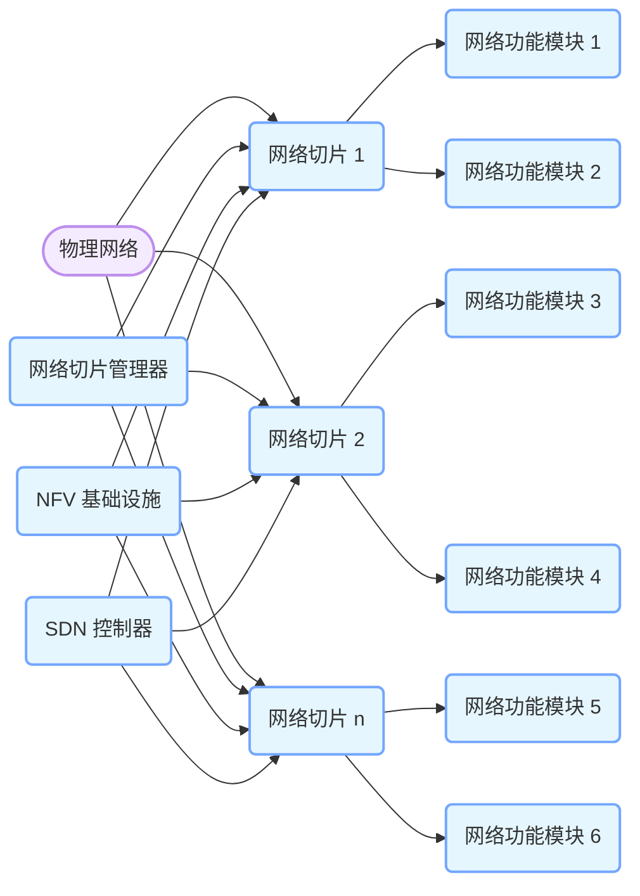

# 如何评估企业的网络切片技术应用

> 关键词：网络切片技术、企业应用评估、5G网络、网络性能、业务需求适配

> 摘要：本文围绕如何评估企业的网络切片技术应用展开深入探讨。首先介绍了网络切片技术的背景及评估的目的、范围等内容，接着阐述其核心概念与联系，详细讲解核心算法原理、数学模型及公式。通过项目实战展示代码实现与解读，分析实际应用场景。同时推荐相关工具和资源，最后总结未来发展趋势与挑战，为企业评估网络切片技术应用提供全面、深入的指导和参考，帮助企业更好地利用网络切片技术满足自身业务需求。

## 1. 背景介绍 
### 1.1 目的和范围
网络切片技术作为 5G 网络的关键创新之一，能够将物理网络划分为多个虚拟的、相互独立的逻辑网络，每个网络切片可根据不同的业务需求进行定制化配置，以满足多样化的业务场景。评估企业的网络切片技术应用的目的在于全面了解企业在实际业务中对网络切片技术的使用效果，判断其是否能够有效支撑企业的业务发展，提高运营效率和竞争力。

本评估的范围涵盖企业内部与网络切片技术应用相关的各个方面，包括网络切片的部署架构、性能指标、与企业业务的适配程度、安全保障措施以及成本效益等。

### 1.2 预期读者
本文预期读者主要包括企业的网络管理人员、技术决策者、业务部门负责人以及对网络切片技术应用评估感兴趣的技术人员。网络管理人员可以从中获取评估网络切片性能和稳定性的方法；技术决策者能够依据评估要点做出合理的技术投资和发展决策；业务部门负责人可以了解网络切片技术对业务的支持情况，以便更好地规划业务发展；技术人员则可以深入学习网络切片技术的原理和评估的具体操作方法。

### 1.3 文档结构概述
本文将按照以下结构展开：首先介绍网络切片技术评估的背景信息，包括目的、范围、预期读者等；接着阐述网络切片技术的核心概念与联系，通过文本示意图和 Mermaid 流程图进行说明；然后详细讲解核心算法原理和具体操作步骤，使用 Python 源代码进行阐述；随后介绍相关的数学模型和公式，并举例说明；通过项目实战展示代码实际案例和详细解释；分析网络切片技术的实际应用场景；推荐相关的工具和资源；总结未来发展趋势与挑战；最后提供附录，解答常见问题，并列出扩展阅读和参考资料。

### 1.4 术语表
#### 1.4.1 核心术语定义
- **网络切片（Network Slicing）**：将物理网络资源进行逻辑划分，形成多个相互独立的虚拟网络，每个网络切片可根据特定的业务需求进行定制化配置。
- **5G 网络（5th Generation Mobile Networks）**：第五代移动通信网络，具有高速率、低时延、大容量等特点，为网络切片技术提供了强大的底层支持。
- **服务等级协议（Service Level Agreement，SLA）**：规定了网络切片提供商与用户之间关于网络服务质量的约定，包括带宽、时延、可靠性等指标。
- **网络功能虚拟化（Network Function Virtualization，NFV）**：通过软件实现网络功能，将网络功能从专用硬件设备中解耦出来，提高网络的灵活性和可扩展性。
- **软件定义网络（Software Defined Networking，SDN）**：将网络的控制平面和数据平面分离，通过软件集中控制网络设备，实现网络的灵活配置和管理。

#### 1.4.2 相关概念解释
- **网络切片的隔离性**：不同的网络切片之间相互隔离，一个切片的故障或性能问题不会影响其他切片的正常运行。这种隔离性可以从物理资源、逻辑资源和安全等多个层面实现。
- **网络切片的定制化**：根据不同的业务需求，网络切片可以在带宽、时延、可靠性、安全性等方面进行定制化配置。例如，对于实时性要求高的工业控制业务，网络切片可以配置低时延和高可靠性的参数。
- **网络切片的编排与管理**：通过网络切片管理器对网络切片的生命周期进行管理，包括切片的创建、部署、监控、调整和删除等操作。同时，需要对不同切片之间的资源分配和协调进行编排，以确保网络资源的高效利用。

#### 1.4.3 缩略词列表
| 缩略词 | 英文全称 | 中文全称 |
| ---- | ---- | ---- |
| NS | Network Slicing | 网络切片 |
| 5G | 5th Generation Mobile Networks | 第五代移动通信网络 |
| SLA | Service Level Agreement | 服务等级协议 |
| NFV | Network Function Virtualization | 网络功能虚拟化 |
| SDN | Software Defined Networking | 软件定义网络 |

## 2. 核心概念与联系 

网络切片技术的核心概念主要包括网络切片的架构、网络功能虚拟化（NFV）和软件定义网络（SDN）。其架构主要由切片子网、网络切片管理器和网络功能模块组成。

### 文本示意图
网络切片技术的整体架构可以用以下方式描述：物理网络作为底层基础，承载着多个虚拟的网络切片。每个网络切片由多个网络功能模块组成，这些网络功能模块通过 NFV 技术实现虚拟化，运行在通用服务器上。网络切片管理器负责对各个网络切片的生命周期进行管理，包括切片的创建、配置、监控和删除等操作。同时，SDN 技术为网络切片提供灵活的网络控制和管理能力，实现网络资源的动态分配和优化。

### Mermaid 流程图


在这个流程图中，物理网络是所有网络切片的基础支撑。网络切片管理器负责对各个网络切片进行管理和协调。NFV 基础设施为网络切片提供虚拟化的网络功能模块，SDN 控制器则为网络切片提供灵活的网络控制和管理能力。每个网络切片由多个网络功能模块组成，这些模块共同协作，为特定的业务需求提供服务。

## 3. 核心算法原理 & 具体操作步骤 

### 核心算法原理
网络切片技术中涉及到的核心算法主要包括资源分配算法和切片编排算法。资源分配算法的目的是在多个网络切片之间合理分配物理网络资源，以满足不同切片的业务需求。切片编排算法则负责对网络切片的创建、部署和调整进行优化，提高网络切片的整体性能和效率。

下面以一个简单的资源分配算法为例，使用 Python 代码进行详细阐述。该算法基于贪心策略，根据每个网络切片的资源需求和优先级进行资源分配。

```python
# 定义网络切片类
class NetworkSlice:
    def __init__(self, name, bandwidth_demand, priority):
        self.name = name
        self.bandwidth_demand = bandwidth_demand
        self.priority = priority
        self.allocated_bandwidth = 0

    def __repr__(self):
        return f"NetworkSlice(name={self.name}, bandwidth_demand={self.bandwidth_demand}, priority={self.priority}, allocated_bandwidth={self.allocated_bandwidth})"

# 资源分配算法
def resource_allocation(slices, total_bandwidth):
    # 按照优先级对切片进行排序
    sorted_slices = sorted(slices, key=lambda x: x.priority, reverse=True)
    remaining_bandwidth = total_bandwidth

    for slice in sorted_slices:
        if remaining_bandwidth >= slice.bandwidth_demand:
            slice.allocated_bandwidth = slice.bandwidth_demand
            remaining_bandwidth -= slice.bandwidth_demand
        else:
            slice.allocated_bandwidth = remaining_bandwidth
            remaining_bandwidth = 0
            break

    return slices

# 示例使用
if __name__ == "__main__":
    # 创建网络切片实例
    slice1 = NetworkSlice("Slice1", 100, 2)
    slice2 = NetworkSlice("Slice2", 200, 1)
    slice3 = NetworkSlice("Slice3", 150, 3)

    slices = [slice1, slice2, slice3]
    total_bandwidth = 300

    # 进行资源分配
    allocated_slices = resource_allocation(slices, total_bandwidth)

    # 输出分配结果
    for slice in allocated_slices:
        print(slice)
```

### 具体操作步骤
1. **需求分析**：首先需要了解企业的业务需求，确定不同业务场景对网络切片的性能要求，如带宽、时延、可靠性等。
2. **切片规划**：根据业务需求，规划网络切片的数量、类型和资源需求。例如，对于实时性要求高的业务，可以规划低时延的网络切片；对于大流量数据传输业务，可以规划高带宽的网络切片。
3. **资源评估**：评估企业现有的物理网络资源，包括带宽、计算资源、存储资源等，确定可用于网络切片的资源总量。
4. **算法选择与配置**：根据企业的业务特点和资源情况，选择合适的资源分配算法和切片编排算法，并进行相应的参数配置。
5. **切片创建与部署**：使用网络切片管理器创建和部署网络切片，将虚拟的网络切片映射到物理网络资源上。
6. **监控与调整**：对网络切片的运行状态进行实时监控，根据业务需求和网络状况的变化，及时调整网络切片的资源分配和配置。

## 4. 数学模型和公式 & 详细讲解 & 举例说明 

### 数学模型
网络切片的资源分配问题可以抽象为一个优化问题，目标是在满足一定约束条件的前提下，最大化网络切片的整体效用。设共有 $n$ 个网络切片，第 $i$ 个网络切片的带宽需求为 $b_i$，分配到的带宽为 $x_i$，优先级为 $p_i$，网络切片的效用函数为 $u_i(x_i)$。

### 目标函数
目标是最大化所有网络切片的加权效用之和，即：
$$\max \sum_{i=1}^{n} p_i u_i(x_i)$$

### 约束条件
- 资源约束：所有网络切片分配到的带宽之和不能超过总带宽 $B$，即：
$$\sum_{i=1}^{n} x_i \leq B$$
- 非负约束：每个网络切片分配到的带宽不能为负数，即：
$$x_i \geq 0, \quad i = 1, 2, \cdots, n$$

### 效用函数
效用函数 $u_i(x_i)$ 通常用来表示第 $i$ 个网络切片在分配到带宽 $x_i$ 时的满意度。常见的效用函数形式包括线性函数、对数函数和指数函数等。例如，线性效用函数可以表示为：
$$u_i(x_i) = k_i x_i$$
其中 $k_i$ 为第 $i$ 个网络切片的效用系数，表示单位带宽带来的效用。

### 详细讲解
上述数学模型的核心思想是在有限的网络资源下，根据网络切片的优先级和效用函数，合理分配资源，以最大化整体效用。优先级 $p_i$ 反映了不同网络切片的重要程度，效用函数 $u_i(x_i)$ 则描述了网络切片对资源的需求特性。通过求解这个优化问题，可以得到最优的资源分配方案。

### 举例说明
假设有 3 个网络切片，其带宽需求、优先级和效用系数分别如下：

| 网络切片 | 带宽需求 $b_i$ | 优先级 $p_i$ | 效用系数 $k_i$ |
| ---- | ---- | ---- | ---- |
| 切片 1 | 100 | 2 | 0.5 |
| 切片 2 | 200 | 1 | 0.3 |
| 切片 3 | 150 | 3 | 0.6 |

总带宽 $B = 300$。

使用上述数学模型和线性效用函数，我们可以列出目标函数和约束条件：

目标函数：
$$\max 2 \times 0.5 x_1 + 1 \times 0.3 x_2 + 3 \times 0.6 x_3 = \max x_1 + 0.3 x_2 + 1.8 x_3$$

约束条件：
$$x_1 + x_2 + x_3 \leq 300$$
$$x_1 \geq 0, x_2 \geq 0, x_3 \geq 0$$

通过求解这个优化问题（可以使用线性规划求解器，如 Python 中的 `scipy.optimize.linprog` 函数），可以得到最优的资源分配方案。

```python
from scipy.optimize import linprog

# 目标函数系数（取负，因为 linprog 求解的是最小化问题）
c = [-1, -0.3, -1.8]

# 不等式约束系数
A = [[1, 1, 1]]
b = [300]

# 变量边界
x_bounds = [(0, None), (0, None), (0, None)]

# 求解线性规划问题
res = linprog(c, A_ub=A, b_ub=b, bounds=x_bounds)

print("最优解：", res.x)
print("最优目标值：", -res.fun)
```

在这个例子中，通过求解线性规划问题，我们可以得到每个网络切片的最优分配带宽，从而实现资源的合理分配。

## 5. 项目实战：代码实际案例和详细解释说明 

### 5.1  开发环境搭建
- **操作系统**：推荐使用 Linux 系统，如 Ubuntu 18.04 或更高版本。
- **编程语言**：Python 3.7 或更高版本。
- **相关库**：`numpy`、`scipy`、`matplotlib` 等。可以使用以下命令进行安装：
```sh
pip install numpy scipy matplotlib
```
- **网络模拟器**：可以使用 Mininet 等网络模拟器来模拟网络环境，进行网络切片技术的实验和测试。安装 Mininet 可以参考其官方文档。

### 5.2  源代码详细实现和代码解读
以下是一个更完整的网络切片资源分配和性能评估的 Python 代码示例：

```python
import numpy as np
import matplotlib.pyplot as plt
from scipy.optimize import linprog

# 定义网络切片类
class NetworkSlice:
    def __init__(self, name, bandwidth_demand, priority, utility_coefficient):
        self.name = name
        self.bandwidth_demand = bandwidth_demand
        self.priority = priority
        self.utility_coefficient = utility_coefficient
        self.allocated_bandwidth = 0

    def utility(self):
        return self.priority * self.utility_coefficient * self.allocated_bandwidth

    def __repr__(self):
        return f"NetworkSlice(name={self.name}, bandwidth_demand={self.bandwidth_demand}, priority={self.priority}, utility_coefficient={self.utility_coefficient}, allocated_bandwidth={self.allocated_bandwidth})"

# 资源分配算法
def resource_allocation(slices, total_bandwidth):
    n = len(slices)
    # 目标函数系数（取负，因为 linprog 求解的是最小化问题）
    c = [-slice.priority * slice.utility_coefficient for slice in slices]
    # 不等式约束系数
    A = [[1] * n]
    b = [total_bandwidth]
    # 变量边界
    bounds = [(0, slice.bandwidth_demand) for slice in slices]

    # 求解线性规划问题
    res = linprog(c, A_ub=A, b_ub=b, bounds=bounds)

    # 更新切片的分配带宽
    for i in range(n):
        slices[i].allocated_bandwidth = res.x[i]

    return slices

# 性能评估函数
def performance_evaluation(slices):
    total_utility = sum(slice.utility() for slice in slices)
    bandwidth_utilization = sum(slice.allocated_bandwidth for slice in slices)
    return total_utility, bandwidth_utilization

# 示例使用
if __name__ == "__main__":
    # 创建网络切片实例
    slice1 = NetworkSlice("Slice1", 100, 2, 0.5)
    slice2 = NetworkSlice("Slice2", 200, 1, 0.3)
    slice3 = NetworkSlice("Slice3", 150, 3, 0.6)

    slices = [slice1, slice2, slice3]
    total_bandwidth = 300

    # 进行资源分配
    allocated_slices = resource_allocation(slices, total_bandwidth)

    # 性能评估
    total_utility, bandwidth_utilization = performance_evaluation(allocated_slices)

    # 输出分配结果和性能指标
    print("资源分配结果：")
    for slice in allocated_slices:
        print(slice)
    print(f"总效用：{total_utility}")
    print(f"带宽利用率：{bandwidth_utilization / total_bandwidth * 100}%")

    # 绘制柱状图展示分配结果
    slice_names = [slice.name for slice in allocated_slices]
    allocated_bandwidths = [slice.allocated_bandwidth for slice in allocated_slices]

    plt.bar(slice_names, allocated_bandwidths)
    plt.xlabel('网络切片')
    plt.ylabel('分配带宽')
    plt.title('网络切片资源分配结果')
    plt.show()
```

### 5.3  代码解读与分析
1. **网络切片类 `NetworkSlice`**：定义了网络切片的基本属性，包括名称、带宽需求、优先级、效用系数和分配的带宽。`utility` 方法用于计算网络切片的效用值。
2. **资源分配算法 `resource_allocation`**：使用线性规划求解器 `scipy.optimize.linprog` 来解决资源分配问题。根据网络切片的优先级和效用系数构建目标函数，同时考虑资源约束和每个切片的带宽需求边界。
3. **性能评估函数 `performance_evaluation`**：计算所有网络切片的总效用和带宽利用率，用于评估资源分配的性能。
4. **主程序**：创建网络切片实例，调用资源分配算法进行资源分配，然后进行性能评估并输出结果。最后使用 `matplotlib` 库绘制柱状图展示资源分配结果。

通过这个代码示例，我们可以直观地看到网络切片的资源分配过程和性能评估结果，帮助我们更好地理解网络切片技术的应用。

## 6. 实际应用场景 
### 工业互联网
在工业互联网领域，网络切片技术可以为不同的工业应用场景提供定制化的网络服务。例如，对于工业自动化生产线中的实时控制业务，网络切片可以提供低时延、高可靠性的网络连接，确保生产过程的稳定性和准确性。对于工业大数据的采集和传输业务，网络切片可以提供高带宽的网络支持，满足大量数据的快速传输需求。

### 智能交通
在智能交通系统中，网络切片技术可以为自动驾驶、车路协同等应用提供保障。自动驾驶车辆需要实时获取周围环境信息和交通信号，对网络的时延和可靠性要求极高。网络切片可以为自动驾驶车辆分配低时延、高可靠性的网络资源，确保车辆的安全行驶。车路协同系统需要车辆与道路基础设施之间进行高效的数据交互，网络切片可以根据不同的业务需求，提供定制化的网络服务。

### 医疗保健
在医疗保健领域，网络切片技术可以应用于远程医疗、智能医疗设备等场景。远程医疗需要高清晰度的视频传输和实时的医疗数据交互，对网络的带宽和时延要求较高。网络切片可以为远程医疗应用提供高带宽、低时延的网络支持，确保医疗服务的质量和安全性。智能医疗设备需要实时上传患者的生命体征数据，网络切片可以为这些设备提供稳定、可靠的网络连接。

### 智慧城市
在智慧城市建设中，网络切片技术可以为城市的各个领域提供支持，如智能安防、智能能源管理、智能环境监测等。智能安防系统需要实时监控城市的各个角落，对网络的带宽和可靠性要求较高。网络切片可以为智能安防系统提供高带宽、高可靠性的网络服务，确保城市的安全。智能能源管理系统需要实时采集和分析能源数据，网络切片可以为其提供高效的数据传输和处理能力。智能环境监测系统需要实时监测城市的环境参数，网络切片可以为其提供稳定、可靠的网络连接。

## 7. 工具和资源推荐
### 7.1 学习资源推荐
#### 7.1.1 书籍推荐
- 《5G 网络切片技术与应用》：全面介绍了 5G 网络切片的技术原理、架构设计、实现方法和应用案例，是学习网络切片技术的经典书籍。
- 《软件定义网络：原理与实践》：深入讲解了软件定义网络（SDN）的原理和实践，对于理解网络切片技术中的 SDN 部分有很大帮助。
- 《网络功能虚拟化：原理与实践》：详细介绍了网络功能虚拟化（NFV）的技术原理和实现方法，有助于掌握网络切片技术中的 NFV 部分。

#### 7.1.2 在线课程
- Coursera 上的 “5G 技术基础” 课程：由知名高校的教授授课，系统地介绍了 5G 技术的各个方面，包括网络切片技术。
- edX 上的 “软件定义网络与网络功能虚拟化” 课程：深入讲解了 SDN 和 NFV 的原理和应用，与网络切片技术密切相关。
- 中国大学 MOOC 上的 “移动通信网络优化” 课程：其中包含了网络切片技术在移动通信网络优化中的应用内容。

#### 7.1.3 技术博客和网站
- 51CTO 博客：有很多关于 5G 网络和网络切片技术的技术文章和经验分享。
- InfoQ 网站：关注前沿技术动态，经常发布关于网络切片技术的最新研究成果和行业趋势。
- 通信人家园论坛：是通信行业的专业论坛，有很多关于网络切片技术的讨论和交流。

### 7.2 开发工具框架推荐
#### 7.2.1 IDE和编辑器
- PyCharm：一款功能强大的 Python 集成开发环境，支持代码编辑、调试、版本控制等功能，适合开发网络切片相关的 Python 代码。
- Visual Studio Code：一款轻量级的代码编辑器，具有丰富的插件生态系统，可以方便地进行 Python 代码开发和调试。
- Eclipse：一款开源的集成开发环境，支持多种编程语言，可用于开发网络切片技术中的 Java 或 C++ 代码。

#### 7.2.2 调试和性能分析工具
- Wireshark：一款强大的网络协议分析工具，可以用于捕获和分析网络切片中的数据包，帮助调试网络问题和分析网络性能。
- GNU Debugger（GDB）：一款常用的调试工具，可用于调试 C、C++ 等语言编写的网络切片相关代码。
- Perf：Linux 系统下的性能分析工具，可以对网络切片应用程序的性能进行分析和优化。

#### 7.2.3 相关框架和库
- Mininet：一款网络模拟器，可用于模拟网络环境，进行网络切片技术的实验和测试。
- ONOS（Open Network Operating System）：一款开源的 SDN 控制器，可用于实现网络切片技术中的网络控制和管理功能。
- OpenStack：一款开源的云计算平台，可用于实现网络切片技术中的 NFV 基础设施。

### 7.3 相关论文著作推荐
#### 7.3.1 经典论文
- “A Survey on Network Slicing in 5G Systems”：对 5G 网络切片技术进行了全面的综述，包括技术原理、架构设计、资源管理等方面。
- “Software-Defined Networking: A Comprehensive Survey”：详细介绍了软件定义网络（SDN）的发展历程、技术原理和应用场景，为理解网络切片技术中的 SDN 部分提供了重要参考。
- “Network Function Virtualization: State-of-the-Art and Research Challenges”：深入探讨了网络功能虚拟化（NFV）的技术现状和研究挑战，对于掌握网络切片技术中的 NFV 部分具有重要意义。

#### 7.3.2 最新研究成果
- 可以通过 IEEE Xplore、ACM Digital Library 等学术数据库搜索关于网络切片技术的最新研究论文，了解该领域的最新发展动态和研究趋势。

#### 7.3.3 应用案例分析
- 一些知名企业和研究机构会发布关于网络切片技术应用案例的报告和论文，如华为、爱立信、中国移动等。可以通过他们的官方网站或相关学术会议获取这些应用案例分析，了解网络切片技术在实际业务中的应用效果和经验教训。

## 8. 总结：未来发展趋势与挑战
### 未来发展趋势
- **与其他技术的融合**：网络切片技术将与人工智能、大数据、区块链等技术深度融合，进一步提升网络的智能化和安全性。例如，利用人工智能技术实现网络切片的智能编排和优化，利用区块链技术实现网络切片的安全可信管理。
- **行业应用的拓展**：随着 5G 网络的广泛部署，网络切片技术将在更多行业得到应用，如金融、教育、娱乐等。不同行业对网络的需求差异较大，网络切片技术可以为各行业提供定制化的网络服务，推动行业的数字化转型。
- **标准化和规范化**：网络切片技术的标准化和规范化将不断推进，促进不同厂商之间的设备和系统的互联互通。国际电信联盟（ITU）、电气和电子工程师协会（IEEE）等组织正在积极开展网络切片技术的标准化工作。

### 挑战
- **资源管理和协调**：随着网络切片数量的增加和业务需求的多样化，如何高效地管理和协调网络资源，确保不同网络切片之间的资源分配公平、合理，是一个亟待解决的问题。
- **安全保障**：网络切片的隔离性和安全性是其应用的关键。如何防止不同网络切片之间的安全漏洞和攻击，确保网络切片的安全可靠运行，是网络切片技术面临的重要挑战。
- **成本效益**：网络切片技术的部署和运营需要一定的成本，包括设备采购、网络建设、运维管理等方面。如何在满足业务需求的前提下，降低网络切片技术的成本，提高成本效益，是企业需要考虑的重要问题。

## 9. 附录：常见问题与解答
### 问题 1：网络切片技术与传统网络技术有什么区别？
解答：传统网络是一个统一的、通用的网络，无法针对不同的业务需求进行定制化配置。而网络切片技术可以将物理网络划分为多个虚拟的、相互独立的逻辑网络，每个网络切片可以根据特定的业务需求进行定制化配置，如带宽、时延、可靠性等，从而更好地满足多样化的业务场景。

### 问题 2：如何确保网络切片之间的隔离性？
解答：网络切片的隔离性可以从多个层面实现，包括物理资源隔离、逻辑资源隔离和安全隔离。物理资源隔离可以通过使用不同的硬件设备或物理链路来实现；逻辑资源隔离可以通过虚拟专用网络（VPN）、网络功能虚拟化（NFV）等技术来实现；安全隔离可以通过访问控制、加密等安全机制来实现。

### 问题 3：网络切片技术对企业的网络基础设施有什么要求？
解答：网络切片技术需要企业具备一定的网络基础设施，包括高速宽带网络、服务器、存储设备等。同时，企业的网络需要支持软件定义网络（SDN）和网络功能虚拟化（NFV）技术，以便实现网络切片的灵活配置和管理。

### 问题 4：如何评估网络切片技术的性能？
解答：可以从多个方面评估网络切片技术的性能，包括带宽、时延、可靠性、吞吐量等。可以使用网络性能测试工具，如 iperf、ping 等，对网络切片的性能进行测试和评估。同时，还可以根据企业的业务需求，制定相应的服务等级协议（SLA），通过监测 SLA 指标来评估网络切片的性能。

## 10. 扩展阅读 & 参考资料
- 《5G 技术白皮书》，工业和信息化部通信科技委
- 《网络切片技术标准》，国际电信联盟（ITU）
- “Network Slicing in 5G: A Comprehensive Overview”，IEEE Communications Surveys & Tutorials
- 华为技术有限公司官方网站，https://www.huawei.com/
- 爱立信官方网站，https://www.ericsson.com/

作者：AI天才研究院/AI Genius Institute & 禅与计算机程序设计艺术 /Zen And The Art of Computer Programming