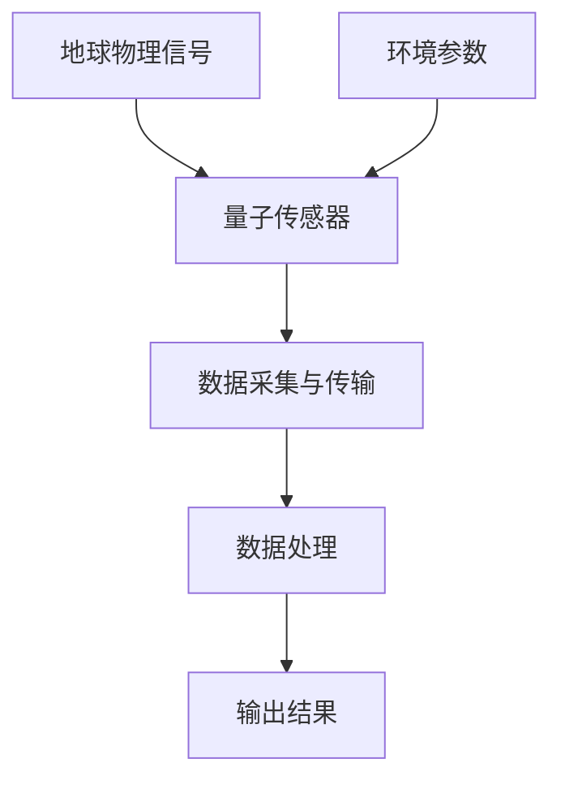

# 如何评估企业的量子传感器大地测量应用

> 关键词：量子传感器、大地测量、企业评估、应用效果、技术指标

> 摘要：本文聚焦于企业量子传感器在大地测量应用方面的评估问题。首先介绍了量子传感器大地测量应用评估的背景信息，包括目的、预期读者、文档结构和相关术语。接着阐述了量子传感器与大地测量的核心概念及联系，详细说明了核心算法原理与具体操作步骤，通过数学模型和公式进行理论支撑并举例说明。然后结合项目实战，给出代码实际案例及详细解释。还探讨了量子传感器大地测量的实际应用场景，推荐了相关的学习资源、开发工具框架和论文著作。最后总结了未来发展趋势与挑战，提供了常见问题解答和扩展阅读参考资料，旨在为企业评估量子传感器在大地测量中的应用提供全面、系统的指导。

## 1. 背景介绍 
### 1.1 目的和范围
随着量子技术的飞速发展，量子传感器在大地测量领域的应用逐渐成为研究和实践的热点。企业在考虑引入量子传感器进行大地测量时，需要对其应用效果进行全面、科学的评估。本评估的目的在于为企业提供一套系统的方法和标准，以判断量子传感器在大地测量中的适用性、有效性和经济性，帮助企业做出合理的决策。评估范围涵盖量子传感器的技术性能、测量精度、数据处理能力、成本效益、应用场景适应性等多个方面。

### 1.2 预期读者
本文主要面向企业的技术决策者、项目经理、大地测量工程师以及对量子传感器在大地测量应用感兴趣的研究人员。这些读者希望了解如何评估量子传感器在企业大地测量项目中的应用价值，以便在实际工作中做出正确的选择。

### 1.3 文档结构概述
本文将按照以下结构进行阐述：首先介绍量子传感器和大地测量的核心概念及它们之间的联系，为后续评估提供理论基础；接着详细讲解核心算法原理和具体操作步骤，通过 Python 代码示例进行说明；然后给出相关的数学模型和公式，并结合实例进行讲解；之后通过项目实战展示代码实现和详细解读；再探讨量子传感器大地测量的实际应用场景；推荐相关的学习资源、开发工具框架和论文著作；最后总结未来发展趋势与挑战，提供常见问题解答和扩展阅读参考资料。

### 1.4 术语表
#### 1.4.1 核心术语定义
- **量子传感器**：基于量子力学原理设计的传感器，利用量子系统的特性（如量子纠缠、量子隧穿等）来实现对物理量的高精度测量。
- **大地测量**：测定和描绘地球表面及其外部重力场的形状、大小和变化的学科，包括几何大地测量、物理大地测量和空间大地测量等分支。
- **测量精度**：测量结果与真实值之间的接近程度，通常用误差来表示。
- **数据处理能力**：指传感器获取数据后，对数据进行分析、处理和解释的能力。

#### 1.4.2 相关概念解释
- **量子纠缠**：是一种量子力学现象，处于纠缠态的两个或多个量子系统之间存在一种特殊的关联，无论它们之间的距离有多远，一个系统的状态变化会立即影响到另一个系统的状态。
- **量子隧穿**：是指微观粒子有一定的概率穿过高于其自身能量的势垒的现象，这在量子传感器中可用于实现对微弱信号的探测。

#### 1.4.3 缩略词列表
- **GPS**：Global Positioning System，全球定位系统
- **INS**：Inertial Navigation System，惯性导航系统
- **MEMS**：Micro-Electro-Mechanical Systems，微机电系统

## 2. 核心概念与联系 

### 核心概念原理
#### 量子传感器原理
量子传感器利用量子系统的独特性质来实现高精度测量。例如，基于原子干涉的量子加速度计，其原理是利用激光将原子冷却到接近绝对零度，形成超冷原子云。然后通过激光脉冲操纵原子，使原子处于不同的量子态并发生干涉。当受到加速度作用时，原子的干涉图样会发生变化，通过检测干涉图样的变化可以精确测量加速度。

#### 大地测量原理
大地测量的主要任务是确定地球的形状、大小和重力场分布。几何大地测量通过测量地面点之间的角度、距离和高差等几何元素，建立地球的几何模型；物理大地测量则通过测量地球的重力场，研究地球的内部结构和质量分布；空间大地测量利用卫星技术（如 GPS）来获取全球范围内的高精度位置信息。

### 架构的文本示意图
```plaintext
量子传感器大地测量应用架构

输入层：
    - 地球物理信号（重力、加速度、磁场等）
    - 环境参数（温度、湿度、气压等）

量子传感器层：
    - 量子加速度计
    - 量子重力仪
    - 量子磁力仪

数据采集与传输层：
    - 数据采集卡
    - 无线传输模块

数据处理层：
    - 滤波算法
    - 校准算法
    - 定位解算算法

输出层：
    - 大地测量结果（位置、高程、重力异常等）
    - 数据报告和可视化
```

### Mermaid 流程图


## 3. 核心算法原理 & 具体操作步骤 

### 核心算法原理
#### 滤波算法
在量子传感器大地测量中，滤波算法用于去除测量数据中的噪声，提高数据的质量。常用的滤波算法有卡尔曼滤波和小波滤波。

卡尔曼滤波是一种最优递归滤波器，它通过预测和更新两个步骤来估计系统的状态。假设系统的状态方程和观测方程分别为：
$$
\begin{cases}
x_{k} = A_{k}x_{k - 1}+B_{k}u_{k}+w_{k}\\
z_{k} = H_{k}x_{k}+v_{k}
\end{cases}
$$
其中，$x_{k}$ 是系统在时刻 $k$ 的状态向量，$A_{k}$ 是状态转移矩阵，$B_{k}$ 是控制输入矩阵，$u_{k}$ 是控制输入向量，$w_{k}$ 是过程噪声，$z_{k}$ 是观测向量，$H_{k}$ 是观测矩阵，$v_{k}$ 是观测噪声。

卡尔曼滤波的预测步骤为：
$$
\begin{cases}
\hat{x}_{k|k - 1}=A_{k}\hat{x}_{k - 1|k - 1}+B_{k}u_{k}\\
P_{k|k - 1}=A_{k}P_{k - 1|k - 1}A_{k}^{T}+Q_{k}
\end{cases}
$$
更新步骤为：
$$
\begin{cases}
K_{k}=P_{k|k - 1}H_{k}^{T}(H_{k}P_{k|k - 1}H_{k}^{T}+R_{k})^{- 1}\\
\hat{x}_{k|k}=\hat{x}_{k|k - 1}+K_{k}(z_{k}-H_{k}\hat{x}_{k|k - 1})\\
P_{k|k}=(I - K_{k}H_{k})P_{k|k - 1}
\end{cases}
$$
其中，$\hat{x}_{k|k - 1}$ 是预测状态，$P_{k|k - 1}$ 是预测误差协方差矩阵，$K_{k}$ 是卡尔曼增益，$\hat{x}_{k|k}$ 是更新后的状态，$P_{k|k}$ 是更新后的误差协方差矩阵，$Q_{k}$ 是过程噪声协方差矩阵，$R_{k}$ 是观测噪声协方差矩阵。

#### 校准算法
校准算法用于消除量子传感器的系统误差。例如，对于量子加速度计，由于制造工艺和环境因素的影响，可能存在零偏误差和标度因数误差。校准算法通过对已知加速度的测量和分析，估计出这些误差并进行补偿。

### 具体操作步骤
#### 数据采集
使用量子传感器采集地球物理信号和环境参数数据，并通过数据采集卡将数据转换为数字信号。

#### 数据预处理
对采集到的数据进行初步处理，包括去除异常值、归一化等操作。

#### 滤波处理
使用卡尔曼滤波或其他滤波算法对预处理后的数据进行滤波，去除噪声。

#### 校准处理
根据校准算法对滤波后的数据进行校准，消除系统误差。

#### 定位解算
结合 GPS 等其他定位信息，使用定位解算算法计算测量点的位置和高程。

### Python 代码示例
```python
import numpy as np

# 卡尔曼滤波实现
def kalman_filter(z, A, H, Q, R, x0, P0):
    n = len(z)
    x_hat = np.zeros((n, len(x0)))
    P = np.zeros((n, len(x0), len(x0)))
    x_hat[0] = x0
    P[0] = P0

    for k in range(1, n):
        # 预测步骤
        x_hat_minus = A @ x_hat[k - 1]
        P_minus = A @ P[k - 1] @ A.T + Q

        # 更新步骤
        K = P_minus @ H.T @ np.linalg.inv(H @ P_minus @ H.T + R)
        x_hat[k] = x_hat_minus + K @ (z[k] - H @ x_hat_minus)
        P[k] = (np.eye(len(x0)) - K @ H) @ P_minus

    return x_hat

# 示例参数
A = np.array([[1]])
H = np.array([[1]])
Q = np.array([[0.1]])
R = np.array([[1]])
x0 = np.array([0])
P0 = np.array([[1]])

# 示例数据
z = np.random.normal(0, 1, 100)

# 运行卡尔曼滤波
x_hat = kalman_filter(z, A, H, Q, R, x0, P0)

print("滤波后结果:", x_hat)
```

## 4. 数学模型和公式 & 详细讲解 & 举例说明 

### 测量精度模型
测量精度通常用误差来表示，误差可以分为随机误差和系统误差。随机误差服从一定的概率分布，如正态分布。设测量值为 $x$，真实值为 $x_{0}$，则测量误差 $\Delta x=x - x_{0}$。

对于多次测量，测量精度可以用标准差 $\sigma$ 来衡量。假设进行了 $n$ 次独立测量，测量值为 $x_{1},x_{2},\cdots,x_{n}$，则样本均值为：
$$
\bar{x}=\frac{1}{n}\sum_{i = 1}^{n}x_{i}
$$
样本标准差为：
$$
s=\sqrt{\frac{1}{n - 1}\sum_{i = 1}^{n}(x_{i}-\bar{x})^{2}}
$$

### 定位解算模型
在大地测量中，常用的定位解算方法是基于 GPS 的定位。假设已知 $m$ 颗 GPS 卫星的位置 $(x_{j},y_{j},z_{j})$ 和到测量点的距离 $d_{j}(j = 1,2,\cdots,m)$，测量点的位置为 $(x,y,z)$，则可以列出以下方程组：
$$
\begin{cases}
d_{1}=\sqrt{(x - x_{1})^{2}+(y - y_{1})^{2}+(z - z_{1})^{2}}+c\Delta t\\
d_{2}=\sqrt{(x - x_{2})^{2}+(y - y_{2})^{2}+(z - z_{2})^{2}}+c\Delta t\\
\cdots\\
d_{m}=\sqrt{(x - x_{m})^{2}+(y - y_{m})^{2}+(z - z_{m})^{2}}+c\Delta t
\end{cases}
$$
其中，$c$ 是光速，$\Delta t$ 是测量点时钟与 GPS 卫星时钟的时间差。

通过非线性最小二乘法可以求解上述方程组，得到测量点的位置 $(x,y,z)$。

### 举例说明
假设有 4 颗 GPS 卫星，其位置分别为 $(x_{1},y_{1},z_{1})=(1000,2000,3000)$，$(x_{2},y_{2},z_{2})=(2000,3000,4000)$，$(x_{3},y_{3},z_{3})=(3000,4000,5000)$，$(x_{4},y_{4},z_{4})=(4000,5000,6000)$，到测量点的距离分别为 $d_{1}=100$，$d_{2}=200$，$d_{3}=300$，$d_{4}=400$，光速 $c = 3\times10^{8}m/s$。

将上述数据代入定位解算方程组，使用 Python 代码求解：
```python
import numpy as np
from scipy.optimize import least_squares

# 卫星位置
sat_positions = np.array([[1000, 2000, 3000],
                          [2000, 3000, 4000],
                          [3000, 4000, 5000],
                          [4000, 5000, 6000]])

# 距离测量值
distances = np.array([100, 200, 300, 400])

# 光速
c = 3e8

# 定义误差函数
def residual(params, sat_positions, distances):
    x, y, z, dt = params
    residuals = []
    for i in range(len(sat_positions)):
        dx = x - sat_positions[i][0]
        dy = y - sat_positions[i][1]
        dz = z - sat_positions[i][2]
        d_calc = np.sqrt(dx**2 + dy**2 + dz**2) + c * dt
        residuals.append(d_calc - distances[i])
    return residuals

# 初始猜测值
initial_guess = [0, 0, 0, 0]

# 求解非线性最小二乘问题
result = least_squares(residual, initial_guess, args=(sat_positions, distances))

# 输出结果
x, y, z, dt = result.x
print("测量点位置 (x, y, z):", (x, y, z))
print("时钟偏差 dt:", dt)
```

## 5. 项目实战：代码实际案例和详细解释说明 

### 5.1  开发环境搭建
#### 硬件环境
- 量子传感器：选择适合大地测量的量子加速度计、量子重力仪等。
- 数据采集卡：用于采集量子传感器输出的模拟信号，并转换为数字信号。
- 计算机：用于运行数据处理和分析软件，建议配置较高的 CPU 和内存。

#### 软件环境
- 操作系统：推荐使用 Linux 或 Windows 操作系统。
- 编程语言：Python，因为 Python 具有丰富的科学计算库和数据处理工具。
- 开发工具：可以使用 PyCharm、Jupyter Notebook 等开发工具。

### 5.2  源代码详细实现和代码解读
以下是一个完整的量子传感器大地测量数据处理代码示例：
```python
import numpy as np
import matplotlib.pyplot as plt
from scipy.signal import butter, filtfilt

# 生成模拟数据
def generate_data(n):
    t = np.linspace(0, 10, n)
    signal = np.sin(2 * np.pi * 1 * t) + 0.5 * np.sin(2 * np.pi * 5 * t)
    noise = np.random.normal(0, 0.1, n)
    data = signal + noise
    return t, data

# 低通滤波器设计
def butter_lowpass(cutoff, fs, order=5):
    nyquist = 0.5 * fs
    normal_cutoff = cutoff / nyquist
    b, a = butter(order, normal_cutoff, btype='low', analog=False)
    return b, a

# 应用低通滤波器
def butter_lowpass_filter(data, cutoff, fs, order=5):
    b, a = butter_lowpass(cutoff, fs, order=order)
    y = filtfilt(b, a, data)
    return y

# 主程序
if __name__ == "__main__":
    # 生成模拟数据
    n = 1000
    t, data = generate_data(n)
    fs = n / (t[-1] - t[0])

    # 滤波参数
    cutoff = 2  # 截止频率
    order = 5   # 滤波器阶数

    # 应用低通滤波器
    filtered_data = butter_lowpass_filter(data, cutoff, fs, order)

    # 绘制原始数据和滤波后数据
    plt.figure(figsize=(10, 6))
    plt.plot(t, data, label='Original Data')
    plt.plot(t, filtered_data, label='Filtered Data')
    plt.xlabel('Time (s)')
    plt.ylabel('Amplitude')
    plt.title('Quantum Sensor Data Filtering')
    plt.legend()
    plt.show()
```

### 代码解读与分析
#### 生成模拟数据
`generate_data` 函数用于生成模拟的量子传感器测量数据，包括一个包含两个正弦波的信号和高斯噪声。

#### 低通滤波器设计
`butter_lowpass` 函数使用 `scipy.signal.butter` 函数设计一个低通滤波器，根据给定的截止频率和滤波器阶数计算滤波器的系数。

#### 应用低通滤波器
`butter_lowpass_filter` 函数使用 `scipy.signal.filtfilt` 函数将设计好的低通滤波器应用到数据上，实现零相位滤波。

#### 主程序
在主程序中，首先生成模拟数据，然后设置滤波参数，调用滤波函数对数据进行滤波，最后使用 `matplotlib` 库绘制原始数据和滤波后的数据，直观地展示滤波效果。

## 6. 实际应用场景 
### 地质勘探
量子传感器可以用于测量地球的重力场和磁场变化，帮助地质学家探测地下的地质结构和矿产资源。例如，通过高精度的量子重力仪测量重力异常，可以推断地下是否存在石油、天然气等矿产资源。

### 地震监测
量子加速度计可以实时监测地面的微小振动，用于地震预警和地震研究。相比传统的地震监测设备，量子加速度计具有更高的灵敏度和精度，能够更早地检测到地震信号。

### 海洋测量
在海洋测量中，量子传感器可以用于测量海洋的重力场、磁场和海洋深度等参数。通过这些参数的测量，可以绘制高精度的海底地形图，为海洋资源开发和海洋环境保护提供重要数据支持。

### 工程测量
在大型工程建设中，如桥梁、隧道、高楼大厦等，量子传感器可以用于监测工程结构的变形和位移。通过实时监测，可以及时发现工程结构的安全隐患，确保工程的安全运行。

## 7. 工具和资源推荐
### 7.1 学习资源推荐
#### 7.1.1 书籍推荐
- 《量子力学导论》：这本书系统地介绍了量子力学的基本原理和概念，是学习量子传感器的理论基础。
- 《大地测量学基础》：全面阐述了大地测量的基本理论和方法，对于理解量子传感器在大地测量中的应用有很大帮助。
- 《Python 科学计算》：详细介绍了 Python 在科学计算领域的应用，包括数据处理、数值计算、绘图等方面的内容，是学习 Python 编程进行量子传感器数据处理的实用书籍。

#### 7.1.2 在线课程
- Coursera 上的“量子物理基础”课程：由知名大学的教授授课，深入讲解量子物理的基本概念和原理。
- edX 上的“大地测量与地球动力学”课程：提供了大地测量领域的前沿知识和最新研究成果。
- 中国大学 MOOC 上的“Python 语言程序设计”课程：适合初学者快速掌握 Python 编程基础。

#### 7.1.3 技术博客和网站
- arXiv.org：一个预印本服务器，提供了大量关于量子技术和大地测量的最新研究论文。
- IEEE Xplore：电气和电子工程师协会的数字图书馆，包含了众多与传感器技术和测量技术相关的学术论文和会议记录。
- 博客园、CSDN 等技术博客平台：有很多开发者分享的关于量子传感器和大地测量的实践经验和技术文章。

### 7.2 开发工具框架推荐
#### 7.2.1 IDE和编辑器
- PyCharm：一款专业的 Python 集成开发环境，具有代码自动补全、调试、版本控制等强大功能，适合开发大型 Python 项目。
- Jupyter Notebook：一个交互式的编程环境，支持代码、文本、图像等多种元素的混合展示，非常适合进行数据探索和分析。
- Visual Studio Code：一款轻量级的代码编辑器，支持多种编程语言，通过安装 Python 扩展可以实现 Python 代码的开发和调试。

#### 7.2.2 调试和性能分析工具
- pdb：Python 自带的调试器，可以帮助开发者逐行调试代码，查找代码中的错误。
- cProfile：Python 的性能分析工具，可以统计代码中各个函数的执行时间和调用次数，帮助开发者优化代码性能。
- Py-Spy：一个非侵入式的 Python 性能分析工具，可以在不修改代码的情况下对 Python 程序进行性能分析。

#### 7.2.3 相关框架和库
- NumPy：一个用于科学计算的 Python 库，提供了高效的多维数组对象和各种数学函数，是进行量子传感器数据处理的基础库。
- SciPy：基于 NumPy 的科学计算库，提供了优化、积分、插值、信号处理等多种功能，可用于实现滤波算法和校准算法。
- Matplotlib：一个用于绘制二维图形的 Python 库，可以将量子传感器测量数据可视化，方便分析和展示。

### 7.3 相关论文著作推荐
#### 7.3.1 经典论文
- “Quantum Sensors”：该论文全面介绍了量子传感器的原理、分类和应用，是量子传感器领域的经典文献。
- “A Review of Geodetic Techniques for Monitoring Crustal Deformation”：综述了大地测量技术在监测地壳变形方面的应用，对于了解量子传感器在大地测量中的应用场景有重要参考价值。

#### 7.3.2 最新研究成果
- 关注 arXiv.org 上关于量子传感器和大地测量的最新预印本论文，了解该领域的前沿研究动态。
- 查阅《Nature》《Science》《IEEE Transactions on Instrumentation and Measurement》等顶级学术期刊上发表的相关研究论文。

#### 7.3.3 应用案例分析
- 一些企业和研究机构会发布量子传感器在大地测量中的应用案例报告，可以通过相关企业官网、学术会议论文集等渠道获取这些案例，学习实际应用中的经验和方法。

## 8. 总结：未来发展趋势与挑战
### 未来发展趋势
#### 更高的精度和灵敏度
随着量子技术的不断发展，量子传感器的精度和灵敏度将不断提高，能够检测到更微弱的地球物理信号，为大地测量提供更准确的数据。

#### 小型化和集成化
量子传感器将朝着小型化和集成化的方向发展，便于携带和安装，降低使用成本，扩大应用范围。

#### 多传感器融合
将量子传感器与其他类型的传感器（如 GPS、INS 等）进行融合，充分发挥各自的优势，提高大地测量的精度和可靠性。

#### 智能化和自动化
利用人工智能和机器学习技术，实现量子传感器大地测量数据的智能化处理和分析，提高数据处理效率和决策的准确性。

### 挑战
#### 技术成本高
目前量子传感器的研发和制造成本较高，限制了其大规模应用。需要进一步降低成本，提高性价比。

#### 环境适应性
量子传感器对环境条件较为敏感，如温度、湿度、磁场等因素都会影响其测量精度。需要提高量子传感器的环境适应性，确保在复杂环境下的稳定运行。

#### 数据处理难度大
量子传感器产生的大量高精度数据需要高效的数据处理和分析方法。目前的数据处理算法还存在一定的局限性，需要进一步研究和改进。

#### 标准和规范不完善
量子传感器在大地测量中的应用还缺乏统一的标准和规范，导致不同厂家的产品之间兼容性差，影响了其推广和应用。需要尽快建立相关的标准和规范。

## 9. 附录：常见问题与解答
### 问题 1：量子传感器与传统传感器相比有哪些优势？
解答：量子传感器基于量子力学原理，具有更高的精度和灵敏度，能够检测到更微弱的信号。同时，量子传感器的测量结果更稳定，受外界干扰的影响较小。

### 问题 2：量子传感器在大地测量中的应用前景如何？
解答：量子传感器在大地测量中具有广阔的应用前景。随着技术的不断发展，量子传感器将能够提供更准确的测量数据，为地质勘探、地震监测、海洋测量等领域带来新的突破。

### 问题 3：如何选择适合企业的量子传感器？
解答：选择适合企业的量子传感器需要考虑多个因素，如测量精度要求、应用场景、成本预算等。建议企业与专业的量子传感器供应商沟通，根据自身需求进行选型。

### 问题 4：量子传感器的数据处理复杂吗？
解答：量子传感器产生的高精度数据需要一定的处理和分析，但随着数据处理技术的不断发展，现在已经有很多成熟的算法和工具可以用于量子传感器数据处理。企业可以通过学习和使用这些工具来降低数据处理的难度。

## 10. 扩展阅读 & 参考资料
### 扩展阅读
- 《量子技术与未来》：进一步了解量子技术的发展趋势和应用前景。
- 《大地测量学前沿》：关注大地测量领域的最新研究成果和发展动态。

### 参考资料
- 相关学术论文和研究报告，如在 IEEE、ACM 等学术数据库中检索到的关于量子传感器和大地测量的文献。
- 量子传感器制造商的产品说明书和技术文档，了解不同型号量子传感器的性能和特点。

作者：AI天才研究院/AI Genius Institute & 禅与计算机程序设计艺术 /Zen And The Art of Computer Programming