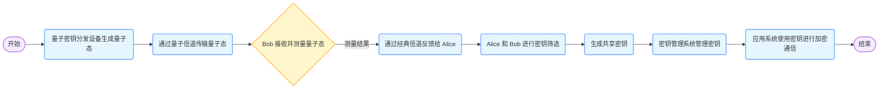

# 如何评估企业的量子密码通信网络

> 关键词：量子密码通信网络、企业评估、安全性、性能指标、应用场景

> 摘要：本文旨在探讨如何对企业的量子密码通信网络进行全面评估。详细介绍了量子密码通信网络的背景知识，包括其目的、适用读者、文档结构和相关术语。深入剖析了核心概念与联系，阐述了核心算法原理并给出 Python 源代码示例，讲解了相关数学模型和公式。通过项目实战展示代码实现及解读，分析了实际应用场景。同时推荐了学习资源、开发工具框架和相关论文著作。最后总结了未来发展趋势与挑战，解答了常见问题，并提供了扩展阅读和参考资料，为企业评估量子密码通信网络提供了系统而全面的指导。

## 1. 背景介绍 
### 1.1 目的和范围
随着信息技术的飞速发展，企业对通信安全的要求越来越高。量子密码通信网络作为一种新兴的安全通信技术，为企业提供了更高等级的安全保障。本文章的目的在于为企业提供一套全面的评估方法，帮助企业了解自身量子密码通信网络的性能、安全性和适用性。评估范围涵盖量子密码通信网络的各个方面，包括硬件设备、软件系统、通信协议、安全机制等。

### 1.2 预期读者
本文主要面向企业的 IT 管理人员、网络安全专家、技术决策者以及对量子密码通信网络感兴趣的研究人员。这些读者希望了解如何评估企业的量子密码通信网络，以便做出合理的决策，如是否采用量子密码通信技术、如何优化现有网络等。

### 1.3 文档结构概述
本文将按照以下结构进行阐述：首先介绍量子密码通信网络的核心概念与联系，包括原理和架构；接着讲解核心算法原理和具体操作步骤，并给出 Python 源代码示例；然后介绍相关的数学模型和公式，并举例说明；通过项目实战展示代码实现和详细解释；分析量子密码通信网络的实际应用场景；推荐学习资源、开发工具框架和相关论文著作；总结未来发展趋势与挑战；解答常见问题；最后提供扩展阅读和参考资料。

### 1.4 术语表
#### 1.4.1 核心术语定义
- **量子密码通信**：利用量子力学原理实现信息的安全传输，主要基于量子态的特性，如量子不可克隆定理、量子纠缠等，保证通信的安全性。
- **量子密钥分发（QKD）**：量子密码通信的核心技术之一，通过量子态的传输在通信双方之间生成和分发共享的密钥，该密钥具有无条件安全性。
- **纠缠光子对**：处于纠缠态的一对光子，它们的量子态相互关联，对其中一个光子的测量会瞬间影响另一个光子的状态，无论它们之间的距离有多远。
- **量子比特（qubit）**：量子信息的基本单位，与经典比特不同，量子比特可以同时处于 0 和 1 的叠加态。

#### 1.4.2 相关概念解释
- **量子不可克隆定理**：量子态不能被精确地复制。这一特性保证了量子密钥分发过程中密钥的安全性，因为任何试图窃取密钥的行为都会被检测到。
- **量子纠缠**：是一种量子力学现象，处于纠缠态的多个粒子之间存在一种非定域的关联。在量子密码通信中，纠缠光子对常被用于实现量子密钥分发。
- **无条件安全性**：指量子密码通信的安全性基于量子力学的基本原理，不依赖于计算复杂度，因此在理论上具有绝对的安全性。

#### 1.4.3 缩略词列表
- **QKD**：Quantum Key Distribution（量子密钥分发）
- **BB84**：Bennett - Brassard 1984 协议，是最早提出的量子密钥分发协议之一。
- **E91**：Ekert 1991 协议，基于量子纠缠的量子密钥分发协议。

## 2. 核心概念与联系 

### 核心概念原理
量子密码通信网络的核心原理是基于量子力学的基本特性，如量子不可克隆定理和量子纠缠。量子不可克隆定理保证了在量子密钥分发过程中，任何试图窃取密钥的行为都会改变量子态，从而被通信双方检测到。量子纠缠则提供了一种超距的关联，使得通信双方可以利用纠缠光子对来生成和分发密钥。

以量子密钥分发（QKD）为例，其基本过程如下：发送方（Alice）通过量子信道向接收方（Bob）发送一系列量子态，这些量子态可以是光子的偏振态或相位态等。Bob 对接收到的量子态进行测量，并将测量结果反馈给 Alice。Alice 和 Bob 通过经典信道进行信息比对和筛选，最终生成共享的密钥。

### 架构的文本示意图
一个典型的企业量子密码通信网络架构包括以下几个部分：
- **量子密钥分发设备**：负责生成和分发量子密钥，通常包括量子光源、探测器等硬件设备。
- **量子信道**：用于传输量子态，如光纤、自由空间等。
- **经典信道**：用于传输经典信息，如测量结果、密钥筛选信息等。
- **密钥管理系统**：负责对生成的密钥进行管理，包括密钥的存储、分发、更新等。
- **应用系统**：使用量子密钥进行加密通信的企业应用，如电子邮件、文件传输等。

### Mermaid 流程图


## 3. 核心算法原理 & 具体操作步骤 

### 核心算法原理 - BB84 协议
BB84 协议是最早提出的量子密钥分发协议之一，其基本原理基于量子态的不确定性和不可克隆定理。协议使用两种不同的量子态编码方式，如偏振态的水平 - 垂直（HV）基和对角（±45°）基。

具体步骤如下：
1. **发送方（Alice）准备量子态**：Alice 随机选择一种编码基（HV 基或对角基），并随机生成一个比特序列（0 或 1）。根据选择的基和比特值，她制备相应的量子态，如在 HV 基下，0 对应水平偏振态，1 对应垂直偏振态；在对角基下，0 对应 +45°偏振态，1 对应 -45°偏振态。
2. **发送量子态**：Alice 通过量子信道将制备好的量子态发送给接收方（Bob）。
3. **接收方（Bob）测量量子态**：Bob 随机选择一种测量基（HV 基或对角基）对接收到的量子态进行测量。根据量子力学原理，只有当 Bob 选择的测量基与 Alice 制备量子态时使用的基相同时，测量结果才是确定的，否则测量结果是随机的。
4. **经典通信**：Bob 通过经典信道告诉 Alice 他使用的测量基序列。Alice 则告诉 Bob 哪些基是正确的（即与她制备量子态时使用的基相同）。
5. **密钥筛选**：Alice 和 Bob 只保留那些使用相同基进行测量的比特值，这些比特值构成了他们的共享密钥。

### Python 源代码实现
```python
import random

# 定义量子态编码
HV_BASIS = {0: 'H', 1: 'V'}
DIAGONAL_BASIS = {0: '+', 1: '-'}

# 生成随机比特序列
def generate_random_bits(length):
    return [random.randint(0, 1) for _ in range(length)]

# 生成随机基序列
def generate_random_bases(length):
    return [random.choice(['HV', 'D']) for _ in range(length)]

# 制备量子态
def prepare_quantum_states(bits, bases):
    states = []
    for bit, base in zip(bits, bases):
        if base == 'HV':
            states.append(HV_BASIS[bit])
        else:
            states.append(DIAGONAL_BASIS[bit])
    return states

# 测量量子态
def measure_quantum_states(states, bases):
    results = []
    for state, base in zip(states, bases):
        if base == 'HV':
            if state in ['H', 'V']:
                if state == 'H':
                    results.append(0)
                else:
                    results.append(1)
            else:
                # 基不匹配，随机测量结果
                results.append(random.randint(0, 1))
        else:
            if state in ['+', '-']:
                if state == '+':
                    results.append(0)
                else:
                    results.append(1)
            else:
                # 基不匹配，随机测量结果
                results.append(random.randint(0, 1))
    return results

# 密钥筛选
def sift_keys(alice_bases, bob_bases, alice_bits, bob_bits):
    sifted_alice_key = []
    sifted_bob_key = []
    for i in range(len(alice_bases)):
        if alice_bases[i] == bob_bases[i]:
            sifted_alice_key.append(alice_bits[i])
            sifted_bob_key.append(bob_bits[i])
    return sifted_alice_key, sifted_bob_key

# 主函数
def main():
    length = 100
    # Alice 生成随机比特和基
    alice_bits = generate_random_bits(length)
    alice_bases = generate_random_bases(length)
    # 制备量子态
    quantum_states = prepare_quantum_states(alice_bits, alice_bases)
    # Bob 生成随机基
    bob_bases = generate_random_bases(length)
    # Bob 测量量子态
    bob_bits = measure_quantum_states(quantum_states, bob_bases)
    # 密钥筛选
    sifted_alice_key, sifted_bob_key = sift_keys(alice_bases, bob_bases, alice_bits, bob_bits)
    print("Alice's sifted key:", sifted_alice_key)
    print("Bob's sifted key:", sifted_bob_key)

if __name__ == "__main__":
    main()
```

### 代码解释
- `generate_random_bits` 函数用于生成指定长度的随机比特序列。
- `generate_random_bases` 函数用于生成指定长度的随机基序列，基可以是 HV 基或对角基。
- `prepare_quantum_states` 函数根据比特序列和基序列制备相应的量子态。
- `measure_quantum_states` 函数根据接收到的量子态和测量基进行测量，当基不匹配时，测量结果是随机的。
- `sift_keys` 函数用于筛选出使用相同基进行测量的比特值，构成共享密钥。
- `main` 函数是程序的入口，调用上述函数完成整个 BB84 协议的模拟过程。

## 4. 数学模型和公式 & 详细讲解 & 举例说明 

### 量子态的表示
在量子力学中，量子态可以用态矢量来表示。对于一个量子比特，其态矢量可以表示为：
$$|\psi\rangle = \alpha|0\rangle + \beta|1\rangle$$
其中，$\alpha$ 和 $\beta$ 是复数，满足 $|\alpha|^2 + |\beta|^2 = 1$。$|0\rangle$ 和 $|1\rangle$ 是量子比特的两个基态。

例如，在 BB84 协议中，水平偏振态可以表示为 $|H\rangle = |0\rangle$，垂直偏振态可以表示为 $|V\rangle = |1\rangle$，+45°偏振态可以表示为 $|+\rangle = \frac{1}{\sqrt{2}}(|0\rangle + |1\rangle)$，-45°偏振态可以表示为 $|-\rangle = \frac{1}{\sqrt{2}}(|0\rangle - |1\rangle)$。

### 测量概率
当对一个量子态 $|\psi\rangle = \alpha|0\rangle + \beta|1\rangle$ 进行测量时，得到结果 0 的概率为 $P(0) = |\alpha|^2$，得到结果 1 的概率为 $P(1) = |\beta|^2$。

例如，对于 +45°偏振态 $|+\rangle = \frac{1}{\sqrt{2}}(|0\rangle + |1\rangle)$，如果在 HV 基下进行测量，得到水平偏振态（0）的概率为 $P(0) = |\frac{1}{\sqrt{2}}|^2 = \frac{1}{2}$，得到垂直偏振态（1）的概率也为 $P(1) = |\frac{1}{\sqrt{2}}|^2 = \frac{1}{2}$。

### 密钥生成率
密钥生成率是评估量子密钥分发系统性能的一个重要指标。在理想情况下，BB84 协议的密钥生成率可以表示为：
$$R = \frac{\eta}{2} \cdot Q \cdot \log_2(1 + \frac{1 - 2E}{1 + 2E})$$
其中，$\eta$ 是量子信道的传输效率，$Q$ 是单光子的探测效率，$E$ 是量子比特误码率（QBER）。

例如，假设量子信道的传输效率 $\eta = 0.5$，单光子的探测效率 $Q = 0.8$，量子比特误码率 $E = 0.05$，则密钥生成率为：
$$R = \frac{0.5}{2} \cdot 0.8 \cdot \log_2(1 + \frac{1 - 2 \times 0.05}{1 + 2 \times 0.05}) \approx 0.1 \text{ bits/qubit}$$

## 5. 项目实战：代码实际案例和详细解释说明 

### 5.1  开发环境搭建
- **操作系统**：推荐使用 Linux 系统，如 Ubuntu 18.04 或更高版本，也可以使用 Windows 10 或 macOS。
- **Python 版本**：建议使用 Python 3.7 或更高版本。
- **依赖库**：本项目主要使用 Python 的内置库，无需额外安装其他库。

### 5.2  源代码详细实现和代码解读
以下是上述 BB84 协议模拟代码的详细解读：
```python
import random

# 定义量子态编码
HV_BASIS = {0: 'H', 1: 'V'}
DIAGONAL_BASIS = {0: '+', 1: '-'}

# 生成随机比特序列
def generate_random_bits(length):
    return [random.randint(0, 1) for _ in range(length)]

# 生成随机基序列
def generate_random_bases(length):
    return [random.choice(['HV', 'D']) for _ in range(length)]

# 制备量子态
def prepare_quantum_states(bits, bases):
    states = []
    for bit, base in zip(bits, bases):
        if base == 'HV':
            states.append(HV_BASIS[bit])
        else:
            states.append(DIAGONAL_BASIS[bit])
    return states

# 测量量子态
def measure_quantum_states(states, bases):
    results = []
    for state, base in zip(states, bases):
        if base == 'HV':
            if state in ['H', 'V']:
                if state == 'H':
                    results.append(0)
                else:
                    results.append(1)
            else:
                # 基不匹配，随机测量结果
                results.append(random.randint(0, 1))
        else:
            if state in ['+', '-']:
                if state == '+':
                    results.append(0)
                else:
                    results.append(1)
            else:
                # 基不匹配，随机测量结果
                results.append(random.randint(0, 1))
    return results

# 密钥筛选
def sift_keys(alice_bases, bob_bases, alice_bits, bob_bits):
    sifted_alice_key = []
    sifted_bob_key = []
    for i in range(len(alice_bases)):
        if alice_bases[i] == bob_bases[i]:
            sifted_alice_key.append(alice_bits[i])
            sifted_bob_key.append(bob_bits[i])
    return sifted_alice_key, sifted_bob_key

# 主函数
def main():
    length = 100
    # Alice 生成随机比特和基
    alice_bits = generate_random_bits(length)
    alice_bases = generate_random_bases(length)
    # 制备量子态
    quantum_states = prepare_quantum_states(alice_bits, alice_bases)
    # Bob 生成随机基
    bob_bases = generate_random_bases(length)
    # Bob 测量量子态
    bob_bits = measure_quantum_states(quantum_states, bob_bases)
    # 密钥筛选
    sifted_alice_key, sifted_bob_key = sift_keys(alice_bases, bob_bases, alice_bits, bob_bits)
    print("Alice's sifted key:", sifted_alice_key)
    print("Bob's sifted key:", sifted_bob_key)

if __name__ == "__main__":
    main()
```
- **量子态编码**：通过字典 `HV_BASIS` 和 `DIAGONAL_BASIS` 定义了两种编码方式，方便后续制备量子态。
- **随机比特和基生成**：`generate_random_bits` 和 `generate_random_bases` 函数分别用于生成随机比特序列和随机基序列。
- **量子态制备**：`prepare_quantum_states` 函数根据比特序列和基序列制备相应的量子态。
- **量子态测量**：`measure_quantum_states` 函数根据接收到的量子态和测量基进行测量，当基不匹配时，测量结果是随机的。
- **密钥筛选**：`sift_keys` 函数用于筛选出使用相同基进行测量的比特值，构成共享密钥。
- **主函数**：`main` 函数调用上述函数完成整个 BB84 协议的模拟过程，并输出筛选后的密钥。

### 5.3  代码解读与分析
- **随机性的作用**：在 BB84 协议中，随机比特序列和随机基序列的生成是保证协议安全性的关键。由于测量基的选择是随机的，窃听者无法确定正确的测量基，从而无法获取密钥信息。
- **基匹配的重要性**：只有当 Alice 和 Bob 使用相同的基进行测量时，才能得到确定的测量结果，从而生成正确的密钥。因此，在密钥筛选过程中，只保留那些使用相同基进行测量的比特值。
- **误码率的影响**：在实际应用中，由于量子信道的噪声和干扰，可能会导致测量结果出现错误，即量子比特误码率（QBER）。误码率的存在会降低密钥生成率，并且可能会暴露窃听者的存在。因此，需要对误码率进行监测和处理。

## 6. 实际应用场景 
### 金融行业
金融行业对信息安全的要求极高，量子密码通信网络可以为金融机构之间的资金转账、交易信息传输等提供更高等级的安全保障。例如，银行之间的跨境支付、证券交易等场景，使用量子密钥进行加密通信可以有效防止信息泄露和中间人攻击。

### 政府和国防领域
政府和国防部门处理大量的敏感信息，如军事机密、国家安全情报等。量子密码通信网络可以确保这些信息在传输过程中的安全性，防止敌方的窃听和干扰。例如，军队之间的指挥通信、政府部门之间的机密文件传输等。

### 医疗行业
医疗行业涉及患者的个人健康信息和医疗数据，这些信息的安全至关重要。量子密码通信网络可以用于医院之间的病历共享、远程医疗诊断等场景，保护患者的隐私和数据安全。

### 云计算和数据中心
随着云计算和数据中心的发展，大量的数据存储和处理都在云端进行。量子密码通信网络可以为云计算服务提供商和企业客户之间的数据传输和存储提供安全保障，防止数据被窃取或篡改。

## 7. 工具和资源推荐
### 7.1 学习资源推荐
#### 7.1.1 书籍推荐
- 《量子计算与量子信息》（Quantum Computation and Quantum Information）：由 Michael A. Nielsen 和 Isaac L. Chuang 所著，是量子计算和量子信息领域的经典教材，涵盖了量子比特、量子门、量子算法、量子密钥分发等方面的内容。
- 《量子密码学：原理、技术与应用》（Quantum Cryptography: Principles, Techniques, and Applications）：详细介绍了量子密码学的基本原理、各种量子密钥分发协议以及实际应用中的技术问题。

#### 7.1.2 在线课程
- Coursera 上的“量子计算基础”（Fundamentals of Quantum Computing）课程：由专业教授授课，系统介绍了量子计算的基本概念、量子比特、量子门等知识。
- edX 上的“量子密码学”（Quantum Cryptography）课程：深入讲解了量子密码学的原理和应用，包括量子密钥分发协议、量子隐形传态等内容。

#### 7.1.3 技术博客和网站
- Quantum Computing Report：提供量子计算和量子密码学领域的最新技术动态、研究成果和行业资讯。
- Quantum Magazine：专注于量子科学领域的科普和报道，文章深入浅出，适合初学者和专业人士阅读。

### 7.2 开发工具框架推荐
#### 7.2.1 IDE和编辑器
- PyCharm：是一款专业的 Python 集成开发环境，提供代码编辑、调试、版本控制等功能，适合开发量子密码通信相关的 Python 代码。
- Visual Studio Code：是一款轻量级的代码编辑器，支持多种编程语言，具有丰富的插件扩展功能，可以方便地进行代码开发和调试。

#### 7.2.2 调试和性能分析工具
- PDB：Python 内置的调试器，可以帮助开发者逐行调试代码，查找程序中的错误。
- cProfile：Python 标准库中的性能分析工具，可以分析代码的运行时间和函数调用情况，帮助优化代码性能。

#### 7.2.3 相关框架和库
- Qiskit：是 IBM 开发的开源量子计算框架，提供了量子电路设计、模拟和实验的工具，也可以用于量子密码通信协议的模拟和实现。
- ProjectQ：是一个跨平台的量子计算软件框架，支持多种后端设备，包括模拟器和实际的量子处理器，可用于量子密码学的研究和开发。

### 7.3 相关论文著作推荐
#### 7.3.1 经典论文
- “Quantum cryptography: Public key distribution and coin tossing”（Bennett and Brassard, 1984）：这是第一篇提出量子密钥分发协议（BB84 协议）的论文，开创了量子密码学的先河。
- “Quantum cryptography based on Bell's theorem”（Ekert, 1991）：提出了基于量子纠缠的量子密钥分发协议（E91 协议），为量子密码学的发展提供了新的思路。

#### 7.3.2 最新研究成果
- 关注 Nature、Science、Physical Review Letters 等顶级学术期刊，这些期刊经常发表量子密码学领域的最新研究成果。
- 参加国际量子密码学会议，如 Quantum Cryptography Conference（QCRYPT），可以了解到该领域的前沿研究动态。

#### 7.3.3 应用案例分析
- 研究一些实际企业或机构应用量子密码通信网络的案例，分析其实施过程、遇到的问题和解决方案，从中获取经验和启示。可以通过相关的行业报告、技术文档和学术论文来获取这些案例信息。

## 8. 总结：未来发展趋势与挑战
### 未来发展趋势
- **集成化和小型化**：随着技术的不断进步，量子密码通信设备将朝着集成化和小型化的方向发展，降低成本和体积，提高设备的可靠性和易用性，便于企业大规模部署。
- **与现有网络的融合**：量子密码通信网络将与现有的传统通信网络进行深度融合，形成混合网络架构，为企业提供无缝的安全通信解决方案。
- **多用户和多节点网络**：未来的量子密码通信网络将支持多用户和多节点之间的通信，实现更复杂的网络拓扑结构，满足企业多样化的通信需求。
- **量子云计算安全**：随着量子云计算的发展，量子密码通信将为量子云计算提供安全保障，确保云计算环境中数据的保密性和完整性。

### 挑战
- **技术成熟度**：目前量子密码通信技术仍处于发展阶段，一些关键技术如量子光源、探测器等的性能还不够稳定，需要进一步提高技术成熟度。
- **成本问题**：量子密码通信设备的成本较高，限制了其在企业中的大规模应用。需要通过技术创新和产业规模化来降低成本。
- **网络兼容性**：量子密码通信网络与现有传统通信网络的兼容性存在一定问题，需要开发相应的接口和协议，实现两者的无缝对接。
- **人才短缺**：量子密码学是一个新兴领域，相关的专业人才短缺，企业在实施量子密码通信网络时面临人才不足的挑战。

## 9. 附录：常见问题与解答
### 量子密码通信网络真的具有无条件安全性吗？
理论上，量子密码通信网络基于量子力学的基本原理，如量子不可克隆定理和量子纠缠，具有无条件安全性。但在实际应用中，由于量子信道的噪声、设备的不完善等因素，可能会引入一定的安全风险。因此，需要通过严格的安全分析和检测手段来确保网络的安全性。

### 量子密码通信网络的部署难度大吗？
量子密码通信网络的部署相对传统通信网络来说难度较大。需要专业的技术人员进行设备的安装、调试和维护，同时还需要解决量子信道的铺设、与现有网络的集成等问题。但随着技术的发展和经验的积累，部署难度将逐渐降低。

### 量子密码通信网络的成本高吗？
目前，量子密码通信设备的成本相对较高，主要原因是量子技术的复杂性和设备的专业性。但随着技术的进步和产业的发展，成本有望逐渐降低。企业在考虑部署量子密码通信网络时，需要综合评估安全需求和成本效益。

### 量子密码通信网络可以替代传统的加密技术吗？
量子密码通信网络不能完全替代传统的加密技术。虽然量子密码通信具有更高的安全性，但目前其应用范围和技术成熟度还存在一定的局限性。在实际应用中，通常会将量子密码通信与传统加密技术相结合，形成多层次的安全防护体系。

## 10. 扩展阅读 & 参考资料
### 扩展阅读
- 《量子力学导论》（Introduction to Quantum Mechanics）：深入学习量子力学的基础知识，有助于更好地理解量子密码通信的原理。
- 《信息安全技术导论》（Introduction to Information Security Technology）：了解传统信息安全技术的原理和方法，对比量子密码通信的优势和特点。

### 参考资料
- 相关的学术论文和研究报告，如 IEEE Transactions on Information Theory、Journal of Cryptology 等期刊上发表的关于量子密码学的论文。
- 量子密码通信设备厂商的技术文档和产品资料，如 ID Quantique、MagiQ Technologies 等公司的官方网站。

作者：AI天才研究院/AI Genius Institute & 禅与计算机程序设计艺术 /Zen And The Art of Computer Programming