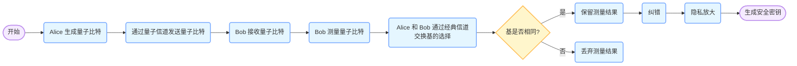

# 如何评估企业的量子密钥分发网络安全性

> 关键词：量子密钥分发网络、安全性评估、企业网络、量子密码学、评估指标

> 摘要：本文聚焦于企业量子密钥分发网络的安全性评估问题。首先介绍了量子密钥分发网络的背景知识，包括其目的、适用读者、文档结构和相关术语。接着阐述了核心概念与联系，分析了核心算法原理和具体操作步骤，并给出了数学模型和公式。通过项目实战展示了代码实现和详细解释，探讨了实际应用场景。还推荐了相关的学习资源、开发工具框架和论文著作。最后总结了未来发展趋势与挑战，解答了常见问题并提供了扩展阅读和参考资料，旨在为企业评估量子密钥分发网络安全性提供全面且深入的指导。

## 1. 背景介绍 
### 1.1 目的和范围
量子密钥分发（Quantum Key Distribution, QKD）网络为企业提供了一种基于量子力学原理的安全密钥分发方式，有望解决传统加密方法在面对量子计算威胁时的安全性问题。本文章的目的在于详细阐述如何评估企业的量子密钥分发网络的安全性，涵盖从理论基础到实际操作的各个方面，包括核心概念、算法原理、数学模型、项目实战以及应用场景等。评估范围包括量子密钥分发网络的各个组件，如量子信道、经典信道、量子密钥分发设备等，以及整个网络的运行环境和管理机制。

### 1.2 预期读者
本文预期读者主要包括企业的信息安全管理人员、网络工程师、量子通信技术研究人员以及对量子密钥分发网络安全性感兴趣的专业人士。这些读者可能具有不同程度的专业知识，因此文章在内容组织上力求深入浅出，既包含基础的概念介绍，也有深入的技术分析，以满足不同读者的需求。

### 1.3 文档结构概述
本文将按照以下结构进行组织：首先介绍量子密钥分发网络安全性评估的背景知识，包括目的、读者和术语等；接着阐述核心概念与联系，通过文本示意图和 Mermaid 流程图进行说明；然后详细讲解核心算法原理和具体操作步骤，结合 Python 源代码进行阐述；之后给出数学模型和公式，并举例说明；通过项目实战展示代码实现和详细解释；探讨实际应用场景；推荐相关的学习资源、开发工具框架和论文著作；最后总结未来发展趋势与挑战，解答常见问题并提供扩展阅读和参考资料。

### 1.4 术语表
#### 1.4.1 核心术语定义
- **量子密钥分发（Quantum Key Distribution, QKD）**：利用量子力学原理实现密钥的安全分发，确保通信双方能够共享一个随机的、安全的密钥。
- **量子比特（Qubit）**：量子信息的基本单位，与经典比特不同，量子比特可以处于 0 和 1 的叠加态。
- **量子信道（Quantum Channel）**：用于传输量子比特的物理通道，如光纤、自由空间等。
- **经典信道（Classical Channel）**：用于传输经典信息的通道，如传统的有线或无线通信线路。
- **密钥生成速率（Key Generation Rate）**：单位时间内量子密钥分发系统能够生成的安全密钥的比特数。
- **误码率（Bit Error Rate, BER）**：在传输过程中出现错误比特的比例。
- **安全性证明（Security Proof）**：从理论上证明量子密钥分发系统在一定条件下能够实现无条件安全的密钥分发。

#### 1.4.2 相关概念解释
- **量子纠缠（Quantum Entanglement）**：是一种量子力学现象，处于纠缠态的两个或多个量子比特之间存在一种特殊的关联，无论它们之间的距离有多远，对其中一个量子比特的测量结果会瞬间影响另一个量子比特的状态。在量子密钥分发中，量子纠缠可以用于实现密钥的安全分发。
- **量子不可克隆定理（Quantum No - Cloning Theorem）**：该定理表明，不可能精确地复制一个未知的量子态。这是量子密钥分发安全性的重要理论基础，因为任何试图窃听量子通信的行为都会不可避免地干扰量子态，从而被通信双方检测到。

#### 1.4.3 缩略词列表
- **QKD**：Quantum Key Distribution（量子密钥分发）
- **BER**：Bit Error Rate（误码率）
- **BB84**：Bennett - Brassard 1984（一种经典的量子密钥分发协议）
- **E91**：Ekert 1991（基于量子纠缠的量子密钥分发协议）

## 2. 核心概念与联系 

### 核心概念原理
量子密钥分发网络的核心原理是基于量子力学的基本特性，如量子不可克隆定理和量子纠缠。通过量子信道传输量子比特，通信双方可以在不被窃听的情况下共享一个随机的密钥。

以 BB84 协议为例，发送方（Alice）随机选择一组基（如水平 - 垂直基或对角基）对量子比特进行编码，然后将编码后的量子比特通过量子信道发送给接收方（Bob）。Bob 也随机选择一组基对接收到的量子比特进行测量。之后，Alice 和 Bob 通过经典信道公开他们所选择的基，只保留那些选择相同基的测量结果，这些结果就构成了初始密钥。最后，通过纠错和隐私放大等步骤，得到最终的安全密钥。

### 架构的文本示意图
量子密钥分发网络主要由以下几个部分组成：
- **量子密钥分发设备**：包括发送端和接收端的设备，用于生成、编码、传输和测量量子比特。
- **量子信道**：用于传输量子比特，通常采用光纤或自由空间。
- **经典信道**：用于传输经典信息，如基的选择、纠错信息等。
- **密钥管理系统**：负责密钥的存储、分发和更新等管理工作。

整个网络的架构可以描述为：量子密钥分发设备通过量子信道进行量子比特的传输，同时通过经典信道进行经典信息的交互。密钥管理系统与量子密钥分发设备相连，对生成的密钥进行管理和分配，为企业的各种应用提供安全的密钥支持。

### Mermaid 流程图


## 3. 核心算法原理 & 具体操作步骤 

### 核心算法原理 - BB84 协议
BB84 协议是最早提出的量子密钥分发协议之一，其核心思想是利用量子比特的不同编码基和测量基的选择来实现密钥的安全分发。

#### 步骤 1：量子比特生成与发送
Alice 随机选择一组基（水平 - 垂直基或对角基）和一个比特值（0 或 1），然后根据选择的基和比特值对量子比特进行编码。例如，在水平 - 垂直基中，$|0\rangle$ 表示水平极化，$|1\rangle$ 表示垂直极化；在对角基中，$|+\rangle=\frac{1}{\sqrt{2}}(|0\rangle + |1\rangle)$ 表示 $+45^{\circ}$ 极化，$|-\rangle=\frac{1}{\sqrt{2}}(|0\rangle - |1\rangle)$ 表示 $-45^{\circ}$ 极化。Alice 将编码后的量子比特通过量子信道发送给 Bob。

#### 步骤 2：量子比特测量
Bob 随机选择一组基对接收到的量子比特进行测量。如果 Bob 选择的基与 Alice 编码时使用的基相同，那么他的测量结果将与 Alice 发送的比特值一致；如果基不同，那么测量结果将是随机的。

#### 步骤 3：基的比较
Alice 和 Bob 通过经典信道公开他们所选择的基，但不公开测量结果。他们只保留那些选择相同基的测量结果，这些结果就构成了初始密钥。

#### 步骤 4：纠错和隐私放大
由于量子信道中存在噪声和干扰，初始密钥可能会存在错误。因此，需要进行纠错操作，以去除错误比特。常用的纠错方法有级联码等。之后，为了进一步提高密钥的安全性，需要进行隐私放大操作，通过哈希函数等方法将初始密钥压缩成更短的、更安全的最终密钥。

### Python 代码实现
```python
import random

# 定义基和量子态
bases = ['+', 'x']
states = {'+0': '|0>', '+1': '|1>', 'x0': '|+>', 'x1': '|->'}

# 步骤 1：Alice 生成量子比特
def alice_generate_qubits(length):
    alice_bases = []
    alice_bits = []
    for _ in range(length):
        base = random.choice(bases)
        bit = random.randint(0, 1)
        alice_bases.append(base)
        alice_bits.append(bit)
    return alice_bases, alice_bits

# 步骤 2：Bob 测量量子比特
def bob_measure_qubits(alice_bases, alice_bits):
    bob_bases = []
    bob_bits = []
    for i in range(len(alice_bases)):
        base = random.choice(bases)
        bob_bases.append(base)
        if base == alice_bases[i]:
            bit = alice_bits[i]
        else:
            bit = random.randint(0, 1)
        bob_bits.append(bit)
    return bob_bases, bob_bits

# 步骤 3：基的比较
def compare_bases(alice_bases, bob_bases, alice_bits, bob_bits):
    key = []
    for i in range(len(alice_bases)):
        if alice_bases[i] == bob_bases[i]:
            key.append(alice_bits[i])
    return key

# 步骤 4：简单的纠错（此处仅为示例，实际更复杂）
def simple_error_correction(key):
    # 简单示例：检查相邻比特是否相同
    corrected_key = []
    i = 0
    while i < len(key) - 1:
        if key[i] == key[i + 1]:
            corrected_key.append(key[i])
        i += 2
    return corrected_key

# 主函数
def main():
    length = 100
    alice_bases, alice_bits = alice_generate_qubits(length)
    bob_bases, bob_bits = bob_measure_qubits(alice_bases, alice_bits)
    key = compare_bases(alice_bases, bob_bases, alice_bits, bob_bits)
    corrected_key = simple_error_correction(key)
    print("初始密钥长度:", len(key))
    print("纠错后密钥长度:", len(corrected_key))

if __name__ == "__main__":
    main()
```

### 代码解释
- `alice_generate_qubits` 函数：Alice 随机选择基和比特值，生成量子比特。
- `bob_measure_qubits` 函数：Bob 随机选择基进行测量，如果基与 Alice 相同，则测量结果与 Alice 一致；否则，结果随机。
- `compare_bases` 函数：比较 Alice 和 Bob 选择的基，只保留相同基的测量结果，得到初始密钥。
- `simple_error_correction` 函数：简单的纠错示例，检查相邻比特是否相同，只保留相同的比特。
- `main` 函数：调用上述函数，完成整个量子密钥分发过程，并输出初始密钥和纠错后密钥的长度。

## 4. 数学模型和公式 & 详细讲解 & 举例说明 

### 误码率计算
误码率（BER）是评估量子密钥分发网络性能的重要指标之一。在 BB84 协议中，误码率可以通过比较 Alice 和 Bob 在相同基下的测量结果来计算。

设 $N$ 为 Alice 和 Bob 选择相同基的测量次数，$e$ 为其中测量结果不同的次数，则误码率 $p_{BER}$ 可以表示为：
$$p_{BER}=\frac{e}{N}$$

例如，假设 Alice 和 Bob 选择相同基的测量次数为 100 次，其中测量结果不同的次数为 5 次，则误码率为：
$$p_{BER}=\frac{5}{100}=0.05$$

### 密钥生成速率计算
密钥生成速率（KGR）是指单位时间内量子密钥分发系统能够生成的安全密钥的比特数。它与误码率、量子信道的传输效率等因素有关。

在理想情况下，密钥生成速率可以表示为：
$$KGR = R(1 - H_2(p_{BER}))$$
其中，$R$ 是原始量子比特的传输速率，$H_2(p)$ 是二进制熵函数，定义为：
$$H_2(p)=-p\log_2 p-(1 - p)\log_2(1 - p)$$

例如，假设原始量子比特的传输速率 $R = 1000$ 比特/秒，误码率 $p_{BER}=0.05$，则二进制熵函数为：
$$H_2(0.05)=-0.05\log_2 0.05-(1 - 0.05)\log_2(1 - 0.05)\approx 0.286$$
密钥生成速率为：
$$KGR = 1000\times(1 - 0.286)=714$$ 比特/秒

### 安全性证明中的数学模型
量子密钥分发的安全性证明通常基于量子信息论和概率论。以 BB84 协议为例，其安全性证明的核心思想是通过分析窃听者（Eve）对量子比特的干扰所引起的误码率变化来保证密钥的安全性。

假设 Eve 试图窃听量子通信，她必须对量子比特进行测量或操作。根据量子不可克隆定理，Eve 的测量会不可避免地干扰量子态，从而导致 Bob 的测量结果出现错误。通过对误码率的监测，Alice 和 Bob 可以判断是否存在窃听行为。

在安全性证明中，通常使用香农熵和互信息等概念来衡量密钥的安全性。设 $X$ 是 Alice 的比特序列，$Y$ 是 Bob 的测量结果，$Z$ 是 Eve 获得的信息。则密钥的安全性可以通过互信息 $I(X;Y)$ 和 $I(X;Z)$ 来评估。如果 $I(X;Z)$ 足够小，说明 Eve 获得的信息很少，密钥是安全的。

## 5. 项目实战：代码实际案例和详细解释说明 

### 5.1  开发环境搭建
#### 硬件环境
- **量子密钥分发设备**：选择合适的量子密钥分发设备，如基于光纤的量子密钥分发系统。
- **计算机**：用于运行量子密钥分发软件和进行数据处理。推荐使用性能较好的计算机，具有足够的内存和处理器核心。

#### 软件环境
- **操作系统**：可以选择 Linux 或 Windows 操作系统。Linux 系统在科研和开发领域应用广泛，具有良好的稳定性和开源软件支持；Windows 系统则更易于使用和配置。
- **Python 环境**：安装 Python 3.x 版本，并使用 `pip` 安装必要的库，如 `numpy`、`matplotlib` 等。

### 5.2  源代码详细实现和代码解读
以下是一个更完整的量子密钥分发模拟代码示例，包括误码率计算和密钥生成速率计算：
```python
import random
import numpy as np
import matplotlib.pyplot as plt

# 定义基和量子态
bases = ['+', 'x']
states = {'+0': '|0>', '+1': '|1>', 'x0': '|+>', 'x1': '|->'}

# 步骤 1：Alice 生成量子比特
def alice_generate_qubits(length):
    alice_bases = []
    alice_bits = []
    for _ in range(length):
        base = random.choice(bases)
        bit = random.randint(0, 1)
        alice_bases.append(base)
        alice_bits.append(bit)
    return alice_bases, alice_bits

# 步骤 2：Bob 测量量子比特，考虑噪声
def bob_measure_qubits(alice_bases, alice_bits, noise_rate):
    bob_bases = []
    bob_bits = []
    for i in range(len(alice_bases)):
        base = random.choice(bases)
        bob_bases.append(base)
        if base == alice_bases[i]:
            if random.random() < noise_rate:
                bit = 1 - alice_bits[i]  # 引入噪声
            else:
                bit = alice_bits[i]
        else:
            bit = random.randint(0, 1)
        bob_bits.append(bit)
    return bob_bases, bob_bits

# 步骤 3：基的比较
def compare_bases(alice_bases, bob_bases, alice_bits, bob_bits):
    key = []
    for i in range(len(alice_bases)):
        if alice_bases[i] == bob_bases[i]:
            key.append((alice_bits[i], bob_bits[i]))
    return key

# 步骤 4：计算误码率
def calculate_ber(key):
    error_count = 0
    total_count = len(key)
    for alice_bit, bob_bit in key:
        if alice_bit!= bob_bit:
            error_count += 1
    return error_count / total_count if total_count > 0 else 0

# 步骤 5：计算密钥生成速率
def calculate_kgr(ber, raw_rate):
    h2 = -ber * np.log2(ber) - (1 - ber) * np.log2(1 - ber) if ber > 0 and ber < 1 else 0
    return raw_rate * (1 - h2)

# 主函数
def main():
    length = 1000
    noise_rate = 0.05
    raw_rate = 100  # 原始量子比特传输速率（比特/秒）
    alice_bases, alice_bits = alice_generate_qubits(length)
    bob_bases, bob_bits = bob_measure_qubits(alice_bases, alice_bits, noise_rate)
    key = compare_bases(alice_bases, bob_bases, alice_bits, bob_bits)
    ber = calculate_ber(key)
    kgr = calculate_kgr(ber, raw_rate)
    print("误码率:", ber)
    print("密钥生成速率:", kgr, "比特/秒")

    # 绘制误码率随噪声率变化的曲线
    noise_rates = np.linspace(0, 0.2, 20)
    bers = []
    for noise_rate in noise_rates:
        bob_bases, bob_bits = bob_measure_qubits(alice_bases, alice_bits, noise_rate)
        key = compare_bases(alice_bases, bob_bases, alice_bits, bob_bits)
        ber = calculate_ber(key)
        bers.append(ber)
    plt.plot(noise_rates, bers)
    plt.xlabel('噪声率')
    plt.ylabel('误码率')
    plt.title('误码率随噪声率变化曲线')
    plt.show()

if __name__ == "__main__":
    main()
```

### 5.3  代码解读与分析
- **`alice_generate_qubits` 函数**：与前面的示例相同，Alice 随机选择基和比特值，生成量子比特。
- **`bob_measure_qubits` 函数**：在测量量子比特时，考虑了噪声的影响。如果 Bob 选择的基与 Alice 相同，且随机数小于噪声率，则测量结果会发生错误。
- **`compare_bases` 函数**：比较 Alice 和 Bob 选择的基，只保留相同基的测量结果，并将 Alice 和 Bob 的比特值作为元组存储在列表中。
- **`calculate_ber` 函数**：计算误码率，通过比较 Alice 和 Bob 在相同基下的测量结果，统计不同结果的数量，然后除以总测量次数。
- **`calculate_kgr` 函数**：根据误码率和原始量子比特传输速率计算密钥生成速率，使用二进制熵函数进行计算。
- **`main` 函数**：调用上述函数，完成整个量子密钥分发过程，并输出误码率和密钥生成速率。同时，绘制误码率随噪声率变化的曲线，直观展示噪声对误码率的影响。

## 6. 实际应用场景 
### 金融行业
在金融行业，量子密钥分发网络可以用于保护银行之间的资金交易、证券交易等敏感信息的安全传输。例如，银行之间通过量子密钥分发网络共享安全密钥，对交易数据进行加密，确保交易的保密性和完整性。由于量子密钥分发的无条件安全性，能够有效抵御量子计算带来的潜在威胁，保障金融系统的稳定运行。

### 政府和军事领域
政府和军事部门对信息安全的要求极高，量子密钥分发网络可以用于机密信息的传输和通信。例如，政府部门之间的文件传输、军事指挥系统的通信等。量子密钥分发网络能够确保信息在传输过程中不被窃听和篡改，提高国家的信息安全水平。

### 医疗行业
在医疗行业，量子密钥分发网络可以用于保护患者的医疗记录、基因数据等敏感信息的安全。医疗数据的泄露可能会导致患者的隐私受到侵犯，甚至影响患者的生命健康。通过量子密钥分发网络对医疗数据进行加密传输和存储，可以有效保护患者的隐私和数据安全。

### 云计算和大数据领域
随着云计算和大数据技术的发展，大量的数据存储和处理都依赖于云服务提供商。量子密钥分发网络可以为云计算和大数据环境提供安全的密钥管理解决方案，确保数据在云端的保密性和完整性。例如，企业可以使用量子密钥分发网络生成的安全密钥对存储在云端的数据进行加密，防止数据被云服务提供商或其他第三方非法获取。

## 7. 工具和资源推荐
### 7.1 学习资源推荐
#### 7.1.1 书籍推荐
- 《量子计算与量子信息》（*Quantum Computation and Quantum Information*）：由 Michael A. Nielsen 和 Isaac L. Chuang 所著，是量子计算和量子信息领域的经典教材，涵盖了量子比特、量子门、量子算法、量子密钥分发等方面的内容。
- 《量子密码学原理与实践》（*Quantum Cryptography: Principles and Practice*）：详细介绍了量子密码学的基本原理、协议和实际应用，适合对量子密钥分发网络感兴趣的读者深入学习。

#### 7.1.2 在线课程
- Coursera 上的“量子计算基础”课程：由知名高校的教授授课，系统地介绍了量子计算的基本概念和原理，包括量子比特、量子门、量子算法等。
- edX 上的“量子信息科学与技术”课程：涵盖了量子信息的各个方面，包括量子密钥分发、量子通信、量子计算等，提供了丰富的学习资源和实践项目。

#### 7.1.3 技术博客和网站
- Quantum Computing Report：提供量子计算和量子通信领域的最新技术动态、研究成果和市场分析。
- IEEE Quantum Computing Initiative：IEEE 组织的量子计算倡议网站，包含了大量的学术论文、技术报告和行业新闻。

### 7.2 开发工具框架推荐
#### 7.2.1 IDE和编辑器
- PyCharm：是一款专业的 Python 集成开发环境，提供了丰富的代码编辑、调试和项目管理功能，适合开发量子密钥分发相关的 Python 代码。
- Visual Studio Code：轻量级的代码编辑器，支持多种编程语言和插件扩展，具有良好的代码编辑体验和调试功能。

#### 7.2.2 调试和性能分析工具
- Python 的 `pdb` 模块：是 Python 内置的调试工具，可以用于调试 Python 代码，查看变量的值、执行流程等。
- `cProfile` 模块：用于分析 Python 代码的性能，找出代码中的瓶颈和耗时部分。

#### 7.2.3 相关框架和库
- Qiskit：IBM 开发的开源量子计算框架，提供了量子电路的创建、模拟和运行等功能，也可以用于量子密钥分发的模拟和实验。
- Strawberry Fields：Xanadu 公司开发的量子计算框架，支持基于连续变量的量子计算和量子通信，可用于研究和开发量子密钥分发协议。

### 7.3 相关论文著作推荐
#### 7.3.1 经典论文
- C. H. Bennett and G. Brassard, "Quantum cryptography: Public key distribution and coin tossing," in Proceedings of the IEEE International Conference on Computers, Systems, and Signal Processing, Bangalore, India, 1984, pp. 175 - 179. 该论文首次提出了 BB84 量子密钥分发协议，是量子密钥分发领域的开创性工作。
- A. K. Ekert, "Quantum cryptography based on Bell's theorem," Phys. Rev. Lett., vol. 67, no. 6, pp. 661 - 663, Aug. 1991. 提出了基于量子纠缠的 E91 量子密钥分发协议。

#### 7.3.2 最新研究成果
- 关注 arXiv 预印本平台上关于量子密钥分发的最新研究论文，了解该领域的前沿技术和研究动态。
- 阅读《Physical Review A》、《Nature Communications》等学术期刊上发表的关于量子密钥分发的研究成果。

#### 7.3.3 应用案例分析
- 可以查阅相关的行业报告和案例分析，了解量子密钥分发网络在金融、政府、医疗等领域的实际应用情况和效果。

## 8. 总结：未来发展趋势与挑战
### 未来发展趋势
- **网络规模化**：随着技术的不断进步，量子密钥分发网络将逐渐从实验室走向实际应用，实现更大规模的网络覆盖。多个城市甚至国家之间可能会建立量子密钥分发网络，形成全球性的量子通信网络。
- **与现有网络融合**：量子密钥分发网络将与传统的通信网络（如光纤网络、无线网络等）进行融合，为现有网络提供更高的安全性保障。例如，将量子密钥分发技术集成到 5G 网络中，提高 5G 通信的安全性。
- **应用拓展**：量子密钥分发网络的应用领域将不断拓展，除了金融、政府、医疗等领域，还可能应用于物联网、工业控制等领域，为更多的行业提供安全的通信解决方案。

### 挑战
- **技术成本**：目前，量子密钥分发设备的成本较高，限制了其大规模应用。未来需要降低设备成本，提高设备的性价比，以促进量子密钥分发网络的普及。
- **技术稳定性**：量子密钥分发网络的运行受到环境因素的影响较大，如温度、湿度、光纤损耗等。需要提高技术的稳定性和可靠性，确保网络能够在不同的环境条件下稳定运行。
- **标准和规范**：目前，量子密钥分发领域的标准和规范还不够完善，需要制定统一的标准和规范，以促进量子密钥分发网络的互联互通和互操作性。

## 9. 附录：常见问题与解答
### 问题 1：量子密钥分发网络是否可以完全杜绝窃听？
答：从理论上来说，基于量子力学原理的量子密钥分发网络可以实现无条件安全的密钥分发，能够有效检测到窃听行为。但是，在实际应用中，由于设备的不完善和环境因素的影响，可能会存在一定的安全漏洞。因此，需要不断提高设备的性能和技术的稳定性，以尽可能地杜绝窃听。

### 问题 2：量子密钥分发网络的密钥生成速率是否能够满足实际需求？
答：目前，量子密钥分发网络的密钥生成速率相对较低，与传统的加密方法相比还有一定的差距。但是，随着技术的不断发展，密钥生成速率有望得到提高。在一些对安全性要求较高但数据传输量相对较小的应用场景中，现有的密钥生成速率已经能够满足需求。

### 问题 3：量子密钥分发网络与传统加密方法相比有哪些优势？
答：量子密钥分发网络的主要优势在于其基于量子力学原理的无条件安全性。传统的加密方法通常基于数学难题，如 RSA 算法基于大整数分解难题，随着量子计算技术的发展，这些数学难题可能会被破解。而量子密钥分发网络利用量子不可克隆定理等原理，能够有效抵御量子计算带来的威胁，确保密钥的安全性。

## 10. 扩展阅读 & 参考资料
### 扩展阅读
- 阅读关于量子力学、量子信息论等方面的书籍和论文，深入了解量子密钥分发的理论基础。
- 关注量子通信领域的前沿研究动态，了解最新的技术进展和应用案例。

### 参考资料
- 本文中引用的书籍、论文、在线课程等资料。
- 相关的行业报告、技术标准和规范。

作者：AI天才研究院/AI Genius Institute & 禅与计算机程序设计艺术 /Zen And The Art of Computer Programming