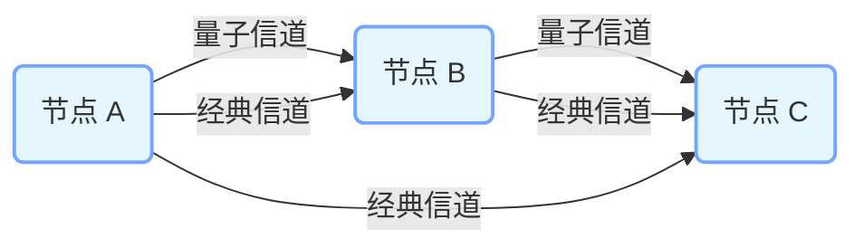

# 如何评估企业的量子密钥分发网络应用

> 关键词：量子密钥分发网络、企业应用评估、信息安全、量子通信、评估指标

> 摘要：本文围绕如何评估企业的量子密钥分发网络应用展开。首先介绍了评估的背景，包括目的、预期读者等内容。接着阐述了量子密钥分发网络的核心概念与联系，详细讲解了其核心算法原理及具体操作步骤，并通过数学模型和公式进行了深入分析。结合项目实战，给出代码实际案例及详细解释。探讨了量子密钥分发网络在企业中的实际应用场景，推荐了相关的工具和资源。最后总结了未来发展趋势与挑战，解答了常见问题并提供扩展阅读与参考资料，旨在为企业全面评估量子密钥分发网络应用提供系统的方法和思路。

## 1. 背景介绍 
### 1.1 目的和范围
随着信息技术的飞速发展，企业面临的信息安全挑战日益严峻。量子密钥分发网络作为一种具有高度安全性的通信技术，为企业保障信息安全提供了新的解决方案。本评估的目的在于帮助企业全面了解量子密钥分发网络应用的可行性、有效性和安全性，确定其是否适合企业的实际需求，以及如何优化应用以实现最大价值。评估范围涵盖量子密钥分发网络的技术原理、性能指标、成本效益、应用场景以及与企业现有信息系统的兼容性等方面。

### 1.2 预期读者
本文的预期读者主要包括企业的信息技术管理人员、信息安全专家、技术决策人员以及对量子密钥分发网络应用感兴趣的研究人员。这些读者希望通过本文了解如何科学、全面地评估量子密钥分发网络在企业中的应用，以便做出合理的技术选型和投资决策。

### 1.3 文档结构概述
本文将按照以下结构进行阐述：首先介绍量子密钥分发网络的核心概念与联系，包括其原理和架构；接着详细讲解核心算法原理及具体操作步骤，并给出相应的 Python 代码示例；通过数学模型和公式进一步分析量子密钥分发网络的性能；结合项目实战，给出代码实际案例及详细解释；探讨量子密钥分发网络在企业中的实际应用场景；推荐相关的学习资源、开发工具框架和论文著作；最后总结未来发展趋势与挑战，解答常见问题并提供扩展阅读与参考资料。

### 1.4 术语表
#### 1.4.1 核心术语定义
- **量子密钥分发（QKD）**：基于量子力学原理，在通信双方之间安全地生成和分发密钥的技术。
- **量子比特（qubit）**：量子信息的基本单位，与经典比特不同，它可以同时处于 0 和 1 的叠加态。
- **纠缠态**：多个量子比特之间存在的一种特殊关联状态，其中一个量子比特的状态变化会瞬间影响其他纠缠量子比特的状态。
- **误码率（BER）**：在通信过程中，错误传输的比特数与总传输比特数的比值。
- **密钥生成速率（KGR）**：单位时间内量子密钥分发系统能够生成的安全密钥的比特数。

#### 1.4.2 相关概念解释
- **量子力学原理**：量子力学是描述微观世界物理现象的理论，量子密钥分发主要基于量子态的不可克隆定理和海森堡不确定性原理。不可克隆定理表明，未知的量子态不能被精确复制；海森堡不确定性原理指出，对量子态的某些物理量进行测量会不可避免地干扰其状态。
- **量子信道**：用于传输量子态的物理通道，如光纤、自由空间等。
- **经典信道**：用于传输经典信息的通信通道，如传统的有线或无线通信网络。

#### 1.4.3 缩略词列表
- **QKD**：Quantum Key Distribution（量子密钥分发）
- **BB84**：Bennett - Brassard 1984（一种经典的量子密钥分发协议）
- **E91**：Ekert 1991（一种基于纠缠态的量子密钥分发协议）
- **BER**：Bit Error Rate（误码率）
- **KGR**：Key Generation Rate（密钥生成速率）

## 2. 核心概念与联系 

### 量子密钥分发网络的原理
量子密钥分发网络的核心原理是利用量子态的特性来实现安全的密钥分发。以 BB84 协议为例，该协议基于光子的偏振态作为量子比特。发送方（Alice）随机选择两种不同的基（如直线基和对角基）对光子进行偏振编码，并将编码后的光子通过量子信道发送给接收方（Bob）。Bob 也随机选择基对接收到的光子进行测量。之后，Alice 和 Bob 通过经典信道公开他们所选择的基，但不公开测量结果。只有当他们选择的基相同时，测量结果才是有效的，这些有效的测量结果就构成了初始密钥。然后，通过纠错和隐私放大等步骤，去除可能存在的错误和潜在的信息泄露，最终得到安全的密钥。

### 量子密钥分发网络的架构
量子密钥分发网络通常由多个节点和连接这些节点的量子信道与经典信道组成。节点可以是企业内部的不同部门、分支机构或合作伙伴的站点。每个节点配备量子密钥分发设备，用于生成和接收量子密钥。量子信道用于传输量子态，经典信道用于传输经典信息，如基的选择和纠错信息等。

以下是量子密钥分发网络架构的 Mermaid 流程图：


## 3. 核心算法原理 & 具体操作步骤 

### BB84 协议的算法原理
BB84 协议是最早提出的量子密钥分发协议，其核心思想是利用量子态的不确定性来保证密钥的安全性。具体步骤如下：
1. **编码**：Alice 随机选择基（直线基或对角基）和比特值（0 或 1），并根据选择对光子进行偏振编码。例如，在直线基中，水平偏振表示 0，垂直偏振表示 1；在对角基中，+45° 偏振表示 0，-45° 偏振表示 1。
2. **传输**：Alice 通过量子信道将编码后的光子发送给 Bob。
3. **测量**：Bob 随机选择基对接收到的光子进行测量。由于量子态的不确定性，如果 Bob 选择的基与 Alice 相同，则测量结果与 Alice 编码的比特值一致；如果选择的基不同，则测量结果是随机的。
4. **基比对**：Alice 和 Bob 通过经典信道公开他们所选择的基，但不公开测量结果。只有当他们选择的基相同时，测量结果才是有效的，这些有效的测量结果构成初始密钥。
5. **纠错**：通过经典信道上的信息交互，Alice 和 Bob 发现并纠正初始密钥中的错误。
6. **隐私放大**：通过对初始密钥进行哈希运算等操作，去除可能存在的潜在信息泄露，得到最终的安全密钥。

### Python 代码实现
```python
import random

# 定义基和比特值
bases = ['+', 'x']
bits = [0, 1]

# Alice 生成随机的基和比特序列
def alice_generate():
    alice_bases = [random.choice(bases) for _ in range(100)]
    alice_bits = [random.choice(bits) for _ in range(100)]
    return alice_bases, alice_bits

# Bob 生成随机的基序列
def bob_generate():
    bob_bases = [random.choice(bases) for _ in range(100)]
    return bob_bases

# 模拟量子信道传输和测量
def quantum_channel(alice_bases, alice_bits, bob_bases):
    bob_results = []
    for i in range(len(alice_bases)):
        if alice_bases[i] == bob_bases[i]:
            bob_results.append(alice_bits[i])
        else:
            bob_results.append(random.choice(bits))
    return bob_results

# 基比对
def basis_reconciliation(alice_bases, bob_bases, bob_results):
    sifted_key = []
    for i in range(len(alice_bases)):
        if alice_bases[i] == bob_bases[i]:
            sifted_key.append(bob_results[i])
    return sifted_key

# 主函数
def main():
    alice_bases, alice_bits = alice_generate()
    bob_bases = bob_generate()
    bob_results = quantum_channel(alice_bases, alice_bits, bob_bases)
    sifted_key = basis_reconciliation(alice_bases, bob_bases, bob_results)
    print("Sifted Key:", sifted_key)

if __name__ == "__main__":
    main()
```

### 代码解释
- `alice_generate` 函数：Alice 随机生成基和比特序列。
- `bob_generate` 函数：Bob 随机生成基序列。
- `quantum_channel` 函数：模拟量子信道传输和测量过程。如果 Alice 和 Bob 选择的基相同，则 Bob 的测量结果与 Alice 的比特值一致；否则，Bob 的测量结果是随机的。
- `basis_reconciliation` 函数：进行基比对，只保留 Alice 和 Bob 选择相同基时的测量结果，得到初始密钥（筛选密钥）。
- `main` 函数：调用上述函数完成整个 BB84 协议的模拟过程，并输出筛选密钥。

## 4. 数学模型和公式 & 详细讲解 & 举例说明 

### 误码率的数学模型
误码率（BER）是衡量量子密钥分发系统性能的重要指标之一。在 BB84 协议中，误码率可以通过以下公式计算：
$$BER = \frac{n_{error}}{n_{total}}$$
其中，$n_{error}$ 是错误传输的比特数，$n_{total}$ 是总传输比特数。

### 密钥生成速率的数学模型
密钥生成速率（KGR）表示单位时间内量子密钥分发系统能够生成的安全密钥的比特数。其计算公式为：
$$KGR = \frac{n_{sifted}}{t} \times (1 - f \times BER)$$
其中，$n_{sifted}$ 是筛选密钥的比特数，$t$ 是生成筛选密钥所用的时间，$f$ 是纠错效率因子，通常取值在 1 到 2 之间。

### 举例说明
假设在一次量子密钥分发过程中，总传输比特数 $n_{total} = 1000$，错误传输的比特数 $n_{error} = 20$，则误码率为：
$$BER = \frac{20}{1000} = 0.02$$
生成筛选密钥的比特数 $n_{sifted} = 500$，所用时间 $t = 10$ 秒，纠错效率因子 $f = 1.5$，则密钥生成速率为：
$$KGR = \frac{500}{10} \times (1 - 1.5 \times 0.02) = 50 \times (1 - 0.03) = 48.5 \text{ bps}$$

## 5. 项目实战：代码实际案例和详细解释说明 

### 5.1  开发环境搭建
- **操作系统**：推荐使用 Linux 系统，如 Ubuntu 18.04 及以上版本。
- **Python 版本**：Python 3.6 及以上版本。
- **开发工具**：可以使用 PyCharm 作为集成开发环境（IDE），也可以使用 VS Code 等轻量级编辑器。

### 5.2  源代码详细实现和代码解读
以下是一个更完整的量子密钥分发模拟代码，包含纠错和隐私放大步骤：
```python
import random
import hashlib

# 定义基和比特值
bases = ['+', 'x']
bits = [0, 1]

# Alice 生成随机的基和比特序列
def alice_generate():
    alice_bases = [random.choice(bases) for _ in range(1000)]
    alice_bits = [random.choice(bits) for _ in range(1000)]
    return alice_bases, alice_bits

# Bob 生成随机的基序列
def bob_generate():
    bob_bases = [random.choice(bases) for _ in range(1000)]
    return bob_bases

# 模拟量子信道传输和测量
def quantum_channel(alice_bases, alice_bits, bob_bases):
    bob_results = []
    for i in range(len(alice_bases)):
        if alice_bases[i] == bob_bases[i]:
            bob_results.append(alice_bits[i])
        else:
            bob_results.append(random.choice(bits))
    return bob_results

# 基比对
def basis_reconciliation(alice_bases, bob_bases, bob_results):
    sifted_key = []
    for i in range(len(alice_bases)):
        if alice_bases[i] == bob_bases[i]:
            sifted_key.append(bob_results[i])
    return sifted_key

# 纠错：简单的奇偶校验
def error_correction(sifted_key):
    corrected_key = []
    for i in range(0, len(sifted_key), 2):
        if i + 1 < len(sifted_key):
            parity = sifted_key[i] ^ sifted_key[i + 1]
            if parity == 0:
                corrected_key.append(sifted_key[i])
            else:
                # 假设错误出现在第二个比特
                corrected_key.append(sifted_key[i])
                corrected_key.append(1 - sifted_key[i + 1])
        else:
            corrected_key.append(sifted_key[i])
    return corrected_key

# 隐私放大：使用哈希函数
def privacy_amplification(corrected_key):
    key_str = ''.join(map(str, corrected_key))
    hash_object = hashlib.sha256(key_str.encode())
    hashed_key = bin(int(hash_object.hexdigest(), 16))[2:]
    final_key = [int(bit) for bit in hashed_key[:len(corrected_key) // 2]]
    return final_key

# 主函数
def main():
    alice_bases, alice_bits = alice_generate()
    bob_bases = bob_generate()
    bob_results = quantum_channel(alice_bases, alice_bits, bob_bases)
    sifted_key = basis_reconciliation(alice_bases, bob_bases, bob_results)
    corrected_key = error_correction(sifted_key)
    final_key = privacy_amplification(corrected_key)
    print("Final Key:", final_key)

if __name__ == "__main__":
    main()
```

### 5.3  代码解读与分析
- **纠错部分**：`error_correction` 函数使用简单的奇偶校验方法进行纠错。将筛选密钥按每两个比特一组进行处理，计算奇偶性。如果奇偶性不符合预期，则假设错误出现在第二个比特并进行纠正。
- **隐私放大部分**：`privacy_amplification` 函数使用 SHA - 256 哈希函数对纠正后的密钥进行处理，将密钥转换为字符串后进行哈希运算，然后取哈希结果的前一半作为最终密钥，以去除可能存在的潜在信息泄露。

## 6. 实际应用场景 
### 金融行业
在金融行业，企业需要保护大量的敏感信息，如客户账户信息、交易记录等。量子密钥分发网络可以为金融机构之间的通信以及内部不同部门之间的信息传输提供高度安全的密钥，确保信息在传输过程中不被窃取或篡改。例如，银行之间的资金转账、证券交易等业务可以使用量子密钥分发网络进行加密通信，保障交易的安全性和可靠性。

### 政府和国防领域
政府和国防部门处理大量的机密信息，对信息安全的要求极高。量子密钥分发网络可以用于军事指挥系统、情报传输、政府公文加密等方面。通过使用量子密钥分发技术，能够有效防止敌方的窃听和攻击，确保国家机密信息的安全。

### 医疗行业
医疗行业涉及患者的个人健康信息、病历记录等敏感数据。量子密钥分发网络可以为医疗机构之间的信息共享、远程医疗服务等提供安全的通信保障。例如，医院之间共享患者的医疗影像数据时，使用量子密钥进行加密可以确保患者隐私不被泄露。

### 能源行业
能源行业的电网调度、石油天然气管道监控等系统需要保障信息的安全传输。量子密钥分发网络可以为这些系统提供安全的密钥，防止黑客攻击导致的能源供应中断或数据泄露等问题。

## 7. 工具和资源推荐
### 7.1 学习资源推荐
#### 7.1.1 书籍推荐
- 《量子信息与量子计算》：全面介绍了量子信息和量子计算的基本概念、原理和技术，包括量子密钥分发的相关内容。
- 《量子通信技术》：详细阐述了量子通信的理论和实践，对量子密钥分发网络的架构、协议和应用进行了深入分析。

#### 7.1.2 在线课程
- Coursera 上的“Quantum Computing for Everyone”：该课程由专业教授授课，深入浅出地介绍了量子计算和量子通信的基础知识，包括量子密钥分发的原理和应用。
- edX 上的“Quantum Information Science”：提供了系统的量子信息科学课程，涵盖了量子比特、量子纠缠、量子密钥分发等重要内容。

#### 7.1.3 技术博客和网站
- Quantum Computing Report：该网站提供了量子计算和量子通信领域的最新技术动态、研究成果和市场分析，对量子密钥分发网络的发展趋势有深入报道。
- Physics World：包含了物理学领域的前沿研究成果，其中有很多关于量子通信和量子密钥分发的文章和评论。

### 7.2 开发工具框架推荐
#### 7.2.1 IDE和编辑器
- PyCharm：功能强大的 Python 集成开发环境，提供代码编辑、调试、版本控制等一系列功能，适合开发量子密钥分发相关的 Python 代码。
- VS Code：轻量级的代码编辑器，支持多种编程语言和插件扩展，可以方便地进行代码编写和调试。

#### 7.2.2 调试和性能分析工具
- Py-Spy：用于分析 Python 代码的性能，能够帮助开发者找出代码中的性能瓶颈，优化量子密钥分发模拟代码的执行效率。
- PDB：Python 内置的调试器，可以在代码中设置断点，逐步执行代码，方便调试和排查问题。

#### 7.2.3 相关框架和库
- Qiskit：IBM 开发的开源量子计算框架，提供了量子电路模拟、量子算法实现等功能，也可以用于量子密钥分发协议的模拟和实验。
- Strawberry Fields：基于 Python 的量子光学编程库，可用于模拟和开发基于量子光学的量子密钥分发系统。

### 7.3 相关论文著作推荐
#### 7.3.1 经典论文
- “Quantum cryptography based on Bell's theorem”：由 A. K. Ekert 发表，提出了基于纠缠态的量子密钥分发协议（E91 协议），为量子密钥分发的发展奠定了重要基础。
- “Quantum cryptography: Public key distribution and coin tossing”：由 C. H. Bennett 和 G. Brassard 发表，首次提出了 BB84 协议，是量子密钥分发领域的开创性论文。

#### 7.3.2 最新研究成果
- 定期关注《Physical Review Letters》《Nature》《Science》等顶级学术期刊，这些期刊会发表量子通信和量子密钥分发领域的最新研究成果，如新型量子密钥分发协议的提出、实验系统的改进等。

#### 7.3.3 应用案例分析
- 一些企业和研究机构会发布量子密钥分发网络在实际应用中的案例分析报告，通过研究这些报告可以了解量子密钥分发网络在不同行业的应用效果和面临的挑战。

## 8. 总结：未来发展趋势与挑战
### 未来发展趋势
- **集成化和小型化**：随着技术的不断进步，量子密钥分发设备将朝着集成化和小型化的方向发展。这将使得量子密钥分发网络更容易部署在企业内部，降低设备成本和空间需求。
- **与现有网络的融合**：未来，量子密钥分发网络将与企业现有的通信网络（如光纤网络、无线网络等）更好地融合，实现无缝对接。这将使得企业能够更方便地利用量子密钥分发技术来保障现有网络的信息安全。
- **标准化和产业化**：随着量子密钥分发技术的逐渐成熟，相关的标准和规范将不断完善。这将促进量子密钥分发产业的发展，推动更多的企业和机构采用量子密钥分发网络来保障信息安全。

### 挑战
- **技术成本**：目前，量子密钥分发设备的成本较高，这限制了其在企业中的大规模应用。降低设备成本是推广量子密钥分发网络的关键挑战之一。
- **传输距离和速率**：量子密钥分发的传输距离和密钥生成速率仍然受到一定的限制。如何提高传输距离和速率，以满足企业大规模、高带宽通信的需求，是当前需要解决的重要问题。
- **人才短缺**：量子密钥分发是一个新兴的领域，相关的专业人才相对短缺。企业在评估和应用量子密钥分发网络时，面临着缺乏专业技术人员的挑战。

## 9. 附录：常见问题与解答
### 问题 1：量子密钥分发网络与传统加密技术相比有哪些优势？
答：量子密钥分发网络基于量子力学原理，具有无条件安全性。与传统加密技术相比，它可以检测到任何试图窃听密钥的行为，因为量子态的测量会改变其状态。而传统加密技术的安全性依赖于数学难题的复杂度，随着计算能力的不断提高，存在被破解的风险。

### 问题 2：量子密钥分发网络的部署难度大吗？
答：量子密钥分发网络的部署难度相对较大。它需要专门的量子密钥分发设备和量子信道，如光纤或自由空间。此外，还需要对现有网络进行一定的改造和优化，以实现与量子密钥分发网络的融合。但是，随着技术的发展，部署难度正在逐渐降低。

### 问题 3：量子密钥分发网络的维护成本高吗？
答：量子密钥分发网络的维护成本相对较高。这主要是因为量子密钥分发设备需要专业的技术人员进行维护和管理，并且设备的稳定性和可靠性也需要不断监测和优化。此外，量子信道的维护也需要一定的成本。

## 10. 扩展阅读 & 参考资料
- Nielsen, M. A., & Chuang, I. L. (2010). Quantum Computation and Quantum Information. Cambridge University Press.
- Lo, H. K., Ma, X., & Chen, K. (2014). Secure quantum key distribution. Nature Photonics, 8(8), 595 - 604.
- https://qiskit.org/
- https://strawberryfields.ai/

作者：AI天才研究院/AI Genius Institute & 禅与计算机程序设计艺术 /Zen And The Art of Computer Programming