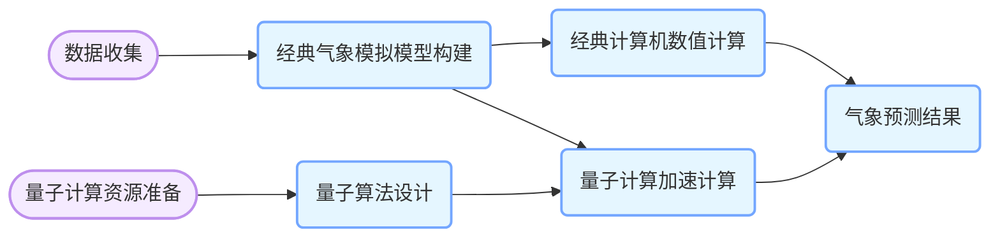

# 如何评估企业的量子计算气象模拟应用

> 关键词：量子计算、气象模拟、企业应用评估、评估指标、技术成熟度

> 摘要：本文聚焦于企业量子计算气象模拟应用的评估问题。首先介绍了开展此评估的背景信息，包括目的、预期读者、文档结构等。接着阐述了量子计算和气象模拟的核心概念及联系，分析了核心算法原理和具体操作步骤，给出了相关数学模型和公式。通过项目实战展示代码案例并详细解读，探讨了实际应用场景。还推荐了学习资源、开发工具框架以及相关论文著作。最后总结了未来发展趋势与挑战，提供常见问题解答和扩展阅读参考资料，旨在为企业评估量子计算气象模拟应用提供全面且深入的指导。

## 1. 背景介绍 
### 1.1 目的和范围
企业在探索新兴技术应用时，需要科学合理地评估新技术与自身业务的适配性和潜在价值。量子计算作为一项极具潜力的技术，在气象模拟领域展现出了巨大的应用前景。本评估的目的在于为企业提供一套全面、系统的评估方法，帮助企业判断量子计算气象模拟应用是否值得投入资源进行开发或合作，以及如何衡量该应用在企业实际运营中的效果和价值。

评估范围涵盖量子计算气象模拟应用的技术层面，如算法复杂度、计算性能等；业务层面，如对企业气象相关业务的支持程度、带来的经济效益等；以及社会层面，如对企业形象和社会责任的影响等方面。

### 1.2 预期读者
本文的预期读者主要包括企业的高层管理人员，他们需要从战略层面决策是否引入量子计算气象模拟应用；技术研发人员，他们关注该应用的技术实现细节和可行性；市场营销人员，他们希望了解该应用能为企业带来的市场竞争优势；以及对量子计算和气象模拟领域感兴趣的研究人员和学者。

### 1.3 文档结构概述
本文将按照以下结构展开：首先介绍核心概念与联系，帮助读者理解量子计算和气象模拟的基本原理和两者之间的关联；接着阐述核心算法原理和具体操作步骤，结合Python代码进行详细说明；然后给出相关的数学模型和公式，并举例讲解；通过项目实战展示代码案例并进行详细解读；探讨实际应用场景；推荐学习资源、开发工具框架和相关论文著作；最后总结未来发展趋势与挑战，提供常见问题解答和扩展阅读参考资料。

### 1.4 术语表
#### 1.4.1 核心术语定义
- **量子计算**：基于量子力学原理进行信息处理的计算模式，利用量子比特的叠加和纠缠特性，能够实现远超经典计算机的并行计算能力。
- **气象模拟**：通过数学模型和计算机算法对大气的物理过程进行数值模拟，以预测天气变化和气象现象。
- **量子比特（qubit）**：量子计算中的基本信息单元，与经典比特不同，它可以同时处于0和1的叠加态。
- **量子门**：用于操作量子比特的基本逻辑单元，类似于经典计算机中的逻辑门。

#### 1.4.2 相关概念解释
- **量子纠缠**：多个量子比特之间存在的一种特殊关联状态，一个量子比特的状态改变会瞬间影响其他纠缠量子比特的状态，无论它们之间的距离有多远。
- **数值天气预报（NWP）**：气象模拟的一种主要方法，通过求解大气动力学和热力学方程，利用计算机数值计算来预测未来的天气状况。

#### 1.4.3 缩略词列表
- **NWP**：数值天气预报（Numerical Weather Prediction）
- **QIP**：量子信息处理（Quantum Information Processing）

## 2. 核心概念与联系 

### 量子计算的原理
量子计算的核心在于利用量子比特的特性。经典比特只能处于0或1两种状态之一，而量子比特可以处于0和1的叠加态，用数学表达式表示为：

$$|\psi\rangle = \alpha|0\rangle + \beta|1\rangle$$

其中，$\alpha$ 和 $\beta$ 是复数，且满足 $|\alpha|^2 + |\beta|^2 = 1$。这意味着一个量子比特可以同时表示0和1的信息，多个量子比特的叠加可以表示指数级数量的状态。

量子门用于操作量子比特的状态，常见的量子门有单量子比特门（如Pauli-X门、Hadamard门等）和多量子比特门（如CNOT门等）。例如，Hadamard门的矩阵表示为：

$$H = \frac{1}{\sqrt{2}}\begin{bmatrix}1 & 1\\1 & -1\end{bmatrix}$$

对一个量子比特 $|0\rangle$ 应用Hadamard门后，得到的状态为：

$$H|0\rangle = \frac{1}{\sqrt{2}}(|0\rangle + |1\rangle)$$

### 气象模拟的原理
气象模拟主要基于大气动力学和热力学原理，通过建立数学模型来描述大气的运动和变化。常见的气象模拟模型包括全球气候模式（GCM）和区域气候模式（RCM）等。

气象模拟的基本步骤包括：
1. **数据收集**：收集大气的初始状态数据，如温度、湿度、气压、风速等。
2. **模型构建**：根据大气动力学和热力学方程，构建气象模拟模型。
3. **数值计算**：利用计算机对模型进行数值求解，得到未来一段时间内的气象预测结果。

### 量子计算与气象模拟的联系
气象模拟是一个计算密集型的任务，需要处理大量的数据和进行复杂的数值计算。经典计算机在处理这些任务时往往面临计算能力不足的问题。而量子计算的并行计算能力可以大大提高气象模拟的计算效率。

例如，在气象模拟中，需要对大气状态进行多次迭代计算，每次迭代都涉及到大量的矩阵运算。量子计算机可以利用量子比特的叠加态同时处理多个矩阵元素，从而实现并行计算，大大缩短计算时间。

### 核心概念原理和架构的文本示意图
```plaintext
量子计算
|-- 量子比特（叠加态）
|-- 量子门（操作量子比特）
|-- 量子算法（利用量子特性加速计算）

气象模拟
|-- 数据收集（大气初始状态）
|-- 模型构建（大气动力学和热力学方程）
|-- 数值计算（求解模型）

量子计算气象模拟应用
|-- 量子计算加速气象模拟计算
|-- 提高气象模拟的精度和效率
```

### Mermaid 流程图


## 3. 核心算法原理 & 具体操作步骤 

### 核心算法原理
在量子计算气象模拟中，一个常用的算法是量子蒙特卡罗算法。量子蒙特卡罗算法是经典蒙特卡罗算法在量子计算领域的扩展，它利用量子比特的叠加态和纠缠特性，提高了采样效率，从而加速了计算过程。

量子蒙特卡罗算法的基本思想是通过量子态的演化来模拟随机变量的采样过程。具体来说，首先将量子比特初始化为特定的叠加态，然后通过量子门操作使量子态演化到与目标概率分布相关的状态。最后，对量子态进行测量，得到采样结果。

### Python 代码实现量子蒙特卡罗算法示例
```python
import numpy as np
from qiskit import QuantumCircuit, Aer, execute

# 定义目标概率分布
target_distribution = np.array([0.2, 0.3, 0.5])

# 量子比特数量
num_qubits = int(np.ceil(np.log2(len(target_distribution))))

# 创建量子电路
qc = QuantumCircuit(num_qubits)

# 初始化量子比特为均匀叠加态
qc.h(range(num_qubits))

# 定义量子门操作来近似目标概率分布
# 这里简单使用迭代相位估计算法的思想
# 实际应用中需要更复杂的电路设计
for _ in range(10):
    for qubit in range(num_qubits):
        qc.rz(0.1, qubit)

# 添加测量操作
qc.measure_all()

# 模拟量子电路
backend = Aer.get_backend('qasm_simulator')
job = execute(qc, backend, shots=1000)
result = job.result()
counts = result.get_counts(qc)

# 计算采样结果的频率分布
sampled_distribution = np.zeros(len(target_distribution))
for key, value in counts.items():
    index = int(key, 2)
    if index < len(target_distribution):
        sampled_distribution[index] += value / 1000

print("目标概率分布:", target_distribution)
print("采样结果的频率分布:", sampled_distribution)
```

### 具体操作步骤
1. **数据预处理**：将气象模拟所需的数据进行整理和预处理，使其适合量子计算的输入格式。
2. **量子算法设计**：根据气象模拟的具体任务，设计合适的量子算法，如量子蒙特卡罗算法、量子线性方程组求解算法等。
3. **量子电路构建**：根据量子算法，使用量子门操作构建量子电路。
4. **量子计算执行**：将量子电路提交到量子计算机或量子模拟器上进行计算。
5. **结果后处理**：对量子计算的结果进行后处理，将其转换为气象模拟所需的结果。

## 4. 数学模型和公式 & 详细讲解 & 举例说明 

### 气象模拟的数学模型
气象模拟主要基于大气动力学和热力学方程，其中最基本的方程是Navier - Stokes方程和热力学能量方程。

#### Navier - Stokes方程
Navier - Stokes方程描述了流体的运动，对于大气而言，可以表示为：

$$\frac{\partial \mathbf{u}}{\partial t} + (\mathbf{u} \cdot \nabla)\mathbf{u} = -\frac{1}{\rho}\nabla p + \nu \nabla^2 \mathbf{u} + \mathbf{f}$$

其中，$\mathbf{u}$ 是大气的速度矢量，$t$ 是时间，$\rho$ 是大气密度，$p$ 是气压，$\nu$ 是运动粘性系数，$\mathbf{f}$ 是外力（如科里奥利力）。

#### 热力学能量方程
热力学能量方程描述了大气的能量守恒，可表示为：

$$\frac{\partial T}{\partial t} + (\mathbf{u} \cdot \nabla)T = \frac{1}{\rho c_p}\left(\frac{\partial q}{\partial t} + \nabla \cdot \mathbf{q}\right) + \frac{J}{c_p}$$

其中，$T$ 是温度，$c_p$ 是定压比热，$q$ 是热量通量，$J$ 是辐射加热率。

### 量子计算在气象模拟中的应用公式
在量子蒙特卡罗算法中，假设目标概率分布为 $P(x)$，量子态 $|\psi\rangle$ 经过量子门操作后，测量得到状态 $x$ 的概率为 $|\langle x|\psi\rangle|^2$。通过调整量子门的参数，使得 $|\langle x|\psi\rangle|^2$ 尽可能接近 $P(x)$。

例如，在简单的一维气象变量模拟中，假设目标概率分布为高斯分布：

$$P(x) = \frac{1}{\sqrt{2\pi\sigma^2}}\exp\left(-\frac{(x - \mu)^2}{2\sigma^2}\right)$$

其中，$\mu$ 是均值，$\sigma$ 是标准差。

### 举例说明
假设我们要模拟某一地区的气温分布，通过收集历史数据得到气温的均值 $\mu = 25$ 摄氏度，标准差 $\sigma = 5$ 摄氏度。我们可以使用量子蒙特卡罗算法来模拟该地区的气温分布。

首先，将气温范围离散化为若干个区间，每个区间对应一个量子态。然后，根据高斯分布公式计算每个区间的目标概率。接着，使用量子电路来近似这个目标概率分布，通过多次测量得到采样结果，从而模拟出该地区的气温分布。

## 5. 项目实战：代码实际案例和详细解释说明 

### 5.1  开发环境搭建
#### 安装 Python
首先，确保你已经安装了 Python 3.6 或更高版本。可以从 Python 官方网站（https://www.python.org/downloads/）下载并安装。

#### 安装 Qiskit
Qiskit 是一个开源的量子计算框架，用于开发和模拟量子电路。可以使用以下命令安装 Qiskit：

```bash
pip install qiskit
```

#### 安装 NumPy
NumPy 是 Python 中用于科学计算的基础库，在气象模拟和量子计算中都有广泛应用。可以使用以下命令安装 NumPy：

```bash
pip install numpy
```

### 5.2  源代码详细实现和代码解读
```python
import numpy as np
from qiskit import QuantumCircuit, Aer, execute

# 模拟气象变量的目标概率分布
# 假设气象变量分为 4 个等级
target_distribution = np.array([0.1, 0.2, 0.3, 0.4])

# 量子比特数量
num_qubits = int(np.ceil(np.log2(len(target_distribution))))

# 创建量子电路
qc = QuantumCircuit(num_qubits)

# 初始化量子比特为均匀叠加态
qc.h(range(num_qubits))

# 定义量子门操作来近似目标概率分布
# 这里简单使用旋转门操作
for qubit in range(num_qubits):
    qc.rz(0.2 * (qubit + 1), qubit)

# 添加测量操作
qc.measure_all()

# 模拟量子电路
backend = Aer.get_backend('qasm_simulator')
job = execute(qc, backend, shots=1000)
result = job.result()
counts = result.get_counts(qc)

# 计算采样结果的频率分布
sampled_distribution = np.zeros(len(target_distribution))
for key, value in counts.items():
    index = int(key, 2)
    if index < len(target_distribution):
        sampled_distribution[index] += value / 1000

print("目标概率分布:", target_distribution)
print("采样结果的频率分布:", sampled_distribution)
```

### 代码解读与分析
1. **导入必要的库**：导入 `numpy` 用于数值计算，`qiskit` 用于量子电路的创建和模拟。
2. **定义目标概率分布**：`target_distribution` 表示气象变量的目标概率分布，这里假设气象变量分为 4 个等级。
3. **确定量子比特数量**：根据目标概率分布的长度，计算所需的量子比特数量。
4. **创建量子电路**：使用 `QuantumCircuit` 类创建一个量子电路。
5. **初始化量子比特**：使用 Hadamard 门将量子比特初始化为均匀叠加态。
6. **定义量子门操作**：使用旋转门（`rz`）操作来近似目标概率分布。
7. **添加测量操作**：对所有量子比特进行测量。
8. **模拟量子电路**：使用 `qasm_simulator` 后端模拟量子电路，进行 1000 次测量。
9. **计算采样结果的频率分布**：根据测量结果计算采样结果的频率分布，并与目标概率分布进行比较。

通过比较目标概率分布和采样结果的频率分布，可以评估量子电路对目标概率分布的近似程度，从而判断量子算法在气象模拟中的有效性。

## 6. 实际应用场景 
### 气象预报服务企业
对于专业的气象预报服务企业，量子计算气象模拟可以大大提高天气预报的精度和时效性。通过更快速地处理大量的气象数据和进行复杂的数值计算，企业能够提前更准确地预测气象灾害，为客户提供更及时、准确的气象预报服务，从而提高企业的市场竞争力。

### 农业企业
农业生产高度依赖天气条件，量子计算气象模拟可以帮助农业企业更好地规划种植和养殖活动。例如，提前预测降雨、气温等气象因素，合理安排灌溉、施肥和病虫害防治等工作，提高农作物的产量和质量，降低生产成本。

### 能源企业
能源企业，特别是可再生能源企业，如风力发电和太阳能发电企业，气象条件对其发电效率有重要影响。量子计算气象模拟可以帮助能源企业更准确地预测风速、光照等气象参数，优化发电计划，提高能源利用效率，降低能源生产成本。

### 航空航天企业
航空航天活动对气象条件非常敏感，量子计算气象模拟可以为航空航天企业提供更精确的气象预报，帮助企业更好地规划航班路线、航天器发射时间等，提高飞行安全性和运营效率。

## 7. 工具和资源推荐
### 7.1 学习资源推荐
#### 7.1.1 书籍推荐
- 《量子计算与量子信息》（Quantum Computation and Quantum Information）：由 Michael A. Nielsen 和 Isaac L. Chuang 编写，是量子计算领域的经典教材，涵盖了量子计算的基本原理、算法和应用。
- 《数值天气预报》（Numerical Weather Prediction）：介绍了数值天气预报的基本原理、模型和方法，是气象模拟领域的重要参考书。

#### 7.1.2 在线课程
- Coursera 上的 “Quantum Computing for Everyone”：适合初学者了解量子计算的基本概念和原理。
- edX 上的 “Numerical Weather Prediction: Principles and Practice”：深入讲解数值天气预报的理论和实践。

#### 7.1.3 技术博客和网站
- Quantum Computing Report：提供量子计算领域的最新消息、技术文章和市场分析。
- Weather Online：提供气象模拟和预报的相关知识和技术文章。

### 7.2 开发工具框架推荐
#### 7.2.1 IDE和编辑器
- PyCharm：功能强大的 Python 集成开发环境，支持 Qiskit 等量子计算框架的开发。
- Jupyter Notebook：交互式的编程环境，适合进行量子计算实验和代码演示。

#### 7.2.2 调试和性能分析工具
- Qiskit Aer：Qiskit 提供的量子模拟器，支持多种模拟模式和性能分析功能。
- IBM Quantum Composer：IBM 提供的在线量子电路设计和模拟平台，方便用户进行量子电路的调试和测试。

#### 7.2.3 相关框架和库
- Qiskit：开源的量子计算框架，提供了丰富的量子算法和工具，支持多种量子硬件平台。
- Cirq：Google 开发的量子计算框架，专注于量子电路的设计和模拟。

### 7.3 相关论文著作推荐
#### 7.3.1 经典论文
- “Quantum Algorithms for Linear Systems of Equations”：介绍了量子线性方程组求解算法，为量子计算在气象模拟中的应用提供了理论基础。
- “A Numerical Method for the Prediction of Tropical Cyclone Motion”：提出了一种数值预报热带气旋运动的方法，是气象模拟领域的经典论文。

#### 7.3.2 最新研究成果
- 关注 arXiv 预印本平台上关于量子计算气象模拟的最新研究论文，了解该领域的前沿动态。

#### 7.3.3 应用案例分析
- 查看相关学术期刊和会议论文，了解量子计算气象模拟在实际应用中的案例和效果评估。

## 8. 总结：未来发展趋势与挑战
### 未来发展趋势
- **技术融合**：量子计算将与人工智能、大数据等技术深度融合，进一步提高气象模拟的精度和效率。例如，利用人工智能算法优化量子算法的设计，利用大数据技术处理和分析气象模拟产生的海量数据。
- **硬件发展**：随着量子计算硬件技术的不断进步，量子比特的数量和质量将不断提高，量子计算机的计算能力将得到大幅提升，为气象模拟提供更强大的计算支持。
- **应用拓展**：量子计算气象模拟的应用领域将不断拓展，除了气象预报、农业、能源、航空航天等领域，还将应用于环境科学、海洋学等更多领域。

### 挑战
- **技术成熟度**：目前量子计算技术仍处于发展阶段，量子比特的稳定性和纠错能力有待提高，量子算法的设计和优化也面临挑战，这限制了量子计算气象模拟的实际应用效果。
- **数据安全**：气象模拟涉及大量的敏感数据，如气象观测数据、地理信息数据等，量子计算的强大计算能力可能对数据安全带来威胁，需要加强数据安全保护措施。
- **人才短缺**：量子计算和气象模拟都是专业性很强的领域，既懂量子计算又懂气象模拟的复合型人才非常短缺，这制约了该领域的发展。

## 9. 附录：常见问题与解答
### 问题 1：量子计算气象模拟的计算精度能比经典计算机提高多少？
目前，由于量子计算技术还不够成熟，很难准确评估其计算精度比经典计算机提高的具体数值。但从理论上来说，量子计算的并行计算能力可以在某些问题上大大提高计算效率和精度。随着量子计算硬件和算法的不断发展，其在气象模拟中的计算精度有望得到显著提升。

### 问题 2：企业引入量子计算气象模拟应用需要多少成本？
企业引入量子计算气象模拟应用的成本包括硬件采购成本、软件开发成本、人员培训成本等。目前，量子计算机的价格非常昂贵，且维护和运营成本也较高。对于大多数企业来说，可以选择使用云量子计算服务，这样可以降低硬件采购成本。软件开发成本主要取决于应用的复杂程度，人员培训成本则与企业员工的技术水平有关。

### 问题 3：量子计算气象模拟对数据质量有什么要求？
量子计算气象模拟对数据质量有较高的要求。气象数据的准确性、完整性和一致性直接影响模拟结果的精度。因此，在进行量子计算气象模拟之前，需要对气象数据进行严格的质量控制和预处理，去除噪声和异常值，确保数据的可靠性。

## 10. 扩展阅读 & 参考资料
- Nielsen, M. A., & Chuang, I. L. (2010). Quantum Computation and Quantum Information. Cambridge University Press.
- Kalnay, E. (2003). Atmospheric Modeling, Data Assimilation and Predictability. Cambridge University Press.
- Qiskit Documentation: https://qiskit.org/documentation/
- IBM Quantum Experience: https://quantum-computing.ibm.com/

作者：AI天才研究院/AI Genius Institute & 禅与计算机程序设计艺术 /Zen And The Art of Computer Programming