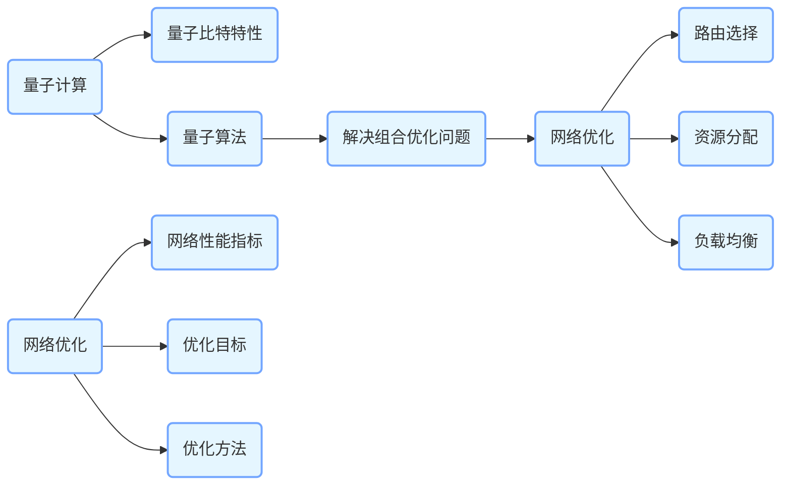

# 如何评估企业的量子计算网络优化应用

> 关键词：量子计算、网络优化、企业应用评估、量子算法、网络性能指标

> 摘要：本文聚焦于企业量子计算网络优化应用的评估问题。首先介绍了评估该应用的背景，包括目的、预期读者等信息。接着阐述了量子计算与网络优化的核心概念及其联系，详细讲解了相关核心算法原理和具体操作步骤，配以Python代码示例。同时给出了数学模型和公式，并结合实例说明。通过项目实战展示了代码实现和解读。分析了该应用在企业中的实际场景，推荐了学习、开发工具及相关论文著作。最后总结了未来发展趋势与挑战，解答常见问题并提供扩展阅读和参考资料，旨在为企业评估量子计算网络优化应用提供全面、深入的指导。

## 1. 背景介绍 
### 1.1 目的和范围
随着量子计算技术的不断发展，企业开始探索其在网络优化领域的应用。本评估的目的在于帮助企业全面、科学地衡量量子计算在网络优化方面的应用效果、潜力和价值。范围涵盖了从量子计算基础概念到具体网络优化应用的各个方面，包括量子算法的性能、对网络性能指标的影响、实施成本与收益等。

### 1.2 预期读者
本文预期读者主要包括企业的技术决策者、网络工程师、量子计算研究人员以及对量子计算网络优化应用感兴趣的专业人士。技术决策者可以根据评估结果决定是否引入量子计算技术进行网络优化；网络工程师可以了解如何在实际工作中应用量子计算进行网络优化；量子计算研究人员可以从企业应用的角度进一步探索相关技术；而对该领域感兴趣的专业人士可以通过本文获得全面的知识体系。

### 1.3 文档结构概述
本文首先介绍背景信息，让读者了解评估的目的和适用人群。接着阐述核心概念与联系，帮助读者建立理论基础。然后详细讲解核心算法原理和具体操作步骤，通过Python代码进行演示。之后给出数学模型和公式，并举例说明。通过项目实战展示实际应用过程，分析其在企业中的实际场景。推荐相关的学习、开发工具和论文著作。最后总结未来发展趋势与挑战，解答常见问题并提供扩展阅读和参考资料。

### 1.4 术语表
#### 1.4.1 核心术语定义
- **量子计算**：基于量子力学原理进行信息处理的计算模式，利用量子比特（qubit）的叠加和纠缠特性实现并行计算，具有远超经典计算的计算能力。
- **网络优化**：通过调整网络参数、拓扑结构等手段，提高网络的性能，如降低延迟、提高带宽利用率、增强可靠性等。
- **量子算法**：专门为量子计算机设计的算法，利用量子计算的特性解决特定问题，在网络优化中可用于求解复杂的组合优化问题。
- **网络性能指标**：用于衡量网络性能的量化指标，如吞吐量、延迟、丢包率等。

#### 1.4.2 相关概念解释
- **量子比特（qubit）**：是量子计算中的基本信息单位，与经典比特不同，它可以同时处于0和1的叠加态，使得量子计算机能够同时处理多个计算任务。
- **量子纠缠**：是一种量子力学现象，两个或多个量子比特之间存在一种特殊的关联，使得一个量子比特的状态会瞬间影响到其他纠缠的量子比特的状态，可用于实现高效的信息传输和计算。
- **组合优化问题**：在网络优化中，很多问题都可以归结为组合优化问题，如路由选择、资源分配等，即从有限的可行解集合中找到最优解。

#### 1.4.3 缩略词列表
- **QC**：Quantum Computing（量子计算）
- **QUBO**：Quadratic Unconstrained Binary Optimization（二次无约束二进制优化）
- **NP**：Non-deterministic Polynomial（非确定性多项式）

## 2. 核心概念与联系 
### 核心概念原理
#### 量子计算原理
量子计算基于量子力学的基本原理，主要利用量子比特的叠加和纠缠特性。量子比特可以处于0、1或它们的任意叠加态，用数学公式表示为：
$$|\psi\rangle = \alpha|0\rangle + \beta|1\rangle$$
其中，$|\psi\rangle$ 表示量子比特的状态，$\alpha$ 和 $\beta$ 是复数，满足 $|\alpha|^2 + |\beta|^2 = 1$。这种叠加态使得量子计算机可以同时处理多个计算任务，从而实现并行计算。

量子纠缠是指多个量子比特之间存在一种特殊的关联，当一个量子比特的状态发生改变时，与之纠缠的其他量子比特的状态会瞬间发生相应的改变，无论它们之间的距离有多远。这种特性可以用于实现高效的信息传输和计算。

#### 网络优化原理
网络优化的目标是提高网络的性能，主要通过调整网络参数、拓扑结构等手段来实现。常见的网络优化问题包括路由选择、资源分配、负载均衡等。这些问题通常可以归结为组合优化问题，即在有限的可行解集合中找到最优解。例如，在路由选择问题中，需要从多个可能的路径中选择一条最优路径，使得网络的延迟最小或带宽利用率最高。

### 核心概念架构的文本示意图
```plaintext
量子计算
|-- 量子比特（叠加、纠缠）
|-- 量子算法（如QUBO算法）
|   |-- 解决组合优化问题
|       |-- 应用于网络优化
|           |-- 路由选择
|           |-- 资源分配
|           |-- 负载均衡
网络优化
|-- 网络性能指标（吞吐量、延迟、丢包率等）
|-- 优化目标（提高性能、降低成本等）
|-- 优化方法（调整参数、拓扑结构等）
```

### Mermaid流程图


## 3. 核心算法原理 & 具体操作步骤 
### 核心算法原理
在量子计算网络优化中，二次无约束二进制优化（QUBO）算法是一种常用的算法。QUBO问题的目标是找到一个二进制向量 $x = (x_1, x_2, \cdots, x_n)$，使得目标函数 $f(x)$ 最小化，目标函数的形式为：
$$f(x) = \sum_{i=1}^{n} \sum_{j=1}^{n} Q_{ij} x_i x_j$$
其中，$Q_{ij}$ 是一个 $n \times n$ 的对称矩阵，$x_i \in \{0, 1\}$。

QUBO问题可以通过量子退火算法来求解。量子退火算法是一种基于量子隧穿效应的优化算法，它通过模拟量子系统的演化过程，在解空间中寻找最优解。

### 具体操作步骤
#### 步骤1：将网络优化问题转化为QUBO问题
首先，需要将网络优化问题（如路由选择、资源分配等）转化为QUBO问题。这通常需要定义目标函数和约束条件，并将其转化为QUBO的形式。例如，在路由选择问题中，可以将每个可能的路径看作一个二进制变量，当选择该路径时，对应的变量取值为1，否则为0。然后，根据网络的性能指标（如延迟、带宽等）定义目标函数。

#### 步骤2：构建QUBO矩阵
根据转化后的QUBO问题，构建QUBO矩阵 $Q$。矩阵 $Q$ 的元素 $Q_{ij}$ 表示变量 $x_i$ 和 $x_j$ 之间的相互作用。

#### 步骤3：使用量子退火算法求解QUBO问题
将构建好的QUBO矩阵输入到量子退火设备中，量子退火设备会模拟量子系统的演化过程，寻找目标函数的最小值。

#### 步骤4：解码结果
量子退火设备输出的结果是二进制向量 $x$，需要将其解码为实际的网络优化方案（如选择的路由路径、分配的资源等）。

### Python代码示例
```python
import dimod

# 定义QUBO矩阵
Q = {(0, 0): -1, (0, 1): 2, (1, 1): -1}

# 创建一个QUBO模型
bqm = dimod.BinaryQuadraticModel.from_qubo(Q)

# 使用模拟退火算法求解QUBO问题
sampler = dimod.SimulatedAnnealingSampler()
sampleset = sampler.sample(bqm, num_reads=10)

# 输出结果
best_sample = sampleset.first.sample
print("最优解:", best_sample)
```
在上述代码中，首先定义了一个QUBO矩阵 $Q$，然后使用 `dimod` 库创建了一个QUBO模型。接着，使用模拟退火算法求解QUBO问题，并输出最优解。

## 4. 数学模型和公式 & 详细讲解 & 举例说明 
### 数学模型和公式
#### QUBO模型
如前文所述，QUBO问题的目标是最小化目标函数：
$$f(x) = \sum_{i=1}^{n} \sum_{j=1}^{n} Q_{ij} x_i x_j$$
其中，$Q_{ij}$ 是一个 $n \times n$ 的对称矩阵，$x_i \in \{0, 1\}$。

#### 量子退火算法的数学原理
量子退火算法基于量子系统的哈密顿量 $H$ 来模拟系统的演化过程。哈密顿量 $H$ 可以表示为：
$$H = H_0 + \Gamma(t) H_1$$
其中，$H_0$ 是问题哈密顿量，对应于QUBO问题的目标函数；$H_1$ 是驱动哈密顿量，用于引入量子隧穿效应；$\Gamma(t)$ 是一个随时间变化的参数，控制着量子隧穿的强度。

### 详细讲解
#### QUBO模型
QUBO模型是一种通用的组合优化模型，可以将很多实际问题转化为QUBO问题进行求解。在网络优化中，通过合理定义QUBO矩阵 $Q$，可以将路由选择、资源分配等问题转化为QUBO问题。例如，在路由选择问题中，$Q_{ij}$ 可以表示两条路径之间的相互作用，如两条路径是否共享某些网络资源。

#### 量子退火算法
量子退火算法的核心思想是利用量子隧穿效应来避免陷入局部最优解。在算法的初始阶段，$\Gamma(t)$ 较大，量子系统处于一个高度混乱的状态，系统可以通过量子隧穿效应在解空间中快速搜索。随着时间的推移，$\Gamma(t)$ 逐渐减小，系统逐渐收敛到目标函数的最小值。

### 举例说明
考虑一个简单的路由选择问题，假设有三条可能的路径 $P_1$、$P_2$ 和 $P_3$，我们需要选择其中一条路径使得网络的延迟最小。设 $x_1$、$x_2$ 和 $x_3$ 分别表示是否选择路径 $P_1$、$P_2$ 和 $P_3$，$x_i \in \{0, 1\}$。假设路径 $P_1$、$P_2$ 和 $P_3$ 的延迟分别为 $d_1$、$d_2$ 和 $d_3$，则目标函数可以表示为：
$$f(x) = d_1 x_1 + d_2 x_2 + d_3 x_3$$
同时，为了保证只选择一条路径，需要添加约束条件：
$$x_1 + x_2 + x_3 = 1$$
将约束条件转化为惩罚项添加到目标函数中，得到：
$$f(x) = d_1 x_1 + d_2 x_2 + d_3 x_3 + \lambda (x_1 + x_2 + x_3 - 1)^2$$
其中，$\lambda$ 是惩罚系数。将上述目标函数展开并转化为QUBO的形式，得到QUBO矩阵 $Q$。然后，使用量子退火算法求解QUBO问题，得到最优的路由选择方案。

## 5. 项目实战：代码实际案例和详细解释说明 
### 5.1  开发环境搭建
#### 安装Python
首先，需要安装Python环境。可以从Python官方网站（https://www.python.org/downloads/）下载适合自己操作系统的Python版本，并按照安装向导进行安装。

#### 安装必要的库
在量子计算网络优化项目中，需要安装一些必要的库，如 `dimod`、`dwave-ocean-sdk` 等。可以使用 `pip` 命令进行安装：
```sh
pip install dimod dwave-ocean-sdk
```

### 5.2  源代码详细实现和代码解读
以下是一个完整的量子计算网络优化项目的源代码示例，用于解决一个简单的路由选择问题：
```python
import dimod
import numpy as np

# 定义路径的延迟
delays = np.array([2, 3, 1])

# 定义惩罚系数
lambda_ = 10

# 构建QUBO矩阵
n = len(delays)
Q = np.zeros((n, n))
for i in range(n):
    Q[i, i] = delays[i] + lambda_
    for j in range(i + 1, n):
        Q[i, j] = 2 * lambda_

# 将QUBO矩阵转换为字典形式
Q_dict = {}
for i in range(n):
    for j in range(n):
        if Q[i, j]!= 0:
            Q_dict[(i, j)] = Q[i, j]

# 创建一个QUBO模型
bqm = dimod.BinaryQuadraticModel.from_qubo(Q_dict)

# 使用模拟退火算法求解QUBO问题
sampler = dimod.SimulatedAnnealingSampler()
sampleset = sampler.sample(bqm, num_reads=100)

# 输出结果
best_sample = sampleset.first.sample
selected_path = [i for i in range(n) if best_sample[i] == 1][0]
print("最优路径:", selected_path)
```
### 代码解读与分析
#### 代码功能
这段代码的主要功能是解决一个简单的路由选择问题，通过量子计算的方法找到延迟最小的路径。

#### 代码步骤
1. **定义路径的延迟**：使用 `numpy` 数组 `delays` 存储每条路径的延迟。
2. **定义惩罚系数**：惩罚系数 `lambda_` 用于确保只选择一条路径。
3. **构建QUBO矩阵**：根据路径的延迟和惩罚系数，构建QUBO矩阵 $Q$。
4. **将QUBO矩阵转换为字典形式**：`dimod` 库要求QUBO矩阵以字典形式输入。
5. **创建QUBO模型**：使用 `dimod.BinaryQuadraticModel.from_qubo` 方法创建QUBO模型。
6. **求解QUBO问题**：使用模拟退火算法 `dimod.SimulatedAnnealingSampler` 求解QUBO问题。
7. **输出结果**：从求解结果中提取最优路径并输出。

#### 代码分析
通过这段代码，我们可以看到如何将一个实际的网络优化问题转化为QUBO问题，并使用量子计算的方法进行求解。模拟退火算法是一种经典的优化算法，在没有量子退火设备的情况下，可以用于验证算法的正确性。

## 6. 实际应用场景 
### 数据中心网络优化
在数据中心中，网络流量非常复杂，需要高效的路由选择和资源分配策略来提高网络性能。量子计算可以用于解决数据中心网络中的路由选择问题，通过快速搜索所有可能的路径，找到延迟最小、带宽利用率最高的路径。同时，量子计算还可以用于数据中心的资源分配，如服务器的负载均衡，确保每个服务器的负载均衡，提高整个数据中心的性能。

### 电信网络优化
电信网络需要处理大量的用户数据，网络的可靠性和性能至关重要。量子计算可以用于电信网络的拓扑优化，通过调整网络的拓扑结构，提高网络的可靠性和抗干扰能力。同时，量子计算还可以用于电信网络的频谱分配，优化频谱资源的利用，提高网络的容量和质量。

### 供应链网络优化
供应链网络涉及到多个环节，如供应商、制造商、分销商等，需要优化物流路径和库存管理。量子计算可以用于供应链网络的路径规划，找到最短的物流路径，降低物流成本。同时，量子计算还可以用于库存管理，根据市场需求和供应情况，优化库存水平，提高供应链的效率。

## 7. 工具和资源推荐
### 7.1 学习资源推荐
#### 7.1.1 书籍推荐
- 《量子计算与量子信息》：这是一本经典的量子计算教材，全面介绍了量子计算的基本原理、算法和应用。
- 《网络优化：连续与离散模型》：详细介绍了网络优化的各种模型和算法，包括路由选择、资源分配等问题。

#### 7.1.2 在线课程
- Coursera上的“Quantum Computing for Everyone”：适合初学者入门量子计算。
- edX上的“Network Optimization”：深入讲解网络优化的理论和实践。

#### 7.1.3 技术博客和网站
- Quantum Computing Report：提供量子计算领域的最新技术动态和研究成果。
- Network World：专注于网络技术的博客，涵盖网络优化的相关内容。

### 7.2 开发工具框架推荐
#### 7.2.1 IDE和编辑器
- PyCharm：功能强大的Python集成开发环境，支持代码编辑、调试等功能。
- Jupyter Notebook：交互式的开发环境，适合进行代码演示和数据分析。

#### 7.2.2 调试和性能分析工具
- cProfile：Python自带的性能分析工具，可以分析代码的运行时间和函数调用情况。
- Py-Spy：用于实时监控Python程序的性能。

#### 7.2.3 相关框架和库
- dimod：用于构建和求解QUBO问题的Python库。
- dwave-ocean-sdk：D-Wave公司提供的量子计算开发工具包，包含了各种量子算法和工具。

### 7.3 相关论文著作推荐
#### 7.3.1 经典论文
- “Quantum Algorithms for Optimization”：介绍了量子算法在优化问题中的应用。
- “Network Optimization Using Quantum Computing”：探讨了量子计算在网络优化中的具体应用。

#### 7.3.2 最新研究成果
可以通过IEEE Xplore、ACM Digital Library等学术数据库搜索最新的量子计算网络优化研究成果。

#### 7.3.3 应用案例分析
一些知名企业和研究机构会发布量子计算网络优化的应用案例，可以通过他们的官方网站或学术论文获取相关信息。

## 8. 总结：未来发展趋势与挑战
### 未来发展趋势
#### 量子计算技术的不断进步
随着量子计算技术的不断发展，量子计算机的性能将不断提高，能够处理更复杂的网络优化问题。同时，量子算法也将不断优化，提高求解效率和精度。

#### 与其他技术的融合
量子计算将与人工智能、机器学习等技术深度融合，共同推动网络优化技术的发展。例如，利用机器学习算法对量子计算的结果进行后处理，进一步提高网络优化的效果。

#### 企业应用的普及
随着量子计算技术的成熟和成本的降低，越来越多的企业将开始应用量子计算进行网络优化，提高企业的竞争力。

### 挑战
#### 量子计算技术的局限性
目前，量子计算技术还存在一些局限性，如量子比特的稳定性、量子噪声等问题，这些问题会影响量子计算的准确性和可靠性。

#### 人才短缺
量子计算是一个新兴领域，相关的专业人才短缺，企业在引入量子计算技术进行网络优化时，可能会面临人才不足的问题。

#### 成本较高
量子计算设备的成本较高，企业在应用量子计算进行网络优化时，需要考虑成本效益问题。

## 9. 附录：常见问题与解答
### 问题1：量子计算网络优化是否适用于所有企业？
解答：不是所有企业都适合应用量子计算进行网络优化。量子计算适用于那些对网络性能要求较高、网络结构复杂、传统算法难以解决的企业。对于一些小型企业或网络结构简单的企业，传统的网络优化方法可能已经足够。

### 问题2：量子计算网络优化的效果如何衡量？
解答：可以通过网络性能指标来衡量量子计算网络优化的效果，如吞吐量、延迟、丢包率等。同时，还可以比较优化前后的成本、效率等指标。

### 问题3：量子计算网络优化需要哪些技术基础？
解答：需要具备量子计算、网络优化、算法设计等方面的技术基础。同时，还需要掌握相关的编程语言和开发工具，如Python、dimod等。

## 10. 扩展阅读 & 参考资料
### 扩展阅读
- 《量子计算的未来：从理论到实践》
- 《网络优化实战案例分析》

### 参考资料
- D-Wave公司官方文档：https://docs.dwavesys.com/docs/latest/index.html
- dimod库官方文档：https://docs.ocean.dwavesys.com/en/stable/docs_dimod/sdk_index.html

作者：AI天才研究院/AI Genius Institute & 禅与计算机程序设计艺术 /Zen And The Art of Computer Programming