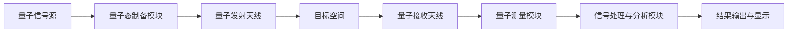

# 如何评估企业的量子雷达隐身探测技术潜力

> 关键词：量子雷达；隐身探测技术；企业潜力评估；量子技术应用；雷达性能指标

> 摘要：本文聚焦于如何评估企业在量子雷达隐身探测技术方面的潜力。首先介绍了量子雷达隐身探测技术的背景知识，包括目的、适用读者群体、文档结构和相关术语。接着阐述了核心概念及其联系，通过文本示意图和Mermaid流程图进行展示。详细讲解了核心算法原理，并用Python代码进行说明，同时给出了相关的数学模型和公式。在项目实战部分，提供了开发环境搭建、源代码实现与解读。分析了该技术的实际应用场景，推荐了学习资源、开发工具框架和相关论文著作。最后总结了未来发展趋势与挑战，解答了常见问题，并提供了扩展阅读和参考资料，旨在为评估企业的量子雷达隐身探测技术潜力提供全面且深入的指导。

## 1. 背景介绍 
### 1.1 目的和范围
量子雷达隐身探测技术作为新兴的前沿技术，在军事和民用领域都具有巨大的应用潜力。评估企业在该技术领域的潜力，有助于投资者判断投资价值，行业监管者了解行业发展态势，企业自身明确发展方向和竞争力。本文的范围涵盖了从量子雷达隐身探测技术的基本概念、算法原理、数学模型到实际应用等多个方面，旨在全面且系统地为评估企业技术潜力提供方法和依据。

### 1.2 预期读者
本文预期读者包括对量子雷达隐身探测技术感兴趣的投资者、行业分析师、企业管理者、科研人员以及相关专业的学生。投资者可以借助本文的评估方法来筛选有潜力的投资项目；行业分析师可用于撰写行业研究报告；企业管理者能通过评估自身和竞争对手的潜力来制定战略决策；科研人员可以在评估的基础上开展合作或技术交流；学生则可将其作为学习和了解该领域的参考资料。

### 1.3 文档结构概述
本文首先介绍量子雷达隐身探测技术的背景知识，包括目的、读者群体、结构和术语。接着阐述核心概念和联系，通过文本示意图和流程图展示。然后详细讲解核心算法原理和操作步骤，给出数学模型和公式。在项目实战部分，介绍开发环境搭建、源代码实现与解读。分析实际应用场景，推荐学习资源、开发工具框架和相关论文著作。最后总结未来发展趋势与挑战，解答常见问题，并提供扩展阅读和参考资料。

### 1.4 术语表
#### 1.4.1 核心术语定义
- **量子雷达**：基于量子力学原理，利用量子态作为信息载体来实现目标探测的雷达系统。它具有更高的灵敏度、分辨率和抗干扰能力。
- **隐身探测**：通过各种技术手段检测和识别具有隐身特性的目标，如隐身飞机、舰艇等。
- **量子纠缠**：是一种量子力学现象，处于纠缠态的两个或多个量子系统之间存在一种特殊的关联，无论它们之间的距离有多远，对其中一个系统的测量会瞬间影响到另一个系统的状态。
- **量子态**：量子系统的状态，通常用波函数来描述，它包含了量子系统所有可测量的信息。

#### 1.4.2 相关概念解释
- **量子噪声**：量子系统中由于量子涨落等原因产生的噪声，它会影响量子雷达的探测性能。
- **目标散射截面（RCS）**：衡量目标对雷达波散射能力的物理量，隐身目标通常具有较小的RCS。
- **量子密钥分发（QKD）**：一种基于量子力学原理的安全通信方法，可用于量子雷达的数据传输加密。

#### 1.4.3 缩略词列表
- **RCS**：Radar Cross Section（目标散射截面）
- **QKD**：Quantum Key Distribution（量子密钥分发）
- **SNR**：Signal - to - Noise Ratio（信噪比）

## 2. 核心概念与联系 
### 核心概念原理
量子雷达隐身探测技术的核心在于利用量子态的特殊性质来实现对隐身目标的有效探测。量子雷达主要基于以下几种量子特性：
- **量子纠缠**：量子雷达可以利用纠缠态的量子对进行探测。当其中一个量子与目标相互作用时，另一个量子的状态会发生相应的变化。通过测量这个变化，可以获取目标的信息，如位置、速度等。由于纠缠态的非局域性和相关性，量子雷达能够突破传统雷达的一些限制，提高探测的灵敏度和分辨率。
- **量子叠加**：量子态可以处于多个状态的叠加态。在量子雷达中，可以利用量子叠加态来同时对多个目标进行探测。通过对叠加态的测量和分析，可以在一次测量中获取多个目标的信息，大大提高了雷达的探测效率。

### 架构的文本示意图
```plaintext
量子雷达隐身探测系统架构

|------------------|
| 量子信号源       |
|------------------|
| 量子态制备模块   |
|------------------|
| 量子发射天线     |
|------------------|
| 目标空间         |
|------------------|
| 量子接收天线     |
|------------------|
| 量子测量模块     |
|------------------|
| 信号处理与分析模块|
|------------------|
| 结果输出与显示   |
|------------------|
```

### Mermaid 流程图


## 3. 核心算法原理 & 具体操作步骤 
### 核心算法原理
量子雷达隐身探测技术中一个重要的算法是基于量子态估计的目标检测算法。该算法的核心思想是通过对接收的量子态进行估计，判断目标是否存在以及目标的相关参数。

假设量子雷达发射的量子态为 $\vert\psi_{in}\rangle$，经过目标散射后接收到的量子态为 $\vert\psi_{out}\rangle$。我们可以通过测量 $\vert\psi_{out}\rangle$ 来获取目标的信息。

### 具体操作步骤
1. **量子态制备**：从量子信号源产生初始量子态，并通过量子态制备模块将其制备成所需的量子态 $\vert\psi_{in}\rangle$。
2. **发射量子信号**：使用量子发射天线将制备好的量子态 $\vert\psi_{in}\rangle$ 发射到目标空间。
3. **接收量子信号**：量子接收天线接收经过目标散射后的量子态 $\vert\psi_{out}\rangle$。
4. **量子测量**：量子测量模块对接收的量子态 $\vert\psi_{out}\rangle$ 进行测量，得到测量结果。
5. **信号处理与分析**：信号处理与分析模块根据测量结果，利用量子态估计算法对目标进行检测和参数估计。
6. **结果输出与显示**：将检测结果和目标参数输出并显示。

### Python 代码实现
```python
import numpy as np

# 定义量子态制备函数
def prepare_quantum_state():
    # 这里简单假设制备一个两能级的量子态
    psi_in = np.array([1, 0])
    return psi_in

# 定义目标散射函数
def target_scattering(psi_in):
    # 这里简单模拟目标散射，使用一个随机的酉矩阵
    U = np.array([[np.cos(np.pi/4), -np.sin(np.pi/4)], [np.sin(np.pi/4), np.cos(np.pi/4)]])
    psi_out = np.dot(U, psi_in)
    return psi_out

# 定义量子测量函数
def quantum_measurement(psi_out):
    # 测量结果的概率分布
    probabilities = np.abs(psi_out)**2
    # 根据概率分布进行测量
    measurement_result = np.random.choice([0, 1], p=probabilities)
    return measurement_result

# 主函数
def main():
    # 量子态制备
    psi_in = prepare_quantum_state()
    # 目标散射
    psi_out = target_scattering(psi_in)
    # 量子测量
    result = quantum_measurement(psi_out)
    print(f"测量结果: {result}")

if __name__ == "__main__":
    main()
```

## 4. 数学模型和公式 & 详细讲解 & 举例说明 
### 量子态表示
在量子力学中，量子态通常用希尔伯特空间中的向量来表示。对于一个两能级的量子系统，其量子态可以表示为：

$$\vert\psi\rangle = \alpha\vert0\rangle+\beta\vert1\rangle$$

其中，$\vert0\rangle$ 和 $\vert1\rangle$ 是基态，$\alpha$ 和 $\beta$ 是复数，且满足 $\vert\alpha\vert^2+\vert\beta\vert^2 = 1$。$\vert\alpha\vert^2$ 和 $\vert\beta\vert^2$ 分别表示测量得到 $\vert0\rangle$ 和 $\vert1\rangle$ 的概率。

### 量子态演化
量子态的演化可以用酉变换来描述。假设一个量子态 $\vert\psi(t_1)\rangle$ 在时间 $t_1$ 到 $t_2$ 之间的演化可以表示为：

$$\vert\psi(t_2)\rangle = U(t_2, t_1)\vert\psi(t_1)\rangle$$

其中，$U(t_2, t_1)$ 是一个酉矩阵，满足 $U^{\dagger}U = I$，$U^{\dagger}$ 是 $U$ 的共轭转置，$I$ 是单位矩阵。

### 量子测量
量子测量是量子力学中的一个重要概念。当对一个量子态 $\vert\psi\rangle$ 进行测量时，测量结果是某个基态，且测量得到基态 $\vert i\rangle$ 的概率为：

$$P(i)=\vert\langle i\vert\psi\rangle\vert^2$$

### 举例说明
假设一个两能级的量子态 $\vert\psi\rangle=\frac{1}{\sqrt{2}}\vert0\rangle+\frac{1}{\sqrt{2}}\vert1\rangle$。当对这个量子态进行测量时，测量得到 $\vert0\rangle$ 的概率为：

$$P(0)=\vert\langle 0\vert\psi\rangle\vert^2=\left\vert\frac{1}{\sqrt{2}}\langle 0\vert0\rangle+\frac{1}{\sqrt{2}}\langle 0\vert1\rangle\right\vert^2=\frac{1}{2}$$

测量得到 $\vert1\rangle$ 的概率为：

$$P(1)=\vert\langle 1\vert\psi\rangle\vert^2=\left\vert\frac{1}{\sqrt{2}}\langle 1\vert0\rangle+\frac{1}{\sqrt{2}}\langle 1\vert1\rangle\right\vert^2=\frac{1}{2}$$

## 5. 项目实战：代码实际案例和详细解释说明 
### 5.1  开发环境搭建
#### 硬件环境
- **计算机**：建议使用性能较好的计算机，如配备多核处理器、较大内存（至少16GB）和高速硬盘的台式机或笔记本电脑。
- **量子计算模拟器**：可以使用一些开源的量子计算模拟器，如Qiskit、Cirq等。这些模拟器可以在普通计算机上模拟量子计算的过程。

#### 软件环境
- **操作系统**：推荐使用Linux或Windows操作系统。
- **编程语言**：Python是开发量子雷达相关算法的首选语言，因为它有丰富的科学计算库和量子计算库。
- **开发工具**：可以使用Jupyter Notebook进行代码开发和调试，它具有交互式的编程环境，方便代码的编写和测试。

### 5.2  源代码详细实现和代码解读
```python
import numpy as np
from qiskit import QuantumCircuit, Aer, execute

# 定义量子态制备函数
def prepare_quantum_state():
    # 创建一个单量子比特的量子电路
    circuit = QuantumCircuit(1)
    # 制备一个初始量子态，这里制备一个|+>态
    circuit.h(0)
    return circuit

# 定义目标散射函数
def target_scattering(circuit):
    # 模拟目标散射，使用一个相位门
    circuit.p(np.pi/4, 0)
    return circuit

# 定义量子测量函数
def quantum_measurement(circuit):
    # 添加测量操作
    circuit.measure_all()
    # 使用Qiskit的模拟器进行模拟
    simulator = Aer.get_backend('qasm_simulator')
    job = execute(circuit, simulator, shots=1000)
    result = job.result()
    counts = result.get_counts(circuit)
    return counts

# 主函数
def main():
    # 量子态制备
    circuit = prepare_quantum_state()
    # 目标散射
    circuit = target_scattering(circuit)
    # 量子测量
    counts = quantum_measurement(circuit)
    print(f"测量结果: {counts}")

if __name__ == "__main__":
    main()
```

### 代码解读与分析
- **量子态制备函数 `prepare_quantum_state()`**：使用Qiskit创建一个单量子比特的量子电路，并通过Hadamard门将量子比特制备成 $\vert+\rangle$ 态，即 $\frac{1}{\sqrt{2}}(\vert0\rangle+\vert1\rangle)$。
- **目标散射函数 `target_scattering(circuit)`**：模拟目标散射的过程，使用一个相位门对量子比特进行操作，改变其相位。
- **量子测量函数 `quantum_measurement(circuit)`**：在量子电路中添加测量操作，然后使用Qiskit的模拟器进行模拟。设置模拟的次数为1000次，最后得到测量结果的统计分布。
- **主函数 `main()`**：依次调用量子态制备、目标散射和量子测量函数，并打印测量结果。

## 6. 实际应用场景 
### 军事领域
- **防空预警**：量子雷达隐身探测技术可以提高对隐身飞机、导弹等目标的探测能力，为防空系统提供更准确的预警信息。传统雷达在探测隐身目标时存在很大的局限性，而量子雷达利用量子特性能够突破这些限制，更早地发现目标。
- **海上侦察**：在海洋环境中，量子雷达可以用于探测隐身舰艇和潜艇。通过对量子信号的分析，能够更准确地识别目标的类型和位置，为海上作战提供有力支持。

### 民用领域
- **航空交通管制**：在繁忙的航空交通中，量子雷达可以提高对飞机的探测精度和可靠性，减少空中交通冲突的发生。特别是在复杂气象条件下，量子雷达的优势更加明显。
- **气象监测**：量子雷达可以用于监测大气中的微小颗粒和水汽等，提高气象预报的准确性。通过对量子信号与大气中物质的相互作用进行分析，能够获取更详细的气象信息。

## 7. 工具和资源推荐
### 7.1 学习资源推荐
#### 7.1.1 书籍推荐
- 《量子力学原理》（P. A. M. 狄拉克著）：经典的量子力学教材，深入讲解了量子力学的基本原理和数学方法。
- 《量子计算与量子信息》（Michael A. Nielsen和Isaac L. Chuang著）：全面介绍了量子计算和量子信息的理论和应用，是学习量子雷达相关知识的重要参考书籍。

#### 7.1.2 在线课程
- Coursera上的“Quantum Mechanics for Scientists and Engineers”：由专业教授授课，系统地介绍了量子力学的基础知识和应用。
- edX上的“Quantum Computing Fundamentals”：讲解了量子计算的基本概念和算法，适合初学者入门。

#### 7.1.3 技术博客和网站
- Quantum Computing Report：提供量子计算领域的最新新闻、研究成果和行业动态。
- Qiskit官方博客：分享Qiskit量子计算框架的使用技巧和案例。

### 7.2 开发工具框架推荐
#### 7.2.1 IDE和编辑器
- Jupyter Notebook：交互式的编程环境，适合进行量子算法的开发和调试。
- PyCharm：功能强大的Python集成开发环境，支持代码自动补全、调试等功能。

#### 7.2.2 调试和性能分析工具
- Qiskit Aer：Qiskit的模拟器，可用于模拟量子电路的运行和调试。
- TensorBoard：用于可视化量子算法的训练过程和性能指标。

#### 7.2.3 相关框架和库
- Qiskit：开源的量子计算框架，提供了丰富的量子算法和工具。
- Cirq：Google开发的量子计算框架，支持量子电路的设计和模拟。

### 7.3 相关论文著作推荐
#### 7.3.1 经典论文
- “Quantum Radar”（S. Lloyd著）：首次提出了量子雷达的概念，并阐述了其基本原理和优势。
- “Quantum Entanglement and Its Applications in Radar Systems”：研究了量子纠缠在雷达系统中的应用，为量子雷达的发展提供了理论基础。

#### 7.3.2 最新研究成果
- 可以关注IEEE Transactions on Quantum Engineering、Physical Review A等期刊上的相关论文，了解量子雷达隐身探测技术的最新研究进展。

#### 7.3.3 应用案例分析
- 一些军事研究机构和企业会发布关于量子雷达在实际应用中的案例分析报告，可以通过相关渠道获取这些资料，了解量子雷达的实际应用效果和面临的挑战。

## 8. 总结：未来发展趋势与挑战
### 未来发展趋势
- **技术融合**：量子雷达隐身探测技术将与人工智能、大数据等技术深度融合。通过人工智能算法对量子雷达采集的数据进行分析和处理，可以提高目标识别的准确性和效率。大数据技术则可以为量子雷达的训练和优化提供丰富的数据支持。
- **小型化和集成化**：随着量子技术的不断发展，量子雷达有望实现小型化和集成化。这将使其能够应用于更多的平台，如无人机、卫星等，扩大其应用范围。
- **国际合作加强**：量子雷达隐身探测技术是一个全球性的研究领域，各国之间的合作将不断加强。通过国际合作，可以共享研究资源和技术成果，加快技术的发展和应用。

### 挑战
- **技术难题**：目前量子雷达隐身探测技术还面临一些技术难题，如量子态的制备和保持、量子噪声的抑制等。这些问题需要进一步的研究和技术突破。
- **成本高昂**：量子雷达的研发和制造成本非常高，这限制了其大规模的应用和推广。降低成本是未来需要解决的一个重要问题。
- **人才短缺**：量子雷达隐身探测技术是一个新兴的交叉学科领域，需要既懂量子力学又懂雷达技术的复合型人才。目前这类人才非常短缺，培养和吸引相关人才是行业发展的关键。

## 9. 附录：常见问题与解答
### 问题1：量子雷达与传统雷达有什么区别？
解答：量子雷达基于量子力学原理，利用量子态作为信息载体，而传统雷达使用经典电磁波作为信息载体。量子雷达具有更高的灵敏度、分辨率和抗干扰能力，能够探测到传统雷达难以发现的隐身目标。

### 问题2：量子雷达隐身探测技术的可靠性如何？
解答：目前量子雷达隐身探测技术仍处于研究和发展阶段，其可靠性还需要进一步提高。在实际应用中，还存在量子态的退相干、量子噪声等问题，这些问题会影响量子雷达的探测性能。随着技术的不断进步，量子雷达的可靠性将逐步提高。

### 问题3：企业在量子雷达隐身探测技术方面的研发周期一般有多长？
解答：企业的研发周期受到多种因素的影响，如技术基础、研发投入、人才团队等。一般来说，从技术研发到产品应用可能需要5 - 10年甚至更长的时间。在这个过程中，需要不断进行实验和验证，解决各种技术难题。

## 10. 扩展阅读 & 参考资料
### 扩展阅读
- 《量子技术前沿》：介绍了量子技术在各个领域的最新研究成果和应用前景。
- 《雷达技术发展趋势》：探讨了雷达技术的发展方向和面临的挑战。

### 参考资料
- 相关的学术期刊论文，如IEEE Transactions on Aerospace and Electronic Systems、Physical Review Letters等。
- 企业发布的技术报告和产品资料。
- 政府部门和行业协会发布的相关政策和研究报告。

作者：AI天才研究院/AI Genius Institute & 禅与计算机程序设计艺术 /Zen And The Art of Computer Programming