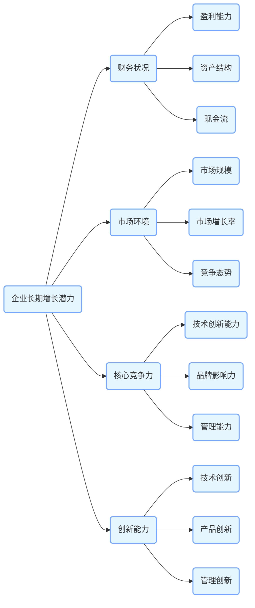

# 如何评估企业的长期增长潜力

> 关键词：企业长期增长潜力、评估方法、财务指标、市场环境、核心竞争力

> 摘要：本文旨在深入探讨如何评估企业的长期增长潜力。通过对企业所处背景的分析，阐述评估的目的、范围、预期读者以及文档结构。详细介绍核心概念，包括各关键因素之间的联系，并给出相应的示意图和流程图。运用Python代码解释核心算法原理及操作步骤，结合数学模型和公式进行详细讲解与举例。通过项目实战展示实际案例及代码解读。分析企业长期增长潜力在不同场景下的实际应用，推荐相关的学习资源、开发工具框架以及论文著作。最后总结未来发展趋势与挑战，解答常见问题，并提供扩展阅读和参考资料，为评估企业长期增长潜力提供全面且深入的指导。

## 1. 背景介绍 
### 1.1 目的和范围
评估企业的长期增长潜力具有重要的现实意义。对于投资者而言，准确评估企业的长期增长潜力有助于做出明智的投资决策，选择具有较高投资回报率的企业；对于企业管理者来说，能够清晰了解自身企业的优势与不足，从而制定合理的发展战略，提升企业的竞争力和市场地位；对于行业研究者，有助于深入了解行业内企业的发展态势，为行业发展趋势的研究提供依据。

本文章的范围涵盖了评估企业长期增长潜力的多个方面，包括企业的财务状况、市场环境、核心竞争力、创新能力等关键因素。通过综合分析这些因素，构建一个全面、系统的评估体系。

### 1.2 预期读者
本文的预期读者主要包括投资者，无论是个人投资者还是机构投资者，都可以从本文中获取评估企业长期增长潜力的方法和思路，以便更好地进行投资决策；企业管理者能够借鉴本文的评估方法，对企业进行自我评估，制定科学的发展战略；行业分析师和研究人员可以将本文作为研究行业内企业发展情况的参考资料。

### 1.3 文档结构概述
本文首先介绍评估企业长期增长潜力的背景，包括目的、范围、预期读者和文档结构概述。接着阐述核心概念，明确各关键因素的定义以及它们之间的联系，并通过示意图和流程图进行直观展示。然后详细讲解核心算法原理和具体操作步骤，结合Python代码进行说明。之后介绍相关的数学模型和公式，并举例说明其应用。通过项目实战展示实际案例，包括开发环境搭建、源代码实现和代码解读。分析企业长期增长潜力在不同场景下的实际应用。推荐相关的学习资源、开发工具框架和论文著作。最后总结未来发展趋势与挑战，解答常见问题，并提供扩展阅读和参考资料。

### 1.4 术语表
#### 1.4.1 核心术语定义
- **企业长期增长潜力**：指企业在未来较长一段时间内，通过自身的经营和发展，实现营业收入、利润、市场份额等关键指标持续增长的能力。
- **财务指标**：用于衡量企业财务状况和经营成果的一系列数据，如净利润、营业收入增长率、资产负债率等。
- **市场环境**：企业所处的市场的各种因素的总和，包括市场规模、市场增长率、竞争态势等。
- **核心竞争力**：企业所拥有的独特的、能够为企业带来竞争优势的资源和能力，如技术创新能力、品牌影响力、管理能力等。

#### 1.4.2 相关概念解释
- **可持续增长率**：指企业在不增发新股并保持当前经营效率和财务政策的条件下，所能实现的长期增长率。它反映了企业基于自身内部资源的增长能力。
- **行业生命周期**：行业从诞生到衰退的整个过程，通常分为导入期、成长期、成熟期和衰退期。不同阶段的行业特点和企业面临的机遇与挑战不同。

#### 1.4.3 缩略词列表
- **ROE**：Return on Equity，净资产收益率，反映股东权益的收益水平。
- **EPS**：Earnings Per Share，每股收益，是测定股票投资价值的重要指标之一。

## 2. 核心概念与联系 
### 核心概念原理
评估企业的长期增长潜力需要综合考虑多个核心概念，这些概念相互关联，共同影响企业的长期发展。

#### 财务状况
企业的财务状况是评估其长期增长潜力的重要基础。良好的财务状况表现为稳定的盈利能力、合理的资产结构和充足的现金流。盈利能力可以通过净利润、毛利率、净利率等指标来衡量；资产结构反映了企业资产的配置情况，合理的资产结构有助于提高企业的运营效率；现金流则是企业生存和发展的血液，充足的现金流能够保证企业的正常运营和投资活动。

#### 市场环境
市场环境对企业的长期增长潜力有着重要的影响。市场规模的大小决定了企业的发展空间，市场增长率反映了市场的发展趋势。如果企业所处的市场规模不断扩大，增长率较高，那么企业就有更多的机会实现增长。此外，市场竞争态势也会影响企业的增长，激烈的竞争可能会压缩企业的利润空间，而良好的竞争格局则有利于企业的发展。

#### 核心竞争力
核心竞争力是企业长期增长的关键因素。它使企业能够在市场竞争中脱颖而出，获得持续的竞争优势。核心竞争力可以体现在多个方面，如技术创新能力、品牌影响力、管理能力等。具有强大核心竞争力的企业能够不断推出新产品、新服务，满足市场需求，提高市场份额。

#### 创新能力
创新能力是企业保持长期增长的动力源泉。在快速变化的市场环境中，企业只有不断创新，才能适应市场的需求，保持竞争优势。创新包括技术创新、产品创新、管理创新等多个方面。通过创新，企业可以提高生产效率、降低成本、开发新的市场。

### 架构的文本示意图
```plaintext
企业长期增长潜力
|-- 财务状况
|   |-- 盈利能力
|   |-- 资产结构
|   |-- 现金流
|-- 市场环境
|   |-- 市场规模
|   |-- 市场增长率
|   |-- 竞争态势
|-- 核心竞争力
|   |-- 技术创新能力
|   |-- 品牌影响力
|   |-- 管理能力
|-- 创新能力
|   |-- 技术创新
|   |-- 产品创新
|   |-- 管理创新
```

### Mermaid 流程图


## 3. 核心算法原理 & 具体操作步骤 
### 核心算法原理
我们可以通过构建一个综合评估模型来评估企业的长期增长潜力。该模型将财务状况、市场环境、核心竞争力和创新能力等因素进行量化，然后根据各因素的权重计算出企业的综合得分。

具体来说，我们可以采用加权平均的方法，将每个因素的得分乘以其对应的权重，然后相加得到综合得分。公式如下：

$$S = w_1F + w_2M + w_3C + w_4I$$

其中，$S$ 表示企业的综合得分，$F$ 表示财务状况得分，$M$ 表示市场环境得分，$C$ 表示核心竞争力得分，$I$ 表示创新能力得分，$w_1$、$w_2$、$w_3$、$w_4$ 分别表示各因素的权重，且 $w_1 + w_2 + w_3 + w_4 = 1$。

### 具体操作步骤
#### 步骤 1：数据收集
收集企业的财务数据、市场环境数据、核心竞争力相关数据和创新能力相关数据。财务数据可以从企业的财务报表中获取，市场环境数据可以通过市场调研机构、行业报告等渠道获取，核心竞争力和创新能力相关数据可以通过企业的官方网站、新闻报道、行业分析等途径获取。

#### 步骤 2：指标量化
将收集到的数据转化为具体的指标得分。例如，对于财务状况，可以根据净利润增长率、资产负债率等指标进行量化；对于市场环境，可以根据市场规模增长率、市场份额等指标进行量化；对于核心竞争力，可以根据专利数量、品牌价值等指标进行量化；对于创新能力，可以根据研发投入占比、新产品推出速度等指标进行量化。

#### 步骤 3：确定权重
根据各因素对企业长期增长潜力的重要程度，确定各因素的权重。权重的确定可以采用专家打分法、层次分析法等方法。

#### 步骤 4：计算综合得分
根据上述公式，将各因素的得分乘以其对应的权重，然后相加得到企业的综合得分。

#### 步骤 5：评估结果分析
根据企业的综合得分，对企业的长期增长潜力进行评估。得分越高，说明企业的长期增长潜力越大。

### Python 源代码实现
```python
# 定义各因素的得分
financial_score = 80  # 财务状况得分
market_score = 70  # 市场环境得分
competence_score = 85  # 核心竞争力得分
innovation_score = 75  # 创新能力得分

# 定义各因素的权重
w1 = 0.3  # 财务状况权重
w2 = 0.2  # 市场环境权重
w3 = 0.3  # 核心竞争力权重
w4 = 0.2  # 创新能力权重

# 计算综合得分
composite_score = w1 * financial_score + w2 * market_score + w3 * competence_score + w4 * innovation_score

print(f"企业的综合得分: {composite_score}")
```

## 4. 数学模型和公式 & 详细讲解 & 举例说明 
### 数学模型
如前文所述，我们采用的数学模型是加权平均模型：

$$S = w_1F + w_2M + w_3C + w_4I$$

### 公式详细讲解
- $S$：企业的综合得分，反映了企业的长期增长潜力。得分越高，说明企业在财务状况、市场环境、核心竞争力和创新能力等方面的综合表现越好，长期增长潜力越大。
- $F$：财务状况得分，通过对企业的盈利能力、资产结构、现金流等财务指标进行量化得到。财务状况是企业生存和发展的基础，良好的财务状况有助于企业实现长期增长。
- $M$：市场环境得分，根据市场规模、市场增长率、竞争态势等市场环境指标进行量化。市场环境对企业的发展有着重要的影响，一个有利的市场环境能够为企业提供更多的发展机会。
- $C$：核心竞争力得分，基于企业的技术创新能力、品牌影响力、管理能力等核心竞争力指标进行量化。核心竞争力是企业在市场竞争中脱颖而出的关键因素，具有强大核心竞争力的企业能够实现持续增长。
- $I$：创新能力得分，通过研发投入占比、新产品推出速度等创新能力指标进行量化。创新能力是企业保持长期增长的动力源泉，不断创新能够使企业适应市场变化，提高竞争力。
- $w_1$、$w_2$、$w_3$、$w_4$：分别为财务状况、市场环境、核心竞争力和创新能力的权重。权重的大小反映了各因素对企业长期增长潜力的重要程度。

### 举例说明
假设我们要评估两家企业 A 和 B 的长期增长潜力。经过数据收集和指标量化，得到以下数据：

| 企业 | 财务状况得分 ($F$) | 市场环境得分 ($M$) | 核心竞争力得分 ($C$) | 创新能力得分 ($I$) |
| ---- | ------------------ | ------------------ | -------------------- | ------------------ |
| A    | 80                 | 70                 | 85                   | 75                 |
| B    | 75                 | 75                 | 80                   | 80                 |

假设各因素的权重分别为 $w_1 = 0.3$，$w_2 = 0.2$，$w_3 = 0.3$，$w_4 = 0.2$。

对于企业 A：
$$
\begin{align*}
S_A &= 0.3\times80 + 0.2\times70 + 0.3\times85 + 0.2\times75\\
&= 24 + 14 + 25.5 + 15\\
&= 78.5
\end{align*}
$$

对于企业 B：
$$
\begin{align*}
S_B &= 0.3\times75 + 0.2\times75 + 0.3\times80 + 0.2\times80\\
&= 22.5 + 15 + 24 + 16\\
&= 77.5
\end{align*}
$$

通过比较两家企业的综合得分，我们可以看出企业 A 的长期增长潜力略大于企业 B。

## 5. 项目实战：代码实际案例和详细解释说明 
### 5.1  开发环境搭建
#### 安装 Python
首先，需要安装 Python 环境。可以从 Python 官方网站（https://www.python.org/downloads/）下载适合自己操作系统的 Python 版本，并按照安装向导进行安装。

#### 安装必要的库
在本项目中，我们主要使用 Python 的基本库，无需额外安装其他库。如果需要进行数据处理和分析，可以安装 Pandas、Numpy 等库。安装命令如下：
```sh
pip install pandas numpy
```

### 5.2  源代码详细实现和代码解读
```python
# 定义函数来计算企业的综合得分
def calculate_composite_score(financial_score, market_score, competence_score, innovation_score,
                              w1=0.3, w2=0.2, w3=0.3, w4=0.2):
    """
    计算企业的综合得分
    :param financial_score: 财务状况得分
    :param market_score: 市场环境得分
    :param competence_score: 核心竞争力得分
    :param innovation_score: 创新能力得分
    :param w1: 财务状况权重
    :param w2: 市场环境权重
    :param w3: 核心竞争力权重
    :param w4: 创新能力权重
    :return: 企业的综合得分
    """
    composite_score = w1 * financial_score + w2 * market_score + w3 * competence_score + w4 * innovation_score
    return composite_score

# 定义企业的数据
company_A = {
    "financial_score": 80,
    "market_score": 70,
    "competence_score": 85,
    "innovation_score": 75
}

company_B = {
    "financial_score": 75,
    "market_score": 75,
    "competence_score": 80,
    "innovation_score": 80
}

# 计算企业 A 的综合得分
score_A = calculate_composite_score(company_A["financial_score"], company_A["market_score"],
                                    company_A["competence_score"], company_A["innovation_score"])

# 计算企业 B 的综合得分
score_B = calculate_composite_score(company_B["financial_score"], company_B["market_score"],
                                    company_B["competence_score"], company_B["innovation_score"])

# 输出结果
print(f"企业 A 的综合得分: {score_A}")
print(f"企业 B 的综合得分: {score_B}")

if score_A > score_B:
    print("企业 A 的长期增长潜力大于企业 B")
else:
    print("企业 B 的长期增长潜力大于企业 A")
```

### 代码解读与分析
- **函数定义**：`calculate_composite_score` 函数接受四个得分参数和四个权重参数，根据加权平均公式计算企业的综合得分。
- **数据定义**：使用字典 `company_A` 和 `company_B` 分别存储两家企业的财务状况、市场环境、核心竞争力和创新能力得分。
- **得分计算**：调用 `calculate_composite_score` 函数分别计算企业 A 和企业 B 的综合得分。
- **结果输出**：打印两家企业的综合得分，并比较它们的大小，输出具有更大长期增长潜力的企业。

通过这个代码案例，我们可以清晰地看到如何使用 Python 实现企业长期增长潜力的评估。

## 6. 实际应用场景 
### 投资决策
投资者在选择投资标的时，需要评估企业的长期增长潜力。通过对企业的财务状况、市场环境、核心竞争力和创新能力等因素进行综合评估，可以筛选出具有较高增长潜力的企业进行投资。例如，价值投资者会关注企业的财务指标和核心竞争力，寻找被低估但具有长期增长潜力的企业；成长型投资者则更注重企业的市场增长率和创新能力，投资于具有高增长潜力的新兴企业。

### 企业战略规划
企业管理者在制定战略规划时，需要了解自身企业的长期增长潜力。通过评估企业的优势和劣势，明确企业在市场中的定位，从而制定出符合企业实际情况的发展战略。例如，如果企业的核心竞争力在于技术创新，那么可以加大研发投入，推出更多的新产品，以提高市场份额；如果企业所处的市场环境竞争激烈，那么可以考虑通过并购、合作等方式扩大规模，增强竞争力。

### 行业分析
行业分析师在研究行业发展趋势时，需要对行业内企业的长期增长潜力进行评估。通过比较不同企业的增长潜力，可以了解行业内的竞争格局和发展趋势，为行业研究提供数据支持。例如，分析师可以通过评估行业内企业的市场份额增长率、创新能力等指标，判断行业是否处于成长期，以及哪些企业具有成为行业领导者的潜力。

## 7. 工具和资源推荐
### 7.1 学习资源推荐
#### 7.1.1 书籍推荐
- 《财务报表分析与股票估值》：本书详细介绍了如何通过分析企业的财务报表来评估企业的价值和增长潜力，是投资者和财务分析人员的必备书籍。
- 《竞争战略》：作者迈克尔·波特提出了著名的五力模型和三种基本竞争战略，对于理解企业的核心竞争力和市场竞争态势具有重要的指导意义。
- 《创新者的窘境》：探讨了创新对企业发展的重要性以及企业在创新过程中面临的挑战，帮助读者了解创新能力对企业长期增长的影响。

#### 7.1.2 在线课程
- Coursera 上的“财务分析与决策”课程：由知名教授授课，系统地介绍了财务分析的方法和技巧，有助于提高读者对企业财务状况的评估能力。
- edX 上的“战略管理”课程：讲解了企业战略规划的理论和实践，帮助读者了解如何制定企业的发展战略。

#### 7.1.3 技术博客和网站
- 雪球网：一个专注于投资领域的社区，提供了大量的企业分析报告和投资经验分享，有助于读者了解企业的实际情况和市场动态。
- 36氪：关注科技创新和创业领域，发布了许多关于新兴企业的报道和分析，对于了解企业的创新能力和市场潜力有很大帮助。

### 7.2 开发工具框架推荐
#### 7.2.1 IDE和编辑器
- PyCharm：一款专业的 Python 集成开发环境，具有强大的代码编辑、调试和分析功能，适合开发 Python 项目。
- Jupyter Notebook：一个交互式的开发环境，支持 Python 代码的编写、运行和可视化，非常适合进行数据处理和分析。

#### 7.2.2 调试和性能分析工具
- PDB：Python 自带的调试工具，可以帮助开发者定位代码中的错误和问题。
- cProfile：Python 的性能分析工具，可以分析代码的运行时间和资源消耗情况，帮助开发者优化代码性能。

#### 7.2.3 相关框架和库
- Pandas：一个强大的数据处理和分析库，提供了丰富的数据结构和函数，方便进行数据清洗、转换和分析。
- Numpy：一个用于科学计算的 Python 库，提供了高效的数组操作和数学函数，有助于提高代码的运行效率。

### 7.3 相关论文著作推荐
#### 7.3.1 经典论文
- “The Theory of the Growth of the Firm” by Edith Penrose：该论文提出了企业成长理论，强调了企业内部资源和能力对企业增长的重要性。
- “Competitive Advantage: Creating and Sustaining Superior Performance” by Michael Porter：详细阐述了企业如何通过建立竞争优势来实现持续增长。

#### 7.3.2 最新研究成果
- 可以关注《Management Science》、《Strategic Management Journal》等顶级学术期刊，获取关于企业增长潜力评估的最新研究成果。

#### 7.3.3 应用案例分析
- 《哈佛商业评论》上发表了许多企业案例分析文章，通过实际案例展示了企业如何评估自身的增长潜力并制定相应的发展战略。

## 8. 总结：未来发展趋势与挑战
### 未来发展趋势
- **数字化转型加速**：随着信息技术的快速发展，企业将加快数字化转型的步伐。数字化转型将提高企业的运营效率、创新能力和市场响应速度，从而提升企业的长期增长潜力。例如，企业可以通过大数据分析更好地了解市场需求，通过人工智能技术优化生产流程。
- **绿色可持续发展成为主流**：消费者对环保和可持续发展的关注度不断提高，企业将越来越重视绿色可持续发展。实施绿色战略的企业将更容易获得消费者的认可和政府的支持，从而在市场竞争中占据优势。例如，一些企业通过研发和生产环保产品，不仅满足了市场需求，还提升了企业的品牌形象。
- **跨界融合加剧**：不同行业之间的界限将越来越模糊，企业将通过跨界融合实现多元化发展。跨界融合可以整合不同行业的资源和优势，创造新的商业模式和增长点。例如，科技企业与传统制造业的融合，将推动智能制造的发展。

### 挑战
- **技术变革带来的挑战**：快速的技术变革要求企业不断更新技术和知识，否则将面临被市场淘汰的风险。企业需要加大研发投入，培养和吸引高素质的技术人才，以适应技术变革的需求。
- **市场竞争加剧**：随着市场的全球化和竞争的加剧，企业面临着来自国内外的激烈竞争。企业需要不断提升自身的核心竞争力，降低成本，提高产品和服务质量，以在市场竞争中脱颖而出。
- **人才短缺**：评估企业的长期增长潜力需要具备多方面知识和技能的人才，包括财务分析、市场研究、战略规划等。目前，市场上这类复合型人才相对短缺，企业需要加强人才培养和引进。

## 9. 附录：常见问题与解答
### 问题 1：如何确定各因素的权重？
答：确定各因素的权重可以采用多种方法。专家打分法是邀请行业专家根据各因素的重要程度进行打分，然后取平均值作为权重；层次分析法是通过构建层次结构模型，比较各因素之间的相对重要性，从而确定权重。

### 问题 2：评估企业长期增长潜力需要考虑哪些非财务因素？
答：除了财务因素外，还需要考虑市场环境、核心竞争力、创新能力等非财务因素。市场环境包括市场规模、市场增长率、竞争态势等；核心竞争力包括技术创新能力、品牌影响力、管理能力等；创新能力包括研发投入占比、新产品推出速度等。

### 问题 3：评估结果的准确性如何保证？
答：为了保证评估结果的准确性，需要收集准确、全面的数据，并采用科学合理的评估方法。同时，还需要对评估结果进行验证和调整，结合实际情况进行分析和判断。

## 10. 扩展阅读 & 参考资料
### 扩展阅读
- 《企业生命周期理论》：深入探讨了企业在不同发展阶段的特点和面临的问题，有助于更好地理解企业的长期增长过程。
- 《商业模式新生代》：介绍了商业模式的设计和创新方法，对于分析企业的商业模式和增长潜力具有重要的参考价值。

### 参考资料
- 企业的财务报表和年报
- 行业研究报告和市场调研报告
- 相关的学术论文和著作

作者：AI天才研究院/AI Genius Institute & 禅与计算机程序设计艺术 /Zen And The Art of Computer Programming