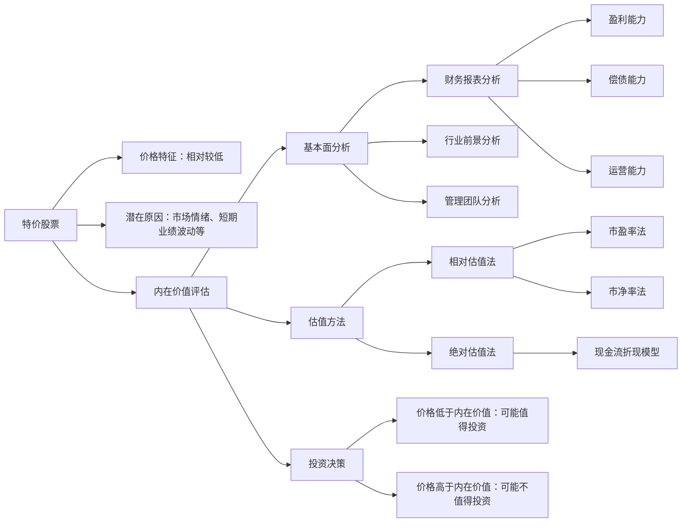

# 如何评估特价股票的内在价值

> 关键词：特价股票、内在价值评估、财务分析、估值模型、市场因素

> 摘要：本文旨在深入探讨如何评估特价股票的内在价值。通过系统介绍相关的核心概念、算法原理、数学模型，结合实际案例分析，详细阐述了评估特价股票内在价值的方法和步骤。同时，还介绍了该领域的实际应用场景、相关工具和资源，最后对未来发展趋势与挑战进行了总结，并解答了常见问题。希望能为投资者在评估特价股票时提供全面、专业的指导。

## 1. 背景介绍 
### 1.1 目的和范围
在股票市场中，特价股票往往因其价格相对较低而吸引投资者的关注。然而，价格低并不一定意味着具有投资价值，准确评估特价股票的内在价值至关重要。本文的目的是为投资者提供一套全面、系统的方法，帮助他们评估特价股票的内在价值，从而做出更明智的投资决策。本文将涵盖特价股票内在价值评估的各个方面，包括核心概念、算法原理、数学模型、实际案例分析等。

### 1.2 预期读者
本文主要面向对股票投资感兴趣的个人投资者、金融从业者以及相关领域的研究人员。无论是初学者还是有一定投资经验的人士，都能从本文中获取有价值的信息和指导。

### 1.3 文档结构概述
本文将按照以下结构进行阐述：首先介绍核心概念与联系，明确特价股票和内在价值的定义及相关关系；接着详细讲解核心算法原理和具体操作步骤，并给出Python源代码示例；然后介绍数学模型和公式，并通过举例进行说明；之后通过实际案例展示如何应用这些方法评估特价股票的内在价值；再介绍实际应用场景、工具和资源推荐；最后总结未来发展趋势与挑战，解答常见问题，并提供扩展阅读和参考资料。

### 1.4 术语表
#### 1.4.1 核心术语定义
- **特价股票**：指市场价格相对其内在价值或同行业其他股票价格较低的股票。
- **内在价值**：股票所代表的企业的真实价值，是基于企业的基本面、未来盈利能力等因素综合评估得出的价值。
- **市盈率（P/E）**：股票价格与每股收益的比率，反映了市场对企业盈利的预期。
- **市净率（P/B）**：股票价格与每股净资产的比率，衡量了股票价格相对于企业净资产的倍数。
- **现金流折现模型（DCF）**：一种通过预测企业未来现金流并将其折现到当前的估值方法。

#### 1.4.2 相关概念解释
- **基本面分析**：通过研究企业的财务报表、行业前景、管理团队等基本面因素来评估股票的内在价值。
- **技术分析**：通过研究股票价格和成交量等市场数据来预测股票未来走势。
- **相对估值法**：通过与同行业其他股票或市场平均水平进行比较来评估股票的价值。
- **绝对估值法**：通过预测企业未来的现金流、盈利等因素来直接评估股票的内在价值。

#### 1.4.3 缩略词列表
- **P/E**：Price-to-Earnings Ratio（市盈率）
- **P/B**：Price-to-Book Ratio（市净率）
- **DCF**：Discounted Cash Flow（现金流折现模型）

## 2. 核心概念与联系 
### 2.1 特价股票的定义和特征
特价股票通常具有以下特征：
- 价格相对较低：相对于同行业其他股票或其历史价格，特价股票的市场价格较低。
- 可能存在被低估的情况：由于市场情绪、短期业绩波动等原因，股票价格可能低于其内在价值。
- 具有一定的投资风险：特价股票可能存在一些潜在的问题，如企业经营不善、行业竞争激烈等，需要投资者仔细分析。

### 2.2 内在价值的概念和重要性
内在价值是股票投资的核心概念之一。它反映了股票所代表的企业的真实价值，不受市场短期波动的影响。投资者通过评估股票的内在价值，可以判断股票价格是否合理，从而做出投资决策。如果股票价格低于其内在价值，投资者可能认为该股票具有投资价值；反之，如果股票价格高于其内在价值，投资者可能会选择卖出或避免买入。

### 2.3 特价股票与内在价值的关系
特价股票并不一定意味着具有投资价值，只有当股票价格低于其内在价值时，才可能是真正的投资机会。因此，评估特价股票的内在价值是判断其是否值得投资的关键。投资者需要通过深入的基本面分析和估值方法，来确定特价股票的内在价值，并与市场价格进行比较。

### 2.4 核心概念原理和架构的文本示意图
```plaintext
特价股票
|
|-- 价格特征：相对较低
|-- 潜在原因：市场情绪、短期业绩波动等
|
|-- 内在价值评估
|   |-- 基本面分析
|   |   |-- 财务报表分析
|   |   |   |-- 盈利能力
|   |   |   |-- 偿债能力
|   |   |   |-- 运营能力
|   |   |-- 行业前景分析
|   |   |-- 管理团队分析
|   |
|   |-- 估值方法
|   |   |-- 相对估值法
|   |   |   |-- 市盈率法
|   |   |   |-- 市净率法
|   |   |-- 绝对估值法
|   |       |-- 现金流折现模型
|
|-- 投资决策
|   |-- 价格低于内在价值：可能值得投资
|   |-- 价格高于内在价值：可能不值得投资
```

### 2.5 Mermaid 流程图


## 3. 核心算法原理 & 具体操作步骤 
### 3.1 相对估值法
#### 3.1.1 市盈率法
- **算法原理**：市盈率法是通过将目标股票的市盈率与同行业其他股票或市场平均市盈率进行比较，来评估目标股票的价值。计算公式为：
$目标股票价值 = 目标股票每股收益 \times 可比公司平均市盈率$
- **具体操作步骤**：
    1. 选择可比公司：选择与目标股票处于同一行业、具有相似业务和财务特征的公司作为可比公司。
    2. 计算可比公司平均市盈率：收集可比公司的市盈率数据，并计算其平均值。
    3. 确定目标股票每股收益：从目标股票的财务报表中获取每股收益数据。
    4. 计算目标股票价值：将目标股票每股收益乘以可比公司平均市盈率，得到目标股票的估计价值。

#### 3.1.2 Python 代码实现
```python
# 可比公司市盈率列表
comparable_pe_ratios = [15, 16, 17, 18, 19]
# 计算可比公司平均市盈率
average_pe_ratio = sum(comparable_pe_ratios) / len(comparable_pe_ratios)
# 目标股票每股收益
target_eps = 2.0
# 计算目标股票价值
target_stock_value = target_eps * average_pe_ratio

print(f"目标股票的估计价值为: {target_stock_value}")
```

#### 3.1.3 市净率法
- **算法原理**：市净率法是通过将目标股票的市净率与同行业其他股票或市场平均市净率进行比较，来评估目标股票的价值。计算公式为：
$目标股票价值 = 目标股票每股净资产 \times 可比公司平均市净率$
- **具体操作步骤**：
    1. 选择可比公司：选择与目标股票处于同一行业、具有相似业务和财务特征的公司作为可比公司。
    2. 计算可比公司平均市净率：收集可比公司的市净率数据，并计算其平均值。
    3. 确定目标股票每股净资产：从目标股票的财务报表中获取每股净资产数据。
    4. 计算目标股票价值：将目标股票每股净资产乘以可比公司平均市净率，得到目标股票的估计价值。

#### 3.1.4 Python 代码实现
```python
# 可比公司市净率列表
comparable_pb_ratios = [1.2, 1.3, 1.4, 1.5, 1.6]
# 计算可比公司平均市净率
average_pb_ratio = sum(comparable_pb_ratios) / len(comparable_pb_ratios)
# 目标股票每股净资产
target_bvps = 10.0
# 计算目标股票价值
target_stock_value = target_bvps * average_pb_ratio

print(f"目标股票的估计价值为: {target_stock_value}")
```

### 3.2 绝对估值法
#### 3.2.1 现金流折现模型（DCF）
- **算法原理**：现金流折现模型是通过预测企业未来的现金流，并将其折现到当前的价值。计算公式为：
$V = \sum_{t=1}^{n} \frac{CF_t}{(1 + r)^t} + \frac{TV}{(1 + r)^n}$
其中，$V$ 为股票的内在价值，$CF_t$ 为第 $t$ 期的现金流，$r$ 为折现率，$n$ 为预测期数，$TV$ 为终值。
- **具体操作步骤**：
    1. 预测未来现金流：根据企业的历史财务数据、行业前景等因素，预测企业未来 $n$ 期的现金流。
    2. 确定折现率：折现率反映了投资者对投资风险的要求，通常可以使用资本资产定价模型（CAPM）来确定。
    3. 计算终值：终值是指预测期结束后企业的价值，可以使用永续增长模型或退出倍数法来计算。
    4. 计算股票内在价值：将预测期内的现金流和终值折现到当前，得到股票的内在价值。

#### 3.2.2 Python 代码实现
```python
import numpy as np

# 预测期内各期现金流
cash_flows = [100, 120, 140, 160, 180]
# 折现率
discount_rate = 0.1
# 预测期数
n = len(cash_flows)
# 终值
terminal_value = 2000
# 计算各期现金流的现值
present_values = [cf / ((1 + discount_rate) ** (i + 1)) for i, cf in enumerate(cash_flows)]
# 计算终值的现值
terminal_value_pv = terminal_value / ((1 + discount_rate) ** n)
# 计算股票内在价值
stock_intrinsic_value = sum(present_values) + terminal_value_pv

print(f"股票的内在价值为: {stock_intrinsic_value}")
```

## 4. 数学模型和公式 & 详细讲解 & 举例说明 
### 4.1 市盈率法
#### 4.1.1 数学公式
$P/E = \frac{P}{EPS}$
其中，$P/E$ 为市盈率，$P$ 为股票价格，$EPS$ 为每股收益。

#### 4.1.2 详细讲解
市盈率反映了市场对企业盈利的预期。较高的市盈率可能意味着市场对企业的未来发展前景较为乐观，愿意为每单位盈利支付更高的价格；反之，较低的市盈率可能意味着市场对企业的前景不太看好。在使用市盈率法评估股票价值时，需要注意选择合适的可比公司，因为不同行业的市盈率水平可能存在较大差异。

#### 4.1.3 举例说明
假设 A 公司是一家科技公司，其每股收益为 2 元，同行业可比公司的平均市盈率为 20 倍。则 A 公司股票的估计价值为：
$2 \times 20 = 40$（元）
如果 A 公司当前的市场价格为 35 元，则可以认为该股票可能被低估，具有一定的投资价值。

### 4.2 市净率法
#### 4.2.1 数学公式
$P/B = \frac{P}{BVPS}$
其中，$P/B$ 为市净率，$P$ 为股票价格，$BVPS$ 为每股净资产。

#### 4.2.2 详细讲解
市净率衡量了股票价格相对于企业净资产的倍数。较低的市净率可能意味着股票价格相对较低，具有一定的安全边际；但也可能反映出企业的盈利能力较弱或存在其他问题。在使用市净率法评估股票价值时，需要结合企业的盈利能力、行业特点等因素进行综合分析。

#### 4.2.3 举例说明
假设 B 公司是一家制造业公司，其每股净资产为 10 元，同行业可比公司的平均市净率为 1.5 倍。则 B 公司股票的估计价值为：
$10 \times 1.5 = 15$（元）
如果 B 公司当前的市场价格为 12 元，则可以认为该股票可能被低估，具有一定的投资价值。

### 4.3 现金流折现模型（DCF）
#### 4.3.1 数学公式
$V = \sum_{t=1}^{n} \frac{CF_t}{(1 + r)^t} + \frac{TV}{(1 + r)^n}$
其中，$V$ 为股票的内在价值，$CF_t$ 为第 $t$ 期的现金流，$r$ 为折现率，$n$ 为预测期数，$TV$ 为终值。

#### 4.3.2 详细讲解
现金流折现模型的核心思想是将企业未来的现金流折现到当前，以反映其真实价值。预测期内的现金流反映了企业在未来一段时间内的经营成果，终值则反映了企业在预测期结束后的持续经营价值。折现率是一个关键参数，它反映了投资者对投资风险的要求，折现率越高，未来现金流的现值就越低。

#### 4.3.3 举例说明
假设 C 公司预计未来 5 年的现金流分别为 100 万元、120 万元、140 万元、160 万元和 180 万元，折现率为 10%，预测期结束后的终值为 2000 万元。则 C 公司股票的内在价值为：
首先，计算各期现金流的现值：
$PV_1 = \frac{100}{(1 + 0.1)^1} \approx 90.91$（万元）
$PV_2 = \frac{120}{(1 + 0.1)^2} \approx 99.17$（万元）
$PV_3 = \frac{140}{(1 + 0.1)^3} \approx 105.18$（万元）
$PV_4 = \frac{160}{(1 + 0.1)^4} \approx 109.29$（万元）
$PV_5 = \frac{180}{(1 + 0.1)^5} \approx 111.72$（万元）
然后，计算终值的现值：
$PV_{TV} = \frac{2000}{(1 + 0.1)^5} \approx 1241.84$（万元）
最后，计算股票的内在价值：
$V = 90.91 + 99.17 + 105.18 + 109.29 + 111.72 + 1241.84 = 1758.11$（万元）

## 5. 项目实战：代码实际案例和详细解释说明 
### 5.1  开发环境搭建
#### 5.1.1 安装 Python
首先，需要安装 Python 环境。可以从 Python 官方网站（https://www.python.org/downloads/）下载适合自己操作系统的 Python 安装包，并按照安装向导进行安装。

#### 5.1.2 安装必要的库
在评估特价股票的内在价值时，可能需要使用一些 Python 库，如 `pandas`、`numpy` 等。可以使用以下命令进行安装：
```sh
pip install pandas numpy
```

### 5.2  源代码详细实现和代码解读
#### 5.2.1 相对估值法案例
```python
import pandas as pd

# 可比公司数据
comparable_companies = {
    'Company': ['A', 'B', 'C', 'D', 'E'],
    'P/E': [15, 16, 17, 18, 19],
    'P/B': [1.2, 1.3, 1.4, 1.5, 1.6]
}
df = pd.DataFrame(comparable_companies)

# 计算可比公司平均市盈率和市净率
average_pe = df['P/E'].mean()
average_pb = df['P/B'].mean()

# 目标股票数据
target_eps = 2.0
target_bvps = 10.0

# 计算目标股票价值（市盈率法）
target_stock_value_pe = target_eps * average_pe
# 计算目标股票价值（市净率法）
target_stock_value_pb = target_bvps * average_pb

print(f"目标股票的估计价值（市盈率法）: {target_stock_value_pe}")
print(f"目标股票的估计价值（市净率法）: {target_stock_value_pb}")
```
**代码解读**：
- 首先，使用 `pandas` 库创建了一个包含可比公司市盈率和市净率数据的 DataFrame。
- 然后，计算了可比公司的平均市盈率和市净率。
- 接着，定义了目标股票的每股收益和每股净资产。
- 最后，分别使用市盈率法和市净率法计算了目标股票的估计价值，并打印输出。

#### 5.2.2 现金流折现模型案例
```python
import numpy as np

# 预测期内各期现金流
cash_flows = [100, 120, 140, 160, 180]
# 折现率
discount_rate = 0.1
# 预测期数
n = len(cash_flows)
# 终值
terminal_value = 2000

# 计算各期现金流的现值
present_values = [cf / ((1 + discount_rate) ** (i + 1)) for i, cf in enumerate(cash_flows)]
# 计算终值的现值
terminal_value_pv = terminal_value / ((1 + discount_rate) ** n)
# 计算股票内在价值
stock_intrinsic_value = sum(present_values) + terminal_value_pv

print(f"股票的内在价值为: {stock_intrinsic_value}")
```
**代码解读**：
- 首先，定义了预测期内各期的现金流、折现率、预测期数和终值。
- 然后，使用列表推导式计算了各期现金流的现值。
- 接着，计算了终值的现值。
- 最后，将各期现金流的现值和终值的现值相加，得到股票的内在价值，并打印输出。

### 5.3  代码解读与分析
#### 5.3.1 相对估值法代码分析
相对估值法的代码主要使用了 `pandas` 库来处理可比公司的数据，并计算平均市盈率和市净率。这种方法简单易懂，适用于对同行业股票进行快速比较和估值。但需要注意的是，选择可比公司时要确保其与目标股票具有相似的业务和财务特征，否则可能会导致估值结果不准确。

#### 5.3.2 现金流折现模型代码分析
现金流折现模型的代码主要使用了 `numpy` 库来进行数值计算。该模型考虑了企业未来的现金流和时间价值，能够更准确地反映股票的内在价值。但该模型的缺点是需要对企业未来的现金流进行预测，预测的准确性会直接影响估值结果。同时，折现率的选择也比较主观，不同的折现率会导致不同的估值结果。

## 6. 实际应用场景 
### 6.1 个人投资者
个人投资者可以使用本文介绍的方法评估特价股票的内在价值，从而做出更明智的投资决策。例如，当发现一只价格较低的股票时，可以通过基本面分析和估值方法，判断该股票是否被低估，是否具有投资价值。如果评估结果显示股票价格低于其内在价值，个人投资者可以考虑买入该股票；反之，如果股票价格高于其内在价值，则可以考虑卖出或避免买入。

### 6.2 金融机构
金融机构如基金公司、证券公司等，在进行股票投资和研究时，也需要评估股票的内在价值。通过准确评估特价股票的内在价值，金融机构可以为客户提供更专业的投资建议，制定更合理的投资策略。同时，金融机构还可以利用这些方法进行股票筛选和组合优化，提高投资组合的收益和风险控制能力。

### 6.3 企业并购
在企业并购过程中，评估目标企业的股票内在价值是非常重要的。收购方需要通过合理的估值方法，确定目标企业的真实价值，从而制定合理的收购价格。本文介绍的方法可以为企业并购提供一种有效的估值工具，帮助收购方做出更准确的决策。

## 7. 工具和资源推荐
### 7.1 学习资源推荐
#### 7.1.1 书籍推荐
- 《聪明的投资者》（The Intelligent Investor）：本杰明·格雷厄姆（Benjamin Graham）著，被誉为投资领域的圣经，介绍了价值投资的基本理念和方法。
- 《证券分析》（Security Analysis）：本杰明·格雷厄姆和大卫·多德（David Dodd）著，是价值投资领域的经典著作，详细阐述了股票估值的方法和技巧。
- 《财务报表分析与证券定价》（Financial Statement Analysis and Security Valuation）：斯蒂芬·佩因曼（Stephen Penman）著，从财务报表分析的角度介绍了股票估值的方法和应用。

#### 7.1.2 在线课程
- Coursera 上的“投资学原理”（Principles of Investing）课程：由哥伦比亚大学教授授课，介绍了投资的基本原理和方法，包括股票估值、资产配置等内容。
- edX 上的“财务分析与估值”（Financial Analysis and Valuation）课程：由麻省理工学院教授授课，详细讲解了财务报表分析和股票估值的方法和技巧。

#### 7.1.3 技术博客和网站
- Seeking Alpha（https://seekingalpha.com/）：一个专业的金融投资网站，提供股票分析、研究报告、投资策略等内容。
- Investopedia（https://www.investopedia.com/）：一个金融知识学习网站，提供各种金融术语解释、投资教程、市场分析等内容。

### 7.2 开发工具框架推荐
#### 7.2.1 IDE和编辑器
- PyCharm：一款专业的 Python 集成开发环境，提供代码编辑、调试、版本控制等功能，适合开发 Python 程序。
- Jupyter Notebook：一个交互式的开发环境，支持 Python、R 等多种编程语言，适合进行数据分析和模型开发。

#### 7.2.2 调试和性能分析工具
- Py-Spy：一个 Python 性能分析工具，可以实时监测 Python 程序的性能，找出性能瓶颈。
- PDB：Python 自带的调试器，可以帮助开发者调试 Python 程序，找出代码中的错误。

#### 7.2.3 相关框架和库
- Pandas：一个强大的数据分析库，提供数据结构和数据处理工具，适合处理金融数据。
- Numpy：一个科学计算库，提供高效的数组操作和数学函数，适合进行数值计算。

### 7.3 相关论文著作推荐
#### 7.3.1 经典论文
- “The Theory of Investment Value”（投资价值理论）：由约翰·伯尔·威廉姆斯（John Burr Williams）撰写，提出了现金流折现模型的基本思想。
- “Security Analysis and Stock Selection”（证券分析与股票选择）：由本杰明·格雷厄姆和大卫·多德撰写，阐述了价值投资的基本理论和方法。

#### 7.3.2 最新研究成果
- 可以通过学术数据库如 IEEE Xplore、ACM Digital Library、ScienceDirect 等搜索关于股票估值和投资决策的最新研究成果。

#### 7.3.3 应用案例分析
- 一些金融研究机构和咨询公司会发布股票估值和投资决策的应用案例分析报告，可以通过这些报告了解实际应用中的方法和技巧。

## 8. 总结：未来发展趋势与挑战
### 8.1 未来发展趋势
- **数据驱动的估值方法**：随着大数据和人工智能技术的发展，未来的股票估值方法将更加依赖于数据。通过收集和分析大量的金融数据、企业经营数据、市场情绪数据等，可以提高估值的准确性和效率。
- **多因素模型的应用**：单一的估值方法往往无法全面反映股票的内在价值，未来的估值方法将更多地采用多因素模型。综合考虑企业的财务指标、行业前景、宏观经济环境、市场情绪等多个因素，可以更准确地评估股票的价值。
- **量化投资的兴起**：量化投资将数学模型和计算机技术应用于投资决策中，未来将在股票投资领域得到更广泛的应用。通过量化模型筛选特价股票，并进行风险控制和资产配置，可以提高投资组合的收益和稳定性。

### 8.2 挑战
- **数据质量和可靠性**：数据是估值的基础，但金融数据的质量和可靠性存在一定的问题。数据的不准确、不完整或滞后可能会导致估值结果的偏差。因此，如何获取高质量、可靠的数据是未来面临的一个挑战。
- **模型的复杂性和适应性**：随着估值模型的不断发展和完善，模型的复杂性也在增加。复杂的模型可能会导致过拟合问题，降低模型的适应性和泛化能力。因此，如何设计简单、有效的估值模型，并确保其在不同市场环境下的适应性是未来需要解决的问题。
- **市场的不确定性和波动性**：股票市场是一个复杂的系统，受到宏观经济环境、政策变化、市场情绪等多种因素的影响，具有较高的不确定性和波动性。如何在不确定的市场环境中准确评估股票的内在价值，并做出合理的投资决策是投资者面临的一个挑战。

## 9. 附录：常见问题与解答
### 9.1 如何选择可比公司？
选择可比公司时，需要考虑以下因素：
- **行业相同**：选择与目标股票处于同一行业的公司，因为不同行业的企业具有不同的经营特点和财务特征。
- **业务相似**：可比公司的业务模式、产品或服务应与目标股票相似，这样才能保证估值的准确性。
- **规模相近**：可比公司的规模（如营业收入、资产规模等）应与目标股票相近，避免因规模差异过大导致估值偏差。

### 9.2 折现率如何确定？
折现率反映了投资者对投资风险的要求，通常可以使用资本资产定价模型（CAPM）来确定。CAPM 的计算公式为：
$r = R_f + \beta \times (R_m - R_f)$
其中，$r$ 为折现率，$R_f$ 为无风险利率，$\beta$ 为股票的贝塔系数，$R_m$ 为市场收益率。

### 9.3 估值结果与市场价格差异较大怎么办？
当估值结果与市场价格差异较大时，需要进一步分析原因。可能的原因包括：
- **估值方法的局限性**：不同的估值方法具有不同的假设和适用范围，可能会导致估值结果的偏差。可以尝试使用多种估值方法进行综合评估。
- **市场情绪的影响**：股票市场受到市场情绪的影响较大，市场价格可能会偏离其内在价值。需要结合市场情况和宏观经济环境进行分析。
- **企业基本面的变化**：企业的基本面可能会发生变化，如业绩下滑、行业竞争加剧等，导致估值结果与市场价格不符。需要及时关注企业的动态，调整估值模型。

## 10. 扩展阅读 & 参考资料
### 10.1 扩展阅读
- 《金融市场与金融机构》（Financial Markets and Institutions）：介绍了金融市场的基本原理和金融机构的运作方式，有助于深入理解股票市场。
- 《投资组合理论与资本市场》（Portfolio Theory and Capital Markets）：由哈里·马科维茨（Harry Markowitz）著，阐述了投资组合理论的基本思想和方法，对资产配置和风险管理有重要的指导意义。

### 10.2 参考资料
- 各上市公司的财务报表和公告，可通过证券交易所网站获取。
- 金融数据提供商如 Wind、东方财富等提供的金融数据和研究报告。

作者：AI天才研究院/AI Genius Institute & 禅与计算机程序设计艺术 /Zen And The Art of Computer Programming