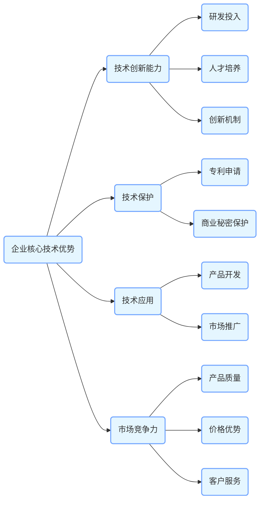

# 如何识别企业的核心技术优势

> 关键词：企业核心技术优势、技术识别、技术分析、市场竞争力、创新能力

> 摘要：本文旨在深入探讨如何识别企业的核心技术优势。核心技术优势是企业在市场竞争中脱颖而出的关键因素，它能为企业带来持续的竞争力和高额的利润。文章首先介绍了识别企业核心技术优势的背景，包括目的、预期读者、文档结构和相关术语。接着阐述了核心概念与联系，通过示意图和流程图展示其架构。然后详细讲解了核心算法原理和具体操作步骤，并用 Python 代码进行说明。同时给出了数学模型和公式，并举例分析。通过项目实战，展示了代码的实际应用和解读。还探讨了核心技术优势的实际应用场景，推荐了学习、开发工具和相关论文著作。最后总结了未来发展趋势与挑战，解答了常见问题，并提供了扩展阅读和参考资料，帮助读者全面了解和掌握识别企业核心技术优势的方法。

## 1. 背景介绍 
### 1.1 目的和范围
在当今激烈的市场竞争环境下，企业的核心技术优势是其生存和发展的关键。识别企业的核心技术优势有助于投资者做出明智的投资决策，帮助合作伙伴选择合适的合作对象，也能让企业自身清晰地认识到自身的优势和不足，从而制定更有效的发展战略。本文的范围涵盖了各种类型的企业，包括传统制造业、高科技产业、互联网企业等，旨在提供一套通用的识别企业核心技术优势的方法和思路。

### 1.2 预期读者
本文的预期读者包括投资者、企业管理者、技术分析师、行业研究人员以及对企业核心技术优势感兴趣的其他人士。对于投资者来说，了解如何识别企业的核心技术优势可以帮助他们发现具有潜力的投资标的；企业管理者可以通过本文的方法评估自身企业的技术实力，以便制定合理的技术发展战略；技术分析师和行业研究人员可以将本文的方法应用于行业分析和企业评估中；而其他对企业核心技术优势感兴趣的人士可以通过本文了解相关的知识和方法。

### 1.3 文档结构概述
本文将按照以下结构进行阐述：首先介绍相关背景信息，包括目的、读者和文档结构等；接着讲解核心概念与联系，通过示意图和流程图展示企业核心技术优势的架构；然后详细介绍核心算法原理和具体操作步骤，并用 Python 代码进行说明；随后给出数学模型和公式，并举例分析；通过项目实战展示代码的实际应用和解读；探讨核心技术优势的实际应用场景；推荐学习、开发工具和相关论文著作；最后总结未来发展趋势与挑战，解答常见问题，并提供扩展阅读和参考资料。

### 1.4 术语表
#### 1.4.1 核心术语定义
- **核心技术优势**：指企业所拥有的、能够为其带来独特竞争优势的技术能力。这种技术能力通常具有创新性、难以模仿性和可持续性，能够使企业在市场中占据领先地位。
- **技术专利**：是指国家专利机关依照专利法授予申请人在法定期限内对其发明创造所享有的专有权。技术专利是企业核心技术的重要体现，它可以保护企业的技术创新成果，防止竞争对手的模仿。
- **技术创新能力**：企业通过研发投入、人才培养等方式，不断创造新的技术和产品的能力。技术创新能力是企业保持核心技术优势的关键因素之一。
- **市场竞争力**：企业在市场中与竞争对手相比所具有的优势，包括产品质量、价格、服务等方面。核心技术优势是提升企业市场竞争力的重要手段。

#### 1.4.2 相关概念解释
- **技术壁垒**：指企业通过技术创新和专利保护等方式，在技术领域形成的一种障碍，使得竞争对手难以进入该领域或模仿其技术。技术壁垒是企业核心技术优势的重要保障。
- **技术生态系统**：指由企业、科研机构、高校等相关主体组成的，围绕某一技术领域进行研发、创新和应用的生态环境。一个良好的技术生态系统可以促进企业的技术创新和核心技术优势的提升。
- **技术转移**：指将某一领域的技术成果应用到其他领域的过程。技术转移可以帮助企业拓展业务领域，提升核心技术优势。

#### 1.4.3 缩略词列表
- **R&D**：Research and Development，即研究与开发。
- **IP**：Intellectual Property，即知识产权。
- **AI**：Artificial Intelligence，即人工智能。
- **IoT**：Internet of Things，即物联网。

## 2. 核心概念与联系 

### 核心概念原理
企业的核心技术优势是一个综合性的概念，它涉及到技术创新、专利保护、市场应用等多个方面。其原理在于企业通过持续的研发投入和人才培养，不断创造新的技术和产品，形成独特的技术能力。这些技术能力通过专利保护等手段得到法律的认可和保护，从而形成技术壁垒，防止竞争对手的模仿。同时，企业将核心技术应用于市场，满足客户的需求，提升产品的质量和竞争力，从而获得市场份额和利润。

### 架构的文本示意图
```plaintext
企业核心技术优势
|-- 技术创新能力
|   |-- 研发投入
|   |-- 人才培养
|   |-- 创新机制
|-- 技术保护
|   |-- 专利申请
|   |-- 商业秘密保护
|-- 技术应用
|   |-- 产品开发
|   |-- 市场推广
|-- 市场竞争力
|   |-- 产品质量
|   |-- 价格优势
|   |-- 客户服务
```

### Mermaid 流程图


从流程图中可以看出，企业核心技术优势是由技术创新能力、技术保护、技术应用和市场竞争力四个主要方面构成的。技术创新能力是核心技术优势的源泉，它通过研发投入、人才培养和创新机制来实现。技术保护则是保障核心技术优势的重要手段，包括专利申请和商业秘密保护。技术应用是将核心技术转化为实际产品和服务的过程，通过产品开发和市场推广来实现。市场竞争力是核心技术优势的最终体现，包括产品质量、价格优势和客户服务等方面。这四个方面相互关联、相互影响，共同构成了企业的核心技术优势。

## 3. 核心算法原理 & 具体操作步骤 

### 核心算法原理
为了识别企业的核心技术优势，我们可以采用多指标综合评估的方法。具体来说，我们可以选取几个关键指标，如技术创新能力、技术保护程度、技术应用效果和市场竞争力等，然后为每个指标设定相应的权重，最后将各个指标的得分加权求和，得到企业的核心技术优势综合得分。

### 具体操作步骤
1. **指标选取**：根据企业的行业特点和发展阶段，选取合适的评估指标。例如，对于高科技企业，可以重点关注研发投入、专利数量、技术创新性等指标；对于传统制造业企业，可以关注产品质量、生产效率、成本控制等指标。
2. **数据收集**：收集企业的相关数据，包括财务报表、专利数据库、市场调研报告等。这些数据将用于计算各个指标的得分。
3. **指标量化**：将各个指标进行量化，例如，将研发投入转化为研发投入占销售收入的比例，将专利数量转化为专利强度（专利数量与研发人员数量的比值）等。
4. **权重设定**：根据各个指标的重要性，为每个指标设定相应的权重。权重的设定可以采用专家打分法、层次分析法等方法。
5. **得分计算**：将各个指标的量化值乘以相应的权重，然后求和，得到企业的核心技术优势综合得分。
6. **结果分析**：根据企业的核心技术优势综合得分，对企业的核心技术优势进行评估和分析。得分越高，说明企业的核心技术优势越强。

### Python 代码实现
```python
import pandas as pd

# 定义评估指标和权重
indicators = ['研发投入比例', '专利强度', '产品质量得分', '市场份额']
weights = [0.3, 0.2, 0.2, 0.3]

# 示例数据
data = {
    '企业名称': ['企业 A', '企业 B', '企业 C'],
    '研发投入比例': [0.1, 0.15, 0.08],
    '专利强度': [5, 8, 3],
    '产品质量得分': [80, 90, 70],
    '市场份额': [0.2, 0.3, 0.15]
}

# 创建 DataFrame
df = pd.DataFrame(data)

# 计算每个企业的综合得分
def calculate_score(row):
    score = 0
    for i, indicator in enumerate(indicators):
        score += row[indicator] * weights[i]
    return score

df['综合得分'] = df.apply(calculate_score, axis=1)

# 按综合得分排序
df = df.sort_values(by='综合得分', ascending=False)

print(df)
```

### 代码解释
1. **指标和权重定义**：定义了四个评估指标和相应的权重。
2. **数据创建**：创建了一个包含三个企业的示例数据。
3. **得分计算函数**：定义了一个函数 `calculate_score`，用于计算每个企业的综合得分。
4. **得分计算**：使用 `apply` 方法将 `calculate_score` 函数应用到 DataFrame 的每一行，计算每个企业的综合得分。
5. **排序**：按综合得分对企业进行排序。
6. **输出结果**：打印排序后的 DataFrame。

通过以上步骤和代码，我们可以对企业的核心技术优势进行量化评估，从而更直观地识别企业的核心技术优势。

## 4. 数学模型和公式 & 详细讲解 & 举例说明 

### 数学模型
设企业的核心技术优势综合得分 $S$ 由 $n$ 个评估指标 $x_1, x_2, \cdots, x_n$ 构成，每个指标的权重为 $w_1, w_2, \cdots, w_n$，则核心技术优势综合得分的计算公式为：

$$S = \sum_{i=1}^{n} w_i x_i$$

其中，$\sum_{i=1}^{n} w_i = 1$，$0 \leq w_i \leq 1$。

### 详细讲解
这个数学模型的核心思想是通过加权求和的方式，将多个评估指标综合为一个得分，从而全面地评估企业的核心技术优势。每个指标的权重反映了该指标在评估中的重要性，权重越大，该指标对综合得分的影响就越大。

### 举例说明
假设我们选取了三个评估指标：研发投入比例 $x_1$、专利数量 $x_2$ 和市场份额 $x_3$，对应的权重分别为 $w_1 = 0.3$，$w_2 = 0.2$，$w_3 = 0.5$。有两家企业 A 和 B，它们的指标数据如下：

| 企业 | 研发投入比例 $x_1$ | 专利数量 $x_2$ | 市场份额 $x_3$ |
| ---- | ---- | ---- | ---- |
| A | 0.1 | 10 | 0.2 |
| B | 0.15 | 8 | 0.3 |

根据上述公式，计算企业 A 的核心技术优势综合得分 $S_A$：

$$S_A = w_1 x_1 + w_2 x_2 + w_3 x_3 = 0.3 \times 0.1 + 0.2 \times 10 + 0.5 \times 0.2 = 0.03 + 2 + 0.1 = 2.13$$

计算企业 B 的核心技术优势综合得分 $S_B$：

$$S_B = w_1 x_1 + w_2 x_2 + w_3 x_3 = 0.3 \times 0.15 + 0.2 \times 8 + 0.5 \times 0.3 = 0.045 + 1.6 + 0.15 = 1.795$$

由于 $S_A > S_B$，可以认为企业 A 的核心技术优势更强。

通过这个例子可以看出，数学模型可以帮助我们将多个指标进行量化和综合，从而更客观地评估企业的核心技术优势。同时，权重的设定非常关键，不同的权重会导致不同的评估结果，因此需要根据实际情况合理设定权重。

## 5. 项目实战：代码实际案例和详细解释说明 

### 5.1  开发环境搭建
在进行项目实战之前，我们需要搭建相应的开发环境。以下是具体的步骤：

#### 安装 Python
首先，我们需要安装 Python。可以从 Python 官方网站（https://www.python.org/downloads/）下载适合你操作系统的 Python 安装包，并按照安装向导进行安装。建议安装 Python 3.7 及以上版本。

#### 安装必要的库
我们需要安装一些必要的 Python 库，如 Pandas、Numpy 等。可以使用以下命令进行安装：
```sh
pip install pandas numpy
```

### 5.2  源代码详细实现和代码解读
以下是一个完整的 Python 代码示例，用于识别企业的核心技术优势：

```python
import pandas as pd
import numpy as np

# 定义评估指标和权重
indicators = ['研发投入比例', '专利数量', '产品创新性得分', '市场增长率']
weights = np.array([0.25, 0.25, 0.25, 0.25])

# 读取企业数据文件
data = pd.read_csv('enterprise_data.csv')

# 数据预处理
# 假设研发投入比例和市场增长率数据可能存在缺失值，使用均值填充
data['研发投入比例'].fillna(data['研发投入比例'].mean(), inplace=True)
data['市场增长率'].fillna(data['市场增长率'].mean(), inplace=True)

# 数据标准化
def standardize(column):
    return (column - column.mean()) / column.std()

for indicator in indicators:
    data[indicator] = standardize(data[indicator])

# 计算每个企业的综合得分
def calculate_score(row):
    scores = np.array([row[indicator] for indicator in indicators])
    return np.dot(weights, scores)

data['综合得分'] = data.apply(calculate_score, axis=1)

# 按综合得分排序
data = data.sort_values(by='综合得分', ascending=False)

# 输出排名前 5 的企业
top_5_enterprises = data.head(5)
print(top_5_enterprises[['企业名称', '综合得分']])
```

### 代码解读
1. **导入必要的库**：导入 Pandas 和 Numpy 库，用于数据处理和计算。
2. **定义评估指标和权重**：定义了四个评估指标和相应的权重。这里使用 Numpy 数组来存储权重，方便进行向量计算。
3. **读取企业数据文件**：使用 Pandas 的 `read_csv` 函数读取存储企业数据的 CSV 文件。
4. **数据预处理**：处理可能存在的缺失值，使用均值填充研发投入比例和市场增长率的缺失值。
5. **数据标准化**：对每个评估指标进行标准化处理，使不同指标具有可比性。
6. **计算综合得分**：定义一个函数 `calculate_score`，使用 `np.dot` 函数计算每个企业的综合得分。
7. **排序**：按综合得分对企业进行排序。
8. **输出结果**：输出排名前 5 的企业的名称和综合得分。

### 5.3  代码解读与分析
通过以上代码，我们可以实现对企业核心技术优势的量化评估和排名。代码的核心在于数据的预处理、标准化和综合得分的计算。数据预处理可以保证数据的完整性，标准化可以消除不同指标之间的量纲差异，使评估结果更加客观。综合得分的计算使用了加权求和的方法，将多个评估指标综合为一个得分，方便进行比较和排名。

在实际应用中，我们可以根据不同的需求调整评估指标和权重，以适应不同行业和企业的特点。同时，我们还可以对代码进行扩展，例如增加更多的评估指标、使用更复杂的数据分析方法等，以提高评估的准确性和可靠性。

## 6. 实际应用场景 
企业核心技术优势的识别在多个实际场景中具有重要的应用价值，以下是一些具体的应用场景：

### 投资决策
对于投资者来说，识别企业的核心技术优势是做出投资决策的重要依据。具有核心技术优势的企业通常具有更高的成长潜力和盈利能力，能够为投资者带来更好的回报。例如，在科技股投资中，投资者会关注企业的研发投入、专利数量、技术创新性等指标，以评估企业的核心技术优势。如果一家企业在人工智能领域拥有领先的技术，并且不断推出创新的产品和解决方案，那么它很可能具有较高的投资价值。

### 合作伙伴选择
企业在选择合作伙伴时，也需要考虑对方的核心技术优势。与具有核心技术优势的企业合作，可以实现资源共享、优势互补，提升双方的市场竞争力。例如，一家汽车制造企业在选择电池供应商时，会关注供应商在电池技术方面的研发能力、专利情况和产品质量。如果供应商具有先进的电池技术，能够提供高性能、长寿命的电池产品，那么它将成为汽车制造企业的理想合作伙伴。

### 企业战略规划
企业自身也需要识别自身的核心技术优势，以便制定合理的战略规划。通过对核心技术优势的评估，企业可以明确自身的优势领域和发展方向，加大在核心技术研发上的投入，进一步巩固和提升核心技术优势。例如，一家软件企业发现自己在大数据处理和分析方面具有核心技术优势，那么它可以将战略重点放在大数据领域，开发更多的大数据产品和服务，拓展市场份额。

### 行业分析
在进行行业分析时，识别企业的核心技术优势可以帮助分析人员了解行业的竞争格局和发展趋势。通过比较不同企业的核心技术优势，分析人员可以找出行业的领先企业和潜在的竞争对手，预测行业的未来发展方向。例如，在智能手机行业，分析人员会关注各企业在芯片技术、拍照技术、操作系统等方面的核心技术优势，以评估企业的市场竞争力和行业地位。

### 政府政策制定
政府在制定产业政策时，也需要考虑企业的核心技术优势。政府可以通过出台相关政策，鼓励和支持具有核心技术优势的企业发展，促进产业升级和创新。例如，政府可以提供研发补贴、税收优惠等政策，支持企业加大在核心技术研发上的投入，提高企业的核心技术竞争力。

## 7. 工具和资源推荐
### 7.1 学习资源推荐
#### 7.1.1 书籍推荐
- 《创新者的窘境》（The Innovator's Dilemma）：作者克莱顿·克里斯坦森（Clayton Christensen），这本书探讨了企业如何应对颠覆性创新，以及如何保持核心技术优势。
- 《技术创新管理》（Managing Technological Innovation）：作者克里斯托弗·弗里曼（Christopher Freeman）和卢桑（Luc Soete），该书系统地介绍了技术创新的理论和方法，对于理解企业核心技术优势的形成和发展具有重要的参考价值。
- 《竞争优势》（Competitive Advantage）：作者迈克尔·波特（Michael Porter），这本书阐述了企业如何通过差异化、成本领先等战略获得竞争优势，其中也涉及到核心技术优势的相关内容。

#### 7.1.2 在线课程
- Coursera 上的“技术创新与创业”（Technological Innovation and Entrepreneurship）课程：该课程由知名高校的教授授课，内容涵盖了技术创新的各个方面，包括核心技术优势的识别和培育。
- edX 上的“创新管理”（Innovation Management）课程：课程介绍了创新管理的理论和实践，帮助学习者了解如何管理企业的核心技术创新。
- 中国大学 MOOC 上的“企业技术创新管理”课程：该课程结合中国企业的实际案例，讲解了企业技术创新的方法和策略，对于识别企业核心技术优势具有一定的指导意义。

#### 7.1.3 技术博客和网站
- 36氪：是中国领先的新经济媒体，提供科技、创业等领域的最新资讯和深度分析，其中不乏关于企业核心技术优势的报道和研究。
- 雷锋网：专注于人工智能、机器人等前沿科技领域，分享行业动态、技术趋势和企业案例，有助于了解企业在新兴技术领域的核心技术优势。
- TechCrunch：是一家美国的科技博客，报道全球科技行业的最新消息和创新企业，为读者提供了了解国际科技企业核心技术优势的窗口。

### 7.2 开发工具框架推荐
#### 7.2.1 IDE和编辑器
- PyCharm：是一款专门为 Python 开发设计的集成开发环境（IDE），具有强大的代码编辑、调试和项目管理功能，适合用于开发识别企业核心技术优势的 Python 代码。
- Jupyter Notebook：是一个交互式的开发环境，支持 Python 等多种编程语言。它以笔记本的形式呈现代码和文档，方便进行数据探索、分析和可视化，非常适合用于数据分析和模型验证。
- Visual Studio Code：是一款轻量级的代码编辑器，支持多种编程语言和插件扩展。它具有丰富的代码编辑功能和调试工具，可用于开发和调试识别企业核心技术优势的代码。

#### 7.2.2 调试和性能分析工具
- PDB：是 Python 自带的调试器，可以帮助开发者逐行调试代码，查找和解决代码中的问题。
- cProfile：是 Python 的性能分析工具，可以分析代码的运行时间和函数调用情况，帮助开发者优化代码性能。
- Py-Spy：是一个用于 Python 代码性能分析的工具，它可以实时监测 Python 程序的性能，找出性能瓶颈。

#### 7.2.3 相关框架和库
- Pandas：是一个强大的数据处理和分析库，提供了高效的数据结构和数据操作方法，适合用于处理企业的各种数据。
- Numpy：是 Python 的科学计算基础库，提供了高性能的多维数组对象和各种数学函数，可用于进行数据计算和分析。
- Scikit-learn：是一个常用的机器学习库，提供了各种机器学习算法和工具，可用于构建和评估识别企业核心技术优势的模型。

### 7.3 相关论文著作推荐
#### 7.3.1 经典论文
- "Core Competence of the Corporation"（企业的核心竞争力）：作者 C. K. Prahalad 和 Gary Hamel，这篇论文首次提出了企业核心竞争力的概念，对于理解企业核心技术优势具有重要的启示作用。
- "The Sources of Innovation"（创新的源泉）：作者 Eric von Hippel，该论文探讨了创新的来源和机制，对于研究企业核心技术创新具有重要的参考价值。
- "Technological Innovation and Economic Performance"（技术创新与经济绩效）：作者 Zvi Griliches，论文分析了技术创新对企业经济绩效的影响，为评估企业核心技术优势提供了理论支持。

#### 7.3.2 最新研究成果
- 近年来，学术界在企业核心技术优势的识别和评估方面取得了许多新的研究成果。可以通过学术数据库，如 IEEE Xplore、ACM Digital Library、ScienceDirect 等，搜索相关的研究论文，了解最新的研究动态和方法。
- 一些知名的学术期刊，如《管理世界》、《科研管理》、《技术经济》等，也经常发表关于企业核心技术优势的研究论文，可以关注这些期刊获取最新的研究成果。

#### 7.3.3 应用案例分析
- 一些商业咨询公司和研究机构会发布关于企业核心技术优势的应用案例分析报告。例如，麦肯锡公司、波士顿咨询公司等的研究报告，通常会结合实际案例，分析企业如何识别和培育核心技术优势，以及核心技术优势对企业发展的影响。
- 企业自身也会发布一些关于核心技术创新和应用的案例，如华为、苹果等科技企业的年度报告和技术白皮书，其中包含了大量关于企业核心技术优势的信息和案例分析。

## 8. 总结：未来发展趋势与挑战
### 未来发展趋势
#### 技术融合加速
未来，不同领域的技术将加速融合，如人工智能与物联网、大数据与区块链等。企业的核心技术优势将不再局限于单一技术领域，而是需要具备跨领域的技术整合能力。例如，智能城市的建设需要融合传感器技术、通信技术、数据分析技术等多种技术，企业只有掌握了这些跨领域的核心技术，才能在市场竞争中占据优势。

#### 创新模式转变
传统的企业内部研发创新模式将逐渐向开放式创新模式转变。企业将更加注重与高校、科研机构、创业公司等外部创新主体的合作，共同开展技术研发和创新。通过开放式创新，企业可以整合更多的创新资源，加速核心技术的突破和应用。例如，一些大型科技企业会设立创新基金，投资和孵化有潜力的创业公司，获取其创新技术和人才。

#### 数据驱动决策
随着大数据和人工智能技术的发展，企业将越来越依赖数据来识别和评估核心技术优势。通过对大量的技术数据、市场数据和竞争数据的分析，企业可以更准确地把握技术发展趋势，发现潜在的核心技术机会。例如，利用专利数据分析可以了解竞争对手的技术布局和研发重点，为企业的技术战略制定提供参考。

#### 绿色技术兴起
在全球可持续发展的背景下，绿色技术将成为企业核心技术优势的重要组成部分。企业将加大在节能环保、新能源等领域的技术研发投入，开发绿色产品和解决方案。例如，汽车制造企业将加快电动汽车技术的研发和推广，以满足消费者对环保出行的需求。

### 挑战
#### 技术更新换代快
科技的快速发展使得技术更新换代的速度越来越快，企业的核心技术优势可能在短时间内被竞争对手超越。企业需要不断投入大量的研发资源，保持技术创新的活力，以应对技术更新换代的挑战。例如，智能手机行业的技术更新非常迅速，每年都会有新的技术和产品推出，如果企业不能及时跟上技术发展的步伐，就可能失去市场竞争力。

#### 知识产权保护难度大
随着技术创新的加速，知识产权保护的难度也越来越大。企业的核心技术容易被抄袭和模仿，导致企业的创新成果得不到有效的保护。企业需要加强知识产权管理，建立完善的知识产权保护体系，同时也需要加强国际合作，共同打击知识产权侵权行为。例如，一些科技企业在海外市场面临着知识产权侵权的风险，需要通过法律手段维护自己的权益。

#### 人才竞争激烈
核心技术的研发和创新需要高素质的人才支持。然而，目前全球范围内的科技人才竞争非常激烈，企业很难吸引和留住优秀的技术人才。企业需要提供有竞争力的薪酬待遇和良好的发展空间，同时也需要加强人才培养和团队建设，提高企业的人才吸引力和凝聚力。例如，一些互联网企业为了吸引顶尖的人工智能人才，会提供高额的薪酬和丰富的福利待遇。

#### 市场不确定性增加
市场需求的变化和竞争格局的不确定性给企业识别和培育核心技术优势带来了挑战。企业需要准确把握市场需求的变化趋势，及时调整技术研发方向和产品策略。同时，企业还需要应对来自竞争对手的挑战，不断提升自身的市场竞争力。例如，共享经济的兴起给传统出行行业带来了巨大的冲击，传统企业需要及时调整战略，开发新的技术和产品，以适应市场的变化。

## 9. 附录：常见问题与解答
### 如何确定评估指标的权重？
确定评估指标的权重可以采用多种方法，常见的有专家打分法、层次分析法等。专家打分法是邀请相关领域的专家对各个指标的重要性进行打分，然后取平均值作为权重。层次分析法是一种系统的权重确定方法，它通过构建层次结构模型，比较不同指标之间的相对重要性，从而确定权重。在实际应用中，可以根据具体情况选择合适的方法，也可以结合多种方法进行权重确定。

### 数据缺失对评估结果有什么影响？如何处理数据缺失问题？
数据缺失可能会影响评估结果的准确性和可靠性。如果某些指标的数据缺失较多，可能会导致评估结果出现偏差。处理数据缺失问题的方法有多种，常见的有删除缺失值、均值填充、中位数填充、回归填充等。删除缺失值适用于缺失值较少的情况；均值填充和中位数填充是用该指标的均值或中位数来填充缺失值；回归填充是利用其他指标的数据建立回归模型，预测缺失值。在选择处理方法时，需要根据数据的特点和分析的目的进行综合考虑。

### 如何判断企业的核心技术优势是否具有可持续性？
判断企业的核心技术优势是否具有可持续性可以从以下几个方面入手：
1. **技术创新能力**：企业是否具有持续的研发投入和创新机制，是否能够不断推出新的技术和产品。
2. **知识产权保护**：企业是否拥有完善的知识产权保护体系，是否能够有效保护自己的核心技术不被模仿和抄袭。
3. **人才团队**：企业是否拥有一支高素质、稳定的技术人才团队，是否能够吸引和留住优秀的技术人才。
4. **市场需求**：企业的核心技术是否符合市场需求的变化趋势，是否能够在市场中保持竞争力。
5. **行业竞争格局**：企业所处的行业竞争格局是否稳定，是否面临来自竞争对手的强大压力。

### 识别企业核心技术优势的方法是否适用于所有行业？
识别企业核心技术优势的基本方法和思路适用于大多数行业，但不同行业的具体评估指标和权重可能会有所不同。例如，高科技行业更注重研发投入、专利数量、技术创新性等指标；传统制造业更关注产品质量、生产效率、成本控制等指标。在实际应用中，需要根据行业的特点和企业的实际情况，对评估指标和权重进行适当的调整。

### 如何利用识别结果为企业制定战略提供支持？
利用识别结果为企业制定战略提供支持可以从以下几个方面入手：
1. **明确优势领域**：根据识别结果，确定企业的核心技术优势所在的领域，将资源集中投入到这些优势领域，进一步巩固和提升核心技术优势。
2. **制定技术研发战略**：根据核心技术优势的评估结果，制定合理的技术研发战略。如果企业在某些技术领域具有优势，可以加大研发投入，进行技术升级和创新；如果企业在某些技术领域存在不足，可以通过合作研发、技术引进等方式来弥补短板。
3. **确定市场定位**：结合核心技术优势和市场需求，确定企业的市场定位。企业可以将核心技术应用于目标市场，开发具有竞争力的产品和服务，满足客户的需求。
4. **选择合作伙伴**：根据识别结果，选择与具有互补核心技术优势的企业合作，实现资源共享、优势互补，提升企业的市场竞争力。
5. **评估战略风险**：在制定战略时，需要考虑核心技术优势的可持续性和市场变化的风险。对可能出现的风险进行评估，并制定相应的应对措施，以确保战略的顺利实施。

## 10. 扩展阅读 & 参考资料
### 扩展阅读
- 《创新的扩散》（Diffusion of Innovations）：作者 Everett M. Rogers，这本书探讨了创新在社会中的传播和扩散过程，对于理解企业核心技术的市场推广和应用具有一定的参考价值。
- 《技术的本质》（The Nature of Technology）：作者 W. Brian Arthur，该书从哲学和科学的角度探讨了技术的本质和发展规律，有助于深入理解企业核心技术的形成和演变。
- 《平台革命》（Platform Revolution）：作者 Geoffrey G. Parker、Marshall W. Van Alstyne 和 Sangeet Paul Choudary，这本书介绍了平台经济的发展和运营模式，对于分析企业核心技术在平台生态系统中的应用具有启示作用。

### 参考资料
- 各企业的年度报告、财务报表、技术白皮书等公开资料。
- 行业协会发布的行业研究报告和统计数据。
- 专利数据库，如中国国家知识产权局专利数据库、美国专利商标局数据库等。
- 学术期刊和会议论文，如《管理科学学报》、《中国管理科学》、IEEE International Conference on Technology Management 等。

作者：AI天才研究院/AI Genius Institute & 禅与计算机程序设计艺术 /Zen And The Art of Computer Programming