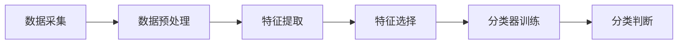

# 如何识别企业的深度伪造检测技术优势

> 关键词：深度伪造检测技术、企业优势、识别方法、技术原理、应用场景

> 摘要：本文旨在探讨如何识别企业的深度伪造检测技术优势。随着深度伪造技术的发展，其带来的安全和信任问题日益突出，深度伪造检测技术的重要性也愈发凸显。文章将从背景介绍入手，阐述核心概念与联系、核心算法原理、数学模型和公式等内容，通过项目实战展示具体代码实现和解读，分析实际应用场景，推荐相关工具和资源，最后总结未来发展趋势与挑战，为读者提供全面且深入的关于识别企业深度伪造检测技术优势的知识和方法。

## 1. 背景介绍 
### 1.1 目的和范围
深度伪造技术通过人工智能算法合成或篡改音频、视频等多媒体内容，达到以假乱真的效果。这一技术的滥用可能导致虚假信息传播、声誉受损、金融诈骗等严重后果。本文章的目的在于帮助读者了解如何准确识别企业在深度伪造检测技术方面的优势，范围涵盖深度伪造检测技术的各个方面，包括技术原理、算法、应用场景等。

### 1.2 预期读者
本文预期读者包括关注网络安全和信息真实性的普通用户、从事相关技术研究的科研人员、希望评估企业技术实力的投资者、以及企业内部负责技术选型和战略规划的决策者等。

### 1.3 文档结构概述
本文首先介绍深度伪造检测技术的背景和相关概念，接着阐述核心算法原理和数学模型，通过项目实战展示具体实现，分析实际应用场景，推荐学习和开发相关的工具和资源，最后总结未来发展趋势与挑战，并提供常见问题解答和参考资料。

### 1.4 术语表
#### 1.4.1 核心术语定义
- **深度伪造（Deepfake）**：利用深度学习等人工智能技术对音频、视频等多媒体内容进行合成或篡改，生成高度逼真的虚假内容。
- **深度伪造检测技术**：用于识别和判断多媒体内容是否为深度伪造的一系列技术和方法。
- **特征提取**：从原始数据中提取能够代表数据本质特征的信息。
- **分类器**：根据提取的特征对数据进行分类，判断其是否为深度伪造内容。

#### 1.4.2 相关概念解释
- **人工智能（AI）**：使计算机系统能够模拟人类智能的技术，包括机器学习、深度学习等。
- **机器学习（ML）**：让计算机通过数据学习模式和规律，从而进行预测和决策的技术。
- **深度学习（DL）**：机器学习的一个分支，通过构建多层神经网络来学习数据的复杂特征。

#### 1.4.3 缩略词列表
- **AI**：Artificial Intelligence（人工智能）
- **ML**：Machine Learning（机器学习）
- **DL**：Deep Learning（深度学习）

## 2. 核心概念与联系 
深度伪造检测技术的核心概念主要包括数据采集、特征提取、分类判断等环节。其基本原理是通过对多媒体数据进行分析，提取出能够反映其真实或伪造属性的特征，然后利用分类器对这些特征进行判断，从而确定数据是否为深度伪造。

下面是核心概念原理和架构的文本示意图：

数据采集 -> 数据预处理 -> 特征提取 -> 特征选择 -> 分类器训练 -> 分类判断

Mermaid 流程图如下：


数据采集是获取待检测的多媒体数据，如视频、音频等。数据预处理包括对数据进行清洗、归一化等操作，以提高数据质量。特征提取是从预处理后的数据中提取关键特征，这些特征可以是图像的纹理、音频的频谱等。特征选择则是从提取的特征中选择最具代表性和区分度的特征，以减少计算量和提高分类准确性。分类器训练是利用标注好的数据集对分类器进行训练，使其能够准确地判断数据是否为深度伪造。最后，将待检测的数据输入到训练好的分类器中进行分类判断。

## 3. 核心算法原理 & 具体操作步骤 
深度伪造检测技术中常用的算法包括基于机器学习的算法和基于深度学习的算法。下面以基于深度学习的卷积神经网络（CNN）为例，详细阐述其算法原理和具体操作步骤。

### 算法原理
卷积神经网络是一种专门用于处理具有网格结构数据的深度学习模型，如图像和音频。其基本结构包括卷积层、池化层和全连接层。

卷积层通过卷积核在输入数据上滑动，进行卷积操作，提取数据的局部特征。池化层则对卷积层的输出进行下采样，减少数据的维度，同时保留重要的特征信息。全连接层将池化层的输出进行扁平化处理，然后通过全连接的方式将特征映射到输出层，进行分类判断。

### 具体操作步骤
以下是使用 Python 和 PyTorch 实现一个简单的基于 CNN 的深度伪造检测模型的代码示例：

```python
import torch
import torch.nn as nn
import torch.optim as optim
from torch.utils.data import DataLoader, Dataset

# 定义自定义数据集类
class DeepfakeDataset(Dataset):
    def __init__(self, data, labels):
        self.data = data
        self.labels = labels

    def __len__(self):
        return len(self.data)

    def __getitem__(self, idx):
        sample = self.data[idx]
        label = self.labels[idx]
        return sample, label

# 定义 CNN 模型
class DeepfakeCNN(nn.Module):
    def __init__(self):
        super(DeepfakeCNN, self).__init__()
        self.conv1 = nn.Conv2d(3, 16, kernel_size=3, padding=1)
        self.relu1 = nn.ReLU()
        self.pool1 = nn.MaxPool2d(kernel_size=2, stride=2)
        self.conv2 = nn.Conv2d(16, 32, kernel_size=3, padding=1)
        self.relu2 = nn.ReLU()
        self.pool2 = nn.MaxPool2d(kernel_size=2, stride=2)
        self.fc1 = nn.Linear(32 * 56 * 56, 128)
        self.relu3 = nn.ReLU()
        self.fc2 = nn.Linear(128, 2)

    def forward(self, x):
        x = self.pool1(self.relu1(self.conv1(x)))
        x = self.pool2(self.relu2(self.conv2(x)))
        x = x.view(-1, 32 * 56 * 56)
        x = self.relu3(self.fc1(x))
        x = self.fc2(x)
        return x

# 训练模型
def train_model(model, train_loader, criterion, optimizer, epochs):
    model.train()
    for epoch in range(epochs):
        running_loss = 0.0
        for i, (images, labels) in enumerate(train_loader):
            optimizer.zero_grad()
            outputs = model(images)
            loss = criterion(outputs, labels)
            loss.backward()
            optimizer.step()
            running_loss += loss.item()
        print(f'Epoch {epoch + 1}, Loss: {running_loss / len(train_loader)}')

# 测试模型
def test_model(model, test_loader):
    model.eval()
    correct = 0
    total = 0
    with torch.no_grad():
        for images, labels in test_loader:
            outputs = model(images)
            _, predicted = torch.max(outputs.data, 1)
            total += labels.size(0)
            correct += (predicted == labels).sum().item()
    print(f'Accuracy: {100 * correct / total}%')

# 主函数
if __name__ == '__main__':
    # 模拟数据
    train_data = torch.randn(100, 3, 224, 224)
    train_labels = torch.randint(0, 2, (100,))
    test_data = torch.randn(20, 3, 224, 224)
    test_labels = torch.randint(0, 2, (20,))

    train_dataset = DeepfakeDataset(train_data, train_labels)
    test_dataset = DeepfakeDataset(test_data, test_labels)

    train_loader = DataLoader(train_dataset, batch_size=10, shuffle=True)
    test_loader = DataLoader(test_dataset, batch_size=10, shuffle=False)

    model = DeepfakeCNN()
    criterion = nn.CrossEntropyLoss()
    optimizer = optim.Adam(model.parameters(), lr=0.001)

    train_model(model, train_loader, criterion, optimizer, epochs=10)
    test_model(model, test_loader)
```

### 代码解释
1. **自定义数据集类**：`DeepfakeDataset` 类用于封装数据集，实现了 `__len__` 和 `__getitem__` 方法，方便数据的加载和访问。
2. **CNN 模型定义**：`DeepfakeCNN` 类定义了一个简单的卷积神经网络模型，包括两个卷积层、两个池化层和两个全连接层。
3. **训练函数**：`train_model` 函数用于训练模型，通过迭代训练数据集，计算损失并更新模型参数。
4. **测试函数**：`test_model` 函数用于测试模型的准确率，通过计算预测结果与真实标签的匹配程度来评估模型性能。
5. **主函数**：在主函数中，模拟了训练数据和测试数据，创建了数据集和数据加载器，初始化了模型、损失函数和优化器，然后调用训练函数和测试函数进行模型训练和测试。

## 4. 数学模型和公式 & 详细讲解 & 举例说明 
### 卷积操作
卷积操作是卷积神经网络的核心操作，其数学公式为：

$$
y(m,n) = \sum_{i=0}^{M-1} \sum_{j=0}^{N-1} x(m + i, n + j) \cdot k(i,j)
$$

其中，$x$ 是输入数据，$k$ 是卷积核，$y$ 是卷积输出，$M$ 和 $N$ 是卷积核的尺寸。

### 池化操作
池化操作通常有最大池化和平均池化两种方式。最大池化的数学公式为：

$$
y(m,n) = \max_{i,j \in R} x(m + i, n + j)
$$

其中，$R$ 是池化窗口的范围。

### 损失函数
在深度伪造检测中，常用的损失函数是交叉熵损失函数，其数学公式为：

$$
L(y, \hat{y}) = - \sum_{i=1}^{C} y_i \log(\hat{y}_i)
$$

其中，$y$ 是真实标签，$\hat{y}$ 是模型的预测概率，$C$ 是类别数。

### 举例说明
假设输入图像的尺寸为 $3 \times 224 \times 224$，卷积核的尺寸为 $3 \times 3$，步长为 1，填充为 1。则经过第一个卷积层后，输出的特征图尺寸为 $16 \times 224 \times 224$（因为卷积核的数量为 16）。然后经过 $2 \times 2$ 的最大池化层，步长为 2，输出的特征图尺寸变为 $16 \times 112 \times 112$。

## 5. 项目实战：代码实际案例和详细解释说明 
### 5.1  开发环境搭建
- **安装 Python**：建议使用 Python 3.7 及以上版本。
- **安装 PyTorch**：根据自己的系统和 CUDA 版本选择合适的安装方式，可以参考 PyTorch 官方文档进行安装。
- **安装其他依赖库**：如 `numpy`、`matplotlib` 等，可以使用 `pip` 进行安装。

### 5.2  源代码详细实现和代码解读
以下是一个更完整的基于 PyTorch 的深度伪造检测项目的代码示例：

```python
import torch
import torch.nn as nn
import torch.optim as optim
from torch.utils.data import DataLoader, Dataset
import torchvision.transforms as transforms
from PIL import Image
import os

# 定义自定义数据集类
class DeepfakeDataset(Dataset):
    def __init__(self, root_dir, transform=None):
        self.root_dir = root_dir
        self.transform = transform
        self.classes = os.listdir(root_dir)
        self.data = []
        for cls in self.classes:
            cls_dir = os.path.join(root_dir, cls)
            for img_name in os.listdir(cls_dir):
                img_path = os.path.join(cls_dir, img_name)
                label = self.classes.index(cls)
                self.data.append((img_path, label))

    def __len__(self):
        return len(self.data)

    def __getitem__(self, idx):
        img_path, label = self.data[idx]
        image = Image.open(img_path).convert('RGB')
        if self.transform:
            image = self.transform(image)
        return image, label

# 定义 CNN 模型
class DeepfakeCNN(nn.Module):
    def __init__(self):
        super(DeepfakeCNN, self).__init__()
        self.conv1 = nn.Conv2d(3, 16, kernel_size=3, padding=1)
        self.relu1 = nn.ReLU()
        self.pool1 = nn.MaxPool2d(kernel_size=2, stride=2)
        self.conv2 = nn.Conv2d(16, 32, kernel_size=3, padding=1)
        self.relu2 = nn.ReLU()
        self.pool2 = nn.MaxPool2d(kernel_size=2, stride=2)
        self.fc1 = nn.Linear(32 * 56 * 56, 128)
        self.relu3 = nn.ReLU()
        self.fc2 = nn.Linear(128, 2)

    def forward(self, x):
        x = self.pool1(self.relu1(self.conv1(x)))
        x = self.pool2(self.relu2(self.conv2(x)))
        x = x.view(-1, 32 * 56 * 56)
        x = self.relu3(self.fc1(x))
        x = self.fc2(x)
        return x

# 训练模型
def train_model(model, train_loader, criterion, optimizer, epochs):
    model.train()
    for epoch in range(epochs):
        running_loss = 0.0
        for i, (images, labels) in enumerate(train_loader):
            optimizer.zero_grad()
            outputs = model(images)
            loss = criterion(outputs, labels)
            loss.backward()
            optimizer.step()
            running_loss += loss.item()
        print(f'Epoch {epoch + 1}, Loss: {running_loss / len(train_loader)}')

# 测试模型
def test_model(model, test_loader):
    model.eval()
    correct = 0
    total = 0
    with torch.no_grad():
        for images, labels in test_loader:
            outputs = model(images)
            _, predicted = torch.max(outputs.data, 1)
            total += labels.size(0)
            correct += (predicted == labels).sum().item()
    print(f'Accuracy: {100 * correct / total}%')

# 主函数
if __name__ == '__main__':
    # 数据预处理
    transform = transforms.Compose([
        transforms.Resize((224, 224)),
        transforms.ToTensor(),
        transforms.Normalize(mean=[0.485, 0.456, 0.406], std=[0.229, 0.224, 0.225])
    ])

    # 加载数据集
    train_dataset = DeepfakeDataset(root_dir='train_data', transform=transform)
    test_dataset = DeepfakeDataset(root_dir='test_data', transform=transform)

    train_loader = DataLoader(train_dataset, batch_size=10, shuffle=True)
    test_loader = DataLoader(test_dataset, batch_size=10, shuffle=False)

    model = DeepfakeCNN()
    criterion = nn.CrossEntropyLoss()
    optimizer = optim.Adam(model.parameters(), lr=0.001)

    train_model(model, train_loader, criterion, optimizer, epochs=10)
    test_model(model, test_loader)
```

### 5.3  代码解读与分析
1. **自定义数据集类**：`DeepfakeDataset` 类用于加载图像数据集，通过遍历指定目录下的图像文件，将图像路径和对应的标签存储在 `self.data` 中。在 `__getitem__` 方法中，使用 `PIL` 库打开图像，并进行必要的预处理。
2. **数据预处理**：使用 `torchvision.transforms` 对图像进行预处理，包括调整图像大小、转换为张量和归一化操作。
3. **CNN 模型定义**：与之前的示例相同，定义了一个简单的卷积神经网络模型。
4. **训练和测试函数**：`train_model` 函数用于训练模型，`test_model` 函数用于测试模型的准确率。
5. **主函数**：在主函数中，创建了数据集和数据加载器，初始化了模型、损失函数和优化器，然后调用训练函数和测试函数进行模型训练和测试。

## 6. 实际应用场景 
深度伪造检测技术在多个领域有着广泛的应用：
- **媒体和新闻行业**：帮助媒体机构和新闻工作者识别虚假的音频、视频内容，确保新闻的真实性和可靠性。
- **社交网络平台**：社交网络平台可以利用深度伪造检测技术识别和过滤虚假的用户生成内容，维护平台的良好生态。
- **金融行业**：在金融交易中，防止深度伪造技术被用于身份盗用、欺诈等行为，保障用户的资金安全。
- **选举和政治领域**：识别和防范深度伪造技术在选举期间被用于传播虚假信息、影响选民决策等行为，维护选举的公正性。

## 7. 工具和资源推荐
### 7.1 学习资源推荐
#### 7.1.1 书籍推荐
- 《深度学习》（Deep Learning）：由 Ian Goodfellow、Yoshua Bengio 和 Aaron Courville 所著，是深度学习领域的经典教材。
- 《Python 深度学习》（Deep Learning with Python）：由 Francois Chollet 所著，介绍了如何使用 Python 和 Keras 进行深度学习开发。

#### 7.1.2 在线课程
- Coursera 上的“深度学习专项课程”（Deep Learning Specialization）：由 Andrew Ng 教授授课，系统地介绍了深度学习的各个方面。
- edX 上的“人工智能基础”（Fundamentals of Artificial Intelligence）：提供了人工智能的基础知识和实践经验。

#### 7.1.3 技术博客和网站
- Medium 上的 Towards Data Science：有许多关于深度学习和人工智能的高质量文章。
- arXiv.org：提供了最新的学术研究论文，包括深度伪造检测技术的研究成果。

### 7.2 开发工具框架推荐
#### 7.2.1 IDE和编辑器
- PyCharm：一款功能强大的 Python 集成开发环境，提供了代码编辑、调试、版本控制等功能。
- Jupyter Notebook：交互式的开发环境，适合进行数据探索和模型实验。

#### 7.2.2 调试和性能分析工具
- TensorBoard：用于可视化深度学习模型的训练过程和性能指标。
- PyTorch Profiler：帮助分析 PyTorch 模型的性能瓶颈，优化代码效率。

#### 7.2.3 相关框架和库
- PyTorch：一个开源的深度学习框架，提供了丰富的工具和函数，方便进行模型开发和训练。
- TensorFlow：另一个广泛使用的深度学习框架，具有强大的分布式训练和部署能力。

### 7.3 相关论文著作推荐
#### 7.3.1 经典论文
- “DeepFakes and Beyond: A Survey of Face Manipulation and Fake Detection”：对深度伪造技术和检测方法进行了全面的综述。
- “Mesonet: a compact facial video forgery detection network”：提出了一种轻量级的深度伪造检测网络。

#### 7.3.2 最新研究成果
可以通过 arXiv.org、ACM Digital Library 等学术数据库查找最新的深度伪造检测技术研究论文。

#### 7.3.3 应用案例分析
一些知名企业和研究机构会发布关于深度伪造检测技术的应用案例，可以通过他们的官方网站或相关技术博客进行查找。

## 8. 总结：未来发展趋势与挑战
### 未来发展趋势
- **多模态融合检测**：结合图像、音频、文本等多种模态的信息进行深度伪造检测，提高检测的准确性和可靠性。
- **对抗性训练**：通过对抗性训练的方法，不断提高深度伪造检测模型的鲁棒性，使其能够应对不断变化的深度伪造技术。
- **实时检测**：开发实时的深度伪造检测系统，满足在实际应用场景中的快速检测需求。

### 挑战
- **深度伪造技术的不断进化**：深度伪造技术不断发展，新的伪造方法和技术不断涌现，给检测技术带来了巨大的挑战。
- **数据不足**：获取高质量的深度伪造数据集比较困难，数据不足会影响检测模型的训练效果和泛化能力。
- **计算资源需求**：深度伪造检测模型通常需要大量的计算资源和时间进行训练和推理，这对于实际应用来说是一个挑战。

## 9. 附录：常见问题与解答
### 问题 1：深度伪造检测技术的准确率能达到多少？
深度伪造检测技术的准确率受到多种因素的影响，如数据集的质量、模型的复杂度、检测方法的有效性等。目前，一些先进的检测技术在特定数据集上的准确率可以达到 90% 以上，但在实际应用中，由于数据的多样性和复杂性，准确率可能会有所下降。

### 问题 2：如何评估企业的深度伪造检测技术优势？
可以从以下几个方面评估企业的深度伪造检测技术优势：
- **技术创新性**：企业是否采用了先进的算法和技术，是否有独特的创新点。
- **检测准确率**：通过实际测试和评估，了解企业的检测技术在不同数据集上的准确率。
- **计算效率**：检测技术的计算效率如何，是否能够满足实际应用的需求。
- **数据资源**：企业是否拥有丰富的深度伪造数据集，用于模型的训练和优化。
- **应用案例**：企业的深度伪造检测技术在实际应用中的效果和反馈如何。

### 问题 3：深度伪造检测技术是否可以完全杜绝深度伪造的危害？
深度伪造检测技术虽然可以在一定程度上识别和防范深度伪造的危害，但由于深度伪造技术的不断发展和变化，很难完全杜绝深度伪造的危害。因此，还需要结合其他措施，如法律法规的制定和执行、公众的教育和意识提高等，共同应对深度伪造带来的挑战。

## 10. 扩展阅读 & 参考资料
- Goodfellow, I., Bengio, Y., & Courville, A. (2016). Deep Learning. MIT Press.
- Chollet, F. (2018). Deep Learning with Python. Manning Publications.
- Ng, A. (2017). Deep Learning Specialization. Coursera.
- Various research papers on arXiv.org and ACM Digital Library.

作者：AI天才研究院/AI Genius Institute & 禅与计算机程序设计艺术 /Zen And The Art of Computer Programming