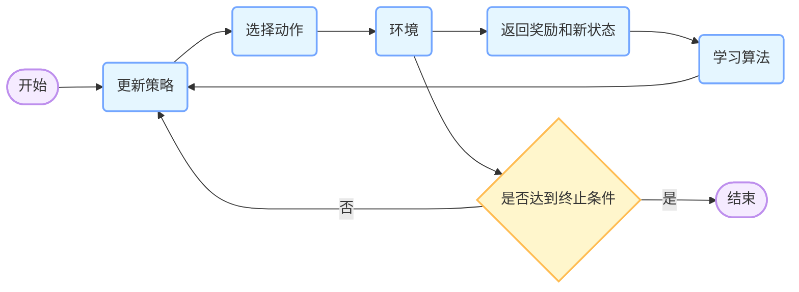

# 如何识别企业的深度强化学习自主控制优势

> 关键词：深度强化学习、自主控制、企业优势识别、算法原理、应用场景

> 摘要：本文聚焦于如何识别企业在深度强化学习自主控制方面的优势。首先介绍了相关背景信息，包括目的范围、预期读者等内容。接着阐述了深度强化学习自主控制的核心概念、联系及架构，详细讲解了核心算法原理、数学模型和公式。通过项目实战案例展示了代码实现与解读，分析了实际应用场景。同时推荐了学习资源、开发工具框架以及相关论文著作。最后总结了未来发展趋势与挑战，并提供常见问题解答和扩展阅读参考资料，旨在帮助读者全面了解并有效识别企业在该领域的优势。

## 1. 背景介绍 
### 1.1 目的和范围
深度强化学习自主控制是近年来人工智能领域的热门研究方向，在企业的诸多业务场景中展现出巨大的应用潜力，如工业自动化、智能交通、金融投资等。本文章的目的在于提供一套系统的方法，帮助读者准确识别企业在深度强化学习自主控制方面所具备的优势。范围涵盖了深度强化学习自主控制的基本概念、核心算法、实际应用案例等多个方面，通过对这些内容的分析来判断企业在此领域的竞争力。

### 1.2 预期读者
本文的预期读者包括对深度强化学习自主控制感兴趣的企业管理者、投资者、技术研究人员以及相关专业的学生。企业管理者可以借助本文提供的方法评估自身企业或竞争对手在该领域的优势，为企业战略决策提供依据；投资者可以利用这些方法筛选具有潜力的投资标的；技术研究人员可以通过了解企业的优势，为自身的研究方向提供参考；学生则可以通过阅读本文，深入了解深度强化学习自主控制在企业中的应用和优势体现。

### 1.3 文档结构概述
本文将按照以下结构展开：首先介绍核心概念与联系，让读者对深度强化学习自主控制有一个清晰的认识；接着详细讲解核心算法原理和具体操作步骤，并结合Python代码进行说明；然后阐述数学模型和公式，通过举例加深理解；之后通过项目实战案例，展示代码的实际应用和解读；分析实际应用场景，了解企业在不同场景下的优势体现；推荐相关的学习资源、开发工具框架和论文著作；最后总结未来发展趋势与挑战，提供常见问题解答和扩展阅读参考资料。

### 1.4 术语表
#### 1.4.1 核心术语定义
- **深度强化学习（Deep Reinforcement Learning）**：结合了深度学习的强大表示能力和强化学习的目标导向学习机制，通过智能体与环境进行交互，不断尝试不同的动作，以最大化累积奖励为目标，学习最优的行为策略。
- **自主控制（Autonomous Control）**：指系统或设备在不需要人工干预的情况下，能够自动感知环境信息，做出决策并执行相应的动作，以实现特定的目标。
- **智能体（Agent）**：在深度强化学习中，智能体是与环境进行交互的主体，它根据当前的环境状态选择合适的动作，并接收环境反馈的奖励信号，从而不断调整自己的行为策略。
- **环境（Environment）**：智能体所处的外部世界，它为智能体提供状态信息，并根据智能体的动作给出相应的奖励和新的状态。
- **策略（Policy）**：智能体选择动作的规则，它将环境状态映射到动作空间，决定了智能体在不同状态下应该采取的动作。
- **奖励（Reward）**：环境对智能体动作的反馈信号，用于衡量智能体动作的好坏，智能体的目标是通过学习策略来最大化累积奖励。

#### 1.4.2 相关概念解释
- **深度学习（Deep Learning）**：一种基于人工神经网络的机器学习方法，通过构建多层神经网络来学习数据的复杂特征和模式。在深度强化学习中，深度学习通常用于近似值函数或策略函数。
- **强化学习（Reinforcement Learning）**：一种通过智能体与环境进行交互，以最大化累积奖励为目标的机器学习方法。强化学习的核心是智能体在不同状态下选择最优动作，以获得最大的长期奖励。
- **马尔可夫决策过程（Markov Decision Process，MDP）**：一种用于描述智能体与环境交互的数学模型，它具有马尔可夫性质，即当前状态只依赖于上一状态和动作，而与历史状态无关。深度强化学习通常基于马尔可夫决策过程进行建模。

#### 1.4.3 缩略词列表
- **DQN（Deep Q-Network）**：深度Q网络，是一种基于深度学习的强化学习算法，通过神经网络近似Q值函数，实现智能体的动作选择。
- **A2C（Advantage Actor-Critic）**：优势演员-评论家算法，是一种结合了策略梯度和值函数估计的深度强化学习算法，通过同时学习策略网络和价值网络来提高学习效率。
- **PPO（Proximal Policy Optimization）**：近端策略优化算法，是一种高效的策略梯度算法，通过限制策略更新的步长，避免策略更新过快导致性能下降。

## 2. 核心概念与联系 
### 核心概念原理
深度强化学习自主控制的核心在于将深度强化学习算法应用于自主控制系统中，使系统能够在复杂的环境中自主学习最优的控制策略。其基本原理是智能体在环境中不断进行探索和尝试，根据环境状态选择动作，并根据环境反馈的奖励信号调整自己的策略，以最大化长期累积奖励。

深度强化学习通常基于马尔可夫决策过程（MDP）进行建模。一个MDP可以用一个五元组 $\langle S, A, P, R, \gamma \rangle$ 表示，其中：
- $S$ 是状态空间，表示环境的所有可能状态。
- $A$ 是动作空间，表示智能体可以采取的所有可能动作。
- $P$ 是状态转移概率函数，表示在当前状态 $s$ 下采取动作 $a$ 后转移到下一个状态 $s'$ 的概率，即 $P(s'|s, a)$。
- $R$ 是奖励函数，表示在当前状态 $s$ 下采取动作 $a$ 后获得的即时奖励，即 $R(s, a)$。
- $\gamma$ 是折扣因子，取值范围为 $[0, 1]$，用于衡量未来奖励的重要性。

智能体的目标是学习一个最优策略 $\pi^*$，使得从任意初始状态 $s_0$ 开始，按照该策略执行动作所获得的累积折扣奖励 $G_t$ 最大：
$$G_t = \sum_{k=0}^{\infty} \gamma^k R(s_{t+k}, a_{t+k})$$

### 架构的文本示意图
深度强化学习自主控制系统主要由智能体、环境和学习算法三部分组成。智能体通过与环境进行交互，获取环境状态信息，并根据学习算法选择合适的动作。环境根据智能体的动作给出相应的奖励和新的状态，智能体利用这些信息更新自己的策略。学习算法是深度强化学习的核心，它负责根据智能体与环境的交互数据，更新策略网络和价值网络的参数，以提高智能体的性能。

### Mermaid 流程图


## 3. 核心算法原理 & 具体操作步骤 
### 核心算法原理
在深度强化学习中，有许多经典的算法，如DQN、A2C和PPO等。下面以DQN算法为例，详细讲解其原理和操作步骤。

DQN算法的核心思想是使用深度神经网络来近似Q值函数。Q值函数 $Q(s, a)$ 表示在状态 $s$ 下采取动作 $a$ 后所能获得的最大累积折扣奖励。DQN算法通过一个神经网络 $Q(s, a; \theta)$ 来近似 $Q(s, a)$，其中 $\theta$ 是神经网络的参数。

DQN算法使用经验回放机制来提高学习效率。经验回放机制将智能体与环境的交互数据存储在一个经验回放缓冲区中，每次训练时从缓冲区中随机采样一批数据进行训练，这样可以打破数据之间的相关性，提高训练的稳定性。

### 具体操作步骤
1. **初始化**：初始化Q网络 $Q(s, a; \theta)$ 和目标Q网络 $Q'(s, a; \theta')$，并将 $\theta'$ 初始化为 $\theta$。初始化经验回放缓冲区 $D$。
2. **与环境交互**：智能体在环境中执行以下步骤，直到达到终止条件：
    - 观察当前状态 $s$。
    - 根据 $\epsilon$-贪心策略选择动作 $a$：以概率 $\epsilon$ 随机选择一个动作，以概率 $1 - \epsilon$ 选择使 $Q(s, a; \theta)$ 最大的动作。
    - 执行动作 $a$，观察环境反馈的奖励 $r$ 和新状态 $s'$。
    - 将 $(s, a, r, s')$ 存储到经验回放缓冲区 $D$ 中。
3. **训练Q网络**：从经验回放缓冲区 $D$ 中随机采样一批数据 $(s_i, a_i, r_i, s_i')$，计算目标Q值 $y_i$：
$$y_i = r_i + \gamma \max_{a'} Q'(s_i', a'; \theta')$$
其中 $\gamma$ 是折扣因子。

计算Q网络的损失函数：
$$L(\theta) = \frac{1}{N} \sum_{i=1}^{N} (y_i - Q(s_i, a_i; \theta))^2$$
其中 $N$ 是采样数据的数量。

使用梯度下降法更新Q网络的参数 $\theta$：
$$\theta \leftarrow \theta - \alpha \nabla_{\theta} L(\theta)$$
其中 $\alpha$ 是学习率。

4. **更新目标Q网络**：每隔一定的步数，将目标Q网络的参数 $\theta'$ 更新为Q网络的参数 $\theta$：
$$\theta' \leftarrow \theta$$

### Python源代码实现
```python
import numpy as np
import torch
import torch.nn as nn
import torch.optim as optim
import random

# 定义Q网络
class QNetwork(nn.Module):
    def __init__(self, state_size, action_size):
        super(QNetwork, self).__init__()
        self.fc1 = nn.Linear(state_size, 64)
        self.fc2 = nn.Linear(64, 64)
        self.fc3 = nn.Linear(64, action_size)

    def forward(self, x):
        x = torch.relu(self.fc1(x))
        x = torch.relu(self.fc2(x))
        return self.fc3(x)

# 定义经验回放缓冲区
class ReplayBuffer:
    def __init__(self, buffer_size):
        self.buffer = []
        self.buffer_size = buffer_size
        self.index = 0

    def add(self, state, action, reward, next_state):
        if len(self.buffer) < self.buffer_size:
            self.buffer.append(None)
        self.buffer[self.index] = (state, action, reward, next_state)
        self.index = (self.index + 1) % self.buffer_size

    def sample(self, batch_size):
        batch = random.sample(self.buffer, batch_size)
        states, actions, rewards, next_states = zip(*batch)
        return np.array(states), np.array(actions), np.array(rewards), np.array(next_states)

    def __len__(self):
        return len(self.buffer)

# 定义DQN智能体
class DQNAgent:
    def __init__(self, state_size, action_size, buffer_size=10000, batch_size=64, gamma=0.99, lr=0.001, epsilon=1.0, epsilon_decay=0.995, epsilon_min=0.01):
        self.state_size = state_size
        self.action_size = action_size
        self.buffer_size = buffer_size
        self.batch_size = batch_size
        self.gamma = gamma
        self.lr = lr
        self.epsilon = epsilon
        self.epsilon_decay = epsilon_decay
        self.epsilon_min = epsilon_min

        self.q_network = QNetwork(state_size, action_size)
        self.target_q_network = QNetwork(state_size, action_size)
        self.target_q_network.load_state_dict(self.q_network.state_dict())
        self.optimizer = optim.Adam(self.q_network.parameters(), lr=lr)
        self.replay_buffer = ReplayBuffer(buffer_size)

    def act(self, state):
        if np.random.rand() <= self.epsilon:
            return random.randrange(self.action_size)
        state = torch.FloatTensor(state).unsqueeze(0)
        q_values = self.q_network(state)
        action = torch.argmax(q_values, dim=1).item()
        return action

    def train(self):
        if len(self.replay_buffer) < self.batch_size:
            return
        states, actions, rewards, next_states = self.replay_buffer.sample(self.batch_size)
        states = torch.FloatTensor(states)
        actions = torch.LongTensor(actions)
        rewards = torch.FloatTensor(rewards)
        next_states = torch.FloatTensor(next_states)

        q_values = self.q_network(states).gather(1, actions.unsqueeze(1)).squeeze(1)
        next_q_values = self.target_q_network(next_states).max(1)[0]
        target_q_values = rewards + self.gamma * next_q_values

        loss = nn.MSELoss()(q_values, target_q_values)
        self.optimizer.zero_grad()
        loss.backward()
        self.optimizer.step()

        if self.epsilon > self.epsilon_min:
            self.epsilon *= self.epsilon_decay

    def update_target_network(self):
        self.target_q_network.load_state_dict(self.q_network.state_dict())

    def remember(self, state, action, reward, next_state):
        self.replay_buffer.add(state, action, reward, next_state)
```

## 4. 数学模型和公式 & 详细讲解 & 举例说明 
### 数学模型和公式
在深度强化学习中，马尔可夫决策过程（MDP）是最常用的数学模型。如前文所述，一个MDP可以用五元组 $\langle S, A, P, R, \gamma \rangle$ 表示。

价值函数是深度强化学习中的重要概念，主要包括状态价值函数 $V^{\pi}(s)$ 和动作价值函数 $Q^{\pi}(s, a)$。

- 状态价值函数 $V^{\pi}(s)$ 表示在策略 $\pi$ 下，从状态 $s$ 开始所能获得的期望累积折扣奖励：
$$V^{\pi}(s) = \mathbb{E}_{\pi} \left[ \sum_{k=0}^{\infty} \gamma^k R(s_{t+k}, a_{t+k}) \big| s_t = s \right]$$

- 动作价值函数 $Q^{\pi}(s, a)$ 表示在策略 $\pi$ 下，从状态 $s$ 采取动作 $a$ 后所能获得的期望累积折扣奖励：
$$Q^{\pi}(s, a) = \mathbb{E}_{\pi} \left[ \sum_{k=0}^{\infty} \gamma^k R(s_{t+k}, a_{t+k}) \big| s_t = s, a_t = a \right]$$

最优状态价值函数 $V^*(s)$ 和最优动作价值函数 $Q^*(s, a)$ 分别表示在所有可能的策略中，从状态 $s$ 开始和从状态 $s$ 采取动作 $a$ 后所能获得的最大期望累积折扣奖励：
$$V^*(s) = \max_{\pi} V^{\pi}(s)$$
$$Q^*(s, a) = \max_{\pi} Q^{\pi}(s, a)$$

最优策略 $\pi^*$ 是使得 $V^{\pi}(s)$ 或 $Q^{\pi}(s, a)$ 最大的策略。

### 详细讲解
状态价值函数 $V^{\pi}(s)$ 描述了在给定策略 $\pi$ 下，处于状态 $s$ 的长期价值。动作价值函数 $Q^{\pi}(s, a)$ 则进一步考虑了在状态 $s$ 下采取动作 $a$ 的价值。通过计算 $Q^{\pi}(s, a)$，智能体可以选择使 $Q^{\pi}(s, a)$ 最大的动作，从而实现最优决策。

最优状态价值函数 $V^*(s)$ 和最优动作价值函数 $Q^*(s, a)$ 是深度强化学习的目标。智能体的任务就是通过学习，找到最优策略 $\pi^*$，使得 $V^{\pi^*}(s) = V^*(s)$ 和 $Q^{\pi^*}(s, a) = Q^*(s, a)$。

### 举例说明
假设一个简单的迷宫环境，智能体的目标是从起点走到终点。状态 $s$ 可以表示智能体在迷宫中的位置，动作 $a$ 可以表示智能体的移动方向（上、下、左、右）。奖励函数 $R(s, a)$ 可以定义为：如果智能体到达终点，奖励为100；如果智能体撞到墙壁，奖励为 -10；否则奖励为 -1。

在这个环境中，状态价值函数 $V^{\pi}(s)$ 表示在策略 $\pi$ 下，智能体从位置 $s$ 开始到达终点的期望累积折扣奖励。动作价值函数 $Q^{\pi}(s, a)$ 表示在策略 $\pi$ 下，智能体从位置 $s$ 采取动作 $a$ 后到达终点的期望累积折扣奖励。智能体通过不断学习，调整策略 $\pi$，使得 $V^{\pi}(s)$ 和 $Q^{\pi}(s, a)$ 逐渐接近最优值 $V^*(s)$ 和 $Q^*(s, a)$，从而找到从起点到终点的最优路径。

## 5. 项目实战：代码实际案例和详细解释说明 
### 5.1  开发环境搭建
在进行深度强化学习项目实战之前，需要搭建相应的开发环境。以下是具体的步骤：

1. **安装Python**：推荐使用Python 3.7及以上版本。可以从Python官方网站（https://www.python.org/downloads/）下载并安装。
2. **安装深度学习框架**：本文使用PyTorch作为深度学习框架。可以通过以下命令安装：
```sh
pip install torch torchvision
```
3. **安装其他依赖库**：还需要安装一些其他的依赖库，如NumPy、Matplotlib等。可以通过以下命令安装：
```sh
pip install numpy matplotlib
```

### 5.2  源代码详细实现和代码解读
以下是一个使用DQN算法解决OpenAI Gym的CartPole-v1环境的完整代码示例：
```python
import gym
import numpy as np
import torch
import torch.nn as nn
import torch.optim as optim
import random

# 定义Q网络
class QNetwork(nn.Module):
    def __init__(self, state_size, action_size):
        super(QNetwork, self).__init__()
        self.fc1 = nn.Linear(state_size, 64)
        self.fc2 = nn.Linear(64, 64)
        self.fc3 = nn.Linear(64, action_size)

    def forward(self, x):
        x = torch.relu(self.fc1(x))
        x = torch.relu(self.fc2(x))
        return self.fc3(x)

# 定义经验回放缓冲区
class ReplayBuffer:
    def __init__(self, buffer_size):
        self.buffer = []
        self.buffer_size = buffer_size
        self.index = 0

    def add(self, state, action, reward, next_state):
        if len(self.buffer) < self.buffer_size:
            self.buffer.append(None)
        self.buffer[self.index] = (state, action, reward, next_state)
        self.index = (self.index + 1) % self.buffer_size

    def sample(self, batch_size):
        batch = random.sample(self.buffer, batch_size)
        states, actions, rewards, next_states = zip(*batch)
        return np.array(states), np.array(actions), np.array(rewards), np.array(next_states)

    def __len__(self):
        return len(self.buffer)

# 定义DQN智能体
class DQNAgent:
    def __init__(self, state_size, action_size, buffer_size=10000, batch_size=64, gamma=0.99, lr=0.001, epsilon=1.0, epsilon_decay=0.995, epsilon_min=0.01):
        self.state_size = state_size
        self.action_size = action_size
        self.buffer_size = buffer_size
        self.batch_size = batch_size
        self.gamma = gamma
        self.lr = lr
        self.epsilon = epsilon
        self.epsilon_decay = epsilon_decay
        self.epsilon_min = epsilon_min

        self.q_network = QNetwork(state_size, action_size)
        self.target_q_network = QNetwork(state_size, action_size)
        self.target_q_network.load_state_dict(self.q_network.state_dict())
        self.optimizer = optim.Adam(self.q_network.parameters(), lr=lr)
        self.replay_buffer = ReplayBuffer(buffer_size)

    def act(self, state):
        if np.random.rand() <= self.epsilon:
            return random.randrange(self.action_size)
        state = torch.FloatTensor(state).unsqueeze(0)
        q_values = self.q_network(state)
        action = torch.argmax(q_values, dim=1).item()
        return action

    def train(self):
        if len(self.replay_buffer) < self.batch_size:
            return
        states, actions, rewards, next_states = self.replay_buffer.sample(self.batch_size)
        states = torch.FloatTensor(states)
        actions = torch.LongTensor(actions)
        rewards = torch.FloatTensor(rewards)
        next_states = torch.FloatTensor(next_states)

        q_values = self.q_network(states).gather(1, actions.unsqueeze(1)).squeeze(1)
        next_q_values = self.target_q_network(next_states).max(1)[0]
        target_q_values = rewards + self.gamma * next_q_values

        loss = nn.MSELoss()(q_values, target_q_values)
        self.optimizer.zero_grad()
        loss.backward()
        self.optimizer.step()

        if self.epsilon > self.epsilon_min:
            self.epsilon *= self.epsilon_decay

    def update_target_network(self):
        self.target_q_network.load_state_dict(self.q_network.state_dict())

    def remember(self, state, action, reward, next_state):
        self.replay_buffer.add(state, action, reward, next_state)

# 主训练循环
if __name__ == "__main__":
    env = gym.make('CartPole-v1')
    state_size = env.observation_space.shape[0]
    action_size = env.action_space.n
    agent = DQNAgent(state_size, action_size)

    num_episodes = 500
    scores = []

    for episode in range(num_episodes):
        state = env.reset()
        score = 0
        done = False

        while not done:
            action = agent.act(state)
            next_state, reward, done, _ = env.step(action)
            agent.remember(state, action, reward, next_state)
            agent.train()
            state = next_state
            score += reward

        scores.append(score)
        if episode % 10 == 0:
            agent.update_target_network()
            print(f"Episode {episode}: Score = {score}, Epsilon = {agent.epsilon:.2f}")

    import matplotlib.pyplot as plt
    plt.plot(scores)
    plt.xlabel('Episode')
    plt.ylabel('Score')
    plt.title('CartPole-v1 DQN Training')
    plt.show()
```

### 代码解读与分析
1. **Q网络定义**：`QNetwork` 类定义了一个简单的三层全连接神经网络，用于近似Q值函数。输入层的大小为状态空间的维度，输出层的大小为动作空间的维度。
2. **经验回放缓冲区**：`ReplayBuffer` 类实现了经验回放机制，用于存储智能体与环境的交互数据。通过随机采样，可以打破数据之间的相关性，提高训练的稳定性。
3. **DQN智能体**：`DQNAgent` 类实现了DQN算法的核心逻辑，包括动作选择、训练和目标网络更新等功能。
    - `act` 方法根据 $\epsilon$-贪心策略选择动作。
    - `train` 方法从经验回放缓冲区中采样一批数据，计算目标Q值和损失函数，并使用梯度下降法更新Q网络的参数。
    - `update_target_network` 方法用于更新目标Q网络的参数。
    - `remember` 方法将智能体与环境的交互数据存储到经验回放缓冲区中。
4. **主训练循环**：在主训练循环中，智能体与环境进行交互，不断学习和更新策略。每个回合结束后，记录该回合的得分，并在每10个回合更新一次目标Q网络。最后，使用Matplotlib绘制得分曲线，直观地展示训练效果。

## 6. 实际应用场景 
深度强化学习自主控制在企业的多个领域都有广泛的应用，以下是一些常见的实际应用场景：

### 工业自动化
在工业生产中，深度强化学习自主控制可以用于优化生产过程，提高生产效率和质量。例如，在机器人操作中，智能体可以通过学习最优的动作策略，实现机器人的自主抓取、装配等任务。在化工生产中，智能体可以根据环境状态实时调整生产参数，如温度、压力等，以提高产品质量和生产效率。

### 智能交通
在智能交通领域，深度强化学习自主控制可以用于交通信号控制、自动驾驶等方面。例如，通过智能体学习最优的交通信号控制策略，可以减少交通拥堵，提高道路通行能力。在自动驾驶中，智能体可以根据环境感知信息，实时做出决策，控制车辆的行驶方向、速度等，确保行车安全。

### 金融投资
在金融投资领域，深度强化学习自主控制可以用于投资组合优化、交易策略制定等方面。智能体可以根据市场行情和历史数据，学习最优的投资策略，以最大化投资收益。例如，通过强化学习算法，可以实现自动交易系统，根据市场变化实时调整投资组合。

### 游戏开发
在游戏开发中，深度强化学习自主控制可以用于开发智能游戏角色。智能体可以通过与游戏环境进行交互，学习最优的游戏策略，提高游戏的趣味性和挑战性。例如，在棋类游戏中，智能体可以通过学习击败人类玩家，成为强大的对手。

## 7. 工具和资源推荐
### 7.1 学习资源推荐
#### 7.1.1 书籍推荐
- 《Reinforcement Learning: An Introduction》（《强化学习：原理与Python实现》）：这是一本强化学习领域的经典教材，详细介绍了强化学习的基本概念、算法和应用。
- 《Deep Reinforcement Learning Hands-On》（《深度强化学习实战》）：本书通过实际案例，介绍了深度强化学习的应用和实现方法，适合有一定编程基础的读者。
- 《Artificial Intelligence: A Modern Approach》（《人工智能：一种现代的方法》）：这是一本全面介绍人工智能领域的经典教材，其中包含了强化学习的相关内容。

#### 7.1.2 在线课程
- Coursera上的“Reinforcement Learning Specialization”：由阿尔伯塔大学的Richard Sutton教授等知名学者授课，系统地介绍了强化学习的理论和实践。
- edX上的“Introduction to Artificial Intelligence”：该课程涵盖了人工智能的多个领域，包括强化学习，适合初学者入门。
- Udemy上的“Deep Reinforcement Learning Bootcamp”：通过实际项目，帮助学员掌握深度强化学习的开发技能。

#### 7.1.3 技术博客和网站
- OpenAI博客（https://openai.com/blog/）：OpenAI是人工智能领域的知名研究机构，其博客会发布最新的研究成果和技术文章。
- DeepMind博客（https://deepmind.com/blog/）：DeepMind在强化学习领域取得了许多重要的研究成果，其博客提供了丰富的技术资源。
- Medium上的“Towards Data Science”：该网站有许多关于深度强化学习的技术文章和教程，适合不同水平的读者。

### 7.2 开发工具框架推荐
#### 7.2.1 IDE和编辑器
- PyCharm：是一款专业的Python集成开发环境，提供了丰富的代码编辑、调试和版本控制等功能，适合开发深度强化学习项目。
- Jupyter Notebook：是一个交互式的开发环境，支持Python代码的实时运行和可视化展示，非常适合进行数据探索和模型调试。
- Visual Studio Code：是一款轻量级的代码编辑器，支持多种编程语言和插件扩展，可用于开发深度强化学习项目。

#### 7.2.2 调试和性能分析工具
- TensorBoard：是TensorFlow提供的可视化工具，可用于监控模型的训练过程、可视化模型结构和分析性能指标。
- PyTorch Profiler：是PyTorch提供的性能分析工具，可用于分析模型的运行时间、内存使用情况等，帮助优化模型性能。
- NVIDIA Nsight Systems：是一款专业的性能分析工具，可用于分析GPU加速的深度学习模型的性能瓶颈。

#### 7.2.3 相关框架和库
- PyTorch：是一个开源的深度学习框架，提供了丰富的神经网络模块和优化算法，广泛应用于深度强化学习领域。
- TensorFlow：是另一个知名的深度学习框架，具有强大的分布式训练和部署能力，也可用于开发深度强化学习项目。
- Stable Baselines3：是一个基于PyTorch的深度强化学习库，提供了多种经典的强化学习算法的实现，方便快速开发和实验。

### 7.3 相关论文著作推荐
#### 7.3.1 经典论文
- “Human-level control through deep reinforcement learning”（《通过深度强化学习实现人类水平的控制》）：该论文介绍了DQN算法，首次将深度学习与强化学习相结合，在Atari游戏中取得了人类水平的成绩。
- “Asynchronous Methods for Deep Reinforcement Learning”（《深度强化学习的异步方法》）：提出了A3C算法，通过异步更新策略网络和价值网络，提高了深度强化学习的训练效率。
- “Proximal Policy Optimization Algorithms”（《近端策略优化算法》）：介绍了PPO算法，是一种高效的策略梯度算法，在多个领域取得了良好的效果。

#### 7.3.2 最新研究成果
- 关注NeurIPS、ICML、AAAI等顶级人工智能会议的论文，这些会议会收录深度强化学习领域的最新研究成果。
- 可以通过arXiv预印本平台（https://arxiv.org/）获取最新的研究论文。

#### 7.3.3 应用案例分析
- 在IEEE Xplore、ACM Digital Library等学术数据库中搜索深度强化学习在各个领域的应用案例，了解实际应用中的挑战和解决方案。

## 8. 总结：未来发展趋势与挑战
### 未来发展趋势
- **多智能体强化学习**：随着实际应用场景的复杂化，多智能体系统的需求越来越大。多智能体强化学习可以使多个智能体在协作或竞争的环境中学习最优策略，具有广阔的应用前景，如智能交通、机器人协作等领域。
- **结合其他技术**：深度强化学习与其他技术的结合将成为未来的发展趋势。例如，与计算机视觉结合可以实现更复杂的环境感知和决策；与自然语言处理结合可以实现智能对话和交互。
- **工业应用拓展**：深度强化学习在工业领域的应用将不断拓展，如智能制造、工业物联网等。通过深度强化学习自主控制，可以优化生产过程、提高设备利用率和降低成本。

### 挑战
- **数据收集和标注**：深度强化学习需要大量的数据进行训练，而在实际应用中，数据的收集和标注往往是一个难题。特别是在一些安全敏感的领域，如自动驾驶、医疗等，数据的获取和标注需要严格的规范和审批。
- **算法的可解释性**：深度强化学习算法通常是基于神经网络的黑盒模型，其决策过程难以解释。在一些关键领域，如金融、医疗等，算法的可解释性是非常重要的，需要研究可解释的深度强化学习算法。
- **计算资源需求**：深度强化学习的训练需要大量的计算资源，特别是在处理大规模问题时，计算成本非常高。需要研究高效的算法和硬件加速技术，降低计算资源的需求。

## 9. 附录：常见问题与解答
### 1. 深度强化学习和传统强化学习有什么区别？
深度强化学习结合了深度学习的强大表示能力和强化学习的目标导向学习机制。与传统强化学习相比，深度强化学习可以处理高维的状态和动作空间，通过神经网络自动学习特征表示，而传统强化学习通常需要手动设计特征。

### 2. 如何选择合适的深度强化学习算法？
选择合适的深度强化学习算法需要考虑多个因素，如问题的复杂度、状态和动作空间的维度、是否需要处理连续动作等。一般来说，如果问题比较简单，可以选择DQN等基于值函数的算法；如果需要处理连续动作或更复杂的问题，可以选择A2C、PPO等基于策略梯度的算法。

### 3. 深度强化学习的训练过程中容易出现哪些问题？
深度强化学习的训练过程中容易出现以下问题：
- **收敛不稳定**：由于强化学习的奖励信号是延迟的，训练过程中可能会出现收敛不稳定的情况。可以通过使用经验回放、目标网络等技术来提高训练的稳定性。
- **过拟合**：如果训练数据不足或模型复杂度太高，可能会导致过拟合。可以通过增加训练数据、正则化等方法来缓解过拟合问题。
- **探索与利用的平衡**：在训练过程中，智能体需要在探索新的动作和利用已有的经验之间找到平衡。如果探索不足，智能体可能会陷入局部最优；如果探索过度，训练效率会降低。可以通过使用 $\epsilon$-贪心策略等方法来平衡探索与利用。

### 4. 深度强化学习在实际应用中有哪些限制？
深度强化学习在实际应用中存在以下限制：
- **数据需求大**：深度强化学习需要大量的数据进行训练，在一些数据稀缺的领域，应用受到限制。
- **计算资源需求高**：深度强化学习的训练需要大量的计算资源，特别是在处理大规模问题时，计算成本非常高。
- **可解释性差**：深度强化学习算法通常是基于神经网络的黑盒模型，其决策过程难以解释，在一些关键领域的应用受到限制。

## 10. 扩展阅读 & 参考资料
- Silver, D., Huang, A., Maddison, C. J., Guez, A., Sifre, L., van den Driessche, G.,... & Dieleman, S. (2016). Mastering the game of Go with deep neural networks and tree search. Nature, 529(7587), 484-489.
- Mnih, V., Kavukcuoglu, K., Silver, D., Rusu, A. A., Veness, J., Bellemare, M. G.,... & Petersen, S. (2015). Human-level control through deep reinforcement learning. Nature, 518(7540), 529-533.
- Schulman, J., Wolski, F., Dhariwal, P., Radford, A., & Klimov, O. (2017). Proximal policy optimization algorithms. arXiv preprint arXiv:1707.06347.
- Sutton, R. S., & Barto, A. G. (2018). Reinforcement learning: An introduction. MIT press.

作者：AI天才研究院/AI Genius Institute & 禅与计算机程序设计艺术 /Zen And The Art of Computer Programming