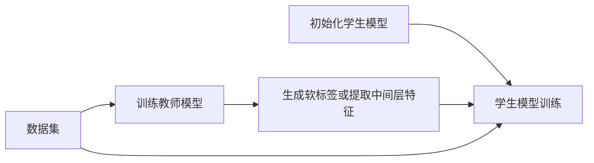

# 如何识别企业的神经网络模型蒸馏技术优势

> 关键词：神经网络模型蒸馏技术、企业优势识别、知识迁移、模型压缩、性能评估

> 摘要：本文聚焦于如何识别企业在神经网络模型蒸馏技术方面的优势。首先介绍了相关背景知识，包括目的、预期读者等内容。接着阐述了模型蒸馏的核心概念、联系、算法原理和数学模型。通过项目实战展示了代码实现及解读，探讨了实际应用场景。同时推荐了学习、开发工具等资源。最后总结未来发展趋势与挑战，解答常见问题并提供扩展阅读资料，旨在为读者全面了解和识别企业在该技术领域的优势提供系统的方法和思路。

## 1. 背景介绍 
### 1.1 目的和范围
随着人工智能技术的飞速发展，神经网络模型变得越来越复杂，其在计算资源和存储方面的需求也日益增加。模型蒸馏技术作为一种有效的模型压缩和加速方法，能够在不显著损失模型性能的前提下，将复杂的大模型知识迁移到简单的小模型中。本文的目的是帮助读者建立一套系统的方法，用以识别企业在神经网络模型蒸馏技术方面的优势。范围涵盖了模型蒸馏技术的基本概念、算法原理、实际应用，以及企业在该技术上的研发能力、应用成果等方面的评估。

### 1.2 预期读者
本文预期读者包括人工智能领域的从业者，如数据科学家、机器学习工程师、软件架构师等，他们希望深入了解模型蒸馏技术并评估企业在该领域的竞争力。同时，也适合对人工智能技术感兴趣的投资者、企业管理者，以及相关专业的学生，帮助他们在选择合作伙伴、投资项目或学习方向时做出更明智的决策。

### 1.3 文档结构概述
本文将按照以下结构展开：首先介绍核心概念与联系，帮助读者建立对模型蒸馏技术的基本认识；接着详细讲解核心算法原理和具体操作步骤，并通过Python代码进行阐述；然后介绍数学模型和公式，辅以举例说明；通过项目实战展示代码实际案例并进行详细解释；探讨该技术的实际应用场景；推荐相关的学习资源、开发工具和论文著作；最后总结未来发展趋势与挑战，解答常见问题并提供扩展阅读资料。

### 1.4 术语表
#### 1.4.1 核心术语定义
- **神经网络模型蒸馏（Neural Network Model Distillation）**：是一种将知识从一个大型、复杂的教师模型（Teacher Model）转移到一个小型、简单的学生模型（Student Model）的技术，以实现模型的压缩和加速。
- **教师模型（Teacher Model）**：通常是一个性能优异但结构复杂、计算成本高的大型神经网络模型，它为学生模型提供知识。
- **学生模型（Student Model）**：结构相对简单、计算效率高的神经网络模型，通过学习教师模型的知识来提高自身性能。
- **知识迁移（Knowledge Transfer）**：在模型蒸馏中，指将教师模型所学到的知识（如输出概率分布、中间层特征等）传递给学生模型的过程。

#### 1.4.2 相关概念解释
- **软标签（Soft Labels）**：教师模型输出的概率分布，包含了比硬标签（如分类任务中的类别标签）更多的信息，有助于学生模型学习到更多的知识。
- **温度参数（Temperature Parameter）**：在计算软标签时使用的一个参数，用于控制概率分布的平滑程度，影响知识迁移的效果。

#### 1.4.3 缩略词列表
- **NN**：Neural Network，神经网络
- **ML**：Machine Learning，机器学习
- **DL**：Deep Learning，深度学习

## 2. 核心概念与联系 
### 核心概念原理
神经网络模型蒸馏的核心思想是利用一个已经训练好的复杂教师模型的知识来指导一个简单学生模型的训练。教师模型通常在大规模数据集上进行训练，具有较高的性能，但由于其结构复杂，在实际应用中可能存在计算资源消耗大、推理速度慢等问题。学生模型则结构相对简单，通过学习教师模型的知识，能够在保持一定性能的前提下，显著减少计算量和存储需求。

知识迁移的方式主要有两种：一种是基于输出层的知识迁移，即让学生模型学习教师模型的输出概率分布（软标签）；另一种是基于中间层特征的知识迁移，让学生模型学习教师模型中间层的特征表示。

### 架构的文本示意图
```plaintext
教师模型（大型复杂模型）
    |
    | 知识（软标签、中间层特征等）
    v
学生模型（小型简单模型）
```

### Mermaid 流程图


## 3. 核心算法原理 & 具体操作步骤 
### 算法原理
模型蒸馏的核心算法基于最小化学生模型和教师模型之间的差异。常用的损失函数包括交叉熵损失函数，用于衡量学生模型输出和教师模型软标签之间的差异。

假设教师模型的输出概率分布为 $p_t$，学生模型的输出概率分布为 $p_s$，温度参数为 $T$，则软标签的计算方式为：

$p_{t}^{soft}(i)=\frac{exp(z_{t}(i)/T)}{\sum_{j} exp(z_{t}(j)/T)}$

$p_{s}^{soft}(i)=\frac{exp(z_{s}(i)/T)}{\sum_{j} exp(z_{s}(j)/T)}$

其中，$z_t$ 和 $z_s$ 分别是教师模型和学生模型的原始输出。

损失函数可以定义为：

$L_{distillation}= \alpha \cdot CE(p_{s}^{soft}, p_{t}^{soft})+(1 - \alpha) \cdot CE(p_{s}, y)$

其中，$CE$ 表示交叉熵损失函数，$y$ 是真实标签，$\alpha$ 是一个超参数，用于平衡蒸馏损失和原始分类损失。

### Python 代码实现
```python
import torch
import torch.nn as nn
import torch.optim as optim

# 定义教师模型
class TeacherModel(nn.Module):
    def __init__(self):
        super(TeacherModel, self).__init__()
        self.fc1 = nn.Linear(10, 20)
        self.fc2 = nn.Linear(20, 5)

    def forward(self, x):
        x = torch.relu(self.fc1(x))
        x = self.fc2(x)
        return x

# 定义学生模型
class StudentModel(nn.Module):
    def __init__(self):
        super(StudentModel, self).__init__()
        self.fc = nn.Linear(10, 5)

    def forward(self, x):
        x = self.fc(x)
        return x

# 训练函数
def train_distillation(teacher_model, student_model, train_loader, criterion, optimizer, T=2.0, alpha=0.5):
    teacher_model.eval()
    student_model.train()
    for inputs, labels in train_loader:
        optimizer.zero_grad()
        # 教师模型输出
        with torch.no_grad():
            teacher_outputs = teacher_model(inputs)
            teacher_soft_labels = nn.functional.softmax(teacher_outputs / T, dim=1)
        # 学生模型输出
        student_outputs = student_model(inputs)
        student_soft_outputs = nn.functional.softmax(student_outputs / T, dim=1)
        # 蒸馏损失
        distillation_loss = criterion(student_soft_outputs, teacher_soft_labels)
        # 原始分类损失
        classification_loss = criterion(nn.functional.softmax(student_outputs, dim=1), labels)
        # 总损失
        loss = alpha * distillation_loss + (1 - alpha) * classification_loss
        loss.backward()
        optimizer.step()

# 示例使用
teacher_model = TeacherModel()
student_model = StudentModel()
criterion = nn.KLDivLoss(reduction='batchmean')
optimizer = optim.Adam(student_model.parameters(), lr=0.001)

# 假设 train_loader 是训练数据加载器
# train_distillation(teacher_model, student_model, train_loader, criterion, optimizer)
```

### 具体操作步骤
1. **训练教师模型**：使用大规模数据集对复杂的教师模型进行训练，使其达到较高的性能。
2. **初始化学生模型**：构建一个结构简单的学生模型，并随机初始化其参数。
3. **训练学生模型**：在训练过程中，同时计算蒸馏损失和原始分类损失，通过反向传播更新学生模型的参数。
4. **调整超参数**：根据实验结果，调整温度参数 $T$ 和平衡系数 $\alpha$ 等超参数，以获得最佳的蒸馏效果。

## 4. 数学模型和公式 & 详细讲解 & 举例说明 
### 数学模型和公式
#### 软标签计算
如前文所述，软标签的计算通过引入温度参数 $T$ 来平滑概率分布。温度参数 $T$ 控制了概率分布的平滑程度，当 $T$ 较大时，概率分布更加平滑，不同类别的概率差异减小；当 $T$ 较小时，概率分布更接近硬标签。

$p_{t}^{soft}(i)=\frac{exp(z_{t}(i)/T)}{\sum_{j} exp(z_{t}(j)/T)}$

#### 损失函数
损失函数 $L_{distillation}$ 由蒸馏损失和原始分类损失加权求和得到：

$L_{distillation}= \alpha \cdot CE(p_{s}^{soft}, p_{t}^{soft})+(1 - \alpha) \cdot CE(p_{s}, y)$

其中，$CE(p_{s}^{soft}, p_{t}^{soft})$ 衡量学生模型软输出和教师模型软标签之间的差异，$CE(p_{s}, y)$ 衡量学生模型输出和真实标签之间的差异。

### 详细讲解
- **软标签的作用**：软标签包含了教师模型对不同类别的置信度信息，通过让学生模型学习软标签，能够学到更多的知识，尤其是类别之间的相似性和差异性。
- **温度参数的影响**：温度参数 $T$ 对软标签的平滑程度有重要影响。较大的 $T$ 使得软标签更加平滑，能够传递更多的类别间相似性信息；较小的 $T$ 则更接近硬标签，强调类别之间的差异。
- **平衡系数 $\alpha$ 的选择**：$\alpha$ 用于平衡蒸馏损失和原始分类损失。当 $\alpha$ 较大时，学生模型更注重学习教师模型的知识；当 $\alpha$ 较小时，学生模型更注重拟合真实标签。

### 举例说明
假设在一个三分类任务中，教师模型的原始输出为 $z_t = [3, 1, 0]$，学生模型的原始输出为 $z_s = [2, 1, 0]$，真实标签为 $y = [1, 0, 0]$，温度参数 $T = 2$，平衡系数 $\alpha = 0.5$。

首先计算教师模型的软标签：

$p_{t}^{soft}(1)=\frac{exp(3/2)}{\exp(3/2)+\exp(1/2)+\exp(0/2)}\approx0.73$

$p_{t}^{soft}(2)=\frac{exp(1/2)}{\exp(3/2)+\exp(1/2)+\exp(0/2)}\approx0.21$

$p_{t}^{soft}(3)=\frac{exp(0/2)}{\exp(3/2)+\exp(1/2)+\exp(0/2)}\approx0.06$

同理计算学生模型的软输出 $p_{s}^{soft}$。

然后计算蒸馏损失 $CE(p_{s}^{soft}, p_{t}^{soft})$ 和原始分类损失 $CE(p_{s}, y)$，最后根据损失函数公式计算总损失 $L_{distillation}$。

## 5. 项目实战：代码实际案例和详细解释说明 
### 5.1  开发环境搭建
#### 操作系统
建议使用 Linux 系统，如 Ubuntu 18.04 或更高版本，因为 Linux 系统在深度学习开发中具有良好的兼容性和稳定性。

#### 编程语言和库
- **Python**：选择 Python 3.7 或更高版本，Python 是深度学习开发中最常用的编程语言，具有丰富的库和工具。
- **PyTorch**：一个开源的深度学习框架，提供了高效的张量计算和自动求导功能，方便进行模型的构建和训练。
- **NumPy**：用于科学计算和数组操作。
- **Matplotlib**：用于数据可视化。

可以使用以下命令安装所需的库：
```bash
pip install torch torchvision numpy matplotlib
```

### 5.2  源代码详细实现和代码解读
```python
import torch
import torch.nn as nn
import torch.optim as optim
from torch.utils.data import DataLoader, TensorDataset
import numpy as np
import matplotlib.pyplot as plt

# 生成示例数据
np.random.seed(42)
x = np.random.randn(1000, 10).astype(np.float32)
y = np.random.randint(0, 5, 1000).astype(np.long)
x = torch.from_numpy(x)
y = torch.from_numpy(y)
dataset = TensorDataset(x, y)
train_loader = DataLoader(dataset, batch_size=32, shuffle=True)

# 定义教师模型
class TeacherModel(nn.Module):
    def __init__(self):
        super(TeacherModel, self).__init__()
        self.fc1 = nn.Linear(10, 20)
        self.fc2 = nn.Linear(20, 5)

    def forward(self, x):
        x = torch.relu(self.fc1(x))
        x = self.fc2(x)
        return x

# 定义学生模型
class StudentModel(nn.Module):
    def __init__(self):
        super(StudentModel, self).__init__()
        self.fc = nn.Linear(10, 5)

    def forward(self, x):
        x = self.fc(x)
        return x

# 训练函数
def train_distillation(teacher_model, student_model, train_loader, criterion, optimizer, T=2.0, alpha=0.5, epochs=10):
    teacher_model.eval()
    student_model.train()
    losses = []
    for epoch in range(epochs):
        epoch_loss = 0
        for inputs, labels in train_loader:
            optimizer.zero_grad()
            # 教师模型输出
            with torch.no_grad():
                teacher_outputs = teacher_model(inputs)
                teacher_soft_labels = nn.functional.softmax(teacher_outputs / T, dim=1)
            # 学生模型输出
            student_outputs = student_model(inputs)
            student_soft_outputs = nn.functional.softmax(student_outputs / T, dim=1)
            # 蒸馏损失
            distillation_loss = criterion(student_soft_outputs.log(), teacher_soft_labels)
            # 原始分类损失
            classification_loss = nn.CrossEntropyLoss()(student_outputs, labels)
            # 总损失
            loss = alpha * distillation_loss + (1 - alpha) * classification_loss
            loss.backward()
            optimizer.step()
            epoch_loss += loss.item()
        losses.append(epoch_loss / len(train_loader))
        print(f'Epoch {epoch + 1}/{epochs}, Loss: {losses[-1]:.4f}')
    return losses

# 训练教师模型
teacher_model = TeacherModel()
teacher_optimizer = optim.Adam(teacher_model.parameters(), lr=0.001)
teacher_criterion = nn.CrossEntropyLoss()
for epoch in range(10):
    teacher_model.train()
    for inputs, labels in train_loader:
        teacher_optimizer.zero_grad()
        outputs = teacher_model(inputs)
        loss = teacher_criterion(outputs, labels)
        loss.backward()
        teacher_optimizer.step()

# 训练学生模型
student_model = StudentModel()
student_optimizer = optim.Adam(student_model.parameters(), lr=0.001)
student_criterion = nn.KLDivLoss(reduction='batchmean')
losses = train_distillation(teacher_model, student_model, train_loader, student_criterion, student_optimizer)

# 绘制损失曲线
plt.plot(losses)
plt.xlabel('Epoch')
plt.ylabel('Loss')
plt.title('Distillation Loss Curve')
plt.show()
```

### 代码解读与分析
#### 数据生成
使用 `numpy` 生成随机数据，并将其转换为 `torch.Tensor` 类型，然后使用 `TensorDataset` 和 `DataLoader` 构建训练数据集和数据加载器。

#### 模型定义
定义了一个简单的教师模型和学生模型。教师模型包含两个全连接层，学生模型只包含一个全连接层，体现了模型复杂度的差异。

#### 训练函数
`train_distillation` 函数实现了模型蒸馏的训练过程。在每个训练批次中，首先计算教师模型的软标签，然后计算学生模型的软输出和原始输出，分别计算蒸馏损失和原始分类损失，最后将两者加权求和得到总损失，并通过反向传播更新学生模型的参数。

#### 训练过程
先对教师模型进行单独训练，使其达到一定的性能。然后使用蒸馏方法训练学生模型，并记录每个 epoch 的损失值。最后使用 `matplotlib` 绘制损失曲线，直观展示训练过程中损失的变化情况。

## 6. 实际应用场景 
### 移动端和嵌入式设备
在移动端和嵌入式设备上，计算资源和存储容量有限。模型蒸馏技术可以将复杂的大模型压缩成小模型，使得这些设备能够运行深度学习模型，实现图像识别、语音识别等功能。例如，在智能手机上实现实时的图像分类应用，通过模型蒸馏可以减少模型的计算量和内存占用，提高应用的运行效率。

### 边缘计算
边缘计算场景下，数据处理和模型推理需要在本地设备上快速完成，以减少数据传输延迟。模型蒸馏技术可以帮助在边缘设备上部署轻量级的模型，实现实时的数据分析和决策。例如，在工业物联网中，通过在传感器节点上部署蒸馏后的模型，实时监测设备状态，及时发现故障并进行预警。

### 模型加速和资源优化
在数据中心和云计算环境中，模型蒸馏可以加速模型的推理过程，减少计算资源的消耗。通过将大模型的知识迁移到小模型中，可以在保持一定性能的前提下，显著提高模型的推理速度，降低成本。例如，在搜索引擎的图像搜索服务中，使用蒸馏后的模型可以更快地响应用户的查询请求。

### 多模态学习
在多模态学习任务中，如同时处理图像、文本和语音等多种数据类型，模型蒸馏可以帮助整合不同模态的知识。将不同模态的大模型知识迁移到一个统一的小模型中，实现多模态数据的高效处理和分析。例如，在智能客服系统中，结合图像、文本和语音信息，通过模型蒸馏提高系统的理解和响应能力。

## 7. 工具和资源推荐
### 7.1 学习资源推荐
#### 7.1.1 书籍推荐
- 《深度学习》（Deep Learning）：由 Ian Goodfellow、Yoshua Bengio 和 Aaron Courville 合著，是深度学习领域的经典教材，涵盖了神经网络的基本原理、模型训练方法等内容，对理解模型蒸馏技术的基础有很大帮助。
- 《Python 深度学习》（Deep Learning with Python）：作者是 Francois Chollet，介绍了如何使用 Python 和 Keras 框架进行深度学习开发，书中包含了许多实际案例，适合初学者快速入门。

#### 7.1.2 在线课程
- Coursera 上的“深度学习专项课程”（Deep Learning Specialization）：由 Andrew Ng 教授授课，包括神经网络基础、卷积神经网络、循环神经网络等多个模块，系统地介绍了深度学习的理论和实践。
- edX 上的“强化学习基础”（Foundations of Reinforcement Learning）：虽然主要是关于强化学习的课程，但其中的一些概念和方法与模型蒸馏技术有一定的关联，有助于拓宽知识面。

#### 7.1.3 技术博客和网站
- Medium 上的 Towards Data Science：是一个数据科学和机器学习领域的博客平台，有许多关于模型蒸馏技术的文章和案例分享。
- arXiv：是一个预印本论文库，包含了大量最新的学术研究成果，可以及时了解模型蒸馏技术的前沿进展。

### 7.2 开发工具框架推荐
#### 7.2.1 IDE和编辑器
- PyCharm：是一款专业的 Python 集成开发环境，提供了代码编辑、调试、版本控制等功能，适合大规模的深度学习项目开发。
- Jupyter Notebook：是一个交互式的开发环境，支持代码、文本、图像等多种形式的展示，方便进行实验和数据分析。

#### 7.2.2 调试和性能分析工具
- TensorBoard：是 TensorFlow 提供的可视化工具，可以用于监控模型训练过程中的损失、准确率等指标，还可以查看模型的结构和参数分布。
- PyTorch Profiler：是 PyTorch 提供的性能分析工具，能够帮助开发者找出模型训练和推理过程中的性能瓶颈。

#### 7.2.3 相关框架和库
- PyTorch：是一个开源的深度学习框架，提供了丰富的神经网络层和优化算法，支持模型蒸馏技术的实现。
- Distiller：是一个专门用于模型压缩和蒸馏的开源库，提供了多种蒸馏算法和工具，方便开发者进行模型蒸馏实验。

### 7.3 相关论文著作推荐
#### 7.3.1 经典论文
- “Distilling the Knowledge in a Neural Network”：由 Geoffrey Hinton 等人发表，是模型蒸馏技术的开创性论文，首次提出了模型蒸馏的概念和方法。
- “FitNets: Hints for Thin Deep Nets”：提出了基于中间层特征的知识迁移方法，进一步拓展了模型蒸馏的技术思路。

#### 7.3.2 最新研究成果
- 可以关注每年的国际机器学习会议（ICML）、神经信息处理系统大会（NeurIPS）等顶级学术会议，获取模型蒸馏技术的最新研究成果。

#### 7.3.3 应用案例分析
- 一些企业和研究机构会在自己的官方网站或学术期刊上发布模型蒸馏技术的应用案例，例如谷歌、微软等公司的研究报告，可以从中了解该技术在实际场景中的应用效果和经验。

## 8. 总结：未来发展趋势与挑战
### 未来发展趋势
#### 与其他技术的融合
模型蒸馏技术将与其他深度学习技术，如强化学习、迁移学习等进行更深入的融合。例如，在强化学习中，通过模型蒸馏可以将复杂的策略网络知识迁移到简单的网络中，提高学习效率和策略执行速度。在迁移学习中，模型蒸馏可以帮助在不同领域之间更有效地迁移知识。

#### 跨模态和多任务蒸馏
随着多模态数据处理和多任务学习的需求增加，跨模态和多任务蒸馏将成为研究的热点。例如，在同时处理图像、文本和语音数据的任务中，如何通过模型蒸馏实现不同模态之间的知识共享和整合，提高模型的综合性能。

#### 自适应蒸馏策略
未来的模型蒸馏技术将更加注重自适应蒸馏策略的研究。根据不同的任务和数据集特点，自动调整蒸馏过程中的超参数和损失函数，以实现最优的蒸馏效果。

### 挑战
#### 知识迁移的有效性
如何确保教师模型的知识能够有效地迁移到学生模型中，仍然是一个挑战。在某些情况下，学生模型可能无法完全学习到教师模型的知识，导致性能提升不明显。

#### 模型压缩与性能的平衡
在进行模型压缩时，需要在模型大小和性能之间找到一个平衡点。过度压缩可能会导致模型性能下降，而压缩不足则无法达到减少计算资源和存储需求的目的。

#### 数据隐私和安全
在模型蒸馏过程中，教师模型的知识可能包含敏感信息。如何在保证知识迁移效果的同时，保护数据隐私和安全，是一个需要解决的问题。

## 9. 附录：常见问题与解答
### 问题 1：模型蒸馏技术一定能提高学生模型的性能吗？
不一定。模型蒸馏技术的效果受到多种因素的影响，如教师模型的性能、学生模型的结构、蒸馏损失函数的选择、超参数的设置等。在某些情况下，如果这些因素设置不合理，学生模型的性能可能不会得到显著提升，甚至可能下降。

### 问题 2：温度参数 $T$ 如何选择？
温度参数 $T$ 的选择需要根据具体的任务和数据集进行实验调整。一般来说，较大的 $T$ 可以使软标签更加平滑，传递更多的类别间相似性信息，但可能会导致学生模型学习到的信息过于模糊；较小的 $T$ 则更接近硬标签，强调类别之间的差异，但可能会丢失一些有用的信息。通常可以从 $T = 2$ 或 $T = 3$ 开始尝试，然后根据实验结果进行调整。

### 问题 3：模型蒸馏技术与模型量化技术有什么区别？
模型蒸馏技术是通过将复杂教师模型的知识迁移到简单学生模型中，实现模型的压缩和加速；而模型量化技术是通过减少模型参数的位数，降低模型的存储需求和计算量。两者可以结合使用，进一步提高模型的效率。

### 问题 4：在实际应用中，如何评估企业在模型蒸馏技术方面的优势？
可以从以下几个方面进行评估：企业的研发团队实力，包括团队成员的学术背景和研究经验；企业的技术创新能力，如是否有发表相关的学术论文或提出新的蒸馏算法；企业的应用案例和成果，如在实际项目中是否成功应用模型蒸馏技术提高了系统的性能和效率；企业的开源贡献，如是否开源了相关的代码和工具，为社区做出了贡献。

## 10. 扩展阅读 & 参考资料
- Goodfellow, I., Bengio, Y., & Courville, A. (2016). Deep Learning. MIT Press.
- Chollet, F. (2017). Deep Learning with Python. Manning Publications.
- Hinton, G., Vinyals, O., & Dean, J. (2015). Distilling the Knowledge in a Neural Network. arXiv preprint arXiv:1503.02531.
- Romero, A., Ballas, N., Kahou, S. E., Chassang, A., Gatta, C., & Bengio, Y. (2014). FitNets: Hints for Thin Deep Nets. arXiv preprint arXiv:1412.6550.

作者：AI天才研究院/AI Genius Institute & 禅与计算机程序设计艺术 /Zen And The Art of Computer Programming