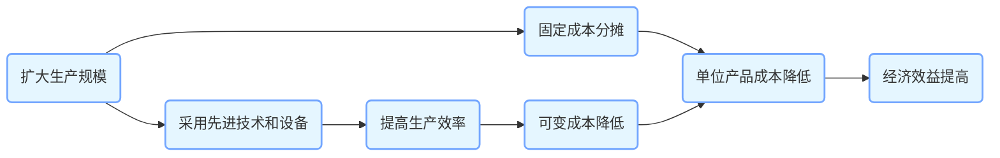

# 如何识别企业的规模经济效应

> 关键词：企业规模经济效应、识别方法、成本分析、产量变化、经济效益

> 摘要：本文围绕如何识别企业的规模经济效应展开深入探讨。详细介绍了规模经济效应的背景知识，包括目的范围、预期读者等。阐述了核心概念及联系，给出了相关原理和架构的示意图与流程图。深入讲解了核心算法原理，并用Python代码进行了说明。分析了相关数学模型和公式，并举例说明。通过项目实战，展示了如何在实际中识别规模经济效应。还介绍了实际应用场景、推荐了学习资源、开发工具框架以及相关论文著作。最后总结了未来发展趋势与挑战，解答了常见问题并提供了扩展阅读和参考资料，旨在帮助读者全面了解和准确识别企业的规模经济效应。

## 1. 背景介绍 
### 1.1 目的和范围
在当今竞争激烈的商业环境中，企业的规模经济效应对于其生存和发展至关重要。识别企业的规模经济效应有助于企业管理者做出合理的决策，如扩大生产规模、优化资源配置等。同时，对于投资者来说，了解企业的规模经济效应可以更好地评估企业的价值和潜力。本文的目的就是详细介绍如何识别企业的规模经济效应，范围涵盖了规模经济效应的基本概念、识别方法、实际应用以及相关的工具和资源。

### 1.2 预期读者
本文预期读者包括企业管理者、投资者、经济学研究者以及对企业规模经济效应感兴趣的相关人士。企业管理者可以通过本文了解如何判断企业是否存在规模经济效应，从而制定合适的发展战略；投资者可以借助本文提供的方法评估企业的投资价值；经济学研究者可以在理论和实证研究中参考本文的内容；而对相关领域感兴趣的人士可以通过阅读本文获得对规模经济效应的系统认识。

### 1.3 文档结构概述
本文首先介绍了规模经济效应的背景知识，包括目的、预期读者和文档结构等。接着阐述了核心概念与联系，用示意图和流程图展示了相关原理和架构。然后讲解了核心算法原理和具体操作步骤，并用Python代码进行了详细说明。之后分析了数学模型和公式，并举例说明。通过项目实战，展示了如何在实际中识别规模经济效应。还介绍了实际应用场景、推荐了学习资源、开发工具框架以及相关论文著作。最后总结了未来发展趋势与挑战，解答了常见问题并提供了扩展阅读和参考资料。

### 1.4 术语表
#### 1.4.1 核心术语定义
- **规模经济效应**：是指企业在生产经营过程中，随着生产规模的扩大，单位产品的成本逐渐降低，从而实现经济效益提高的现象。
- **固定成本**：是指不随产量变动而变动的成本，如厂房、设备的折旧等。
- **可变成本**：是指随产量变动而变动的成本，如原材料、劳动力等成本。
- **长期平均成本**：是指企业在长期内平均每生产一单位产品所花费的成本。

#### 1.4.2 相关概念解释
- **规模不经济**：与规模经济效应相反，是指当企业生产规模扩大到一定程度后，单位产品的成本反而上升，经济效益下降的现象。
- **范围经济**：是指企业同时生产多种产品所带来的成本节约和经济效益提高的现象，与规模经济效应有一定的区别和联系。

#### 1.4.3 缩略词列表
- **LAC**：长期平均成本（Long - Average Cost）

## 2. 核心概念与联系 
### 核心概念原理
规模经济效应的核心原理在于成本的分摊和生产效率的提高。当企业扩大生产规模时，固定成本可以分摊到更多的产品上，从而使单位产品的固定成本降低。同时，大规模生产往往可以采用更先进的技术和设备，提高生产效率，降低单位产品的可变成本。例如，一家汽车制造企业，建设一座汽车工厂需要投入大量的资金用于购买土地、建造厂房和购置设备等，这些成本在短期内是固定的。当企业只生产少量汽车时，每辆汽车分摊的固定成本就会很高；而当企业扩大生产规模，增加汽车产量时，每辆汽车分摊的固定成本就会降低。此外，大规模生产还可以使企业在原材料采购、生产流程优化等方面获得优势，进一步降低成本。

### 架构的文本示意图
```plaintext
规模经济效应
|--成本因素
|   |--固定成本分摊
|   |--可变成本降低
|--生产效率因素
|   |--先进技术应用
|   |--生产流程优化
|--经济效益体现
|   |--单位产品成本降低
|   |--利润增加
```

### Mermaid 流程图


## 3. 核心算法原理 & 具体操作步骤 
### 核心算法原理
识别企业的规模经济效应可以通过分析企业的成本和产量之间的关系来实现。常用的方法是计算长期平均成本（LAC），并观察其随着产量的变化趋势。如果长期平均成本随着产量的增加而下降，说明企业存在规模经济效应；如果长期平均成本随着产量的增加而上升，说明企业存在规模不经济；如果长期平均成本在一定产量范围内保持不变，说明企业处于规模经济的不变阶段。

长期平均成本的计算公式为：
$LAC = \frac{TC}{Q}$
其中，$TC$ 表示总成本，$Q$ 表示产量。

### 具体操作步骤
1. **收集数据**：收集企业在不同产量水平下的总成本数据，包括固定成本和可变成本。
2. **计算长期平均成本**：根据上述公式，计算每个产量水平下的长期平均成本。
3. **绘制长期平均成本曲线**：以产量为横坐标，长期平均成本为纵坐标，绘制长期平均成本曲线。
4. **分析曲线趋势**：观察长期平均成本曲线的走势，判断企业是否存在规模经济效应。

### Python 源代码实现
```python
import numpy as np
import matplotlib.pyplot as plt

# 假设的产量数据
output = np.array([100, 200, 300, 400, 500, 600, 700, 800, 900, 1000])

# 假设的总成本数据
total_cost = np.array([10000, 15000, 18000, 20000, 21000, 22000, 23500, 25000, 27000, 30000])

# 计算长期平均成本
lac = total_cost / output

# 绘制长期平均成本曲线
plt.plot(output, lac)
plt.xlabel('Output')
plt.ylabel('Long - Average Cost')
plt.title('Long - Average Cost Curve')
plt.grid(True)
plt.show()

# 判断规模经济效应
if lac[-1] < lac[0]:
    print("企业存在规模经济效应")
elif lac[-1] > lac[0]:
    print("企业存在规模不经济")
else:
    print("企业处于规模经济的不变阶段")
```
### 代码解释
1. **数据定义**：使用 `numpy` 数组定义了假设的产量数据 `output` 和总成本数据 `total_cost`。
2. **计算长期平均成本**：通过总成本除以产量，计算出每个产量水平下的长期平均成本 `lac`。
3. **绘制曲线**：使用 `matplotlib` 库绘制长期平均成本曲线，直观展示长期平均成本随产量的变化趋势。
4. **判断规模经济效应**：比较长期平均成本曲线的起点和终点值，如果终点值小于起点值，说明企业存在规模经济效应；如果终点值大于起点值，说明企业存在规模不经济；如果两者相等，说明企业处于规模经济的不变阶段。

## 4. 数学模型和公式 & 详细讲解 & 举例说明 
### 数学模型和公式
#### 总成本函数
总成本 $TC$ 可以表示为固定成本 $FC$ 和可变成本 $VC$ 之和，即：
$TC = FC + VC$
可变成本通常是产量 $Q$ 的函数，假设可变成本函数为 $VC = VC(Q)$，则总成本函数可以表示为：
$TC(Q) = FC + VC(Q)$

#### 长期平均成本函数
根据前面的定义，长期平均成本 $LAC$ 为：
$LAC(Q)=\frac{TC(Q)}{Q}=\frac{FC + VC(Q)}{Q}=\frac{FC}{Q}+\frac{VC(Q)}{Q}$

### 详细讲解
- **固定成本分摊**：$\frac{FC}{Q}$ 表示单位产品分摊的固定成本。随着产量 $Q$ 的增加，固定成本分摊到每个产品上的份额会逐渐减少，这是规模经济效应中固定成本方面的体现。例如，一家工厂的固定成本为 $10000$ 元，如果只生产 $100$ 件产品，那么每件产品分摊的固定成本为 $\frac{10000}{100}=100$ 元；如果生产 $1000$ 件产品，每件产品分摊的固定成本就变为 $\frac{10000}{1000}=10$ 元。
- **可变成本变化**：$\frac{VC(Q)}{Q}$ 表示单位产品的可变成本。在一定范围内，随着产量的增加，企业可以通过批量采购原材料、优化生产流程等方式降低单位产品的可变成本。但当产量超过一定限度后，可能会出现生产效率下降、管理成本增加等问题，导致单位产品的可变成本上升。

### 举例说明
假设某企业的固定成本 $FC = 5000$ 元，可变成本函数为 $VC(Q)=2Q + 0.01Q^{2}$，则总成本函数为：
$TC(Q)=5000 + 2Q+0.01Q^{2}$
长期平均成本函数为：
$LAC(Q)=\frac{5000 + 2Q + 0.01Q^{2}}{Q}=\frac{5000}{Q}+2 + 0.01Q$

我们可以计算不同产量水平下的长期平均成本：
- 当 $Q = 100$ 时，$LAC(100)=\frac{5000}{100}+2 + 0.01\times100=50 + 2+1 = 53$（元）
- 当 $Q = 200$ 时，$LAC(200)=\frac{5000}{200}+2 + 0.01\times200=25 + 2+2 = 29$（元）
- 当 $Q = 300$ 时，$LAC(300)=\frac{5000}{300}+2 + 0.01\times300\approx16.67+2 + 3 = 21.67$（元）

可以看出，随着产量的增加，长期平均成本逐渐降低，说明该企业在这个产量范围内存在规模经济效应。

## 5. 项目实战：代码实际案例和详细解释说明 
### 5.1  开发环境搭建
#### 安装 Python
首先需要安装 Python 编程语言，建议使用 Python 3.7 及以上版本。可以从 Python 官方网站（https://www.python.org/downloads/）下载适合自己操作系统的安装包，按照安装向导进行安装。

#### 安装必要的库
本项目需要使用 `numpy` 和 `matplotlib` 库，安装方法如下：
打开命令行工具（如 Windows 的命令提示符或 Linux 的终端），输入以下命令：
```sh
pip install numpy matplotlib
```
这将自动从 Python 包索引（PyPI）下载并安装所需的库。

### 5.2  源代码详细实现和代码解读
```python
import numpy as np
import matplotlib.pyplot as plt

# 收集实际企业数据
# 假设这是某企业不同产量下的总成本数据
output = np.array([50, 100, 150, 200, 250, 300, 350, 400])
total_cost = np.array([3000, 4000, 4500, 5000, 5500, 6200, 7000, 8000])

# 计算长期平均成本
lac = total_cost / output

# 绘制长期平均成本曲线
plt.plot(output, lac)
plt.xlabel('Output')
plt.ylabel('Long - Average Cost')
plt.title('Long - Average Cost Curve of the Enterprise')
plt.grid(True)
plt.show()

# 判断规模经济效应
if lac[-1] < lac[0]:
    print("该企业存在规模经济效应")
elif lac[-1] > lac[0]:
    print("该企业存在规模不经济")
else:
    print("该企业处于规模经济的不变阶段")
```
### 代码解读
1. **导入库**：使用 `import` 语句导入 `numpy` 和 `matplotlib.pyplot` 库，`numpy` 用于处理数组和数值计算，`matplotlib.pyplot` 用于绘制图形。
2. **数据收集**：定义了两个 `numpy` 数组 `output` 和 `total_cost`，分别表示企业的产量和总成本数据。这些数据可以通过企业的财务报表、生产记录等渠道收集。
3. **计算长期平均成本**：通过将总成本除以产量，计算出每个产量水平下的长期平均成本 `lac`。
4. **绘制曲线**：使用 `plt.plot()` 函数绘制长期平均成本曲线，设置了坐标轴标签和标题，最后使用 `plt.show()` 显示图形。
5. **判断规模经济效应**：比较长期平均成本曲线的起点和终点值，根据比较结果判断企业是否存在规模经济效应。

### 5.3  代码解读与分析
通过上述代码，我们可以直观地看到企业长期平均成本随产量的变化趋势。如果长期平均成本曲线呈下降趋势，说明企业在扩大生产规模的过程中能够实现成本的降低，存在规模经济效应；如果曲线呈上升趋势，说明企业在扩大生产规模时成本增加，存在规模不经济；如果曲线基本保持水平，说明企业处于规模经济的不变阶段。

在实际应用中，我们可以根据长期平均成本曲线的形状和走势，为企业的生产决策提供参考。例如，如果企业存在规模经济效应，可以考虑进一步扩大生产规模，以获取更多的经济效益；如果存在规模不经济，需要分析原因，如是否是生产流程不合理、管理成本过高等，并采取相应的措施进行改进。

## 6. 实际应用场景 
### 企业生产决策
企业管理者可以通过识别规模经济效应，决定是否扩大生产规模。如果企业存在规模经济效应，扩大生产规模可以降低单位产品的成本，提高企业的竞争力和利润水平。例如，一家饮料生产企业，通过分析发现随着产量的增加，长期平均成本不断下降，那么企业可以考虑增加生产线，扩大生产规模，以获取更多的经济效益。

### 投资决策
投资者在评估企业的投资价值时，规模经济效应是一个重要的考虑因素。具有规模经济效应的企业通常具有更强的盈利能力和市场竞争力，其股票或债券可能更具投资价值。例如，投资者在选择投资一家制造业企业时，如果发现该企业存在明显的规模经济效应，那么该企业未来的发展潜力可能较大，投资者可以考虑增加对该企业的投资。

### 行业分析
在进行行业分析时，规模经济效应可以帮助分析人员了解行业的竞争格局和发展趋势。一些行业由于存在显著的规模经济效应，往往会形成少数大企业主导的市场结构。例如，在钢铁行业，大型钢铁企业由于能够实现大规模生产，降低成本，从而在市场竞争中占据优势地位。通过分析行业内企业的规模经济效应，可以预测行业的集中度和发展方向。

### 政府政策制定
政府在制定产业政策时，也需要考虑企业的规模经济效应。对于具有规模经济效应的行业，政府可以通过政策引导，促进企业的兼并重组，提高产业集中度，增强行业的整体竞争力。例如，政府可以出台税收优惠政策，鼓励企业扩大生产规模，实现规模经济。同时，政府也需要防止企业过度垄断，维护市场的公平竞争环境。

## 7. 工具和资源推荐
### 7.1 学习资源推荐
#### 7.1.1 书籍推荐
- 《微观经济学》：保罗·萨缪尔森（Paul A. Samuelson）和威廉·诺德豪斯（William D. Nordhaus）所著，这本书系统地介绍了微观经济学的基本原理，包括规模经济效应等内容，是学习经济学的经典教材。
- 《产业经济学》：苏东水主编，该书详细阐述了产业经济学的理论和方法，对企业的规模经济效应、产业组织等方面进行了深入分析。
- 《管理经济学》：海因斯（Mark Hirschey）所著，结合了经济学原理和企业管理实践，帮助读者理解如何运用经济学知识进行企业决策，其中也涉及到规模经济效应的相关内容。

#### 7.1.2 在线课程
- Coursera 平台上的“Microeconomics Principles”课程：由宾夕法尼亚大学的教授授课，课程内容涵盖了微观经济学的各个方面，包括规模经济效应的讲解和案例分析。
- edX 平台上的“Industrial Organization”课程：该课程深入探讨了产业组织理论，对企业的规模经济效应、市场结构等问题进行了详细分析。
- 中国大学 MOOC 上的“产业经济学”课程：由国内知名高校的教授授课，结合中国的产业发展实际，介绍了产业经济学的基本理论和方法，包括规模经济效应的相关知识。

#### 7.1.3 技术博客和网站
- 经济学人（The Economist）网站：提供了全球经济和商业领域的最新资讯和分析，其中不乏关于企业规模经济效应的案例和研究报告。
- 财新网：专注于财经领域的新闻和分析，有许多关于企业经营和产业发展的文章，涉及到规模经济效应等相关内容。
- 国家统计局网站：可以获取到大量的宏观经济数据和行业统计数据，有助于分析企业的规模经济效应与宏观经济环境的关系。

### 7.2 开发工具框架推荐
#### 7.2.1 IDE和编辑器
- PyCharm：是一款专业的 Python 集成开发环境（IDE），具有强大的代码编辑、调试和项目管理功能，适合用于开发和分析与规模经济效应相关的 Python 代码。
- Jupyter Notebook：是一个交互式的开发环境，支持 Python 等多种编程语言。它以网页的形式展示代码和运行结果，方便进行数据分析和可视化，非常适合用于探索性的数据分析和模型构建。
- Visual Studio Code：是一款轻量级的代码编辑器，支持多种编程语言和插件扩展。它具有丰富的代码编辑功能和调试工具，也可以用于开发与规模经济效应相关的代码。

#### 7.2.2 调试和性能分析工具
- `pdb`：是 Python 内置的调试工具，可以帮助开发者在代码执行过程中设置断点、查看变量值等，方便调试与规模经济效应相关的 Python 代码。
- `cProfile`：是 Python 的性能分析工具，可以统计代码中各个函数的执行时间和调用次数，帮助开发者找出代码中的性能瓶颈，优化与规模经济效应分析相关的代码。
- Numba：是一个用于 Python 的即时编译器，可以将 Python 代码转换为机器码，提高代码的执行速度。在处理大规模数据和复杂计算时，使用 Numba 可以显著提升分析规模经济效应的效率。

#### 7.2.3 相关框架和库
- `pandas`：是一个强大的数据分析库，提供了高效的数据结构和数据处理功能，方便对企业的成本和产量数据进行清洗、整理和分析，在识别规模经济效应的过程中可以发挥重要作用。
- `scikit - learn`：是一个广泛使用的机器学习库，提供了各种机器学习算法和工具。在分析规模经济效应时，可以使用 `scikit - learn` 中的回归分析等方法，建立成本和产量之间的数学模型。
- `seaborn`：是一个基于 `matplotlib` 的数据可视化库，提供了更美观、更高级的绘图功能。在绘制长期平均成本曲线等可视化图表时，使用 `seaborn` 可以使图表更加直观和美观。

### 7.3 相关论文著作推荐
#### 7.3.1 经典论文
- Coase, R. H. (1937). "The Nature of the Firm". *Economica*, 4(16), 386 - 405. 这篇经典论文探讨了企业存在的原因和边界问题，对理解企业的规模经济效应有重要的启示作用。
- Bain, J. S. (1956). *Barriers to New Competition: Their Character and Consequences in Manufacturing Industries*. 该论文分析了产业进入壁垒的问题，其中涉及到企业规模经济效应与市场竞争的关系。
- Stigler, G. J. (1958). "The Economies of Scale". *Journal of Law and Economics*, 1(1), 54 - 71. 这篇论文对规模经济效应进行了深入的理论分析，提出了许多重要的观点和研究方法。

#### 7.3.2 最新研究成果
- Acemoglu, D., & Restrepo, P. (2018). "The Race between Machine and Man: Implications of Technology for Growth, Factor Shares, and Employment". *American Economic Review*, 108(6), 1488 - 1542. 该研究探讨了技术进步与企业规模经济效应的关系，以及对就业和经济增长的影响。
- Autor, D. H., Dorn, D., Katz, L. F., Patterson, C., & Van Reenen, J. (2020). "The Fall of the Labor Share and the Rise of Superstar Firms". *Quarterly Journal of Economics*, 135(2), 645 - 709. 这篇论文分析了“超级明星企业”的崛起与劳动份额下降的关系，其中涉及到企业规模经济效应在市场结构变化中的作用。

#### 7.3.3 应用案例分析
- 一些知名企业的案例分析报告，如亚马逊、苹果等公司的发展历程和成本结构分析。这些案例可以帮助读者更好地理解规模经济效应在实际企业中的应用和影响。
- 行业研究报告，如汽车行业、电子行业等的研究报告，其中通常会包含对行业内企业规模经济效应的分析和评估。

## 8. 总结：未来发展趋势与挑战
### 未来发展趋势
- **技术创新推动规模经济效应的深化**：随着科技的不断进步，如人工智能、大数据、物联网等技术的应用，企业可以更精准地控制生产过程，优化资源配置，进一步降低成本，实现更大规模的经济效应。例如，智能制造技术可以使企业实现生产自动化和智能化，提高生产效率，降低人力成本。
- **产业融合促进规模经济效应的拓展**：不同产业之间的融合趋势日益明显，企业通过跨产业整合资源，可以实现范围经济和规模经济的协同发展。例如，互联网企业与传统制造业的融合，通过大数据分析和互联网营销，可以扩大产品的市场份额，提高企业的规模经济效应。
- **全球市场整合带来新的规模经济机遇**：经济全球化的深入发展，使得企业可以在全球范围内配置资源，开拓市场。企业可以通过跨国并购、建立全球生产基地等方式，扩大生产规模，降低成本，获取更大的规模经济效应。

### 挑战
- **技术创新带来的不确定性**：虽然技术创新可以推动规模经济效应的深化，但也带来了一定的不确定性。新技术的研发和应用需要大量的资金和时间投入，如果企业不能准确把握技术发展的方向，可能会导致投资失败，无法实现预期的规模经济效应。
- **产业融合中的协同困难**：产业融合过程中，不同产业之间的文化、管理模式、技术标准等存在差异，企业在跨产业整合资源时可能会面临协同困难的问题。例如，互联网企业与传统制造业在管理理念和生产流程上存在较大差异，如何实现有效的整合和协同发展是一个挑战。
- **全球市场竞争加剧和贸易保护主义**：全球市场整合带来规模经济机遇的同时，也加剧了市场竞争。企业需要面对来自全球各地的竞争对手，同时，贸易保护主义的抬头也给企业的全球市场拓展带来了障碍，可能影响企业规模经济效应的实现。

## 9. 附录：常见问题与解答
### 问题 1：如何准确收集企业的成本和产量数据？
解答：可以通过企业的财务报表获取总成本数据，包括固定成本和可变成本的明细。产量数据可以从生产部门的生产记录中获取。同时，为了保证数据的准确性，需要对数据进行审核和验证，排除异常数据的干扰。

### 问题 2：规模经济效应是否适用于所有行业？
解答：不是所有行业都存在明显的规模经济效应。一些行业，如手工工艺品行业、定制化服务行业等，由于产品或服务的个性化程度较高，难以实现大规模生产，规模经济效应相对不明显。而一些制造业、公用事业等行业，由于存在较高的固定成本和可规模化生产的特点，规模经济效应通常比较显著。

### 问题 3：如何区分规模经济效应和范围经济效应？
解答：规模经济效应主要强调企业在生产单一产品或服务时，随着生产规模的扩大，单位产品成本降低的现象。而范围经济效应是指企业同时生产多种产品或提供多种服务时，由于共享资源、技术等因素，实现成本节约和经济效益提高的现象。例如，一家企业只生产一种汽车，通过扩大汽车产量降低成本，体现的是规模经济效应；如果该企业同时生产汽车和摩托车，通过共享零部件生产设备、销售渠道等实现成本降低，体现的是范围经济效应。

### 问题 4：当企业存在规模不经济时，应该采取什么措施？
解答：当企业存在规模不经济时，需要分析原因。如果是由于生产流程不合理导致的，可以进行生产流程优化，提高生产效率；如果是管理成本过高，可以加强企业管理，精简管理机构，降低管理费用；如果是市场需求不足导致产能过剩，可以调整产品结构，开拓新的市场。

## 10. 扩展阅读 & 参考资料
### 扩展阅读
- 《竞争战略》：迈克尔·波特（Michael E. Porter）所著，该书介绍了企业竞争战略的基本理论和方法，对理解企业在规模经济效应下的竞争策略有一定的帮助。
- 《创新者的窘境》：克莱顿·克里斯坦森（Clayton M. Christensen）所著，探讨了企业在面对技术创新和市场变化时的困境和应对策略，与规模经济效应和企业发展的关系密切。

### 参考资料
- 相关企业的财务报表和年度报告
- 国家和地方政府发布的统计数据和产业政策文件
- 学术期刊上发表的关于规模经济效应的研究论文

作者：AI天才研究院/AI Genius Institute & 禅与计算机程序设计艺术 /Zen And The Art of Computer Programming