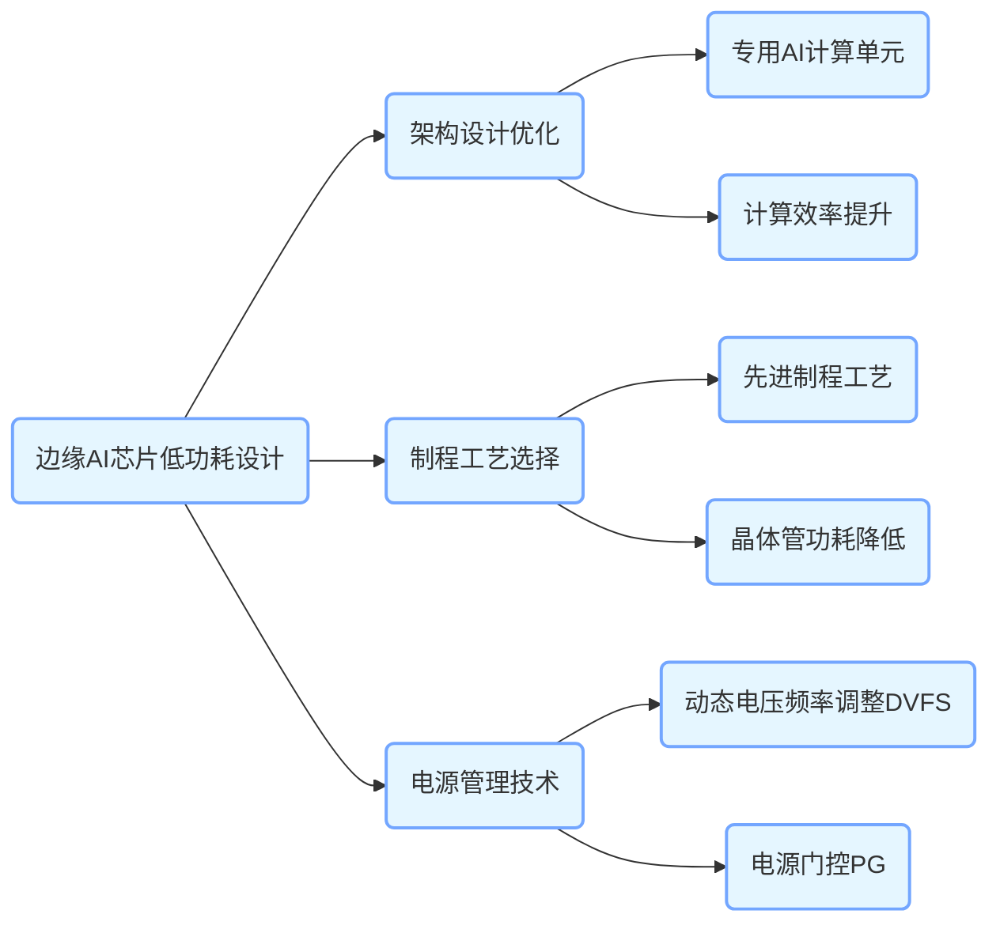

# 如何识别企业的边缘AI芯片低功耗设计优势

> 关键词：边缘AI芯片、低功耗设计、优势识别、企业评估、人工智能

> 摘要：本文围绕如何识别企业的边缘AI芯片低功耗设计优势展开深入探讨。首先介绍了边缘AI芯片低功耗设计的背景，包括目的、预期读者、文档结构等内容。接着阐述了边缘AI芯片低功耗设计的核心概念与联系，详细讲解了核心算法原理和具体操作步骤，通过数学模型和公式进一步剖析低功耗设计的原理。然后通过项目实战案例，展示了代码实现和解读。分析了边缘AI芯片低功耗设计在实际中的应用场景，推荐了相关的学习资源、开发工具和论文著作。最后总结了未来发展趋势与挑战，并对常见问题进行了解答，为读者全面认识和评估企业边缘AI芯片低功耗设计优势提供了系统的指导。

## 1. 背景介绍 
### 1.1 目的和范围
随着人工智能技术的快速发展，边缘计算成为了重要的发展方向。边缘AI芯片作为边缘计算的核心硬件，其低功耗设计具有至关重要的意义。本文章的目的在于帮助读者了解如何识别企业在边缘AI芯片低功耗设计方面的优势。范围涵盖了边缘AI芯片低功耗设计的基本概念、核心算法、数学模型、实际应用以及相关的工具和资源等方面。

### 1.2 预期读者
本文预期读者包括人工智能领域的从业者，如芯片设计工程师、算法工程师、产品经理等；对边缘计算和AI芯片感兴趣的技术爱好者；以及关注科技产业发展的投资者等。

### 1.3 文档结构概述
本文首先介绍边缘AI芯片低功耗设计的背景信息，包括目的、读者和文档结构等。接着阐述核心概念与联系，通过示意图和流程图帮助读者理解。然后详细讲解核心算法原理和具体操作步骤，并用Python代码进行说明。之后介绍数学模型和公式，通过举例加深理解。通过项目实战展示代码实现和解读。分析实际应用场景，推荐相关工具和资源。最后总结未来发展趋势与挑战，解答常见问题，并提供扩展阅读和参考资料。

### 1.4 术语表
#### 1.4.1 核心术语定义
- **边缘AI芯片**：是一种集成了人工智能计算能力的芯片，能够在靠近数据源的边缘设备上进行AI计算，减少数据传输延迟和对云端的依赖。
- **低功耗设计**：指在芯片设计过程中，采用各种技术和方法降低芯片的功耗，以延长设备的续航时间、减少散热需求等。
- **动态电压频率调整（DVFS）**：一种根据芯片的工作负载动态调整电压和频率的技术，以降低功耗。
- **电源门控（Power Gating）**：通过关闭芯片中暂时不需要工作的模块的电源来降低功耗的技术。

#### 1.4.2 相关概念解释
- **边缘计算**：是一种将计算和数据存储靠近数据源的计算模式，能够减少数据传输延迟，提高系统的响应速度和可靠性。
- **人工智能（AI）**：是一门研究如何使计算机能够模拟人类智能的学科，包括机器学习、深度学习等技术。
- **芯片制程**：指芯片制造过程中晶体管的尺寸，制程越小，芯片的性能越高，功耗越低。

#### 1.4.3 缩略词列表
- **AI**：Artificial Intelligence（人工智能）
- **DVFS**：Dynamic Voltage and Frequency Scaling（动态电压频率调整）
- **PG**：Power Gating（电源门控）

## 2. 核心概念与联系 

### 边缘AI芯片低功耗设计的核心概念

边缘AI芯片低功耗设计的核心目标是在保证芯片具备足够的AI计算能力的前提下，尽可能降低芯片的功耗。这涉及到多个方面的技术和概念，主要包括以下几个方面：

#### 架构设计优化
采用先进的架构设计可以提高芯片的计算效率，减少不必要的计算开销，从而降低功耗。例如，采用专用的AI计算单元，如张量处理器（TPU），可以针对AI计算的特点进行优化，提高计算效率。

#### 制程工艺选择
先进的制程工艺可以减小晶体管的尺寸，降低晶体管的功耗。例如，采用7nm、5nm等先进制程工艺可以显著降低芯片的功耗。

#### 电源管理技术
包括动态电压频率调整（DVFS）和电源门控（PG）等技术。DVFS技术可以根据芯片的工作负载动态调整电压和频率，当芯片负载较低时，降低电压和频率以减少功耗；电源门控技术可以关闭芯片中暂时不需要工作的模块的电源，以减少静态功耗。

### 核心概念的联系

这些核心概念之间相互关联，共同构成了边缘AI芯片低功耗设计的整体框架。架构设计优化可以提高芯片的计算效率，减少对高电压和高频率的需求，从而为DVFS技术提供更大的优化空间。先进的制程工艺可以降低晶体管的功耗，使得芯片在相同的性能下消耗更少的能量。电源管理技术则可以根据芯片的实际工作情况，动态调整电源供应，进一步降低功耗。

### 文本示意图

```plaintext
边缘AI芯片低功耗设计
|-- 架构设计优化
|   |-- 专用AI计算单元
|   |-- 计算效率提升
|-- 制程工艺选择
|   |-- 先进制程工艺
|   |-- 晶体管功耗降低
|-- 电源管理技术
|   |-- 动态电压频率调整（DVFS）
|   |-- 电源门控（PG）
```

### Mermaid流程图



## 3. 核心算法原理 & 具体操作步骤 

### 动态电压频率调整（DVFS）算法原理

DVFS算法的核心思想是根据芯片的工作负载动态调整芯片的电压和频率。当芯片的工作负载较低时，降低电压和频率可以减少芯片的功耗；当芯片的工作负载较高时，提高电压和频率可以保证芯片的性能。

以下是一个简单的DVFS算法的Python实现示例：

```python
class DVFSController:
    def __init__(self, initial_voltage, initial_frequency, voltage_levels, frequency_levels):
        self.voltage = initial_voltage
        self.frequency = initial_frequency
        self.voltage_levels = voltage_levels
        self.frequency_levels = frequency_levels

    def adjust_voltage_frequency(self, workload):
        # 根据工作负载调整电压和频率
        if workload < 0.2:
            index = 0
        elif workload < 0.5:
            index = 1
        elif workload < 0.8:
            index = 2
        else:
            index = 3

        self.voltage = self.voltage_levels[index]
        self.frequency = self.frequency_levels[index]
        return self.voltage, self.frequency

# 初始化参数
initial_voltage = 1.2
initial_frequency = 2.0
voltage_levels = [0.8, 1.0, 1.1, 1.2]
frequency_levels = [1.0, 1.5, 1.8, 2.0]

# 创建DVFS控制器
dvfs_controller = DVFSController(initial_voltage, initial_frequency, voltage_levels, frequency_levels)

# 模拟工作负载
workload = 0.3

# 调整电压和频率
voltage, frequency = dvfs_controller.adjust_voltage_frequency(workload)
print(f"Workload: {workload}, Voltage: {voltage}V, Frequency: {frequency}GHz")
```

### 具体操作步骤

#### 1. 确定电压和频率级别
首先需要确定芯片可以支持的电压和频率级别。这些级别通常是根据芯片的制程工艺和设计要求来确定的。

#### 2. 监测工作负载
通过硬件监测电路或软件算法来实时监测芯片的工作负载。工作负载可以用CPU使用率、GPU使用率等指标来表示。

#### 3. 根据工作负载调整电压和频率
根据监测到的工作负载，选择合适的电压和频率级别。可以使用简单的阈值判断方法，如上述代码所示，也可以使用更复杂的算法，如模糊控制算法、神经网络算法等。

#### 4. 更新电压和频率
将选择的电压和频率值发送给芯片的电源管理模块，以更新芯片的电压和频率。

## 4. 数学模型和公式 & 详细讲解 & 举例说明 

### 功耗模型

芯片的功耗主要包括动态功耗和静态功耗两部分。动态功耗是由于芯片中的晶体管在开关过程中消耗的能量，静态功耗是由于芯片中的晶体管在待机状态下泄漏的电流消耗的能量。

#### 动态功耗公式
动态功耗 $P_{dynamic}$ 可以用以下公式表示：

$$P_{dynamic} = \alpha C V^2 f$$

其中，$\alpha$ 是开关活动因子，表示晶体管在一个时钟周期内开关的概率；$C$ 是负载电容；$V$ 是电源电压；$f$ 是时钟频率。

从公式可以看出，动态功耗与电源电压的平方和时钟频率成正比。因此，降低电压和频率可以显著降低动态功耗。

#### 静态功耗公式
静态功耗 $P_{static}$ 可以用以下公式表示：

$$P_{static} = I_{leakage} V$$

其中，$I_{leakage}$ 是泄漏电流；$V$ 是电源电压。

### 详细讲解

#### 动态功耗
动态功耗是芯片在工作过程中主要的功耗来源。开关活动因子 $\alpha$ 取决于芯片的具体应用和设计，不同的AI计算任务可能具有不同的开关活动因子。负载电容 $C$ 与芯片的电路布局和制程工艺有关，先进的制程工艺可以减小负载电容。电源电压 $V$ 和时钟频率 $f$ 是可以通过DVFS技术进行动态调整的参数。

#### 静态功耗
静态功耗主要是由于晶体管的泄漏电流引起的。泄漏电流与晶体管的尺寸、制程工艺和温度等因素有关。先进的制程工艺可以减小晶体管的泄漏电流，从而降低静态功耗。电源门控技术可以通过关闭芯片中暂时不需要工作的模块的电源来减少静态功耗。

### 举例说明

假设一个芯片的负载电容 $C = 100pF$，开关活动因子 $\alpha = 0.5$，时钟频率 $f = 2GHz$，电源电压 $V = 1.2V$。则动态功耗为：

$$P_{dynamic} = \alpha C V^2 f = 0.5 \times 100 \times 10^{-12} \times (1.2)^2 \times 2 \times 10^9 = 0.144W$$

如果通过DVFS技术将电压降低到 $V = 1.0V$，频率降低到 $f = 1.5GHz$，则动态功耗为：

$$P_{dynamic} = \alpha C V^2 f = 0.5 \times 100 \times 10^{-12} \times (1.0)^2 \times 1.5 \times 10^9 = 0.075W$$

可以看出，通过降低电压和频率，动态功耗显著降低。

## 5. 项目实战：代码实际案例和详细解释说明 

### 5.1  开发环境搭建

#### 硬件环境
- 开发板：选择一款支持边缘AI计算的开发板，如NVIDIA Jetson Nano、Raspberry Pi等。
- 电源模块：为开发板提供稳定的电源供应。
- 传感器：根据具体的应用场景选择合适的传感器，如摄像头、麦克风等。

#### 软件环境
- 操作系统：安装适合开发板的操作系统，如Ubuntu、Raspbian等。
- 开发工具：安装Python开发环境，如Anaconda、PyCharm等。
- AI框架：安装TensorFlow、PyTorch等AI框架，用于开发和部署AI模型。

### 5.2  源代码详细实现和代码解读

以下是一个基于Python和TensorFlow的边缘AI芯片低功耗设计的示例代码，用于图像分类任务：

```python
import tensorflow as tf
import cv2
import time

# 加载预训练的模型
model = tf.keras.applications.MobileNetV2(weights='imagenet')

# 定义DVFS控制器
class DVFSController:
    def __init__(self, initial_voltage, initial_frequency, voltage_levels, frequency_levels):
        self.voltage = initial_voltage
        self.frequency = initial_frequency
        self.voltage_levels = voltage_levels
        self.frequency_levels = frequency_levels

    def adjust_voltage_frequency(self, workload):
        if workload < 0.2:
            index = 0
        elif workload < 0.5:
            index = 1
        elif workload < 0.8:
            index = 2
        else:
            index = 3

        self.voltage = self.voltage_levels[index]
        self.frequency = self.frequency_levels[index]
        return self.voltage, self.frequency

# 初始化DVFS控制器
initial_voltage = 1.2
initial_frequency = 2.0
voltage_levels = [0.8, 1.0, 1.1, 1.2]
frequency_levels = [1.0, 1.5, 1.8, 2.0]
dvfs_controller = DVFSController(initial_voltage, initial_frequency, voltage_levels, frequency_levels)

# 读取图像
image = cv2.imread('test_image.jpg')
image = cv2.cvtColor(image, cv2.COLOR_BGR2RGB)
image = cv2.resize(image, (224, 224))
image = tf.keras.applications.mobilenet_v2.preprocess_input(image)
image = tf.expand_dims(image, axis=0)

# 模拟工作负载
workload = 0.3

# 调整电压和频率
voltage, frequency = dvfs_controller.adjust_voltage_frequency(workload)
print(f"Workload: {workload}, Voltage: {voltage}V, Frequency: {frequency}GHz")

# 进行图像分类
start_time = time.time()
predictions = model.predict(image)
end_time = time.time()

# 解码预测结果
decoded_predictions = tf.keras.applications.mobilenet_v2.decode_predictions(predictions, top=3)[0]
for i, (imagenet_id, label, score) in enumerate(decoded_predictions):
    print(f"{i + 1}: {label} ({score * 100:.2f}%)")

# 打印推理时间
print(f"Inference time: {end_time - start_time:.2f} seconds")
```

### 代码解读

#### 加载预训练的模型
使用 `tf.keras.applications.MobileNetV2` 加载预训练的图像分类模型。MobileNetV2是一种轻量级的卷积神经网络，适合在边缘设备上运行。

#### 定义DVFS控制器
定义一个 `DVFSController` 类，用于根据工作负载调整电压和频率。

#### 初始化DVFS控制器
初始化DVFS控制器的参数，包括初始电压、初始频率、电压级别和频率级别。

#### 读取图像
使用OpenCV读取测试图像，并进行预处理，包括颜色空间转换、尺寸调整和归一化。

#### 模拟工作负载
模拟一个工作负载值，用于调整电压和频率。

#### 调整电压和频率
调用 `DVFSController` 类的 `adjust_voltage_frequency` 方法，根据工作负载调整电压和频率。

#### 进行图像分类
使用加载的模型对图像进行分类，并记录推理时间。

#### 解码预测结果
使用 `tf.keras.applications.mobilenet_v2.decode_predictions` 方法解码预测结果，并打印前三个预测结果。

#### 打印推理时间
打印图像分类的推理时间，用于评估模型的性能。

### 5.3  代码解读与分析

通过上述代码，我们可以看到如何在边缘设备上实现图像分类任务，并结合DVFS技术进行低功耗设计。通过调整电压和频率，可以在保证模型性能的前提下，降低芯片的功耗。

在实际应用中，工作负载的监测可以通过硬件监测电路或软件算法来实现。例如，可以通过监测CPU使用率、GPU使用率等指标来实时获取工作负载信息。同时，DVFS算法可以根据实际情况进行优化，如使用更复杂的控制算法、自适应调整电压和频率等。

## 6. 实际应用场景 

### 智能家居
在智能家居系统中，边缘AI芯片可以用于实现智能摄像头、智能音箱等设备的AI计算功能。低功耗设计可以延长设备的续航时间，减少频繁充电的麻烦。例如，智能摄像头可以在检测到有人活动时自动提高电压和频率，进行高清视频分析；在无人活动时降低电压和频率，减少功耗。

### 智能交通
在智能交通领域，边缘AI芯片可以用于实现智能车载设备、智能交通监控设备等的AI计算功能。低功耗设计可以减少车辆的能源消耗，提高智能交通系统的可靠性。例如，智能车载摄像头可以在行驶过程中实时进行图像识别，检测道路标志、障碍物等；在停车时降低功耗，延长电池续航时间。

### 工业物联网
在工业物联网中，边缘AI芯片可以用于实现工业机器人、智能传感器等设备的AI计算功能。低功耗设计可以降低工业设备的运行成本，提高生产效率。例如，工业机器人可以在执行任务时根据工作负载动态调整电压和频率，减少能源消耗；智能传感器可以在数据采集和传输过程中采用低功耗设计，延长电池使用寿命。

### 医疗健康
在医疗健康领域，边缘AI芯片可以用于实现便携式医疗设备、远程医疗监测设备等的AI计算功能。低功耗设计可以提高医疗设备的便携性和使用时间。例如，便携式心电图监测设备可以在实时监测心电图数据的同时，采用低功耗设计，延长电池续航时间，方便患者随时随地进行监测。

## 7. 工具和资源推荐
### 7.1 学习资源推荐
#### 7.1.1 书籍推荐
- 《人工智能芯片技术》：全面介绍了人工智能芯片的原理、设计和应用，包括边缘AI芯片的低功耗设计技术。
- 《低功耗集成电路设计》：详细讲解了低功耗集成电路设计的理论和方法，对边缘AI芯片的低功耗设计具有重要的参考价值。
- 《深度学习硬件加速》：介绍了深度学习硬件加速的原理和技术，包括边缘AI芯片的架构设计和优化。

#### 7.1.2 在线课程
- Coursera上的“人工智能芯片设计”课程：由知名高校的教授授课，系统介绍了人工智能芯片的设计原理和方法。
- edX上的“低功耗电子设计”课程：深入讲解了低功耗电子设计的技术和应用，对边缘AI芯片的低功耗设计有深入的探讨。
- 阿里云大学的“边缘计算与AI芯片”课程：结合实际案例，介绍了边缘计算和AI芯片的应用场景和技术实现。

#### 7.1.3 技术博客和网站
- 电子工程专辑：提供了丰富的电子工程技术文章，包括边缘AI芯片的设计和应用。
- 芯东西：专注于芯片技术和产业的报道，对边缘AI芯片的发展动态有及时的更新。
- IEEE Spectrum：国际电气与电子工程师协会的官方杂志，发表了许多关于人工智能和芯片技术的前沿研究成果。

### 7.2 开发工具框架推荐
#### 7.2.1 IDE和编辑器
- PyCharm：一款功能强大的Python集成开发环境，支持代码编辑、调试、版本控制等功能，适合开发边缘AI芯片的应用程序。
- Visual Studio Code：一款轻量级的代码编辑器，支持多种编程语言和插件扩展，可用于开发边缘AI芯片的算法和应用。
- Xilinx Vivado：一款用于FPGA设计和开发的集成开发环境，可用于开发基于FPGA的边缘AI芯片。

#### 7.2.2 调试和性能分析工具
- gdb：一款强大的调试工具，可用于调试边缘AI芯片的应用程序，查找程序中的错误和问题。
- Valgrind：一款内存调试和性能分析工具，可用于检测边缘AI芯片应用程序中的内存泄漏和性能瓶颈。
- NVIDIA Nsight：一款用于NVIDIA GPU开发和调试的工具，可用于优化边缘AI芯片在NVIDIA GPU上的性能。

#### 7.2.3 相关框架和库
- TensorFlow：一个开源的机器学习框架，支持多种深度学习模型的开发和部署，可用于边缘AI芯片的AI计算。
- PyTorch：一个开源的深度学习框架，具有动态图和易于使用的特点，适合边缘AI芯片的算法开发。
- OpenCV：一个开源的计算机视觉库，提供了丰富的图像处理和计算机视觉算法，可用于边缘AI芯片的图像识别和处理。

### 7.3 相关论文著作推荐
#### 7.3.1 经典论文
- "Eyeriss: An Energy-Efficient Reconfigurable Accelerator for Deep Convolutional Neural Networks"：介绍了Eyeriss加速器的设计和实现，该加速器采用了低功耗的架构设计，可用于边缘AI芯片的深度学习计算。
- "Near-Threshold Computing: Reclaiming Moore's Law Through Energy Efficient Integrated Circuits"：探讨了近阈值计算技术在低功耗集成电路设计中的应用，对边缘AI芯片的低功耗设计具有重要的指导意义。
- "A Survey of Design Techniques for Low-Power Digital CMOS Circuits"：对低功耗数字CMOS电路的设计技术进行了全面的综述，包括动态电压频率调整、电源门控等技术。

#### 7.3.2 最新研究成果
- 关注IEEE International Solid-State Circuits Conference (ISSCC)、ACM/IEEE Design Automation Conference (DAC)等顶级学术会议上的最新研究成果，了解边缘AI芯片低功耗设计的最新技术和趋势。
- 查阅知名学术期刊，如IEEE Journal of Solid-State Circuits、ACM Transactions on Embedded Computing Systems等，获取边缘AI芯片低功耗设计的前沿研究论文。

#### 7.3.3 应用案例分析
- 分析知名企业在边缘AI芯片低功耗设计方面的应用案例，如NVIDIA Jetson系列芯片、Google Edge TPU等，了解他们的设计思路和技术实现。
- 关注行业报告和研究机构的分析报告，了解边缘AI芯片低功耗设计在不同应用场景中的应用情况和发展趋势。

## 8. 总结：未来发展趋势与挑战

### 未来发展趋势
#### 更低的功耗
随着制程工艺的不断进步和低功耗设计技术的不断发展，边缘AI芯片的功耗将进一步降低。未来的边缘AI芯片可能会采用更先进的制程工艺，如3nm、2nm等，同时结合更高效的电源管理技术和架构设计，实现更低的功耗。

#### 更高的性能
为了满足日益增长的AI计算需求，边缘AI芯片的性能将不断提高。未来的边缘AI芯片可能会集成更多的计算单元，采用更先进的架构设计，如异构计算架构、存算一体架构等，实现更高的计算效率和性能。

#### 更强的集成度
边缘AI芯片将集成更多的功能和模块，如传感器、通信模块、存储模块等，实现更高的集成度。这将使得边缘设备更加小巧、便携，同时也降低了系统的成本和功耗。

#### 更广泛的应用
随着边缘计算和人工智能技术的不断发展，边缘AI芯片的应用场景将越来越广泛。除了智能家居、智能交通、工业物联网、医疗健康等领域，边缘AI芯片还将在智能农业、智能安防、智能教育等领域得到广泛应用。

### 挑战
#### 技术挑战
- 低功耗与高性能的平衡：在降低边缘AI芯片功耗的同时，如何保证芯片的高性能是一个巨大的挑战。需要采用更先进的架构设计、制程工艺和电源管理技术，实现低功耗与高性能的平衡。
- 散热问题：随着芯片性能的提高，散热问题将变得更加突出。需要采用更有效的散热技术，如散热片、风扇、液冷等，确保芯片在高温环境下的稳定运行。
- 可靠性和安全性：边缘AI芯片通常应用于对可靠性和安全性要求较高的场景，如智能交通、医疗健康等。如何提高芯片的可靠性和安全性，防止芯片受到攻击和干扰，是一个亟待解决的问题。

#### 市场挑战
- 竞争激烈：随着边缘AI芯片市场的不断扩大，竞争也将越来越激烈。企业需要不断提高产品的性能和质量，降低成本，以提高市场竞争力。
- 标准不统一：目前边缘AI芯片市场缺乏统一的标准和规范，这给芯片的开发、测试和应用带来了一定的困难。需要制定统一的标准和规范，促进边缘AI芯片市场的健康发展。

## 9. 附录：常见问题与解答

### 问题1：边缘AI芯片低功耗设计的重要性是什么？
答：边缘AI芯片低功耗设计具有重要的意义。首先，低功耗可以延长边缘设备的续航时间，减少频繁充电的麻烦，提高设备的使用便利性。其次，低功耗可以减少散热需求，降低设备的温度，提高设备的可靠性和稳定性。此外，低功耗还可以降低能源消耗，减少对环境的影响。

### 问题2：如何衡量边缘AI芯片的低功耗设计优势？
答：可以从以下几个方面衡量边缘AI芯片的低功耗设计优势：
- 功耗指标：包括静态功耗和动态功耗，功耗越低，说明低功耗设计越优秀。
- 能效比：即单位功耗下的计算性能，能效比越高，说明芯片的低功耗设计越有效。
- 续航时间：在相同的工作负载下，芯片的续航时间越长，说明低功耗设计越好。
- 散热情况：低功耗设计可以减少散热需求，芯片的散热情况越好，说明低功耗设计越成功。

### 问题3：动态电压频率调整（DVFS）技术有哪些局限性？
答：DVFS技术虽然可以有效降低芯片的功耗，但也存在一些局限性：
- 响应时间：DVFS技术需要一定的时间来调整电压和频率，当工作负载突然变化时，可能会导致芯片的性能下降。
- 精度问题：DVFS技术的调整精度有限，可能无法精确地根据工作负载调整电压和频率，从而影响芯片的性能和功耗。
- 硬件成本：实现DVFS技术需要额外的硬件电路，增加了芯片的设计成本和复杂度。

### 问题4：电源门控（PG）技术在什么情况下效果最好？
答：电源门控技术在芯片中存在大量暂时不需要工作的模块时效果最好。例如，在一些AI计算任务中，某些计算单元可能只在特定的时间段内工作，而在其他时间段内处于空闲状态。此时，使用电源门控技术关闭这些空闲模块的电源，可以显著降低芯片的静态功耗。

### 问题5：如何选择适合的边缘AI芯片进行低功耗设计？
答：选择适合的边缘AI芯片进行低功耗设计需要考虑以下几个因素：
- 计算性能：根据具体的应用场景和需求，选择具有足够计算性能的芯片。
- 功耗指标：比较不同芯片的功耗指标，选择功耗较低的芯片。
- 制程工艺：先进的制程工艺通常可以降低芯片的功耗，选择采用先进制程工艺的芯片。
- 开发工具和生态系统：选择具有完善开发工具和生态系统的芯片，方便进行开发和调试。
- 成本：考虑芯片的成本，选择性价比高的芯片。

## 10. 扩展阅读 & 参考资料

### 扩展阅读
- 《人工智能芯片与自动驾驶》：深入探讨了人工智能芯片在自动驾驶领域的应用和发展趋势。
- 《边缘计算：原理与实践》：系统介绍了边缘计算的原理、技术和应用，对边缘AI芯片的应用有深入的分析。
- 《低功耗物联网技术》：介绍了低功耗物联网技术的发展和应用，对边缘AI芯片在物联网领域的应用有一定的参考价值。

### 参考资料
- IEEE Transactions on Circuits and Systems for Video Technology：发表了许多关于人工智能和视频处理的研究论文，对边缘AI芯片的设计和应用有一定的参考价值。
- ACM Transactions on Design Automation of Electronic Systems：专注于电子系统设计自动化的研究，对边缘AI芯片的设计和优化有相关的研究成果。
- 各芯片厂商的官方网站：如NVIDIA、Intel、Google等，提供了他们的边缘AI芯片产品的详细信息和技术文档。

作者：AI天才研究院/AI Genius Institute & 禅与计算机程序设计艺术 /Zen And The Art of Computer Programming