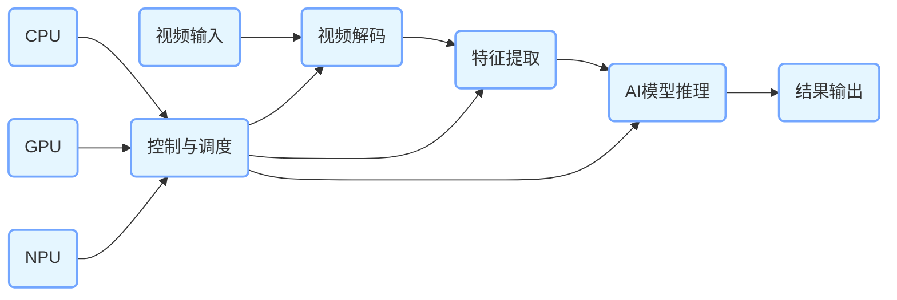

# 如何识别企业的边缘AI视频分析芯片优势

> 关键词：边缘AI视频分析芯片、芯片优势识别、企业芯片评估、AI芯片技术、视频分析应用

> 摘要：本文旨在深入探讨如何识别企业的边缘AI视频分析芯片优势。随着人工智能和视频分析技术的快速发展，边缘AI视频分析芯片在诸多领域的应用日益广泛。了解企业此类芯片的优势，有助于企业在市场竞争中脱颖而出，也能为相关应用开发者和投资者提供重要参考。文章将从背景介绍入手，详细阐述核心概念、算法原理、数学模型等内容，并通过项目实战案例进行说明，最后分析实际应用场景、推荐相关工具资源，总结未来发展趋势与挑战，解答常见问题并提供扩展阅读和参考资料。

## 1. 背景介绍 
### 1.1 目的和范围
本文章的主要目的是为读者提供一套全面且实用的方法，用以识别企业的边缘AI视频分析芯片的优势。在当前科技发展的大背景下，边缘计算和人工智能技术的融合催生了边缘AI视频分析芯片这一新兴产品，其在安防监控、智能交通、工业检测等众多领域具有巨大的应用潜力。文章的范围涵盖了从芯片的基本概念、技术原理到实际应用等多个方面，旨在帮助读者从技术、性能、应用等不同维度对企业的边缘AI视频分析芯片进行评估和判断。

### 1.2 预期读者
本文预期读者包括但不限于芯片行业从业者、人工智能和视频分析领域的开发者、对边缘计算技术感兴趣的研究人员、相关企业的技术决策者以及关注科技投资的人士。无论是希望深入了解芯片技术细节的专业人士，还是寻求技术应用和投资机会的非技术人员，都能从本文中获取有价值的信息。

### 1.3 文档结构概述
本文将按照以下结构展开：首先介绍边缘AI视频分析芯片的背景和相关术语；接着阐述芯片的核心概念、原理和架构，并通过Mermaid流程图进行直观展示；然后详细讲解核心算法原理和具体操作步骤，结合Python源代码进行说明；再介绍相关的数学模型和公式，并举例说明；通过项目实战案例，展示芯片在实际开发中的应用；分析芯片的实际应用场景；推荐相关的学习资源、开发工具框架和论文著作；最后总结未来发展趋势与挑战，解答常见问题并提供扩展阅读和参考资料。

### 1.4 术语表
#### 1.4.1 核心术语定义
- **边缘AI视频分析芯片**：一种集成了人工智能处理能力的芯片，可在靠近数据源头（即边缘设备）对视频数据进行实时分析和处理，无需将大量数据传输到云端。
- **边缘计算**：在靠近物或数据源头的一侧，采用网络、计算、存储、应用核心能力为一体的开放平台，就近提供最近端服务。
- **AI推理**：利用训练好的人工智能模型对输入数据进行预测和分析的过程。
- **视频分析**：对视频数据进行处理、分析和理解，以提取有价值的信息，如目标检测、行为识别等。

#### 1.4.2 相关概念解释
- **深度学习**：一种基于人工神经网络的机器学习方法，通过多层神经网络自动学习数据的特征和模式，在图像和视频分析领域取得了显著的成果。
- **卷积神经网络（CNN）**：一种专门用于处理具有网格结构数据（如图像和视频）的深度学习模型，通过卷积层、池化层等操作提取数据的特征。
- **FPGA（现场可编程门阵列）**：一种可通过编程配置的硬件芯片，具有灵活性高、可定制性强的特点，常用于快速原型开发和特定应用的加速。
- **ASIC（专用集成电路）**：为特定应用定制的集成电路芯片，具有高性能、低功耗的优点，但开发成本高、周期长。

#### 1.4.3 缩略词列表
- **AI**：Artificial Intelligence（人工智能）
- **CNN**：Convolutional Neural Network（卷积神经网络）
- **FPGA**：Field Programmable Gate Array（现场可编程门阵列）
- **ASIC**：Application Specific Integrated Circuit（专用集成电路）
- **NPU**：Neural Processing Unit（神经网络处理器）

## 2. 核心概念与联系 

### 核心概念原理
边缘AI视频分析芯片的核心原理是将人工智能算法集成到芯片中，使其能够在边缘设备上对视频数据进行实时处理和分析。传统的视频分析方法通常需要将视频数据传输到云端进行处理，这不仅会带来较大的网络延迟，还会增加数据传输的成本和安全风险。而边缘AI视频分析芯片则可以在本地完成视频数据的分析，大大提高了处理效率和数据安全性。

芯片内部通常包含多个处理单元，如CPU（中央处理器）、GPU（图形处理器）、NPU（神经网络处理器）等，这些处理单元协同工作，共同完成视频数据的解码、特征提取、模型推理等任务。其中，NPU是专门为人工智能计算设计的处理器，能够高效地执行深度学习模型的推理任务，大大提高了芯片的AI处理能力。

### 架构示意图
以下是边缘AI视频分析芯片的基本架构示意图：



在这个架构中，视频输入首先经过视频解码模块进行解码，将视频数据转换为可处理的格式。然后，特征提取模块从解码后的视频数据中提取有用的特征。接着，AI模型推理模块利用预先训练好的深度学习模型对提取的特征进行分析和预测。最后，将推理结果输出。CPU、GPU和NPU在控制与调度模块的协调下，共同完成各个处理任务。

## 3. 核心算法原理 & 具体操作步骤 

### 核心算法原理
边缘AI视频分析芯片中常用的核心算法是卷积神经网络（CNN）。CNN是一种专门用于处理图像和视频数据的深度学习模型，其基本原理是通过卷积层、池化层和全连接层等操作，自动学习数据的特征和模式。

#### 卷积层
卷积层是CNN的核心组成部分，它通过卷积核与输入数据进行卷积操作，提取数据的局部特征。卷积操作可以表示为：

```python
import numpy as np

def convolution(input_data, kernel):
    input_height, input_width = input_data.shape
    kernel_height, kernel_width = kernel.shape
    output_height = input_height - kernel_height + 1
    output_width = input_width - kernel_width + 1
    output = np.zeros((output_height, output_width))
    for i in range(output_height):
        for j in range(output_width):
            output[i, j] = np.sum(input_data[i:i+kernel_height, j:j+kernel_width] * kernel)
    return output

# 示例
input_data = np.random.rand(5, 5)
kernel = np.random.rand(3, 3)
output = convolution(input_data, kernel)
print(output)
```

#### 池化层
池化层用于减少数据的维度，提高模型的计算效率和鲁棒性。常用的池化操作有最大池化和平均池化。以下是最大池化的Python实现：

```python
def max_pooling(input_data, pool_size):
    input_height, input_width = input_data.shape
    output_height = input_height // pool_size
    output_width = input_width // pool_size
    output = np.zeros((output_height, output_width))
    for i in range(output_height):
        for j in range(output_width):
            output[i, j] = np.max(input_data[i*pool_size:(i+1)*pool_size, j*pool_size:(j+1)*pool_size])
    return output

# 示例
pool_size = 2
pooled_output = max_pooling(output, pool_size)
print(pooled_output)
```

#### 全连接层
全连接层将卷积层和池化层提取的特征进行整合，输出最终的分类或回归结果。全连接层的计算可以表示为矩阵乘法：

```python
def fully_connected(input_data, weights, biases):
    return np.dot(input_data.flatten(), weights) + biases

# 示例
weights = np.random.rand(pooled_output.size, 10)
biases = np.random.rand(10)
final_output = fully_connected(pooled_output, weights, biases)
print(final_output)
```

### 具体操作步骤
1. **数据准备**：收集和整理视频数据，并进行标注，用于模型训练。
2. **模型选择和训练**：选择合适的CNN模型，如ResNet、YOLO等，并使用准备好的数据进行训练。
3. **模型量化**：将训练好的模型进行量化，减少模型的存储空间和计算量，提高芯片的处理效率。
4. **芯片编程和部署**：将量化后的模型部署到边缘AI视频分析芯片上，并进行编程配置，使其能够实时处理视频数据。
5. **测试和优化**：对部署好的芯片进行测试，根据测试结果对模型和芯片进行优化，提高芯片的性能和准确性。

## 4. 数学模型和公式 & 详细讲解 & 举例说明 

### 卷积操作的数学模型
卷积操作可以用以下数学公式表示：

$$
y(m, n) = \sum_{i=0}^{k_h-1} \sum_{j=0}^{k_w-1} x(m + i, n + j) \cdot w(i, j)
$$

其中，$x$ 是输入数据，$w$ 是卷积核，$y$ 是卷积输出，$k_h$ 和 $k_w$ 分别是卷积核的高度和宽度，$m$ 和 $n$ 是输出数据的坐标。

### 池化操作的数学模型
最大池化操作可以表示为：

$$
y(p, q) = \max_{i=0}^{s-1} \max_{j=0}^{s-1} x(p \cdot s + i, q \cdot s + j)
$$

其中，$x$ 是输入数据，$y$ 是池化输出，$s$ 是池化窗口的大小，$p$ 和 $q$ 是输出数据的坐标。

### 全连接层的数学模型
全连接层的计算可以表示为：

$$
y = W \cdot x + b
$$

其中，$x$ 是输入向量，$W$ 是权重矩阵，$b$ 是偏置向量，$y$ 是输出向量。

### 举例说明
假设我们有一个输入图像 $x$ 是一个 $5 \times 5$ 的矩阵，卷积核 $w$ 是一个 $3 \times 3$ 的矩阵，我们可以使用上述卷积公式计算卷积输出。

输入图像 $x$：

$$
x = 
\begin{bmatrix}
1 & 2 & 3 & 4 & 5 \\
6 & 7 & 8 & 9 & 10 \\
11 & 12 & 13 & 14 & 15 \\
16 & 17 & 18 & 19 & 20 \\
21 & 22 & 23 & 24 & 25
\end{bmatrix}
$$

卷积核 $w$：

$$
w = 
\begin{bmatrix}
1 & 0 & 1 \\
0 & 1 & 0 \\
1 & 0 & 1
\end{bmatrix}
$$

根据卷积公式，我们可以计算卷积输出 $y$ 的第一个元素：

$$
y(0, 0) = \sum_{i=0}^{2} \sum_{j=0}^{2} x(0 + i, 0 + j) \cdot w(i, j)
$$

$$
= x(0, 0) \cdot w(0, 0) + x(0, 1) \cdot w(0, 1) + x(0, 2) \cdot w(0, 2) + x(1, 0) \cdot w(1, 0) + x(1, 1) \cdot w(1, 1) + x(1, 2) \cdot w(1, 2) + x(2, 0) \cdot w(2, 0) + x(2, 1) \cdot w(2, 1) + x(2, 2) \cdot w(2, 2)
$$

$$
= 1 \cdot 1 + 2 \cdot 0 + 3 \cdot 1 + 6 \cdot 0 + 7 \cdot 1 + 8 \cdot 0 + 11 \cdot 1 + 12 \cdot 0 + 13 \cdot 1
$$

$$
= 1 + 0 + 3 + 0 + 7 + 0 + 11 + 0 + 13 = 35
$$

通过类似的计算，可以得到整个卷积输出矩阵 $y$。

## 5. 项目实战：代码实际案例和详细解释说明 

### 5.1  开发环境搭建
#### 硬件环境
- **边缘AI视频分析芯片开发板**：选择一款支持AI计算的开发板，如英伟达Jetson Nano、百度昆仑芯片开发板等。
- **摄像头**：用于采集视频数据，可以选择USB摄像头或CSI摄像头。
- **计算机**：用于开发和调试代码，建议使用性能较好的台式机或笔记本电脑。

#### 软件环境
- **操作系统**：根据开发板的要求，安装相应的操作系统，如Ubuntu、Windows等。
- **深度学习框架**：选择合适的深度学习框架，如TensorFlow、PyTorch等，并安装相应的版本。
- **开发工具**：安装Python开发环境和相关的开发工具，如Visual Studio Code、Jupyter Notebook等。

### 5.2  源代码详细实现和代码解读
以下是一个基于TensorFlow和OpenCV的简单边缘AI视频分析项目的代码示例：

```python
import cv2
import tensorflow as tf

# 加载预训练的模型
model = tf.keras.applications.MobileNetV2(weights='imagenet')

# 打开摄像头
cap = cv2.VideoCapture(0)

while True:
    # 读取视频帧
    ret, frame = cap.read()
    if not ret:
        break
    
    # 调整帧的大小
    resized_frame = cv2.resize(frame, (224, 224))
    input_frame = tf.keras.preprocessing.image.img_to_array(resized_frame)
    input_frame = tf.expand_dims(input_frame, 0)
    input_frame = tf.keras.applications.mobilenet_v2.preprocess_input(input_frame)
    
    # 进行模型推理
    predictions = model.predict(input_frame)
    decoded_predictions = tf.keras.applications.mobilenet_v2.decode_predictions(predictions, top=1)[0]
    
    # 在帧上显示预测结果
    for _, label, score in decoded_predictions:
        cv2.putText(frame, f'{label}: {score:.2f}', (10, 30), cv2.FONT_HERSHEY_SIMPLEX, 1, (0, 255, 0), 2)
    
    # 显示帧
    cv2.imshow('Edge AI Video Analysis', frame)
    
    # 按 'q' 键退出循环
    if cv2.waitKey(1) & 0xFF == ord('q'):
        break

# 释放摄像头并关闭窗口
cap.release()
cv2.destroyAllWindows()
```

### 代码解读与分析
1. **加载预训练的模型**：使用 `tf.keras.applications.MobileNetV2` 加载预训练的ImageNet模型，该模型可以用于图像分类任务。
2. **打开摄像头**：使用 `cv2.VideoCapture(0)` 打开默认的摄像头。
3. **读取视频帧**：在循环中不断读取摄像头的视频帧。
4. **调整帧的大小**：将读取的视频帧调整为模型输入所需的大小（224x224），并进行预处理。
5. **进行模型推理**：使用加载的模型对预处理后的帧进行推理，得到预测结果。
6. **显示预测结果**：将预测结果显示在视频帧上。
7. **显示帧**：使用 `cv2.imshow` 显示处理后的视频帧。
8. **退出循环**：按 'q' 键退出循环，释放摄像头并关闭窗口。

## 6. 实际应用场景 
### 安防监控
边缘AI视频分析芯片可以在监控摄像头端实时对视频数据进行分析，实现目标检测、行为识别、事件预警等功能。例如，在公共场所的监控系统中，芯片可以实时检测人员的行为，如奔跑、打架等，并及时发出警报，提高安防效率。

### 智能交通
在智能交通领域，边缘AI视频分析芯片可以用于交通流量监测、违章行为识别、自动驾驶辅助等。例如，在路口的监控设备中，芯片可以实时分析车辆的行驶轨迹、速度等信息，帮助交通管理部门优化交通信号控制，提高道路通行效率。

### 工业检测
在工业生产中，边缘AI视频分析芯片可以用于产品质量检测、设备故障诊断等。例如，在电子产品生产线上，芯片可以实时检测产品的外观缺陷，如划痕、裂纹等，提高产品质量和生产效率。

### 智能家居
在智能家居系统中，边缘AI视频分析芯片可以用于智能门锁、智能摄像头等设备，实现人脸识别、人体检测等功能。例如，智能门锁可以通过芯片实时识别用户的面部特征，实现自动开锁，提高家居安全性和便利性。

## 7. 工具和资源推荐
### 7.1 学习资源推荐
#### 7.1.1 书籍推荐
- 《深度学习》（Deep Learning）：由Ian Goodfellow、Yoshua Bengio和Aaron Courville撰写，是深度学习领域的经典教材，全面介绍了深度学习的基本原理、算法和应用。
- 《Python深度学习》（Deep Learning with Python）：由Francois Chollet撰写，结合Keras框架，详细介绍了如何使用Python进行深度学习开发。
- 《计算机视觉：算法与应用》（Computer Vision: Algorithms and Applications）：由Richard Szeliski撰写，系统介绍了计算机视觉的基本算法和应用，包括图像特征提取、目标检测、图像分割等。

#### 7.1.2 在线课程
- Coursera上的“深度学习专项课程”（Deep Learning Specialization）：由Andrew Ng教授讲授，包括五门课程，全面涵盖了深度学习的各个方面。
- edX上的“人工智能基础”（Introduction to Artificial Intelligence）：由MIT教授讲授，介绍了人工智能的基本概念、算法和应用。
- 哔哩哔哩（B站）上有许多关于深度学习和计算机视觉的免费教程，如“李宏毅机器学习”、“吴恩达深度学习教程”等。

#### 7.1.3 技术博客和网站
- Medium：一个技术博客平台，有许多关于深度学习、人工智能和芯片技术的优质文章。
- arXiv：一个预印本数据库，提供了大量关于人工智能和芯片技术的最新研究成果。
- 机器之心：专注于人工智能领域的科技媒体，提供了丰富的技术资讯和深度报道。

### 7.2 开发工具框架推荐
#### 7.2.1 IDE和编辑器
- Visual Studio Code：一款轻量级的开源代码编辑器，支持多种编程语言和框架，具有丰富的插件和扩展功能。
- PyCharm：一款专门为Python开发设计的集成开发环境（IDE），提供了代码编辑、调试、版本控制等功能。
- Jupyter Notebook：一个交互式的开发环境，支持Python、R等多种编程语言，适合进行数据分析和模型训练。

#### 7.2.2 调试和性能分析工具
- TensorBoard：TensorFlow提供的可视化工具，可以用于监控模型训练过程、分析模型性能等。
- NVIDIA Nsight Compute：一款用于GPU性能分析的工具，可以帮助开发者优化GPU代码，提高芯片的计算效率。
- Valgrind：一款内存调试和性能分析工具，可以检测内存泄漏、内存越界等问题，提高代码的稳定性和性能。

#### 7.2.3 相关框架和库
- TensorFlow：一个开源的深度学习框架，由Google开发，提供了丰富的深度学习模型和工具，支持CPU、GPU和TPU等多种计算设备。
- PyTorch：一个开源的深度学习框架，由Facebook开发，具有动态图机制，易于使用和调试，在学术界和工业界都有广泛的应用。
- OpenCV：一个开源的计算机视觉库，提供了丰富的图像和视频处理算法，支持多种编程语言，如Python、C++等。

### 7.3 相关论文著作推荐
#### 7.3.1 经典论文
- 《ImageNet Classification with Deep Convolutional Neural Networks》：Alex Krizhevsky等人在2012年发表的论文，提出了AlexNet模型，开启了深度学习在计算机视觉领域的新纪元。
- 《Very Deep Convolutional Networks for Large-Scale Image Recognition》：Karen Simonyan和Andrew Zisserman在2014年发表的论文，提出了VGGNet模型，证明了增加网络深度可以提高模型的性能。
- 《Deep Residual Learning for Image Recognition》：Kaiming He等人在2015年发表的论文，提出了ResNet模型，解决了深度神经网络训练过程中的梯度消失和梯度爆炸问题。

#### 7.3.2 最新研究成果
- 在arXiv上可以找到许多关于边缘AI视频分析芯片的最新研究成果，如新型芯片架构设计、高效算法优化等。
- 国际计算机视觉与模式识别会议（CVPR）、神经信息处理系统大会（NeurIPS）等顶级学术会议上也会有相关的研究论文发表。

#### 7.3.3 应用案例分析
- 一些科技媒体和行业报告中会有关于边缘AI视频分析芯片在实际应用中的案例分析，如安防监控、智能交通等领域的应用案例，可以帮助读者了解芯片的实际应用效果和优势。

## 8. 总结：未来发展趋势与挑战
### 未来发展趋势
- **更高的性能和更低的功耗**：随着芯片制造工艺的不断进步，边缘AI视频分析芯片将具备更高的计算性能和更低的功耗，以满足更复杂的视频分析任务和更长的续航需求。
- **集成更多的功能**：未来的芯片将集成更多的功能，如语音识别、传感器融合等，实现更全面的智能感知和交互。
- **更广泛的应用场景**：边缘AI视频分析芯片将在更多的领域得到应用，如医疗、教育、农业等，为各个行业的智能化升级提供支持。
- **与云计算的深度融合**：边缘计算和云计算将实现深度融合，边缘设备负责实时处理和分析本地数据，云端则提供大规模的数据存储和模型训练服务，实现更高效的资源利用和协同工作。

### 挑战
- **算法优化**：随着深度学习模型的不断发展，模型的复杂度和计算量也在不断增加，需要进一步优化算法，提高芯片的计算效率和推理速度。
- **数据隐私和安全**：边缘AI视频分析芯片需要处理大量的敏感数据，如视频图像、个人信息等，需要加强数据隐私和安全保护，防止数据泄露和滥用。
- **芯片设计和制造**：边缘AI视频分析芯片的设计和制造需要具备较高的技术水平和资金投入，需要解决芯片的性能、功耗、成本等多方面的问题。
- **标准和规范**：目前边缘AI视频分析芯片领域缺乏统一的标准和规范，需要建立相关的标准和规范，促进芯片的互操作性和兼容性。

## 9. 附录：常见问题与解答
### 问题1：边缘AI视频分析芯片与传统芯片有什么区别？
边缘AI视频分析芯片集成了人工智能处理能力，可以在边缘设备上对视频数据进行实时分析和处理，而传统芯片主要用于通用计算，不具备专门的AI处理能力。边缘AI视频分析芯片可以减少数据传输延迟和网络带宽需求，提高数据安全性和处理效率。

### 问题2：如何选择适合的边缘AI视频分析芯片？
选择适合的边缘AI视频分析芯片需要考虑以下因素：芯片的计算性能、功耗、成本、支持的深度学习框架和模型、接口和扩展性等。同时，还需要根据具体的应用场景和需求来选择合适的芯片，如安防监控场景需要高帧率、低延迟的芯片，而智能家居场景则需要低功耗、小尺寸的芯片。

### 问题3：边缘AI视频分析芯片的开发难度大吗？
边缘AI视频分析芯片的开发难度相对较大，需要具备芯片设计、人工智能算法、软件开发等多方面的专业知识和技术。开发过程中需要解决芯片的性能优化、算法移植、硬件与软件的协同工作等问题。不过，随着相关技术的不断发展和开源工具的不断完善，开发难度也在逐渐降低。

### 问题4：边缘AI视频分析芯片的市场前景如何？
边缘AI视频分析芯片的市场前景非常广阔。随着人工智能和视频分析技术的不断发展，边缘AI视频分析芯片在安防监控、智能交通、工业检测、智能家居等领域的应用需求不断增加。同时，政府和企业对智能化升级的重视也将推动边缘AI视频分析芯片市场的快速发展。

## 10. 扩展阅读 & 参考资料
### 扩展阅读
- 《人工智能芯片技术与应用》：深入介绍了人工智能芯片的技术原理、设计方法和应用案例。
- 《边缘计算：原理与实践》：系统阐述了边缘计算的基本概念、技术架构和应用场景。
- 《计算机视觉技术与应用》：详细介绍了计算机视觉的各种算法和应用，包括目标检测、图像分割、人脸识别等。

### 参考资料
- 各芯片厂商的官方文档和技术白皮书，如英伟达、英特尔、华为等。
- 相关学术会议和期刊上的研究论文，如CVPR、NeurIPS、IEEE Transactions on Pattern Analysis and Machine Intelligence等。
- 科技媒体和行业报告，如Gartner、IDC等发布的相关报告。

作者：AI天才研究院/AI Genius Institute & 禅与计算机程序设计艺术 /Zen And The Art of Computer Programming