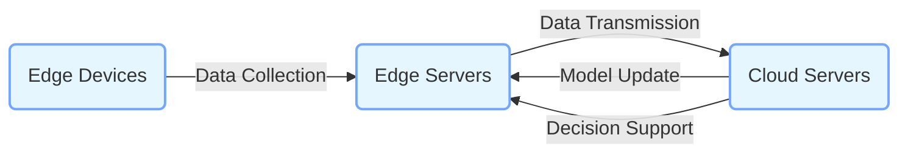

# 如何识别企业的边缘计算实时决策系统优势

> 关键词：边缘计算、实时决策系统、企业优势识别、数据处理、系统性能

> 摘要：本文聚焦于如何识别企业的边缘计算实时决策系统优势。首先介绍了边缘计算实时决策系统的背景知识，包括目的范围、预期读者等内容。接着阐述了核心概念与联系，通过文本示意图和 Mermaid 流程图清晰展示其架构原理。详细讲解了核心算法原理及具体操作步骤，借助 Python 源代码进行说明。引入数学模型和公式，结合实际例子深入剖析。通过项目实战，从开发环境搭建到源代码实现与解读，让读者了解系统在实际中的应用。分析了系统的实际应用场景，并推荐了相关的学习资源、开发工具框架以及论文著作。最后总结了未来发展趋势与挑战，提供常见问题解答和扩展阅读参考资料，旨在帮助读者全面、深入地识别企业边缘计算实时决策系统的优势。

## 1. 背景介绍 
### 1.1 目的和范围
随着信息技术的飞速发展，边缘计算和实时决策系统在企业中的应用越来越广泛。边缘计算能够在靠近数据源的地方进行数据处理和分析，减少数据传输延迟，提高系统的响应速度。实时决策系统则可以根据实时数据快速做出决策，帮助企业提高运营效率、降低成本。本文的目的是帮助读者了解如何识别企业的边缘计算实时决策系统的优势，范围涵盖了边缘计算实时决策系统的核心概念、算法原理、实际应用等方面。

### 1.2 预期读者
本文预期读者包括企业管理人员、技术人员、研究人员以及对边缘计算和实时决策系统感兴趣的人士。企业管理人员可以通过本文了解如何评估企业边缘计算实时决策系统的优势，为企业的战略决策提供参考；技术人员可以深入学习系统的技术原理和实现方法，提升自己的技术水平；研究人员可以从中获取相关的研究思路和方法；对该领域感兴趣的人士可以通过本文了解边缘计算实时决策系统的基本概念和应用场景。

### 1.3 文档结构概述
本文共分为十个部分。第一部分是背景介绍，包括目的和范围、预期读者、文档结构概述和术语表。第二部分阐述核心概念与联系，通过文本示意图和 Mermaid 流程图展示边缘计算实时决策系统的架构原理。第三部分详细讲解核心算法原理和具体操作步骤，并使用 Python 源代码进行说明。第四部分引入数学模型和公式，结合实际例子进行详细讲解。第五部分是项目实战，包括开发环境搭建、源代码详细实现和代码解读。第六部分分析系统的实际应用场景。第七部分推荐相关的学习资源、开发工具框架和论文著作。第八部分总结未来发展趋势与挑战。第九部分是附录，提供常见问题与解答。第十部分是扩展阅读和参考资料。

### 1.4 术语表
#### 1.4.1 核心术语定义
- **边缘计算（Edge Computing）**：是一种分布式计算范式，将计算和数据存储靠近数据源，如传感器、设备等，以减少数据传输延迟，提高系统的响应速度和可靠性。
- **实时决策系统（Real - time Decision System）**：能够根据实时数据快速做出决策的系统，通常应用于需要快速响应的场景，如工业自动化、金融交易等。
- **数据处理（Data Processing）**：对原始数据进行收集、清理、转换、分析等操作，以提取有价值的信息。
- **系统性能（System Performance）**：衡量系统在处理任务时的效率和效果的指标，包括响应时间、吞吐量、可靠性等。

#### 1.4.2 相关概念解释
- **云计算（Cloud Computing）**：是一种基于互联网的计算方式，通过将计算任务分布在大量的计算机构成的资源池上，使用户可以按需获取计算能力、存储空间和软件服务。与边缘计算不同，云计算的数据处理和存储主要集中在远程的数据中心。
- **物联网（Internet of Things, IoT）**：是指通过各种信息传感器、射频识别技术、全球定位系统、红外感应器、激光扫描器等各种装置与技术，实时采集任何需要监控、连接、互动的物体或过程，采集其声、光、热、电、力学、化学、生物、位置等各种需要的信息，通过各类可能的网络接入，实现物与物、物与人的泛在连接，实现对物品和过程的智能化感知、识别和管理。边缘计算和实时决策系统在物联网中有着广泛的应用。

#### 1.4.3 缩略词列表
- **CPU（Central Processing Unit）**：中央处理器，是计算机的核心组件，负责执行计算机程序的指令。
- **GPU（Graphics Processing Unit）**：图形处理器，最初用于处理图形和图像，现在也广泛应用于通用计算领域，尤其是在深度学习等计算密集型任务中。
- **API（Application Programming Interface）**：应用程序编程接口，是一组用于不同软件组件之间进行交互的规范和协议。

## 2. 核心概念与联系 

边缘计算实时决策系统主要由边缘设备、边缘服务器和云端服务器组成。边缘设备负责收集原始数据，如传感器数据、设备状态信息等。边缘服务器靠近边缘设备，对收集到的数据进行初步处理和分析，提取有价值的信息，并根据预设的规则或模型做出实时决策。云端服务器则负责存储大量的历史数据，进行更深入的数据分析和模型训练，为边缘服务器提供决策支持。

下面是边缘计算实时决策系统的架构文本示意图：

```plaintext
+-------------------+         +-------------------+         +-------------------+
|     Edge Devices  |         |   Edge Servers    |         |   Cloud Servers   |
| (Sensors, Devices)|         | (Data Processing  |         | (Data Storage,    |
|                   |         |  and Decision -    |         |  Model Training)  |
|                   |         |  Making)          |         |                   |
+-------------------+         +-------------------+         +-------------------+
        |                             |                             |
        |   Data Collection           |   Data Transmission         |   Data Sharing
        |                             |                             |
        +---------------------------->|                             |
                                      |   Model Update              |
                                      |---------------------------->|
                                      |   Decision Support          |
                                      <----------------------------|
```

下面是对应的 Mermaid 流程图：



在这个系统中，边缘设备与边缘服务器之间的通信是实时的，以确保数据能够及时处理和决策。边缘服务器与云端服务器之间的通信则可以根据实际需求进行定期或不定期的数据同步和模型更新。

## 3. 核心算法原理 & 具体操作步骤 

### 核心算法原理
边缘计算实时决策系统中常用的算法包括机器学习算法和规则引擎算法。下面以机器学习中的决策树算法为例进行详细讲解。

决策树算法是一种基于树结构进行决策的算法，它通过对数据的特征进行分析，构建一个决策树模型。在决策树中，每个内部节点表示一个特征上的测试，每个分支表示一个测试输出，每个叶节点表示一个类别或值。决策树算法的核心思想是通过递归地划分数据集，使得每个子数据集尽可能地“纯净”，即属于同一类别。

### Python 代码实现
```python
import pandas as pd
from sklearn.datasets import load_iris
from sklearn.model_selection import train_test_split
from sklearn.tree import DecisionTreeClassifier
from sklearn.metrics import accuracy_score

# 加载数据集
iris = load_iris()
data = pd.DataFrame(data=iris.data, columns=iris.feature_names)
target = iris.target

# 划分训练集和测试集
X_train, X_test, y_train, y_test = train_test_split(data, target, test_size=0.2, random_state=42)

# 创建决策树分类器
clf = DecisionTreeClassifier()

# 训练模型
clf.fit(X_train, y_train)

# 预测
y_pred = clf.predict(X_test)

# 计算准确率
accuracy = accuracy_score(y_test, y_pred)
print(f"Accuracy: {accuracy}")
```

### 具体操作步骤
1. **数据收集**：从边缘设备收集原始数据，如传感器数据、设备状态信息等。
2. **数据预处理**：对收集到的数据进行清理、转换等操作，去除噪声数据，将数据转换为适合算法处理的格式。
3. **特征选择**：从预处理后的数据中选择与决策相关的特征，减少数据的维度，提高算法的效率。
4. **模型训练**：使用训练数据集对决策树模型进行训练，调整模型的参数，使得模型能够准确地对数据进行分类或预测。
5. **实时决策**：在边缘服务器上部署训练好的模型，当新的数据到来时，使用模型进行实时决策，并将决策结果反馈给相关的设备或系统。
6. **模型更新**：定期或根据实际情况，使用云端服务器上的历史数据对模型进行更新，以提高模型的准确性和适应性。

## 4. 数学模型和公式 & 详细讲解 & 举例说明 

### 信息熵
在决策树算法中，常用信息熵来衡量数据集的纯度。信息熵的计算公式如下：

$$H(X) = -\sum_{i = 1}^{n}p(x_i)\log_2p(x_i)$$

其中，$X$ 是一个离散随机变量，$p(x_i)$ 是 $X$ 取值为 $x_i$ 的概率，$n$ 是 $X$ 可能取值的个数。

信息熵的值越大，表示数据集的纯度越低；信息熵的值越小，表示数据集的纯度越高。当数据集完全纯净时，即所有样本都属于同一类别，信息熵为 0。

### 信息增益
信息增益是决策树算法中用于选择最优特征的指标。信息增益的计算公式如下：

$$IG(D, A) = H(D) - \sum_{v\in Values(A)}\frac{|D^v|}{|D|}H(D^v)$$

其中，$D$ 是数据集，$A$ 是特征，$Values(A)$ 是特征 $A$ 的所有可能取值，$D^v$ 是数据集 $D$ 中特征 $A$ 取值为 $v$ 的子集，$|D|$ 和 $|D^v|$ 分别表示数据集 $D$ 和子集 $D^v$ 的样本数量，$H(D)$ 是数据集 $D$ 的信息熵，$H(D^v)$ 是子集 $D^v$ 的信息熵。

信息增益越大，表示使用该特征进行划分后，数据集的纯度提高得越多，因此该特征越适合作为划分特征。

### 举例说明
假设有一个数据集 $D$，包含 10 个样本，分为两类：类别 1 有 6 个样本，类别 2 有 4 个样本。则数据集 $D$ 的信息熵为：

$$H(D)=-\frac{6}{10}\log_2\frac{6}{10}-\frac{4}{10}\log_2\frac{4}{10}\approx 0.971$$

假设有一个特征 $A$，有两个取值：$A_1$ 和 $A_2$。在特征 $A$ 取值为 $A_1$ 的子集中，有 3 个样本属于类别 1，1 个样本属于类别 2；在特征 $A$ 取值为 $A_2$ 的子集中，有 3 个样本属于类别 1，3 个样本属于类别 2。则子集 $D^{A_1}$ 和 $D^{A_2}$ 的信息熵分别为：

$$H(D^{A_1})=-\frac{3}{4}\log_2\frac{3}{4}-\frac{1}{4}\log_2\frac{1}{4}\approx 0.811$$

$$H(D^{A_2})=-\frac{3}{6}\log_2\frac{3}{6}-\frac{3}{6}\log_2\frac{3}{6}= 1$$

特征 $A$ 的信息增益为：

$$IG(D, A)=H(D)-\frac{4}{10}H(D^{A_1})-\frac{6}{10}H(D^{A_2})\approx 0.971 - \frac{4}{10}\times0.811-\frac{6}{10}\times1\approx 0.146$$

## 5. 项目实战：代码实际案例和详细解释说明 

### 5.1  开发环境搭建
- **操作系统**：推荐使用 Linux 系统，如 Ubuntu 18.04 或更高版本。
- **Python 环境**：安装 Python 3.7 或更高版本。可以使用 Anaconda 来管理 Python 环境，方便安装和管理各种 Python 库。
- **开发工具**：推荐使用 PyCharm 作为集成开发环境（IDE），它提供了丰富的代码编辑、调试和版本控制功能。
- **相关库安装**：安装必要的 Python 库，如 `pandas`、`numpy`、`scikit - learn` 等。可以使用以下命令进行安装：
```bash
pip install pandas numpy scikit-learn
```

### 5.2  源代码详细实现和代码解读
下面是一个简单的边缘计算实时决策系统的代码示例，模拟了边缘设备收集数据、边缘服务器进行实时决策的过程。

```python
import random
import time
from sklearn.tree import DecisionTreeClassifier
import numpy as np

# 模拟边缘设备收集数据
def collect_data():
    # 生成随机数据
    data = [random.uniform(0, 10) for _ in range(4)]
    return np.array(data).reshape(1, -1)

# 模拟边缘服务器进行实时决策
def real_time_decision(model):
    while True:
        # 收集数据
        data = collect_data()
        # 进行决策
        decision = model.predict(data)
        print(f"Collected data: {data}, Decision: {decision}")
        time.sleep(1)

# 训练决策树模型
def train_model():
    # 生成示例数据集
    X = np.random.rand(100, 4)
    y = np.random.randint(0, 2, 100)
    # 创建决策树分类器
    clf = DecisionTreeClassifier()
    # 训练模型
    clf.fit(X, y)
    return clf

if __name__ == "__main__":
    # 训练模型
    model = train_model()
    # 进行实时决策
    real_time_decision(model)
```

### 代码解读与分析
1. **collect_data 函数**：模拟边缘设备收集数据的过程，生成随机的四维数据。
2. **real_time_decision 函数**：模拟边缘服务器进行实时决策的过程。在一个无限循环中，不断收集数据，使用训练好的模型进行决策，并打印决策结果。每次决策间隔 1 秒。
3. **train_model 函数**：生成示例数据集，使用决策树分类器进行训练，并返回训练好的模型。
4. **主程序**：调用 `train_model` 函数训练模型，然后调用 `real_time_decision` 函数进行实时决策。

## 6. 实际应用场景 
### 工业自动化
在工业生产中，边缘计算实时决策系统可以实时监测生产设备的状态，如温度、压力、振动等参数。当设备出现异常时，系统可以立即做出决策，如停止设备运行、调整生产参数等，避免设备损坏和生产事故的发生。同时，系统还可以对生产数据进行实时分析，优化生产流程，提高生产效率。

### 智能交通
在智能交通系统中，边缘计算实时决策系统可以实时收集交通流量、车辆速度、路况等信息。根据这些信息，系统可以实时调整交通信号灯的时间，优化交通流量，减少交通拥堵。此外，系统还可以为驾驶员提供实时的导航和交通信息，提高出行效率。

### 金融交易
在金融交易领域，边缘计算实时决策系统可以实时监测市场行情、交易数据等信息。当出现异常交易或市场波动时，系统可以立即做出决策，如自动止损、调整投资组合等，降低投资风险。同时，系统还可以对交易数据进行实时分析，发现潜在的投资机会。

### 医疗保健
在医疗保健领域，边缘计算实时决策系统可以实时监测患者的生命体征，如心率、血压、血糖等参数。当患者的生命体征出现异常时，系统可以立即通知医生，及时采取治疗措施。此外，系统还可以对医疗数据进行实时分析，为医生提供诊断和治疗建议。

## 7. 工具和资源推荐
### 7.1 学习资源推荐
#### 7.1.1 书籍推荐
- 《Python 机器学习》：这本书详细介绍了 Python 在机器学习领域的应用，包括各种机器学习算法的原理和实现，适合初学者和有一定基础的开发者。
- 《边缘计算：原理与实践》：全面介绍了边缘计算的概念、技术和应用，对边缘计算实时决策系统的学习有很大的帮助。
- 《实时系统设计与分析》：深入讲解了实时系统的设计和分析方法，对于理解实时决策系统的原理和实现有重要的参考价值。

#### 7.1.2 在线课程
- Coursera 上的“机器学习”课程：由斯坦福大学的 Andrew Ng 教授授课，是机器学习领域的经典课程，涵盖了机器学习的基本概念、算法和应用。
- edX 上的“边缘计算基础”课程：介绍了边缘计算的基本原理、架构和应用场景，适合对边缘计算感兴趣的学习者。
- Udemy 上的“Python 数据科学和机器学习实战”课程：通过实际案例讲解 Python 在数据科学和机器学习领域的应用，有助于提高实际编程能力。

#### 7.1.3 技术博客和网站
- Medium：上面有很多关于边缘计算、机器学习和实时决策系统的技术文章，作者来自不同的领域，可以从中获取最新的技术动态和实践经验。
- IEEE Xplore：是电气和电子工程师协会（IEEE）的数字图书馆，提供了大量的学术论文和技术报告，对于深入研究边缘计算实时决策系统有很大的帮助。
- GitHub：是全球最大的开源代码托管平台，上面有很多关于边缘计算和实时决策系统的开源项目，可以学习和参考他人的代码实现。

### 7.2 开发工具框架推荐
#### 7.2.1 IDE和编辑器
- PyCharm：是一款专业的 Python 集成开发环境，提供了丰富的代码编辑、调试和版本控制功能，适合 Python 开发者使用。
- Visual Studio Code：是一款轻量级的代码编辑器，支持多种编程语言，具有丰富的插件扩展功能，可以根据需要安装各种 Python 开发相关的插件。

#### 7.2.2 调试和性能分析工具
- PDB：是 Python 自带的调试器，可以帮助开发者定位代码中的问题。
- cProfile：是 Python 的性能分析工具，可以分析代码的运行时间和函数调用情况，帮助开发者优化代码性能。

#### 7.2.3 相关框架和库
- TensorFlow：是 Google 开发的开源机器学习框架，提供了丰富的机器学习算法和工具，支持分布式训练和部署。
- PyTorch：是 Facebook 开发的开源深度学习框架，具有动态计算图的特点，易于使用和调试。
- Flask：是一个轻量级的 Python Web 框架，可以用于开发边缘服务器的 API 接口。

### 7.3 相关论文著作推荐
#### 7.3.1 经典论文
- 《A Survey on Edge Computing: Vision, Challenges, and Opportunities》：对边缘计算的概念、架构、应用和挑战进行了全面的综述，是边缘计算领域的经典论文。
- 《Real - Time Decision - Making in Cyber - Physical Systems》：探讨了网络物理系统中实时决策的问题和方法，对于理解实时决策系统的原理有重要的参考价值。

#### 7.3.2 最新研究成果
可以通过 IEEE Xplore、ACM Digital Library 等学术数据库搜索最新的研究论文，关注边缘计算实时决策系统领域的最新研究进展。

#### 7.3.3 应用案例分析
一些行业报告和案例分析文档可以帮助读者了解边缘计算实时决策系统在实际应用中的效果和经验。例如，Gartner 的相关报告、企业的技术白皮书等。

## 8. 总结：未来发展趋势与挑战
### 未来发展趋势
- **智能化程度不断提高**：随着人工智能技术的不断发展，边缘计算实时决策系统将越来越智能化。系统将能够自动学习和优化决策模型，提高决策的准确性和效率。
- **与物联网深度融合**：边缘计算实时决策系统将与物联网更加紧密地结合，实现对海量物联网设备的实时监控和管理。系统将能够处理更复杂的物联网数据，为用户提供更智能的服务。
- **跨领域应用拓展**：边缘计算实时决策系统将在更多的领域得到应用，如农业、能源、教育等。不同领域的需求将推动系统的不断创新和发展。

### 挑战
- **数据安全与隐私保护**：边缘计算实时决策系统需要处理大量的敏感数据，如用户的个人信息、企业的商业机密等。如何保障数据的安全和隐私是一个重要的挑战。
- **系统可靠性和稳定性**：在实时决策场景下，系统的可靠性和稳定性至关重要。任何系统故障或延迟都可能导致严重的后果。因此，需要提高系统的容错能力和恢复能力。
- **标准和规范缺乏**：目前，边缘计算实时决策系统的标准和规范还不够完善。不同厂商的产品和解决方案之间缺乏互操作性，这给系统的集成和应用带来了一定的困难。

## 9. 附录：常见问题与解答
### 问题 1：边缘计算实时决策系统与云计算系统有什么区别？
边缘计算实时决策系统将计算和数据处理靠近数据源，减少了数据传输延迟，能够实现实时决策。而云计算系统的数据处理和存储主要集中在远程的数据中心，数据传输延迟较大，不适合实时决策场景。

### 问题 2：如何评估边缘计算实时决策系统的性能？
可以从以下几个方面评估系统的性能：响应时间、吞吐量、可靠性、准确性等。响应时间是指系统从接收到数据到做出决策的时间；吞吐量是指系统在单位时间内能够处理的数据量；可靠性是指系统在长时间运行过程中不出现故障的概率；准确性是指系统决策的正确率。

### 问题 3：边缘计算实时决策系统需要哪些硬件设备？
边缘计算实时决策系统需要边缘设备（如传感器、智能终端等）、边缘服务器和网络设备（如路由器、交换机等）。边缘设备用于收集数据，边缘服务器用于数据处理和决策，网络设备用于数据传输。

### 问题 4：如何保障边缘计算实时决策系统的数据安全？
可以采取以下措施保障数据安全：数据加密、访问控制、身份认证、安全审计等。数据加密可以保护数据在传输和存储过程中的安全性；访问控制可以限制用户对数据的访问权限；身份认证可以确保只有合法用户能够访问系统；安全审计可以对系统的操作进行记录和监控，及时发现和处理安全问题。

## 10. 扩展阅读 & 参考资料
- 《边缘计算技术与应用》
- 《实时决策系统的设计与实现》
- 边缘计算联盟（ECC）的相关报告
- 工业互联网产业联盟（AII）的相关研究成果

作者：AI天才研究院/AI Genius Institute & 禅与计算机程序设计艺术 /Zen And The Art of Computer Programming