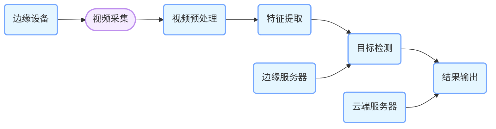

# 如何识别企业的边缘计算实时视频分析优势

> 关键词：边缘计算、实时视频分析、企业优势识别、视频处理、数据分析

> 摘要：本文聚焦于如何识别企业在边缘计算实时视频分析方面的优势。首先介绍相关背景知识，包括目的、预期读者等。接着阐述边缘计算和实时视频分析的核心概念与联系，详细讲解核心算法原理及操作步骤，给出数学模型和公式。通过项目实战案例，展示代码实现与解读。分析实际应用场景，推荐学习资源、开发工具和相关论文著作。最后总结未来发展趋势与挑战，解答常见问题并提供扩展阅读与参考资料，帮助读者全面了解和识别企业在该领域的优势。

## 1. 背景介绍 
### 1.1 目的和范围
随着视频监控系统的广泛部署，产生了海量的视频数据。传统的集中式视频处理方式面临着带宽压力大、延迟高、数据安全等问题。边缘计算实时视频分析技术应运而生，它将视频分析任务下沉到靠近数据源的边缘设备上进行处理，能够有效解决上述问题。本文的目的是帮助读者了解如何识别企业在边缘计算实时视频分析方面的优势，范围涵盖边缘计算和实时视频分析的基本概念、算法原理、实际应用等方面。

### 1.2 预期读者
本文的预期读者包括对边缘计算和实时视频分析技术感兴趣的技术人员、企业管理人员、投资者等。技术人员可以从中了解相关技术的原理和实现细节，企业管理人员可以根据本文的方法评估企业在该领域的竞争力，投资者可以借助本文的内容判断企业的投资价值。

### 1.3 文档结构概述
本文首先介绍背景知识，包括目的、预期读者和文档结构。接着阐述边缘计算和实时视频分析的核心概念与联系，包括原理和架构示意图。然后详细讲解核心算法原理和具体操作步骤，给出数学模型和公式。通过项目实战案例，展示代码实现和解读。分析实际应用场景，推荐学习资源、开发工具和相关论文著作。最后总结未来发展趋势与挑战，解答常见问题并提供扩展阅读与参考资料。

### 1.4 术语表
#### 1.4.1 核心术语定义
- **边缘计算（Edge Computing）**：是一种将计算和数据存储靠近数据源的分布式计算范式，旨在减少数据传输延迟和带宽需求。
- **实时视频分析（Real-time Video Analysis）**：指对视频流进行实时处理和分析，提取有用信息的技术。
- **视频流（Video Stream）**：是指连续的视频图像序列，以数据流的形式进行传输。
- **特征提取（Feature Extraction）**：从视频图像中提取具有代表性的特征，用于后续的分析和识别。
- **目标检测（Object Detection）**：在视频图像中检测出特定目标的位置和类别。

#### 1.4.2 相关概念解释
- **云计算（Cloud Computing）**：与边缘计算相对，是一种集中式的计算模式，将计算和数据存储集中在云端服务器上。
- **物联网（Internet of Things，IoT）**：通过各种传感器和设备将物理世界与数字世界连接起来，产生大量的数据。边缘计算和实时视频分析是物联网应用中的重要技术。
- **深度学习（Deep Learning）**：是一种基于人工神经网络的机器学习方法，在图像和视频处理领域取得了显著的成果。

#### 1.4.3 缩略词列表
- **AI**：Artificial Intelligence，人工智能
- **CNN**：Convolutional Neural Network，卷积神经网络
- **FPS**：Frames Per Second，每秒帧数
- **GPU**：Graphics Processing Unit，图形处理器
- **IoT**：Internet of Things，物联网

## 2. 核心概念与联系 

### 2.1 边缘计算原理
边缘计算的核心思想是将计算和数据存储靠近数据源，减少数据传输到云端的需求。边缘设备可以是摄像头、路由器、网关等，它们具有一定的计算能力，可以在本地对数据进行处理和分析。边缘计算的架构通常包括边缘设备、边缘服务器和云端服务器。边缘设备负责采集数据并进行初步处理，边缘服务器负责进一步处理和分析数据，云端服务器则负责存储和管理大量的数据，并提供更高级的分析和决策支持。

### 2.2 实时视频分析原理
实时视频分析是对视频流进行实时处理和分析，提取有用信息的技术。它通常包括视频采集、视频预处理、特征提取、目标检测和识别等步骤。视频采集是通过摄像头等设备获取视频流，视频预处理是对视频图像进行去噪、增强等处理，特征提取是从视频图像中提取具有代表性的特征，目标检测和识别是根据提取的特征检测出特定目标的位置和类别。

### 2.3 边缘计算与实时视频分析的联系
边缘计算为实时视频分析提供了有力的支持。通过将视频分析任务下沉到边缘设备上进行处理，可以减少数据传输延迟和带宽需求，提高视频分析的实时性和效率。同时，边缘计算还可以保护数据隐私和安全，避免数据在传输过程中被泄露。实时视频分析则为边缘计算提供了应用场景和数据来源，通过对视频数据的分析和处理，可以实现智能监控、智能交通、工业自动化等应用。

### 2.4 核心概念架构的文本示意图
```plaintext
+---------------------+
|      云端服务器     |
|  数据存储与管理      |
|  高级分析与决策支持  |
+---------------------+
          |
          v
+---------------------+
|      边缘服务器     |
|  数据处理与分析      |
+---------------------+
          |
          v
+---------------------+
|      边缘设备       |
|  视频采集与预处理    |
|  特征提取与目标检测  |
+---------------------+
```

### 2.5 Mermaid 流程图


## 3. 核心算法原理 & 具体操作步骤 

### 3.1 特征提取算法 - 卷积神经网络（CNN）
卷积神经网络（CNN）是一种专门用于处理图像和视频数据的深度学习模型。它通过卷积层、池化层和全连接层等组件，自动提取图像和视频中的特征。以下是一个简单的CNN模型的Python代码示例：

```python
import tensorflow as tf
from tensorflow.keras import layers, models

# 构建CNN模型
model = models.Sequential()
model.add(layers.Conv2D(32, (3, 3), activation='relu', input_shape=(150, 150, 3)))
model.add(layers.MaxPooling2D((2, 2)))
model.add(layers.Conv2D(64, (3, 3), activation='relu'))
model.add(layers.MaxPooling2D((2, 2)))
model.add(layers.Conv2D(128, (3, 3), activation='relu'))
model.add(layers.MaxPooling2D((2, 2)))
model.add(layers.Flatten())
model.add(layers.Dense(128, activation='relu'))
model.add(layers.Dense(1, activation='sigmoid'))

# 编译模型
model.compile(optimizer='adam',
              loss='binary_crossentropy',
              metrics=['accuracy'])

# 打印模型结构
model.summary()
```

### 3.2 目标检测算法 - YOLO（You Only Look Once）
YOLO是一种实时目标检测算法，它将目标检测任务转化为一个回归问题，通过一次前向传播即可同时预测多个目标的位置和类别。以下是一个使用YOLOv5进行目标检测的Python代码示例：

```python
import torch

# 加载预训练的YOLOv5模型
model = torch.hub.load('ultralytics/yolov5', 'yolov5s', pretrained=True)

# 读取图像
img = 'path/to/your/image.jpg'

# 进行目标检测
results = model(img)

# 显示检测结果
results.show()
```

### 3.3 具体操作步骤
1. **数据采集**：使用摄像头等设备采集视频流。
2. **视频预处理**：对采集到的视频图像进行去噪、增强等处理，提高图像质量。
3. **特征提取**：使用CNN等算法从视频图像中提取具有代表性的特征。
4. **目标检测**：使用YOLO等算法根据提取的特征检测出特定目标的位置和类别。
5. **结果输出**：将检测结果输出到显示器、数据库等。

## 4. 数学模型和公式 & 详细讲解 & 举例说明 

### 4.1 卷积操作
卷积操作是CNN中的核心操作，它通过卷积核与输入图像进行卷积运算，提取图像中的特征。卷积操作的数学公式如下：

$$
y_{i,j} = \sum_{m=0}^{M-1} \sum_{n=0}^{N-1} x_{i+m,j+n} \cdot k_{m,n} + b
$$

其中，$x$ 是输入图像，$k$ 是卷积核，$b$ 是偏置项，$y$ 是卷积输出。

### 4.2 池化操作
池化操作是用于减少特征图的尺寸，降低计算量。常见的池化操作有最大池化和平均池化。最大池化的数学公式如下：

$$
y_{i,j} = \max_{m=0}^{M-1} \max_{n=0}^{N-1} x_{iM+m,jN+n}
$$

其中，$x$ 是输入特征图，$y$ 是池化输出。

### 4.3 举例说明
假设我们有一个输入图像 $x$ 的尺寸为 $3\times3$，卷积核 $k$ 的尺寸为 $2\times2$，偏置项 $b = 1$。输入图像和卷积核的值如下：

$$
x = \begin{bmatrix}
1 & 2 & 3 \\
4 & 5 & 6 \\
7 & 8 & 9
\end{bmatrix}, \quad
k = \begin{bmatrix}
1 & 0 \\
0 & 1
\end{bmatrix}
$$

根据卷积操作的公式，我们可以计算卷积输出 $y$：

$$
y_{0,0} = \sum_{m=0}^{1} \sum_{n=0}^{1} x_{0+m,0+n} \cdot k_{m,n} + b = (1\times1 + 2\times0 + 4\times0 + 5\times1) + 1 = 7
$$

$$
y_{0,1} = \sum_{m=0}^{1} \sum_{n=0}^{1} x_{0+m,1+n} \cdot k_{m,n} + b = (2\times1 + 3\times0 + 5\times0 + 6\times1) + 1 = 9
$$

$$
y_{1,0} = \sum_{m=0}^{1} \sum_{n=0}^{1} x_{1+m,0+n} \cdot k_{m,n} + b = (4\times1 + 5\times0 + 7\times0 + 8\times1) + 1 = 13
$$

$$
y_{1,1} = \sum_{m=0}^{1} \sum_{n=0}^{1} x_{1+m,1+n} \cdot k_{m,n} + b = (5\times1 + 6\times0 + 8\times0 + 9\times1) + 1 = 15
$$

因此，卷积输出 $y$ 为：

$$
y = \begin{bmatrix}
7 & 9 \\
13 & 15
\end{bmatrix}
$$

## 5. 项目实战：代码实际案例和详细解释说明 

### 5.1  开发环境搭建
1. **安装Python**：从Python官方网站下载并安装Python 3.x版本。
2. **安装深度学习框架**：推荐使用TensorFlow和PyTorch，可以通过pip命令进行安装：
```bash
pip install tensorflow
pip install torch torchvision
```
3. **安装其他依赖库**：根据项目需求安装其他依赖库，如OpenCV、NumPy等：
```bash
pip install opencv-python numpy
```

### 5.2  源代码详细实现和代码解读
以下是一个使用OpenCV和YOLOv5进行实时视频目标检测的Python代码示例：

```python
import cv2
import torch

# 加载预训练的YOLOv5模型
model = torch.hub.load('ultralytics/yolov5', 'yolov5s', pretrained=True)

# 打开摄像头
cap = cv2.VideoCapture(0)

while True:
    # 读取视频帧
    ret, frame = cap.read()
    if not ret:
        break
    
    # 进行目标检测
    results = model(frame)
    
    # 获取检测结果
    detections = results.pandas().xyxy[0]
    
    # 在图像上绘制检测框
    for _, detection in detections.iterrows():
        x1, y1, x2, y2 = int(detection['xmin']), int(detection['ymin']), int(detection['xmax']), int(detection['ymax'])
        label = detection['name']
        confidence = detection['confidence']
        cv2.rectangle(frame, (x1, y1), (x2, y2), (0, 255, 0), 2)
        cv2.putText(frame, f'{label}: {confidence:.2f}', (x1, y1 - 10), cv2.FONT_HERSHEY_SIMPLEX, 0.9, (0, 255, 0), 2)
    
    # 显示图像
    cv2.imshow('Real-time Object Detection', frame)
    
    # 按 'q' 键退出循环
    if cv2.waitKey(1) & 0xFF == ord('q'):
        break

# 释放摄像头并关闭窗口
cap.release()
cv2.destroyAllWindows()
```

### 5.3  代码解读与分析
1. **加载模型**：使用 `torch.hub.load` 函数加载预训练的YOLOv5模型。
2. **打开摄像头**：使用 `cv2.VideoCapture` 函数打开摄像头。
3. **循环读取视频帧**：在循环中不断读取视频帧，并使用YOLOv5模型进行目标检测。
4. **绘制检测框**：根据检测结果，在图像上绘制检测框和标签。
5. **显示图像**：使用 `cv2.imshow` 函数显示处理后的图像。
6. **退出循环**：按 'q' 键退出循环，释放摄像头并关闭窗口。

## 6. 实际应用场景 
### 6.1 智能安防
在智能安防领域，边缘计算实时视频分析技术可以实现实时监控、目标检测、行为分析等功能。通过在边缘设备上进行视频分析，可以及时发现异常行为并发出警报，提高安防效率和响应速度。

### 6.2 智能交通
在智能交通领域，边缘计算实时视频分析技术可以实现交通流量监测、违章行为检测、车辆识别等功能。通过对交通视频的实时分析，可以优化交通信号控制，提高交通效率，减少交通事故。

### 6.3 工业自动化
在工业自动化领域，边缘计算实时视频分析技术可以实现生产过程监控、质量检测、设备故障诊断等功能。通过对工业视频的实时分析，可以及时发现生产过程中的问题并进行处理，提高生产效率和产品质量。

### 6.4 零售业
在零售业，边缘计算实时视频分析技术可以实现客流量统计、顾客行为分析、商品陈列优化等功能。通过对店铺视频的实时分析，可以了解顾客需求和行为习惯，优化店铺运营和营销策略。

## 7. 工具和资源推荐
### 7.1 学习资源推荐
#### 7.1.1 书籍推荐
- 《深度学习》（Deep Learning）：由Ian Goodfellow、Yoshua Bengio和Aaron Courville所著，是深度学习领域的经典教材。
- 《Python深度学习》（Deep Learning with Python）：由Francois Chollet所著，介绍了如何使用Python和Keras进行深度学习开发。
- 《计算机视觉：算法与应用》（Computer Vision: Algorithms and Applications）：由Richard Szeliski所著，涵盖了计算机视觉的基本算法和应用。

#### 7.1.2 在线课程
- Coursera上的“深度学习专项课程”（Deep Learning Specialization）：由Andrew Ng教授授课，是深度学习领域的经典在线课程。
- edX上的“计算机视觉基础”（Foundations of Computer Vision）：介绍了计算机视觉的基本概念和算法。
- 哔哩哔哩上的“动手学深度学习”（Dive into Deep Learning）：由李沐等老师授课，通过代码实践的方式介绍深度学习的原理和应用。

#### 7.1.3 技术博客和网站
- Medium：是一个技术博客平台，上面有很多关于边缘计算、实时视频分析和深度学习的优质文章。
- arXiv：是一个预印本论文库，上面可以找到最新的研究成果和技术报告。
- OpenCV官方文档：提供了OpenCV库的详细文档和教程，是学习计算机视觉的重要资源。

### 7.2 开发工具框架推荐
#### 7.2.1 IDE和编辑器
- PyCharm：是一款专门为Python开发设计的集成开发环境，提供了丰富的功能和插件。
- Jupyter Notebook：是一个交互式的开发环境，适合进行数据探索和模型实验。
- Visual Studio Code：是一款轻量级的代码编辑器，支持多种编程语言和插件。

#### 7.2.2 调试和性能分析工具
- TensorBoard：是TensorFlow提供的可视化工具，可以用于调试和分析深度学习模型的训练过程。
- Py-Spy：是一个Python性能分析工具，可以用于分析Python代码的性能瓶颈。
- NVIDIA Nsight Systems：是NVIDIA提供的性能分析工具，适用于GPU加速的深度学习应用。

#### 7.2.3 相关框架和库
- TensorFlow：是一个开源的深度学习框架，由Google开发，提供了丰富的工具和接口。
- PyTorch：是一个开源的深度学习框架，由Facebook开发，具有动态图和易于使用的特点。
- OpenCV：是一个开源的计算机视觉库，提供了各种图像处理和计算机视觉算法。

### 7.3 相关论文著作推荐
#### 7.3.1 经典论文
- "You Only Look Once: Unified, Real-Time Object Detection"：介绍了YOLO目标检测算法的原理和实现。
- "Deep Residual Learning for Image Recognition"：提出了残差网络（ResNet）的概念，解决了深度神经网络训练中的梯度消失问题。
- "Convolutional Neural Networks for Visual Recognition"：介绍了卷积神经网络在图像识别领域的应用和发展。

#### 7.3.2 最新研究成果
- 关注CVPR、ICCV、ECCV等计算机视觉领域的顶级会议，以及arXiv上的最新预印本论文，可以了解到边缘计算实时视频分析领域的最新研究成果。

#### 7.3.3 应用案例分析
- 一些企业和研究机构会发布边缘计算实时视频分析的应用案例，可以通过阅读这些案例了解该技术在实际应用中的效果和挑战。

## 8. 总结：未来发展趋势与挑战
### 8.1 未来发展趋势
- **硬件性能提升**：随着芯片技术的不断发展，边缘设备的计算能力将不断提升，能够支持更复杂的视频分析任务。
- **算法优化**：深度学习算法将不断优化，提高视频分析的准确性和效率。
- **多模态融合**：将视频分析与其他传感器数据（如音频、雷达等）进行融合，实现更全面的信息感知和分析。
- **应用场景拓展**：边缘计算实时视频分析技术将在更多领域得到应用，如医疗、教育、农业等。

### 8.2 挑战
- **数据隐私和安全**：边缘设备上存储和处理大量的视频数据，如何保护数据隐私和安全是一个重要的挑战。
- **算法可解释性**：深度学习算法通常是黑盒模型，缺乏可解释性，如何提高算法的可解释性是一个亟待解决的问题。
- **网络通信**：边缘设备与边缘服务器、云端服务器之间的网络通信可能存在不稳定的情况，如何保证数据传输的可靠性和实时性是一个挑战。
- **标准化和兼容性**：目前边缘计算和实时视频分析领域缺乏统一的标准和规范，不同厂商的设备和算法之间可能存在兼容性问题。

## 9. 附录：常见问题与解答
### 9.1 边缘计算和云计算有什么区别？
边缘计算将计算和数据存储靠近数据源，减少数据传输到云端的需求，降低延迟和带宽压力。云计算则将计算和数据存储集中在云端服务器上，提供强大的计算和存储能力。

### 9.2 实时视频分析的准确性如何保证？
可以通过以下方法保证实时视频分析的准确性：
- 使用高质量的摄像头和传感器，提高视频图像的质量。
- 选择合适的算法和模型，并进行充分的训练和优化。
- 进行数据增强和预处理，提高模型的泛化能力。
- 定期对模型进行评估和更新，适应不同的场景和数据变化。

### 9.3 边缘计算实时视频分析的成本高吗？
边缘计算实时视频分析的成本主要包括硬件设备成本、软件算法成本和运维成本。随着技术的发展和市场竞争的加剧，硬件设备成本和软件算法成本逐渐降低。同时，边缘计算可以减少数据传输成本和云端计算成本，总体成本可能会降低。

### 9.4 如何选择适合的边缘设备？
选择适合的边缘设备需要考虑以下因素：
- 计算能力：根据视频分析任务的复杂度和实时性要求，选择具有足够计算能力的边缘设备。
- 存储容量：根据视频数据的存储需求，选择具有足够存储容量的边缘设备。
- 网络接口：根据网络通信的需求，选择具有合适网络接口的边缘设备。
- 功耗和散热：考虑边缘设备的功耗和散热性能，确保设备在长时间运行时的稳定性。

## 10. 扩展阅读 & 参考资料
### 10.1 扩展阅读
- 《人工智能时代的边缘计算》：深入探讨了边缘计算在人工智能领域的应用和发展。
- 《智能视频分析技术与应用》：详细介绍了智能视频分析的原理、算法和应用案例。
- 《深度学习实战》：通过实际案例介绍了深度学习在图像、视频处理等领域的应用。

### 10.2 参考资料
- OpenCV官方文档：https://docs.opencv.org/
- TensorFlow官方文档：https://www.tensorflow.org/
- PyTorch官方文档：https://pytorch.org/
- YOLOv5官方仓库：https://github.com/ultralytics/yolov5

作者：AI天才研究院/AI Genius Institute & 禅与计算机程序设计艺术 /Zen And The Art of Computer Programming