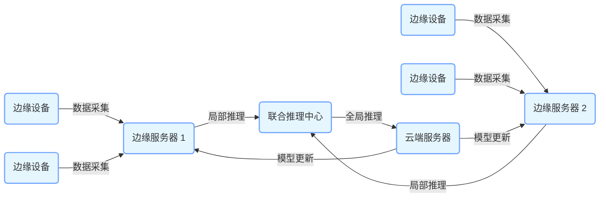

# 如何识别企业的边缘计算联合推理优势

> 关键词：边缘计算、联合推理、企业优势识别、分布式计算、人工智能

> 摘要：本文围绕如何识别企业的边缘计算联合推理优势展开探讨。详细介绍了边缘计算和联合推理的核心概念及其联系，阐述了相关算法原理、数学模型，通过项目实战案例展示了具体应用。分析了边缘计算联合推理在不同场景下的实际应用，推荐了学习资源、开发工具和相关论文著作。最后总结了未来发展趋势与挑战，并对常见问题进行解答，为企业识别自身在边缘计算联合推理方面的优势提供全面的指导。

## 1. 背景介绍 
### 1.1 目的和范围
随着信息技术的飞速发展，边缘计算和联合推理逐渐成为企业提升竞争力的关键技术。本文章的目的在于帮助企业准确识别自身在边缘计算联合推理方面的优势，为企业的技术战略规划和业务发展提供参考。范围涵盖了边缘计算联合推理的核心概念、算法原理、数学模型、实际应用场景等多个方面，通过理论分析和实际案例相结合的方式，深入探讨企业优势的识别方法。

### 1.2 预期读者
本文预期读者包括企业的技术决策者、技术研发人员、对边缘计算和联合推理感兴趣的研究人员以及相关领域的投资者。这些读者希望了解边缘计算联合推理的技术原理和应用，以及如何评估企业在该领域的优势，从而做出合理的决策。

### 1.3 文档结构概述
本文共分为十个部分。首先介绍背景信息，包括目的、预期读者和文档结构概述。接着阐述边缘计算和联合推理的核心概念及其联系，通过文本示意图和 Mermaid 流程图进行直观展示。然后详细讲解核心算法原理和具体操作步骤，结合 Python 源代码进行说明。随后介绍数学模型和公式，并通过举例进行详细讲解。通过项目实战案例，展示开发环境搭建、源代码实现和代码解读。分析边缘计算联合推理的实际应用场景。推荐学习资源、开发工具和相关论文著作。总结未来发展趋势与挑战。最后提供常见问题与解答和扩展阅读及参考资料。

### 1.4 术语表
#### 1.4.1 核心术语定义
- **边缘计算**：是一种将计算和数据存储靠近数据源的分布式计算范式，旨在减少数据传输延迟，提高系统的响应速度和可靠性。
- **联合推理**：指多个计算节点协同进行推理任务，通过共享计算资源和数据，提高推理的准确性和效率。
- **推理**：在人工智能领域，指根据已有的模型和输入数据，得出输出结果的过程。

#### 1.4.2 相关概念解释
- **分布式计算**：将一个大的计算任务分解为多个小的子任务，分布在不同的计算节点上并行执行，以提高计算效率。
- **人工智能模型**：是一种基于数据训练得到的数学模型，用于解决各种人工智能问题，如图像识别、自然语言处理等。

#### 1.4.3 缩略词列表
- **AI**：Artificial Intelligence，人工智能
- **IoT**：Internet of Things，物联网
- **CPU**：Central Processing Unit，中央处理器
- **GPU**：Graphics Processing Unit，图形处理器

## 2. 核心概念与联系 
### 核心概念原理
#### 边缘计算原理
边缘计算的核心思想是将计算和数据处理推向网络边缘，靠近数据源。传统的云计算模式中，数据需要传输到远程的数据中心进行处理，这会导致较大的延迟。而边缘计算通过在数据源附近部署边缘设备（如传感器、网关、边缘服务器等），可以在本地对数据进行初步处理和分析，只将必要的数据传输到云端。这样可以减少数据传输量，降低延迟，提高系统的实时性和可靠性。

#### 联合推理原理
联合推理是多个计算节点协同工作的过程。在联合推理中，不同的计算节点可以拥有不同的计算资源和数据，通过网络进行通信和协作。每个节点可以根据自身的能力和数据进行局部推理，然后将推理结果与其他节点进行共享和融合，最终得到更准确的全局推理结果。联合推理可以充分利用分布式计算资源，提高推理的效率和准确性。

### 架构的文本示意图
边缘计算联合推理架构主要包括边缘设备层、边缘服务器层和云端层。边缘设备层负责数据的采集和初步处理，如传感器采集环境数据，摄像头采集图像数据等。边缘服务器层部署在靠近边缘设备的位置，对边缘设备上传的数据进行进一步处理和推理，同时与其他边缘服务器进行通信和协作。云端层则负责对整个系统进行管理和协调，存储大量的数据和模型，并提供远程的计算和分析服务。

### Mermaid 流程图


该流程图展示了边缘计算联合推理的基本流程。边缘设备采集数据并将其发送到边缘服务器，边缘服务器进行局部推理，然后将推理结果发送到联合推理中心进行全局推理。云端服务器对整个系统进行管理和协调，并将更新后的模型发送到边缘服务器。

## 3. 核心算法原理 & 具体操作步骤 
### 核心算法原理
在边缘计算联合推理中，常用的算法包括分布式机器学习算法和联邦学习算法。下面以分布式梯度下降算法为例进行详细讲解。

分布式梯度下降算法是一种用于训练机器学习模型的分布式算法。其基本思想是将训练数据分布在多个计算节点上，每个节点独立计算梯度，然后将梯度信息进行汇总和平均，最后根据平均梯度更新模型参数。通过不断迭代这个过程，最终使模型收敛到最优解。

### Python 源代码实现
```python
import numpy as np

# 定义一个简单的线性回归模型
class LinearRegression:
    def __init__(self, learning_rate=0.01, num_iterations=100):
        self.learning_rate = learning_rate
        self.num_iterations = num_iterations
        self.weights = None
        self.bias = None

    def fit(self, X, y):
        num_samples, num_features = X.shape
        self.weights = np.zeros(num_features)
        self.bias = 0

        for _ in range(self.num_iterations):
            # 计算预测值
            y_pred = np.dot(X, self.weights) + self.bias

            # 计算梯度
            dw = (1 / num_samples) * np.dot(X.T, (y_pred - y))
            db = (1 / num_samples) * np.sum(y_pred - y)

            # 更新参数
            self.weights -= self.learning_rate * dw
            self.bias -= self.learning_rate * db

    def predict(self, X):
        return np.dot(X, self.weights) + self.bias

# 模拟分布式数据
X1 = np.array([[1, 2], [2, 3], [3, 4]])
y1 = np.array([3, 4, 5])
X2 = np.array([[4, 5], [5, 6], [6, 7]])
y2 = np.array([6, 7, 8])

# 初始化模型
model = LinearRegression()

# 在第一个节点上进行局部训练
model.fit(X1, y1)
weights1 = model.weights
bias1 = model.bias

# 在第二个节点上进行局部训练
model.fit(X2, y2)
weights2 = model.weights
bias2 = model.bias

# 汇总梯度信息
average_weights = (weights1 + weights2) / 2
average_bias = (bias1 + bias2) / 2

# 更新模型参数
model.weights = average_weights
model.bias = average_bias

# 进行预测
test_X = np.array([[7, 8]])
prediction = model.predict(test_X)
print("预测结果:", prediction)
```

### 具体操作步骤
1. **数据划分**：将训练数据划分到不同的边缘节点上。
2. **局部训练**：每个边缘节点独立地使用本地数据进行模型训练，计算梯度信息。
3. **梯度汇总**：将各个边缘节点的梯度信息进行汇总和平均。
4. **参数更新**：根据平均梯度更新模型参数。
5. **迭代训练**：重复步骤 2 - 4，直到模型收敛。

## 4. 数学模型和公式 & 详细讲解 & 举例说明 
### 线性回归模型的数学模型和公式
在线性回归中，我们假设输入特征 $X$ 和输出变量 $y$ 之间存在线性关系，其数学模型可以表示为：

$$y = \theta_0 + \theta_1x_1 + \theta_2x_2 + \cdots + \theta_nx_n + \epsilon$$

其中，$\theta_0$ 是截距，$\theta_1, \theta_2, \cdots, \theta_n$ 是特征的权重，$x_1, x_2, \cdots, x_n$ 是输入特征，$\epsilon$ 是误差项。

为了找到最优的参数 $\theta = [\theta_0, \theta_1, \cdots, \theta_n]^T$，我们通常使用最小二乘法，即最小化损失函数：

$$J(\theta) = \frac{1}{2m}\sum_{i=1}^{m}(h_{\theta}(x^{(i)}) - y^{(i)})^2$$

其中，$m$ 是样本数量，$h_{\theta}(x^{(i)})$ 是第 $i$ 个样本的预测值，$y^{(i)}$ 是第 $i$ 个样本的真实值。

### 梯度下降算法的公式
梯度下降算法通过不断更新参数 $\theta$ 来最小化损失函数 $J(\theta)$。参数的更新公式为：

$$\theta_j := \theta_j - \alpha\frac{\partial J(\theta)}{\partial \theta_j}$$

其中，$\alpha$ 是学习率，$\frac{\partial J(\theta)}{\partial \theta_j}$ 是损失函数 $J(\theta)$ 关于参数 $\theta_j$ 的偏导数。

对于线性回归模型，偏导数的计算公式为：

$$\frac{\partial J(\theta)}{\partial \theta_j} = \frac{1}{m}\sum_{i=1}^{m}(h_{\theta}(x^{(i)}) - y^{(i)})x_j^{(i)}$$

### 举例说明
假设我们有一个简单的线性回归问题，输入特征 $X = [1, 2, 3]$，输出变量 $y = [2, 4, 6]$。我们使用梯度下降算法来训练模型，学习率 $\alpha = 0.01$，迭代次数为 100。

初始时，我们将参数 $\theta_0 = 0$，$\theta_1 = 0$。在每次迭代中，我们计算预测值 $h_{\theta}(x^{(i)}) = \theta_0 + \theta_1x^{(i)}$，然后计算损失函数 $J(\theta)$ 和偏导数 $\frac{\partial J(\theta)}{\partial \theta_j}$，最后更新参数 $\theta_j$。

经过 100 次迭代后，我们得到最优的参数 $\theta_0$ 和 $\theta_1$，从而得到线性回归模型。

## 5. 项目实战：代码实际案例和详细解释说明 
### 5.1  开发环境搭建
#### 硬件环境
- 边缘设备：可以选择 Raspberry Pi、Jetson Nano 等开发板。
- 边缘服务器：可以使用普通的 Linux 服务器，如 Ubuntu Server。
- 云端服务器：可以选择云服务提供商，如阿里云、腾讯云等。

#### 软件环境
- 操作系统：边缘设备和边缘服务器可以安装 Linux 操作系统，如 Ubuntu、Raspbian 等。
- 编程语言：Python 是首选的编程语言，因为它具有丰富的机器学习和深度学习库。
- 机器学习库：可以使用 TensorFlow、PyTorch 等深度学习框架，以及 Scikit-learn 等机器学习库。

### 5.2  源代码详细实现和代码解读
```python
import tensorflow as tf
import numpy as np
import socket
import struct

# 定义边缘节点类
class EdgeNode:
    def __init__(self, model, data, server_address):
        self.model = model
        self.data = data
        self.server_address = server_address
        self.sock = socket.socket(socket.AF_INET, socket.SOCK_STREAM)

    def connect_to_server(self):
        self.sock.connect(self.server_address)

    def train_local_model(self):
        X, y = self.data
        self.model.fit(X, y, epochs=10, batch_size=32)

    def send_model_weights(self):
        weights = self.model.get_weights()
        for weight in weights:
            # 将权重转换为字节流
            weight_bytes = weight.tobytes()
            # 发送权重的长度
            length = len(weight_bytes)
            self.sock.sendall(struct.pack('!I', length))
            # 发送权重数据
            self.sock.sendall(weight_bytes)

    def receive_model_weights(self):
        new_weights = []
        while True:
            # 接收权重的长度
            length_bytes = self.sock.recv(4)
            if not length_bytes:
                break
            length = struct.unpack('!I', length_bytes)[0]
            # 接收权重数据
            weight_bytes = b''
            while len(weight_bytes) < length:
                remaining = length - len(weight_bytes)
                weight_bytes += self.sock.recv(min(4096, remaining))
            # 将字节流转换为权重
            weight = np.frombuffer(weight_bytes, dtype=np.float32)
            new_weights.append(weight)
        self.model.set_weights(new_weights)

    def close_connection(self):
        self.sock.close()

# 定义云端服务器类
class CloudServer:
    def __init__(self, model, num_clients):
        self.model = model
        self.num_clients = num_clients
        self.sock = socket.socket(socket.AF_INET, socket.SOCK_STREAM)
        self.sock.bind(('localhost', 8888))
        self.sock.listen(num_clients)

    def accept_connections(self):
        self.clients = []
        for _ in range(self.num_clients):
            client_socket, client_address = self.sock.accept()
            self.clients.append(client_socket)

    def receive_model_weights(self):
        all_weights = []
        for client_socket in self.clients:
            client_weights = []
            while True:
                # 接收权重的长度
                length_bytes = client_socket.recv(4)
                if not length_bytes:
                    break
                length = struct.unpack('!I', length_bytes)[0]
                # 接收权重数据
                weight_bytes = b''
                while len(weight_bytes) < length:
                    remaining = length - len(weight_bytes)
                    weight_bytes += client_socket.recv(min(4096, remaining))
                # 将字节流转换为权重
                weight = np.frombuffer(weight_bytes, dtype=np.float32)
                client_weights.append(weight)
            all_weights.append(client_weights)
        return all_weights

    def aggregate_model_weights(self, all_weights):
        num_clients = len(all_weights)
        num_layers = len(all_weights[0])
        aggregated_weights = []
        for layer in range(num_layers):
            layer_weights = []
            for client in range(num_clients):
                layer_weights.append(all_weights[client][layer])
            # 计算平均权重
            average_weight = np.mean(layer_weights, axis=0)
            aggregated_weights.append(average_weight)
        self.model.set_weights(aggregated_weights)

    def send_model_weights(self):
        weights = self.model.get_weights()
        for client_socket in self.clients:
            for weight in weights:
                # 将权重转换为字节流
                weight_bytes = weight.tobytes()
                # 发送权重的长度
                length = len(weight_bytes)
                client_socket.sendall(struct.pack('!I', length))
                # 发送权重数据
                client_socket.sendall(weight_bytes)

    def close_connections(self):
        for client_socket in self.clients:
            client_socket.close()
        self.sock.close()

# 生成示例数据
X = np.random.rand(100, 10)
y = np.random.randint(0, 2, 100)

# 划分数据到两个边缘节点
X1, X2 = np.split(X, 2)
y1, y2 = np.split(y, 2)

# 定义模型
model = tf.keras.Sequential([
    tf.keras.layers.Dense(10, activation='relu', input_shape=(10,)),
    tf.keras.layers.Dense(1, activation='sigmoid')
])
model.compile(optimizer='adam', loss='binary_crossentropy', metrics=['accuracy'])

# 创建边缘节点和云端服务器
edge_node1 = EdgeNode(model, (X1, y1), ('localhost', 8888))
edge_node2 = EdgeNode(model, (X2, y2), ('localhost', 8888))
cloud_server = CloudServer(model, 2)

# 连接到服务器
edge_node1.connect_to_server()
edge_node2.connect_to_server()
cloud_server.accept_connections()

# 边缘节点进行本地训练
edge_node1.train_local_model()
edge_node2.train_local_model()

# 边缘节点发送模型权重到服务器
edge_node1.send_model_weights()
edge_node2.send_model_weights()

# 服务器接收模型权重并进行聚合
all_weights = cloud_server.receive_model_weights()
cloud_server.aggregate_model_weights(all_weights)

# 服务器发送聚合后的模型权重到边缘节点
cloud_server.send_model_weights()

# 边缘节点接收聚合后的模型权重
edge_node1.receive_model_weights()
edge_node2.receive_model_weights()

# 关闭连接
edge_node1.close_connection()
edge_node2.close_connection()
cloud_server.close_connections()
```

### 5.3  代码解读与分析
- **边缘节点类 `EdgeNode`**：
  - `__init__` 方法：初始化边缘节点的模型、数据和服务器地址。
  - `connect_to_server` 方法：连接到云端服务器。
  - `train_local_model` 方法：使用本地数据对模型进行训练。
  - `send_model_weights` 方法：将本地模型的权重发送到云端服务器。
  - `receive_model_weights` 方法：接收云端服务器发送的聚合后的模型权重。
  - `close_connection` 方法：关闭与云端服务器的连接。

- **云端服务器类 `CloudServer`**：
  - `__init__` 方法：初始化云端服务器的模型和客户端数量。
  - `accept_connections` 方法：接受边缘节点的连接。
  - `receive_model_weights` 方法：接收边缘节点发送的模型权重。
  - `aggregate_model_weights` 方法：对所有边缘节点的模型权重进行聚合。
  - `send_model_weights` 方法：将聚合后的模型权重发送到边缘节点。
  - `close_connections` 方法：关闭与所有边缘节点的连接。

- **主程序**：
  - 生成示例数据并划分到两个边缘节点。
  - 定义一个简单的神经网络模型。
  - 创建边缘节点和云端服务器对象。
  - 边缘节点连接到服务器，进行本地训练，发送模型权重到服务器。
  - 服务器接收模型权重，进行聚合，然后将聚合后的模型权重发送到边缘节点。
  - 边缘节点接收聚合后的模型权重，关闭连接。

通过这个项目实战，我们展示了边缘计算联合推理的基本流程，包括边缘节点的本地训练、模型权重的传输和聚合等。

## 6. 实际应用场景 
### 智能交通系统
在智能交通系统中，边缘计算联合推理可以用于实时交通流量监测和预测。通过在道路上部署大量的传感器和摄像头，实时采集交通数据，如车辆速度、流量、拥堵情况等。这些数据可以在边缘设备上进行初步处理和分析，提取有用的信息。然后，多个边缘设备可以协同进行联合推理，预测未来的交通流量和拥堵情况。这样可以及时调整交通信号，优化交通路线，提高交通效率。

### 工业物联网
在工业物联网中，边缘计算联合推理可以用于设备故障预测和健康管理。通过在工业设备上安装传感器，实时采集设备的运行状态数据，如温度、振动、压力等。边缘设备可以对这些数据进行实时分析，检测设备是否存在异常。多个边缘设备可以联合推理，预测设备的故障时间和故障类型，提前进行维护和修复，减少设备停机时间，提高生产效率。

### 智能家居
在智能家居中，边缘计算联合推理可以用于智能安防和能源管理。通过在家庭中安装摄像头、门窗传感器、烟雾报警器等设备，实时监测家庭的安全状况。边缘设备可以对这些数据进行分析，判断是否存在异常情况，如入侵、火灾等。多个边缘设备可以联合推理，提供更准确的安全预警。同时，边缘计算联合推理还可以用于能源管理，根据家庭的用电情况和环境条件，智能调节家电设备的运行，降低能源消耗。

## 7. 工具和资源推荐
### 7.1 学习资源推荐
#### 7.1.1 书籍推荐
- 《深度学习》（Deep Learning）：由 Ian Goodfellow、Yoshua Bengio 和 Aaron Courville 编写，是深度学习领域的经典教材，全面介绍了深度学习的基本概念、算法和应用。
- 《边缘计算：原理与实践》：详细介绍了边缘计算的技术原理、架构设计和实际应用案例，适合对边缘计算感兴趣的读者。
- 《联邦学习》：系统阐述了联邦学习的理论基础、算法设计和应用场景，是联邦学习领域的权威著作。

#### 7.1.2 在线课程
- Coursera 上的“深度学习专项课程”（Deep Learning Specialization）：由 Andrew Ng 教授主讲，涵盖了深度学习的各个方面，包括神经网络、卷积神经网络、循环神经网络等。
- edX 上的“边缘计算与物联网”（Edge Computing and the Internet of Things）：介绍了边缘计算在物联网中的应用，包括边缘设备的开发、边缘计算平台的搭建等。
- Udemy 上的“联邦学习实战”（Federated Learning in Practice）：通过实际案例，讲解了联邦学习的实现方法和应用场景。

#### 7.1.3 技术博客和网站
- Medium 上的 Towards Data Science：提供了大量关于机器学习、深度学习和人工智能的技术文章和教程。
- arXiv：是一个预印本服务器，提供了最新的学术研究论文，包括边缘计算、联合推理等领域的研究成果。
- 开源中国：是国内知名的开源技术社区，提供了丰富的技术文章和开源项目资源。

### 7.2 开发工具框架推荐
#### 7.2.1 IDE和编辑器
- PyCharm：是一款专业的 Python 集成开发环境，提供了丰富的代码编辑、调试和项目管理功能。
- Visual Studio Code：是一款轻量级的代码编辑器，支持多种编程语言，具有丰富的插件生态系统。
- Jupyter Notebook：是一个交互式的编程环境，适合进行数据分析和模型开发，支持 Python、R 等多种编程语言。

#### 7.2.2 调试和性能分析工具
- TensorBoard：是 TensorFlow 提供的可视化工具，可以用于监控模型的训练过程、分析模型的性能等。
- PyTorch Profiler：是 PyTorch 提供的性能分析工具，可以帮助用户找出代码中的性能瓶颈。
- cProfile：是 Python 标准库中的性能分析工具，可以统计函数的调用次数和执行时间。

#### 7.2.3 相关框架和库
- TensorFlow：是 Google 开发的开源深度学习框架，提供了丰富的深度学习模型和工具。
- PyTorch：是 Facebook 开发的开源深度学习框架，具有动态图的优势，适合快速开发和实验。
- Scikit-learn：是一个简单易用的机器学习库，提供了多种机器学习算法和工具。
- EdgeX Foundry：是一个开源的边缘计算框架，提供了设备管理、数据采集、规则引擎等功能。

### 7.3 相关论文著作推荐
#### 7.3.1 经典论文
- “Federated Learning: Strategies for Improving Communication Efficiency”：提出了联邦学习中提高通信效率的策略，是联邦学习领域的经典论文之一。
- “Mobile Edge Computing: A Survey on Architecture and Computation Offloading”：对移动边缘计算的架构和计算卸载进行了全面的综述，为边缘计算的研究提供了重要的参考。
- “Distributed Machine Learning in Sensor Networks”：探讨了分布式机器学习在传感器网络中的应用，为边缘计算联合推理提供了理论基础。

#### 7.3.2 最新研究成果
- 可以关注顶级学术会议和期刊上的最新研究成果，如 NeurIPS、ICML、CVPR 等会议，以及 Journal of Artificial Intelligence Research、IEEE Transactions on Neural Networks and Learning Systems 等期刊。

#### 7.3.3 应用案例分析
- 可以参考一些实际应用案例的分析报告，如工业互联网产业联盟发布的《工业互联网边缘计算应用案例集》，了解边缘计算联合推理在不同行业的应用实践。

## 8. 总结：未来发展趋势与挑战
### 未来发展趋势
- **融合发展**：边缘计算联合推理将与人工智能、物联网、区块链等技术深度融合，创造出更多的创新应用场景。例如，边缘计算与区块链结合可以实现数据的安全共享和可信计算，提高联合推理的可靠性和安全性。
- **行业应用拓展**：边缘计算联合推理将在更多的行业得到广泛应用，如医疗、金融、教育等。在医疗领域，边缘计算联合推理可以用于远程医疗诊断、医疗影像分析等，提高医疗服务的效率和质量。
- **标准化和产业化**：随着边缘计算联合推理技术的不断发展，相关的标准和规范将逐渐完善，产业化进程将加速。这将促进边缘计算联合推理技术的大规模应用和推广。

### 挑战
- **数据安全和隐私保护**：在边缘计算联合推理中，数据分散在多个节点上，数据的安全和隐私保护面临着巨大的挑战。需要采用先进的加密技术和安全机制，确保数据在传输和处理过程中的安全性和隐私性。
- **网络通信问题**：边缘计算联合推理需要节点之间进行频繁的通信和数据传输，网络通信的稳定性和带宽成为制约其发展的关键因素。需要优化网络架构，提高网络通信的效率和可靠性。
- **模型协调和一致性**：在联合推理中，多个节点的模型需要进行协调和同步，以确保推理结果的一致性。这需要设计有效的模型协调算法和机制，解决模型异构性和数据分布不均等问题。

## 9. 附录：常见问题与解答
### 问题 1：边缘计算联合推理与传统云计算有什么区别？
答：边缘计算联合推理将计算和数据处理靠近数据源，减少了数据传输延迟，提高了系统的实时性和可靠性。而传统云计算将数据集中到远程的数据中心进行处理，数据传输延迟较大。此外，边缘计算联合推理可以充分利用分布式计算资源，提高推理的效率和准确性。

### 问题 2：边缘计算联合推理需要哪些硬件设备？
答：边缘计算联合推理需要边缘设备、边缘服务器和云端服务器等硬件设备。边缘设备可以是传感器、摄像头、网关等，用于数据采集和初步处理。边缘服务器部署在靠近边缘设备的位置，对边缘设备上传的数据进行进一步处理和推理。云端服务器负责对整个系统进行管理和协调，存储大量的数据和模型。

### 问题 3：如何保证边缘计算联合推理的数据安全？
答：可以采用多种技术手段保证边缘计算联合推理的数据安全。例如，使用加密技术对数据进行加密，确保数据在传输和存储过程中的安全性。采用访问控制技术，限制对数据的访问权限。此外，还可以使用区块链技术实现数据的可信共享和追溯。

### 问题 4：边缘计算联合推理的应用场景有哪些限制？
答：边缘计算联合推理的应用场景受到一些因素的限制，如硬件资源、网络通信、数据质量等。在一些硬件资源有限的边缘设备上，可能无法运行复杂的模型。网络通信的稳定性和带宽也会影响联合推理的效率。此外，数据质量的好坏也会直接影响推理结果的准确性。

## 10. 扩展阅读 & 参考资料
### 扩展阅读
- 《人工智能：现代方法》（Artificial Intelligence: A Modern Approach）：全面介绍了人工智能的基本概念、算法和应用，是人工智能领域的经典教材。
- 《物联网：技术、应用与创新》：详细介绍了物联网的技术架构、应用场景和创新模式，为边缘计算联合推理在物联网中的应用提供了参考。
- 《大数据技术原理与应用》：讲解了大数据的采集、存储、处理和分析技术，对边缘计算联合推理中的数据处理和分析有一定的帮助。

### 参考资料
- [TensorFlow官方文档](https://www.tensorflow.org/)
- [PyTorch官方文档](https://pytorch.org/)
- [EdgeX Foundry官方网站](https://www.edgexfoundry.org/)
- [工业互联网产业联盟官方网站](https://www.aii-alliance.org/)

作者：AI天才研究院/AI Genius Institute & 禅与计算机程序设计艺术 /Zen And The Art of Computer Programming