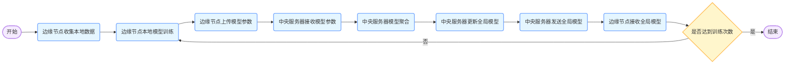

# 如何识别企业的边缘计算联邦学习优势

> 关键词：企业、边缘计算、联邦学习、优势识别、数据隐私、计算效率

> 摘要：本文旨在深入探讨如何识别企业在边缘计算联邦学习方面的优势。首先介绍了边缘计算和联邦学习的背景知识，包括其目的、预期读者、文档结构和相关术语。接着阐述了边缘计算联邦学习的核心概念、联系以及架构原理，并通过 Mermaid 流程图进行直观展示。详细讲解了核心算法原理，给出 Python 源代码示例。同时介绍了相关数学模型和公式，并举例说明。通过项目实战，展示了开发环境搭建、源代码实现和代码解读。分析了实际应用场景，推荐了学习资源、开发工具框架和相关论文著作。最后总结了未来发展趋势与挑战，提供了常见问题解答和扩展阅读参考资料，帮助企业全面识别自身在边缘计算联邦学习领域的优势。

## 1. 背景介绍 
### 1.1 目的和范围
随着信息技术的飞速发展，边缘计算和联邦学习成为了当前研究和应用的热点。边缘计算通过在靠近数据源的边缘设备上进行数据处理和分析，减少了数据传输延迟，提高了系统的响应速度和可靠性。联邦学习则允许不同参与方在不共享原始数据的情况下进行模型训练，保护了数据隐私。本文章的目的在于帮助企业识别其在结合边缘计算和联邦学习方面所具备的优势。范围涵盖了边缘计算联邦学习的核心概念、算法原理、数学模型、实际应用以及相关的工具和资源等方面。

### 1.2 预期读者
本文的预期读者主要包括企业的技术决策者、技术研发人员、对边缘计算和联邦学习感兴趣的研究人员以及希望了解企业在该领域优势的相关人员。对于技术决策者来说，可以通过本文了解如何评估企业在边缘计算联邦学习方面的竞争力，为企业的技术战略规划提供参考。技术研发人员可以深入学习边缘计算联邦学习的技术细节，提高自身的技术水平。研究人员可以在本文的基础上开展进一步的研究工作。

### 1.3 文档结构概述
本文共分为十个部分。第一部分是背景介绍，包括目的和范围、预期读者、文档结构概述和术语表。第二部分阐述核心概念与联系，给出核心概念原理和架构的文本示意图以及 Mermaid 流程图。第三部分讲解核心算法原理和具体操作步骤，使用 Python 源代码详细阐述。第四部分介绍数学模型和公式，并进行详细讲解和举例说明。第五部分通过项目实战展示代码实际案例和详细解释说明。第六部分分析实际应用场景。第七部分推荐工具和资源，包括学习资源、开发工具框架和相关论文著作。第八部分总结未来发展趋势与挑战。第九部分是附录，提供常见问题与解答。第十部分给出扩展阅读和参考资料。

### 1.4 术语表
#### 1.4.1 核心术语定义
- **边缘计算（Edge Computing）**：是一种将计算和数据存储靠近数据源的分布式计算范式。它通过在网络边缘设备上进行数据处理和分析，减少了数据传输到云端的延迟，提高了系统的响应速度和效率。
- **联邦学习（Federated Learning）**：是一种机器学习技术，允许多个参与方在不共享原始数据的情况下进行模型训练。每个参与方在本地设备上训练模型，然后将模型参数上传到中央服务器进行聚合，最终得到一个全局模型。
- **边缘节点（Edge Node）**：是边缘计算网络中的设备，如物联网设备、传感器、智能手机等，它们负责收集和处理本地数据。
- **中央服务器（Central Server）**：在联邦学习中，中央服务器负责接收各个边缘节点上传的模型参数，并进行聚合和更新，最终生成全局模型。

#### 1.4.2 相关概念解释
- **数据隐私保护**：在联邦学习中，由于各个参与方不共享原始数据，只上传模型参数，因此可以有效保护数据隐私。例如，在医疗领域，不同医院可以在不泄露患者隐私数据的情况下进行联合模型训练。
- **模型聚合**：是联邦学习中的一个关键步骤，中央服务器将各个边缘节点上传的模型参数进行加权平均，得到一个全局模型。模型聚合的方法有多种，如 FedAvg 算法。
- **计算效率**：边缘计算通过在边缘节点上进行数据处理和分析，减少了数据传输到云端的开销，提高了计算效率。同时，联邦学习可以并行地在各个边缘节点上进行模型训练，进一步提高了计算效率。

#### 1.4.3 缩略词列表
- **EC**：Edge Computing（边缘计算）
- **FL**：Federated Learning（联邦学习）
- **EN**：Edge Node（边缘节点）
- **CS**：Central Server（中央服务器）

## 2. 核心概念与联系 
### 核心概念原理
边缘计算的核心原理是将计算和数据存储靠近数据源，减少数据传输延迟。在边缘计算网络中，边缘节点可以是各种物联网设备、传感器、智能手机等，它们负责收集和处理本地数据。通过在边缘节点上进行数据处理和分析，可以减少数据传输到云端的量，提高系统的响应速度和可靠性。

联邦学习的核心原理是在不共享原始数据的情况下进行模型训练。多个参与方（边缘节点）在本地设备上使用自己的数据集训练模型，然后将模型参数上传到中央服务器。中央服务器对各个边缘节点上传的模型参数进行聚合和更新，最终得到一个全局模型。由于各个参与方只上传模型参数，不共享原始数据，因此可以有效保护数据隐私。

### 架构的文本示意图
边缘计算联邦学习的架构主要由边缘节点、中央服务器和通信网络组成。边缘节点负责收集和处理本地数据，并在本地进行模型训练。中央服务器负责接收各个边缘节点上传的模型参数，进行聚合和更新，最终生成全局模型。通信网络用于边缘节点和中央服务器之间的数据传输。

具体来说，边缘节点首先收集本地数据，然后使用本地数据对模型进行训练。训练完成后，边缘节点将模型参数上传到中央服务器。中央服务器接收到各个边缘节点上传的模型参数后，使用模型聚合算法对这些参数进行聚合，得到一个全局模型。中央服务器将全局模型发送回各个边缘节点，边缘节点使用全局模型对本地模型进行更新，然后继续进行下一轮的训练。

### Mermaid 流程图


## 3. 核心算法原理 & 具体操作步骤 
### 核心算法原理
在边缘计算联邦学习中，最常用的算法是 FedAvg 算法。FedAvg 算法的核心思想是通过多次迭代，让各个边缘节点在本地进行模型训练，然后将模型参数上传到中央服务器进行聚合，最终得到一个全局模型。

具体来说，FedAvg 算法的步骤如下：
1. 初始化全局模型：中央服务器随机初始化一个全局模型。
2. 选择参与训练的边缘节点：中央服务器从所有边缘节点中随机选择一部分节点参与本次训练。
3. 边缘节点本地训练：被选中的边缘节点使用本地数据对全局模型进行一定次数的迭代训练。
4. 边缘节点上传模型参数：训练完成后，边缘节点将本地模型的参数上传到中央服务器。
5. 中央服务器模型聚合：中央服务器对各个边缘节点上传的模型参数进行加权平均，得到一个新的全局模型。
6. 重复步骤 2 - 5，直到达到预设的训练次数。

### Python 源代码详细阐述
```python
import numpy as np
import tensorflow as tf

# 定义全局模型
def create_global_model():
    model = tf.keras.Sequential([
        tf.keras.layers.Dense(10, activation='relu', input_shape=(10,)),
        tf.keras.layers.Dense(1, activation='sigmoid')
    ])
    model.compile(optimizer='adam', loss='binary_crossentropy', metrics=['accuracy'])
    return model

# 定义边缘节点类
class EdgeNode:
    def __init__(self, local_data):
        self.local_data = local_data
        self.model = create_global_model()

    def local_train(self, global_model_weights, epochs=10):
        self.model.set_weights(global_model_weights)
        x_train, y_train = self.local_data
        self.model.fit(x_train, y_train, epochs=epochs, verbose=0)
        return self.model.get_weights()

# 定义中央服务器类
class CentralServer:
    def __init__(self):
        self.global_model = create_global_model()

    def aggregate_weights(self, weights_list):
        num_clients = len(weights_list)
        new_weights = []
        for layer_weights in zip(*weights_list):
            layer_mean = np.mean(layer_weights, axis=0)
            new_weights.append(layer_mean)
        return new_weights

    def train(self, edge_nodes, num_rounds=10):
        for round in range(num_rounds):
            print(f"Round {round + 1}")
            global_model_weights = self.global_model.get_weights()
            local_weights_list = []
            for node in edge_nodes:
                local_weights = node.local_train(global_model_weights)
                local_weights_list.append(local_weights)
            new_global_weights = self.aggregate_weights(local_weights_list)
            self.global_model.set_weights(new_global_weights)
        return self.global_model

# 模拟数据
num_clients = 3
x_train = [np.random.rand(100, 10) for _ in range(num_clients)]
y_train = [np.random.randint(0, 2, 100) for _ in range(num_clients)]
local_data = [(x, y) for x, y in zip(x_train, y_train)]

# 创建边缘节点和中央服务器
edge_nodes = [EdgeNode(data) for data in local_data]
central_server = CentralServer()

# 开始训练
final_model = central_server.train(edge_nodes)
```

### 具体操作步骤
1. **数据准备**：各个边缘节点收集和准备本地数据。本地数据可以是图像、文本、传感器数据等。
2. **模型初始化**：中央服务器随机初始化一个全局模型。
3. **边缘节点本地训练**：中央服务器选择一部分边缘节点参与训练，被选中的边缘节点使用本地数据对全局模型进行一定次数的迭代训练。
4. **模型参数上传**：训练完成后，边缘节点将本地模型的参数上传到中央服务器。
5. **模型聚合**：中央服务器对各个边缘节点上传的模型参数进行加权平均，得到一个新的全局模型。
6. **重复训练**：重复步骤 3 - 5，直到达到预设的训练次数。
7. **模型评估**：使用测试数据对最终的全局模型进行评估，检查模型的性能。

## 4. 数学模型和公式 & 详细讲解 & 举例说明 
### 数学模型和公式
在 FedAvg 算法中，假设共有 $K$ 个边缘节点，每个边缘节点 $k$ 有本地数据集 $D_k$，全局模型参数为 $\theta$。边缘节点 $k$ 在本地进行 $E$ 次迭代训练后得到的本地模型参数为 $\theta_k^E$。

中央服务器对各个边缘节点上传的模型参数进行聚合，得到新的全局模型参数 $\theta'$，聚合公式如下：
$$\theta' = \sum_{k=1}^{K} \frac{n_k}{n} \theta_k^E$$
其中，$n_k$ 是边缘节点 $k$ 的本地数据集的样本数量，$n = \sum_{k=1}^{K} n_k$ 是所有边缘节点的本地数据集的样本总数。

### 详细讲解
上述公式的含义是，新的全局模型参数是各个边缘节点本地模型参数的加权平均，权重为每个边缘节点本地数据集的样本数量占总样本数量的比例。这样做的目的是为了让样本数量多的边缘节点对全局模型的影响更大。

在每次迭代中，边缘节点首先使用全局模型参数 $\theta$ 初始化本地模型，然后在本地数据集 $D_k$ 上进行 $E$ 次迭代训练，得到本地模型参数 $\theta_k^E$。训练过程可以使用梯度下降等优化算法。

中央服务器接收到各个边缘节点上传的本地模型参数 $\theta_k^E$ 后，根据上述聚合公式计算新的全局模型参数 $\theta'$。然后将新的全局模型参数发送回各个边缘节点，边缘节点使用新的全局模型参数更新本地模型，继续进行下一轮的训练。

### 举例说明
假设共有 3 个边缘节点，每个边缘节点的本地数据集的样本数量分别为 $n_1 = 100$，$n_2 = 200$，$n_3 = 300$，总样本数量 $n = n_1 + n_2 + n_3 = 600$。

在某一轮训练中，三个边缘节点上传的本地模型参数分别为 $\theta_1^E$，$\theta_2^E$，$\theta_3^E$。中央服务器根据聚合公式计算新的全局模型参数 $\theta'$：
$$\theta' = \frac{100}{600} \theta_1^E + \frac{200}{600} \theta_2^E + \frac{300}{600} \theta_3^E$$

这样，样本数量多的边缘节点（如边缘节点 3）对全局模型的影响更大。

## 5. 项目实战：代码实际案例和详细解释说明 
### 5.1  开发环境搭建
#### 操作系统
可以选择 Linux 系统（如 Ubuntu）、Windows 系统或 macOS 系统。这里以 Ubuntu 18.04 为例进行说明。

#### 编程语言和框架
使用 Python 作为编程语言，需要安装以下 Python 库：
- TensorFlow：用于构建和训练深度学习模型。可以使用以下命令安装：
```bash
pip install tensorflow
```
- NumPy：用于数值计算。可以使用以下命令安装：
```bash
pip install numpy
```

#### 开发工具
可以使用 Visual Studio Code 作为开发工具，它具有丰富的插件和良好的代码编辑体验。可以从官方网站下载并安装 Visual Studio Code。

### 5.2  源代码详细实现和代码解读
```python
import numpy as np
import tensorflow as tf

# 定义全局模型
def create_global_model():
    model = tf.keras.Sequential([
        tf.keras.layers.Dense(10, activation='relu', input_shape=(10,)),
        tf.keras.layers.Dense(1, activation='sigmoid')
    ])
    model.compile(optimizer='adam', loss='binary_crossentropy', metrics=['accuracy'])
    return model

# 定义边缘节点类
class EdgeNode:
    def __init__(self, local_data):
        self.local_data = local_data
        self.model = create_global_model()

    def local_train(self, global_model_weights, epochs=10):
        self.model.set_weights(global_model_weights)
        x_train, y_train = self.local_data
        self.model.fit(x_train, y_train, epochs=epochs, verbose=0)
        return self.model.get_weights()

# 定义中央服务器类
class CentralServer:
    def __init__(self):
        self.global_model = create_global_model()

    def aggregate_weights(self, weights_list):
        num_clients = len(weights_list)
        new_weights = []
        for layer_weights in zip(*weights_list):
            layer_mean = np.mean(layer_weights, axis=0)
            new_weights.append(layer_mean)
        return new_weights

    def train(self, edge_nodes, num_rounds=10):
        for round in range(num_rounds):
            print(f"Round {round + 1}")
            global_model_weights = self.global_model.get_weights()
            local_weights_list = []
            for node in edge_nodes:
                local_weights = node.local_train(global_model_weights)
                local_weights_list.append(local_weights)
            new_global_weights = self.aggregate_weights(local_weights_list)
            self.global_model.set_weights(new_global_weights)
        return self.global_model

# 模拟数据
num_clients = 3
x_train = [np.random.rand(100, 10) for _ in range(num_clients)]
y_train = [np.random.randint(0, 2, 100) for _ in range(num_clients)]
local_data = [(x, y) for x, y in zip(x_train, y_train)]

# 创建边缘节点和中央服务器
edge_nodes = [EdgeNode(data) for data in local_data]
central_server = CentralServer()

# 开始训练
final_model = central_server.train(edge_nodes)
```

#### 代码解读
1. **全局模型定义**：`create_global_model` 函数定义了一个简单的全连接神经网络模型，包含一个输入层、一个隐藏层和一个输出层。使用 `adam` 优化器和 `binary_crossentropy` 损失函数进行编译。
2. **边缘节点类**：`EdgeNode` 类表示一个边缘节点，包含本地数据和本地模型。`local_train` 方法使用本地数据对全局模型进行训练，并返回训练后的本地模型参数。
3. **中央服务器类**：`CentralServer` 类表示中央服务器，包含全局模型。`aggregate_weights` 方法对各个边缘节点上传的模型参数进行聚合，得到新的全局模型参数。`train` 方法控制整个训练过程，包括选择边缘节点、边缘节点本地训练、模型参数上传和模型聚合等步骤。
4. **数据模拟**：使用 `np.random.rand` 和 `np.random.randint` 函数模拟了 3 个边缘节点的本地数据。
5. **训练过程**：创建边缘节点和中央服务器对象，调用中央服务器的 `train` 方法开始训练，最终得到训练好的全局模型。

### 5.3  代码解读与分析
#### 优点
- **模块化设计**：代码采用了面向对象的设计思想，将边缘节点和中央服务器分别封装成类，提高了代码的可维护性和可扩展性。
- **易于理解**：代码结构清晰，每个函数和类的功能明确，易于理解和修改。
- **可扩展性**：可以很容易地扩展代码，例如增加更多的边缘节点、修改模型结构、调整训练参数等。

#### 缺点
- **数据模拟简单**：代码中使用的是随机生成的模拟数据，实际应用中需要使用真实的数据集。
- **缺乏错误处理**：代码中没有对可能出现的错误进行处理，例如网络连接失败、数据传输错误等。
- **性能优化不足**：代码没有进行性能优化，例如使用多线程或分布式计算来提高训练效率。

## 6. 实际应用场景 
### 医疗领域
在医疗领域，不同医院拥有大量的患者数据，但由于数据隐私和安全的原因，这些数据不能直接共享。边缘计算联邦学习可以在不泄露患者隐私数据的情况下，让不同医院联合训练模型。例如，通过联合训练疾病诊断模型，可以提高诊断的准确性和效率。各个医院的边缘节点在本地使用自己的患者数据进行模型训练，然后将模型参数上传到中央服务器进行聚合，最终得到一个全局的疾病诊断模型。

### 金融领域
在金融领域，银行、证券等机构拥有大量的客户数据，这些数据涉及到客户的隐私和安全。边缘计算联邦学习可以帮助金融机构在保护客户数据隐私的前提下，进行风险评估、欺诈检测等模型的训练。例如，不同银行的边缘节点在本地使用自己的客户数据进行风险评估模型的训练，然后将模型参数上传到中央服务器进行聚合，得到一个更准确的全局风险评估模型。

### 物联网领域
在物联网领域，大量的物联网设备（如传感器、智能家居设备等）产生了海量的数据。边缘计算联邦学习可以在物联网设备上进行数据处理和模型训练，减少数据传输到云端的延迟和开销。例如，在智能交通系统中，各个交通传感器节点可以在本地进行交通流量预测模型的训练，然后将模型参数上传到中央服务器进行聚合，得到一个全局的交通流量预测模型，从而实现更精准的交通管理。

### 工业制造领域
在工业制造领域，不同工厂拥有自己的生产数据。边缘计算联邦学习可以让不同工厂在不共享生产数据的情况下，联合训练质量检测、故障预测等模型。例如，各个工厂的边缘节点在本地使用自己的生产数据进行质量检测模型的训练，然后将模型参数上传到中央服务器进行聚合，得到一个更准确的全局质量检测模型，提高产品质量和生产效率。

## 7. 工具和资源推荐
### 7.1 学习资源推荐
#### 7.1.1 书籍推荐
- 《深度学习》（Deep Learning）：由 Ian Goodfellow、Yoshua Bengio 和 Aaron Courville 撰写，是深度学习领域的经典教材，涵盖了深度学习的基本原理、算法和应用。
- 《Python 深度学习》（Deep Learning with Python）：由 Francois Chollet 撰写，结合 Keras 框架介绍了深度学习的实践方法，适合初学者入门。
- 《联邦学习》（Federated Learning）：由杨强、刘洋等撰写，系统地介绍了联邦学习的理论、算法和应用，是联邦学习领域的权威著作。

#### 7.1.2 在线课程
- Coursera 上的“深度学习专项课程”（Deep Learning Specialization）：由 Andrew Ng 教授授课，涵盖了深度学习的各个方面，包括神经网络、卷积神经网络、循环神经网络等。
- edX 上的“人工智能基础”（Introduction to Artificial Intelligence）：由麻省理工学院（MIT）的 Patrick Winston 教授授课，介绍了人工智能的基本概念、算法和应用。
- 百度飞桨的“深度学习7日入门-CV实战营”：提供了深度学习在计算机视觉领域的实践教程，适合初学者快速上手。

#### 7.1.3 技术博客和网站
- Medium：是一个技术博客平台，有很多关于边缘计算、联邦学习和深度学习的优质文章。
- arXiv：是一个预印本平台，提供了大量的学术论文，包括边缘计算、联邦学习等领域的最新研究成果。
- TensorFlow 官方博客：提供了 TensorFlow 框架的最新动态、技术文章和案例分享。

### 7.2 开发工具框架推荐
#### 7.2.1 IDE和编辑器
- Visual Studio Code：是一个轻量级的代码编辑器，具有丰富的插件和良好的代码编辑体验，支持 Python 开发。
- PyCharm：是一个专业的 Python 集成开发环境（IDE），提供了代码调试、代码分析、版本控制等功能，适合大型项目的开发。
- Jupyter Notebook：是一个交互式的笔记本环境，适合进行数据探索、模型训练和结果展示，支持 Python 代码的编写和运行。

#### 7.2.2 调试和性能分析工具
- TensorBoard：是 TensorFlow 提供的一个可视化工具，可以用于监控模型训练过程、可视化模型结构和分析模型性能。
- Py-Spy：是一个用于 Python 代码性能分析的工具，可以分析代码的执行时间、函数调用次数等，帮助优化代码性能。
- cProfile：是 Python 内置的性能分析模块，可以分析代码的执行时间和函数调用情况，找出性能瓶颈。

#### 7.2.3 相关框架和库
- TensorFlow Federated（TFF）：是 TensorFlow 提供的联邦学习框架，支持在分布式环境下进行联邦学习模型的训练和部署。
- PySyft：是一个用于隐私保护深度学习的 Python 库，提供了联邦学习、差分隐私等功能。
- Scikit-learn：是一个常用的机器学习库，提供了各种机器学习算法和工具，可用于数据预处理、模型训练和评估。

### 7.3 相关论文著作推荐
#### 7.3.1 经典论文
- 《Communication-Efficient Learning of Deep Networks from Decentralized Data》：提出了 FedAvg 算法，是联邦学习领域的经典论文。
- 《Federated Learning: Challenges, Methods, and Future Directions》：对联邦学习的挑战、方法和未来发展方向进行了全面的综述。
- 《Edge Computing: Vision and Challenges》：阐述了边缘计算的概念、愿景和面临的挑战。

#### 7.3.2 最新研究成果
- 可以通过 arXiv、IEEE Xplore、ACM Digital Library 等学术数据库搜索边缘计算联邦学习领域的最新研究论文。例如，搜索关键词“Edge Computing Federated Learning”可以找到相关的最新研究成果。

#### 7.3.3 应用案例分析
- 可以关注一些知名企业和研究机构的技术博客和报告，了解边缘计算联邦学习在实际应用中的案例分析。例如，百度、谷歌等公司的技术博客会分享一些关于边缘计算和联邦学习的应用案例。

## 8. 总结：未来发展趋势与挑战
### 未来发展趋势
#### 与其他技术的融合
边缘计算联邦学习将与区块链、物联网、人工智能等技术深度融合。例如，与区块链技术结合可以进一步增强数据的安全性和可信性；与物联网技术结合可以实现更高效的物联网数据处理和分析；与人工智能技术结合可以推动更智能的应用场景的发展。

#### 应用领域的拓展
边缘计算联邦学习将在更多的领域得到应用，如农业、教育、能源等。在农业领域，可以通过边缘计算联邦学习实现精准农业，提高农作物的产量和质量；在教育领域，可以实现个性化的学习服务；在能源领域，可以优化能源分配和管理。

#### 标准化和规范化
随着边缘计算联邦学习的发展，相关的标准和规范将逐渐完善。标准化和规范化将有助于促进边缘计算联邦学习的广泛应用和产业发展，提高不同系统之间的兼容性和互操作性。

### 挑战
#### 数据隐私和安全
虽然联邦学习在一定程度上保护了数据隐私，但仍然存在一些安全隐患。例如，攻击者可能通过分析模型参数来推断出原始数据的某些信息。因此，需要进一步研究和开发更有效的数据隐私保护技术，如差分隐私、同态加密等。

#### 通信开销
边缘计算联邦学习需要在边缘节点和中央服务器之间进行大量的模型参数传输，这会导致较高的通信开销。特别是在网络带宽有限的情况下，通信开销会成为影响系统性能的主要因素。因此，需要研究和开发更高效的通信协议和模型压缩技术，减少通信开销。

#### 模型性能和收敛性
在边缘计算联邦学习中，由于各个边缘节点的本地数据分布可能不同，会导致模型性能下降和收敛速度变慢。因此，需要研究和开发更有效的模型聚合算法和优化策略，提高模型的性能和收敛速度。

## 9. 附录：常见问题与解答
### 问题 1：边缘计算和联邦学习有什么区别？
边缘计算主要关注将计算和数据存储靠近数据源，减少数据传输延迟，提高系统的响应速度和可靠性。而联邦学习主要关注在不共享原始数据的情况下进行模型训练，保护数据隐私。两者可以结合使用，边缘计算为联邦学习提供了数据处理和计算的环境，联邦学习可以在边缘节点上进行模型训练，减少数据传输到云端的量。

### 问题 2：如何选择合适的边缘节点参与训练？
可以根据边缘节点的计算能力、数据质量、网络连接稳定性等因素来选择合适的边缘节点参与训练。例如，可以选择计算能力较强、数据质量较高、网络连接稳定的边缘节点参与训练，以提高模型的训练效率和性能。

### 问题 3：联邦学习中的模型聚合算法有哪些？
除了 FedAvg 算法外，还有 FedProx 算法、Scaffold 算法等。FedProx 算法在 FedAvg 算法的基础上，引入了近端项，用于解决各个边缘节点本地数据分布不同导致的模型性能下降问题。Scaffold 算法通过引入控制变量，自适应地调整每个边缘节点的本地更新，提高了模型的收敛速度。

### 问题 4：边缘计算联邦学习对硬件有什么要求？
边缘节点需要具备一定的计算能力和存储能力，以支持本地数据处理和模型训练。同时，边缘节点和中央服务器之间需要有稳定的网络连接，以保证模型参数的传输。具体的硬件要求取决于应用场景和模型的复杂度。

### 问题 5：如何评估边缘计算联邦学习模型的性能？
可以使用常见的机器学习评估指标，如准确率、召回率、F1 值、均方误差等，对边缘计算联邦学习模型的性能进行评估。同时，还可以考虑模型的训练时间、通信开销等因素，综合评估模型的性能。

## 10. 扩展阅读 & 参考资料
### 扩展阅读
- 《人工智能时代的隐私保护技术》：深入介绍了人工智能领域的数据隐私保护技术，包括差分隐私、同态加密等。
- 《物联网架构与技术》：系统地介绍了物联网的架构、技术和应用，有助于了解边缘计算在物联网中的应用。
- 《区块链技术原理与应用》：讲解了区块链的基本原理和应用场景，为边缘计算联邦学习与区块链的结合提供了理论基础。

### 参考资料
- 《深度学习入门：基于 Python 的理论与实现》，斋藤康毅著
- 《Python 数据分析实战》，Sebastian Raschka 著
- 《TensorFlow 官方文档》，https://www.tensorflow.org/
- 《Federated Learning 官方文档》，https://federated.withgoogle.com/

作者：AI天才研究院/AI Genius Institute & 禅与计算机程序设计艺术 /Zen And The Art of Computer Programming