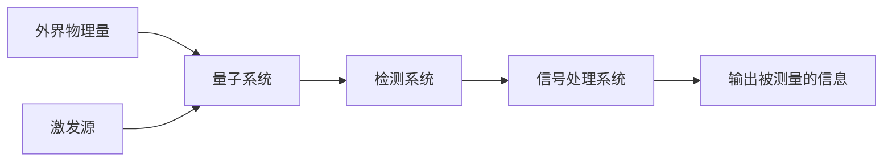

# 如何识别企业的量子传感器优势

> 关键词：量子传感器、企业优势识别、核心技术、市场应用、发展潜力

> 摘要：本文聚焦于如何识别企业在量子传感器领域的优势。通过深入剖析量子传感器的核心概念、算法原理、数学模型等方面，结合项目实战案例和实际应用场景，详细阐述了识别企业优势的具体方法和要点。同时，推荐了相关的学习资源、开发工具和研究论文，最后对量子传感器的未来发展趋势与挑战进行了总结，并提供了常见问题解答和扩展阅读参考资料，旨在为读者全面了解和识别企业的量子传感器优势提供专业且系统的指导。

## 1. 背景介绍 
### 1.1 目的和范围
量子传感器作为近年来迅速发展的前沿技术，在众多领域展现出巨大的应用潜力。本文章的目的在于帮助读者掌握一套系统的方法，用以识别企业在量子传感器方面的优势。范围涵盖了量子传感器的核心技术、市场应用、研发能力、产品性能等多个维度，通过综合分析这些因素，为评估企业在该领域的竞争力提供全面的视角。

### 1.2 预期读者
本文预期读者包括对量子传感器技术感兴趣的投资者、科技行业从业者、科研人员以及希望了解该领域企业优势的相关人士。无论是寻找投资机会、进行技术合作，还是开展学术研究，本文都能为读者提供有价值的参考信息。

### 1.3 文档结构概述
本文将按照以下结构展开：首先介绍量子传感器的核心概念和相关联系，包括其原理和架构；接着深入探讨核心算法原理和具体操作步骤，并结合Python源代码进行详细阐述；然后介绍量子传感器的数学模型和公式，并通过举例说明其应用；之后通过项目实战案例，详细解释代码实现和解读；再分析量子传感器的实际应用场景；推荐相关的学习资源、开发工具和研究论文；最后总结量子传感器的未来发展趋势与挑战，提供常见问题解答和扩展阅读参考资料。

### 1.4 术语表
#### 1.4.1 核心术语定义
- **量子传感器**：基于量子力学原理，利用量子系统的特性（如量子纠缠、量子叠加等）来实现对物理量（如磁场、电场、温度等）高精度测量的传感器。
- **量子比特（qubit）**：量子计算和量子传感中的基本信息单元，与经典比特不同，它可以同时处于0和1的叠加态。
- **量子纠缠**：两个或多个量子系统之间存在的一种特殊关联，即使它们在空间上相隔很远，一个系统的状态变化也会立即影响另一个系统的状态。
- **灵敏度**：传感器对被测量变化的响应能力，通常用输出变化量与输入变化量的比值来表示。
- **分辨率**：传感器能够检测到的被测量的最小变化量。

#### 1.4.2 相关概念解释
- **量子态**：量子系统的状态，用波函数来描述。量子态可以是纯态或混合态，纯态是指系统处于一个确定的量子态，而混合态是多个纯态的统计混合。
- **量子测量**：对量子系统进行测量，以获取其某些物理量的信息。量子测量会导致量子态的坍缩，即从叠加态变为一个确定的本征态。
- **量子噪声**：量子系统中存在的噪声，主要来源于量子涨落和环境干扰。量子噪声会影响量子传感器的性能，降低其灵敏度和分辨率。

#### 1.4.3 缩略词列表
- **NMR**：Nuclear Magnetic Resonance，核磁共振
- **NV**：Nitrogen-Vacancy，氮 - 空位中心
- **SQUID**：Superconducting Quantum Interference Device，超导量子干涉仪

## 2. 核心概念与联系 

### 2.1 量子传感器的原理
量子传感器的工作原理基于量子力学的基本特性，如量子叠加和量子纠缠。以基于原子的量子传感器为例，原子具有特定的能级结构，当外界物理量（如磁场、电场等）作用于原子时，会导致原子能级的变化。通过测量原子能级的变化，就可以实现对物理量的测量。

例如，在基于核磁共振（NMR）的量子传感器中，原子核具有自旋角动量，在外部磁场的作用下，原子核会发生进动。通过施加射频脉冲，可以使原子核的自旋状态发生改变，然后通过检测原子核的磁共振信号，就可以测量外部磁场的强度。

### 2.2 量子传感器的架构
量子传感器通常由量子系统、激发源、检测系统和信号处理系统组成。

- **量子系统**：是量子传感器的核心，它可以是原子、离子、超导约瑟夫森结等。量子系统的特性决定了传感器的性能，如灵敏度、分辨率等。
- **激发源**：用于激发量子系统，使其处于特定的量子态。激发源可以是激光、射频脉冲等。
- **检测系统**：用于检测量子系统的状态变化。检测系统可以是光电探测器、超导量子干涉仪等。
- **信号处理系统**：用于对检测到的信号进行处理和分析，以提取出被测量的信息。信号处理系统通常包括放大器、滤波器、模数转换器等。

### 2.3 核心概念的联系
量子传感器的各个核心概念之间存在着紧密的联系。量子态的变化是量子传感器实现测量的基础，而量子纠缠和量子叠加则可以提高传感器的灵敏度和分辨率。激发源的作用是将量子系统制备到特定的量子态，检测系统则是检测量子态的变化，信号处理系统则是对检测到的信号进行处理，以获取被测量的信息。

### 2.4 文本示意图
量子传感器的架构可以用以下文本示意图表示：

```plaintext
外界物理量 --> 量子系统（原子、离子等）
                    |
                    v
             激发源（激光、射频脉冲）
                    |
                    v
             检测系统（光电探测器等）
                    |
                    v
         信号处理系统（放大器、滤波器等）
                    |
                    v
           输出被测量的信息
```

### 2.5 Mermaid 流程图


## 3. 核心算法原理 & 具体操作步骤 

### 3.1 核心算法原理
在量子传感器中，常用的算法包括量子态制备算法、量子测量算法和信号处理算法。

#### 3.1.1 量子态制备算法
量子态制备算法的目的是将量子系统制备到特定的量子态。例如，在基于原子的量子传感器中，可以使用激光脉冲序列来制备原子的特定量子态。以下是一个简单的Python代码示例，模拟使用激光脉冲制备原子的叠加态：

```python
import numpy as np

# 定义原子的基态
ground_state = np.array([1, 0])
# 定义激光脉冲的参数
pulse_angle = np.pi / 2

# 定义旋转矩阵
rotation_matrix = np.array([[np.cos(pulse_angle/2), -1j * np.sin(pulse_angle/2)],
                            [-1j * np.sin(pulse_angle/2), np.cos(pulse_angle/2)]])

# 制备叠加态
superposition_state = np.dot(rotation_matrix, ground_state)

print("制备的叠加态:", superposition_state)
```

#### 3.1.2 量子测量算法
量子测量算法的目的是对量子系统的状态进行测量，以获取其某些物理量的信息。在量子力学中，测量会导致量子态的坍缩。以下是一个简单的Python代码示例，模拟对量子态的测量：

```python
import numpy as np

# 定义量子态
quantum_state = np.array([1/np.sqrt(2), 1/np.sqrt(2)])

# 进行测量
measurement_result = np.random.choice([0, 1], p=[np.abs(quantum_state[0])**2, np.abs(quantum_state[1])**2])

print("测量结果:", measurement_result)
```

#### 3.1.3 信号处理算法
信号处理算法的目的是对检测到的信号进行处理和分析，以提取出被测量的信息。常用的信号处理算法包括滤波、傅里叶变换等。以下是一个简单的Python代码示例，使用傅里叶变换对信号进行频谱分析：

```python
import numpy as np
import matplotlib.pyplot as plt

# 生成信号
t = np.linspace(0, 1, 1000)
signal = np.sin(2 * np.pi * 50 * t) + np.sin(2 * np.pi * 120 * t)

# 进行傅里叶变换
fourier_transform = np.fft.fft(signal)
frequencies = np.fft.fftfreq(len(signal), t[1] - t[0])

# 绘制频谱图
plt.plot(frequencies[:len(frequencies)//2], 2.0/len(signal) * np.abs(fourier_transform[:len(fourier_transform)//2]))
plt.xlabel('频率 (Hz)')
plt.ylabel('幅度')
plt.title('信号的频谱分析')
plt.show()
```

### 3.2 具体操作步骤
#### 3.2.1 量子态制备
1. 确定量子系统的初始状态。
2. 根据需要制备的目标量子态，选择合适的激发源和激发参数。
3. 施加激发信号，将量子系统制备到目标量子态。

#### 3.2.2 量子测量
1. 选择合适的测量基。
2. 对量子系统进行测量，记录测量结果。
3. 多次重复测量，以获取统计信息。

#### 3.2.3 信号处理
1. 对检测到的信号进行预处理，如滤波、放大等。
2. 使用合适的信号处理算法，如傅里叶变换、小波变换等，对信号进行分析。
3. 从信号中提取出被测量的信息。

## 4. 数学模型和公式 & 详细讲解 & 举例说明 

### 4.1 量子态的数学表示
在量子力学中，量子态可以用态矢量（波函数）来表示。对于一个二能级量子系统，其态矢量可以表示为：

$$|\psi\rangle = \alpha|0\rangle + \beta|1\rangle$$

其中，$|0\rangle$ 和 $|1\rangle$ 是量子系统的基态，$\alpha$ 和 $\beta$ 是复数，满足 $|\alpha|^2 + |\beta|^2 = 1$。$|\alpha|^2$ 和 $|\beta|^2$ 分别表示测量量子系统得到 $|0\rangle$ 和 $|1\rangle$ 的概率。

### 4.2 量子测量的数学模型
量子测量可以用投影算符来描述。设 $\hat{M}$ 是一个测量算符，其本征态为 $|m_i\rangle$，对应的本征值为 $m_i$。当对量子态 $|\psi\rangle$ 进行测量时，测量结果为 $m_i$ 的概率为：

$$P(m_i) = |\langle m_i|\psi\rangle|^2$$

测量后，量子态会坍缩到对应的本征态 $|m_i\rangle$。

### 4.3 举例说明
假设一个二能级量子系统的初始态为 $|\psi\rangle = \frac{1}{\sqrt{2}}(|0\rangle + |1\rangle)$，我们要测量该量子系统的自旋分量。测量算符 $\hat{S}_z$ 的本征态为 $|0\rangle$ 和 $|1\rangle$，对应的本征值分别为 $+\frac{\hbar}{2}$ 和 $-\frac{\hbar}{2}$。

测量结果为 $+\frac{\hbar}{2}$ 的概率为：

$$P(+\frac{\hbar}{2}) = |\langle 0|\psi\rangle|^2 = |\frac{1}{\sqrt{2}}\langle 0|(|0\rangle + |1\rangle)|^2 = \frac{1}{2}$$

测量结果为 $-\frac{\hbar}{2}$ 的概率为：

$$P(-\frac{\hbar}{2}) = |\langle 1|\psi\rangle|^2 = |\frac{1}{\sqrt{2}}\langle 1|(|0\rangle + |1\rangle)|^2 = \frac{1}{2}$$

测量后，量子态会坍缩到 $|0\rangle$ 或 $|1\rangle$。

### 4.4 信号处理的数学模型
在信号处理中，常用的数学工具包括傅里叶变换和小波变换。

#### 4.4.1 傅里叶变换
傅里叶变换可以将信号从时域转换到频域，其定义为：

$$X(f) = \int_{-\infty}^{\infty} x(t) e^{-j2\pi ft} dt$$

其中，$x(t)$ 是时域信号，$X(f)$ 是频域信号。

#### 4.4.2 小波变换
小波变换可以对信号进行多分辨率分析，其定义为：

$$W(a, b) = \frac{1}{\sqrt{a}} \int_{-\infty}^{\infty} x(t) \psi^*(\frac{t - b}{a}) dt$$

其中，$a$ 是尺度因子，$b$ 是平移因子，$\psi(t)$ 是小波函数。

### 4.5 举例说明信号处理
假设我们有一个时域信号 $x(t) = \sin(2\pi f_1 t) + \sin(2\pi f_2 t)$，其中 $f_1 = 50 Hz$，$f_2 = 120 Hz$。我们可以使用傅里叶变换对该信号进行频谱分析。

```python
import numpy as np
import matplotlib.pyplot as plt

# 生成信号
t = np.linspace(0, 1, 1000)
f1 = 50
f2 = 120
signal = np.sin(2 * np.pi * f1 * t) + np.sin(2 * np.pi * f2 * t)

# 进行傅里叶变换
fourier_transform = np.fft.fft(signal)
frequencies = np.fft.fftfreq(len(signal), t[1] - t[0])

# 绘制频谱图
plt.plot(frequencies[:len(frequencies)//2], 2.0/len(signal) * np.abs(fourier_transform[:len(fourier_transform)//2]))
plt.xlabel('频率 (Hz)')
plt.ylabel('幅度')
plt.title('信号的频谱分析')
plt.show()
```

通过频谱图，我们可以清楚地看到信号中包含的两个频率分量 $f_1$ 和 $f_2$。

## 5. 项目实战：代码实际案例和详细解释说明 

### 5.1  开发环境搭建
#### 5.1.1 安装Python
首先，需要安装Python编程语言。可以从Python官方网站（https://www.python.org/downloads/）下载适合自己操作系统的Python安装包，并按照安装向导进行安装。

#### 5.1.2 安装必要的库
在Python中，有许多用于科学计算和信号处理的库，如NumPy、SciPy、Matplotlib等。可以使用pip命令来安装这些库：

```sh
pip install numpy scipy matplotlib
```

### 5.2  源代码详细实现和代码解读
#### 5.2.1 量子态制备和测量模拟
```python
import numpy as np

# 定义原子的基态
ground_state = np.array([1, 0])
# 定义激光脉冲的参数
pulse_angle = np.pi / 2

# 定义旋转矩阵
rotation_matrix = np.array([[np.cos(pulse_angle/2), -1j * np.sin(pulse_angle/2)],
                            [-1j * np.sin(pulse_angle/2), np.cos(pulse_angle/2)]])

# 制备叠加态
superposition_state = np.dot(rotation_matrix, ground_state)

print("制备的叠加态:", superposition_state)

# 进行测量
measurement_result = np.random.choice([0, 1], p=[np.abs(superposition_state[0])**2, np.abs(superposition_state[1])**2])

print("测量结果:", measurement_result)
```

**代码解读**：
- 首先，定义了原子的基态 `ground_state`。
- 然后，根据激光脉冲的参数 `pulse_angle` 定义了旋转矩阵 `rotation_matrix`。
- 使用旋转矩阵将原子的基态制备到叠加态 `superposition_state`。
- 最后，对叠加态进行测量，根据测量概率随机选择测量结果。

#### 5.2.2 信号处理示例
```python
import numpy as np
import matplotlib.pyplot as plt

# 生成信号
t = np.linspace(0, 1, 1000)
f1 = 50
f2 = 120
signal = np.sin(2 * np.pi * f1 * t) + np.sin(2 * np.pi * f2 * t)

# 进行傅里叶变换
fourier_transform = np.fft.fft(signal)
frequencies = np.fft.fftfreq(len(signal), t[1] - t[0])

# 绘制频谱图
plt.plot(frequencies[:len(frequencies)//2], 2.0/len(signal) * np.abs(fourier_transform[:len(fourier_transform)//2]))
plt.xlabel('频率 (Hz)')
plt.ylabel('幅度')
plt.title('信号的频谱分析')
plt.show()
```

**代码解读**：
- 首先，生成了一个包含两个频率分量的信号 `signal`。
- 然后，使用 `np.fft.fft` 函数对信号进行傅里叶变换，得到频域信号 `fourier_transform`。
- 使用 `np.fft.fftfreq` 函数计算频率轴。
- 最后，绘制频谱图，展示信号的频率成分。

### 5.3  代码解读与分析
#### 5.3.1 量子态制备和测量模拟
在量子态制备和测量模拟代码中，通过旋转矩阵实现了量子态的制备。旋转矩阵的作用是将量子系统从一个量子态转换到另一个量子态。在测量过程中，根据量子态的概率分布随机选择测量结果，模拟了量子测量的不确定性。

#### 5.3.2 信号处理示例
在信号处理示例代码中，使用傅里叶变换将时域信号转换到频域，从而可以分析信号的频率成分。频谱图可以直观地展示信号中包含的频率分量及其幅度。通过频谱分析，可以提取出信号的特征信息，用于后续的处理和分析。

## 6. 实际应用场景 
### 6.1 医疗领域
量子传感器在医疗领域有着广泛的应用。例如，基于超导量子干涉仪（SQUID）的量子磁强计可以用于检测人体的生物磁场，如心脏磁场、脑磁场等。通过检测这些生物磁场的变化，可以早期诊断一些疾病，如心脏病、神经系统疾病等。

另外，基于氮 - 空位（NV）中心的量子传感器可以用于生物分子的检测。NV中心具有极高的灵敏度和分辨率，可以检测到单个生物分子的存在和状态变化，为生物医学研究和疾病诊断提供了新的手段。

### 6.2 地质勘探
在地质勘探中，量子传感器可以用于测量地球的磁场、重力场等物理量。基于原子的量子磁力仪可以检测到微小的磁场变化，从而发现地下的矿产资源、地质构造等信息。量子重力仪可以高精度地测量地球的重力场变化，用于地质灾害预警、石油勘探等领域。

### 6.3 导航定位
量子传感器在导航定位领域也有着重要的应用。基于原子的量子陀螺仪具有极高的精度和稳定性，可以用于飞行器、船舶等的导航定位。量子加速度计可以测量物体的加速度，为惯性导航系统提供更准确的信息。

### 6.4 通信领域
在通信领域，量子传感器可以用于检测光信号的强度、相位等参数。基于量子纠缠的量子传感器可以实现超灵敏的光信号检测，提高通信系统的性能和安全性。

## 7. 工具和资源推荐
### 7.1 学习资源推荐
#### 7.1.1 书籍推荐
- 《量子力学原理》（狄拉克著）：这是一本经典的量子力学教材，系统地介绍了量子力学的基本原理和方法。
- 《量子传感与测量》：全面介绍了量子传感器的原理、技术和应用，是学习量子传感器的重要参考书籍。
- 《信号与系统》（奥本海姆著）：介绍了信号处理的基本理论和方法，对于理解量子传感器中的信号处理算法非常有帮助。

#### 7.1.2 在线课程
- Coursera上的“量子计算与量子信息”课程：由知名高校的教授授课，系统地介绍了量子计算和量子信息的基本概念和方法。
- edX上的“量子传感器技术”课程：专门介绍了量子传感器的原理、技术和应用，适合初学者和专业人士学习。

#### 7.1.3 技术博客和网站
- 量子计算领域的博客“Quantum Computing Report”：提供了量子计算和量子传感器领域的最新研究进展和行业动态。
- 美国国家标准与技术研究院（NIST）的网站：提供了大量关于量子传感器的研究报告和技术文档。

### 7.2 开发工具框架推荐
#### 7.2.1 IDE和编辑器
- PyCharm：是一款专业的Python集成开发环境，具有强大的代码编辑、调试和分析功能，适合开发量子传感器相关的Python代码。
- Jupyter Notebook：是一个交互式的开发环境，可以方便地编写和运行Python代码，同时还可以插入文本、图片等，适合进行代码演示和数据分析。

#### 7.2.2 调试和性能分析工具
- NumPy的调试工具：NumPy提供了一些调试工具，如 `np.testing` 模块，可以用于测试和调试NumPy数组的操作。
- cProfile：是Python的内置性能分析工具，可以分析代码的运行时间和函数调用次数，帮助优化代码性能。

#### 7.2.3 相关框架和库
- Qiskit：是IBM开发的开源量子计算框架，提供了量子态制备、量子算法实现等功能，对于学习和开发量子传感器相关的量子算法非常有帮助。
- QuTiP：是一个用于量子力学和量子光学的Python库，提供了量子态表示、量子测量、量子动力学模拟等功能。

### 7.3 相关论文著作推荐
#### 7.3.1 经典论文
- "Quantum metrology"（V. Giovannetti, S. Lloyd, L. Maccone著）：这篇论文系统地介绍了量子计量学的基本概念和方法，是量子传感器领域的经典论文。
- "Nitrogen-vacancy centers in diamond: Nanoscale sensors for physics and biology"（M. W. Doherty等著）：详细介绍了基于氮 - 空位中心的量子传感器的原理、技术和应用。

#### 7.3.2 最新研究成果
可以通过学术数据库（如IEEE Xplore、ACM Digital Library等）搜索量子传感器领域的最新研究论文，了解该领域的前沿动态和研究热点。

#### 7.3.3 应用案例分析
- 一些知名企业（如Google、IBM等）会在其官方网站或学术会议上发布量子传感器的应用案例分析报告，可以参考这些报告了解量子传感器在实际应用中的效果和挑战。

## 8. 总结：未来发展趋势与挑战
### 8.1 未来发展趋势
#### 8.1.1 更高的性能
未来，量子传感器将朝着更高的灵敏度、分辨率和稳定性方向发展。通过不断改进量子系统的设计和制备技术，以及优化信号处理算法，可以进一步提高量子传感器的性能。

#### 8.1.2 小型化和集成化
为了满足实际应用的需求，量子传感器将朝着小型化和集成化方向发展。将量子传感器与其他电子器件集成在一起，可以实现更紧凑、更高效的传感器系统。

#### 8.1.3 多学科交叉融合
量子传感器的发展将与其他学科（如材料科学、生物学、计算机科学等）进行更深入的交叉融合。通过跨学科的研究和合作，可以开发出更多新型的量子传感器和应用。

#### 8.1.4 广泛的应用拓展
随着量子传感器性能的不断提高和成本的不断降低，其应用领域将不断拓展。除了现有的医疗、地质勘探、导航定位等领域，量子传感器还将在环境监测、食品安全检测、量子通信等领域发挥重要作用。

### 8.2 挑战
#### 8.2.1 量子态的稳定性
量子系统的量子态非常脆弱，容易受到环境噪声的干扰而发生退相干。如何提高量子态的稳定性，是量子传感器面临的一个重要挑战。

#### 8.2.2 成本和可扩展性
目前，量子传感器的制备和测试成本较高，限制了其大规模应用。如何降低成本，提高可扩展性，是量子传感器产业化面临的关键问题。

#### 8.2.3 技术标准和规范
由于量子传感器是一种新兴技术，目前还缺乏统一的技术标准和规范。建立完善的技术标准和规范，对于推动量子传感器的发展和应用具有重要意义。

## 9. 附录：常见问题与解答
### 9.1 量子传感器与传统传感器有什么区别？
量子传感器基于量子力学原理，利用量子系统的特性（如量子纠缠、量子叠加等）来实现测量，具有更高的灵敏度和分辨率。而传统传感器基于经典物理原理，如电磁感应、压电效应等，其性能受到经典物理极限的限制。

### 9.2 量子传感器的应用前景如何？
量子传感器在医疗、地质勘探、导航定位、通信等领域有着广泛的应用前景。随着技术的不断发展和成本的不断降低，量子传感器将在更多领域得到应用，为人类社会带来巨大的变革。

### 9.3 如何评估量子传感器的性能？
评估量子传感器的性能主要从灵敏度、分辨率、稳定性、响应时间等方面进行。灵敏度是指传感器对被测量变化的响应能力，分辨率是指传感器能够检测到的被测量的最小变化量，稳定性是指传感器在一段时间内性能的稳定程度，响应时间是指传感器对被测量变化的响应速度。

### 9.4 量子传感器的发展面临哪些挑战？
量子传感器的发展面临着量子态的稳定性、成本和可扩展性、技术标准和规范等挑战。解决这些挑战需要不断进行技术创新和跨学科合作。

## 10. 扩展阅读 & 参考资料
### 10.1 扩展阅读
- 《量子物理史话》：以生动有趣的方式介绍了量子物理的发展历程，对于理解量子传感器的原理和背景非常有帮助。
- 《上帝掷骰子吗？量子物理史话》：同样是一本关于量子物理的科普书籍，通过讲述量子物理的发展故事，让读者深入了解量子世界的奥秘。

### 10.2 参考资料
- 相关学术论文和研究报告，如IEEE Xplore、ACM Digital Library等学术数据库中的论文。
- 企业的官方网站和技术文档，如Google、IBM等公司关于量子传感器的研究和应用资料。

作者：AI天才研究院/AI Genius Institute & 禅与计算机程序设计艺术 /Zen And The Art of Computer Programming