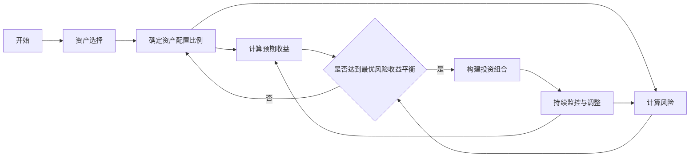

# 威廉·伯恩斯坦的高效投资组合构建

> 关键词：威廉·伯恩斯坦、高效投资组合、资产配置、风险收益、投资策略

> 摘要：本文围绕威廉·伯恩斯坦的高效投资组合构建展开深入探讨。详细介绍了相关的背景知识，包括目的范围、预期读者等。阐述了核心概念及联系，分析了核心算法原理并给出具体操作步骤，用数学模型和公式进行了详细讲解与举例说明。通过项目实战展示代码案例及解读，探讨了实际应用场景。同时推荐了相关的工具和资源，最后总结了未来发展趋势与挑战，还设置了常见问题解答及扩展阅读参考资料，旨在为投资者提供全面深入的关于威廉·伯恩斯坦高效投资组合构建的知识体系。

## 1. 背景介绍 
### 1.1 目的和范围
威廉·伯恩斯坦在投资领域有着卓越的贡献，其高效投资组合构建理论旨在帮助投资者在不同的市场环境下，通过合理的资产配置，实现风险与收益的平衡。本文的目的是深入剖析伯恩斯坦的这一理论，详细介绍其核心概念、算法原理、实际应用等方面内容。范围涵盖从理论基础的讲解到实际项目的操作，以及相关工具资源的推荐等多个维度，为投资者提供全面且深入的知识体系，以便他们能够运用该理论构建适合自己的投资组合。

### 1.2 预期读者
本文预期读者主要包括对投资领域有兴趣的初学者，他们希望通过了解威廉·伯恩斯坦的理论来初步建立投资组合的概念和方法；也包括有一定投资经验的投资者，他们可以通过本文进一步深化对高效投资组合构建的理解，优化自己现有的投资策略；同时还适合金融专业的学生和研究人员，为他们的学术研究和学习提供参考依据。

### 1.3 文档结构概述
本文将按照以下结构展开：首先介绍核心概念与联系，让读者对威廉·伯恩斯坦的高效投资组合构建有一个基本的认知框架；接着详细阐述核心算法原理和具体操作步骤，结合 Python 代码进行说明；然后通过数学模型和公式进一步深入分析该理论；之后进行项目实战，展示代码实际案例并详细解释说明；再探讨实际应用场景，说明该理论在现实投资中的应用方式；随后推荐相关的工具和资源，帮助读者进一步学习和实践；最后总结未来发展趋势与挑战，解答常见问题，并提供扩展阅读和参考资料。

### 1.4 术语表
#### 1.4.1 核心术语定义
- **高效投资组合**：在给定的风险水平下，能够实现最高预期收益的投资组合；或者在给定的预期收益水平下，具有最低风险的投资组合。它是通过合理的资产配置来达到风险与收益的最优平衡。
- **资产配置**：将资金分配到不同类型的资产上，如股票、债券、现金等，以降低投资组合的整体风险并提高收益的稳定性。
- **风险收益权衡**：投资者在追求更高收益的同时，需要承担相应的风险。高效投资组合构建就是要在风险和收益之间找到一个合适的平衡点。

#### 1.4.2 相关概念解释
- **现代投资组合理论（MPT）**：由哈里·马科维茨提出，是威廉·伯恩斯坦高效投资组合构建理论的重要基础。该理论认为，投资者可以通过分散投资来降低非系统性风险，从而实现投资组合的优化。
- **有效前沿**：在风险 - 收益平面上，所有有效投资组合所构成的曲线。有效投资组合是指在相同风险水平下具有最高预期收益，或在相同预期收益水平下具有最低风险的投资组合。

#### 1.4.3 缩略词列表
- **MPT**：Modern Portfolio Theory（现代投资组合理论）
- **CAPM**：Capital Asset Pricing Model（资本资产定价模型）

## 2. 核心概念与联系 
### 核心概念原理
威廉·伯恩斯坦的高效投资组合构建基于现代投资组合理论，其核心思想是通过资产配置来分散风险，实现风险与收益的最优平衡。不同资产之间的收益和风险特性各不相同，而且它们之间的相关性也存在差异。通过合理地选择资产并确定各资产的投资比例，可以构建出一个在给定风险水平下收益最大化，或在给定收益水平下风险最小化的投资组合。

例如，股票通常具有较高的预期收益，但同时也伴随着较高的风险；债券的预期收益相对较低，但风险也较小。如果将资金全部投入股票，虽然可能获得较高的收益，但一旦市场出现大幅下跌，投资者将面临巨大的损失；而如果全部投资债券，收益则相对有限。因此，通过将资金合理地分配到股票和债券上，可以在一定程度上降低投资组合的整体风险，同时又能保证一定的收益水平。

### 架构的文本示意图
```plaintext
高效投资组合构建
|-- 资产选择
|   |-- 股票
|   |-- 债券
|   |-- 现金
|   |-- 其他资产（如房地产、大宗商品等）
|-- 资产配置比例确定
|   |-- 根据风险承受能力
|   |-- 根据预期收益目标
|   |-- 根据资产相关性
|-- 风险收益评估
|   |-- 计算预期收益
|   |-- 计算风险（如标准差）
|   |-- 调整资产配置比例以优化风险收益
```

### Mermaid 流程图


## 3. 核心算法原理 & 具体操作步骤 
### 核心算法原理
在威廉·伯恩斯坦的高效投资组合构建中，常用的算法是基于现代投资组合理论的均值 - 方差分析。该算法的核心目标是在给定的资产集合中，找到一组最优的资产配置比例，使得投资组合的预期收益最大化，同时风险最小化。

假设我们有 $n$ 种资产，每种资产的预期收益率为 $\mu_i$（$i = 1,2,\cdots,n$），资产之间的协方差矩阵为 $\Sigma$。投资组合的权重向量为 $w = [w_1,w_2,\cdots,w_n]^T$，其中 $\sum_{i = 1}^{n}w_i = 1$。

投资组合的预期收益率 $\mu_p$ 可以表示为：
$$\mu_p = w^T\mu$$
其中 $\mu = [\mu_1,\mu_2,\cdots,\mu_n]^T$。

投资组合的风险（用方差表示）$\sigma_p^2$ 可以表示为：
$$\sigma_p^2 = w^T\Sigma w$$

我们的目标是在给定的预期收益率约束下，最小化投资组合的风险，即求解以下优化问题：
$$\min_{w} w^T\Sigma w$$
$$s.t. \quad w^T\mu = \mu_{target}$$
$$\sum_{i = 1}^{n}w_i = 1$$
其中 $\mu_{target}$ 是投资者设定的预期收益率目标。

### 具体操作步骤
#### 步骤 1：数据收集
收集每种资产的历史收益率数据，用于计算预期收益率和协方差矩阵。

#### 步骤 2：计算预期收益率和协方差矩阵
根据历史收益率数据，使用统计方法计算每种资产的预期收益率和资产之间的协方差矩阵。

#### 步骤 3：设定预期收益率目标
投资者根据自己的风险承受能力和投资目标，设定一个预期收益率目标 $\mu_{target}$。

#### 步骤 4：求解优化问题
使用优化算法（如二次规划算法）求解上述优化问题，得到最优的资产配置比例 $w$。

#### 步骤 5：构建投资组合
根据求解得到的最优资产配置比例，将资金分配到不同的资产上，构建投资组合。

#### 步骤 6：持续监控与调整
定期监控投资组合的表现，根据市场情况和投资者的需求，适时调整资产配置比例。

### Python 代码实现
```python
import numpy as np
from scipy.optimize import minimize

# 步骤 1：数据收集
# 假设我们有 3 种资产，每种资产有 10 个历史收益率数据
returns = np.array([
    [0.01, 0.02, 0.03, 0.04, 0.05, 0.06, 0.07, 0.08, 0.09, 0.1],
    [0.02, 0.03, 0.04, 0.05, 0.06, 0.07, 0.08, 0.09, 0.1, 0.11],
    [0.03, 0.04, 0.05, 0.06, 0.07, 0.08, 0.09, 0.1, 0.11, 0.12]
])

# 步骤 2：计算预期收益率和协方差矩阵
expected_returns = np.mean(returns, axis=1)
cov_matrix = np.cov(returns)

# 步骤 3：设定预期收益率目标
target_return = 0.08

# 步骤 4：求解优化问题
def portfolio_variance(weights, cov_matrix):
    return np.dot(weights.T, np.dot(cov_matrix, weights))

def portfolio_return(weights, expected_returns):
    return np.dot(weights, expected_returns)

# 约束条件
constraints = [
    {'type': 'eq', 'fun': lambda x: np.sum(x) - 1},  # 权重之和为 1
    {'type': 'eq', 'fun': lambda x: portfolio_return(x, expected_returns) - target_return}  # 预期收益率等于目标收益率
]

# 初始权重
initial_weights = np.ones(len(expected_returns)) / len(expected_returns)

# 权重范围
bounds = [(0, 1) for _ in range(len(expected_returns))]

# 求解优化问题
result = minimize(portfolio_variance, initial_weights, args=(cov_matrix,), constraints=constraints, bounds=bounds)

# 步骤 5：构建投资组合
optimal_weights = result.x

print("最优资产配置比例：", optimal_weights)
```

## 4. 数学模型和公式 & 详细讲解 & 举例说明 
### 数学模型和公式
#### 预期收益率
投资组合的预期收益率 $\mu_p$ 是各资产预期收益率的加权平均值，公式为：
$$\mu_p = \sum_{i = 1}^{n}w_i\mu_i = w^T\mu$$
其中 $w_i$ 是第 $i$ 种资产的权重，$\mu_i$ 是第 $i$ 种资产的预期收益率，$w = [w_1,w_2,\cdots,w_n]^T$ 是权重向量，$\mu = [\mu_1,\mu_2,\cdots,\mu_n]^T$ 是预期收益率向量。

#### 风险（方差）
投资组合的风险通常用方差 $\sigma_p^2$ 来衡量，公式为：
$$\sigma_p^2 = \sum_{i = 1}^{n}\sum_{j = 1}^{n}w_iw_j\sigma_{ij} = w^T\Sigma w$$
其中 $\sigma_{ij}$ 是第 $i$ 种资产和第 $j$ 种资产的协方差，$\Sigma$ 是协方差矩阵。

#### 协方差
协方差 $\sigma_{ij}$ 衡量了两种资产收益率之间的相关性，公式为：
$$\sigma_{ij} = E[(R_i - \mu_i)(R_j - \mu_j)]$$
其中 $R_i$ 和 $R_j$ 分别是第 $i$ 种资产和第 $j$ 种资产的收益率，$E$ 表示期望。

### 详细讲解
- **预期收益率**：预期收益率反映了投资组合在未来可能获得的平均收益水平。通过合理地选择资产和确定权重，可以调整投资组合的预期收益率。
- **风险（方差）**：方差衡量了投资组合收益率的波动程度，方差越大，说明投资组合的风险越高。通过资产配置，可以降低投资组合的整体风险，因为不同资产之间的收益率可能存在一定的相关性，当某些资产的收益率下降时，其他资产的收益率可能上升，从而起到对冲风险的作用。
- **协方差**：协方差反映了两种资产收益率之间的线性关系。如果 $\sigma_{ij} > 0$，说明两种资产的收益率呈正相关，即它们的收益率倾向于同时上升或同时下降；如果 $\sigma_{ij} < 0$，说明两种资产的收益率呈负相关，即当一种资产的收益率上升时，另一种资产的收益率可能下降；如果 $\sigma_{ij} = 0$，说明两种资产的收益率之间没有线性关系。

### 举例说明
假设我们有两种资产：股票和债券。股票的预期收益率 $\mu_1 = 0.1$，标准差 $\sigma_1 = 0.2$；债券的预期收益率 $\mu_2 = 0.05$，标准差 $\sigma_2 = 0.1$。两种资产的协方差 $\sigma_{12} = 0.01$。

我们将资金的 60% 投资于股票，40% 投资于债券，即 $w_1 = 0.6$，$w_2 = 0.4$。

#### 计算预期收益率
$$\mu_p = w_1\mu_1 + w_2\mu_2 = 0.6\times0.1 + 0.4\times0.05 = 0.08$$

#### 计算风险（方差）
$$\sigma_p^2 = w_1^2\sigma_1^2 + w_2^2\sigma_2^2 + 2w_1w_2\sigma_{12}$$
$$= 0.6^2\times0.2^2 + 0.4^2\times0.1^2 + 2\times0.6\times0.4\times0.01$$
$$= 0.0144 + 0.0016 + 0.0048 = 0.0208$$
标准差 $\sigma_p = \sqrt{0.0208} \approx 0.144$

通过这个例子可以看出，通过合理的资产配置，我们可以在一定程度上降低投资组合的风险，同时保证一定的预期收益水平。

## 5. 项目实战：代码实际案例和详细解释说明 
### 5.1  开发环境搭建
#### 安装 Python
首先需要安装 Python 环境，建议使用 Python 3.7 及以上版本。可以从 Python 官方网站（https://www.python.org/downloads/）下载安装包，按照安装向导进行安装。

#### 安装必要的库
在项目中，我们需要使用一些 Python 库，如 `numpy`、`scipy` 等。可以使用 `pip` 命令进行安装：
```sh
pip install numpy scipy
```

### 5.2  源代码详细实现和代码解读
```python
import numpy as np
from scipy.optimize import minimize

# 步骤 1：数据收集
# 假设我们有 4 种资产，每种资产有 20 个历史收益率数据
returns = np.array([
    [0.02, 0.03, 0.04, 0.05, 0.06, 0.07, 0.08, 0.09, 0.1, 0.11, 0.12, 0.13, 0.14, 0.15, 0.16, 0.17, 0.18, 0.19, 0.2, 0.21],
    [0.03, 0.04, 0.05, 0.06, 0.07, 0.08, 0.09, 0.1, 0.11, 0.12, 0.13, 0.14, 0.15, 0.16, 0.17, 0.18, 0.19, 0.2, 0.21, 0.22],
    [0.04, 0.05, 0.06, 0.07, 0.08, 0.09, 0.1, 0.11, 0.12, 0.13, 0.14, 0.15, 0.16, 0.17, 0.18, 0.19, 0.2, 0.21, 0.22, 0.23],
    [0.05, 0.06, 0.07, 0.08, 0.09, 0.1, 0.11, 0.12, 0.13, 0.14, 0.15, 0.16, 0.17, 0.18, 0.19, 0.2, 0.21, 0.22, 0.23, 0.24]
])

# 步骤 2：计算预期收益率和协方差矩阵
expected_returns = np.mean(returns, axis=1)
cov_matrix = np.cov(returns)

# 步骤 3：设定预期收益率目标
target_return = 0.15

# 步骤 4：求解优化问题
def portfolio_variance(weights, cov_matrix):
    """
    计算投资组合的方差
    :param weights: 资产配置权重向量
    :param cov_matrix: 协方差矩阵
    :return: 投资组合的方差
    """
    return np.dot(weights.T, np.dot(cov_matrix, weights))

def portfolio_return(weights, expected_returns):
    """
    计算投资组合的预期收益率
    :param weights: 资产配置权重向量
    :param expected_returns: 各资产的预期收益率向量
    :return: 投资组合的预期收益率
    """
    return np.dot(weights, expected_returns)

# 约束条件
constraints = [
    {'type': 'eq', 'fun': lambda x: np.sum(x) - 1},  # 权重之和为 1
    {'type': 'eq', 'fun': lambda x: portfolio_return(x, expected_returns) - target_return}  # 预期收益率等于目标收益率
]

# 初始权重
initial_weights = np.ones(len(expected_returns)) / len(expected_returns)

# 权重范围
bounds = [(0, 1) for _ in range(len(expected_returns))]

# 求解优化问题
result = minimize(portfolio_variance, initial_weights, args=(cov_matrix,), constraints=constraints, bounds=bounds)

# 步骤 5：构建投资组合
optimal_weights = result.x

print("最优资产配置比例：", optimal_weights)
```

### 5.3  代码解读与分析
- **数据收集**：使用 `numpy` 数组 `returns` 存储 4 种资产的历史收益率数据，每种资产有 20 个数据点。
- **计算预期收益率和协方差矩阵**：使用 `np.mean` 函数计算每种资产的预期收益率，使用 `np.cov` 函数计算资产之间的协方差矩阵。
- **设定预期收益率目标**：设定目标预期收益率为 0.15。
- **求解优化问题**：定义了两个函数 `portfolio_variance` 和 `portfolio_return` 分别用于计算投资组合的方差和预期收益率。使用 `scipy.optimize.minimize` 函数求解优化问题，目标是最小化投资组合的方差，同时满足权重之和为 1 和预期收益率等于目标收益率的约束条件。
- **构建投资组合**：将求解得到的最优权重存储在 `optimal_weights` 中，并打印输出。

通过这个代码案例，我们可以根据历史收益率数据和目标预期收益率，计算出最优的资产配置比例，从而构建高效的投资组合。

## 6. 实际应用场景 
### 个人投资者
对于个人投资者来说，威廉·伯恩斯坦的高效投资组合构建理论可以帮助他们根据自己的风险承受能力和投资目标，合理地配置资产。例如，年轻的投资者通常风险承受能力较高，可以将较大比例的资金投资于股票等风险资产，以追求较高的预期收益；而临近退休的投资者风险承受能力较低，可以增加债券等稳健资产的投资比例，以保障资产的安全性。

### 机构投资者
机构投资者如基金公司、保险公司等，需要管理大量的资金，对资产配置的要求更高。他们可以运用该理论构建投资组合，实现资产的多元化配置，降低风险，提高收益的稳定性。例如，基金公司可以根据不同的基金类型和投资策略，合理地选择资产并确定配置比例，为投资者提供更优质的投资产品。

### 养老金管理
养老金的管理需要在保障资金安全的前提下，实现资产的增值。威廉·伯恩斯坦的理论可以帮助养老金管理机构通过合理的资产配置，平衡风险与收益，确保养老金的长期稳定增值，为退休人员提供可靠的经济保障。

### 资产配置咨询服务
专业的资产配置咨询机构可以利用该理论为客户提供个性化的资产配置建议。他们通过了解客户的财务状况、风险承受能力和投资目标等信息，运用相关的算法和模型，为客户构建高效的投资组合，并根据市场情况进行动态调整。

## 7. 工具和资源推荐
### 7.1 学习资源推荐
#### 7.1.1 书籍推荐
- 《有效资产管理》（*The Intelligent Asset Allocator*）：威廉·伯恩斯坦的经典著作，深入阐述了高效投资组合构建的理论和方法，适合投资者和金融专业人士阅读。
- 《漫步华尔街》（*A Random Walk Down Wall Street*）：该书介绍了现代投资组合理论和市场有效性等重要概念，对理解投资组合构建有很大的帮助。
- 《聪明的投资者》（*The Intelligent Investor*）：本杰明·格雷厄姆的经典投资著作，强调了价值投资和资产配置的重要性，是投资者的必读之书。

#### 7.1.2 在线课程
- Coursera 上的“投资学原理”（*Principles of Investing*）课程：由知名教授授课，系统地介绍了投资组合理论、资产定价等投资学的核心内容。
- edX 上的“金融市场”（*Financial Markets*）课程：耶鲁大学教授罗伯特·席勒主讲，深入探讨了金融市场的运行机制和投资策略。

#### 7.1.3 技术博客和网站
- 雪球网（https://xueqiu.com/）：国内知名的投资社区，提供了丰富的投资资讯、研究报告和投资者交流平台。
- Seeking Alpha（https://seekingalpha.com/）：国外的投资研究网站，有大量的专业投资分析文章和研究报告。

### 7.2 开发工具框架推荐
#### 7.2.1 IDE和编辑器
- PyCharm：一款专业的 Python 集成开发环境，提供了丰富的代码编辑、调试和项目管理功能，适合 Python 开发者使用。
- Jupyter Notebook：一个交互式的编程环境，支持 Python、R 等多种编程语言，方便进行数据探索、模型开发和可视化展示。

#### 7.2.2 调试和性能分析工具
- pdb：Python 自带的调试器，可以帮助开发者定位和解决代码中的问题。
- cProfile：Python 的性能分析工具，可以分析代码的运行时间和函数调用情况，帮助开发者优化代码性能。

#### 7.2.3 相关框架和库
- numpy：Python 的数值计算库，提供了高效的数组操作和数学函数，是数据处理和科学计算的基础库。
- scipy：基于 numpy 的科学计算库，提供了优化、插值、积分等多种算法，可用于解决投资组合优化等问题。
- pandas：Python 的数据处理库，提供了灵活的数据结构和数据操作方法，方便进行数据清洗、分析和可视化。

### 7.3 相关论文著作推荐
#### 7.3.1 经典论文
- Markowitz, H. M. (1952). Portfolio Selection. *The Journal of Finance*, 7(1), 77 - 91. 该论文提出了现代投资组合理论，是投资领域的经典之作。
- Sharpe, W. F. (1964). Capital Asset Prices: A Theory of Market Equilibrium under Conditions of Risk. *The Journal of Finance*, 19(3), 425 - 442. 该论文提出了资本资产定价模型（CAPM），为资产定价和投资组合分析提供了重要的理论基础。

#### 7.3.2 最新研究成果
- Fama, E. F., & French, K. R. (2015). A Five - Factor Asset Pricing Model. *Journal of Financial Economics*, 116(1), 1 - 22. 该论文提出了五因子资产定价模型，对传统的资本资产定价模型进行了扩展和改进。
- Pastor, L., & Stambaugh, R. F. (2012). Are Stocks Really Less Volatile in the Long Run? *The Journal of Finance*, 67(3), 1029 - 1074. 该论文探讨了股票长期波动率的问题，对投资组合的长期风险评估有重要的参考价值。

#### 7.3.3 应用案例分析
- 一些金融机构和研究机构会发布关于投资组合构建的应用案例分析报告，这些报告可以帮助读者了解如何将理论应用到实际投资中，以及在实际应用中可能遇到的问题和解决方案。例如，一些大型基金公司会发布年度投资报告，介绍他们的投资策略和资产配置情况。

## 8. 总结：未来发展趋势与挑战
### 未来发展趋势
- **智能化与自动化**：随着人工智能和机器学习技术的不断发展，投资组合构建将越来越智能化和自动化。通过机器学习算法，可以更准确地预测资产的收益率和风险，自动调整资产配置比例，实现投资组合的动态优化。
- **多元化资产配置**：除了传统的股票、债券等资产，未来投资者将更加关注多元化的资产配置，如数字货币、私募股权、房地产投资信托（REITs）等。多元化的资产配置可以进一步降低投资组合的风险，提高收益的稳定性。
- **社会责任投资**：越来越多的投资者开始关注社会责任投资，即投资于那些具有良好社会和环境影响的企业和项目。未来，社会责任投资将成为投资组合构建的一个重要考虑因素，投资者将在追求经济收益的同时，实现社会和环境效益的最大化。

### 挑战
- **数据质量和可靠性**：投资组合构建依赖于大量的历史数据和市场信息，数据的质量和可靠性直接影响到模型的准确性和投资决策的有效性。然而，市场数据可能存在噪声、缺失值和异常值等问题，如何处理这些问题并保证数据的质量是一个挑战。
- **模型的有效性和适应性**：现有的投资组合模型大多基于历史数据和假设条件，而市场环境是不断变化的，模型可能无法完全适应新的市场情况。因此，如何开发更加有效和适应性强的模型是一个亟待解决的问题。
- **风险管理**：尽管投资组合构建可以在一定程度上降低风险，但仍然无法完全消除风险。特别是在市场出现极端情况时，如金融危机、重大自然灾害等，投资组合可能面临巨大的损失。如何有效地管理和控制风险是投资组合构建面临的重要挑战。

## 9. 附录：常见问题与解答
### 问题 1：如何确定自己的风险承受能力？
答：确定风险承受能力需要综合考虑多个因素，包括个人的财务状况、投资目标、投资经验、年龄等。一般来说，财务状况较好、投资目标较为激进、投资经验丰富、年龄较轻的投资者风险承受能力相对较高；反之，风险承受能力相对较低。可以通过一些风险测评问卷来初步评估自己的风险承受能力，但最终的判断还需要结合个人的实际情况。

### 问题 2：投资组合构建是否需要定期调整？
答：是的，投资组合构建需要定期调整。市场情况是不断变化的，资产的收益率和风险也会随之发生变化。定期调整投资组合可以确保其始终符合投资者的风险承受能力和投资目标，保持风险与收益的平衡。一般建议至少每年对投资组合进行一次评估和调整。

### 问题 3：如果市场出现大幅波动，应该如何调整投资组合？
答：当市场出现大幅波动时，首先要保持冷静，不要盲目跟风操作。可以根据市场波动的原因和自己的投资目标，适当调整投资组合。如果市场下跌是由于短期的市场情绪波动引起的，且投资者的投资目标是长期的，可以考虑适当增加股票等风险资产的投资比例；如果市场下跌是由于经济基本面恶化引起的，可能需要适当降低风险资产的投资比例，增加债券等稳健资产的投资比例。

### 问题 4：投资组合构建是否适用于所有投资者？
答：投资组合构建适用于大多数投资者，但不同投资者的具体情况不同，投资组合的构建方法和配置比例也会有所不同。对于一些风险承受能力极低、只追求资金安全性的投资者，可能更适合将资金全部投资于国债等无风险资产；而对于风险承受能力较高、追求高收益的投资者，可以适当增加股票等风险资产的投资比例。因此，在进行投资组合构建时，需要根据自己的实际情况进行个性化的设计。

## 10. 扩展阅读 & 参考资料
### 扩展阅读
- 《金融炼金术》（*The Alchemy of Finance*）：乔治·索罗斯的著作，介绍了他的投资哲学和市场操作方法，对理解金融市场的运行机制有很大的帮助。
- 《非理性繁荣》（*Irrational Exuberance*）：罗伯特·席勒的著作，探讨了金融市场中的非理性行为和泡沫现象，对投资者的心理和行为有深入的分析。

### 参考资料
- 威廉·伯恩斯坦的官方网站和相关学术论文。
- 各大金融机构和研究机构发布的投资研究报告和市场分析报告。
- 国内外知名的金融学术期刊，如《The Journal of Finance》、《Journal of Financial Economics》等。

作者：AI天才研究院/AI Genius Institute & 禅与计算机程序设计艺术 /Zen And The Art of Computer Programming