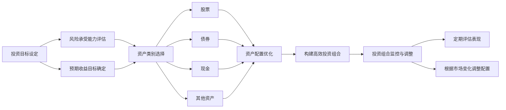

# 威廉·伯恩斯坦的高效投资组合理论

> 关键词：威廉·伯恩斯坦、高效投资组合理论、资产配置、风险分散、投资收益

> 摘要：本文深入探讨了威廉·伯恩斯坦的高效投资组合理论。该理论在现代投资领域具有重要地位，旨在通过合理的资产配置和风险分散来实现投资收益的最大化和风险的最小化。文章首先介绍了理论的背景，包括目的、预期读者、文档结构和相关术语。接着详细阐述了核心概念、算法原理、数学模型，并结合项目实战案例进行分析。同时探讨了该理论的实际应用场景，推荐了相关的学习资源、开发工具和论文著作。最后总结了理论的未来发展趋势与挑战，并对常见问题进行了解答。

## 1. 背景介绍 
### 1.1 目的和范围
威廉·伯恩斯坦的高效投资组合理论旨在帮助投资者构建最优的投资组合，以实现投资目标。该理论的核心在于通过分散投资于不同的资产类别，降低投资组合的整体风险，同时提高预期收益。本文的目的是全面解析这一理论，包括其核心概念、算法原理、数学模型等，并通过实际案例展示其应用。范围涵盖理论的基本原理、实际操作步骤以及在不同市场环境下的应用。

### 1.2 预期读者
本文预期读者包括金融投资者、金融分析师、投资顾问、金融专业学生以及对投资组合理论感兴趣的人士。对于投资者来说，了解该理论可以帮助他们更好地管理投资组合，提高投资收益；对于金融专业学生和研究人员来说，本文可以作为学习和研究投资组合理论的参考资料。

### 1.3 文档结构概述
本文将按照以下结构进行阐述：首先介绍核心概念与联系，包括理论的基本原理和架构；接着讲解核心算法原理和具体操作步骤，并用Python代码进行详细阐述；然后介绍数学模型和公式，并举例说明；之后通过项目实战案例展示理论的实际应用；再探讨实际应用场景；推荐相关的工具和资源；总结未来发展趋势与挑战；解答常见问题；最后提供扩展阅读和参考资料。

### 1.4 术语表
#### 1.4.1 核心术语定义
- **高效投资组合**：在给定风险水平下能够提供最高预期收益，或者在给定预期收益水平下具有最低风险的投资组合。
- **资产配置**：将投资资金分配到不同的资产类别，如股票、债券、现金等，以实现投资目标的过程。
- **风险分散**：通过投资于多种不同的资产来降低投资组合的整体风险。
- **预期收益**：投资者根据历史数据和市场分析对投资组合未来收益的预测。
- **风险**：投资组合未来收益的不确定性，通常用标准差来衡量。

#### 1.4.2 相关概念解释
- **现代投资组合理论（MPT）**：由哈里·马科维茨提出的理论，强调通过资产配置和风险分散来优化投资组合。威廉·伯恩斯坦的高效投资组合理论是在MPT的基础上发展而来的。
- **资本市场线（CML）**：描述了有效投资组合的预期收益与风险之间的关系。
- **证券市场线（SML）**：反映了单个证券或投资组合的预期收益与系统性风险之间的关系。

#### 1.4.3 缩略词列表
- **MPT**：Modern Portfolio Theory（现代投资组合理论）
- **CML**：Capital Market Line（资本市场线）
- **SML**：Security Market Line（证券市场线）

## 2. 核心概念与联系 

### 核心概念原理
威廉·伯恩斯坦的高效投资组合理论基于现代投资组合理论（MPT），其核心思想是通过资产配置和风险分散来实现投资组合的优化。该理论认为，不同资产之间的收益率和风险具有不同的相关性，通过合理选择资产并进行组合，可以降低投资组合的整体风险，同时提高预期收益。

具体来说，投资者可以通过将资金分配到不同的资产类别，如股票、债券、现金等，来实现风险分散。不同资产类别在不同的市场环境下表现不同，例如股票在经济繁荣时期通常表现较好，而债券在经济衰退时期具有一定的稳定性。通过将资金分散投资于不同的资产类别，可以降低投资组合对单一资产类别的依赖，从而降低整体风险。

### 架构的文本示意图
以下是威廉·伯恩斯坦的高效投资组合理论的架构文本示意图：

```
投资目标设定
|
|--风险承受能力评估
|--预期收益目标确定
|
资产类别选择
|
|--股票
|--债券
|--现金
|--其他资产（如房地产、大宗商品等）
|
资产配置优化
|
|--根据资产的预期收益、风险和相关性进行优化
|--构建高效投资组合
|
投资组合监控与调整
|
|--定期评估投资组合的表现
|--根据市场变化和投资目标调整资产配置
```

### Mermaid流程图


## 3. 核心算法原理 & 具体操作步骤 

### 核心算法原理
威廉·伯恩斯坦的高效投资组合理论的核心算法是基于均值 - 方差分析。该算法的目标是在给定的预期收益水平下，找到风险最小的投资组合；或者在给定的风险水平下，找到预期收益最大的投资组合。

具体来说，算法通过计算不同资产之间的协方差矩阵和预期收益率，来确定最优的资产配置比例。协方差矩阵反映了不同资产之间的相关性，预期收益率则是投资者对不同资产未来收益的预测。

### 具体操作步骤
以下是构建高效投资组合的具体操作步骤：

1. **确定投资目标**：包括风险承受能力和预期收益目标。
2. **选择资产类别**：根据投资目标选择合适的资产类别，如股票、债券、现金等。
3. **收集数据**：收集所选资产的历史收益率数据，用于计算预期收益率和协方差矩阵。
4. **计算预期收益率和协方差矩阵**：使用历史数据计算所选资产的预期收益率和协方差矩阵。
5. **优化资产配置**：使用优化算法，如二次规划算法，在给定的预期收益水平下找到风险最小的投资组合，或者在给定的风险水平下找到预期收益最大的投资组合。
6. **构建投资组合**：根据优化结果，将资金分配到不同的资产类别中，构建投资组合。
7. **监控和调整投资组合**：定期评估投资组合的表现，根据市场变化和投资目标调整资产配置。

### Python源代码详细阐述
以下是使用Python实现高效投资组合优化的示例代码：

```python
import numpy as np
import pandas as pd
from scipy.optimize import minimize

# 定义目标函数：最小化投资组合的方差
def portfolio_variance(weights, cov_matrix):
    return np.dot(weights.T, np.dot(cov_matrix, weights))

# 定义约束条件：权重之和为1
def weight_constraint(weights):
    return np.sum(weights) - 1

# 定义边界条件：权重范围在0到1之间
def get_bounds(num_assets):
    return [(0, 1) for _ in range(num_assets)]

# 优化资产配置
def optimize_portfolio(expected_returns, cov_matrix, target_return):
    num_assets = len(expected_returns)
    # 初始权重：等权重分配
    initial_weights = np.ones(num_assets) / num_assets
    
    # 定义约束条件
    constraints = [
        {'type': 'eq', 'fun': weight_constraint},
        {'type': 'eq', 'fun': lambda weights: np.dot(weights, expected_returns) - target_return}
    ]
    
    # 定义边界条件
    bounds = get_bounds(num_assets)
    
    # 使用scipy的minimize函数进行优化
    result = minimize(portfolio_variance, initial_weights, args=(cov_matrix,), method='SLSQP', constraints=constraints, bounds=bounds)
    
    return result.x

# 示例数据
# 假设有三种资产：股票、债券、现金
expected_returns = np.array([0.1, 0.05, 0.02])  # 预期收益率
cov_matrix = np.array([
    [0.1, 0.02, 0.01],
    [0.02, 0.05, 0.005],
    [0.01, 0.005, 0.001]
])  # 协方差矩阵
target_return = 0.07  # 目标收益率

# 优化资产配置
optimal_weights = optimize_portfolio(expected_returns, cov_matrix, target_return)

print("最优资产配置权重：", optimal_weights)
```

在上述代码中，我们首先定义了目标函数 `portfolio_variance`，用于计算投资组合的方差。然后定义了约束条件 `weight_constraint`，确保权重之和为1。接着定义了边界条件 `get_bounds`，确保权重范围在0到1之间。最后使用 `scipy` 的 `minimize` 函数进行优化，找到最优的资产配置权重。

## 4. 数学模型和公式 & 详细讲解 & 举例说明 

### 数学模型
威廉·伯恩斯坦的高效投资组合理论的数学模型基于均值 - 方差分析，其目标是在给定的预期收益水平下，最小化投资组合的方差；或者在给定的方差水平下，最大化投资组合的预期收益。

设投资组合中包含 $n$ 种资产，第 $i$ 种资产的权重为 $w_i$，预期收益率为 $r_i$，协方差矩阵为 $\Sigma$，则投资组合的预期收益率 $R_p$ 和方差 $\sigma_p^2$ 可以表示为：

$$
R_p = \sum_{i=1}^{n} w_i r_i
$$

$$
\sigma_p^2 = \sum_{i=1}^{n} \sum_{j=1}^{n} w_i w_j \sigma_{ij} = \mathbf{w}^T \Sigma \mathbf{w}
$$

其中，$\sigma_{ij}$ 是第 $i$ 种资产和第 $j$ 种资产之间的协方差，$\mathbf{w} = [w_1, w_2, \cdots, w_n]^T$ 是权重向量。

### 优化问题
在给定预期收益率 $R_p^*$ 的情况下，优化问题可以表示为：

$$
\min_{\mathbf{w}} \mathbf{w}^T \Sigma \mathbf{w}
$$

$$
\text{s.t.} \quad \sum_{i=1}^{n} w_i r_i = R_p^*
$$

$$
\sum_{i=1}^{n} w_i = 1
$$

$$
0 \leq w_i \leq 1, \quad i = 1, 2, \cdots, n
$$

### 详细讲解
上述优化问题的目标是在满足预期收益率约束和权重之和为1的约束条件下，找到使投资组合方差最小的权重向量 $\mathbf{w}$。约束条件 $\sum_{i=1}^{n} w_i r_i = R_p^*$ 确保投资组合的预期收益率等于目标收益率 $R_p^*$，约束条件 $\sum_{i=1}^{n} w_i = 1$ 确保权重之和为1，约束条件 $0 \leq w_i \leq 1$ 确保权重非负且不超过1。

### 举例说明
假设我们有三种资产：股票、债券和现金，其预期收益率分别为 $r_1 = 0.1$，$r_2 = 0.05$，$r_3 = 0.02$，协方差矩阵为：

$$
\Sigma = \begin{bmatrix}
0.1 & 0.02 & 0.01 \\
0.02 & 0.05 & 0.005 \\
0.01 & 0.005 & 0.001
\end{bmatrix}
$$

目标收益率为 $R_p^* = 0.07$。

我们可以使用上述优化问题来求解最优的资产配置权重。将预期收益率和协方差矩阵代入优化问题中，使用优化算法（如二次规划算法）求解得到最优权重向量 $\mathbf{w}^*$。

假设求解得到的最优权重向量为 $\mathbf{w}^* = [0.5, 0.3, 0.2]^T$，则表示投资组合中股票的权重为0.5，债券的权重为0.3，现金的权重为0.2。此时，投资组合的预期收益率为：

$$
R_p = 0.5 \times 0.1 + 0.3 \times 0.05 + 0.2 \times 0.02 = 0.07
$$

投资组合的方差为：

$$
\sigma_p^2 = \begin{bmatrix}
0.5 & 0.3 & 0.2
\end{bmatrix}
\begin{bmatrix}
0.1 & 0.02 & 0.01 \\
0.02 & 0.05 & 0.005 \\
0.01 & 0.005 & 0.001
\end{bmatrix}
\begin{bmatrix}
0.5 \\
0.3 \\
0.2
\end{bmatrix}
$$

通过计算可以得到投资组合的方差值。

## 5. 项目实战：代码实际案例和详细解释说明 

### 5.1  开发环境搭建
要实现威廉·伯恩斯坦的高效投资组合理论的代码，我们需要搭建以下开发环境：

- **Python环境**：建议使用Python 3.7及以上版本。
- **必要的库**：需要安装 `numpy`、`pandas`、`scipy` 等库。可以使用以下命令进行安装：

```sh
pip install numpy pandas scipy
```

### 5.2  源代码详细实现和代码解读
以下是一个完整的项目实战代码示例，用于构建高效投资组合：

```python
import numpy as np
import pandas as pd
from scipy.optimize import minimize
import matplotlib.pyplot as plt

# 定义目标函数：最小化投资组合的方差
def portfolio_variance(weights, cov_matrix):
    return np.dot(weights.T, np.dot(cov_matrix, weights))

# 定义约束条件：权重之和为1
def weight_constraint(weights):
    return np.sum(weights) - 1

# 定义边界条件：权重范围在0到1之间
def get_bounds(num_assets):
    return [(0, 1) for _ in range(num_assets)]

# 优化资产配置
def optimize_portfolio(expected_returns, cov_matrix, target_return):
    num_assets = len(expected_returns)
    # 初始权重：等权重分配
    initial_weights = np.ones(num_assets) / num_assets
    
    # 定义约束条件
    constraints = [
        {'type': 'eq', 'fun': weight_constraint},
        {'type': 'eq', 'fun': lambda weights: np.dot(weights, expected_returns) - target_return}
    ]
    
    # 定义边界条件
    bounds = get_bounds(num_assets)
    
    # 使用scipy的minimize函数进行优化
    result = minimize(portfolio_variance, initial_weights, args=(cov_matrix,), method='SLSQP', constraints=constraints, bounds=bounds)
    
    return result.x

# 生成随机资产数据
def generate_random_assets(num_assets, num_periods):
    returns = np.random.randn(num_assets, num_periods) * 0.01
    expected_returns = np.mean(returns, axis=1)
    cov_matrix = np.cov(returns)
    return expected_returns, cov_matrix

# 主函数
def main():
    num_assets = 3  # 资产数量
    num_periods = 100  # 时间周期数
    
    # 生成随机资产数据
    expected_returns, cov_matrix = generate_random_assets(num_assets, num_periods)
    
    # 定义目标收益率范围
    target_returns = np.linspace(min(expected_returns), max(expected_returns), 100)
    
    portfolios = []
    for target_return in target_returns:
        optimal_weights = optimize_portfolio(expected_returns, cov_matrix, target_return)
        portfolio_return = np.dot(optimal_weights, expected_returns)
        portfolio_variance_value = portfolio_variance(optimal_weights, cov_matrix)
        portfolio_std = np.sqrt(portfolio_variance_value)
        portfolios.append([portfolio_std, portfolio_return, optimal_weights])
    
    portfolios = np.array(portfolios)
    
    # 绘制有效前沿
    plt.figure(figsize=(10, 6))
    plt.plot(portfolios[:, 0], portfolios[:, 1], label='Efficient Frontier')
    plt.xlabel('Portfolio Standard Deviation')
    plt.ylabel('Portfolio Expected Return')
    plt.title('Efficient Frontier')
    plt.legend()
    plt.grid(True)
    plt.show()

if __name__ == "__main__":
    main()
```

### 代码解读与分析
1. **目标函数 `portfolio_variance`**：该函数用于计算投资组合的方差，输入参数为权重向量 `weights` 和协方差矩阵 `cov_matrix`，返回投资组合的方差值。
2. **约束条件函数 `weight_constraint`**：该函数用于确保权重之和为1，输入参数为权重向量 `weights`，返回权重之和减去1的值。
3. **边界条件函数 `get_bounds`**：该函数用于定义权重的边界条件，确保权重范围在0到1之间，输入参数为资产数量 `num_assets`，返回一个包含每个资产权重边界的列表。
4. **优化函数 `optimize_portfolio`**：该函数用于优化资产配置，输入参数为预期收益率 `expected_returns`、协方差矩阵 `cov_matrix` 和目标收益率 `target_return`，返回最优的资产配置权重。
5. **随机资产数据生成函数 `generate_random_assets`**：该函数用于生成随机的资产收益率数据，输入参数为资产数量 `num_assets` 和时间周期数 `num_periods`，返回预期收益率和协方差矩阵。
6. **主函数 `main`**：该函数是程序的入口，首先生成随机资产数据，然后定义目标收益率范围，遍历目标收益率范围，调用 `optimize_portfolio` 函数求解最优资产配置权重，计算投资组合的预期收益率和标准差，最后绘制有效前沿。

通过运行上述代码，我们可以得到不同目标收益率下的最优资产配置权重，并绘制出有效前沿，直观地展示了高效投资组合的风险 - 收益关系。

## 6. 实际应用场景 
威廉·伯恩斯坦的高效投资组合理论在实际投资中有广泛的应用场景，以下是一些常见的应用场景：

### 个人投资
对于个人投资者来说，该理论可以帮助他们根据自己的风险承受能力和预期收益目标，构建最优的投资组合。例如，一个年轻的投资者可能具有较高的风险承受能力，他可以将大部分资金投资于股票，以获取较高的预期收益；而一个临近退休的投资者可能更注重资产的稳定性，他可以将大部分资金投资于债券和现金，以降低风险。

### 基金管理
基金经理可以使用该理论来管理基金的资产配置。通过合理选择不同的资产类别，并根据市场情况进行动态调整，基金经理可以提高基金的业绩，为投资者带来更好的回报。例如，在市场上涨时，基金经理可以增加股票的投资比例；在市场下跌时，增加债券和现金的投资比例。

### 企业年金管理
企业年金是企业为员工提供的一种补充养老保险制度。企业年金的管理需要在保证资金安全的前提下，实现资产的增值。威廉·伯恩斯坦的高效投资组合理论可以帮助企业年金管理者优化资产配置，降低风险，提高收益。例如，企业年金管理者可以将资金分散投资于股票、债券、房地产等不同的资产类别，以实现风险分散。

### 保险公司投资
保险公司需要将大量的保费收入进行投资，以实现资产的保值增值。该理论可以帮助保险公司优化投资组合，根据不同的保险产品特点和风险承受能力，合理分配资金。例如，对于一些长期寿险产品，保险公司可以将部分资金投资于长期债券，以匹配负债的期限；对于一些投资型保险产品，可以适当增加股票的投资比例。

## 7. 工具和资源推荐
### 7.1 学习资源推荐
#### 7.1.1 书籍推荐
- 《有效资产管理：平衡投资组合的实用方法》（*The Intelligent Asset Allocator: How to Build Your Portfolio to Maximize Returns and Minimize Risk*）：威廉·伯恩斯坦的经典著作，详细介绍了高效投资组合理论和资产配置的方法。
- 《漫步华尔街》（*A Random Walk Down Wall Street*）：这本书以通俗易懂的语言介绍了投资的基本原理和策略，包括现代投资组合理论和市场效率等内容。
- 《聪明的投资者》（*The Intelligent Investor*）：本杰明·格雷厄姆的经典著作，强调了价值投资和风险控制的重要性，对投资组合的构建有很大的启示。

#### 7.1.2 在线课程
- Coursera上的“投资学原理”（*Principles of Investing*）课程：该课程由知名大学的教授授课，系统介绍了投资学的基本原理和方法，包括投资组合理论、资产定价等内容。
- edX上的“金融市场”（*Financial Markets*）课程：该课程由耶鲁大学的教授授课，深入探讨了金融市场的运行机制和投资策略，对理解投资组合理论有很大帮助。

#### 7.1.3 技术博客和网站
- 威廉·伯恩斯坦的个人博客：他会在博客上分享自己的投资观点和研究成果，对于深入了解他的理论有很大帮助。
- 晨星网（Morningstar）：提供丰富的基金评级、分析和投资研究报告，是投资者获取投资信息的重要来源。
- 雪球网：国内知名的投资社区，投资者可以在上面交流投资经验、分享投资观点。

### 7.2 开发工具框架推荐
#### 7.2.1 IDE和编辑器
- PyCharm：一款专业的Python集成开发环境，具有强大的代码编辑、调试和自动补全功能，适合开发投资组合优化相关的Python代码。
- Jupyter Notebook：一个交互式的开发环境，支持Python、R等多种编程语言，非常适合进行数据分析和可视化，对于研究投资组合理论和展示结果很有帮助。

#### 7.2.2 调试和性能分析工具
- pdb：Python自带的调试工具，可以帮助开发者定位代码中的问题。
- cProfile：Python的性能分析工具，可以分析代码的运行时间和函数调用情况，帮助开发者优化代码性能。

#### 7.2.3 相关框架和库
- `numpy`：Python的数值计算库，提供了高效的数组操作和数学函数，是进行投资组合优化计算的基础库。
- `pandas`：Python的数据处理和分析库，方便处理和分析金融数据，如股票收益率数据等。
- `scipy`：Python的科学计算库，提供了丰富的优化算法，如二次规划算法，可用于求解投资组合优化问题。

### 7.3 相关论文著作推荐
#### 7.3.1 经典论文
- Harry Markowitz, "Portfolio Selection", The Journal of Finance, 1952：该论文是现代投资组合理论的奠基之作，提出了均值 - 方差分析的方法，为投资组合优化奠定了理论基础。
- William F. Sharpe, "Capital Asset Prices: A Theory of Market Equilibrium Under Conditions of Risk", The Journal of Finance, 1964：该论文提出了资本资产定价模型（CAPM），进一步完善了投资组合理论。

#### 7.3.2 最新研究成果
- 关注顶级金融学术期刊，如 *The Journal of Finance*、*The Review of Financial Studies* 等，这些期刊会发表关于投资组合理论的最新研究成果。
- 参加金融学术会议，如美国金融协会（AFA）年会等，了解投资组合理论的前沿研究动态。

#### 7.3.3 应用案例分析
- 研究一些知名投资机构的投资组合管理案例，如桥水基金、贝莱德等，了解他们如何应用投资组合理论进行资产配置和风险管理。
- 分析一些成功投资者的投资策略和组合构建方法，如巴菲特、彼得·林奇等，从中汲取经验和启示。

## 8. 总结：未来发展趋势与挑战
### 未来发展趋势
- **智能化投资组合管理**：随着人工智能和机器学习技术的发展，智能化投资组合管理将成为未来的发展趋势。通过利用大数据和人工智能算法，可以更准确地预测资产的收益率和风险，实现更加智能化的资产配置和投资决策。
- **多元化资产配置**：未来投资者将更加注重多元化资产配置，不仅包括传统的股票、债券、现金等资产类别，还会增加对房地产、大宗商品、私募股权等另类资产的投资。多元化资产配置可以进一步降低投资组合的风险，提高收益的稳定性。
- **社会责任投资**：越来越多的投资者开始关注社会责任投资，即投资于那些具有良好社会和环境影响的企业和项目。未来，社会责任投资将成为投资组合管理的重要组成部分，投资者将在追求经济回报的同时，也注重社会效益。

### 挑战
- **市场不确定性增加**：全球经济和金融市场的不确定性不断增加，如贸易摩擦、地缘政治风险、宏观经济政策变化等，这些因素给投资组合管理带来了更大的挑战。投资者需要更加灵活地调整资产配置，以应对市场的变化。
- **数据质量和隐私问题**：智能化投资组合管理依赖于大量的数据，数据的质量和隐私问题成为了关键挑战。不准确或不完整的数据可能导致投资决策的失误，而数据隐私问题则可能引发法律和道德风险。
- **模型风险**：投资组合理论和模型是基于一定的假设和历史数据建立的，这些假设和数据可能与未来的市场情况存在偏差。因此，模型风险是投资组合管理中不可忽视的问题，投资者需要对模型进行不断的评估和改进。

## 9. 附录：常见问题与解答
### 问题1：高效投资组合理论是否适用于所有投资者？
解答：高效投资组合理论是一种通用的投资组合优化方法，但并不适用于所有投资者。不同投资者的风险承受能力、投资目标和投资期限不同，需要根据自己的实际情况进行调整。例如，对于风险承受能力较低的投资者，可能更倾向于保守的资产配置；而对于风险承受能力较高的投资者，可以适当增加股票等风险资产的投资比例。

### 问题2：如何确定资产的预期收益率和协方差矩阵？
解答：确定资产的预期收益率和协方差矩阵通常有以下几种方法：
- **历史数据法**：使用资产的历史收益率数据来计算预期收益率和协方差矩阵。这种方法简单易行，但假设历史数据能够反映未来的情况，可能存在一定的局限性。
- **分析师预测法**：参考金融分析师对资产未来收益率的预测，结合历史数据进行调整。这种方法可以考虑到市场的最新情况和预期，但分析师的预测也存在一定的主观性。
- **模型预测法**：使用一些金融模型，如资本资产定价模型（CAPM）、多因素模型等，来预测资产的预期收益率和协方差矩阵。这种方法需要一定的专业知识和数据支持。

### 问题3：投资组合优化是否需要经常调整？
解答：投资组合优化是否需要经常调整取决于多个因素，如市场情况、投资目标和投资期限等。一般来说，短期内市场的波动可能不会对投资组合的长期表现产生重大影响，因此不需要频繁调整。但如果市场发生重大变化，如经济衰退、利率大幅波动等，或者投资目标和风险承受能力发生改变，就需要及时调整投资组合。

### 问题4：高效投资组合理论是否可以保证投资收益？
解答：高效投资组合理论不能保证投资收益。该理论的目标是在给定的风险水平下实现预期收益的最大化，或者在给定的预期收益水平下实现风险的最小化。但投资市场是充满不确定性的，实际收益可能会受到多种因素的影响，如市场波动、宏观经济环境变化、公司业绩等。因此，投资者在使用该理论进行投资组合管理时，仍然需要承担一定的风险。

## 10. 扩展阅读 & 参考资料
### 扩展阅读
- 《金融炼金术》（*The Alchemy of Finance*）：乔治·索罗斯的著作，介绍了他的投资哲学和交易策略，对理解金融市场的运行机制有很大帮助。
- 《黑天鹅：如何应对不可预知的未来》（*The Black Swan: The Impact of the Highly Improbable*）：纳西姆·尼古拉斯·塔勒布的著作，探讨了极端事件对金融市场和投资的影响，提醒投资者要重视风险管理。

### 参考资料
- William J. Bernstein, *The Intelligent Asset Allocator: How to Build Your Portfolio to Maximize Returns and Minimize Risk*, McGraw-Hill, 2000.
- Harry Markowitz, "Portfolio Selection", The Journal of Finance, Vol. 7, No. 1, 1952, pp. 77-91.
- William F. Sharpe, "Capital Asset Prices: A Theory of Market Equilibrium Under Conditions of Risk", The Journal of Finance, Vol. 19, No. 3, 1964, pp. 425-442.

作者：AI天才研究院/AI Genius Institute & 禅与计算机程序设计艺术 /Zen And The Art of Computer Programming