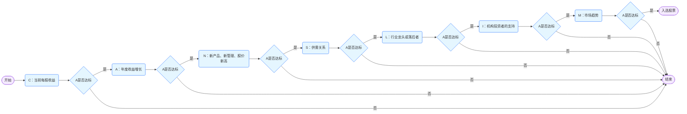

# 威廉·欧奈尔的CANSLIM选股系统

> 关键词：威廉·欧奈尔、CANSLIM选股系统、股票投资、成长股、基本面分析、技术分析

> 摘要：本文深入探讨了威廉·欧奈尔的CANSLIM选股系统，该系统是一种融合基本面与技术面分析的成长股投资策略。文章首先介绍了系统提出的背景及相关基本概念，详细阐述了CANSLIM各字母代表的核心要点及相互联系，并通过Python代码实现核心算法。同时，给出了数学模型与公式，结合实际案例展示该系统在选股中的应用。还探讨了系统的实际应用场景，推荐了相关学习资源、开发工具框架及论文著作。最后总结了CANSLIM选股系统的未来发展趋势与挑战，并提供常见问题解答及参考资料，旨在为投资者全面了解和运用该系统提供专业且详尽的指导。

## 1. 背景介绍 
### 1.1 目的和范围
威廉·欧奈尔（William J. O'Neil）是华尔街投资大师，他通过对美国股市上世纪50年代到80年代表现最为优异的成长股进行深入研究，总结出了CANSLIM选股系统。本文章的目的在于全面剖析该选股系统，帮助投资者理解其原理、掌握运用方法，从而在股票投资中做出更明智的决策。范围涵盖了CANSLIM选股系统的核心概念、算法原理、数学模型、实际应用案例以及相关工具资源等方面。

### 1.2 预期读者
本文预期读者包括对股票投资有兴趣的初学者，希望通过系统学习专业选股方法提升投资水平；也适合有一定投资经验，但希望优化选股策略的投资者；同时可供金融专业学生、研究人员参考，用于学术研究和案例分析。

### 1.3 文档结构概述
本文将按照以下结构展开：首先介绍CANSLIM选股系统的背景知识，包括目的、预期读者等；接着阐述核心概念及各要素之间的联系，并通过流程图展示；然后详细讲解核心算法原理，用Python代码实现具体操作步骤；再给出数学模型和公式并举例说明；之后通过项目实战展示代码实际案例及详细解释；探讨实际应用场景；推荐相关工具和资源；最后总结未来发展趋势与挑战，提供常见问题解答和参考资料。

### 1.4 术语表
#### 1.4.1 核心术语定义
- **CANSLIM选股系统**：由威廉·欧奈尔提出的一种选股策略，通过对股票基本面和技术面多个关键因素的分析，筛选出具有成长潜力的股票。
- **成长股**：指发行股票的公司销售额和利润额持续增长，且增长速度快于整个国家及其行业的公司所发行的股票。
- **每股收益（EPS）**：指税后利润与股本总数的比率，它是测定股票投资价值的重要指标之一。
- **相对强度指标（RS）**：用于衡量某只股票相对于市场上其他股票的表现强度。

#### 1.4.2 相关概念解释
- **基本面分析**：通过对公司财务状况、经营业绩、行业前景等因素的分析，评估股票的内在价值。
- **技术分析**：通过研究股票价格、成交量等市场数据的变化规律，预测股票未来走势。

#### 1.4.3 缩略词列表
- **EPS**：Earnings Per Share（每股收益）
- **RS**：Relative Strength（相对强度）

## 2. 核心概念与联系 
CANSLIM选股系统由七个关键要素组成，每个要素的英文首字母组合成CANSLIM，分别代表不同的选股标准。以下是各要素的详细解释及它们之间的联系：

### C（Current Earnings Per Share）：当前每股收益
当前每股收益是衡量公司盈利能力的重要指标。欧奈尔认为，具有成长潜力的股票，其最近一个季度的每股收益同比增长率应至少达到20% - 25%，甚至更高。这表明公司的盈利正在快速增长，具有良好的发展势头。

### A（Annual Earnings Increases）：年度收益增长
不仅要关注当前季度的每股收益，还要考察公司的年度收益增长情况。连续几年的年度收益增长是公司持续成长的重要标志。一般来说，过去三年的每股收益年复合增长率应在25%以上。

### N（New Products, New Management, New Highs）：新产品、新管理、股价新高
新产品或新的管理团队可能会给公司带来新的发展机遇，推动公司业绩增长。同时，股价创出新高往往意味着市场对公司的看好，是股票具有上涨潜力的信号。

### S（Supply and Demand）：供需关系
主要关注股票的流通股本和成交量。较小的流通股本在市场需求增加时，股价更容易上涨。同时，成交量的放大是股价上涨的动力，在股价突破关键价位时，成交量应显著放大。

### L（Leader or Laggard）：行业龙头或落后者
选择行业中的龙头股，因为龙头股通常具有更强的市场竞争力和抗风险能力。可以通过相对强度指标（RS）来判断股票是否为行业龙头，RS值越高，表明该股票相对于市场上其他股票的表现越强。

### I（Institutional Sponsorship）：机构投资者的支持
机构投资者通常具有专业的研究团队和雄厚的资金实力，他们的买入行为往往是对股票价值的认可。当有一定数量的机构投资者持有某只股票时，说明该股票具有较高的投资价值。

### M（Market Direction）：市场趋势
股票的走势受到市场整体趋势的影响。在牛市中，多数股票会上涨；在熊市中，多数股票会下跌。因此，要根据市场趋势来调整投资策略，选择在市场上升趋势中进行投资。

### 核心概念原理和架构的文本示意图
```plaintext
CANSLIM选股系统
|-- C：当前每股收益
|   |-- 同比增长率至少20% - 25%
|-- A：年度收益增长
|   |-- 过去三年每股收益年复合增长率25%以上
|-- N：新产品、新管理、股价新高
|   |-- 新产品或新管理带来发展机遇
|   |-- 股价创出新高
|-- S：供需关系
|   |-- 小流通股本
|   |-- 成交量放大
|-- L：行业龙头或落后者
|   |-- 通过RS指标判断
|   |-- 选择RS值高的龙头股
|-- I：机构投资者的支持
|   |-- 一定数量机构投资者持有
|-- M：市场趋势
|   |-- 根据市场趋势调整策略
```

### Mermaid流程图


## 3. 核心算法原理 & 具体操作步骤 
### 核心算法原理
CANSLIM选股系统的核心算法是对每个要素进行量化评估，根据设定的标准筛选出符合条件的股票。以下是各要素的量化标准及Python代码实现：

### 具体操作步骤及Python代码实现

```python
import pandas as pd
import yfinance as yf
import requests
from bs4 import BeautifulSoup

# 1. C（Current Earnings Per Share）：当前每股收益
def check_current_eps(ticker):
    try:
        stock = yf.Ticker(ticker)
        earnings = stock.earnings
        latest_eps = earnings['Earnings'].iloc[-1]
        previous_eps = earnings['Earnings'].iloc[-2]
        eps_growth = (latest_eps - previous_eps) / previous_eps * 100
        return eps_growth >= 20
    except Exception as e:
        print(f"Error checking EPS for {ticker}: {e}")
        return False

# 2. A（Annual Earnings Increases）：年度收益增长
def check_annual_earnings(ticker):
    try:
        stock = yf.Ticker(ticker)
        earnings = stock.earnings
        eps_data = earnings['Earnings'].tail(3)
        initial_eps = eps_data.iloc[0]
        final_eps = eps_data.iloc[-1]
        years = len(eps_data)
        cagr = ((final_eps / initial_eps) ** (1 / years) - 1) * 100
        return cagr >= 25
    except Exception as e:
        print(f"Error checking annual earnings for {ticker}: {e}")
        return False

# 3. N（New Products, New Management, New Highs）：新产品、新管理、股价新高
def check_new_highs(ticker):
    try:
        stock = yf.Ticker(ticker)
        history = stock.history(period="max")
        current_price = history['Close'].iloc[-1]
        max_price = history['Close'].max()
        return current_price >= max_price * 0.95
    except Exception as e:
        print(f"Error checking new highs for {ticker}: {e}")
        return False

# 4. S（Supply and Demand）：供需关系
def check_supply_demand(ticker):
    try:
        stock = yf.Ticker(ticker)
        info = stock.info
        shares_outstanding = info.get('sharesOutstanding', 0)
        if shares_outstanding < 100000000:  # 小流通股本标准（可调整）
            history = stock.history(period="1y")
            average_volume = history['Volume'].mean()
            recent_volume = history['Volume'].iloc[-1]
            return recent_volume >= average_volume * 1.5  # 成交量放大标准（可调整）
        return False
    except Exception as e:
        print(f"Error checking supply and demand for {ticker}: {e}")
        return False

# 5. L（Leader or Laggard）：行业龙头或落后者
def check_relative_strength(ticker):
    try:
        # 简单示例：获取股票过去一年的收益率与市场指数（如标普500）对比
        market_index = yf.Ticker('^GSPC')
        stock = yf.Ticker(ticker)
        market_history = market_index.history(period="1y")
        stock_history = stock.history(period="1y")
        market_return = (market_history['Close'].iloc[-1] - market_history['Close'].iloc[0]) / market_history['Close'].iloc[0]
        stock_return = (stock_history['Close'].iloc[-1] - stock_history['Close'].iloc[0]) / stock_history['Close'].iloc[0]
        rs = stock_return / market_return
        return rs >= 1.2  # RS值标准（可调整）
    except Exception as e:
        print(f"Error checking relative strength for {ticker}: {e}")
        return False

# 6. I（Institutional Sponsorship）：机构投资者的支持
def check_institutional_sponsorship(ticker):
    try:
        url = f"https://finance.yahoo.com/quote/{ticker}/holders"
        response = requests.get(url)
        soup = BeautifulSoup(response.text, 'html.parser')
        institutional_holders = soup.find_all('td', text='Institutions')[0].find_next_sibling('td').text
        institutional_holders = float(institutional_holders.replace('%', ''))
        return institutional_holders >= 20  # 机构持股比例标准（可调整）
    except Exception as e:
        print(f"Error checking institutional sponsorship for {ticker}: {e}")
        return False

# 7. M（Market Direction）：市场趋势
def check_market_direction():
    try:
        market_index = yf.Ticker('^GSPC')
        history = market_index.history(period="3m")
        short_term_ma = history['Close'].tail(20).mean()
        long_term_ma = history['Close'].tail(50).mean()
        return short_term_ma > long_term_ma
    except Exception as e:
        print(f"Error checking market direction: {e}")
        return False

# 综合筛选函数
def canslim_screen(tickers):
    selected_stocks = []
    market_trend_ok = check_market_direction()
    if market_trend_ok:
        for ticker in tickers:
            if check_current_eps(ticker) and \
               check_annual_earnings(ticker) and \
               check_new_highs(ticker) and \
               check_supply_demand(ticker) and \
               check_relative_strength(ticker) and \
               check_institutional_sponsorship(ticker):
                selected_stocks.append(ticker)
    return selected_stocks

# 示例使用
tickers = ['AAPL', 'MSFT', 'GOOG']
selected = canslim_screen(tickers)
print("Selected stocks:", selected)
```

## 4. 数学模型和公式 & 详细讲解 & 举例说明 
### 每股收益同比增长率公式
每股收益同比增长率（$EPS_{growth}$）的计算公式为：
$$EPS_{growth}=\frac{EPS_{current}-EPS_{previous}}{EPS_{previous}}\times100\%$$
其中，$EPS_{current}$ 为当前季度的每股收益，$EPS_{previous}$ 为上一季度的每股收益。

**举例说明**：假设某公司上一季度的每股收益为 $2$ 元，当前季度的每股收益为 $2.5$ 元，则每股收益同比增长率为：
$$EPS_{growth}=\frac{2.5 - 2}{2}\times100\% = 25\%$$

### 年度收益复合增长率公式
年度收益复合增长率（$CAGR$）的计算公式为：
$$CAGR=\left(\frac{EPS_{final}}{EPS_{initial}}\right)^{\frac{1}{n}} - 1$$
其中，$EPS_{final}$ 为最后一年的每股收益，$EPS_{initial}$ 为初始年份的每股收益，$n$ 为计算的年数。

**举例说明**：假设某公司三年前的每股收益为 $1$ 元，现在的每股收益为 $2$ 元，则年度收益复合增长率为：
$$CAGR=\left(\frac{2}{1}\right)^{\frac{1}{3}} - 1\approx 26\%$$

### 相对强度指标（RS）公式
相对强度指标（$RS$）的计算公式为：
$$RS=\frac{R_{stock}}{R_{market}}$$
其中，$R_{stock}$ 为股票的收益率，$R_{market}$ 为市场指数的收益率。

**举例说明**：假设某股票过去一年的收益率为 $30\%$，市场指数（如标普500）过去一年的收益率为 $20\%$，则该股票的相对强度指标为：
$$RS=\frac{30\%}{20\%}=1.5$$

## 5. 项目实战：代码实际案例和详细解释说明 
### 5.1  开发环境搭建
- **Python环境**：建议使用Python 3.7及以上版本，可以从Python官方网站（https://www.python.org/downloads/）下载安装。
- **必要库安装**：使用以下命令安装所需的Python库：
```sh
pip install pandas yfinance requests beautifulsoup4
```

### 5.2  源代码详细实现和代码解读
```python
import pandas as pd
import yfinance as yf
import requests
from bs4 import BeautifulSoup

# 1. C（Current Earnings Per Share）：当前每股收益
def check_current_eps(ticker):
    try:
        stock = yf.Ticker(ticker)
        earnings = stock.earnings
        latest_eps = earnings['Earnings'].iloc[-1]
        previous_eps = earnings['Earnings'].iloc[-2]
        eps_growth = (latest_eps - previous_eps) / previous_eps * 100
        return eps_growth >= 20
    except Exception as e:
        print(f"Error checking EPS for {ticker}: {e}")
        return False
```
**代码解读**：该函数用于检查股票的当前每股收益同比增长率是否达到20%。首先使用 `yfinance` 库获取股票的收益数据，然后提取最新和上一季度的每股收益，计算同比增长率，最后判断是否满足条件。

```python
# 2. A（Annual Earnings Increases）：年度收益增长
def check_annual_earnings(ticker):
    try:
        stock = yf.Ticker