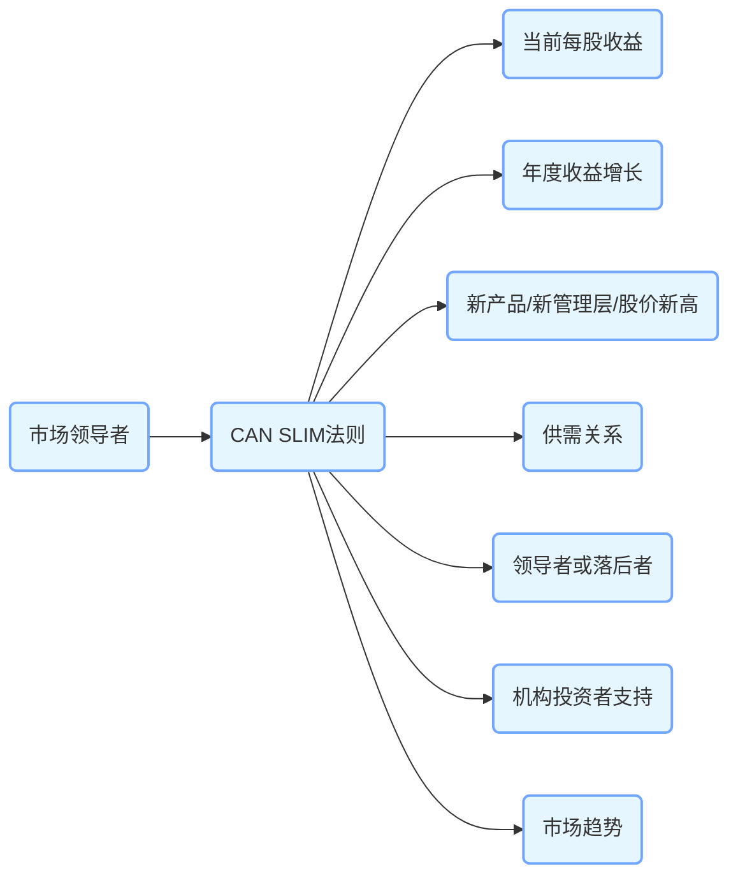

# 威廉·欧奈尔的市场领导者特征分析

> 关键词：威廉·欧奈尔、市场领导者、特征分析、股票投资、CAN SLIM法则

> 摘要：本文深入探讨了威廉·欧奈尔所提出的市场领导者特征分析。威廉·欧奈尔是投资领域的传奇人物，其提出的相关理论和方法对股票投资有着深远的影响。文章将详细介绍市场领导者的核心概念，分析其特征背后的原理和架构，阐述相关算法原理及操作步骤，结合数学模型进行解读，并通过实际案例展示如何运用这些特征进行投资决策。同时，探讨其在实际投资场景中的应用，推荐相关的学习资源、开发工具和研究论文，最后对未来发展趋势与挑战进行总结，以期为投资者和相关研究者提供全面而深入的参考。

## 1. 背景介绍 
### 1.1 目的和范围
本文章的目的在于全面剖析威廉·欧奈尔所提出的市场领导者特征分析。通过深入研究这些特征，帮助投资者更好地识别市场中的潜在领导者股票，提高投资决策的准确性和成功率。范围涵盖了市场领导者特征的理论基础、算法原理、实际应用以及相关的学习资源和未来发展趋势等方面。

### 1.2 预期读者
本文预期读者主要包括股票投资者、金融分析师、投资顾问以及对金融市场和投资理论感兴趣的研究者。无论是专业的投资人士，还是初涉投资领域的新手，都能从本文中获取有价值的信息和见解。

### 1.3 文档结构概述
本文将按照以下结构进行阐述：首先介绍核心概念与联系，包括市场领导者的定义、特征以及相关的架构；接着讲解核心算法原理和具体操作步骤，并用Python代码进行详细说明；然后引入数学模型和公式，通过举例进行深入讲解；之后通过项目实战展示实际案例和代码解读；再探讨实际应用场景；推荐相关的工具和资源；最后总结未来发展趋势与挑战，并提供常见问题解答和扩展阅读参考资料。

### 1.4 术语表
#### 1.4.1 核心术语定义
- **市场领导者**：在特定市场中，具有卓越表现、领先于竞争对手的公司所发行的股票。这些公司通常在业绩增长、市场份额、创新能力等方面具有明显优势。
- **CAN SLIM法则**：威廉·欧奈尔提出的一套选股法则，涵盖了多个方面的因素，用于筛选具有潜力成为市场领导者的股票。
- **相对强度指标（RS）**：衡量一只股票相对于市场整体表现的指标，反映了该股票在一段时间内的强弱程度。

#### 1.4.2 相关概念解释
- **基本面分析**：通过研究公司的财务报表、业绩数据、行业地位等基本面因素，评估公司的内在价值和投资潜力。
- **技术分析**：通过研究股票的价格走势、成交量等技术指标，预测股票未来的价格走势。
- **成长股**：指那些业绩增长速度较快、具有较大发展潜力的公司所发行的股票。

#### 1.4.3 缩略词列表
- **EPS**：Earnings Per Share，每股收益，反映公司每股股票的盈利情况。
- **ROE**：Return on Equity，净资产收益率，衡量公司运用自有资本的效率。
- **P/E**：Price-to-Earnings Ratio，市盈率，反映股票价格与每股收益之间的比例关系。

## 2. 核心概念与联系 

### 2.1 市场领导者的定义
市场领导者是指在特定行业或市场中，具有卓越的业绩表现、强大的市场竞争力和较高的市场份额的公司。这些公司通常能够引领行业的发展趋势，具有较强的创新能力和抗风险能力。在股票市场中，市场领导者的股票往往表现出较强的上涨动力和稳定性。

### 2.2 威廉·欧奈尔的CAN SLIM法则
威廉·欧奈尔提出的CAN SLIM法则是一套全面的选股法则，用于筛选具有潜力成为市场领导者的股票。该法则包括以下七个方面：
- **C（Current Earnings Per Share）**：当前每股收益。要求公司的每股收益在最近几个季度有显著的增长，通常增长幅度要达到25%以上。
- **A（Annual Earnings Increases）**：年度收益增长。公司的年度收益应该呈现出持续增长的趋势，过去三年的平均增长率最好能达到25%以上。
- **N（New Products, New Management, New Highs）**：新产品、新管理层、股价创新高。公司推出新产品或新服务，或者有新的管理层加入，往往会带来新的发展机遇。同时，股价创出新高也是一个重要的信号，表明市场对该股票的看好。
- **S（Supply and Demand）**：供需关系。关注股票的流通股本和成交量，较小的流通股本和较大的成交量往往意味着股票的供需关系较为紧张，股价上涨的动力更强。
- **L（Leader or Laggard）**：领导者或落后者。选择在行业中处于领先地位的公司，避免投资那些表现落后的公司。
- **I（Institutional Sponsorship）**：机构投资者的支持。机构投资者的买入和持有往往是对公司基本面的认可，也会对股价产生积极的影响。
- **M（Market Direction）**：市场趋势。要关注整体市场的走势，选择在市场处于上升趋势时进行投资。

### 2.3 核心概念的架构示意图


### 2.4 核心概念之间的联系
CAN SLIM法则的各个要素之间相互关联、相互影响。例如，公司的当前每股收益和年度收益增长反映了公司的盈利能力，这是公司成为市场领导者的基础。新产品、新管理层和股价创新高则体现了公司的创新能力和市场关注度，有助于提升公司的竞争力。供需关系和机构投资者的支持会影响股票的价格走势，而市场趋势则为投资决策提供了宏观环境的参考。只有综合考虑这些因素，才能更准确地识别市场领导者股票。

## 3. 核心算法原理 & 具体操作步骤 

### 3.1 核心算法原理
威廉·欧奈尔的市场领导者特征分析主要基于基本面分析和技术分析相结合的方法。通过对公司的财务数据、行业地位、股价走势等多个方面进行综合评估，筛选出具有潜力成为市场领导者的股票。具体来说，就是根据CAN SLIM法则的各个要素，对股票进行打分和筛选。

### 3.2 具体操作步骤
#### 3.2.1 数据收集
首先需要收集公司的财务数据，包括每股收益、年度收益、净资产收益率等，以及股票的价格走势、成交量等技术数据。这些数据可以从金融数据提供商、证券交易所网站等渠道获取。

#### 3.2.2 指标计算
根据收集到的数据，计算CAN SLIM法则中各个要素的指标值。例如，计算当前每股收益的增长率、年度收益的平均增长率、相对强度指标等。

#### 3.2.3 筛选和排序
根据计算得到的指标值，对股票进行筛选和排序。例如，选择每股收益增长率大于25%、年度收益平均增长率大于25%的股票，并按照相对强度指标进行排序。

#### 3.2.4 综合评估
对筛选出的股票进行综合评估，考虑公司的行业地位、新产品情况、机构投资者支持等因素，最终确定具有潜力成为市场领导者的股票。

### 3.3 Python代码实现
```python
import pandas as pd
import yfinance as yf

# 数据收集
def collect_data(ticker, start_date, end_date):
    data = yf.download(ticker, start=start_date, end=end_date)
    return data

# 计算每股收益增长率
def calculate_eps_growth(eps_data):
    growth = (eps_data.iloc[-1] - eps_data.iloc[-2]) / eps_data.iloc[-2]
    return growth

# 筛选股票
def screen_stocks(tickers, start_date, end_date):
    selected_stocks = []
    for ticker in tickers:
        try:
            data = collect_data(ticker, start_date, end_date)
            # 假设这里可以获取到每股收益数据
            eps_data = pd.Series([1.0, 1.2, 1.5])  # 示例数据
            eps_growth = calculate_eps_growth(eps_data)
            if eps_growth > 0.25:
                selected_stocks.append(ticker)
        except Exception as e:
            print(f"Error processing {ticker}: {e}")
    return selected_stocks

# 主函数
if __name__ == "__main__":
    tickers = ["AAPL", "MSFT", "GOOG"]
    start_date = "2020-01-01"
    end_date = "2023-01-01"
    selected = screen_stocks(tickers, start_date, end_date)
    print("Selected stocks:", selected)
```

### 3.4 代码解释
- `collect_data` 函数：使用 `yfinance` 库从雅虎财经下载股票数据。
- `calculate_eps_growth` 函数：计算每股收益的增长率。
- `screen_stocks` 函数：对输入的股票列表进行筛选，选择每股收益增长率大于25%的股票。
- 主函数：调用 `screen_stocks` 函数进行股票筛选，并输出筛选结果。

## 4. 数学模型和公式 & 详细讲解 & 举例说明 

### 4.1 每股收益增长率公式
每股收益增长率（EPS Growth Rate）的计算公式为：
$$
EPS Growth Rate = \frac{EPS_{current} - EPS_{previous}}{EPS_{previous}}
$$
其中，$EPS_{current}$ 是当前的每股收益，$EPS_{previous}$ 是上一时期的每股收益。

### 4.2 年度收益平均增长率公式
年度收益平均增长率（Annual Earnings Growth Rate）可以使用复利增长率公式计算：
$$
Annual Earnings Growth Rate = (\frac{EPS_{latest}}{EPS_{start}})^{\frac{1}{n}} - 1
$$
其中，$EPS_{latest}$ 是最近一年的每股收益，$EPS_{start}$ 是起始年份的每股收益，$n$ 是时间跨度（年数）。

### 4.3 相对强度指标公式
相对强度指标（Relative Strength Index，RS）的计算公式为：
$$
RS = \frac{Stock Price Performance}{Market Index Performance}
$$
其中，$Stock Price Performance$ 是股票在一段时间内的价格表现，$Market Index Performance$ 是市场指数在同一时间段内的表现。

### 4.4 举例说明
假设某公司在2022年的每股收益为2元，在2023年的每股收益为2.5元。则该公司的每股收益增长率为：
$$
EPS Growth Rate = \frac{2.5 - 2}{2} = 0.25 = 25\%
$$
假设该公司在2020年的每股收益为1元，在2023年的每股收益为2元，时间跨度为3年。则该公司的年度收益平均增长率为：
$$
Annual Earnings Growth Rate = (\frac{2}{1})^{\frac{1}{3}} - 1 \approx 0.26 = 26\%
$$
假设某股票在过去一年的价格上涨了30%，而市场指数在同一时期上涨了20%。则该股票的相对强度指标为：
$$
RS = \frac{30\%}{20\%} = 1.5
$$

## 5. 项目实战：代码实际案例和详细解释说明 

### 5.1 开发环境搭建
#### 5.1.1 安装Python
首先需要安装Python环境，建议使用Python 3.7及以上版本。可以从Python官方网站（https://www.python.org/downloads/）下载并安装。

#### 5.1.2 安装必要的库
使用以下命令安装所需的库：
```sh
pip install pandas yfinance
```
其中，`pandas` 用于数据处理和分析，`yfinance` 用于获取股票数据。

### 5.2 源代码详细实现和代码解读
```python
import pandas as pd
import yfinance as yf

# 数据收集
def collect_data(ticker, start_date, end_date):
    """
    该函数用于从雅虎财经下载指定股票在指定日期范围内的数据。
    :param ticker: 股票代码
    :param start_date: 开始日期
    :param end_date: 结束日期
    :return: 包含股票数据的DataFrame
    """
    data = yf.download(ticker, start=start_date, end=end_date)
    return data

# 计算每股收益增长率
def calculate_eps_growth(eps_data):
    """
    该函数用于计算每股收益的增长率。
    :param eps_data: 包含每股收益数据的Series
    :return: 每股收益增长率
    """
    growth = (eps_data.iloc[-1] - eps_data.iloc[-2]) / eps_data.iloc[-2]
    return growth

# 筛选股票
def screen_stocks(tickers, start_date, end_date):
    """
    该函数用于对输入的股票列表进行筛选，选择每股收益增长率大于25%的股票。
    :param tickers: 股票代码列表
    :param start_date: 开始日期
    :param end_date: 结束日期
    :return: 筛选后的股票代码列表
    """
    selected_stocks = []
    for ticker in tickers:
        try:
            data = collect_data(ticker, start_date, end_date)
            # 假设这里可以获取到每股收益数据
            eps_data = pd.Series([1.0, 1.2, 1.5])  # 示例数据
            eps_growth = calculate_eps_growth(eps_data)
            if eps_growth > 0.25:
                selected_stocks.append(ticker)
        except Exception as e:
            print(f"Error processing {ticker}: {e}")
    return selected_stocks

# 主函数
if __name__ == "__main__":
    tickers = ["AAPL", "MSFT", "GOOG"]
    start_date = "2020-01-01"
    end_date = "2023-01-01"
    selected = screen_stocks(tickers, start_date, end_date)
    print("Selected stocks:", selected)
```

### 5.3 代码解读与分析
- **数据收集**：`collect_data` 函数使用 `yfinance` 库从雅虎财经下载指定股票在指定日期范围内的数据。
- **每股收益增长率计算**：`calculate_eps_growth` 函数根据输入的每股收益数据计算增长率。
- **股票筛选**：`screen_stocks` 函数遍历输入的股票列表，对每只股票计算每股收益增长率，并选择增长率大于25%的股票。
- **主函数**：定义了股票代码列表、开始日期和结束日期，调用 `screen_stocks` 函数进行股票筛选，并输出筛选结果。

需要注意的是，代码中的每股收益数据是示例数据，实际应用中需要从可靠的数据源获取真实的每股收益数据。

## 6. 实际应用场景 
### 6.1 个人投资者选股
个人投资者可以运用威廉·欧奈尔的市场领导者特征分析方法，筛选出具有潜力的股票进行投资。通过关注CAN SLIM法则的各个要素，投资者可以更全面地评估公司的基本面和市场表现，提高选股的准确性。例如，投资者可以根据每股收益增长率、年度收益增长等指标，选择业绩增长强劲的公司；关注新产品、新管理层等因素，寻找具有创新潜力的公司；同时结合市场趋势，选择在市场上升阶段进行投资。

### 6.2 机构投资者资产配置
机构投资者在进行资产配置时，也可以参考威廉·欧奈尔的方法。机构投资者通常管理着大量的资金，需要对众多的股票进行筛选和评估。通过运用CAN SLIM法则，机构投资者可以快速筛选出符合要求的股票，构建投资组合。例如，机构投资者可以根据相对强度指标，选择在市场中表现较强的股票；关注机构投资者的支持情况，选择受到机构青睐的股票。

### 6.3 金融分析师研究报告
金融分析师在撰写研究报告时，可以运用威廉·欧奈尔的市场领导者特征分析方法，对公司进行评估和分析。通过对公司的基本面和市场表现进行深入研究，金融分析师可以为投资者提供有价值的投资建议。例如，金融分析师可以在研究报告中分析公司的每股收益增长率、年度收益增长等指标，评估公司的盈利能力；关注公司的新产品、新管理层等因素，分析公司的发展潜力。

## 7. 工具和资源推荐
### 7.1 学习资源推荐
#### 7.1.1 书籍推荐
- 《笑傲股市》（*How to Make Money in Stocks*）：威廉·欧奈尔的经典著作，详细介绍了CAN SLIM法则和选股方法。
- 《股票大作手回忆录》（*Reminiscences of a Stock Operator*）：虽然不是直接关于威廉·欧奈尔的方法，但这本书对于理解股票市场和投资心理非常有帮助。
- 《聪明的投资者》（*The Intelligent Investor*）：本杰明·格雷厄姆的经典著作，强调了价值投资的理念，与威廉·欧奈尔的方法有一定的互补性。

#### 7.1.2 在线课程
- Coursera上的“Investment Management Specialization”：该课程涵盖了投资管理的各个方面，包括基本面分析、技术分析等内容。
- Udemy上的“Stock Market Investing for Beginners”：适合初学者学习股票投资的基础知识和方法。

#### 7.1.3 技术博客和网站
- 威廉·欧奈尔官方网站（https://www.investors.com/）：提供了丰富的投资资讯、研究报告和选股工具。
- Seeking Alpha（https://seekingalpha.com/）：一个专业的金融分析网站，有很多关于股票投资的文章和分析。

### 7.2 开发工具框架推荐
#### 7.2.1 IDE和编辑器
- PyCharm：一款专业的Python集成开发环境，提供了丰富的代码编辑、调试和分析功能。
- Jupyter Notebook：一个交互式的开发环境，适合进行数据分析和模型验证。

#### 7.2.2 调试和性能分析工具
- PDB：Python自带的调试工具，可以帮助开发者定位代码中的问题。
- cProfile：Python的性能分析工具，可以分析代码的运行时间和性能瓶颈。

#### 7.2.3 相关框架和库
- Pandas：用于数据处理和分析的Python库，提供了丰富的数据结构和数据分析工具。
- NumPy：用于科学计算的Python库，提供了高效的数组操作和数学函数。
- Matplotlib：用于数据可视化的Python库，可以绘制各种类型的图表。

### 7.3 相关论文著作推荐
#### 7.3.1 经典论文
- William J. O'Neil, "How to Spot Market Tops and Bottoms", 该论文探讨了如何识别市场的顶部和底部，对于投资者把握市场趋势有重要的参考价值。
- Benjamin Graham and David Dodd, "Security Analysis", 这篇经典论文奠定了价值投资的理论基础，与威廉·欧奈尔的方法有一定的关联。

#### 7.3.2 最新研究成果
- 近年来，有很多关于股票投资和市场分析的研究成果发表在金融学术期刊上。例如，《Journal of Financial Economics》、《Review of Financial Studies》等期刊上的相关论文，可以关注市场领导者特征分析的最新研究进展。

#### 7.3.3 应用案例分析
- 一些金融研究机构和投资公司会发布关于威廉·欧奈尔方法的应用案例分析报告。这些报告可以帮助投资者更好地理解如何将理论应用到实际投资中。

## 8. 总结：未来发展趋势与挑战
### 8.1 未来发展趋势
- **数据驱动的投资决策**：随着金融科技的发展，越来越多的数据和分析工具将被应用于投资决策。威廉·欧奈尔的市场领导者特征分析方法也将与大数据、人工智能等技术相结合，提高选股的准确性和效率。
- **全球化投资**：随着全球经济的一体化，投资者的视野将更加全球化。威廉·欧奈尔的方法可以应用于不同国家和地区的股票市场，为投资者提供更广泛的投资机会。
- **多策略融合**：未来的投资策略将更加多元化，威廉·欧奈尔的方法可能会与其他投资策略（如价值投资、量化投资等）相结合，形成更强大的投资组合。

### 8.2 挑战
- **数据质量和可靠性**：准确的财务数据和市场数据是运用威廉·欧奈尔方法的基础。然而，数据的质量和可靠性可能会受到多种因素的影响，如数据来源的准确性、数据处理的误差等。
- **市场变化的不确定性**：股票市场是复杂多变的，市场趋势和公司基本面可能会受到宏观经济环境、政策变化、行业竞争等多种因素的影响。威廉·欧奈尔的方法虽然可以提供一定的参考，但无法完全预测市场的变化。
- **投资者情绪的影响**：投资者的情绪和心理因素也会对股票市场产生重要影响。在市场波动较大时，投资者的情绪可能会导致股票价格的非理性波动，从而影响威廉·欧奈尔方法的应用效果。

## 9. 附录：常见问题与解答
### 9.1 威廉·欧奈尔的方法适用于所有类型的股票吗？
威廉·欧奈尔的方法主要适用于成长股投资。成长股通常具有较高的业绩增长潜力和市场关注度，符合CAN SLIM法则的选股标准。然而，该方法并不适用于所有类型的股票，如价值股、周期股等。对于不同类型的股票，投资者需要采用不同的投资策略。

### 9.2 如何获取准确的财务数据和市场数据？
可以从以下渠道获取准确的财务数据和市场数据：
- 金融数据提供商：如Bloomberg、Wind等，提供了丰富的金融数据和分析工具。
- 证券交易所网站：可以获取上市公司的财务报表和公告等信息。
- 公司官方网站：上市公司通常会在其官方网站上公布财务报告和业绩数据。

### 9.3 威廉·欧奈尔的方法与其他投资方法有什么区别？
威廉·欧奈尔的方法强调基本面分析和技术分析相结合，注重公司的业绩增长和市场表现。与价值投资方法相比，威廉·欧奈尔的方法更关注公司的成长潜力和市场趋势；与量化投资方法相比，威廉·欧奈尔的方法更注重人的主观判断和经验。

## 10. 扩展阅读 & 参考资料
### 10.1 扩展阅读
- 除了前面推荐的书籍和文章外，还可以阅读一些关于投资心理学、宏观经济学等方面的书籍，以拓宽投资视野。
- 关注金融领域的知名博主和专家的社交媒体账号，获取最新的投资资讯和观点。

### 10.2 参考资料
- William J. O'Neil, *How to Make Money in Stocks*, Investor's Business Daily, 2009.
- Benjamin Graham and David Dodd, *Security Analysis*, McGraw-Hill, 1934.
- YFinance documentation: https://pypi.org/project/yfinance/
- Pandas documentation: https://pandas.pydata.org/docs/

作者：AI天才研究院/AI Genius Institute & 禅与计算机程序设计艺术 /Zen And The Art of Computer Programming