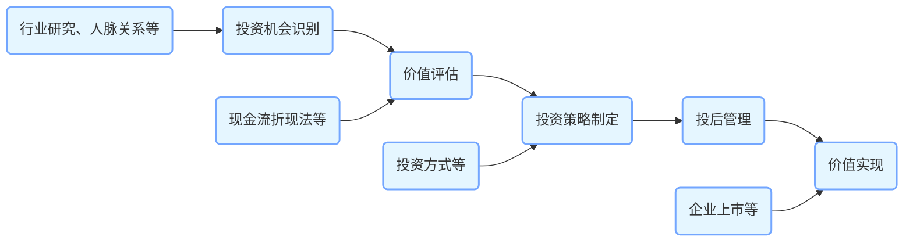

# 威廉·贝恩的私募股权价值创造模型

> 关键词：私募股权、价值创造模型、威廉·贝恩、投资策略、财务分析

> 摘要：本文深入探讨了威廉·贝恩的私募股权价值创造模型。首先介绍了该模型提出的背景、目的及适用范围，明确预期读者和文档结构。详细阐述了模型的核心概念、算法原理、数学模型及公式。通过实际项目案例展示了模型在实战中的应用，包括开发环境搭建、代码实现与解读。分析了模型在不同场景下的实际应用情况，并推荐了相关的学习资源、开发工具和论文著作。最后总结了模型的未来发展趋势与挑战，解答常见问题并提供扩展阅读和参考资料，旨在为私募股权投资领域的从业者和研究者提供全面且深入的知识体系。

## 1. 背景介绍 
### 1.1 目的和范围
私募股权投资作为金融领域的重要组成部分，对于企业的成长和经济的发展有着重要的推动作用。威廉·贝恩的私募股权价值创造模型旨在为私募股权投资者提供一套系统的方法，以评估投资项目的价值创造潜力，制定合理的投资策略，并在投资后通过有效的管理和运营提升企业价值。该模型的范围涵盖了从项目筛选、投资决策到投后管理和退出的整个私募股权投资生命周期。

### 1.2 预期读者
本文的预期读者主要包括私募股权投资机构的从业者，如投资经理、分析师等，他们可以通过本文深入了解模型的原理和应用，提升投资决策的准确性和效率。同时，企业管理者也可以从中学习如何优化企业运营，提升企业价值，以吸引私募股权投资。此外，金融专业的学生和研究者也可以将本文作为研究私募股权投资领域的参考资料。

### 1.3 文档结构概述
本文将首先介绍私募股权价值创造模型的核心概念和各概念之间的联系，通过文本示意图和 Mermaid 流程图进行直观展示。接着详细阐述模型的核心算法原理，并给出具体的操作步骤，同时使用 Python 源代码进行详细说明。然后介绍模型所涉及的数学模型和公式，并通过具体例子进行讲解。之后通过一个实际的项目案例，展示模型在实战中的应用，包括开发环境搭建、源代码实现和代码解读。再分析模型在不同场景下的实际应用情况。推荐相关的学习资源、开发工具和论文著作。最后总结模型的未来发展趋势与挑战，解答常见问题并提供扩展阅读和参考资料。

### 1.4 术语表
#### 1.4.1 核心术语定义
- **私募股权（Private Equity）**：指通过私募形式对私有企业，即非上市企业进行的权益性投资，在交易实施过程中附带考虑了将来的退出机制，即通过上市、并购或管理层回购等方式，出售持股获利。
- **价值创造（Value Creation）**：指通过各种手段和策略，提升企业的内在价值，包括增加企业的盈利能力、改善财务状况、优化运营效率等。
- **投资组合（Investment Portfolio）**：指私募股权投资机构所投资的多个项目的集合，通过合理配置投资组合，可以降低投资风险，提高整体投资回报率。
- **投后管理（Post - investment Management）**：指在私募股权投资完成后，投资机构对被投资企业进行的一系列管理和监督活动，旨在提升企业价值，实现投资目标。

#### 1.4.2 相关概念解释
- **杠杆收购（Leveraged Buyout, LBO）**：是一种常见的私募股权投资方式，指收购方通过大量举债来筹集资金，收购目标企业的股权。杠杆收购通常利用目标企业的资产和未来现金流作为抵押来获取贷款，以提高投资回报率。
- **协同效应（Synergy Effect）**：指两个或多个企业合并或合作后，产生的整体效益大于各个部分效益之和的现象。在私募股权投资中，协同效应可以通过整合资源、优化业务流程、拓展市场等方式实现。
- **内部收益率（Internal Rate of Return, IRR）**：是一种衡量投资项目盈利能力的指标，它是使投资项目的净现值等于零时的折现率。IRR 越高，说明投资项目的盈利能力越强。

#### 1.4.3 缩略词列表
- **PE**：私募股权（Private Equity）
- **LBO**：杠杆收购（Leveraged Buyout）
- **IRR**：内部收益率（Internal Rate of Return）
- **NPV**：净现值（Net Present Value）

## 2. 核心概念与联系 
威廉·贝恩的私募股权价值创造模型主要涉及以下几个核心概念：投资机会识别、价值评估、投资策略制定、投后管理和价值实现。这些概念相互关联，共同构成了一个完整的私募股权投资价值创造体系。

### 核心概念原理
- **投资机会识别**：私募股权投资机构需要通过各种渠道，如行业研究、人脉关系、中介机构等，寻找具有潜在价值的投资项目。在识别投资机会时，需要考虑行业发展趋势、企业竞争优势、市场需求等因素。
- **价值评估**：对潜在投资项目进行价值评估是投资决策的关键环节。常用的价值评估方法包括现金流折现法（DCF）、市场比较法、资产基础法等。通过价值评估，可以确定投资项目的合理价格，为投资决策提供依据。
- **投资策略制定**：根据投资机会识别和价值评估的结果，私募股权投资机构需要制定合适的投资策略。投资策略包括投资方式（如直接投资、联合投资等）、投资比例、退出方式等。投资策略的制定需要考虑投资机构的风险偏好、资金规模、投资目标等因素。
- **投后管理**：在投资完成后，私募股权投资机构需要对被投资企业进行投后管理。投后管理的主要内容包括参与企业战略规划、提供管理咨询、优化企业治理结构、协调资源整合等。通过有效的投后管理，可以提升被投资企业的价值。
- **价值实现**：私募股权投资的最终目标是实现价值。价值实现的方式主要包括企业上市、并购重组、管理层回购等。在价值实现过程中，投资机构需要选择合适的时机和方式，以获得最大的投资回报。

### 文本示意图
```plaintext
投资机会识别 --> 价值评估 --> 投资策略制定 --> 投后管理 --> 价值实现
|                        |                        |                   |
|                        |                        |                   |
V                        V                        V                   V
行业研究、人脉关系等   现金流折现法等          投资方式等           企业上市等
```

### Mermaid 流程图


## 3. 核心算法原理 & 具体操作步骤 
### 核心算法原理
威廉·贝恩的私募股权价值创造模型中，核心算法主要涉及价值评估和投资回报率计算。其中，现金流折现法（DCF）是最常用的价值评估方法，其基本原理是将企业未来的现金流按照一定的折现率折现到当前时刻，得到企业的现值。投资回报率通常用内部收益率（IRR）来衡量，IRR 是使投资项目的净现值等于零时的折现率。

### 具体操作步骤
#### 1. 预测企业未来现金流
首先，需要对被投资企业的未来现金流进行预测。预测现金流需要考虑企业的历史财务数据、行业发展趋势、市场需求等因素。一般来说，可以将企业的未来现金流分为预测期现金流和永续期现金流。预测期现金流通常为 5 - 10 年，永续期现金流是指预测期结束后的现金流。

#### 2. 确定折现率
折现率是将未来现金流折现到当前时刻的比率，它反映了投资的风险和机会成本。折现率的确定需要考虑市场利率、行业风险、企业特定风险等因素。常用的确定折现率的方法是资本资产定价模型（CAPM），其公式为：

$$R_i = R_f + \beta_i \times (R_m - R_f)$$

其中，$R_i$ 是第 $i$ 种资产的预期收益率，$R_f$ 是无风险收益率，$\beta_i$ 是第 $i$ 种资产的贝塔系数，$R_m$ 是市场组合的预期收益率。

#### 3. 计算企业现值
将预测期现金流和永续期现金流按照折现率折现到当前时刻，得到企业的现值。计算公式为：

$$PV = \sum_{t = 1}^{n} \frac{CF_t}{(1 + r)^t} + \frac{CF_{n+1}}{(r - g)(1 + r)^n}$$

其中，$PV$ 是企业的现值，$CF_t$ 是第 $t$ 期的现金流，$r$ 是折现率，$n$ 是预测期的期数，$CF_{n+1}$ 是永续期的第一年现金流，$g$ 是永续期现金流的增长率。

#### 4. 计算内部收益率（IRR）
内部收益率（IRR）是使投资项目的净现值等于零时的折现率。可以通过迭代法或使用财务计算器来计算 IRR。净现值（NPV）的计算公式为：

$$NPV = \sum_{t = 0}^{n} \frac{CF_t}{(1 + IRR)^t}$$

其中，$NPV$ 是净现值，$CF_t$ 是第 $t$ 期的现金流，$IRR$ 是内部收益率，$n$ 是投资项目的期数。

### Python 源代码实现
```python
import numpy as np
from scipy.optimize import fsolve

# 预测期现金流
forecast_cash_flows = [100, 120, 140, 160, 180]
# 永续期现金流增长率
perpetual_growth_rate = 0.03
# 折现率
discount_rate = 0.1

# 计算永续期第一年现金流
last_forecast_cash_flow = forecast_cash_flows[-1]
perpetual_cash_flow = last_forecast_cash_flow * (1 + perpetual_growth_rate)

# 计算预测期现金流现值
present_value_forecast = 0
for i, cf in enumerate(forecast_cash_flows):
    present_value_forecast += cf / ((1 + discount_rate) ** (i + 1))

# 计算永续期现金流现值
n = len(forecast_cash_flows)
present_value_perpetual = perpetual_cash_flow / ((discount_rate - perpetual_growth_rate) * (1 + discount_rate) ** n)

# 计算企业现值
enterprise_present_value = present_value_forecast + present_value_perpetual

print(f"企业现值: {enterprise_present_value}")

# 假设初始投资为 500，计算内部收益率
cash_flows = [-500] + forecast_cash_flows
def npv(irr):
    return np.sum([cf / ((1 + irr) ** i) for i, cf in enumerate(cash_flows)])

# 使用 fsolve 函数计算 IRR
irr = fsolve(npv, 0.1)[0]
print(f"内部收益率: {irr * 100:.2f}%")
```

## 4. 数学模型和公式 & 详细讲解 & 举例说明 
### 现金流折现法（DCF）公式
现金流折现法（DCF）是私募股权价值评估的核心方法，其公式为：

$$PV = \sum_{t = 1}^{n} \frac{CF_t}{(1 + r)^t} + \frac{CF_{n+1}}{(r - g)(1 + r)^n}$$

其中，$PV$ 是企业的现值，$CF_t$ 是第 $t$ 期的现金流，$r$ 是折现率，$n$ 是预测期的期数，$CF_{n+1}$ 是永续期的第一年现金流，$g$ 是永续期现金流的增长率。

### 详细讲解
- **预测期现金流折现**：$\sum_{t = 1}^{n} \frac{CF_t}{(1 + r)^t}$ 表示将预测期内各期的现金流按照折现率 $r$ 折现到当前时刻的总和。随着时间的推移，未来现金流的现值会逐渐减小，因为资金具有时间价值。
- **永续期现金流折现**：$\frac{CF_{n+1}}{(r - g)(1 + r)^n}$ 表示将永续期的现金流折现到当前时刻的价值。永续期现金流假设企业在预测期结束后将以固定的增长率 $g$ 持续增长。

### 举例说明
假设某企业未来 5 年的预测现金流分别为 100 万元、120 万元、140 万元、160 万元和 180 万元，永续期现金流增长率为 3%，折现率为 10%。

首先，计算预测期现金流现值：

$$
\begin{align*}
PV_{forecast} &= \frac{100}{(1 + 0.1)^1} + \frac{120}{(1 + 0.1)^2} + \frac{140}{(1 + 0.1)^3} + \frac{160}{(1 + 0.1)^4} + \frac{180}{(1 + 0.1)^5}\\
&= \frac{100}{1.1} + \frac{120}{1.21} + \frac{140}{1.331} + \frac{160}{1.4641} + \frac{180}{1.61051}\\
&\approx 90.91 + 99.17 + 105.18 + 109.29 + 111.76\\
&= 516.31
\end{align*}
$$

然后，计算永续期第一年现金流：

$CF_{n+1} = 180 \times (1 + 0.03) = 185.4$

接着，计算永续期现金流现值：

$$
\begin{align*}
PV_{perpetual} &= \frac{185.4}{(0.1 - 0.03)(1 + 0.1)^5}\\
&= \frac{185.4}{0.07 \times 1.61051}\\
&\approx 1633.74
\end{align*}
$$

最后，计算企业现值：

$PV = PV_{forecast} + PV_{perpetual} = 516.31 + 1633.74 = 2150.05$

因此，该企业的现值约为 2150.05 万元。

### 内部收益率（IRR）公式
内部收益率（IRR）是使投资项目的净现值等于零时的折现率，其公式为：

$$NPV = \sum_{t = 0}^{n} \frac{CF_t}{(1 + IRR)^t} = 0$$

其中，$NPV$ 是净现值，$CF_t$ 是第 $t$ 期的现金流，$IRR$ 是内部收益率，$n$ 是投资项目的期数。

### 详细讲解
内部收益率（IRR）反映了投资项目的实际盈利能力。当 $IRR$ 大于投资者要求的最低回报率时，投资项目是可行的；反之，则不可行。在计算 $IRR$ 时，通常需要使用迭代法或财务计算器来求解方程 $\sum_{t = 0}^{n} \frac{CF_t}{(1 + IRR)^t} = 0$。

### 举例说明
假设某投资项目的初始投资为 500 万元，未来 5 年的现金流分别为 100 万元、120 万元、140 万元、160 万元和 180 万元。

设 $IRR$ 为未知数，根据净现值公式可得：

$$-500 + \frac{100}{(1 + IRR)^1} + \frac{120}{(1 + IRR)^2} + \frac{140}{(1 + IRR)^3} + \frac{160}{(1 + IRR)^4} + \frac{180}{(1 + IRR)^5} = 0$$

使用 Python 的 `scipy.optimize.fsolve` 函数求解上述方程，得到 $IRR \approx 0.13$，即 13%。这意味着该投资项目的内部收益率为 13%，如果投资者要求的最低回报率小于 13%，则该投资项目是可行的。

## 5. 项目实战：代码实际案例和详细解释说明 
### 5.1  开发环境搭建
为了实现威廉·贝恩的私募股权价值创造模型，我们需要搭建一个 Python 开发环境。以下是具体的搭建步骤：

#### 1. 安装 Python
首先，从 Python 官方网站（https://www.python.org/downloads/）下载并安装 Python 3.x 版本。安装过程中，确保勾选“Add Python to PATH”选项，以便在命令行中可以直接使用 Python 命令。

#### 2. 安装必要的库
我们需要安装一些必要的 Python 库，如 `numpy` 和 `scipy`。可以使用以下命令进行安装：

```sh
pip install numpy scipy
```

#### 3. 选择开发工具
可以选择使用 Jupyter Notebook、PyCharm 等开发工具进行代码编写和调试。Jupyter Notebook 适合交互式开发和数据分析，PyCharm 是一个功能强大的 Python 集成开发环境（IDE），适合大型项目的开发。

### 5.2  源代码详细实现和代码解读
以下是一个完整的 Python 代码示例，用于实现威廉·贝恩的私募股权价值创造模型：

```python
import numpy as np
from scipy.optimize import fsolve

# 定义预测期现金流
forecast_cash_flows = [100, 120, 140, 160, 180]
# 定义永续期现金流增长率
perpetual_growth_rate = 0.03
# 定义折现率
discount_rate = 0.1
# 定义初始投资
initial_investment = -500

# 计算永续期第一年现金流
last_forecast_cash_flow = forecast_cash_flows[-1]
perpetual_cash_flow = last_forecast_cash_flow * (1 + perpetual_growth_rate)

# 计算预测期现金流现值
present_value_forecast = 0
for i, cf in enumerate(forecast_cash_flows):
    present_value_forecast += cf / ((1 + discount_rate) ** (i + 1))

# 计算永续期现金流现值
n = len(forecast_cash_flows)
present_value_perpetual = perpetual_cash_flow / ((discount_rate - perpetual_growth_rate) * (1 + discount_rate) ** n)

# 计算企业现值
enterprise_present_value = present_value_forecast + present_value_perpetual

print(f"企业现值: {enterprise_present_value}")

# 计算内部收益率（IRR）
cash_flows = [initial_investment] + forecast_cash_flows
def npv(irr):
    return np.sum([cf / ((1 + irr) ** i) for i, cf in enumerate(cash_flows)])

# 使用 fsolve 函数计算 IRR
irr = fsolve(npv, 0.1)[0]
print(f"内部收益率: {irr * 100:.2f}%")
```

### 代码解读与分析
#### 1. 导入必要的库
```python
import numpy as np
from scipy.optimize import fsolve
```
`numpy` 是一个用于科学计算的 Python 库，提供了高效的数组操作和数学函数。`scipy.optimize.fsolve` 是一个用于求解非线性方程的函数，我们将使用它来计算内部收益率（IRR）。

#### 2. 定义参数
```python
forecast_cash_flows = [100, 120, 140, 160, 180]
perpetual_growth_rate = 0.03
discount_rate = 0.1
initial_investment = -500
```
`forecast_cash_flows` 是预测期的现金流列表，`perpetual_growth_rate` 是永续期现金流的增长率，`discount_rate` 是折现率，`initial_investment` 是初始投资，用负数表示现金流出。

#### 3. 计算永续期第一年现金流
```python
last_forecast_cash_flow = forecast_cash_flows[-1]
perpetual_cash_flow = last_forecast_cash_flow * (1 + perpetual_growth_rate)
```
`last_forecast_cash_flow` 是预测期最后一年的现金流，`perpetual_cash_flow` 是永续期第一年的现金流，通过预测期最后一年的现金流乘以 $(1 + g)$ 计算得到。

#### 4. 计算预测期现金流现值
```python
present_value_forecast = 0
for i, cf in enumerate(forecast_cash_flows):
    present_value_forecast += cf / ((1 + discount_rate) ** (i + 1))
```
使用循环遍历预测期的现金流，将每期现金流按照折现率折现到当前时刻，并累加到 `present_value_forecast` 中。

#### 5. 计算永续期现金流现值
```python
n = len(forecast_cash_flows)
present_value_perpetual = perpetual_cash_flow / ((discount_rate - perpetual_growth_rate) * (1 + discount_rate) ** n)
```
根据现金流折现法的公式，计算永续期现金流的现值。

#### 6. 计算企业现值
```python
enterprise_present_value = present_value_forecast + present_value_perpetual
print(f"企业现值: {enterprise_present_value}")
```
将预测期现金流现值和永续期现金流现值相加，得到企业的现值，并打印输出。

#### 7. 计算内部收益率（IRR）
```python
cash_flows = [initial_investment] + forecast_cash_flows
def npv(irr):
    return np.sum([cf / ((1 + irr) ** i) for i, cf in enumerate(cash_flows)])

irr = fsolve(npv, 0.1)[0]
print(f"内部收益率: {irr * 100:.2f}%")
```
首先，将初始投资和预测期现金流合并为一个现金流列表 `cash_flows`。然后，定义一个 `npv` 函数，用于计算净现值。最后，使用 `fsolve` 函数求解使净现值等于零的折现率，即内部收益率（IRR），并打印输出。

## 6. 实际应用场景 
### 投资项目筛选
私募股权投资机构在筛选投资项目时，可以使用威廉·贝恩的私募股权价值创造模型对潜在项目进行价值评估。通过计算项目的现值和内部收益率，评估项目的盈利能力和投资价值，从而筛选出具有潜力的投资项目。例如，某私募股权投资机构正在考虑投资两家不同的企业，通过使用该模型对两家企业进行价值评估，发现其中一家企业的现值较高，内部收益率也满足投资要求，而另一家企业的现值较低，内部收益率低于投资门槛，那么该机构可以优先选择投资第一家企业。

### 投资决策制定
在确定投资项目后，私募股权投资机构可以使用该模型制定投资策略。例如，根据项目的现值和内部收益率，确定投资金额、投资比例和退出方式等。如果项目的内部收益率较高，投资机构可以考虑增加投资金额，提高投资比例；如果项目的现值受市场波动影响较大，投资机构可以选择合适的退出时机，以降低投资风险。

### 投后管理
在投资完成后，私募股权投资机构可以使用该模型对被投资企业进行投后管理。通过定期评估企业的价值和内部收益率，了解企业的经营状况和发展趋势，及时发现问题并采取相应的措施。例如，如果发现企业的内部收益率下降，投资机构可以协助企业优化运营流程、拓展市场渠道，以提升企业的盈利能力。

### 企业并购重组
在企业并购重组过程中，该模型可以用于评估目标企业的价值。收购方可以使用该模型计算目标企业的现值和内部收益率，确定合理的收购价格和交易方案。同时，在并购重组完成后，也可以使用该模型评估并购重组的协同效应和价值创造潜力，为后续的整合和管理提供决策依据。

## 7. 工具和资源推荐
### 7.1 学习资源推荐
#### 7.1.1 书籍推荐
- 《私募股权投资基金：运作、策略与案例》：本书全面介绍了私募股权投资基金的运作流程、投资策略和实际案例，对于了解私募股权投资领域具有很高的参考价值。
- 《财务估值：建模与估值》：详细讲解了企业价值评估的方法和模型，包括现金流折现法、市场比较法等，是学习价值评估的经典书籍。
- 《投资银行、对冲基金和私募股权投资》：介绍了投资银行、对冲基金和私募股权投资的基本概念、业务模式和行业动态，有助于拓宽金融领域的知识面。

#### 7.1.2 在线课程
- Coursera 上的“Private Equity and Venture Capital”：由知名教授授课，系统介绍了私募股权和风险投资的理论和实践，课程内容丰富，讲解详细。
- edX 上的“Financial Modeling and Valuation for Startups”：专注于创业企业的财务建模和估值，适合对创业投资感兴趣的学习者。

#### 7.1.3 技术博客和网站
- Seeking Alpha：提供专业的金融分析和投资建议，有很多关于私募股权投资的文章和研究报告。
- PE Hub：专注于私募股权投资领域的新闻和资讯，及时报道行业动态和最新趋势。

### 7.2 开发工具框架推荐
#### 7.2.1 IDE和编辑器
- PyCharm：功能强大的 Python 集成开发环境，提供代码编辑、调试、版本控制等功能，适合大型项目的开发。
- Jupyter Notebook：交互式的开发环境，支持代码、文本、图表等多种元素的展示，适合数据分析和模型验证。

#### 7.2.2 调试和性能分析工具
- PySnooper：简单易用的 Python 调试工具，可以自动记录函数的调用过程和变量的值，方便调试代码。
- cProfile：Python 自带的性能分析工具，可以分析代码的执行时间和函数调用次数，帮助优化代码性能。

#### 7.2.3 相关框架和库
- numpy：用于科学计算的 Python 库，提供高效的数组操作和数学函数，是实现私募股权价值创造模型的基础库。
- scipy：基于 numpy 的科学计算库，提供了丰富的优化算法和数学工具，可用于求解内部收益率等问题。

### 7.3 相关论文著作推荐
#### 7.3.1 经典论文
- Jensen, M. C. (1986). Agency costs of free cash flow, corporate finance, and takeovers. The American Economic Review, 76(2), 323 - 329. 该论文提出了自由现金流的代理成本理论，对私募股权投资中的杠杆收购等策略有重要的理论指导意义。
- Kaplan, S. N., & Strömberg, P. (2009). Leveraged buyouts and private equity. Journal of Economic Perspectives, 23(1), 121 - 146. 详细介绍了杠杆收购和私募股权的运作机制和经济影响。

#### 7.3.2 最新研究成果
- Recent research on the performance and impact of private equity funds. 该研究关注私募股权基金的绩效和影响，探讨了影响私募股权基金回报率的因素和私募股权投资对企业和经济的作用。

#### 7.3.3 应用案例分析
- Case studies on value creation in private equity investments. 通过实际案例分析，展示了私募股权投资机构在不同行业和项目中如何实现价值创造。

## 8. 总结：未来发展趋势与挑战
### 未来发展趋势
#### 数字化转型
随着科技的不断发展，私募股权投资领域也将迎来数字化转型。未来，私募股权投资机构将更多地利用大数据、人工智能等技术进行投资机会识别、价值评估和投后管理。例如，通过大数据分析可以更准确地预测企业的未来现金流，利用人工智能算法可以优化投资策略和决策过程。

#### 多元化投资策略
为了降低投资风险，提高投资回报率，私募股权投资机构将采用多元化的投资策略。除了传统的杠杆收购、成长型投资等方式，还将加大对新兴领域的投资，如人工智能、生物医药、新能源等。同时，跨境投资和联合投资也将越来越普遍。

#### 社会责任投资
社会对企业的社会责任要求越来越高，私募股权投资机构也将更加关注被投资企业的社会责任表现。未来，社会责任投资将成为私募股权投资的一个重要趋势，投资机构将优先选择那些具有良好社会形象、注重环境保护和员工福利的企业进行投资。

### 挑战
#### 市场竞争加剧
随着私募股权投资市场的不断发展，市场竞争将越来越激烈。投资机构需要不断提升自身的核心竞争力，包括投资团队的专业能力、项目资源的获取能力和投后管理的服务能力等，才能在激烈的市场竞争中立于不败之地。

#### 法律法规监管加强
为了规范私募股权投资市场，保护投资者的合法权益，政府将加强对私募股权投资行业的法律法规监管。投资机构需要严格遵守相关法律法规，规范自身的经营行为，这将增加投资机构的合规成本和运营难度。

#### 经济环境不确定性
全球经济环境的不确定性增加，如贸易摩擦、汇率波动、经济衰退等，将给私募股权投资带来较大的风险。投资机构需要加强对宏观经济环境的研究和分析，及时调整投资策略，以应对经济环境的变化。

## 9. 附录：常见问题与解答
### 1. 现金流折现法（DCF）中的折现率如何确定？
折现率的确定需要考虑市场利率、行业风险、企业特定风险等因素。常用的确定折现率的方法是资本资产定价模型（CAPM），其公式为 $R_i = R_f + \beta_i \times (R_m - R_f)$，其中 $R_i$ 是第 $i$ 种资产的预期收益率，$R_f$ 是无风险收益率，$\beta_i$ 是第 $i$ 种资产的贝塔系数，$R_m$ 是市场组合的预期收益率。此外，还可以参考同行业类似企业的加权平均资本成本（WACC）来确定折现率。

### 2. 内部收益率（IRR）有哪些局限性？
内部收益率（IRR）虽然是一种常用的投资评估指标，但也存在一些局限性。例如，IRR 假设项目的现金流可以按照 IRR 进行再投资，这在实际中可能并不成立；当项目的现金流出现多次正负交替时，可能会存在多个 IRR 解，导致结果的不确定性；IRR 没有考虑项目的规模和投资期限等因素。因此，在使用 IRR 进行投资决策时，需要结合其他指标，如净现值（NPV）等进行综合评估。

### 3. 私募股权投资机构如何进行投后管理？
私募股权投资机构进行投后管理的主要内容包括参与企业战略规划、提供管理咨询、优化企业治理结构、协调资源整合等。具体来说，投资机构可以通过派遣董事或高管参与企业的决策过程，为企业提供专业的管理经验和行业资源；帮助企业制定合理的发展战略，优化业务流程，提高运营效率；协调企业与供应商、客户等合作伙伴的关系，实现资源共享和协同发展。

### 4. 私募股权投资的退出方式有哪些？
私募股权投资的退出方式主要包括企业上市、并购重组、管理层回购等。企业上市是最理想的退出方式，通过企业在证券市场上市，投资机构可以将持有的股权在二级市场上出售，获得高额回报；并购重组是指将被投资企业出售给其他企业或战略投资者，实现股权的转让；管理层回购是指被投资企业的管理层回购投资机构持有的股权，使投资机构实现退出。

## 10. 扩展阅读 & 参考资料
### 扩展阅读
- 《私募股权投资实战：从项目筛选到退出》：进一步深入介绍了私募股权投资的实战经验和操作技巧，包括项目筛选、尽职调查、投资谈判、投后管理和退出等环节。
- 《金融科技与私募股权投资》：探讨了金融科技在私募股权投资领域的应用和发展趋势，如区块链、人工智能、大数据等技术对私募股权投资的影响。

### 参考资料
- 威廉·贝恩相关研究报告和学术论文。
- 行业协会发布的私募股权投资行业统计数据和研究报告。
- 各大金融机构和投资银行的研究报告和分析文章。

作者：AI天才研究院/AI Genius Institute & 禅与计算机程序设计艺术 /Zen And The Art of Computer Programming