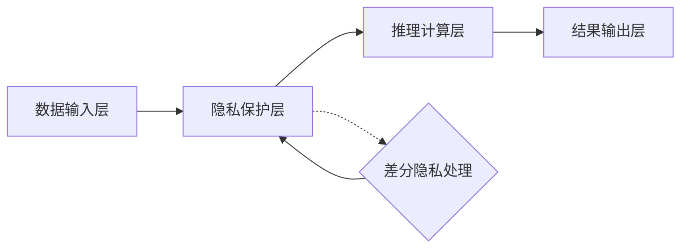

# 安全AI推理框架中差分隐私的实现策略研究

> 关键词：安全AI推理框架、差分隐私、实现策略、数据隐私保护、机器学习

> 摘要：本文聚焦于安全AI推理框架中差分隐私的实现策略。首先介绍了研究的背景、目的、预期读者和文档结构等内容。接着详细阐述了差分隐私和安全AI推理框架的核心概念及其联系，并给出了相应的示意图和流程图。然后深入讲解了核心算法原理，通过Python代码进行具体实现和说明。同时，对涉及的数学模型和公式进行了详细推导和举例。在项目实战部分，给出了开发环境搭建的步骤、源代码实现和代码解读。之后探讨了差分隐私在安全AI推理框架中的实际应用场景。还推荐了相关的学习资源、开发工具框架和论文著作。最后总结了未来发展趋势与挑战，并提供了常见问题解答和扩展阅读参考资料，旨在为安全AI推理框架中差分隐私的研究和应用提供全面且深入的指导。

## 1. 背景介绍 
### 1.1 目的和范围
在当今数字化时代，人工智能技术得到了广泛的应用，尤其是在各种推理任务中。然而，随着数据驱动的AI发展，数据隐私问题日益凸显。安全AI推理框架旨在确保在进行AI推理过程中数据的安全性和隐私性。差分隐私作为一种强大的隐私保护技术，可以在不泄露敏感信息的前提下，让数据在一定程度上可用于分析和推理。本研究的目的在于深入探讨在安全AI推理框架中如何有效地实现差分隐私，以平衡数据利用和隐私保护之间的关系。研究范围涵盖了差分隐私的基本原理、相关算法在安全AI推理框架中的应用，以及实际项目中的实现和优化策略。

### 1.2 预期读者
本文预期读者包括从事人工智能、数据隐私保护领域的研究人员，希望深入了解差分隐私技术在安全AI推理框架中应用的开发者，以及对数据安全和隐私有兴趣的技术爱好者。同时，对于企业中负责AI项目安全和隐私管理的决策者也具有一定的参考价值。

### 1.3 文档结构概述
本文将按照以下结构进行组织：首先介绍相关的核心概念，包括差分隐私和安全AI推理框架，以及它们之间的联系，并通过示意图和流程图进行直观展示；接着详细讲解实现差分隐私的核心算法原理，并给出Python代码实现；然后介绍涉及的数学模型和公式，并举例说明；在项目实战部分，提供开发环境搭建步骤、源代码实现和代码解读；之后探讨差分隐私在实际场景中的应用；推荐相关的学习资源、开发工具框架和论文著作；最后总结未来发展趋势与挑战，提供常见问题解答和扩展阅读参考资料。

### 1.4 术语表
#### 1.4.1 核心术语定义
- **差分隐私（Differential Privacy）**：一种数学定义的隐私保护模型，通过向数据中添加噪声来确保在数据集上进行查询时，任何单个个体的数据记录的存在与否不会对查询结果产生显著影响，从而保护个体数据隐私。
- **安全AI推理框架（Secure AI Inference Framework）**：一种用于执行AI推理任务的系统架构，旨在确保推理过程中数据的安全性和隐私性，防止数据泄露和恶意攻击。
- **噪声注入（Noise Injection）**：在差分隐私中，为了实现隐私保护，向原始数据或查询结果中添加特定分布的噪声的过程。
- **隐私预算（Privacy Budget）**：差分隐私中的一个重要概念，用于衡量在一系列查询操作中允许的最大隐私损失。

#### 1.4.2 相关概念解释
- **敏感度（Sensitivity）**：衡量数据集中单个记录的变化对查询结果影响程度的指标。在差分隐私中，敏感度是计算噪声量的重要参数。
- **拉普拉斯机制（Laplace Mechanism）**：一种常用的差分隐私机制，通过向查询结果中添加拉普拉斯分布的噪声来实现隐私保护。
- **高斯机制（Gaussian Mechanism）**：另一种差分隐私机制，使用高斯分布的噪声进行隐私保护，适用于一些对噪声分布有特定要求的场景。

#### 1.4.3 缩略词列表
- **DP**：Differential Privacy（差分隐私）
- **AI**：Artificial Intelligence（人工智能）
- **ML**：Machine Learning（机器学习）

## 2. 核心概念与联系 
### 2.1 差分隐私原理
差分隐私的核心思想是在进行数据查询时，通过添加噪声来模糊个体数据的影响，使得攻击者无法从查询结果中推断出特定个体的数据信息。其数学定义如下：

设 $\mathcal{D}$ 和 $\mathcal{D}'$ 是两个相邻的数据集，它们仅在一个个体记录上不同。一个随机算法 $\mathcal{M}$ 满足 $\epsilon$-差分隐私，如果对于任意的输出集合 $S \subseteq Range(\mathcal{M})$，有：

$$Pr[\mathcal{M}(\mathcal{D}) \in S] \leq e^{\epsilon} \cdot Pr[\mathcal{M}(\mathcal{D}') \in S]$$

其中，$\epsilon$ 是隐私预算，它控制了隐私保护的程度。$\epsilon$ 值越小，隐私保护程度越高，但数据的可用性可能会降低；反之，$\epsilon$ 值越大，数据的可用性越高，但隐私保护程度越低。

### 2.2 安全AI推理框架架构
安全AI推理框架通常包含数据输入层、隐私保护层、推理计算层和结果输出层。数据输入层负责接收原始数据，隐私保护层对输入数据进行差分隐私处理，推理计算层使用经过处理的数据进行AI推理，结果输出层将推理结果返回给用户。

以下是安全AI推理框架的文本示意图：

```plaintext
+----------------+
| 数据输入层     |
| （原始数据）   |
+----------------+
       |
       v
+----------------+
| 隐私保护层     |
| （差分隐私处理）|
+----------------+
       |
       v
+----------------+
| 推理计算层     |
| （AI推理）     |
+----------------+
       |
       v
+----------------+
| 结果输出层     |
| （推理结果）   |
+----------------+
```

### 2.3 差分隐私与安全AI推理框架的联系
差分隐私为安全AI推理框架提供了一种有效的隐私保护手段。在安全AI推理框架中，通过在隐私保护层应用差分隐私技术，可以在不泄露敏感信息的前提下，让推理计算层能够使用经过处理的数据进行准确的推理。同时，差分隐私的隐私预算机制可以帮助框架管理者控制隐私保护的程度和数据的可用性，以满足不同应用场景的需求。

### 2.4 Mermaid流程图


## 3. 核心算法原理 & 具体操作步骤 
### 3.1 拉普拉斯机制原理
拉普拉斯机制是一种常用的差分隐私机制，其基本思想是向查询结果中添加拉普拉斯分布的噪声。设查询函数为 $f:\mathcal{D} \to \mathbb{R}^d$，其敏感度为 $\Delta f$，隐私预算为 $\epsilon$。拉普拉斯机制 $\mathcal{M}_{Lap}$ 的定义如下：

$$\mathcal{M}_{Lap}(f(\mathcal{D})) = f(\mathcal{D}) + (Y_1, Y_2, \cdots, Y_d)$$

其中，$Y_i \sim Lap(0, \frac{\Delta f}{\epsilon})$ 是独立同分布的拉普拉斯随机变量，其概率密度函数为：

$$f_{Lap}(y; \mu, b) = \frac{1}{2b} \exp\left(-\frac{|y - \mu|}{b}\right)$$

### 3.2 Python代码实现拉普拉斯机制
```python
import numpy as np

def laplace_mechanism(query_result, sensitivity, epsilon):
    """
    实现拉普拉斯机制
    :param query_result: 查询结果
    :param sensitivity: 查询函数的敏感度
    :param epsilon: 隐私预算
    :return: 添加噪声后的查询结果
    """
    noise = np.random.laplace(0, sensitivity / epsilon)
    return query_result + noise

# 示例使用
query_result = 10.0
sensitivity = 1.0
epsilon = 0.1

noisy_result = laplace_mechanism(query_result, sensitivity, epsilon)
print(f"原始查询结果: {query_result}")
print(f"添加噪声后的查询结果: {noisy_result}")
```

### 3.3 具体操作步骤
1. **确定查询函数**：明确要在数据集上执行的查询函数 $f$。
2. **计算敏感度**：计算查询函数 $f$ 的敏感度 $\Delta f$。
3. **设置隐私预算**：根据实际需求设置隐私预算 $\epsilon$。
4. **添加噪声**：使用拉普拉斯机制向查询结果 $f(\mathcal{D})$ 中添加噪声，得到差分隐私保护后的结果 $\mathcal{M}_{Lap}(f(\mathcal{D}))$。

## 4. 数学模型和公式 & 详细讲解 & 举例说明 
### 4.1 差分隐私的数学模型
差分隐私的数学模型主要基于上述的 $\epsilon$-差分隐私定义。该定义通过概率不等式来保证相邻数据集上查询结果的相似性，从而保护个体数据隐私。

### 4.2 拉普拉斯机制的数学公式
拉普拉斯机制的核心公式为 $\mathcal{M}_{Lap}(f(\mathcal{D})) = f(\mathcal{D}) + (Y_1, Y_2, \cdots, Y_d)$，其中 $Y_i \sim Lap(0, \frac{\Delta f}{\epsilon})$。

下面详细讲解拉普拉斯分布的参数和性质：
- **均值**：拉普拉斯分布 $Lap(\mu, b)$ 的均值为 $\mu$。在拉普拉斯机制中，$\mu = 0$，表示噪声的期望为零，不会对查询结果产生系统性的偏差。
- **方差**：拉普拉斯分布的方差为 $2b^2$。在拉普拉斯机制中，$b = \frac{\Delta f}{\epsilon}$，因此噪声的方差与敏感度 $\Delta f$ 的平方成正比，与隐私预算 $\epsilon$ 的平方成反比。这意味着敏感度越高或隐私预算越低，噪声的方差越大，隐私保护程度越高，但数据的可用性可能会降低。

### 4.3 举例说明
假设我们有一个数据集 $\mathcal{D}$，其中包含用户的年龄信息。我们想要查询数据集中用户的平均年龄。设查询函数 $f(\mathcal{D})$ 为计算平均年龄，敏感度 $\Delta f = 1$（因为单个用户年龄的变化最多会使平均年龄变化 1），隐私预算 $\epsilon = 0.1$。

假设原始查询结果 $f(\mathcal{D}) = 30$。使用拉普拉斯机制添加噪声：

```python
import numpy as np

query_result = 30.0
sensitivity = 1.0
epsilon = 0.1

noise = np.random.laplace(0, sensitivity / epsilon)
noisy_result = query_result + noise

print(f"原始平均年龄: {query_result}")
print(f"添加噪声后的平均年龄: {noisy_result}")
```

在这个例子中，我们通过拉普拉斯机制向平均年龄查询结果中添加了噪声，使得攻击者无法准确推断出数据集中每个用户的具体年龄，从而保护了用户的隐私。

## 5. 项目实战：代码实际案例和详细解释说明 
### 5.1  开发环境搭建
#### 5.1.1 安装Python
首先，确保你已经安装了Python 3.x 版本。你可以从Python官方网站（https://www.python.org/downloads/）下载并安装适合你操作系统的Python版本。

#### 5.1.2 安装必要的库
我们需要安装一些必要的Python库，如NumPy和Scikit-learn。可以使用以下命令进行安装：

```bash
pip install numpy scikit-learn
```

### 5.2  源代码详细实现和代码解读
以下是一个使用差分隐私保护的简单机器学习推理项目的代码示例：

```python
import numpy as np
from sklearn.datasets import load_iris
from sklearn.model_selection import train_test_split
from sklearn.linear_model import LogisticRegression

# 加载鸢尾花数据集
iris = load_iris()
X = iris.data
y = iris.target

# 划分训练集和测试集
X_train, X_test, y_train, y_test = train_test_split(X, y, test_size=0.2, random_state=42)

# 定义拉普拉斯机制函数
def laplace_mechanism(query_result, sensitivity, epsilon):
    noise = np.random.laplace(0, sensitivity / epsilon)
    return query_result + noise

# 训练逻辑回归模型
model = LogisticRegression()
model.fit(X_train, y_train)

# 进行推理
predictions = model.predict(X_test)

# 假设我们要查询某个特征的平均值，以第一个特征为例
feature_index = 0
original_mean = np.mean(X_test[:, feature_index])

# 计算敏感度（这里简单假设敏感度为1）
sensitivity = 1.0
epsilon = 0.1

# 添加差分隐私保护
noisy_mean = laplace_mechanism(original_mean, sensitivity, epsilon)

print(f"原始特征平均值: {original_mean}")
print(f"添加噪声后的特征平均值: {noisy_mean}")
```

### 5.3  代码解读与分析
1. **数据加载和预处理**：使用 `sklearn.datasets.load_iris` 加载鸢尾花数据集，并使用 `train_test_split` 函数将数据集划分为训练集和测试集。
2. **模型训练**：使用 `LogisticRegression` 模型进行训练。
3. **推理过程**：使用训练好的模型对测试集进行推理，得到预测结果。
4. **差分隐私处理**：选择一个特征，计算其原始平均值。然后使用拉普拉斯机制向平均值中添加噪声，得到差分隐私保护后的结果。

通过这种方式，我们在机器学习推理过程中应用了差分隐私技术，保护了数据的隐私性。

## 6. 实际应用场景 
### 6.1 医疗数据推理
在医疗领域，患者的医疗数据包含大量敏感信息，如疾病诊断、治疗记录等。安全AI推理框架结合差分隐私技术可以在不泄露患者隐私的前提下，对医疗数据进行分析和推理。例如，医院可以使用差分隐私保护的AI模型来预测疾病的流行趋势，同时保护患者的个人信息不被泄露。

### 6.2 金融数据推理
金融机构拥有大量客户的金融数据，如账户余额、交易记录等。这些数据的隐私保护至关重要。通过在安全AI推理框架中应用差分隐私技术，金融机构可以进行风险评估、欺诈检测等推理任务，同时确保客户数据的安全性。

### 6.3 智能交通系统
智能交通系统需要收集和分析大量的交通数据，如车辆行驶轨迹、交通流量等。差分隐私技术可以在保护车主隐私的前提下，对这些数据进行处理和推理，以优化交通管理、提高交通效率。

## 7. 工具和资源推荐
### 7.1 学习资源推荐
#### 7.1.1 书籍推荐
- 《Differential Privacy: From Theory to Practice》：这本书详细介绍了差分隐私的理论和实践，包括差分隐私的基本概念、算法和应用案例。
- 《Artificial Intelligence: A Modern Approach》：经典的人工智能教材，涵盖了人工智能的各个方面，包括机器学习和隐私保护。

#### 7.1.2 在线课程
- Coursera上的“Differential Privacy”课程：由知名学者授课，系统地介绍了差分隐私的理论和实践。
- edX上的“Artificial Intelligence”课程：提供了全面的人工智能知识体系，包括隐私保护相关内容。

#### 7.1.3 技术博客和网站
- Differential Privacy Blog（https://privacytools.seas.harvard.edu/blog）：该博客提供了差分隐私领域的最新研究成果和技术动态。
- Towards Data Science（https://towardsdatascience.com/）：一个专注于数据科学和人工智能的技术博客，有很多关于差分隐私和隐私保护的文章。

### 7.2 开发工具框架推荐
#### 7.2.1 IDE和编辑器
- PyCharm：一款功能强大的Python集成开发环境，提供了代码编辑、调试、版本控制等功能，适合开发差分隐私相关的Python项目。
- Jupyter Notebook：一个交互式的开发环境，适合进行数据分析和模型实验，方便展示和分享代码和结果。

#### 7.2.2 调试和性能分析工具
- PDB：Python自带的调试工具，可以帮助开发者定位和解决代码中的问题。
- cProfile：Python的性能分析工具，可以分析代码的执行时间和函数调用情况，帮助优化代码性能。

#### 7.2.3 相关框架和库
- OpenDP（https://github.com/opendifferentialprivacy/opendp）：一个开源的差分隐私库，提供了多种差分隐私机制和工具，方便开发者在项目中应用差分隐私技术。
- TensorFlow Privacy（https://github.com/tensorflow/privacy）：TensorFlow的一个扩展库，用于在深度学习模型中实现差分隐私保护。

### 7.3 相关论文著作推荐
#### 7.3.1 经典论文
- “Differential Privacy” by Cynthia Dwork：差分隐私领域的经典论文，首次提出了差分隐私的概念和基本理论。
- “The Algorithmic Foundations of Differential Privacy” by Cynthia Dwork and Aaron Roth：系统地介绍了差分隐私的算法基础和理论框架。

#### 7.3.2 最新研究成果
- 关注ACM SIGKDD、NeurIPS、ICML等顶级学术会议上关于差分隐私和隐私保护的最新研究论文。

#### 7.3.3 应用案例分析
- 可以参考一些实际应用差分隐私技术的案例研究，如医疗、金融等领域的相关论文和报告，了解差分隐私在实际场景中的应用效果和挑战。

## 8. 总结：未来发展趋势与挑战
### 8.1 未来发展趋势
- **多领域融合**：差分隐私技术将与其他领域的技术，如区块链、联邦学习等进行更深入的融合，以提供更强大的隐私保护解决方案。
- **深度学习中的应用拓展**：随着深度学习在各个领域的广泛应用，差分隐私技术将在深度学习模型的训练和推理过程中得到更广泛的应用，以保护数据隐私。
- **法规和标准的完善**：随着数据隐私问题的日益受到关注，相关的法规和标准将不断完善，推动差分隐私技术的规范化和普及化。

### 8.2 挑战
- **隐私与效用的平衡**：如何在保证数据隐私的前提下，尽可能地提高数据的可用性和模型的性能，仍然是一个具有挑战性的问题。
- **计算效率**：差分隐私技术通常需要添加噪声和进行复杂的计算，这会增加计算成本和时间开销，如何提高计算效率是一个亟待解决的问题。
- **对抗攻击**：差分隐私技术可能会受到对抗攻击的威胁，攻击者可能会通过分析噪声模式来推断出原始数据信息，如何应对对抗攻击是未来研究的一个重要方向。

## 9. 附录：常见问题与解答
### 9.1 什么是差分隐私？
差分隐私是一种数学定义的隐私保护模型，通过向数据中添加噪声来确保在数据集上进行查询时，任何单个个体的数据记录的存在与否不会对查询结果产生显著影响，从而保护个体数据隐私。

### 9.2 差分隐私的隐私预算有什么作用？
隐私预算 $\epsilon$ 控制了差分隐私保护的程度。$\epsilon$ 值越小，隐私保护程度越高，但数据的可用性可能会降低；反之，$\epsilon$ 值越大，数据的可用性越高，但隐私保护程度越低。

### 9.3 拉普拉斯机制和高斯机制有什么区别？
拉普拉斯机制使用拉普拉斯分布的噪声进行隐私保护，适用于大多数情况。高斯机制使用高斯分布的噪声，适用于一些对噪声分布有特定要求的场景，如需要保证噪声的方差有限。

### 9.4 如何计算查询函数的敏感度？
敏感度的计算取决于查询函数的具体形式。一般来说，需要分析单个记录的变化对查询结果的最大影响。对于一些简单的查询函数，如求和、平均值等，可以通过数学推导来计算敏感度；对于复杂的查询函数，可能需要通过实验和分析来估计敏感度。

## 10. 扩展阅读 & 参考资料
- Dwork, C. (2006). Differential privacy. In Automata, Languages and Programming (pp. 1-12). Springer Berlin Heidelberg.
- Dwork, C., & Roth, A. (2014). The algorithmic foundations of differential privacy. Foundations and Trends® in Theoretical Computer Science, 9(3-4), 211-407.
- Abadi, M., Chu, A., Goodfellow, I., McMahan, H. B., Mironov, I., Talwar, K., & Zhang, L. (2016). Deep learning with differential privacy. In Proceedings of the 2016 ACM SIGSAC conference on computer and communications security (pp. 308-318).
- OpenDP官方文档（https://docs.opendp.org/en/stable/）
- TensorFlow Privacy官方文档（https://www.tensorflow.org/responsible_ai/privacy/overview）

作者：AI天才研究院/AI Genius Institute & 禅与计算机程序设计艺术 /Zen And The Art of Computer Programming