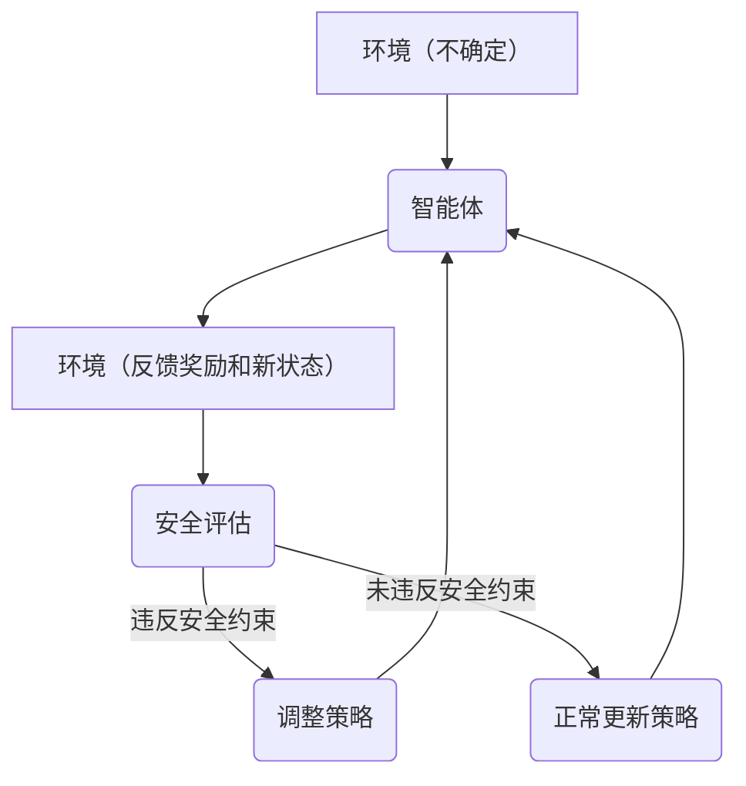

# 安全强化学习:在不确定环境中的风险管理

> 关键词：安全强化学习、不确定环境、风险管理、马尔可夫决策过程、策略优化

> 摘要：本文围绕安全强化学习在不确定环境中的风险管理展开深入探讨。首先介绍安全强化学习的背景知识，包括其目的、适用读者和文档结构等。接着阐述核心概念，剖析安全强化学习与传统强化学习的联系与区别。详细讲解核心算法原理，通过Python代码示例展示具体操作步骤。深入探讨相关数学模型和公式，并辅以实例说明。通过项目实战，展示安全强化学习在实际场景中的代码实现和分析。介绍安全强化学习的实际应用场景，推荐相关学习资源、开发工具和论文著作。最后总结安全强化学习的未来发展趋势与挑战，为读者全面呈现安全强化学习在不确定环境下进行风险管理的理论与实践内容。

## 1. 背景介绍 
### 1.1 目的和范围
安全强化学习旨在解决传统强化学习在实际应用中面临的安全性问题，特别是在不确定环境下如何进行有效的风险管理。传统强化学习主要关注最大化累积奖励，但在许多现实场景中，如自动驾驶、机器人控制、医疗决策等，仅仅追求奖励最大化可能会导致不可接受的风险行为，例如自动驾驶车辆发生碰撞、机器人损坏设备等。安全强化学习的目的就是在保证系统安全性的前提下，尽可能地优化性能。

本文的范围涵盖安全强化学习的基本概念、核心算法、数学模型、项目实战、实际应用场景等多个方面，旨在为读者提供一个全面深入的安全强化学习知识体系，帮助读者理解如何在不确定环境中运用安全强化学习进行风险管理。

### 1.2 预期读者
本文预期读者包括但不限于人工智能领域的研究人员、工程师、学生，以及对安全强化学习和风险管理感兴趣的专业人士。对于有一定机器学习和强化学习基础的读者，本文可以帮助他们进一步深入理解安全强化学习的原理和应用；对于初学者，本文也会从基础概念开始逐步引导，帮助他们建立起对安全强化学习的认识。

### 1.3 文档结构概述
本文将按照以下结构进行组织：首先介绍安全强化学习的背景知识，包括目的、读者群体和文档结构等；接着阐述安全强化学习的核心概念及其与相关概念的联系；详细讲解核心算法原理，并通过Python代码展示具体操作步骤；深入探讨相关数学模型和公式，并举例说明；通过项目实战展示安全强化学习在实际场景中的代码实现和分析；介绍安全强化学习的实际应用场景；推荐相关学习资源、开发工具和论文著作；最后总结安全强化学习的未来发展趋势与挑战，并提供常见问题解答和参考资料。

### 1.4 术语表
#### 1.4.1 核心术语定义
- **安全强化学习（Safe Reinforcement Learning）**：在强化学习的基础上，引入安全性约束，确保智能体在学习和决策过程中不会违反安全条件，从而在不确定环境中实现风险管理的技术。
- **不确定环境（Uncertain Environment）**：环境的状态转移、奖励函数等存在不确定性的环境，智能体无法准确预知环境的变化和反馈。
- **风险管理（Risk Management）**：识别、评估和应对风险的过程，在安全强化学习中，通过设计合适的策略和约束条件来降低智能体在不确定环境中面临的风险。
- **马尔可夫决策过程（Markov Decision Process，MDP）**：一种用于描述智能体与环境交互的数学模型，由状态集合、动作集合、状态转移概率、奖励函数和折扣因子等要素组成。
- **策略（Policy）**：智能体在每个状态下选择动作的规则，通常表示为一个概率分布。

#### 1.4.2 相关概念解释
- **传统强化学习**：智能体通过与环境进行交互，根据环境反馈的奖励信号来学习最优策略，以最大化累积奖励。但传统强化学习往往没有考虑到安全性问题。
- **安全性约束**：在安全强化学习中，为了保证智能体的行为符合安全要求而设定的约束条件，例如避免进入危险状态、限制动作的范围等。
- **探索与利用（Exploration and Exploitation）**：在强化学习中，智能体需要在探索新的动作和利用已有的经验之间进行平衡。在安全强化学习中，探索过程需要更加谨慎，以避免违反安全性约束。

#### 1.4.3 缩略词列表
- **MDP**：Markov Decision Process（马尔可夫决策过程）
- **RL**：Reinforcement Learning（强化学习）
- **SRL**：Safe Reinforcement Learning（安全强化学习）

## 2. 核心概念与联系 
安全强化学习是在传统强化学习的基础上发展而来的，旨在解决传统强化学习在实际应用中面临的安全性问题。传统强化学习主要关注如何最大化累积奖励，而安全强化学习则在追求奖励的同时，需要满足一系列的安全性约束。

### 核心概念原理
安全强化学习的核心原理是在马尔可夫决策过程（MDP）的框架下，引入安全性约束来限制智能体的行为。一个标准的MDP可以表示为一个五元组 $(S, A, P, R, \gamma)$，其中：
- $S$ 是状态集合，表示环境的所有可能状态。
- $A$ 是动作集合，表示智能体可以采取的所有可能动作。
- $P: S \times A \times S \to [0, 1]$ 是状态转移概率函数，表示在状态 $s$ 采取动作 $a$ 后转移到状态 $s'$ 的概率。
- $R: S \times A \to \mathbb{R}$ 是奖励函数，表示在状态 $s$ 采取动作 $a$ 后获得的即时奖励。
- $\gamma \in [0, 1]$ 是折扣因子，用于权衡未来奖励的重要性。

在安全强化学习中，除了上述要素外，还引入了安全约束集合 $\mathcal{C}$。安全约束可以是状态约束、动作约束或轨迹约束等，例如，规定智能体不能进入某些危险状态，或者限制动作的取值范围。智能体的目标是在满足安全约束的前提下，最大化累积奖励。

### 架构的文本示意图
```plaintext
环境（不确定）
    |
    | 状态信息
    v
智能体
    |
    | 动作选择
    v
环境（反馈奖励和新状态）
    |
    | 安全评估（检查是否违反安全约束）
    v
智能体（更新策略，考虑安全约束）
```

### Mermaid 流程图


## 3. 核心算法原理 & 具体操作步骤 
### 核心算法原理
安全强化学习有多种算法，这里以基于约束优化的安全强化学习算法为例进行讲解。该算法的核心思想是将安全约束作为优化问题的约束条件，通过求解约束优化问题来得到满足安全要求的最优策略。

假设我们有一个策略 $\pi(a|s)$ 表示在状态 $s$ 下选择动作 $a$ 的概率。智能体的目标是最大化累积奖励 $J(\pi) = \mathbb{E}_{\tau \sim \pi} \left[ \sum_{t=0}^{\infty} \gamma^t r_t \right]$，其中 $\tau$ 是一个轨迹，$r_t$ 是在时刻 $t$ 获得的奖励。同时，需要满足一系列安全约束 $c_i(\pi) \leq 0$，$i = 1, 2, \cdots, m$。

可以将这个问题转化为一个约束优化问题：
$$
\begin{aligned}
\max_{\pi} &\quad J(\pi) \\
\text{s.t.} &\quad c_i(\pi) \leq 0, \quad i = 1, 2, \cdots, m
\end{aligned}
$$

### 具体操作步骤
以下是基于约束优化的安全强化学习算法的具体操作步骤：
1. **初始化**：初始化策略 $\pi$、安全约束集合 $\mathcal{C}$、学习率 $\alpha$ 等参数。
2. **采样轨迹**：根据当前策略 $\pi$ 与环境进行交互，采样得到一组轨迹 $\{\tau_1, \tau_2, \cdots, \tau_N\}$。
3. **计算奖励和约束值**：对于每个轨迹 $\tau_j$，计算累积奖励 $R(\tau_j)$ 和约束违反值 $c_i(\tau_j)$，$i = 1, 2, \cdots, m$。
4. **更新策略**：使用约束优化算法（如拉格朗日乘子法）更新策略 $\pi$，使得在满足安全约束的前提下，累积奖励最大化。
5. **重复步骤2 - 4**：直到策略收敛或达到最大迭代次数。

### Python源代码实现
```python
import numpy as np

# 定义环境类
class Environment:
    def __init__(self):
        self.state_space = np.array([0, 1, 2, 3, 4])
        self.action_space = np.array([0, 1])
        self.state = np.random.choice(self.state_space)
        self.danger_states = [3]  # 危险状态

    def step(self, action):
        # 简单的状态转移规则
        if action == 0:
            self.state = max(self.state - 1, 0)
        else:
            self.state = min(self.state + 1, 4)

        # 奖励函数
        if self.state in self.danger_states:
            reward = -10
        else:
            reward = 1

        # 检查是否违反安全约束
        if self.state in self.danger_states:
            constraint_violation = 1
        else:
            constraint_violation = 0

        return self.state, reward, constraint_violation

# 定义策略类
class Policy:
    def __init__(self, state_space, action_space):
        self.state_space = state_space
        self.action_space = action_space
        self.theta = np.random.rand(len(state_space), len(action_space))

    def get_action_probs(self, state):
        logits = self.theta[state]
        probs = np.exp(logits) / np.sum(np.exp(logits))
        return probs

    def sample_action(self, state):
        probs = self.get_action_probs(state)
        action = np.random.choice(self.action_space, p=probs)
        return action

    def update_theta(self, gradient, learning_rate):
        self.theta += learning_rate * gradient

# 基于约束优化的安全强化学习算法
def safe_rl(environment, policy, num_episodes, learning_rate, constraint_threshold):
    for episode in range(num_episodes):
        state = environment.state
        episode_reward = 0
        episode_constraint_violation = 0
        trajectory = []

        while True:
            action = policy.sample_action(state)
            next_state, reward, constraint_violation = environment.step(action)
            trajectory.append((state, action, reward, constraint_violation))
            episode_reward += reward
            episode_constraint_violation += constraint_violation
            state = next_state

            if episode_constraint_violation > constraint_threshold:
                break

        # 计算梯度
        gradient = np.zeros_like(policy.theta)
        for state, action, reward, constraint_violation in trajectory:
            probs = policy.get_action_probs(state)
            one_hot = np.zeros_like(probs)
            one_hot[action] = 1
            gradient[state] += (one_hot - probs) * reward

        # 更新策略
        policy.update_theta(gradient, learning_rate)

        if episode % 10 == 0:
            print(f"Episode {episode}: Reward = {episode_reward}, Constraint Violation = {episode_constraint_violation}")

    return policy

# 主程序
if __name__ == "__main__":
    environment = Environment()
    policy = Policy(environment.state_space, environment.action_space)
    num_episodes = 100
    learning_rate = 0.01
    constraint_threshold = 2

    safe_policy = safe_rl(environment, policy, num_episodes, learning_rate, constraint_threshold)
```

## 4. 数学模型和公式 & 详细讲解 & 举例说明 
### 马尔可夫决策过程（MDP）
马尔可夫决策过程（MDP）是安全强化学习的基础数学模型，它可以描述智能体与环境的交互过程。一个MDP可以表示为一个五元组 $(S, A, P, R, \gamma)$，其中：
- $S$ 是状态集合，表示环境的所有可能状态。
- $A$ 是动作集合，表示智能体可以采取的所有可能动作。
- $P: S \times A \times S \to [0, 1]$ 是状态转移概率函数，表示在状态 $s$ 采取动作 $a$ 后转移到状态 $s'$ 的概率，即 $P(s'|s, a) = \Pr(S_{t+1} = s'|S_t = s, A_t = a)$。
- $R: S \times A \to \mathbb{R}$ 是奖励函数，表示在状态 $s$ 采取动作 $a$ 后获得的即时奖励，即 $R(s, a) = \mathbb{E}[R_{t+1}|S_t = s, A_t = a]$。
- $\gamma \in [0, 1]$ 是折扣因子，用于权衡未来奖励的重要性。

智能体的策略 $\pi(a|s)$ 表示在状态 $s$ 下选择动作 $a$ 的概率。在MDP中，智能体的目标是最大化累积折扣奖励 $J(\pi) = \mathbb{E}_{\tau \sim \pi} \left[ \sum_{t=0}^{\infty} \gamma^t r_t \right]$，其中 $\tau$ 是一个轨迹，$r_t$ 是在时刻 $t$ 获得的奖励。

### 价值函数
在MDP中，有两个重要的价值函数：状态价值函数 $V^{\pi}(s)$ 和动作价值函数 $Q^{\pi}(s, a)$。
- 状态价值函数 $V^{\pi}(s)$ 表示在策略 $\pi$ 下，从状态 $s$ 开始的期望累积折扣奖励，即：
$$
V^{\pi}(s) = \mathbb{E}_{\tau \sim \pi} \left[ \sum_{t=0}^{\infty} \gamma^t r_t | S_0 = s \right]
$$
- 动作价值函数 $Q^{\pi}(s, a)$ 表示在策略 $\pi$ 下，从状态 $s$ 采取动作 $a$ 后，再继续遵循策略 $\pi$ 的期望累积折扣奖励，即：
$$
Q^{\pi}(s, a) = \mathbb{E}_{\tau \sim \pi} \left[ \sum_{t=0}^{\infty} \gamma^t r_t | S_0 = s, A_0 = a \right]
$$

价值函数满足贝尔曼方程：
- 状态价值函数的贝尔曼方程：
$$
V^{\pi}(s) = \sum_{a \in A} \pi(a|s) \sum_{s' \in S} P(s'|s, a) [R(s, a) + \gamma V^{\pi}(s')]
$$
- 动作价值函数的贝尔曼方程：
$$
Q^{\pi}(s, a) = \sum_{s' \in S} P(s'|s, a) [R(s, a) + \gamma \sum_{a' \in A} \pi(a'|s') Q^{\pi}(s', a')]
$$

### 安全约束优化
在安全强化学习中，需要在满足安全约束的前提下最大化累积奖励。假设我们有一组安全约束 $c_i(\pi) \leq 0$，$i = 1, 2, \cdots, m$，可以使用拉格朗日乘子法将约束优化问题转化为无约束优化问题。

拉格朗日函数定义为：
$$
\mathcal{L}(\pi, \lambda) = J(\pi) - \sum_{i=1}^{m} \lambda_i c_i(\pi)
$$
其中 $\lambda_i \geq 0$ 是拉格朗日乘子。

对拉格朗日函数求关于 $\pi$ 和 $\lambda$ 的梯度，并令梯度为零，可以得到最优策略和拉格朗日乘子的更新规则。

### 举例说明
考虑一个简单的网格世界环境，智能体在一个 $3 \times 3$ 的网格中移动，目标是从起点 $(0, 0)$ 到达终点 $(2, 2)$。网格中存在一些危险区域，智能体进入危险区域会受到很大的惩罚。

状态集合 $S$ 可以表示为所有网格的坐标 $(x, y)$，动作集合 $A$ 可以表示为上下左右四个方向的移动。状态转移概率 $P$ 表示智能体在某个状态下采取某个动作后转移到下一个状态的概率，例如，如果智能体在 $(x, y)$ 位置向右移动，那么转移到 $(x + 1, y)$ 位置的概率为 1（假设没有障碍物）。

奖励函数 $R$ 可以定义为：如果智能体到达终点，奖励为 10；如果智能体进入危险区域，奖励为 -10；其他情况下奖励为 -1。

安全约束可以定义为智能体不能进入危险区域，即 $c(\pi) = \text{进入危险区域的次数} \leq 0$。

通过求解约束优化问题，可以得到一个满足安全约束的最优策略，使得智能体能够在避免进入危险区域的前提下，尽快