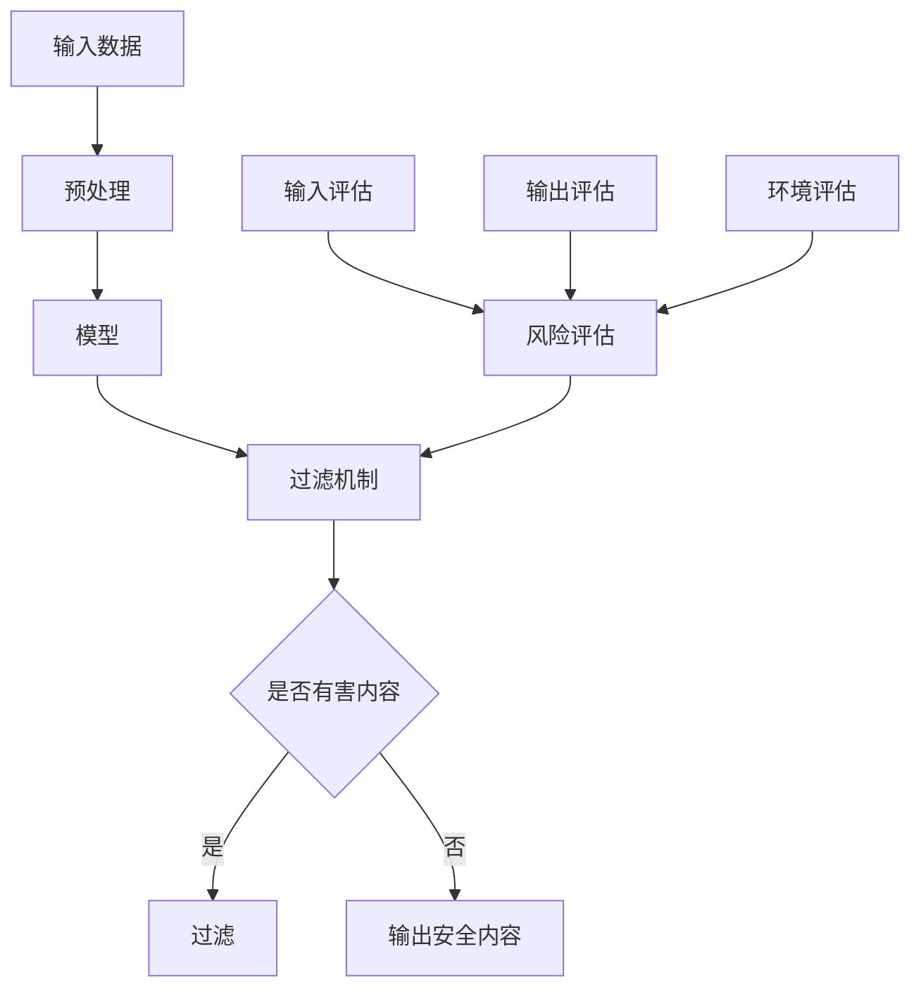

# 安全性考虑：防止AI Agent产生有害内容

> 关键词：AI Agent、有害内容、安全性、过滤机制、风险评估

> 摘要：本文聚焦于防止AI Agent产生有害内容这一关键问题。随着AI技术的飞速发展，AI Agent在众多领域得到广泛应用，但产生有害内容的风险也随之而来。文章深入探讨了AI Agent产生有害内容的背景和潜在危害，详细阐述了相关核心概念、算法原理、数学模型，通过项目实战展示具体实现方法，分析实际应用场景，推荐了学习和开发所需的工具与资源，最后总结了未来发展趋势与挑战，并对常见问题进行了解答。旨在为保障AI Agent安全、可靠地运行提供全面的技术指导和理论支持。

## 1. 背景介绍 
### 1.1 目的和范围
本文章的主要目的是深入研究如何防止AI Agent产生有害内容。随着人工智能技术的不断进步，AI Agent被广泛应用于聊天机器人、内容生成、智能客服等多个领域。然而，AI Agent可能会产生包含偏见、虚假信息、恶意攻击等有害内容，这不仅会对用户造成伤害，还可能影响社会稳定和公共安全。因此，本文将详细探讨防止AI Agent产生有害内容的技术手段和方法，范围涵盖从核心概念的理解到实际项目的实现，以及未来发展趋势的展望。

### 1.2 预期读者
本文预期读者包括人工智能领域的研究人员、开发者、软件架构师，以及对AI Agent安全性感兴趣的技术爱好者。研究人员可以从本文中获取关于防止有害内容产生的最新研究思路和方法；开发者可以学习到具体的实现技术和代码示例；软件架构师可以借鉴本文的架构设计和风险评估方法；技术爱好者可以通过本文了解AI Agent安全性的重要性和相关技术原理。

### 1.3 文档结构概述
本文将按照以下结构进行阐述：首先介绍相关背景知识，包括目的、预期读者和文档结构；接着讲解核心概念与联系，通过文本示意图和Mermaid流程图展示其原理和架构；然后详细说明核心算法原理和具体操作步骤，并使用Python源代码进行阐述；之后介绍数学模型和公式，并举例说明；再通过项目实战展示代码实际案例和详细解释；分析实际应用场景；推荐学习和开发所需的工具和资源；最后总结未来发展趋势与挑战，解答常见问题，并提供扩展阅读和参考资料。

### 1.4 术语表
#### 1.4.1 核心术语定义
- **AI Agent**：是一种能够感知环境、做出决策并采取行动以实现特定目标的人工智能实体。它可以是软件程序、机器人等不同形式。
- **有害内容**：指包含偏见、歧视、虚假信息、恶意攻击、色情、暴力等可能对用户、社会造成负面影响的内容。
- **过滤机制**：用于检测和阻止AI Agent产生有害内容的技术手段，通常包括规则过滤、机器学习过滤等。
- **风险评估**：对AI Agent产生有害内容的可能性和危害程度进行评估的过程，以便采取相应的措施进行防范。

#### 1.4.2 相关概念解释
- **自然语言处理（NLP）**：是AI Agent处理文本信息的基础技术，包括文本分类、情感分析、命名实体识别等任务，在检测有害内容中起着重要作用。
- **机器学习（ML）**：通过训练模型来识别和预测有害内容，常见的算法有决策树、支持向量机、神经网络等。
- **深度学习（DL）**：是机器学习的一个分支，利用深度神经网络对大规模数据进行学习，在有害内容检测中具有较高的准确率。

#### 1.4.3 缩略词列表
- **NLP**：Natural Language Processing
- **ML**：Machine Learning
- **DL**：Deep Learning

## 2. 核心概念与联系 
### 核心概念原理
防止AI Agent产生有害内容的核心在于构建有效的过滤机制和风险评估体系。过滤机制的原理是通过对AI Agent生成的内容进行检测，识别其中的有害信息并进行过滤。这可以基于规则或机器学习算法实现。规则过滤是根据预先定义的规则对内容进行匹配，例如禁止使用某些敏感词汇。机器学习过滤则是通过训练模型来识别有害内容的特征，如文本的语义、情感等。

风险评估体系的原理是对AI Agent的输入、输出和运行环境进行评估，预测其产生有害内容的可能性和危害程度。这需要考虑多个因素，如数据的质量、模型的训练方式、应用场景的敏感性等。

### 架构的文本示意图
```plaintext
AI Agent
├── 输入数据
│   ├── 原始数据
│   └── 预处理
├── 模型
│   ├── 基础模型
│   └── 微调模型
├── 过滤机制
│   ├── 规则过滤
│   └── 机器学习过滤
├── 风险评估
│   ├── 输入评估
│   ├── 输出评估
│   └── 环境评估
└── 输出数据
    ├── 安全内容
    └── 有害内容（过滤）
```

### Mermaid流程图


## 3. 核心算法原理 & 具体操作步骤 
### 规则过滤算法原理
规则过滤是一种基于预定义规则的简单而有效的过滤方法。其原理是将AI Agent生成的内容与预先定义的规则进行匹配，如果匹配到规则中的敏感信息，则判定为有害内容并进行过滤。

以下是一个简单的Python示例代码：
```python
# 定义敏感词汇列表
sensitive_words = ["暴力", "色情", "歧视"]

def rule_filter(content):
    for word in sensitive_words:
        if word in content:
            return True  # 检测到有害内容
    return False  # 未检测到有害内容

# 测试
content = "这篇文章包含色情信息"
if rule_filter(content):
    print("检测到有害内容，已过滤")
else:
    print("内容安全")
```

### 机器学习过滤算法原理
机器学习过滤通过训练模型来识别有害内容的特征。常用的机器学习算法有朴素贝叶斯、支持向量机等。以朴素贝叶斯算法为例，其原理是基于贝叶斯定理，通过计算文本属于有害内容和安全内容的概率来进行分类。

以下是一个使用Python和Scikit-learn库实现的朴素贝叶斯文本分类示例代码：
```python
from sklearn.feature_extraction.text import TfidfVectorizer
from sklearn.naive_bayes import MultinomialNB
from sklearn.pipeline import Pipeline

# 训练数据
train_data = [
    ("这是一篇正常的文章", 0),
    ("这篇文章包含色情信息", 1),
    ("不要进行歧视行为", 1)
]
texts, labels = zip(*train_data)

# 创建管道
pipeline = Pipeline([
    ('tfidf', TfidfVectorizer()),
    ('clf', MultinomialNB())
])

# 训练模型
pipeline.fit(texts, labels)

# 测试数据
test_content = "这是一篇正常的测试文章"
prediction = pipeline.predict([test_content])
if prediction[0] == 1:
    print("检测到有害内容，已过滤")
else:
    print("内容安全")
```

### 具体操作步骤
1. **数据收集**：收集包含有害内容和安全内容的数据集，用于训练机器学习模型。
2. **数据预处理**：对数据进行清洗、分词、去除停用词等预处理操作，以便模型能够更好地理解文本。
3. **模型训练**：选择合适的机器学习算法，如朴素贝叶斯、支持向量机、神经网络等，对预处理后的数据进行训练。
4. **规则制定**：根据业务需求和安全标准，制定规则过滤的敏感词汇和规则。
5. **集成过滤机制**：将规则过滤和机器学习过滤集成到AI Agent的输出流程中，对生成的内容进行检测和过滤。
6. **风险评估**：对AI Agent的输入、输出和运行环境进行风险评估，根据评估结果调整过滤机制和模型参数。

## 4. 数学模型和公式 & 详细讲解 & 举例说明 
### 朴素贝叶斯算法数学模型和公式
朴素贝叶斯算法基于贝叶斯定理，其核心公式为：
$$P(C|X)=\frac{P(X|C)P(C)}{P(X)}$$
其中，$P(C|X)$ 表示在给定文本特征 $X$ 的情况下，文本属于类别 $C$ 的概率；$P(X|C)$ 表示在类别 $C$ 下，文本特征 $X$ 出现的概率；$P(C)$ 表示类别 $C$ 出现的先验概率；$P(X)$ 表示文本特征 $X$ 出现的概率。

在文本分类中，通常假设文本的各个特征之间相互独立，即朴素贝叶斯的“朴素”假设。因此，$P(X|C)$ 可以表示为：
$$P(X|C)=\prod_{i=1}^{n}P(x_i|C)$$
其中，$x_i$ 表示文本的第 $i$ 个特征。

### 详细讲解
在训练阶段，需要计算每个类别 $C$ 的先验概率 $P(C)$ 和每个特征 $x_i$ 在每个类别 $C$ 下的条件概率 $P(x_i|C)$。在预测阶段，对于新的文本特征 $X$，计算其属于每个类别的后验概率 $P(C|X)$，并选择后验概率最大的类别作为预测结果。

### 举例说明
假设有一个简单的文本分类问题，判断文本是否为有害内容。训练数据如下：
| 文本 | 类别 |
| ---- | ---- |
| 这是一篇正常文章 | 安全 |
| 包含色情信息 | 有害 |
| 不要进行歧视行为 | 有害 |

首先计算先验概率：
$P(安全)=\frac{1}{3}$，$P(有害)=\frac{2}{3}$

然后计算条件概率：
以“色情”这个特征为例，在有害类别中出现的概率为：
$P(色情|有害)=\frac{1}{2}$

在安全类别中出现的概率为：
$P(色情|安全)=0$

对于新的文本“这篇文章包含色情”，计算其后验概率：
$P(安全|这篇文章包含色情)=\frac{P(这篇文章包含色情|安全)P(安全)}{P(这篇文章包含色情)}$
$P(有害|这篇文章包含色情)=\frac{P(这篇文章包含色情|有害)P(有害)}{P(这篇文章包含色情)}$

由于 $P(这篇文章包含色情|安全)=0$，所以 $P(安全|这篇文章包含色情)=0$。

$P(这篇文章包含色情|有害)=P(这篇文章|有害)P(包含|有害)P(色情|有害)$（假设特征独立）

计算后可以得出 $P(有害|这篇文章包含色情)>P(安全|这篇文章包含色情)$，因此预测该文本为有害内容。

## 5. 项目实战：代码实际案例和详细解释说明 
### 5.1  开发环境搭建
#### 安装Python
首先需要安装Python，建议使用Python 3.7及以上版本。可以从Python官方网站（https://www.python.org/downloads/）下载安装包进行安装。

#### 安装必要的库
使用pip命令安装以下必要的库：
```bash
pip install scikit-learn pandas numpy
```

### 5.2  源代码详细实现和代码解读
```python
import pandas as pd
from sklearn.feature_extraction.text import TfidfVectorizer
from sklearn.naive_bayes import MultinomialNB
from sklearn.model_selection import train_test_split
from sklearn.metrics import accuracy_score

# 加载数据集
data = pd.read_csv('dataset.csv')
texts = data['text']
labels = data['label']

# 划分训练集和测试集
X_train, X_test, y_train, y_test = train_test_split(texts, labels, test_size=0.2, random_state=42)

# 创建TfidfVectorizer对象
vectorizer = TfidfVectorizer()
X_train_vec = vectorizer.fit_transform(X_train)
X_test_vec = vectorizer.transform(X_test)

# 创建朴素贝叶斯分类器
clf = MultinomialNB()
clf.fit(X_train_vec, y_train)

# 预测
y_pred = clf.predict(X_test_vec)

# 计算准确率
accuracy = accuracy_score(y_test, y_pred)
print(f"模型准确率: {accuracy}")

# 定义过滤函数
def filter_content(content):
    content_vec = vectorizer.transform([content])
    prediction = clf.predict(content_vec)
    if prediction[0] == 1:
        return True  # 检测到有害内容
    return False  # 内容安全

# 测试过滤函数
test_content = "这篇文章包含色情信息"
if filter_content(test_content):
    print("检测到有害内容，已过滤")
else:
    print("内容安全")
```

### 代码解读与分析
1. **数据加载**：使用`pandas`库加载包含文本和标签的数据集。
2. **数据集划分**：使用`train_test_split`函数将数据集划分为训练集和测试集，比例为8:2。
3. **特征提取**：使用`TfidfVectorizer`将文本转换为TF-IDF特征向量，以便模型能够处理文本数据。
4. **模型训练**：使用`MultinomialNB`创建朴素贝叶斯分类器，并使用训练集进行训练。
5. **模型评估**：使用测试集进行预测，并计算模型的准确率。
6. **过滤函数**：定义一个过滤函数，用于对新的文本内容进行检测和过滤。

## 6. 实际应用场景 
### 聊天机器人
在聊天机器人应用中，防止AI Agent产生有害内容至关重要。聊天机器人需要与用户进行实时交互，如果产生有害内容，会严重影响用户体验和品牌形象。通过在聊天机器人的输出流程中集成过滤机制和风险评估体系，可以有效避免产生有害内容。

### 内容生成平台
内容生成平台使用AI Agent自动生成文章、新闻等内容。为了保证生成内容的质量和安全性，需要对生成的内容进行严格检测和过滤。可以使用规则过滤和机器学习过滤相结合的方法，识别和过滤包含有害信息的内容。

### 智能客服
智能客服系统使用AI Agent为用户提供服务。在与用户交流过程中，智能客服可能会遇到各种问题和请求，如果产生有害内容，会导致用户不满和信任危机。因此，需要对智能客服的回复进行实时检测和过滤，确保回复内容的安全性和合法性。

## 7. 工具和资源推荐
### 7.1 学习资源推荐
#### 7.1.1 书籍推荐
- 《Python机器学习》：介绍了Python在机器学习中的应用，包括各种机器学习算法的原理和实现。
- 《自然语言处理入门》：系统地介绍了自然语言处理的基本概念、方法和技术。
- 《深度学习》：深入讲解了深度学习的理论和实践，是深度学习领域的经典著作。

#### 7.1.2 在线课程
- Coursera上的“机器学习”课程：由斯坦福大学教授Andrew Ng主讲，是机器学习领域的经典课程。
- edX上的“自然语言处理”课程：提供了自然语言处理的全面学习内容。
- 网易云课堂上的“深度学习实战”课程：通过实际项目让学习者掌握深度学习的应用。

#### 7.1.3 技术博客和网站
- Medium：有很多关于人工智能和机器学习的技术博客文章。
- Towards Data Science：专注于数据科学和机器学习领域的技术分享。
- 机器之心：提供人工智能领域的最新技术和研究成果。

### 7.2 开发工具框架推荐
#### 7.2.1 IDE和编辑器
- PyCharm：是一款专业的Python集成开发环境，提供了丰富的功能和插件。
- Visual Studio Code：轻量级的代码编辑器，支持多种编程语言和插件扩展。
- Jupyter Notebook：交互式的编程环境，适合数据探索和模型开发。

#### 7.2.2 调试和性能分析工具
- Py-Spy：用于分析Python程序的性能瓶颈。
- PDB：Python自带的调试器，用于调试Python代码。
- TensorBoard：用于可视化深度学习模型的训练过程和性能指标。

#### 7.2.3 相关框架和库
- Scikit-learn：提供了丰富的机器学习算法和工具，方便进行模型训练和评估。
- TensorFlow：开源的深度学习框架，广泛应用于各种深度学习任务。
- PyTorch：另一个流行的深度学习框架，具有动态图和易于使用的特点。

### 7.3 相关论文著作推荐
#### 7.3.1 经典论文
- “A Survey on Text Classification Algorithms”：对文本分类算法进行了全面的综述。
- “Naive Bayes Text Classification”：详细介绍了朴素贝叶斯算法在文本分类中的应用。
- “Convolutional Neural Networks for Sentence Classification”：提出了使用卷积神经网络进行句子分类的方法。

#### 7.3.2 最新研究成果
- 关注顶级学术会议如ACL（Association for Computational Linguistics）、NIPS（Neural Information Processing Systems）等的最新论文，了解该领域的最新研究动态。

#### 7.3.3 应用案例分析
- 一些知名科技公司如Google、Facebook等的技术博客会分享他们在防止AI Agent产生有害内容方面的应用案例和经验。

## 8. 总结：未来发展趋势与挑战
### 未来发展趋势
- **多模态融合**：未来的AI Agent将不仅仅处理文本信息，还会融合图像、语音等多模态信息。因此，防止有害内容产生的技术也需要扩展到多模态领域。
- **自适应过滤**：随着AI Agent的应用场景不断变化，过滤机制需要具备自适应能力，能够根据不同的场景和用户需求进行动态调整。
- **可解释性模型**：为了更好地理解和控制AI Agent的行为，开发具有可解释性的模型将成为未来的发展方向。

### 挑战
- **对抗攻击**：攻击者可能会采用对抗攻击的方法，试图绕过过滤机制，使AI Agent产生有害内容。因此，需要研究对抗攻击的防御方法。
- **数据隐私**：在训练机器学习模型时，需要使用大量的数据，这可能涉及到用户的隐私问题。如何在保护数据隐私的前提下，提高模型的性能是一个挑战。
- **法律法规**：随着AI技术的发展，相关的法律法规也在不断完善。如何确保AI Agent的开发和应用符合法律法规的要求，是开发者需要面对的问题。

## 9. 附录：常见问题与解答
### 问题1：规则过滤和机器学习过滤哪种方法更好？
答：规则过滤和机器学习过滤各有优缺点。规则过滤简单直观，易于实现，但需要人工维护规则，对于复杂的有害内容可能无法准确识别。机器学习过滤能够自动学习有害内容的特征，具有较高的准确率，但需要大量的训练数据和计算资源。在实际应用中，通常将两种方法结合使用，以提高过滤效果。

### 问题2：如何提高机器学习模型的准确率？
答：可以从以下几个方面提高机器学习模型的准确率：
- 增加训练数据的数量和质量，确保数据具有代表性。
- 选择合适的特征提取方法，如TF-IDF、词向量等。
- 尝试不同的机器学习算法，并进行调优。
- 进行模型融合，将多个模型的预测结果进行综合。

### 问题3：如何处理新出现的有害内容？
答：对于新出现的有害内容，可以采取以下措施：
- 及时更新规则过滤的敏感词汇和规则。
- 收集新的有害内容数据，对机器学习模型进行重新训练。
- 采用实时监测和反馈机制，及时发现和处理新出现的有害内容。

## 10. 扩展阅读 & 参考资料
- 《人工智能安全》
- 《机器学习实战》
- 相关的学术论文和研究报告
- 各大科技公司的技术博客和开源项目

作者：AI天才研究院/AI Genius Institute & 禅与计算机程序设计艺术 /Zen And The Art of Computer Programming