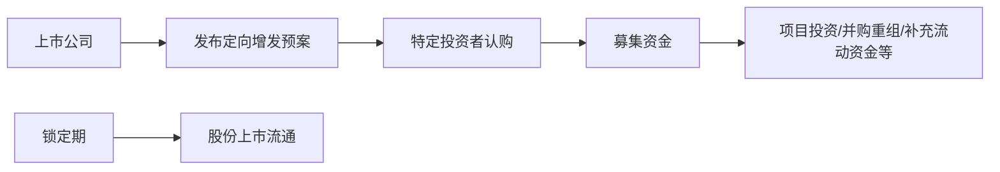

# 定向增发策略：参与上市公司融资的机会

> 关键词：定向增发策略、上市公司融资、投资机会、折价率、锁定期

> 摘要：本文深入探讨了定向增发策略，即参与上市公司融资的机会。首先介绍了定向增发的背景知识，包括目的、适用读者和文档结构等。接着阐述了定向增发的核心概念与联系，通过示意图和流程图展示其原理和架构。详细讲解了核心算法原理及操作步骤，结合 Python 代码进行说明。给出了相关的数学模型和公式，并举例解释。通过项目实战，展示了代码的实际应用和详细解读。分析了定向增发在不同场景下的实际应用，推荐了学习资源、开发工具框架以及相关论文著作。最后总结了定向增发策略的未来发展趋势与挑战，并对常见问题进行了解答，为投资者提供全面的参考。

## 1. 背景介绍 
### 1.1 目的和范围
定向增发是上市公司向符合条件的少数特定投资者非公开发行股份的行为，其目的在于为公司筹集资金，用于项目投资、并购重组、补充流动资金等。本文章的目的是深入剖析定向增发策略，帮助投资者了解参与上市公司融资的机会和风险。范围涵盖定向增发的基本概念、核心算法、数学模型、实际应用案例，以及相关的工具和资源推荐等方面。

### 1.2 预期读者
本文预期读者包括对定向增发投资感兴趣的个人投资者、专业投资机构从业者、金融研究人员等。希望通过阅读本文，他们能够更好地理解定向增发策略，掌握相关的分析方法和投资技巧。

### 1.3 文档结构概述
本文将按照以下结构展开：首先介绍定向增发的核心概念与联系，包括其原理和架构；接着阐述核心算法原理和具体操作步骤，并给出 Python 代码示例；然后介绍相关的数学模型和公式，并举例说明；通过项目实战展示代码的实际应用和详细解读；分析定向增发的实际应用场景；推荐学习资源、开发工具框架以及相关论文著作；最后总结定向增发策略的未来发展趋势与挑战，解答常见问题，并提供扩展阅读和参考资料。

### 1.4 术语表
#### 1.4.1 核心术语定义
- **定向增发**：上市公司向特定投资者非公开发行股票的融资方式。
- **折价率**：定向增发价格与二级市场股价之间的折扣比例。
- **锁定期**：定向增发投资者认购的股票在一定期限内不能上市流通的时间。
- **发行对象**：参与定向增发的特定投资者，通常包括机构投资者和自然人。

#### 1.4.2 相关概念解释
- **上市公司融资**：上市公司通过各种方式筹集资金以满足公司发展的需要，定向增发是其中一种重要的融资方式。
- **投资机会**：定向增发为投资者提供了以较低价格参与上市公司发展的机会，但同时也伴随着一定的风险。

#### 1.4.3 缩略词列表
- **IPO**：首次公开募股（Initial Public Offering）
- **PE**：私募股权投资（Private Equity）

## 2. 核心概念与联系 

### 定向增发的原理
定向增发是上市公司在现有股份基础上，向特定投资者发行新的股份，以筹集资金。发行价格通常低于二级市场股价，给予投资者一定的折价。投资者认购的股份在锁定期结束后可以上市流通。

### 定向增发的架构
以下是定向增发的架构示意图：


### 核心概念之间的联系
折价率和锁定期是定向增发的两个重要因素，它们相互影响。较高的折价率可以吸引更多的投资者参与，但可能会增加上市公司的股权稀释程度；较长的锁定期可以减少短期内股份上市流通对二级市场的冲击，但会增加投资者的资金占用时间和风险。

## 3. 核心算法原理 & 具体操作步骤 

### 核心算法原理
在定向增发投资中，一个重要的算法是评估定向增发的投资价值。可以通过计算折价率和预期收益率来进行评估。

折价率计算公式为：
$$折价率 = \frac{二级市场股价 - 定向增发价格}{二级市场股价} \times 100\%$$

预期收益率计算公式为：
$$预期收益率 = \frac{锁定期结束后股价 - 定向增发价格}{定向增发价格} \times 100\%$$

### 具体操作步骤
1. **数据收集**：收集上市公司的定向增发预案、二级市场股价等相关数据。
2. **计算折价率**：根据上述公式计算定向增发的折价率。
3. **预测锁定期结束后股价**：可以通过基本面分析、技术分析等方法预测锁定期结束后股价。
4. **计算预期收益率**：根据预测的锁定期结束后股价和定向增发价格计算预期收益率。
5. **投资决策**：根据折价率和预期收益率等指标，决定是否参与定向增发投资。

### Python 代码实现
```python
# 计算折价率
def calculate_discount_rate(market_price, private_placement_price):
    return ((market_price - private_placement_price) / market_price) * 100

# 计算预期收益率
def calculate_expected_return(private_placement_price, expected_price_after_lockup):
    return ((expected_price_after_lockup - private_placement_price) / private_placement_price) * 100

# 示例数据
market_price = 20
private_placement_price = 15
expected_price_after_lockup = 25

# 计算折价率
discount_rate = calculate_discount_rate(market_price, private_placement_price)
print(f"折价率: {discount_rate:.2f}%")

# 计算预期收益率
expected_return = calculate_expected_return(private_placement_price, expected_price_after_lockup)
print(f"预期收益率: {expected_return:.2f}%")
```

## 4. 数学模型和公式 & 详细讲解 & 举例说明 

### 数学模型和公式
除了上述的折价率和预期收益率计算公式外，还可以建立更复杂的数学模型来评估定向增发的投资价值。例如，可以考虑上市公司的基本面因素、行业发展趋势等。

假设上市公司的净利润增长率为 $g$，股息率为 $d$，定向增发价格为 $P_0$，锁定期为 $n$ 年，锁定期结束后股价为 $P_n$。则预期收益率可以表示为：
$$预期收益率 = \frac{P_n - P_0 + \sum_{i=1}^{n}P_0 \times d}{P_0} \times 100\%$$

### 详细讲解
上述公式中，$P_n - P_0$ 表示股价上涨带来的收益，$\sum_{i=1}^{n}P_0 \times d$ 表示股息收益。通过考虑股息收益，可以更全面地评估定向增发的投资价值。

### 举例说明
假设某上市公司定向增发价格为 $P_0 = 10$ 元，净利润增长率 $g = 10\%$，股息率 $d = 2\%$，锁定期 $n = 3$ 年。预计锁定期结束后股价 $P_n$ 可以根据净利润增长率进行预测：
$$P_n = P_0 \times (1 + g)^n = 10 \times (1 + 0.1)^3 = 13.31$$

则股息收益为：
$$\sum_{i=1}^{3}P_0 \times d = 10 \times 0.02 \times 3 = 0.6$$

预期收益率为：
$$预期收益率 = \frac{13.31 - 10 + 0.6}{10} \times 100\% = 39.1\%$$

## 5. 项目实战：代码实际案例和详细解释说明 

### 5.1  开发环境搭建
在进行定向增发策略的项目实战时，需要搭建相应的开发环境。以下是具体步骤：
1. **安装 Python**：可以从 Python 官方网站（https://www.python.org/downloads/）下载并安装 Python 3.x 版本。
2. **安装必要的库**：使用 pip 安装所需的库，如 pandas、numpy、matplotlib 等。
```bash
pip install pandas numpy matplotlib
```

### 5.2  源代码详细实现和代码解读
以下是一个完整的 Python 代码示例，用于分析定向增发数据并绘制折价率和预期收益率的图表。
```python
import pandas as pd
import numpy as np
import matplotlib.pyplot as plt

# 示例数据
data = {
    '上市公司名称': ['公司 A', '公司 B', '公司 C', '公司 D'],
    '二级市场股价': [20, 25, 30, 35],
    '定向增发价格': [15, 20, 22, 28],
    '预期锁定期结束后股价': [22, 28, 32, 40]
}

df = pd.DataFrame(data)

# 计算折价率
df['折价率'] = ((df['二级市场股价'] - df['定向增发价格']) / df['二级市场股价']) * 100

# 计算预期收益率
df['预期收益率'] = ((df['预期锁定期结束后股价'] - df['定向增发价格']) / df['定向增发价格']) * 100

# 打印结果
print(df)

# 绘制折价率和预期收益率的柱状图
fig, ax = plt.subplots(2, 1, figsize=(10, 8))

ax[0].bar(df['上市公司名称'], df['折价率'])
ax[0].set_title('折价率')
ax[0].set_ylabel('折价率 (%)')

ax[1].bar(df['上市公司名称'], df['预期收益率'])
ax[1].set_title('预期收益率')
ax[1].set_ylabel('预期收益率 (%)')
ax[1].set_xlabel('上市公司名称')

plt.tight_layout()
plt.show()
```

### 5.3  代码解读与分析
1. **数据准备**：使用 pandas 库创建一个包含上市公司名称、二级市场股价、定向增发价格和预期锁定期结束后股价的 DataFrame。
2. **计算折价率和预期收益率**：使用前面介绍的公式计算每个上市公司的折价率和预期收益率，并将结果添加到 DataFrame 中。
3. **打印结果**：打印包含折价率和预期收益率的 DataFrame，方便查看分析结果。
4. **绘制图表**：使用 matplotlib 库绘制折价率和预期收益率的柱状图，直观展示不同上市公司的定向增发投资价值。

通过这个项目实战，我们可以更直观地了解定向增发的投资价值，并对不同上市公司的定向增发项目进行比较和分析。

## 6. 实际应用场景 
### 机构投资者
机构投资者如基金公司、保险公司等通常会参与定向增发投资。他们可以利用自身的专业研究能力和资金优势，选择具有潜力的上市公司进行定向增发投资。例如，某基金公司通过深入研究，发现某上市公司的定向增发项目具有较高的折价率和良好的发展前景，于是参与该项目的定向增发。在锁定期结束后，股价上涨，基金公司获得了丰厚的收益。

### 个人投资者
个人投资者也可以通过参与定向增发基金等方式间接参与定向增发投资。对于个人投资者来说，参与定向增发可以获得比二级市场更低的股价，但需要注意锁定期的风险。例如，某个人投资者购买了一只定向增发基金，该基金参与了多个上市公司的定向增发项目。在锁定期结束后，部分项目获得了较好的收益，个人投资者也从中获利。

### 上市公司
对于上市公司来说，定向增发是一种重要的融资方式。通过定向增发，上市公司可以筹集资金用于项目投资、并购重组等，促进公司的发展。例如，某上市公司计划进行一项重大的并购项目，但资金不足。通过定向增发，公司成功筹集了所需资金，完成了并购项目，提升了公司的竞争力。

## 7. 工具和资源推荐
### 7.1 学习资源推荐
#### 7.1.1 书籍推荐
- 《投资学》：全面介绍了投资的基本理论和方法，包括股票投资、债券投资等，对于理解定向增发投资有很大的帮助。
- 《金融市场学》：讲解了金融市场的基本原理和运行机制，有助于了解定向增发在金融市场中的地位和作用。

#### 7.1.2 在线课程
- Coursera 上的“投资分析与组合管理”课程：系统介绍了投资分析的方法和技巧，包括如何评估定向增发的投资价值。
- 网易云课堂上的“金融投资实战课程”：结合实际案例，讲解了金融投资的策略和方法，对定向增发投资有一定的指导意义。

#### 7.1.3 技术博客和网站
- 雪球网：提供了丰富的股票投资分析和讨论，包括定向增发相关的内容。
- 东方财富网：是国内知名的金融信息网站，提供了上市公司定向增发的最新动态和数据。

### 7.2 开发工具框架推荐
#### 7.2.1 IDE和编辑器
- PyCharm：是一款专业的 Python 集成开发环境，具有强大的代码编辑、调试和分析功能，适合进行定向增发策略的开发。
- Jupyter Notebook：是一个交互式的开发环境，适合进行数据探索和分析，方便展示定向增发数据的处理和分析结果。

#### 7.2.2 调试和性能分析工具
- pdb：Python 自带的调试工具，可以帮助开发者定位代码中的问题。
- cProfile：Python 标准库中的性能分析工具，可以分析代码的运行时间和性能瓶颈。

#### 7.2.3 相关框架和库
- pandas：是一个强大的数据处理和分析库，适合处理定向增发相关的数据。
- numpy：是 Python 的数值计算库，提供了高效的数组和矩阵运算功能，在定向增发策略的计算中经常使用。

### 7.3 相关论文著作推荐
#### 7.3.1 经典论文
- 《定向增发对上市公司绩效的影响研究》：深入分析了定向增发对上市公司绩效的影响机制和效果。
- 《定向增发折价率的影响因素分析》：研究了影响定向增发折价率的各种因素，为投资者评估定向增发投资价值提供了参考。

#### 7.3.2 最新研究成果
可以通过学术数据库如知网、万方等搜索关于定向增发的最新研究成果，了解该领域的最新动态和研究方向。

#### 7.3.3 应用案例分析
一些金融研究机构会发布定向增发的应用案例分析报告，可以从中学习到实际的投资策略和经验。

## 8. 总结：未来发展趋势与挑战
### 未来发展趋势
- **市场规模扩大**：随着我国资本市场的不断发展，定向增发市场规模有望继续扩大。越来越多的上市公司将选择定向增发作为融资方式，为投资者提供更多的投资机会。
- **投资策略多元化**：投资者将采用更加多元化的投资策略参与定向增发投资。除了传统的基于折价率和预期收益率的投资策略外，还将结合基本面分析、行业研究等方法，提高投资的准确性和收益率。
- **与其他金融工具结合**：定向增发可能会与其他金融工具如可转债、优先股等结合，创造出更加复杂和多样化的金融产品，满足不同投资者的需求。

### 挑战
- **市场波动风险**：定向增发投资存在一定的市场波动风险。在锁定期内，二级市场股价可能会出现大幅波动，导致投资者的预期收益率下降甚至出现亏损。
- **信息不对称风险**：投资者在参与定向增发投资时，可能会面临信息不对称的问题。上市公司可能会隐瞒一些重要信息，影响投资者的投资决策。
- **政策风险**：定向增发市场受到政策的影响较大。政策的变化可能会导致定向增发的规则和条件发生改变，增加投资者的投资风险。

## 9. 附录：常见问题与解答
### 问题 1：定向增发的锁定期一般是多久？
解答：定向增发的锁定期根据不同情况有所不同。一般来说，机构投资者的锁定期为 12 个月，控股股东、实际控制人及其控制的企业等认购的股份锁定期为 36 个月。

### 问题 2：参与定向增发投资需要注意哪些风险？
解答：参与定向增发投资需要注意市场波动风险、信息不对称风险、政策风险等。投资者应该充分了解定向增发的相关信息，做好风险评估和投资规划。

### 问题 3：个人投资者如何参与定向增发投资？
解答：个人投资者可以通过参与定向增发基金等方式间接参与定向增发投资。也可以关注上市公司的定向增发预案，选择合适的时机参与定向增发。

## 10. 扩展阅读 & 参考资料
- 《中国证券报》：提供了大量关于资本市场和定向增发的新闻和分析报道。
- 《上海证券报》：是国内重要的金融媒体，对定向增发市场有深入的报道和研究。
- 相关上市公司的公告和年报：可以从中获取定向增发的详细信息和公司的基本面情况。

作者：AI天才研究院/AI Genius Institute & 禅与计算机程序设计艺术 /Zen And The Art of Computer Programming