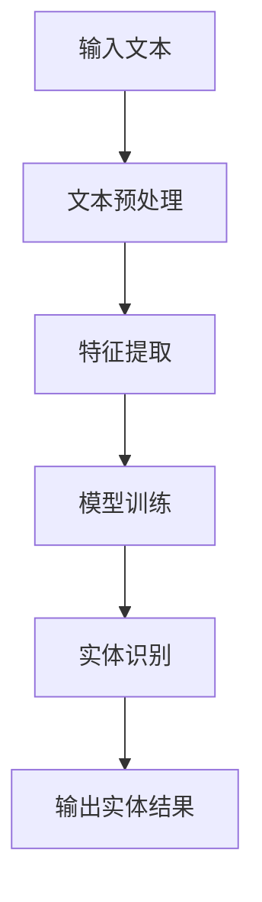

# 实体提取：增强AI Agent的信息处理能力

> 关键词：实体提取、AI Agent、信息处理、自然语言处理、机器学习

> 摘要：本文围绕实体提取如何增强AI Agent的信息处理能力展开。首先介绍了实体提取和AI Agent的背景知识，包括目的、预期读者、文档结构和相关术语。接着深入探讨了核心概念与联系，给出了原理和架构的示意图及流程图。详细阐述了核心算法原理，用Python代码进行说明，并介绍了相关数学模型和公式。通过项目实战展示了代码实现和解读，分析了实际应用场景。推荐了学习资源、开发工具框架和相关论文著作。最后总结了未来发展趋势与挑战，解答常见问题，并提供扩展阅读和参考资料，旨在为读者全面呈现实体提取对AI Agent信息处理能力提升的关键作用。

## 1. 背景介绍 
### 1.1 目的和范围
实体提取是自然语言处理（NLP）中的关键任务，旨在从文本中识别出特定类型的实体，如人名、地名、组织机构名等。AI Agent则是能够自主执行任务、与环境交互的智能程序。本文章的目的在于探讨实体提取技术如何增强AI Agent的信息处理能力，使AI Agent能够更准确、高效地理解和处理自然语言文本。

文章的范围涵盖实体提取的核心概念、算法原理、数学模型，以及如何在实际项目中应用实体提取技术来提升AI Agent的性能。同时，还会介绍相关的工具和资源，帮助读者进一步学习和实践。

### 1.2 预期读者
本文预期读者包括自然语言处理领域的研究人员、AI开发工程师、对AI Agent和实体提取技术感兴趣的技术爱好者。无论您是初学者想要了解基本概念，还是有一定经验的专业人士寻求技术提升，都能从本文中获得有价值的信息。

### 1.3 文档结构概述
本文将按照以下结构展开：首先介绍实体提取和AI Agent的核心概念与联系，包括原理和架构的示意图及流程图；接着详细讲解核心算法原理，并使用Python代码进行说明；阐述相关的数学模型和公式，并举例说明；通过项目实战展示代码的实际案例和详细解释；分析实体提取在不同场景下的实际应用；推荐学习资源、开发工具框架和相关论文著作；最后总结未来发展趋势与挑战，解答常见问题，并提供扩展阅读和参考资料。

### 1.4 术语表
#### 1.4.1 核心术语定义
- **实体提取（Entity Extraction）**：从自然语言文本中识别和分类特定类型实体的过程，例如识别出文本中的人名、地名、组织机构名等。
- **AI Agent**：能够感知环境、自主决策并执行任务的智能程序，它可以与用户或其他系统进行交互。
- **自然语言处理（Natural Language Processing，NLP）**：研究计算机与人类自然语言之间交互的技术领域，包括文本分析、机器翻译、信息提取等任务。
- **机器学习（Machine Learning）**：让计算机通过数据学习模式和规律，从而进行预测和决策的技术。
- **深度学习（Deep Learning）**：机器学习的一个分支，使用多层神经网络来学习数据的复杂表示。

#### 1.4.2 相关概念解释
- **命名实体识别（Named Entity Recognition，NER）**：实体提取的一种常见形式，主要识别文本中的命名实体，如人名、地名、组织机构名等。
- **词性标注（Part-of-Speech Tagging）**：为文本中的每个词语标注其词性，如名词、动词、形容词等，有助于实体提取。
- **依存句法分析（Dependency Parsing）**：分析句子中词语之间的依存关系，帮助理解句子的结构和语义，对实体提取有辅助作用。

#### 1.4.3 缩略词列表
- **NLP**：Natural Language Processing（自然语言处理）
- **NER**：Named Entity Recognition（命名实体识别）
- **ML**：Machine Learning（机器学习）
- **DL**：Deep Learning（深度学习）

## 2. 核心概念与联系 

### 实体提取与AI Agent的关系
实体提取是AI Agent信息处理的重要组成部分。AI Agent在与用户交互或处理文本信息时，需要准确地识别文本中的实体，以便更好地理解用户意图、进行知识推理和决策。例如，在智能客服系统中，AI Agent需要识别用户咨询中的产品名称、问题类型等实体，才能提供准确的解答。

### 核心概念原理
实体提取的基本原理是通过对文本进行分析，找出其中具有特定语义的实体，并将其分类到预定义的实体类型中。常见的实体类型包括人名、地名、组织机构名、日期、时间、金额等。

实体提取的主要步骤包括：
1. **文本预处理**：对输入的文本进行清洗、分词、词性标注等操作，为后续的实体识别做准备。
2. **特征提取**：从预处理后的文本中提取有用的特征，如词语的词性、上下文信息等。
3. **模型训练**：使用机器学习或深度学习模型对提取的特征进行训练，学习实体的模式和规律。
4. **实体识别**：使用训练好的模型对新的文本进行实体识别，输出识别结果。

### 架构的文本示意图
```plaintext
输入文本 -> 文本预处理（清洗、分词、词性标注） -> 特征提取 -> 模型训练 -> 实体识别 -> 输出实体结果
```

### Mermaid流程图


## 3. 核心算法原理 & 具体操作步骤 

### 基于规则的实体提取算法
基于规则的实体提取算法是通过手动定义一系列规则来识别实体。这些规则可以基于词语的形态、词性、上下文等信息。例如，识别英文人名可以通过判断词语的首字母是否大写，并且前后是否有特定的词语来实现。

以下是一个简单的基于规则的英文人名识别的Python代码示例：
```python
import re

def extract_names(text):
    names = []
    # 匹配首字母大写的单词
    pattern = r'\b[A-Z][a-z]+\b'
    words = re.findall(pattern, text)
    # 简单规则：如果单词后面跟着“先生”、“女士”等称呼，则认为是人名
    for i in range(len(words) - 1):
        if words[i + 1].lower() in ['先生', '女士', 'mr.', 'mrs.', 'ms.']:
            names.append(words[i])
    return names

text = "Mr. John Smith is a famous scientist. 张先生是一位著名的科学家。"
names = extract_names(text)
print("识别出的人名：", names)
```
### 基于机器学习的实体提取算法
基于机器学习的实体提取算法通常使用有监督学习的方法，需要大量的标注数据进行训练。常见的机器学习模型包括朴素贝叶斯、支持向量机、决策树等。

以下是一个使用Python和Scikit-learn库实现的基于朴素贝叶斯的实体提取示例：
```python
from sklearn.feature_extraction.text import CountVectorizer
from sklearn.naive_bayes import MultinomialNB
from sklearn.pipeline import Pipeline

# 示例训练数据
train_data = [
    ("John works at Google.", "人名 动词 介词 组织机构名"),
    ("I live in Beijing.", "代词 动词 介词 地名")
]

# 提取文本和标签
X_train = [data[0] for data in train_data]
y_train = [data[1] for data in train_data]

# 创建管道，包括特征提取和模型训练
pipeline = Pipeline([
    ('vectorizer', CountVectorizer()),
    ('classifier', MultinomialNB())
])

# 训练模型
pipeline.fit(X_train, y_train)

# 测试数据
test_text = "Alice works at Microsoft."
prediction = pipeline.predict([test_text])
print("预测结果：", prediction)
```
### 基于深度学习的实体提取算法
基于深度学习的实体提取算法通常使用循环神经网络（RNN）、长短时记忆网络（LSTM）、门控循环单元（GRU）等模型。这些模型能够处理序列数据，更好地捕捉文本中的上下文信息。

以下是一个使用Python和TensorFlow库实现的基于LSTM的实体提取示例：
```python
import tensorflow as tf
from tensorflow.keras.preprocessing.text import Tokenizer
from tensorflow.keras.preprocessing.sequence import pad_sequences
from tensorflow.keras.models import Sequential
from tensorflow.keras.layers import Embedding, LSTM, Dense

# 示例训练数据
train_data = [
    ("John works at Google.", ["人名", "动词", "介词", "组织机构名"]),
    ("I live in Beijing.", ["代词", "动词", "介词", "地名"])
]

# 提取文本和标签
X_train = [data[0] for data in train_data]
y_train = [data[1] for data in train_data]

# 分词器
tokenizer = Tokenizer()
tokenizer.fit_on_texts(X_train)
X_train_seq = tokenizer.texts_to_sequences(X_train)

# 标签编码
tag2idx = {tag: idx for idx, tag in enumerate(set([tag for tags in y_train for tag in tags]))}
y_train_encoded = [[tag2idx[tag] for tag in tags] for tags in y_train]

# 填充序列
max_length = max([len(seq) for seq in X_train_seq])
X_train_padded = pad_sequences(X_train_seq, maxlen=max_length)
y_train_padded = pad_sequences(y_train_encoded, maxlen=max_length)

# 构建模型
model = Sequential([
    Embedding(input_dim=len(tokenizer.word_index) + 1, output_dim=100, input_length=max_length),
    LSTM(128, return_sequences=True),
    Dense(len(tag2idx), activation='softmax')
])

# 编译模型
model.compile(optimizer='adam', loss='sparse_categorical_crossentropy', metrics=['accuracy'])

# 训练模型
model.fit(X_train_padded, y_train_padded, epochs=10)

# 测试数据
test_text = "Alice works at Microsoft."
test_seq = tokenizer.texts_to_sequences([test_text])
test_padded = pad_sequences(test_seq, maxlen=max_length)
prediction = model.predict(test_padded)
predicted_tags = [list(tag2idx.keys())[tag] for tag in prediction.argmax(axis=-1)[0]]
print("预测结果：", predicted_tags)
```

## 4. 数学模型和公式 & 详细讲解 & 举例说明 

### 基于朴素贝叶斯的实体提取数学模型
朴素贝叶斯算法基于贝叶斯定理，假设特征之间相互独立。贝叶斯定理的公式为：
$$P(c|x) = \frac{P(x|c)P(c)}{P(x)}$$
其中，$P(c|x)$ 是在给定特征 $x$ 的情况下，类别 $c$ 的后验概率；$P(x|c)$ 是在类别 $c$ 下特征 $x$ 的条件概率；$P(c)$ 是类别 $c$ 的先验概率；$P(x)$ 是特征 $x$ 的概率。

在实体提取中，我们要计算每个实体类别 $c$ 在给定文本特征 $x$ 下的概率，选择概率最大的类别作为预测结果。

例如，假设我们要判断一个单词是否是人名，特征 $x$ 可以是单词的首字母是否大写，类别 $c$ 可以是人名和非人名。我们可以通过统计训练数据中首字母大写的单词是人名和非人名的比例，来计算 $P(x|c)$ 和 $P(c)$。

### 基于深度学习的实体提取数学模型
在基于深度学习的实体提取中，通常使用交叉熵损失函数来衡量模型的预测结果与真实标签之间的差异。交叉熵损失函数的公式为：
$$L(y, \hat{y}) = -\sum_{i=1}^{n} y_i \log(\hat{y}_i)$$
其中，$y$ 是真实标签，$\hat{y}$ 是模型的预测结果，$n$ 是类别数。

在训练过程中，我们的目标是最小化交叉熵损失函数。通过反向传播算法，计算损失函数对模型参数的梯度，并更新模型参数，使得模型的预测结果越来越接近真实标签。

例如，在上述基于LSTM的实体提取示例中，我们使用了 `sparse_categorical_crossentropy` 作为损失函数，它是交叉熵损失函数在标签为整数编码时的一种变体。

## 5. 项目实战：代码实际案例和详细解释说明 

### 5.1  开发环境搭建
为了实现实体提取项目，我们需要搭建以下开发环境：
1. **Python环境**：建议使用Python 3.6及以上版本。
2. **必要的库**：安装 `tensorflow`、`scikit-learn`、`numpy`、`pandas` 等库。可以使用以下命令进行安装：
```sh
pip install tensorflow scikit-learn numpy pandas
```
3. **IDE**：推荐使用PyCharm或Jupyter Notebook，方便代码的编写和调试。

### 5.2  源代码详细实现和代码解读
以下是一个完整的基于深度学习的中文实体提取项目示例：
```python
import tensorflow as tf
from tensorflow.keras.preprocessing.text import Tokenizer
from tensorflow.keras.preprocessing.sequence import pad_sequences
from tensorflow.keras.models import Sequential
from tensorflow.keras.layers import Embedding, LSTM, Dense
import pandas as pd

# 读取数据
data = pd.read_csv('data.csv')
X = data['text'].tolist()
y = data['tags'].tolist()

# 分词器
tokenizer = Tokenizer()
tokenizer.fit_on_texts(X)
X_seq = tokenizer.texts_to_sequences(X)

# 标签编码
tag2idx = {tag: idx for idx, tag in enumerate(set([tag for tags in y for tag in tags.split()]))}
y_encoded = [[tag2idx[tag] for tag in tags.split()] for tags in y]

# 填充序列
max_length = max([len(seq) for seq in X_seq])
X_padded = pad_sequences(X_seq, maxlen=max_length)
y_padded = pad_sequences(y_encoded, maxlen=max_length)

# 构建模型
model = Sequential([
    Embedding(input_dim=len(tokenizer.word_index) + 1, output_dim=100, input_length=max_length),
    LSTM(128, return_sequences=True),
    Dense(len(tag2idx), activation='softmax')
])

# 编译模型
model.compile(optimizer='adam', loss='sparse_categorical_crossentropy', metrics=['accuracy'])

# 训练模型
model.fit(X_padded, y_padded, epochs=10, batch_size=32)

# 测试数据
test_text = "张三在北京工作。"
test_seq = tokenizer.texts_to_sequences([test_text])
test_padded = pad_sequences(test_seq, maxlen=max_length)
prediction = model.predict(test_padded)
predicted_tags = [list(tag2idx.keys())[tag] for tag in prediction.argmax(axis=-1)[0]]
print("预测结果：", predicted_tags)
```
### 代码解读与分析
1. **数据读取**：使用 `pandas` 库读取包含文本和标签的数据文件。
2. **分词和编码**：使用 `Tokenizer` 对文本进行分词，并将文本转换为序列。对标签进行编码，将标签转换为整数。
3. **填充序列**：为了使输入序列长度一致，使用 `pad_sequences` 对序列进行填充。
4. **模型构建**：使用 `Sequential` 模型构建一个包含嵌入层、LSTM层和全连接层的深度学习模型。
5. **模型编译**：使用 `adam` 优化器和 `sparse_categorical_crossentropy` 损失函数编译模型。
6. **模型训练**：使用训练数据对模型进行训练，设置训练轮数和批量大小。
7. **模型预测**：对测试数据进行预测，将预测结果转换为标签。

## 6. 实际应用场景 
### 智能客服系统
在智能客服系统中，实体提取可以帮助AI Agent准确识别用户咨询中的产品名称、问题类型、客户姓名等实体信息。例如，当用户询问“我的iPhone 14屏幕出现问题怎么办？”，AI Agent可以通过实体提取识别出“iPhone 14”是产品名称，“屏幕出现问题”是问题类型，从而提供针对性的解决方案。

### 信息检索与推荐
在信息检索和推荐系统中，实体提取可以用于提取文档中的关键实体，构建实体索引，提高检索效率和推荐准确性。例如，在新闻推荐系统中，通过提取新闻文章中的人物、地点、事件等实体，将新闻与用户的兴趣实体进行匹配，为用户推荐相关的新闻。

### 金融风险管理
在金融领域，实体提取可以用于识别金融文本中的公司名称、股票代码、金额、日期等实体信息，帮助金融机构进行风险评估和决策。例如，在分析财务报表时，通过实体提取识别出公司的收入、利润、资产等关键信息，评估公司的财务状况。

### 医疗信息处理
在医疗领域，实体提取可以用于从病历、医学文献等文本中提取疾病名称、药物名称、症状等实体信息，辅助医生进行诊断和治疗。例如，在电子病历系统中，通过实体提取识别出患者的疾病诊断、治疗方案等信息，为医生提供参考。

## 7. 工具和资源推荐
### 7.1 学习资源推荐
#### 7.1.1 书籍推荐
- 《自然语言处理入门》：由何晗编写，全面介绍了自然语言处理的基础知识和常用技术，包括实体提取。
- 《深度学习》：由Ian Goodfellow、Yoshua Bengio和Aaron Courville编写，深入讲解了深度学习的原理和应用，对理解基于深度学习的实体提取算法有很大帮助。
- 《Python自然语言处理》：由Steven Bird、Ewan Klein和Edward Loper编写，通过Python代码示例介绍了自然语言处理的各种任务和技术。

#### 7.1.2 在线课程
- Coursera上的“自然语言处理专项课程”：由斯坦福大学的教授授课，涵盖了自然语言处理的各个方面，包括实体提取。
- edX上的“深度学习微硕士项目”：包含深度学习的核心知识和应用，对学习基于深度学习的实体提取算法有很大帮助。
- 网易云课堂上的“Python自然语言处理实战”：通过实际项目案例介绍了Python在自然语言处理中的应用，包括实体提取。

#### 7.1.3 技术博客和网站
- 博客园：有很多自然语言处理领域的技术博客，分享了实体提取的最新研究成果和实践经验。
- 知乎：有很多关于自然语言处理和实体提取的讨论和问答，能帮助你解决遇到的问题。
- arXiv：提供了大量的学术论文，包括实体提取领域的最新研究成果。

### 7.2 开发工具框架推荐
#### 7.2.1 IDE和编辑器
- PyCharm：功能强大的Python集成开发环境，提供代码编辑、调试、版本控制等功能，适合开发大型的自然语言处理项目。
- Jupyter Notebook：交互式的开发环境，适合进行数据探索、模型实验和代码演示，方便快速验证实体提取算法。
- Visual Studio Code：轻量级的代码编辑器，支持多种编程语言和插件，可用于开发和调试实体提取代码。

#### 7.2.2 调试和性能分析工具
- TensorBoard：TensorFlow提供的可视化工具，可以帮助你监控模型的训练过程，分析模型的性能和参数。
- Py-Spy：用于分析Python程序的性能瓶颈，找出代码中的耗时操作，优化实体提取算法的性能。
- Pylint：用于检查Python代码的质量，发现代码中的潜在问题和规范问题，提高代码的可维护性。

#### 7.2.3 相关框架和库
- TensorFlow：开源的深度学习框架，提供了丰富的深度学习模型和工具，可用于实现基于深度学习的实体提取算法。
- PyTorch：另一个流行的深度学习框架，具有简洁的API和高效的计算性能，适合进行实体提取模型的开发和训练。
- NLTK：自然语言处理工具包，提供了丰富的文本处理功能和数据集，可用于实体提取的预处理和特征提取。
- SpaCy：高效的自然语言处理库，提供了预训练的实体提取模型和快速的文本处理功能，适合快速实现实体提取任务。

### 7.3 相关论文著作推荐
#### 7.3.1 经典论文
- "Named Entity Recognition with Bidirectional LSTM-CNNs"：提出了一种基于双向LSTM和卷积神经网络的命名实体识别方法，取得了很好的效果。
- "Attention Is All You Need"：介绍了Transformer模型，该模型在自然语言处理领域取得了巨大的成功，也可用于实体提取任务。
- "Conditional Random Fields: Probabilistic Models for Segmenting and Labeling Sequence Data"：提出了条件随机场（CRF）模型，常用于序列标注任务，包括实体提取。

#### 7.3.2 最新研究成果
- 关注ACL（Association for Computational Linguistics）、EMNLP（Conference on Empirical Methods in Natural Language Processing）等自然语言处理领域的顶级会议，这些会议上会发布实体提取领域的最新研究成果。
- 阅读相关的学术期刊，如Journal of Artificial Intelligence Research（JAIR）、Transactions of the Association for Computational Linguistics（TACL）等，获取实体提取领域的前沿研究。

#### 7.3.3 应用案例分析
- 分析实际应用中的实体提取案例，如智能客服系统、信息检索系统等，了解实体提取技术在不同场景下的应用方法和效果。
- 参考开源项目和代码库，如AllenNLP、Hugging Face Transformers等，学习他人的实现思路和最佳实践。

## 8. 总结：未来发展趋势与挑战
### 未来发展趋势
- **多模态实体提取**：结合文本、图像、语音等多种模态的信息进行实体提取，提高实体识别的准确性和全面性。例如，在视频中同时识别出人物的姓名、外貌特征和语音内容中的实体信息。
- **跨语言实体提取**：随着全球化的发展，需要处理不同语言的文本信息。跨语言实体提取技术可以识别不同语言文本中的实体，并进行统一的管理和分析。
- **实时实体提取**：在实时数据处理场景中，如社交媒体、实时新闻等，需要快速准确地识别实体信息。实时实体提取技术将成为未来的研究热点。
- **与知识图谱的融合**：将实体提取与知识图谱相结合，利用知识图谱的语义信息和推理能力，提高实体识别的准确性和语义理解能力。

### 挑战
- **数据标注成本高**：基于机器学习和深度学习的实体提取算法需要大量的标注数据进行训练，数据标注的成本较高，且标注质量会影响模型的性能。
- **领域适应性问题**：不同领域的文本具有不同的语言特点和实体类型，实体提取模型在不同领域的适应性较差，需要针对不同领域进行模型的微调或重新训练。
- **语义理解困难**：自然语言具有丰富的语义和歧义性，实体提取不仅要识别实体的名称，还要理解实体的语义和上下文关系，这对模型的语义理解能力提出了挑战。
- **计算资源需求大**：基于深度学习的实体提取模型通常需要大量的计算资源进行训练和推理，对硬件设备的要求较高。

## 9. 附录：常见问题与解答
### 问题1：实体提取和命名实体识别有什么区别？
实体提取是一个更广泛的概念，它不仅包括命名实体识别，还可以识别其他类型的实体，如事件、产品、概念等。命名实体识别主要关注文本中的命名实体，如人名、地名、组织机构名等。

### 问题2：如何选择合适的实体提取算法？
选择合适的实体提取算法需要考虑以下因素：
- **数据规模**：如果数据规模较小，可以选择基于规则或简单机器学习的算法；如果数据规模较大，可以考虑使用深度学习算法。
- **领域特点**：不同领域的文本具有不同的语言特点和实体类型，需要选择适合该领域的算法。
- **性能要求**：如果对识别速度要求较高，可以选择基于规则或轻量级机器学习的算法；如果对识别准确性要求较高，可以选择深度学习算法。

### 问题3：如何评估实体提取模型的性能？
常用的评估指标包括准确率（Precision）、召回率（Recall）和F1值（F1-Score）。准确率表示模型预测正确的实体占所有预测实体的比例；召回率表示模型预测正确的实体占所有真实实体的比例；F1值是准确率和召回率的调和平均数，综合考虑了准确率和召回率。

### 问题4：如何处理实体提取中的歧义问题？
处理实体提取中的歧义问题可以采用以下方法：
- **上下文信息**：利用文本的上下文信息来消除歧义，例如根据前后文判断一个词语是人名还是地名。
- **知识图谱**：借助知识图谱的语义信息和推理能力，判断实体的正确含义。
- **多模型融合**：结合多个实体提取模型的结果，进行综合判断，提高识别的准确性。

## 10. 扩展阅读 & 参考资料
### 扩展阅读
- 《人工智能：现代方法》：全面介绍了人工智能的各个领域，包括自然语言处理和实体提取。
- 《统计自然语言处理基础》：深入讲解了统计自然语言处理的理论和方法，对理解实体提取的数学模型有很大帮助。
- 《自然语言处理实战：基于Python和深度学习》：通过实际项目案例介绍了自然语言处理的各种任务和技术，包括实体提取。

### 参考资料
- 何晗. 自然语言处理入门[M]. 人民邮电出版社, 2019.
- Ian Goodfellow, Yoshua Bengio, Aaron Courville. 深度学习[M]. 人民邮电出版社, 2017.
- Steven Bird, Ewan Klein, Edward Loper. Python自然语言处理[M]. 人民邮电出版社, 2010.
- "Named Entity Recognition with Bidirectional LSTM-CNNs". Jason P. C. Chiu, Eric Nichols. arXiv:1511.08308.
- "Attention Is All You Need". Ashish Vaswani, Noam Shazeer, Niki Parmar, Jakob Uszkoreit, Llion Jones, Aidan N. Gomez, Lukasz Kaiser, Illia Polosukhin. arXiv:1706.03762.
- "Conditional Random Fields: Probabilistic Models for Segmenting and Labeling Sequence Data". John D. Lafferty, Andrew McCallum, Fernando C. N. Pereira. ICML 2001.

作者：AI天才研究院/AI Genius Institute & 禅与计算机程序设计艺术 /Zen And The Art of Computer Programming