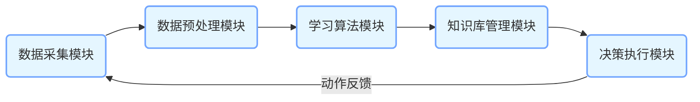

# 实时学习：即时更新AI Agent的知识库

> 关键词：实时学习、AI Agent、知识库更新、即时反馈、动态环境

> 摘要：本文围绕实时学习这一关键技术展开，聚焦于如何即时更新AI Agent的知识库。首先介绍了实时学习在动态环境下对于AI Agent的重要性及相关背景知识，接着深入剖析核心概念与联系，详细阐述核心算法原理与具体操作步骤，并借助数学模型和公式进行理论支撑。通过项目实战展示了实时学习在实际代码中的实现与应用，探讨了其实际应用场景。此外，还推荐了一系列学习资源、开发工具框架以及相关论文著作。最后对实时学习的未来发展趋势与挑战进行总结，并提供常见问题解答和扩展阅读参考资料，旨在为读者全面呈现实时学习在即时更新AI Agent知识库方面的技术全貌。

## 1. 背景介绍 
### 1.1 目的和范围
在当今快速发展的信息时代，环境和数据都在不断变化。传统的AI Agent知识库更新方式往往无法及时适应这些变化，导致AI Agent在面对新情况时表现不佳。实时学习的目的就是解决这一问题，使AI Agent能够在运行过程中即时更新其知识库，从而更好地应对动态环境中的各种任务。

本文的范围涵盖了实时学习的基本概念、核心算法、数学模型、实际应用案例等方面，旨在为读者提供一个全面而深入的关于实时学习在即时更新AI Agent知识库方面的技术指南。

### 1.2 预期读者
本文预期读者包括对人工智能技术有一定了解的程序员、软件架构师、AI研究人员，以及对实时学习和AI Agent知识库更新感兴趣的技术爱好者。对于希望深入学习和应用实时学习技术的人员，本文将提供有价值的参考。

### 1.3 文档结构概述
本文将按照以下结构展开：首先介绍实时学习的背景知识，包括目的、预期读者和文档结构概述等；接着阐述核心概念与联系，通过文本示意图和Mermaid流程图展示其原理和架构；然后详细讲解核心算法原理和具体操作步骤，结合Python源代码进行说明；再通过数学模型和公式进一步深入分析；之后通过项目实战展示代码实现和应用；探讨实际应用场景；推荐相关的工具和资源；最后总结未来发展趋势与挑战，提供常见问题解答和扩展阅读参考资料。

### 1.4 术语表
#### 1.4.1 核心术语定义
- **实时学习（Real-time Learning）**：指AI Agent在运行过程中，能够及时根据新获取的数据和信息对其知识库进行更新和调整，以适应动态环境的学习方式。
- **AI Agent**：一种能够感知环境、做出决策并执行动作的智能实体，通常基于一定的知识库和算法进行工作。
- **知识库（Knowledge Base）**：存储AI Agent所需的各种知识和信息的集合，包括规则、模型参数、案例等。

#### 1.4.2 相关概念解释
- **动态环境（Dynamic Environment）**：指环境中的数据和情况会随时间不断变化的环境，如金融市场、物联网场景等。
- **即时反馈（Immediate Feedback）**：在实时学习中，指AI Agent能够及时获得关于其决策和行为的反馈信息，以便进行知识库的更新。

#### 1.4.3 缩略词列表
- **ML（Machine Learning）**：机器学习
- **RL（Reinforcement Learning）**：强化学习
- **DNN（Deep Neural Network）**：深度神经网络

## 2. 核心概念与联系 

### 核心概念原理
实时学习的核心原理在于使AI Agent能够在运行过程中持续获取新的数据，并根据这些数据对其知识库进行即时更新。这一过程通常涉及到数据的采集、处理、分析和知识库的更新操作。

AI Agent通过传感器或其他数据接口获取环境中的数据，然后对这些数据进行预处理，去除噪声和异常值。接着，使用机器学习或其他算法对处理后的数据进行分析，提取有用的信息和模式。最后，将这些新的信息和模式融入到知识库中，更新AI Agent的知识状态。

### 架构的文本示意图
实时学习的架构可以分为以下几个主要部分：
1. **数据采集模块**：负责从环境中收集各种数据，如传感器数据、用户反馈数据等。
2. **数据预处理模块**：对采集到的数据进行清洗、转换和归一化等操作，以提高数据的质量。
3. **学习算法模块**：使用机器学习或其他算法对预处理后的数据进行分析和学习，提取有用的信息和模式。
4. **知识库管理模块**：负责对知识库进行更新和维护，将新的知识和信息融入到知识库中。
5. **决策执行模块**：根据更新后的知识库，AI Agent做出决策并执行相应的动作。

### Mermaid流程图


## 3. 核心算法原理 & 具体操作步骤 

### 核心算法原理
实时学习中常用的算法包括在线学习算法、强化学习算法等。下面以在线学习算法中的随机梯度下降（Stochastic Gradient Descent，SGD）为例进行详细阐述。

随机梯度下降是一种迭代优化算法，用于求解损失函数的最小值。在实时学习中，我们可以使用SGD来更新AI Agent的模型参数，从而实现知识库的更新。

### Python源代码实现
```python
import numpy as np

# 定义损失函数（以均方误差为例）
def loss_function(y_true, y_pred):
    return np.mean((y_true - y_pred) ** 2)

# 定义模型（简单的线性回归模型）
class LinearRegression:
    def __init__(self, num_features):
        self.weights = np.random.randn(num_features)
        self.bias = np.random.randn()

    def predict(self, X):
        return np.dot(X, self.weights) + self.bias

    def update(self, X, y, learning_rate):
        y_pred = self.predict(X)
        error = y_pred - y
        # 更新权重
        self.weights -= learning_rate * np.dot(X.T, error) / len(X)
        # 更新偏置
        self.bias -= learning_rate * np.sum(error) / len(X)

# 模拟实时数据
num_features = 3
model = LinearRegression(num_features)
learning_rate = 0.01

# 实时更新过程
for i in range(100):
    # 生成一批新的数据
    X = np.random.randn(10, num_features)
    y = np.dot(X, np.array([1, 2, 3])) + 0.5 + np.random.randn(10) * 0.1

    # 计算损失
    loss = loss_function(y, model.predict(X))
    print(f"Step {i}: Loss = {loss}")

    # 更新模型参数
    model.update(X, y, learning_rate)
```

### 具体操作步骤
1. **数据生成**：在每个时间步，生成一批新的数据，包括输入特征 `X` 和对应的目标值 `y`。
2. **预测**：使用当前的模型参数对输入数据进行预测，得到预测值 `y_pred`。
3. **计算损失**：根据预测值和真实值计算损失函数的值，衡量模型的预测误差。
4. **更新参数**：使用随机梯度下降算法更新模型的参数，减小损失函数的值。
5. **重复步骤1-4**：不断重复上述步骤，直到满足停止条件（如达到最大迭代次数或损失函数收敛）。

## 4. 数学模型和公式 & 详细讲解 & 举例说明 

### 数学模型
在实时学习中，我们通常使用机器学习模型来对数据进行建模和预测。以线性回归模型为例，其数学模型可以表示为：

$$
y = \mathbf{w}^T\mathbf{x} + b
$$

其中，$\mathbf{w}$ 是权重向量，$\mathbf{x}$ 是输入特征向量，$b$ 是偏置项，$y$ 是预测值。

### 损失函数
为了衡量模型的预测误差，我们需要定义一个损失函数。常见的损失函数包括均方误差（Mean Squared Error，MSE）、交叉熵损失等。以均方误差为例，其数学公式为：

$$
L(\mathbf{w}, b) = \frac{1}{n}\sum_{i=1}^{n}(y_i - (\mathbf{w}^T\mathbf{x}_i + b))^2
$$

其中，$n$ 是样本数量，$y_i$ 是第 $i$ 个样本的真实值，$\mathbf{x}_i$ 是第 $i$ 个样本的输入特征向量。

### 随机梯度下降算法
随机梯度下降算法的核心思想是通过迭代更新模型的参数，使得损失函数的值逐渐减小。具体来说，在每次迭代中，我们随机选择一个样本 $(\mathbf{x}_i, y_i)$，计算损失函数关于参数 $\mathbf{w}$ 和 $b$ 的梯度：

$$
\frac{\partial L}{\partial \mathbf{w}} = -2(\mathbf{y}_i - (\mathbf{w}^T\mathbf{x}_i + b))\mathbf{x}_i
$$

$$
\frac{\partial L}{\partial b} = -2(\mathbf{y}_i - (\mathbf{w}^T\mathbf{x}_i + b))
$$

然后，根据梯度的反方向更新参数：

$$
\mathbf{w} \leftarrow \mathbf{w} - \alpha\frac{\partial L}{\partial \mathbf{w}}
$$

$$
b \leftarrow b - \alpha\frac{\partial L}{\partial b}
$$

其中，$\alpha$ 是学习率，控制参数更新的步长。

### 举例说明
假设我们有一个简单的线性回归问题，输入特征向量 $\mathbf{x} = [x_1, x_2]$，真实值 $y = 2x_1 + 3x_2 + 1$。初始时，模型的权重向量 $\mathbf{w} = [0, 0]$，偏置项 $b = 0$，学习率 $\alpha = 0.01$。

在第一次迭代中，我们随机选择一个样本 $(\mathbf{x}_1, y_1) = ([1, 2], 9)$。计算预测值 $y_{pred} = \mathbf{w}^T\mathbf{x}_1 + b = 0$，损失函数的值 $L = (y_1 - y_{pred})^2 = 81$。

计算梯度：

$$
\frac{\partial L}{\partial \mathbf{w}} = -2(y_1 - (\mathbf{w}^T\mathbf{x}_1 + b))\mathbf{x}_1 = -2(9 - 0)[1, 2] = [-18, -36]
$$

$$
\frac{\partial L}{\partial b} = -2(y_1 - (\mathbf{w}^T\mathbf{x}_1 + b)) = -2(9 - 0) = -18
$$

更新参数：

$$
\mathbf{w} \leftarrow \mathbf{w} - \alpha\frac{\partial L}{\partial \mathbf{w}} = [0, 0] - 0.01[-18, -36] = [0.18, 0.36]
$$

$$
b \leftarrow b - \alpha\frac{\partial L}{\partial b} = 0 - 0.01(-18) = 0.18
$$

通过不断重复上述步骤，模型的参数会逐渐收敛到最优值，从而实现对数据的准确预测。

## 5. 项目实战：代码实际案例和详细解释说明 

### 5.1  开发环境搭建
为了实现实时学习的项目，我们需要搭建相应的开发环境。以下是具体的步骤：
1. **安装Python**：确保你的系统中已经安装了Python 3.x版本。可以从Python官方网站（https://www.python.org/downloads/）下载并安装。
2. **安装必要的库**：我们需要安装一些常用的Python库，如NumPy、SciPy、Scikit-learn等。可以使用以下命令进行安装：
```sh
pip install numpy scipy scikit-learn
```
3. **选择开发工具**：可以选择自己喜欢的开发工具，如PyCharm、Jupyter Notebook等。

### 5.2  源代码详细实现和代码解读
以下是一个基于实时学习的简单文本分类项目的源代码实现：

```python
import numpy as np
from sklearn.feature_extraction.text import TfidfVectorizer
from sklearn.linear_model import SGDClassifier

# 模拟实时数据
data_stream = [
    ("This is a positive review", "positive"),
    ("This movie is terrible", "negative"),
    ("I love this book", "positive"),
    ("Waste of time", "negative")
]

# 初始化向量器和分类器
vectorizer = TfidfVectorizer()
classifier = SGDClassifier()

# 实时学习过程
for text, label in data_stream:
    # 将文本转换为特征向量
    X = vectorizer.fit_transform([text])
    y = [label]

    # 训练分类器
    classifier.partial_fit(X, y, classes=['positive', 'negative'])

    # 进行预测
    new_text = "This is a great experience"
    new_X = vectorizer.transform([new_text])
    prediction = classifier.predict(new_X)
    print(f"Text: {new_text}, Prediction: {prediction[0]}")
```

### 代码解读
1. **数据模拟**：我们使用 `data_stream` 列表模拟实时数据流，其中每个元素是一个元组，包含文本和对应的标签。
2. **向量器初始化**：使用 `TfidfVectorizer` 将文本转换为特征向量，以便分类器进行处理。
3. **分类器初始化**：使用 `SGDClassifier` 作为分类器，它支持在线学习，可以通过 `partial_fit` 方法进行实时更新。
4. **实时学习过程**：遍历数据流中的每个样本，将文本转换为特征向量，然后使用 `partial_fit` 方法对分类器进行训练。
5. **预测**：在每次训练后，我们使用分类器对新的文本进行预测，并输出预测结果。

### 5.3  代码解读与分析
- **优点**：这种实时学习的方式可以使分类器及时适应新的数据和模式，提高分类的准确性。同时，使用 `partial_fit` 方法可以避免一次性加载所有数据，减少内存开销。
- **缺点**：实时学习可能会受到数据噪声和异常值的影响，导致模型性能下降。此外，由于每次只处理一个样本或一小批样本，模型的收敛速度可能较慢。

## 6. 实际应用场景 
### 金融领域
在金融市场中，市场数据和交易信息不断变化。实时学习可以用于股票价格预测、风险评估等任务。例如，通过实时分析市场新闻、交易数据等信息，AI Agent可以即时更新其知识库，调整投资策略，以适应市场的变化。

### 物联网领域
在物联网场景中，传感器会产生大量的实时数据。实时学习可以用于设备故障预测、能源管理等任务。例如，通过实时分析传感器数据，AI Agent可以及时发现设备的异常情况，并进行预警和维修，提高设备的可靠性和效率。

### 智能客服领域
在智能客服系统中，用户的问题和反馈是不断变化的。实时学习可以用于语义理解、问题分类等任务。例如，通过实时分析用户的问题和对话记录，AI Agent可以即时更新其知识库，提高回答的准确性和针对性。

### 自动驾驶领域
在自动驾驶中，车辆需要实时感知周围环境的变化。实时学习可以用于目标检测、路径规划等任务。例如，通过实时分析摄像头、雷达等传感器的数据，AI Agent可以即时更新其知识库，调整驾驶策略，确保行车安全。

## 7. 工具和资源推荐
### 7.1 学习资源推荐
#### 7.1.1 书籍推荐
- 《机器学习》（周志华著）：全面介绍了机器学习的基本概念、算法和应用，是机器学习领域的经典教材。
- 《深度学习》（Ian Goodfellow、Yoshua Bengio和Aaron Courville著）：深入讲解了深度学习的原理和技术，是深度学习领域的权威著作。
- 《Python机器学习》（Sebastian Raschka和Vahid Mirjalili著）：结合Python语言，详细介绍了机器学习的实践方法和应用案例。

#### 7.1.2 在线课程
- Coursera上的“机器学习”课程（Andrew Ng教授主讲）：该课程是机器学习领域的经典在线课程，讲解深入浅出，适合初学者学习。
- edX上的“深度学习”课程（由多家知名高校联合推出）：系统介绍了深度学习的理论和实践，内容丰富，适合有一定基础的学习者。
- 哔哩哔哩上的一些机器学习和深度学习相关的视频教程：这些教程由不同的博主制作，内容生动有趣，适合作为辅助学习资源。

#### 7.1.3 技术博客和网站
- Medium：一个汇聚了众多技术专家和爱好者的平台，上面有很多关于机器学习、实时学习等领域的优质文章。
- Towards Data Science：专注于数据科学和机器学习领域的博客，提供了大量的技术文章和案例分析。
- 开源中国：国内知名的开源技术社区，上面有很多关于人工智能和机器学习的技术文章和讨论。

### 7.2 开发工具框架推荐
#### 7.2.1 IDE和编辑器
- PyCharm：一款专业的Python集成开发环境，提供了丰富的功能和插件，适合开发大型Python项目。
- Jupyter Notebook：一种交互式的开发环境，适合进行数据探索、模型训练和实验。
- Visual Studio Code：一款轻量级的代码编辑器，支持多种编程语言和插件，适合快速开发和调试。

#### 7.2.2 调试和性能分析工具
- PySnooper：一个简单易用的Python调试工具，可以自动记录函数的执行过程和变量的值，方便调试代码。
- cProfile：Python内置的性能分析工具，可以帮助我们找出代码中的性能瓶颈。
- TensorBoard：TensorFlow提供的可视化工具，可以用于可视化模型的训练过程和性能指标。

#### 7.2.3 相关框架和库
- TensorFlow：一个开源的深度学习框架，提供了丰富的工具和接口，支持多种深度学习模型的开发和训练。
- PyTorch：另一个流行的深度学习框架，具有简洁的API和动态图机制，适合快速开发和实验。
- Scikit-learn：一个简单易用的机器学习库，提供了各种机器学习算法和工具，适合初学者和快速原型开发。

### 7.3 相关论文著作推荐
#### 7.3.1 经典论文
- “Online Learning and Stochastic Approximations”（Léon Bottou著）：该论文介绍了在线学习和随机逼近的基本理论和方法，是实时学习领域的经典论文。
- “Reinforcement Learning: An Introduction”（Richard S. Sutton和Andrew G. Barto著）：全面介绍了强化学习的基本概念、算法和应用，是强化学习领域的权威著作。

#### 7.3.2 最新研究成果
- 可以通过IEEE Xplore、ACM Digital Library等学术数据库搜索实时学习、AI Agent等领域的最新研究论文，了解该领域的最新发展动态。

#### 7.3.3 应用案例分析
- 可以参考一些知名企业的技术博客和研究报告，了解实时学习在实际应用中的案例和经验，如Google、Facebook、Microsoft等公司的相关技术文章。

## 8. 总结：未来发展趋势与挑战
### 未来发展趋势
- **多模态实时学习**：未来的实时学习将不仅仅局限于单一模态的数据，而是会融合图像、语音、文本等多种模态的数据，以提高AI Agent的感知和理解能力。
- **联邦实时学习**：为了保护数据隐私和安全，联邦实时学习将成为一个重要的发展方向。在联邦学习的框架下，多个参与方可以在不共享原始数据的情况下进行实时学习和模型更新。
- **自适应实时学习**：AI Agent将能够根据环境的变化自动调整学习策略和参数，实现自适应的实时学习，提高学习效率和性能。

### 挑战
- **数据质量和可靠性**：实时学习需要大量的高质量数据，但在实际应用中，数据可能存在噪声、缺失值等问题，影响学习效果。因此，如何提高数据的质量和可靠性是一个重要的挑战。
- **计算资源和效率**：实时学习需要实时处理大量的数据，对计算资源的要求较高。如何在有限的计算资源下提高学习效率，是实时学习面临的另一个挑战。
- **模型的可解释性**：随着深度学习等复杂模型在实时学习中的应用，模型的可解释性成为一个关键问题。如何让AI Agent的决策和行为具有可解释性，是实时学习领域需要解决的重要问题。

## 9. 附录：常见问题与解答
### 问题1：实时学习和传统机器学习有什么区别？
实时学习强调在运行过程中即时更新知识库，能够适应动态环境的变化。而传统机器学习通常是在离线状态下对大量数据进行训练，模型训练完成后一般不会实时更新。

### 问题2：实时学习需要哪些条件？
实时学习需要有实时的数据来源、高效的学习算法和足够的计算资源。同时，还需要考虑数据的质量和可靠性，以及模型的可扩展性和稳定性。

### 问题3：如何评估实时学习模型的性能？
可以使用一些常用的评估指标，如准确率、召回率、F1值等，来评估实时学习模型的性能。此外，还可以通过实时监控模型的预测结果和反馈信息，及时调整模型的参数和策略。

### 问题4：实时学习在实际应用中可能会遇到哪些问题？
可能会遇到数据噪声、数据缺失、模型过拟合或欠拟合、计算资源不足等问题。需要采取相应的措施来解决这些问题，如数据预处理、模型正则化、优化算法等。

## 10. 扩展阅读 & 参考资料
- 周志华. 机器学习[M]. 清华大学出版社, 2016.
- Ian Goodfellow, Yoshua Bengio, Aaron Courville. 深度学习[M]. 人民邮电出版社, 2017.
- Sebastian Raschka, Vahid Mirjalili. Python机器学习[M]. 机械工业出版社, 2018.
- Léon Bottou. Online Learning and Stochastic Approximations[J]. Neural Networks: Tricks of the Trade, 1998.
- Richard S. Sutton, Andrew G. Barto. Reinforcement Learning: An Introduction[M]. MIT Press, 2018.

作者：AI天才研究院/AI Genius Institute & 禅与计算机程序设计艺术 /Zen And The Art of Computer Programming