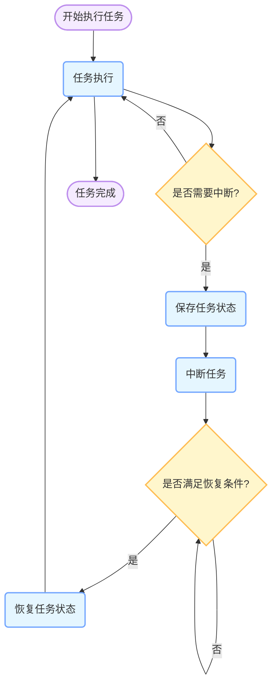

# 实现AI Agent的任务中断与恢复功能

> 关键词：AI Agent、任务中断、任务恢复、状态管理、人工智能

> 摘要：本文聚焦于AI Agent的任务中断与恢复功能的实现。首先介绍了该功能在实际应用中的背景和重要性，阐述了相关的核心概念与联系。接着详细讲解了实现此功能的核心算法原理，通过Python代码给出了具体的操作步骤。同时，运用数学模型和公式对算法进行深入分析，并结合实际例子进行说明。在项目实战部分，提供了开发环境搭建的步骤、源代码实现及详细解读。之后探讨了该功能的实际应用场景，推荐了学习资源、开发工具框架以及相关论文著作。最后对AI Agent任务中断与恢复功能的未来发展趋势和挑战进行总结，并给出常见问题的解答和扩展阅读参考资料。

## 1. 背景介绍 
### 1.1 目的和范围
AI Agent在各种复杂的任务环境中执行任务时，常常会遇到需要中断当前任务并在合适的时候恢复执行的情况。例如，在智能客服场景中，当客户提出紧急问题时，AI Agent需要暂停正在处理的任务去处理紧急问题，处理完后再恢复之前的任务。实现AI Agent的任务中断与恢复功能的目的在于提高AI Agent的灵活性和适应性，使其能够更好地应对动态变化的任务需求。本文的范围涵盖了从核心概念的阐述、算法原理的分析、代码实现到实际应用场景的探讨等方面，旨在为开发者提供一个全面的关于实现该功能的技术指南。

### 1.2 预期读者
本文预期读者主要包括人工智能领域的开发者、软件工程师、对AI Agent技术感兴趣的研究人员以及相关专业的学生。这些读者具备一定的编程基础和人工智能相关知识，希望深入了解AI Agent任务中断与恢复功能的实现原理和方法。

### 1.3 文档结构概述
本文将按照以下结构进行阐述：首先介绍背景信息，包括目的、预期读者和文档结构概述以及相关术语；接着详细讲解核心概念与联系，通过文本示意图和Mermaid流程图展示其架构；然后深入分析核心算法原理，给出Python源代码实现具体操作步骤；再运用数学模型和公式对算法进行详细讲解并举例说明；之后进行项目实战，包括开发环境搭建、源代码实现和代码解读；探讨实际应用场景；推荐相关的学习资源、开发工具框架和论文著作；最后总结未来发展趋势与挑战，提供常见问题解答和扩展阅读参考资料。

### 1.4 术语表
#### 1.4.1 核心术语定义
- **AI Agent**：人工智能代理，是一种能够感知环境、做出决策并执行动作以实现特定目标的软件实体。
- **任务中断**：在AI Agent执行任务的过程中，由于某些原因（如外部事件触发、资源不足等）暂停当前任务的执行。
- **任务恢复**：在任务中断后，当满足一定条件时，AI Agent继续执行之前中断的任务。
- **状态管理**：对AI Agent在执行任务过程中的各种状态信息进行记录、保存和恢复的过程，这些状态信息包括任务的执行进度、当前环境信息等。

#### 1.4.2 相关概念解释
- **上下文信息**：与任务相关的环境信息和历史信息，例如任务的输入参数、已经执行的步骤等，这些信息对于任务的恢复至关重要。
- **断点**：任务中断时的特定位置，记录了任务在该时刻的状态信息，以便后续恢复时能够从该位置继续执行。

#### 1.4.3 缩略词列表
- **AI**：Artificial Intelligence，人工智能
- **IDE**：Integrated Development Environment，集成开发环境

## 2. 核心概念与联系 
### 核心概念原理
AI Agent的任务中断与恢复功能主要基于状态管理和上下文信息的保存与恢复。当AI Agent需要中断任务时，它会将当前任务的状态信息（如变量的值、执行的步骤等）和上下文信息保存下来，形成一个断点。这个断点包含了任务恢复所需的所有关键信息。当满足恢复条件时，AI Agent会读取断点信息，将自身状态恢复到中断时的状态，然后继续执行任务。

### 架构的文本示意图
```plaintext
AI Agent
├── 任务执行模块
│   ├── 任务A
│   ├── 任务B
│   └──...
├── 状态管理模块
│   ├── 保存状态
│   └── 恢复状态
├── 中断检测模块
│   ├── 外部事件检测
│   └── 内部条件检测
└── 恢复决策模块
    ├── 条件判断
    └── 恢复操作
```

### Mermaid流程图


## 3. 核心算法原理 & 具体操作步骤 
### 核心算法原理
实现AI Agent的任务中断与恢复功能的核心算法主要包括状态保存、状态恢复和中断检测三个部分。

#### 状态保存
当需要中断任务时，AI Agent会遍历任务执行过程中的所有相关变量和状态信息，将其保存到一个数据结构中（如字典）。这个数据结构可以存储在本地文件或数据库中，以便后续恢复时使用。

#### 状态恢复
在满足恢复条件时，AI Agent会读取之前保存的状态信息，并将其重新赋值给相应的变量，从而将自身状态恢复到中断时的状态。

#### 中断检测
通过监测外部事件（如用户输入、系统通知等）和内部条件（如资源不足、任务超时等）来判断是否需要中断任务。

### 具体操作步骤及Python源代码
以下是一个简单的Python示例，演示了如何实现AI Agent的任务中断与恢复功能：

```python
import time

# 模拟AI Agent的任务
class AIAgent:
    def __init__(self):
        # 任务状态信息
        self.task_status = {
            "step": 0,
            "progress": 0
        }
        # 保存的断点信息
        self.breakpoint = None

    def execute_task(self):
        while self.task_status["progress"] < 100:
            # 检查是否需要中断任务
            if self.check_interrupt():
                self.save_state()
                print("任务中断，当前进度：{}%".format(self.task_status["progress"]))
                break
            # 模拟任务执行
            self.task_status["step"] += 1
            self.task_status["progress"] += 10
            print("任务执行中，当前进度：{}%".format(self.task_status["progress"]))
            time.sleep(1)
        if self.task_status["progress"] >= 100:
            print("任务完成")

    def check_interrupt(self):
        # 模拟外部事件触发中断
        import random
        return random.random() < 0.2

    def save_state(self):
        # 保存任务状态信息
        self.breakpoint = self.task_status.copy()

    def resume_task(self):
        if self.breakpoint:
            # 恢复任务状态信息
            self.task_status = self.breakpoint.copy()
            print("任务恢复，从进度：{}% 继续执行".format(self.task_status["progress"]))
            self.execute_task()
        else:
            print("没有保存的断点信息，无法恢复任务")

# 创建AI Agent实例
agent = AIAgent()
# 执行任务
agent.execute_task()

# 模拟一段时间后恢复任务
time.sleep(3)
agent.resume_task()
```

### 代码解释
1. **AIAgent类**：表示AI Agent，包含任务状态信息`task_status`和保存的断点信息`breakpoint`。
2. **execute_task方法**：模拟任务执行过程，在每次执行步骤中检查是否需要中断任务。如果需要中断，则调用`save_state`方法保存状态信息。
3. **check_interrupt方法**：模拟外部事件触发中断，通过随机数判断是否需要中断任务。
4. **save_state方法**：将当前任务状态信息保存到`breakpoint`中。
5. **resume_task方法**：如果存在保存的断点信息，则恢复任务状态并继续执行任务。

## 4. 数学模型和公式 & 详细讲解 & 举例说明 
### 数学模型和公式
#### 状态表示
设任务的状态可以用一个向量 $\mathbf{S} = [s_1, s_2, \cdots, s_n]$ 表示，其中 $s_i$ 表示任务的第 $i$ 个状态变量。例如，在上述Python示例中，任务状态可以表示为 $\mathbf{S} = [\text{step}, \text{progress}]$。

#### 状态保存
当任务中断时，将当前状态向量 $\mathbf{S}$ 保存到一个存储结构中，记为 $\mathbf{S}_b$，即 $\mathbf{S}_b = \mathbf{S}$。

#### 状态恢复
在任务恢复时，将保存的状态向量 $\mathbf{S}_b$ 赋值给当前状态向量 $\mathbf{S}$，即 $\mathbf{S} = \mathbf{S}_b$。

### 详细讲解
状态向量 $\mathbf{S}$ 包含了任务执行过程中的所有关键信息，通过保存和恢复这个向量，可以确保任务在中断后能够从正确的位置继续执行。在实际应用中，状态向量的维度和具体内容取决于任务的复杂度和需求。

### 举例说明
假设一个AI Agent正在执行一个文件下载任务，任务状态可以用以下状态向量表示：
$$\mathbf{S} = [\text{下载进度}, \text{已下载字节数}, \text{文件总字节数}, \text{下载速度}]$$
当下载过程中由于网络问题需要中断任务时，将当前状态向量 $\mathbf{S}$ 保存为 $\mathbf{S}_b$。当网络恢复后，将 $\mathbf{S}_b$ 赋值给 $\mathbf{S}$，AI Agent就可以从之前中断的位置继续下载文件。

## 5. 项目实战：代码实际案例和详细解释说明 
### 5.1  开发环境搭建
#### 操作系统
可以选择常见的操作系统，如Windows、Linux（如Ubuntu）或macOS。

#### Python环境
确保已经安装了Python 3.x版本。可以从Python官方网站（https://www.python.org/downloads/）下载并安装。

#### 开发工具
推荐使用以下开发工具：
- **PyCharm**：一款功能强大的Python集成开发环境，提供代码编辑、调试、版本控制等功能。
- **VS Code**：轻量级的代码编辑器，支持Python开发，通过安装相关插件可以实现丰富的功能。

### 5.2  源代码详细实现和代码解读
以下是一个更复杂的项目示例，实现了一个简单的文本处理任务的中断与恢复功能：

```python
import os

# 模拟文本处理任务
class TextProcessingAgent:
    def __init__(self, input_file, output_file):
        self.input_file = input_file
        self.output_file = output_file
        # 任务状态信息
        self.task_status = {
            "line_number": 0,
            "processed_lines": []
        }
        # 保存的断点信息
        self.breakpoint = None

    def execute_task(self):
        try:
            with open(self.input_file, 'r') as infile, open(self.output_file, 'a') as outfile:
                # 恢复任务状态
                if self.breakpoint:
                    self.task_status = self.breakpoint.copy()
                    infile.seek(0)
                    for _ in range(self.task_status["line_number"]):
                        infile.readline()
                    print("任务恢复，从第 {} 行继续处理".format(self.task_status["line_number"]))
                # 处理文本文件
                for line in infile:
                    self.task_status["line_number"] += 1
                    # 模拟处理操作
                    processed_line = line.upper()
                    self.task_status["processed_lines"].append(processed_line)
                    outfile.write(processed_line)
                    # 检查是否需要中断任务
                    if self.check_interrupt():
                        self.save_state()
                        print("任务中断，当前处理到第 {} 行".format(self.task_status["line_number"]))
                        break
            print("任务完成")
        except Exception as e:
            print("任务执行出错：", e)

    def check_interrupt(self):
        # 模拟外部事件触发中断
        import random
        return random.random() < 0.1

    def save_state(self):
        # 保存任务状态信息
        self.breakpoint = self.task_status.copy()
        # 将断点信息保存到文件中
        import json
        with open('breakpoint.json', 'w') as f:
            json.dump(self.breakpoint, f)

    def resume_task(self):
        # 从文件中读取断点信息
        if os.path.exists('breakpoint.json'):
            import json
            with open('breakpoint.json', 'r') as f:
                self.breakpoint = json.load(f)
            self.execute_task()
        else:
            print("没有保存的断点信息，无法恢复任务")

# 创建文本处理代理实例
agent = TextProcessingAgent('input.txt', 'output.txt')
# 执行任务
agent.execute_task()

# 模拟一段时间后恢复任务
import time
time.sleep(3)
agent.resume_task()
```

### 代码解读与分析
1. **TextProcessingAgent类**：表示文本处理代理，包含输入文件路径、输出文件路径、任务状态信息和保存的断点信息。
2. **execute_task方法**：打开输入文件和输出文件，根据断点信息恢复任务状态，然后逐行处理输入文件。在处理过程中，检查是否需要中断任务，如果需要则保存状态信息。
3. **check_interrupt方法**：模拟外部事件触发中断，通过随机数判断是否需要中断任务。
4. **save_state方法**：将当前任务状态信息保存到`breakpoint`中，并将其保存到`breakpoint.json`文件中。
5. **resume_task方法**：从`breakpoint.json`文件中读取断点信息，然后恢复任务状态并继续执行任务。

## 6. 实际应用场景 
### 智能客服
在智能客服场景中，AI Agent可能需要同时处理多个客户的问题。当遇到紧急问题或高优先级客户时，AI Agent可以中断当前正在处理的任务，优先处理紧急问题。处理完后，再恢复之前中断的任务，继续与客户进行沟通。

### 自动化测试
在自动化测试过程中，可能会因为某些原因（如测试环境故障、测试用例失败等）需要中断当前的测试任务。通过实现任务中断与恢复功能，测试人员可以在问题解决后恢复测试任务，继续执行未完成的测试用例，提高测试效率。

### 数据处理
在大数据处理场景中，数据处理任务可能需要处理大量的数据，耗时较长。如果在处理过程中遇到资源不足或其他问题，可以中断任务，保存当前处理进度。当资源充足时，恢复任务继续处理数据，避免重新开始整个处理过程。

### 机器人导航
在机器人导航任务中，机器人可能会遇到障碍物或其他突发情况，需要中断当前的导航任务。当障碍物移除或情况恢复正常后，机器人可以恢复之前的导航任务，继续前往目标位置。

## 7. 工具和资源推荐
### 7.1 学习资源推荐
#### 7.1.1 书籍推荐
- 《人工智能：一种现代的方法》（Artificial Intelligence: A Modern Approach）：这是一本经典的人工智能教材，涵盖了AI Agent、搜索算法、机器学习等多个方面的内容，对理解AI Agent的基本原理和应用有很大帮助。
- 《Python人工智能实战》：本书通过大量的Python代码示例，介绍了人工智能的各个领域，包括AI Agent的实现，适合有一定Python基础的读者学习。

#### 7.1.2 在线课程
- Coursera上的“人工智能基础”（Foundations of Artificial Intelligence）课程：由知名教授授课，系统地介绍了人工智能的基本概念和方法，包括AI Agent的相关知识。
- edX上的“Python for Data Science and AI”课程：该课程着重介绍了Python在数据科学和人工智能领域的应用，对于学习AI Agent的代码实现有很大帮助。

#### 7.1.3 技术博客和网站
- Medium上的人工智能相关博客：Medium上有许多优秀的人工智能博主，他们会分享最新的研究成果和技术实践，对于了解AI Agent的最新发展动态很有帮助。
- 机器之心（https://www.alienzhou.com/）：专注于人工智能领域的资讯和技术分享，提供了大量关于AI Agent的文章和案例分析。

### 7.2 开发工具框架推荐
#### 7.2.1 IDE和编辑器
- PyCharm：功能强大的Python集成开发环境，提供代码自动补全、调试、版本控制等功能，适合专业的Python开发者。
- VS Code：轻量级的代码编辑器，支持Python开发，通过安装相关插件可以实现丰富的功能，如代码格式化、代码分析等。

#### 7.2.2 调试和性能分析工具
- Py-Spy：一个用于分析Python程序性能的工具，可以帮助开发者找出程序中的性能瓶颈。
- PDB：Python自带的调试器，可以在代码中设置断点，逐步执行代码，方便调试程序。

#### 7.2.3 相关框架和库
- TensorFlow：一个开源的机器学习框架，提供了丰富的工具和接口，可用于开发AI Agent的智能决策模块。
- PyTorch：另一个流行的深度学习框架，具有动态图的特点，适合快速开发和实验。

### 7.3 相关论文著作推荐
#### 7.3.1 经典论文
- “Intelligent Agents: Theory and Practice”：该论文系统地介绍了智能代理的理论和实践，对AI Agent的基本概念和架构进行了深入探讨。
- “Reinforcement Learning: An Introduction”：这是强化学习领域的经典论文，对于理解AI Agent如何通过学习来完成任务有很大帮助。

#### 7.3.2 最新研究成果
- 在arXiv上搜索“AI Agent task interruption and resumption”可以找到最新的相关研究论文，了解该领域的最新发展动态。

#### 7.3.3 应用案例分析
- 《人工智能应用案例集》：这本书收集了多个领域的人工智能应用案例，包括AI Agent的应用案例，通过实际案例可以更好地理解AI Agent的任务中断与恢复功能在实际中的应用。

## 8. 总结：未来发展趋势与挑战
### 未来发展趋势
#### 智能化程度提高
未来的AI Agent将具备更高的智能化程度，能够更加智能地判断何时需要中断任务以及如何更好地恢复任务。例如，通过深度学习和强化学习技术，AI Agent可以根据历史数据和当前环境信息自动调整中断和恢复策略。

#### 多模态交互
随着技术的发展，AI Agent将支持多模态交互，如语音、图像、手势等。在任务中断与恢复过程中，用户可以通过多种方式与AI Agent进行交互，提高交互的便捷性和自然度。

#### 分布式协作
AI Agent将更多地参与到分布式系统中，与其他AI Agent或人类进行协作。在分布式环境中，任务中断与恢复功能需要考虑更多的因素，如网络延迟、数据一致性等。

### 挑战
#### 状态管理复杂性
随着任务的复杂度增加，AI Agent的状态信息会变得更加复杂，状态管理的难度也会相应增加。如何有效地保存和恢复复杂的状态信息是一个需要解决的问题。

#### 中断和恢复策略优化
制定合理的中断和恢复策略是一个挑战。不同的任务和应用场景可能需要不同的策略，如何根据具体情况优化策略是提高AI Agent性能的关键。

#### 安全性和可靠性
在任务中断与恢复过程中，需要保证数据的安全性和系统的可靠性。例如，在保存和恢复状态信息时，需要防止数据丢失或损坏，避免系统出现故障。

## 9. 附录：常见问题与解答
### 问题1：任务中断后，保存的状态信息会占用大量的存储空间吗？
解答：这取决于任务的复杂度和状态信息的规模。对于简单的任务，状态信息可能只包含几个变量，占用的存储空间较小。但对于复杂的任务，如大型数据处理任务或深度学习训练任务，状态信息可能会比较大。可以通过压缩算法或选择合适的存储方式来减少存储空间的占用。

### 问题2：如何确保在任务恢复时，系统的环境与中断时一致？
解答：在保存状态信息时，除了保存任务的执行状态，还需要保存系统的环境信息，如当前的工作目录、环境变量等。在恢复任务时，将这些环境信息恢复到中断时的状态，以确保系统环境一致。

### 问题3：如果在任务恢复过程中出现错误，应该如何处理？
解答：可以在恢复过程中添加错误处理机制。当出现错误时，记录错误信息，并尝试回滚到上一个稳定的状态。同时，可以提供用户提示，告知用户任务恢复失败的原因，并提供相应的解决方案。

## 10. 扩展阅读 & 参考资料
### 扩展阅读
- 《强化学习精要：核心算法与TensorFlow实现》：深入介绍了强化学习的核心算法和实现方法，对于理解AI Agent的学习机制有很大帮助。
- 《人工智能哲学》：从哲学的角度探讨了人工智能的本质和发展，有助于拓宽对AI Agent的理解。

### 参考资料
- 人工智能相关的学术期刊，如《Artificial Intelligence》、《Journal of Artificial Intelligence Research》等。
- 相关的技术论坛和社区，如Stack Overflow、GitHub等，可以获取更多的代码示例和技术讨论。

作者：AI天才研究院/AI Genius Institute & 禅与计算机程序设计艺术 /Zen And The Art of Computer Programming