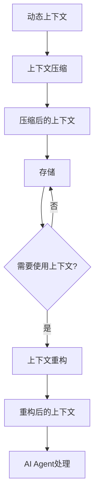

# 实现AI Agent的动态上下文压缩与重构

> 关键词：AI Agent、动态上下文、压缩、重构、自然语言处理、机器学习、智能系统

> 摘要：本文聚焦于AI Agent的动态上下文压缩与重构技术。在当今复杂的智能系统应用场景中，AI Agent需要处理大量的上下文信息，这给系统的存储和处理能力带来了巨大挑战。动态上下文压缩与重构技术能够有效减少数据量，提高处理效率，同时保证信息的完整性和可用性。文章详细阐述了核心概念、算法原理、数学模型，并通过项目实战展示了具体实现过程，还探讨了实际应用场景、推荐了相关工具和资源，最后对未来发展趋势与挑战进行了总结，旨在为相关领域的研究者和开发者提供全面且深入的技术指导。

## 1. 背景介绍 
### 1.1 目的和范围
随着AI技术的飞速发展，AI Agent在各个领域得到了广泛应用，如智能客服、智能写作、智能决策等。在这些应用中，AI Agent需要根据上下文信息来做出准确的决策和响应。然而，上下文信息往往非常庞大和复杂，包含了用户的历史对话、环境信息、任务目标等。这不仅增加了系统的存储负担，还影响了处理效率。因此，实现AI Agent的动态上下文压缩与重构具有重要的现实意义。

本文的范围主要涵盖了动态上下文压缩与重构的基本概念、核心算法、数学模型、实际应用案例以及相关工具和资源推荐等方面。通过对这些内容的深入探讨，帮助读者全面了解和掌握该技术的原理和实现方法。

### 1.2 预期读者
本文预期读者包括但不限于以下几类人群：
- **AI研究者**：对AI Agent技术感兴趣，希望深入研究动态上下文处理技术的专业人士。
- **开发者**：从事智能系统开发，需要在项目中应用动态上下文压缩与重构技术的程序员和软件工程师。
- **学生**：学习计算机科学、人工智能等相关专业，希望了解该领域前沿技术的学生。
- **技术爱好者**：对AI技术有一定了解，想要进一步探索AI Agent内部机制的技术爱好者。

### 1.3 文档结构概述
本文将按照以下结构进行阐述：
1. **背景介绍**：介绍实现AI Agent的动态上下文压缩与重构的目的、范围、预期读者和文档结构概述，以及相关术语的定义和解释。
2. **核心概念与联系**：详细解释动态上下文、压缩、重构等核心概念，并通过文本示意图和Mermaid流程图展示它们之间的联系。
3. **核心算法原理 & 具体操作步骤**：介绍实现动态上下文压缩与重构的核心算法，并用Python源代码详细阐述算法的实现过程。
4. **数学模型和公式 & 详细讲解 & 举例说明**：给出相关的数学模型和公式，并通过具体例子进行详细讲解。
5. **项目实战：代码实际案例和详细解释说明**：通过一个实际项目案例，展示动态上下文压缩与重构技术的具体实现过程，包括开发环境搭建、源代码实现和代码解读。
6. **实际应用场景**：探讨动态上下文压缩与重构技术在不同领域的实际应用场景。
7. **工具和资源推荐**：推荐相关的学习资源、开发工具框架和论文著作。
8. **总结：未来发展趋势与挑战**：总结动态上下文压缩与重构技术的发展趋势，并分析面临的挑战。
9. **附录：常见问题与解答**：解答读者在学习和应用过程中常见的问题。
10. **扩展阅读 & 参考资料**：提供相关的扩展阅读材料和参考资料。

### 1.4 术语表
#### 1.4.1 核心术语定义
- **AI Agent**：人工智能代理，是一种能够感知环境、做出决策并采取行动的智能实体。
- **动态上下文**：在AI Agent运行过程中，随时间和环境变化的相关信息集合，包括用户输入、历史对话、任务状态等。
- **上下文压缩**：将动态上下文中的冗余信息去除，减少数据量，同时保留关键信息的过程。
- **上下文重构**：在需要使用上下文信息时，根据压缩后的信息恢复出原始上下文或近似原始上下文的过程。

#### 1.4.2 相关概念解释
- **自然语言处理（NLP）**：研究如何让计算机理解和处理人类语言的技术领域，在动态上下文处理中起着重要作用。
- **机器学习（ML）**：通过数据训练模型，使模型能够自动学习和改进的技术，可用于上下文压缩与重构算法的优化。
- **信息熵**：衡量信息不确定性的指标，在上下文压缩中可用于评估信息的冗余程度。

#### 1.4.3 缩略词列表
- **NLP**：Natural Language Processing（自然语言处理）
- **ML**：Machine Learning（机器学习）
- **RNN**：Recurrent Neural Network（循环神经网络）
- **LSTM**：Long Short-Term Memory（长短期记忆网络）
- **Transformer**：一种基于注意力机制的深度学习模型

## 2. 核心概念与联系 
### 核心概念原理
#### 动态上下文
动态上下文是AI Agent在运行过程中所涉及的各种信息的集合。这些信息会随着时间、用户交互、环境变化等因素而动态改变。例如，在一个智能客服系统中，动态上下文可能包括用户的历史咨询问题、客服的回复、当前咨询的问题、用户的情绪状态等。动态上下文的存在使得AI Agent能够更好地理解用户的意图，做出更准确的决策和响应。

#### 上下文压缩
上下文压缩的目的是减少动态上下文中的冗余信息，降低数据量，提高系统的存储和处理效率。常见的压缩方法包括基于规则的压缩、基于机器学习的压缩等。基于规则的压缩是通过预先定义的规则来去除冗余信息，例如去除重复的词语、句子等。基于机器学习的压缩则是通过训练模型来学习上下文的特征，自动识别和去除冗余信息。

#### 上下文重构
上下文重构是在需要使用上下文信息时，根据压缩后的信息恢复出原始上下文或近似原始上下文的过程。重构的准确性直接影响到AI Agent对上下文的理解和决策。在重构过程中，需要考虑压缩过程中丢失的信息以及如何通过其他方式进行补充。

### 架构的文本示意图
```plaintext
+----------------------+
|      AI Agent        |
|----------------------|
|  动态上下文管理模块  |
|----------------------|
|  上下文压缩子模块    |
|----------------------|
|  上下文重构子模块    |
+----------------------+
```
在这个架构中，AI Agent的动态上下文管理模块负责管理和维护动态上下文信息。上下文压缩子模块对动态上下文进行压缩处理，减少数据量。上下文重构子模块在需要时根据压缩后的信息进行重构，恢复出可用的上下文信息。

### Mermaid流程图

该流程图展示了动态上下文压缩与重构的整个过程。首先，动态上下文被输入到上下文压缩模块进行压缩，压缩后的上下文被存储起来。当需要使用上下文信息时，从存储中取出压缩后的上下文，经过上下文重构模块进行重构，重构后的上下文被AI Agent用于处理任务。如果不需要使用，则继续存储。

## 3. 核心算法原理 & 具体操作步骤 
### 基于词向量的上下文压缩算法原理
在自然语言处理中，词向量是一种将词语表示为向量的技术。通过词向量，可以将文本信息转换为数值形式，便于计算机处理。基于词向量的上下文压缩算法的基本思想是：将动态上下文中的文本转换为词向量，然后对词向量进行聚类，将相似的词向量合并，从而减少数据量。

### 具体操作步骤
1. **文本预处理**：对动态上下文中的文本进行清洗、分词等预处理操作，去除停用词、标点符号等。
2. **词向量表示**：使用预训练的词向量模型（如Word2Vec、GloVe等）将预处理后的文本转换为词向量。
3. **聚类**：使用聚类算法（如K-Means、DBSCAN等）对词向量进行聚类，将相似的词向量归为一类。
4. **压缩**：对于每个聚类，选择一个代表性的词向量作为该聚类的中心，将该聚类中的其他词向量替换为中心词向量，从而实现上下文的压缩。

### Python源代码实现
```python
import numpy as np
from sklearn.cluster import KMeans
from gensim.models import Word2Vec
import nltk
from nltk.corpus import stopwords
import string

# 下载停用词
nltk.download('stopwords')

# 文本预处理
def preprocess_text(text):
    # 转换为小写
    text = text.lower()
    # 去除标点符号
    text = text.translate(str.maketrans('', '', string.punctuation))
    # 分词
    tokens = nltk.word_tokenize(text)
    # 去除停用词
    stop_words = set(stopwords.words('english'))
    tokens = [token for token in tokens if token not in stop_words]
    return tokens

# 词向量表示
def get_word_vectors(tokens, model):
    word_vectors = []
    for token in tokens:
        if token in model.wv:
            word_vectors.append(model.wv[token])
    return np.array(word_vectors)

# 上下文压缩
def compress_context(word_vectors, num_clusters=5):
    if len(word_vectors) == 0:
        return []
    kmeans = KMeans(n_clusters=num_clusters)
    kmeans.fit(word_vectors)
    cluster_centers = kmeans.cluster_centers_
    labels = kmeans.labels_
    compressed_vectors = []
    for label in set(labels):
        compressed_vectors.append(cluster_centers[label])
    return np.array(compressed_vectors)

# 示例代码
if __name__ == "__main__":
    # 示例动态上下文
    context = "This is a sample sentence for context compression. It contains some words."
    # 文本预处理
    tokens = preprocess_text(context)
    # 训练词向量模型
    sentences = [tokens]
    model = Word2Vec(sentences, min_count=1)
    # 词向量表示
    word_vectors = get_word_vectors(tokens, model)
    # 上下文压缩
    compressed_vectors = compress_context(word_vectors)
    print("Original word vectors shape:", word_vectors.shape)
    print("Compressed word vectors shape:", compressed_vectors.shape)
```
### 代码解释
1. **preprocess_text函数**：对输入的文本进行预处理，包括转换为小写、去除标点符号、分词和去除停用词。
2. **get_word_vectors函数**：将预处理后的文本转换为词向量。
3. **compress_context函数**：使用K-Means聚类算法对词向量进行聚类，将相似的词向量归为一类，并选择聚类中心作为压缩后的词向量。
4. **主程序**：示例动态上下文经过预处理、词向量表示和上下文压缩后，输出原始词向量和压缩后词向量的形状。

## 4. 数学模型和公式 & 详细讲解 & 举例说明 
### 信息熵模型
信息熵是衡量信息不确定性的指标，在上下文压缩中可用于评估信息的冗余程度。信息熵的计算公式为：
$$H(X) = -\sum_{i=1}^{n} p(x_i) \log_2 p(x_i)$$
其中，$X$ 是一个离散随机变量，$x_i$ 是 $X$ 的取值，$p(x_i)$ 是 $x_i$ 出现的概率，$n$ 是 $X$ 的取值个数。

### 详细讲解
信息熵的值越大，说明信息的不确定性越大，冗余程度越低；信息熵的值越小，说明信息的不确定性越小，冗余程度越高。在上下文压缩中，我们希望通过去除冗余信息，降低信息的冗余程度，从而提高信息的熵值。

### 举例说明
假设我们有一个文本集合 $S = \{ "apple", "apple", "banana", "cherry", "cherry", "cherry" \}$。我们可以计算每个词语出现的概率：
- $p("apple") = \frac{2}{6} = \frac{1}{3}$
- $p("banana") = \frac{1}{6}$
- $p("cherry") = \frac{3}{6} = \frac{1}{2}$

然后，根据信息熵的计算公式计算该文本集合的信息熵：
$$H(S) = -\left(\frac{1}{3} \log_2 \frac{1}{3} + \frac{1}{6} \log_2 \frac{1}{6} + \frac{1}{2} \log_2 \frac{1}{2}\right)$$
```python
import math

p_apple = 1/3
p_banana = 1/6
p_cherry = 1/2

entropy = -(p_apple * math.log2(p_apple) + p_banana * math.log2(p_banana) + p_cherry * math.log2(p_cherry))
print("信息熵:", entropy)
```
运行上述代码，我们可以得到该文本集合的信息熵值。通过对文本进行压缩，去除重复的词语，我们可以改变词语的概率分布，从而改变信息熵的值。

### 聚类算法中的距离度量
在上下文压缩的聚类算法中，常用的距离度量方法是欧几里得距离。欧几里得距离的计算公式为：
$$d(x, y) = \sqrt{\sum_{i=1}^{n} (x_i - y_i)^2}$$
其中，$x = (x_1, x_2, \cdots, x_n)$ 和 $y = (y_1, y_2, \cdots, y_n)$ 是两个向量，$n$ 是向量的维度。

### 详细讲解
欧几里得距离衡量的是两个向量之间的直线距离。在聚类算法中，我们通过计算向量之间的欧几里得距离来判断它们的相似程度。距离越近，说明向量越相似，越有可能被归为一类。

### 举例说明
假设我们有两个向量 $x = (1, 2, 3)$ 和 $y = (4, 5, 6)$。我们可以计算它们之间的欧几里得距离：
$$d(x, y) = \sqrt{(1 - 4)^2 + (2 - 5)^2 + (3 - 6)^2} = \sqrt{9 + 9 + 9} = \sqrt{27} \approx 5.2$$
```python
import numpy as np

x = np.array([1, 2, 3])
y = np.array([4, 5, 6])

distance = np.linalg.norm(x - y)
print("欧几里得距离:", distance)
```
运行上述代码，我们可以得到两个向量之间的欧几里得距离。

## 5. 项目实战：代码实际案例和详细解释说明 
### 5.1  开发环境搭建
#### 操作系统
本项目可以在Windows、Linux或macOS等主流操作系统上进行开发。建议使用Linux或macOS，因为它们对Python开发环境的支持更好。

#### Python环境
安装Python 3.6及以上版本。可以从Python官方网站（https://www.python.org/downloads/）下载安装包进行安装。

#### 依赖库安装
使用pip命令安装项目所需的依赖库：
```sh
pip install numpy scikit-learn gensim nltk
```
安装完成后，还需要下载nltk的停用词数据：
```python
import nltk
nltk.download('stopwords')
```

### 5.2  源代码详细实现和代码解读
#### 项目需求
我们要实现一个简单的智能对话系统，该系统能够对用户的历史对话进行动态上下文压缩与重构，以提高系统的性能和效率。

#### 源代码实现
```python
import numpy as np
from sklearn.cluster import KMeans
from gensim.models import Word2Vec
import nltk
from nltk.corpus import stopwords
import string

# 文本预处理
def preprocess_text(text):
    text = text.lower()
    text = text.translate(str.maketrans('', '', string.punctuation))
    tokens = nltk.word_tokenize(text)
    stop_words = set(stopwords.words('english'))
    tokens = [token for token in tokens if token not in stop_words]
    return tokens

# 词向量表示
def get_word_vectors(tokens, model):
    word_vectors = []
    for token in tokens:
        if token in model.wv:
            word_vectors.append(model.wv[token])
    return np.array(word_vectors)

# 上下文压缩
def compress_context(word_vectors, num_clusters=5):
    if len(word_vectors) == 0:
        return []
    kmeans = KMeans(n_clusters=num_clusters)
    kmeans.fit(word_vectors)
    cluster_centers = kmeans.cluster_centers_
    labels = kmeans.labels_
    compressed_vectors = []
    for label in set(labels):
        compressed_vectors.append(cluster_centers[label])
    return np.array(compressed_vectors)

# 上下文重构（简单示例，仅返回聚类中心对应的词语）
def reconstruct_context(compressed_vectors, model):
    reconstructed_text = []
    for vector in compressed_vectors:
        similar_words = model.wv.similar_by_vector(vector, topn=1)
        reconstructed