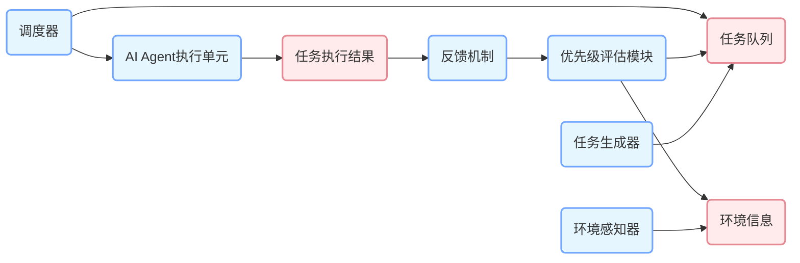

# 实现AI Agent的动态任务优先级调度

> 关键词：AI Agent、动态任务优先级调度、任务管理、优先级算法、资源分配

> 摘要：本文围绕实现AI Agent的动态任务优先级调度展开深入探讨。首先介绍了该主题的背景信息，包括目的、预期读者、文档结构和相关术语。接着阐述了核心概念及其联系，给出了原理和架构的示意图与流程图。详细讲解了核心算法原理，并用Python代码进行具体操作步骤的阐述。引入了相关数学模型和公式，并举例说明。通过项目实战展示代码实际案例及详细解释。分析了实际应用场景，推荐了学习资源、开发工具框架和相关论文著作。最后总结了未来发展趋势与挑战，提供了常见问题解答和扩展阅读参考资料，旨在帮助读者全面理解和掌握AI Agent动态任务优先级调度的技术。

## 1. 背景介绍 
### 1.1 目的和范围
在复杂的现实环境中，AI Agent往往需要同时处理多个任务。这些任务具有不同的性质、要求和紧急程度。动态任务优先级调度的目的在于根据任务的实时状态、环境变化以及Agent自身的资源状况，合理地分配处理任务的顺序和资源，以提高AI Agent的工作效率和响应能力。

本文的范围涵盖了从核心概念的理解、算法原理的分析、数学模型的构建，到实际项目的实现和应用场景的探讨。旨在为读者提供一个全面的关于AI Agent动态任务优先级调度的知识体系。

### 1.2 预期读者
本文预期读者包括对人工智能、机器学习、智能体技术感兴趣的开发者、研究人员和学生。对于那些希望提升AI Agent性能，解决多任务处理问题的专业人士，本文将提供有价值的技术思路和实践指导。

### 1.3 文档结构概述
本文将按照以下结构展开：首先介绍相关背景知识，包括目的、读者群体和文档结构。接着深入探讨核心概念及其联系，通过示意图和流程图进行直观展示。然后详细讲解核心算法原理，并给出Python代码实现。引入数学模型和公式进行理论支持，并举例说明其应用。通过项目实战展示具体代码案例和详细解释。分析实际应用场景，为读者提供实际参考。推荐学习资源、开发工具框架和相关论文著作，帮助读者进一步深入学习。最后总结未来发展趋势与挑战，提供常见问题解答和扩展阅读参考资料。

### 1.4 术语表
#### 1.4.1 核心术语定义
- **AI Agent**：能够感知环境、做出决策并采取行动以实现特定目标的智能实体。
- **动态任务优先级调度**：根据任务的实时信息和环境变化，动态调整任务的优先级顺序，从而决定任务的执行顺序。
- **任务优先级**：衡量任务重要性和紧急程度的指标，用于确定任务在调度队列中的先后顺序。
- **资源分配**：将AI Agent的计算资源、存储资源等合理分配给不同的任务，以确保任务的顺利执行。

#### 1.4.2 相关概念解释
- **任务队列**：用于存储待处理任务的有序列表，任务按照优先级顺序排列。
- **实时性**：指任务需要在规定的时间内完成的特性，实时性高的任务通常具有较高的优先级。
- **任务依赖关系**：某些任务的执行可能依赖于其他任务的完成，这种关系会影响任务的调度顺序。

#### 1.4.3 缩略词列表
- **AI**：Artificial Intelligence（人工智能）
- **CPU**：Central Processing Unit（中央处理器）
- **RAM**：Random Access Memory（随机存取存储器）

## 2. 核心概念与联系 

### 核心概念原理
AI Agent的动态任务优先级调度的核心原理是根据任务的多个属性和环境信息，实时评估任务的优先级，并据此调整任务的执行顺序。任务的属性包括但不限于任务的紧急程度、重要性、预计执行时间、资源需求等。环境信息则包括当前系统的负载、可用资源等。

### 架构示意图


### 详细解释
- **任务生成器**：负责产生各种任务，并将其添加到任务队列中。
- **任务队列**：存储待处理的任务，按照优先级排序。
- **环境感知器**：实时监测系统的环境信息，如CPU使用率、内存占用等。
- **优先级评估模块**：根据任务的属性和环境信息，动态计算任务的优先级。
- **调度器**：根据任务的优先级，从任务队列中选择合适的任务分配给AI Agent执行单元。
- **AI Agent执行单元**：执行具体的任务。
- **反馈机制**：将任务的执行结果反馈给优先级评估模块，以便进行优先级的调整。

## 3. 核心算法原理 & 具体操作步骤 

### 算法原理
我们采用一种基于多属性加权的优先级评估算法。该算法综合考虑任务的多个属性，为每个属性分配一个权重，然后通过加权求和的方式计算任务的优先级。具体公式如下：

$$Priority = w_1 \times Urgency + w_2 \times Importance + w_3 \times ExpectedTime + w_4 \times ResourceDemand$$

其中，$w_1, w_2, w_3, w_4$ 分别是紧急程度、重要性、预计执行时间和资源需求的权重，且 $w_1 + w_2 + w_3 + w_4 = 1$。

### Python源代码实现
```python
class Task:
    def __init__(self, id, urgency, importance, expected_time, resource_demand):
        self.id = id
        self.urgency = urgency
        self.importance = importance
        self.expected_time = expected_time
        self.resource_demand = resource_demand
        self.priority = 0

    def calculate_priority(self, weights):
        w1, w2, w3, w4 = weights
        self.priority = w1 * self.urgency + w2 * self.importance + w3 * self.expected_time + w4 * self.resource_demand
        return self.priority


class TaskScheduler:
    def __init__(self, weights):
        self.weights = weights
        self.task_queue = []

    def add_task(self, task):
        task.calculate_priority(self.weights)
        self.task_queue.append(task)
        self.task_queue.sort(key=lambda x: x.priority, reverse=True)

    def get_next_task(self):
        if self.task_queue:
            return self.task_queue.pop(0)
        return None


# 示例使用
weights = [0.3, 0.3, 0.2, 0.2]
scheduler = TaskScheduler(weights)

task1 = Task(1, 0.8, 0.7, 2, 0.6)
task2 = Task(2, 0.6, 0.8, 3, 0.5)

scheduler.add_task(task1)
scheduler.add_task(task2)

next_task = scheduler.get_next_task()
print(f"Next task to execute: Task {next_task.id} with priority {next_task.priority}")
```

### 具体操作步骤
1. **定义任务类**：创建一个 `Task` 类，包含任务的基本属性和计算优先级的方法。
2. **定义调度器类**：创建一个 `TaskScheduler` 类，包含任务队列和添加任务、获取下一个任务的方法。
3. **初始化调度器**：设置权重参数，创建调度器对象。
4. **创建任务**：实例化多个任务对象，设置任务的属性。
5. **添加任务到调度器**：调用调度器的 `add_task` 方法，将任务添加到任务队列中，并自动计算优先级和排序。
6. **获取下一个任务**：调用调度器的 `get_next_task` 方法，获取优先级最高的任务进行执行。

## 4. 数学模型和公式 & 详细讲解 & 举例说明 

### 数学模型
我们的动态任务优先级调度的数学模型基于多属性决策理论。假设我们有 $n$ 个任务 $T = \{T_1, T_2, \cdots, T_n\}$，每个任务 $T_i$ 有 $m$ 个属性 $A = \{A_1, A_2, \cdots, A_m\}$。每个属性 $A_j$ 对应一个权重 $w_j$，且 $\sum_{j=1}^{m} w_j = 1$。

任务 $T_i$ 的优先级 $P_i$ 可以表示为：

$$P_i = \sum_{j=1}^{m} w_j \times a_{ij}$$

其中，$a_{ij}$ 是任务 $T_i$ 在属性 $A_j$ 上的取值。

### 详细讲解
- **属性选择**：选择合适的属性对于准确评估任务的优先级至关重要。常见的属性包括紧急程度、重要性、预计执行时间、资源需求等。这些属性可以根据具体的应用场景进行调整。
- **权重确定**：权重的确定反映了各个属性在优先级评估中的相对重要性。可以通过专家经验、历史数据统计或机器学习算法来确定权重。
- **优先级计算**：通过加权求和的方式计算任务的优先级，使得每个任务的优先级综合考虑了多个属性的影响。

### 举例说明
假设我们有三个任务 $T_1, T_2, T_3$，四个属性：紧急程度（$A_1$）、重要性（$A_2$）、预计执行时间（$A_3$）、资源需求（$A_4$），权重分别为 $w_1 = 0.3, w_2 = 0.3, w_3 = 0.2, w_4 = 0.2$。

任务属性如下表所示：

| 任务 | 紧急程度 ($a_{i1}$) | 重要性 ($a_{i2}$) | 预计执行时间 ($a_{i3}$) | 资源需求 ($a_{i4}$) |
|------|---------------------|-------------------|-------------------------|---------------------|
| $T_1$ | 0.8 | 0.7 | 2 | 0.6 |
| $T_2$ | 0.6 | 0.8 | 3 | 0.5 |
| $T_3$ | 0.7 | 0.7 | 2.5 | 0.55 |

计算任务的优先级：

- 对于 $T_1$：
  $$P_1 = 0.3 \times 0.8 + 0.3 \times 0.7 + 0.2 \times 2 + 0.2 \times 0.6 = 0.24 + 0.21 + 0.4 + 0.12 = 0.97$$

- 对于 $T_2$：
  $$P_2 = 0.3 \times 0.6 + 0.3 \times 0.8 + 0.2 \times 3 + 0.2 \times 0.5 = 0.18 + 0.24 + 0.6 + 0.1 = 1.12$$

- 对于 $T_3$：
  $$P_3 = 0.3 \times 0.7 + 0.3 \times 0.7 + 0.2 \times 2.5 + 0.2 \times 0.55 = 0.21 + 0.21 + 0.5 + 0.11 = 1.03$$

根据优先级排序为 $T_2 > T_3 > T_1$，因此调度时应先执行 $T_2$，再执行 $T_3$，最后执行 $T_1$。

## 5. 项目实战：代码实际案例和详细解释说明 

### 5.1  开发环境搭建
- **操作系统**：推荐使用 Linux 或 macOS 系统，也可以使用 Windows 系统。
- **Python 版本**：建议使用 Python 3.7 及以上版本。
- **开发工具**：可以使用 PyCharm、VS Code 等集成开发环境（IDE）。

### 5.2  源代码详细实现和代码解读
```python
import heapq


class Task:
    def __init__(self, id, urgency, importance, expected_time, resource_demand):
        self.id = id
        self.urgency = urgency
        self.importance = importance
        self.expected_time = expected_time
        self.resource_demand = resource_demand
        self.priority = 0

    def calculate_priority(self, weights):
        w1, w2, w3, w4 = weights
        self.priority = w1 * self.urgency + w2 * self.importance + w3 * self.expected_time + w4 * self.resource_demand
        return self.priority

    def __lt__(self, other):
        return self.priority > other.priority


class TaskScheduler:
    def __init__(self, weights):
        self.weights = weights
        self.task_queue = []

    def add_task(self, task):
        task.calculate_priority(self.weights)
        heapq.heappush(self.task_queue, task)

    def get_next_task(self):
        if self.task_queue:
            return heapq.heappop(self.task_queue)
        return None


# 模拟环境变化和任务执行
class Environment:
    def __init__(self):
        self.cpu_usage = 0.2
        self.memory_usage = 0.3

    def update_environment(self):
        # 模拟环境变化
        import random
        self.cpu_usage = min(1.0, max(0.0, self.cpu_usage + random.uniform(-0.1, 0.1)))
        self.memory_usage = min(1.0, max(0.0, self.memory_usage + random.uniform(-0.1, 0.1)))


# 主程序
if __name__ == "__main__":
    weights = [0.3, 0.3, 0.2, 0.2]
    scheduler = TaskScheduler(weights)
    environment = Environment()

    task1 = Task(1, 0.8, 0.7, 2, 0.6)
    task2 = Task(2, 0.6, 0.8, 3, 0.5)
    task3 = Task(3, 0.7, 0.7, 2.5, 0.55)

    scheduler.add_task(task1)
    scheduler.add_task(task2)
    scheduler.add_task(task3)

    for _ in range(3):
        next_task = scheduler.get_next_task()
        if next_task:
            print(f"Executing Task {next_task.id} with priority {next_task.priority}")
            # 模拟任务执行和环境更新
            environment.update_environment()
            print(f"Current CPU usage: {environment.cpu_usage}, Memory usage: {environment.memory_usage}")


```

### 代码解读与分析
- **Task 类**：
  - `__init__` 方法：初始化任务的基本属性。
  - `calculate_priority` 方法：根据权重计算任务的优先级。
  - `__lt__` 方法：用于定义任务在堆中的比较规则，确保优先级高的任务排在前面。

- **TaskScheduler 类**：
  - `__init__` 方法：初始化调度器，设置权重和任务队列。
  - `add_task` 方法：将任务添加到任务队列中，并使用 `heapq.heappush` 方法维护队列的优先级顺序。
  - `get_next_task` 方法：从任务队列中取出优先级最高的任务，并使用 `heapq.heappop` 方法更新队列。

- **Environment 类**：
  - `__init__` 方法：初始化环境信息，包括 CPU 使用率和内存使用率。
  - `update_environment` 方法：模拟环境的动态变化。

- **主程序**：
  - 创建调度器和环境对象。
  - 创建多个任务并添加到调度器中。
  - 循环执行任务，每次执行后更新环境信息。

## 6. 实际应用场景 
### 智能客服系统
在智能客服系统中，AI Agent 需要处理大量的用户咨询任务。不同的咨询可能具有不同的紧急程度和重要性，例如，涉及到安全问题的咨询通常具有较高的优先级。通过动态任务优先级调度，AI Agent 可以优先处理紧急和重要的咨询，提高用户满意度。

### 自动驾驶汽车
自动驾驶汽车需要实时处理各种传感器数据和决策任务，如避障、路径规划等。不同的任务具有不同的实时性要求，例如，避障任务需要在极短的时间内完成，因此具有较高的优先级。动态任务优先级调度可以确保自动驾驶汽车在复杂环境下安全、高效地行驶。

### 工业自动化
在工业自动化生产线上，AI Agent 负责控制各种设备和执行生产任务。不同的生产任务可能具有不同的时间要求和资源需求，例如，紧急订单的生产任务需要优先处理。通过动态任务优先级调度，可以优化生产流程，提高生产效率。

## 7. 工具和资源推荐
### 7.1 学习资源推荐
#### 7.1.1 书籍推荐
- 《人工智能：一种现代的方法》：全面介绍了人工智能的基本概念、算法和应用，对于理解 AI Agent 相关知识非常有帮助。
- 《Python 机器学习》：详细讲解了 Python 在机器学习领域的应用，包括算法实现和案例分析。

#### 7.1.2 在线课程
- Coursera 上的“人工智能基础”课程：由知名教授授课，系统地介绍了人工智能的基础知识和技术。
- edX 上的“Python 数据科学”课程：帮助学习者掌握 Python 在数据处理和分析方面的技能。

#### 7.1.3 技术博客和网站
- Medium：有许多关于人工智能和机器学习的技术文章，涵盖了最新的研究成果和实践经验。
- arXiv：提供了大量的学术论文，对于深入研究动态任务优先级调度等相关领域有很大的帮助。

### 7.2 开发工具框架推荐
#### 7.2.1 IDE和编辑器
- PyCharm：功能强大的 Python 集成开发环境，提供了代码编辑、调试、版本控制等丰富的功能。
- VS Code：轻量级的代码编辑器，支持多种编程语言，具有丰富的插件生态系统。

#### 7.2.2 调试和性能分析工具
- pdb：Python 内置的调试器，可以帮助开发者定位和解决代码中的问题。
- cProfile：Python 的性能分析工具，可以分析代码的运行时间和资源消耗情况。

#### 7.2.3 相关框架和库
- NumPy：用于科学计算的 Python 库，提供了高效的数组操作和数学函数。
- Pandas：用于数据处理和分析的 Python 库，提供了丰富的数据结构和数据操作方法。

### 7.3 相关论文著作推荐
#### 7.3.1 经典论文
- “A Survey of Task Scheduling Algorithms for Parallel Systems”：对并行系统中的任务调度算法进行了全面的综述，为动态任务优先级调度提供了理论基础。
- “Dynamic Task Scheduling in Multi-Agent Systems”：研究了多智能体系统中的动态任务调度问题，提出了一些有效的调度策略。

#### 7.3.2 最新研究成果
- 关注顶级学术会议如 AAAI、IJCAI 等上发表的关于动态任务优先级调度的最新研究论文，了解该领域的前沿技术和发展趋势。

#### 7.3.3 应用案例分析
- 一些实际应用案例的研究报告，如智能物流系统、医疗诊断系统等中的动态任务优先级调度应用，对于理解和应用该技术具有重要的参考价值。

## 8. 总结：未来发展趋势与挑战
### 未来发展趋势
- **与深度学习的融合**：将深度学习技术应用于动态任务优先级调度中，通过学习大量的历史数据和任务模式，自动调整任务的优先级和调度策略，提高调度的准确性和智能性。
- **多智能体协同调度**：在多智能体系统中，各个智能体之间需要协同工作，共同完成复杂的任务。未来的研究将关注如何实现多智能体之间的动态任务优先级调度，提高系统的整体性能和效率。
- **自适应调度**：随着环境的不断变化，任务的优先级也需要实时调整。未来的调度算法将更加注重自适应能力，能够根据环境的动态变化自动调整调度策略。

### 挑战
- **复杂环境建模**：现实环境往往非常复杂，包含大量的不确定因素和动态变化。如何准确地建模这些环境因素，并将其纳入到任务优先级调度算法中，是一个巨大的挑战。
- **计算资源限制**：动态任务优先级调度需要实时计算任务的优先级和进行调度决策，这对计算资源提出了较高的要求。在资源受限的情况下，如何保证调度算法的高效运行是一个亟待解决的问题。
- **任务冲突解决**：在多任务处理过程中，可能会出现任务之间的冲突，如资源竞争、时间冲突等。如何有效地解决这些冲突，保证任务的顺利执行，是动态任务优先级调度面临的重要挑战之一。

## 9. 附录：常见问题与解答
### 问题 1：如何确定任务属性的权重？
答：可以通过以下几种方法确定任务属性的权重：
- 专家经验：邀请领域专家根据他们的经验和知识，对各个属性的重要性进行评估，从而确定权重。
- 历史数据统计：分析历史任务数据，统计各个属性对任务完成情况的影响程度，根据统计结果确定权重。
- 机器学习算法：使用机器学习算法，如神经网络、决策树等，对历史数据进行训练，自动学习各个属性的权重。

### 问题 2：如果任务的属性发生变化，如何更新任务的优先级？
答：当任务的属性发生变化时，需要重新调用任务的 `calculate_priority` 方法，根据新的属性值和权重计算任务的优先级。然后，将任务从任务队列中移除，重新添加到队列中，调度器会自动根据新的优先级对任务进行排序。

### 问题 3：在多智能体系统中，如何避免多个智能体同时处理同一个任务？
答：可以采用以下几种方法避免多个智能体同时处理同一个任务：
- 任务分配机制：在任务分配阶段，为每个任务指定唯一的处理智能体，避免任务的重复分配。
- 任务状态管理：为每个任务维护一个状态信息，如“已分配”、“正在处理”、“已完成”等。智能体在选择任务时，首先检查任务的状态，只选择状态为“待处理”的任务。
- 通信机制：智能体之间通过通信机制进行信息共享，当一个智能体选择了某个任务后，及时通知其他智能体，避免其他智能体再次选择该任务。

## 10. 扩展阅读 & 参考资料
- 《人工智能算法（卷 3）：深度学习和神经网络》
- 《多智能体系统：原理与应用》
- AAAI 会议论文集
- IJCAI 会议论文集

作者：AI天才研究院/AI Genius Institute & 禅与计算机程序设计艺术 /Zen And The Art of Computer Programming